# 前言
as0的环境配置和as1的画三角形是一些简单的线代基础知识，因而略过。

从as2开始，可以感受到明显的难度提升，需要对Eigen的一些数据结构与函数进行阅读，乍一看其他版本的作业答案会觉得非常跳跃，读起来有明显的障碍，因此准备做此笔记。
## 作业2 光栅化三角形 & 简单的4x超采样

### 作业要求
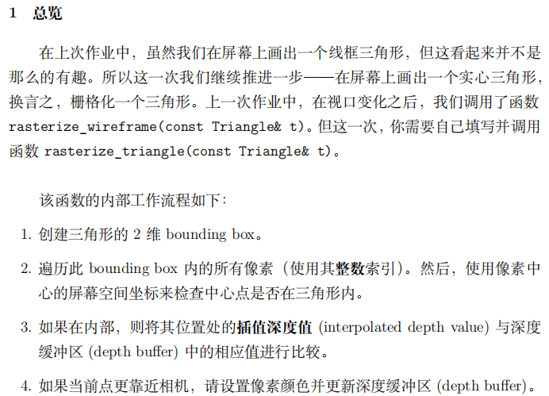

简单看一下代码框架，随着main() -> draw() -> rasterize_rectangle()，执行到rasterize_rectangle时，已经完成了MVP变换矩阵的准备。

### 基础功能实践
看完要求的第一个问题是，代码框架里是如何规定像素、以及通过**整数索引**控制像素的？

在程序中搜索pixel，发现这样一个函数：
```cpp
void rst::rasterizer::set_pixel(const Eigen::Vector3f& point, const Eigen::Vector3f& color){
    auto ind=(height-1-point.y())*width+point.x();
    frame_buf[ind]=color;
}
```
单看参数表就能很直观地猜出其功能：将坐标point涂成color颜色。可以想见，作为Vector3f的point是一个屏幕上的二维齐次点，而color中的三维是RGB三通道值。

我进行了一个随意的写，可以看一下其直观效果。

```cpp
void rst::rasterizer::rasterize_triangle(const Triangle& t) {
    //auto v = t.toVector4();
    
    for(int i=0;i<=40;i++){
        for(int j=0;j<=40;j++){
            set_pixel(Eigen::Vector3f(i,j,1),Eigen::Vector3f(256,0,0));
        }
    }
}
```
可以看到，这段代码将[0,0]到[40,40]的左下角一片像素涂成了(256,0,0)，也就是纯红色。
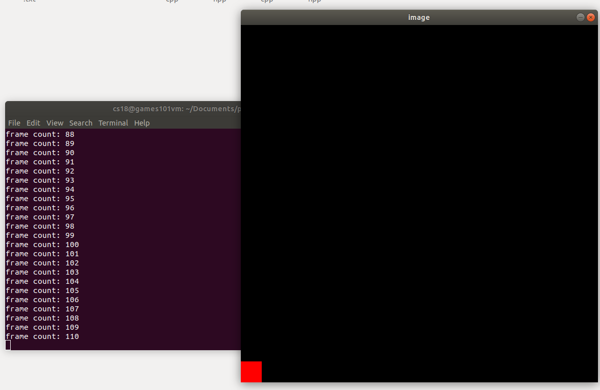
有了这个set_pixel，后面的工作就好办了。

首先写个inside判断，主要就是利用内部点必定在三个边向量左侧：
```cpp
static bool insideTriangle(int x, int y, const Vector3f* _v)
{   
    // TODO : Implement this function to check if the point (x, y) is inside the triangle represented by _v[0], _v[1], _v[2]
    Eigen::Vector2f v0,v1,v2,p;
    v0=Eigen::Vector2f(_v[0]);
    v1=Eigen::Vector2f(_v[1]);
    v2=Eigen::Vector2f(_v[2]);
    p=Eigen::Vector2f(x,y);
    
    if(((v1-v0).cross(p-v0)).z()<0)return false;
    if(((v2-v1).cross(p-v1)).z()<0)return false;
    if(((v0-v2).cross(p-v2)).z()<0)return false;
    return true;
}
```

下一个问题是，rasterize_triangle只有一个输入参数t，t中有哪些数据可用？如何使用？
再次开启寻血猎犬，t的顶点数据来自于v[]
```cpp
for (int i = 0; i < 3; ++i)
{
    t.setVertex(i, v[i].head<3>());
    t.setVertex(i, v[i].head<3>());
    t.setVertex(i, v[i].head<3>());
}

auto col_x = col[i[0]];
auto col_y = col[i[1]];
auto col_z = col[i[2]];

t.setColor(0, col_x[0], col_x[1], col_x[2]);
t.setColor(1, col_y[0], col_y[1], col_y[2]);
t.setColor(2, col_z[0], col_z[1], col_z[2]);
```
v[]来自于pos_buf顶点位置缓冲配合ind_buf顶点索引缓冲，其经过一系列的加工，包括齐次化、mvp变换、标准化(/w)等。
我们来做一些实验，看一看Triangle t在绘制时的内部数据。

**实验一**
```cpp
void rst:rasterizer::rasterize_triangle(const Triangle &t){
    auto v=t.toVector4();

    for(auto k:v){
        std::cout<<k.x()<<" ";
        std::cout<<k.y()<<" ";
        std::cout<<k.z()<<" ";
        std::cout<<k.w()<<" ";
        std::cout<<std::endl;
    }
}
```

结果是这样的：
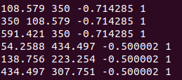

也就是说，作为array，t.toVector4()里共有6个元素。这对应了我们程序中两个不同的三角形的六个顶点。在程序运行到这里的时候，t中的顶点已经进行过mvp处理。

不知道你们有没有产生这样的疑问：既然已经完成了mvp变换，为什么顶点数据是四维的？

首先，在最一开始，我们的输入数据就是一些Vector3f点，但为了做矩阵乘法(当中自然包括仿射变换)，必须齐次坐标化，于是我们人为把他们做成了四维点；

在mvp结束后，我们只是把所有空间三维点(四维坐标)转换到了规范的[-1，1]空间里，尚且没有完成向二维的转换。但是我们也可以回忆一下，其实在mvp完成之后，所有点的z坐标已经自动变成了深度，如果不利用深度信息，以正交投影的性质，直接摒弃z坐标得到的二维点坐标就是投影结果了。

下面我们要计算包围盒，既然已经有了六个顶点的详细数据，这显然是容易做的。

**问题1**
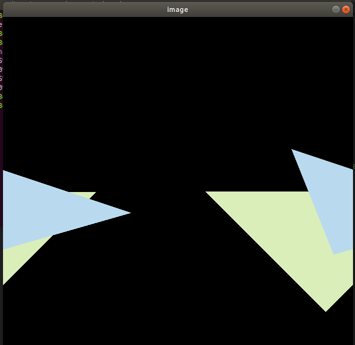

非常离谱的是，在我发现循环变量i j 被设置成了float，而inside函数的输入要求的是int时，尝试了修改循环变量i j为int之后就恢复了正常：
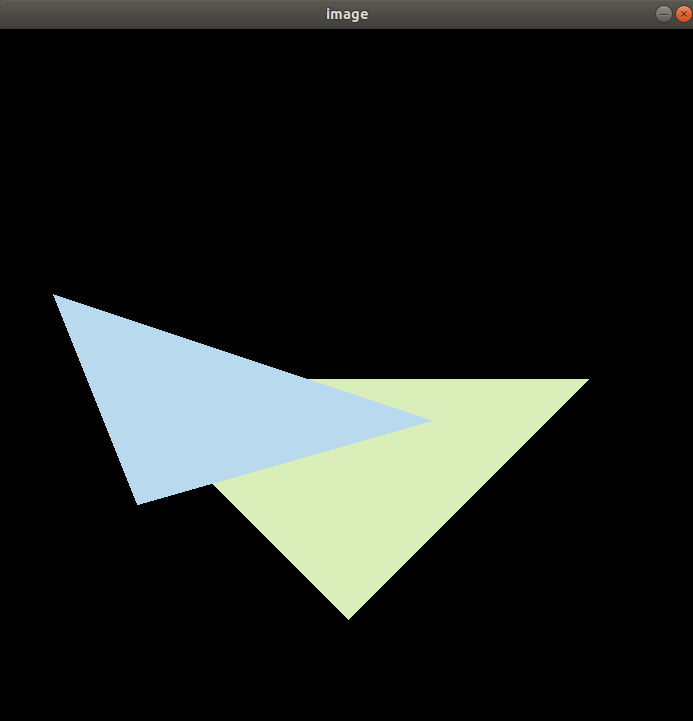

而目前，我完全没有编写z部分，没有写depth，却依然有这样不错的遮挡效果。当然，在参照了标准输出之后就会发现，这六个点作为输入的两个三角形，蓝色三角形应当被绿色三角形遮挡住。显然，不写z-test是完全不行的。

下面的问题就是，如何使用深度值，把z值传递到何处加以利用。

首先来看注释部分提示的插值代码，
```cpp
static std::tuple<float, float, float> computeBarycentric2D(float x, float y, const Vector3f* v)
{
    float c1 = (x*(v[1].y() - v[2].y()) + (v[2].x() - v[1].x())*y + v[1].x()*v[2].y() - v[2].x()*v[1].y())
     / (v[0].x()*(v[1].y() - v[2].y()) + (v[2].x() - v[1].x())*v[0].y() + v[1].x()*v[2].y() - v[2].x()*v[1].y());
    float c2 = (x*(v[2].y() - v[0].y()) + (v[0].x() - v[2].x())*y + v[2].x()*v[0].y() - v[0].x()*v[2].y()) / (v[1].x()*(v[2].y() - v[0].y()) + (v[0].x() - v[2].x())*v[1].y() + v[2].x()*v[0].y() - v[0].x()*v[2].y());
    float c3 = (x*(v[0].y() - v[1].y()) + (v[1].x() - v[0].x())*y + v[0].x()*v[1].y() - v[1].x()*v[0].y()) / (v[2].x()*(v[0].y() - v[1].y()) + (v[1].x() - v[0].x())*v[2].y() + v[0].x()*v[1].y() - v[1].x()*v[0].y());
    return {c1,c2,c3};
}


auto[alpha, beta, gamma] = computeBarycentric2D(x, y, t.v);

```
正巧在做作业时看到《算法导论》，这里对应了三十章所介绍的拉格朗日公式
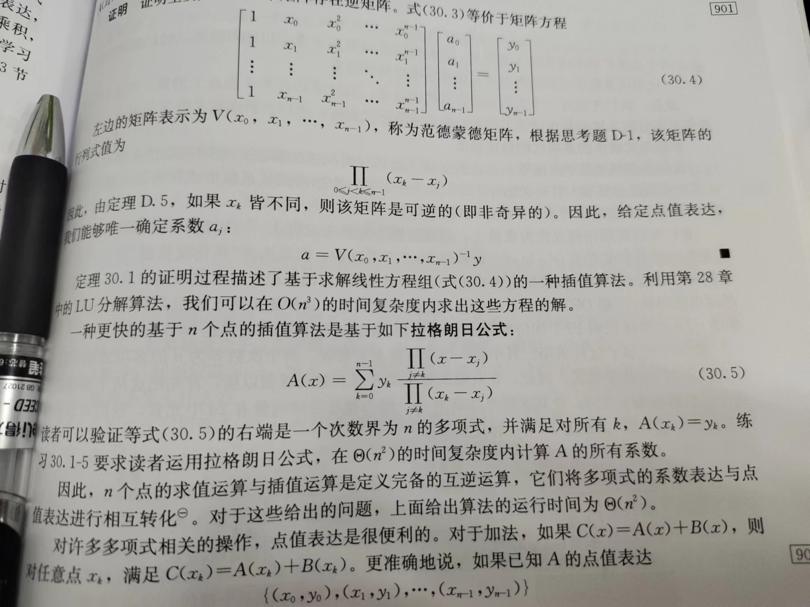
所谓插值，在101课程当中初遇的介绍是类似于**平均**的计算，比如要将一条线上各个点的颜色插值，就要拿到两个端点的颜色c0,c1,在i分位点(0<=i<=1)颜色的值就会是`ic0+(1-i)c1`,对于三个通道都这样做就得到了一个渐变的颜色效果。同时，我们还可以为两个点求中点、三个点求中心，这些都是插值的过程。

而数学上对于插值的定义是：从一个多项式的点值获得其系数表达式。
譬如一个一元函数，我们知道其在xoy坐标上经过(1,2) (3,5)两个点，按理说我们可以写出无数个函数值来，但我们显然能写出其中一个:(y-2)/(5-2)=(x-1)/(3-1);其为一条直线。这其实就是解析几何中提到过的直线的**两点式**，是一个拉格朗日公式的最简单形式。

为什么这两个看似不同的过程都叫做**插值Interpolation**呢？

其实，我们所做的插值过程无一例外都是先根据已有的点求出一个插值多项式/函数/分布，然后再把特定点带入这个函数来求值。两者本质上是同一的。


这里拿着三角形的三个顶点v[0] v[1] v[2] 与点(x,y)去求质心（可以这样理解：三个顶点有不同的重量weight，会导致重心并不在数学中心，所以应当带着三个点的坐标和三个顶点的weight才能求出质心坐标以及其weight，这里的weight其实就是深度z），最终求得的三个值(alpha,beta,gamma)还要进一步运算才能最终求得z的插值：
```cpp
float w_reciprocal = 1.0/(alpha / v[0].w() + beta / v[1].w() + gamma / v[2].w());
float z_interpolated = alpha * v[0].z() / v[0].w() + beta * v[1].z() / v[1].w() + gamma * v[2].z() / v[2].w();
z_interpolated *= w_reciprocal;
```

因此，简单概括一下当下的目的：**已知三角形三个顶点的坐标以及各自的z值，求当前点(x,y)的插值z值**。
本着实用主义，并不需要去理解这里的插值过程，而如果想要深究一番，可以看我下面根据自己理解做的插值推导。
对于**两个二维点插值**会得到一个**二维直线两点式方程**，那么对于**三个三维点插值**自然会得到一个**三维平面三点式方程**：
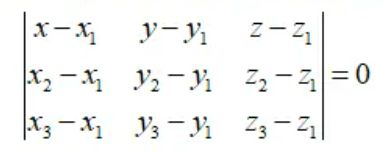
通过我的推导也可以得到z的插值结果，我认为是形式看起来更复杂、但推导过程更清晰，只是带入了平面方程，非常直观好理解。
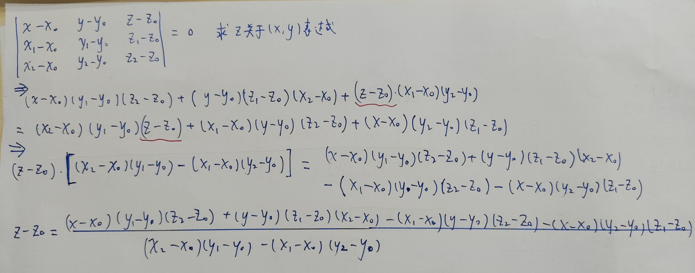

我们还可以编写程序来校验这样的替代算法，插值结果是否还一样：
```cpp
std::cout<<"Debug on:"<<std::endl;
   float alpha,beta,gamma;
   float x=140;
   float y=140;
   std::tie(alpha, beta, gamma) = computeBarycentric2D(x, y, t.v);
   float w_interpolation=1.0/(alpha/v[0].w()+beta/v[1].w()+gamma/v[2].w());
   float z_interpolation=alpha*v[0].z()/v[0].w()+beta*v[1].z()/v[1].w()+gamma*v[2].z()/v[2].w();
   
   //My method
   float x0=v[0].x()/v[0].w();
   float y0=v[0].y()/v[0].w();
   float z0=v[0].z()/v[0].w();

   float x1=v[1].x()/v[1].w();
   float y1=v[1].y()/v[1].w();
   float z1=v[1].z()/v[1].w();

   float x2=v[2].x()/v[2].w();
   float y2=v[2].y()/v[2].w();
   float z2=v[2].z()/v[2].w();

    float my_z_interpolation=(x-x0)*(y1-y0)*(z2-z0)+(y-y0)*(z1-z0)*(x2-x0)-(x1-x0)*(y-y0)*(z2-z0)-(x-x0)*(y2-y0)*(z1-z0);
    my_z_interpolation/=((x2-x0)*(y1-y0)-(x1-x0)*(y2-y0));
    my_z_interpolation+=z0;

    std::cout<<"given method z="<<z_interpolation<<std::endl; 
    std::cout<<"my method z="<<my_z_interpolation<<std::endl; 
   std::cout<<"Debug end:"<<std::endl; 
```
结果输出如下：
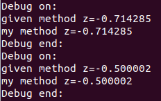
(有一说一我觉得我的比闫老师的代码简单还好理解 狗头保命)

扯得有点远了，言归正传：我们现在已经做好了任意点的插值，下面就是要进行z-test了。首先完成一个前置问题，这里各个点的z值有没有预存放的位置，如何去访问？
depth_buf数组是深度缓冲，这与实际的渲染过程中一样，用一个专门的内存来保存深度值，形成一张深度纹理。深度纹理按理说是一个二维数组，而这里使用了这样的技巧：可以通过对像素(i，j)的特定方法编址，让每一个像素都领到一个确定的一维id，比如像数麻雀一样先横着数再竖着数，这样只要用一个get_index(i,j)迅速算出其id，在查找一个一维数组就能达到同样的目的了。

同时还要注意一个细节，我们所能看到的点，z一定是负值。这也导致了near平面和far平面相比，near平面是更大的。比较深度时深度小的实际更远，应当被遮住。而且，depth_buf中只存储正值。具体为什么这样做会在后面继续学习。

这样我们就得到了作业基础需求的代码：
```cpp
void rst::rasterizer::rasterize_triangle(const Triangle &t)
{
    auto v = t.toVector4();
    float l = INT_MAX;
    float r = INT_MIN;
    float top = INT_MIN;
    float b = INT_MAX;

    for (auto k : v)
    {
        l = k.x() < l ? k.x() : l;
        r = k.x() > r ? k.x() : r;
        top = k.y() > top ? k.y() : top;
        b = k.y() < b ? k.y() : b;
    }
    float x0 = v[0].x() / v[0].w();
    float y0 = v[0].y() / v[0].w();
    float z0 = v[0].z() / v[0].w();

    float x1 = v[1].x() / v[1].w();
    float y1 = v[1].y() / v[1].w();
    float z1 = v[1].z() / v[1].w();

    float x2 = v[2].x() / v[2].w();
    float y2 = v[2].y() / v[2].w();
    float z2 = v[2].z() / v[2].w();
    for (int i = (int)l; i <= r; i++)
    {
        for (int j = (int)b; j <= top; j++)
        {
            if (insideTriangle(i, j, t.v))
            {
                float x=i+0.5;
                float y=j+0.5;
                

                float my_z_interpolation = (x - x0) * (y1 - y0) * (z2 - z0) + (y - y0) * (z1 - z0) * (x2 - x0) - (x1 - x0) * (y - y0) * (z2 - z0) - (x - x0) * (y2 - y0) * (z1 - z0);
                my_z_interpolation /= ((x2 - x0) * (y1 - y0) - (x1 - x0) * (y2 - y0));
                my_z_interpolation += z0;

                if(my_z_interpolation>-depth_buf[get_index(i,j)]){
                    //The larger depth, the nearer the point is, which should be repainted
                    depth_buf[get_index(i,j)]=-my_z_interpolation;
                    set_pixel(Eigen::Vector3f(i, j, 1), t.getColor());
                    //Depth_buf store positive number
                }               
            }
        }
    }
}
```
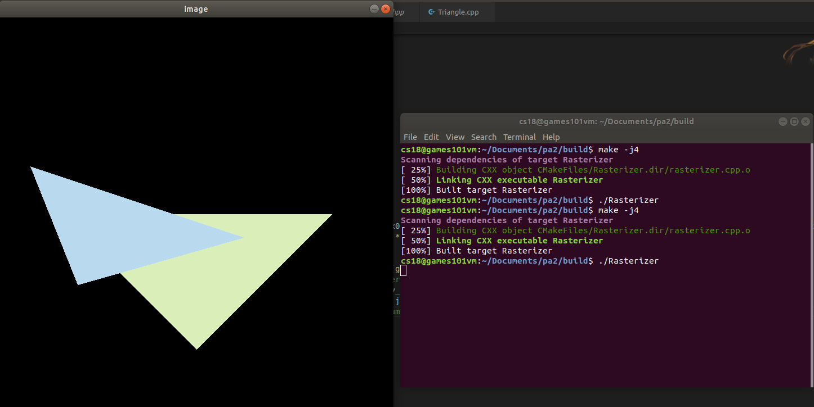
等一下，为什么我还是蓝色在外面啊？

我一气之下描了点，发现了许多事情。首先，近处的三角形颜色是(217,238,185)草绿色，坐标为(0,2,-2)(2,0,-2)(-2,0,-2).其从z正向向z负向看过去，是**正立摆放**的（斜边在xoy平面）,而在图中显然它是倒悬的。也就是说，除了遮挡关系，似乎简单的单一三角形也有问题。根据描点，无疑，z=-5的淡蓝色三角形离我们更远。

查阅了课程bbs后我发现了这是一个通病：
```
透视投影错了，main函数里输入的zNear和zFar都是正值，透视投影的n和f是负值，令n = -zNear, f = -zFar再代入计算，
而且你再检查下你那个正视投影矩阵正确吗？
修正后，你应该还会遇到三角形绘制顺序颠倒的问题，参考下面的回答
https://games-cn.org/forums/topic/guanyuzuoye2lianggesanjiaoxingzhongdiebufendez-bufferwenti/
```

(原来自认为简单的AS1其实也错了)

修改了projection函数之后就得到了正确结果：
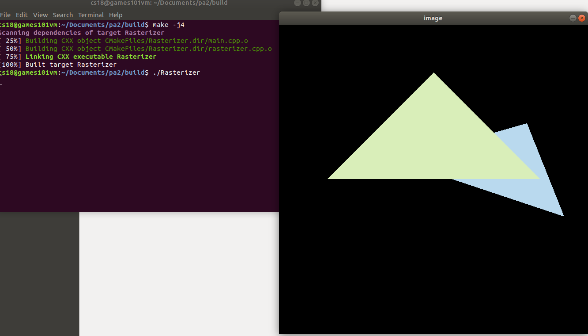

### 提升需求1 颜色插值
这部分的项目代码可以查阅个人github
https://github.com/quaintSenator/games101AS2
简单一提，作业框架已经提供了相当完备的底层代码，主要是通过getColor获取顶点颜色， 然后像插值z一样插值顶点的r，g和b三通道值。注意，setColor中把rgb值/255来存储，如果忽略会导致所有颜色都是小于1的浮点数，从而整个画面都是黑色。

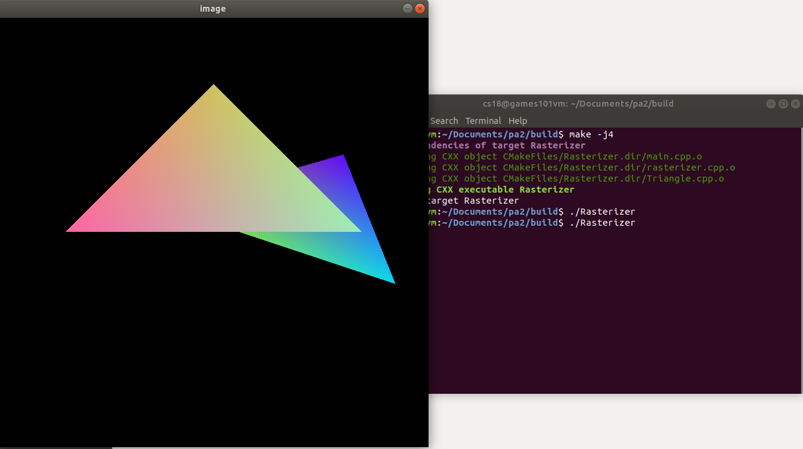
### 提升需求2 MSAA

给锯齿一个特写：

我注意到有的作业在frame_buf之外又维护了一个4倍大小的sample_frame_buf来缓存所有像素的四个采样，甚至推算到，如果这个缓冲扩大四倍，只要让get_index(i,j)*4,再加上1，2的偏移就能精确定位到每一个子像素。我认为这没有暂时没有必要，这个4倍帧似乎在本需求中似乎没有在任何层面上提升性能(毕竟作业指名道姓说了不必考虑复用)，而占用了较大的内存。

可以借鉴的是，把四个点重排列一下就可以用一个数组来表示增量了：
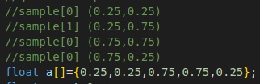

编写好之后，明显感觉到跑的时间长了许多，明明只是输出一个不变的图像，开始运行后大约得等4-5秒才能看到画面。这也确实体现了超采样对于机器性能的压迫。
重新特写一下边缘，确实发现锯齿有了明显的消散。
