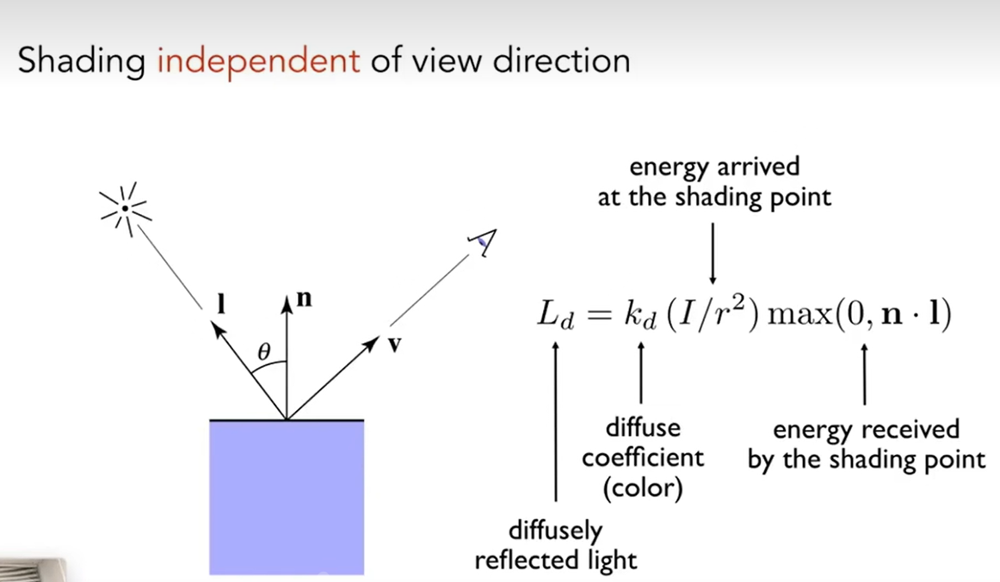
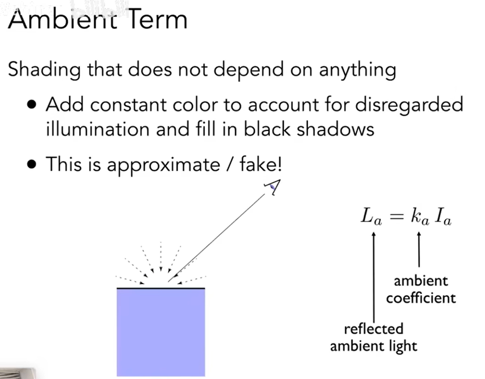
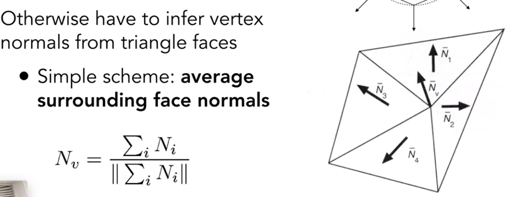
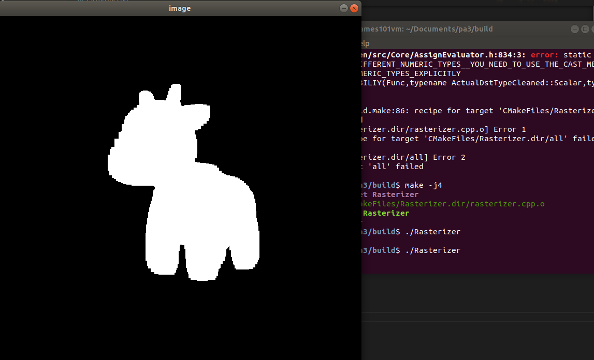
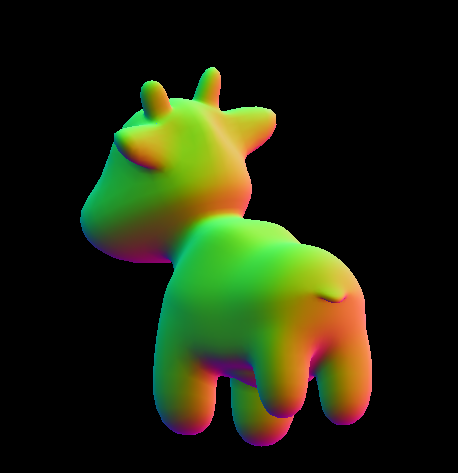
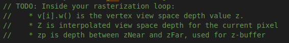
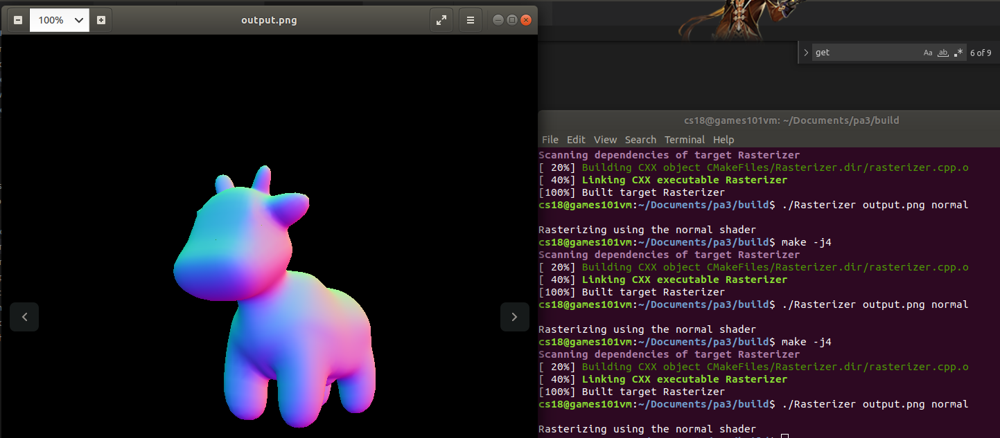
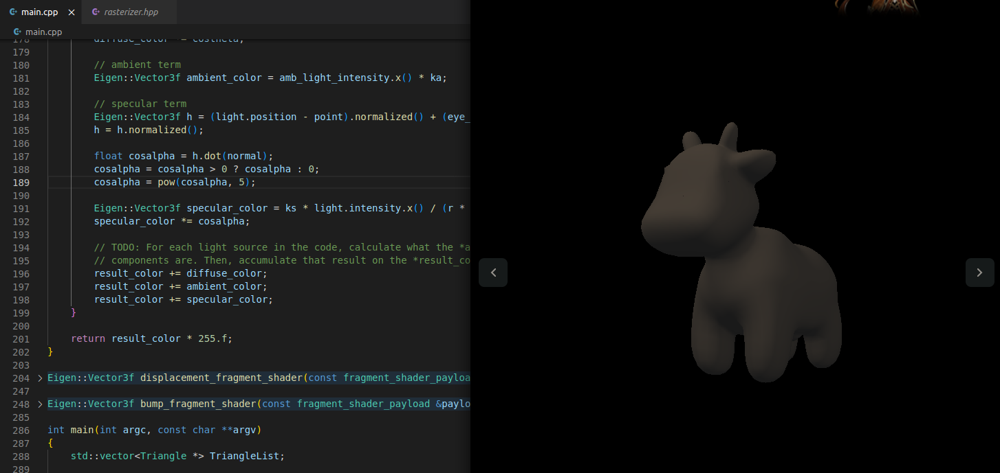
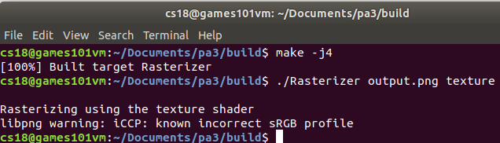
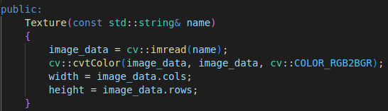

# 前言
在AS2中我添加了一些个人的想法，而在本次作业中我将更加大胆地尝试新的内容。我们知道第三次作业的要求是渲染一直小奶牛。我的额外需求来自于，我在翻阅作业框架文件时发现model当中出现了后缀为3ds和blend的文件：

这应该是用3dsMax和blender做出的模型。import到3ds Max中就可以看到，的确是一些简单的建模。


因此，我设计了一个额外需求：自己使用上述建模软件捏一个模型，并用这段渲染程序来展示。

## 作业3 画奶牛 & 模型应用

### 前置知识回顾:布林冯模型
blinn-phong模型中的几个重要知识：

#### specular reflection

镜面反射中的重要概念是半程向量，由于v与l都是单位向量，他们直接相加再除以模就能得到所谓半程向量，这是一个指向两个向量**角平分线方向**的**单位向量**。
这里的镜面反射公式，采用了一个cos值来反应视线方向对于镜面反射的影响：如果半程向量h与法线几乎重合(夹角小 点积大)，那么显然v也与l的反射方向接近，从而能看到更强的高光反射。

这里的p次方，是为了强化这个余弦对于高光反射的干涉——只有相当靠近的夹角才能让人看到这个高光。一边p取5已经比较足够。
必须强调，布林冯模型是基于直观感受的、有一定科学性的模型，但显然其并不追求物理正确，甚至没有追求基础的能量守恒。

#### diffuse term


#### ambient term

这里的环境光是一个非常大胆的假设：所有点都有一个常数数值的基础光照。这显然是惊人的错误，但它确实很好用。

其中的ka、kd、ks，看起来是一个系数，但其实完全可以直接设计成一个Vector3f的颜色。对于RGB值分别进行同样的运算，得到的值再组合成一个变得比原本更暗(所有三种反射都会得到小于100%的k值)的颜色。
将所有三项加起来，就实现了布林冯光照模型。

### 前置知识回顾:逐顶点法线

为什么需要逐顶点求法线呢？
有时候我们会需要在每个顶点上都进行一次着色运算，而哪怕是布林冯模型，也必须得有着色点的法线n。
工业里的模型顶点会储存法线值。回到AS2当中，看一看Triangle.hpp就会发现，三角形Triangle类维护着一个Vector3f normal[3]。
此图展示了一种朴素的做法：把一个顶点相邻的若干三角形的法线平均。



### 作业要求


我们先把AS2的rasterize_triangle(const Triangle &t)拿过来对比一下：
```cpp
void rst::rasterizer::rasterize_triangle(Triangle &t)
{
    auto v = t.toVector4();
    float l = INT_MAX;
    float r = INT_MIN;
    float top = INT_MIN;
    float b = INT_MAX;
    for (auto k : v)
    {
        l = k.x() < l ? k.x() : l;
        r = k.x() > r ? k.x() : r;
        top = k.y() > top ? k.y() : top;
        b = k.y() < b ? k.y() : b;
    }

    for (int i = (int)l; i <= r; i++)
    {
        for (int j = (int)b; j <= top; j++)
        {
            float a[5]={0.25,0.25,0.75,0.75,0.25};
            float count=0;
            float min_z=INT_MAX;
            for(int k=0;k<=3;k++){
                float x=i+a[k];
                float y=j+a[k+1];
                if(insideTriangle(x,y,t.v)){
                    count+=0.25;
                    float tocul0=t.v[0].z();
                    float tocul1=t.v[1].z();
                    float tocul2=t.v[2].z();
                    float z_interpolation = my_interpolation(x,y,t,tocul0,tocul1,tocul2);
                    if(-z_interpolation<min_z)min_z=-z_interpolation;
                }
            }
            Eigen::Vector3f c0=t.getColor(0);
            Eigen::Vector3f c1=t.getColor(1);
            Eigen::Vector3f c2=t.getColor(2);

            float x=i+0.5;
            float y=j+0.5;
            float my_r=my_interpolation(x,y,t,c0.x(),c1.x(),c2.x());
            float my_g=my_interpolation(x,y,t,c0.y(),c1.y(),c2.y());
            float my_b=my_interpolation(x,y,t,c0.z(),c1.z(),c2.z());
  
            Eigen::Vector3f myColor((int)my_r*count,(int)my_g*count,(int)my_b*count);
                if(min_z<depth_buf[get_index(i,j)]){
                    depth_buf[get_index(i,j)]=min_z;
                    set_pixel(Eigen::Vector3f(i, j, 1), myColor);

                } 
        }
    }
}
```

### 基础功能实践1 法线牛
在开始之前我必须先吐槽一下作业框架，很多东西都一声不吭就改了，以致于花了很长时间找这些细枝末节的改动。比如setpixel一言不发改了参数表。同时，使用std::optional去编写的Texture部分频频报错，为了让程序有一个初步的形态，我一怒之下把所有的optional 纹理定义全删了，写成了普通的Texture.

经过了漫长的调试，我运行了第一版的程序，其中重要的改动是我把setpixel的所有颜色全都设成了白色(255,255,255)，只为先看到一个图形效果稳定军心：
```cpp

void rst::rasterizer::rasterize_triangle(const Triangle& t, const std::array<Eigen::Vector3f, 3>& view_pos) 
{
    auto v = t.toVector4();
    float l = INT_MAX;
    float r = INT_MIN;
    float top = INT_MIN;
    float b = INT_MAX;

    for (auto k : v)
    {
        l = k.x() < l ? k.x() : l;
        r = k.x() > r ? k.x() : r;
        top = k.y() > top ? k.y() : top;
        b = k.y() < b ? k.y() : b;
    }

    for (int i = (int)l; i <= r; i++)
    {
        for (int j = (int)b; j <= top; j++)
        {
                float z_interpolation=my_interpolation(i,j,t.a(),t.b(),t.c(),t.a().z(),t.b().z(),t.c().z());
                
                float color_r=my_interpolation(i,j,t.a(),t.b(),t.c(),t.color[0].x(),t.color[1].x(),t.color[2].x());
                float color_g=my_interpolation(i,j,t.a(),t.b(),t.c(),t.color[0].y(),t.color[1].y(),t.color[2].y());
                float color_b=my_interpolation(i,j,t.a(),t.b(),t.c(),t.color[0].z(),t.color[1].z(),t.color[2].z());
                if(z_interpolation<depth_buf[get_index(i,j)]){

                    depth_buf[get_index(i,j)]=z_interpolation;
                    set_pixel(Eigen::Vector2i(i, j), Eigen::Vector3f(color_r*255, color_g*255, color_b*255));
                }

        }
    }
}


```



一个重要的图形学学习要领：**看到东西是最强大的动力**

不难发现，第一个显著的问题是，我们没办法通过t.getColor()获得颜色了。Tiangle类已经删去了getColor方法。
rasterizer程序作为中流砥柱，要去哪个对象获取颜色数据呢？
答案比getColor更直接，已经存在Tiangle t的color[]成员里了。
而作业框架也提示我们，不要再使用setPixel来逐个像素涂色，使用fragment_shader获取每个像素的颜色。fragment_shader里存放了一系列数据，包括颜色、法线、纹理UV坐标等。

```cpp

void rst::rasterizer::rasterize_triangle(const Triangle &t, const std::array<Eigen::Vector3f, 3> &view_pos)
{
    // TODO: Interpolate the attributes:
    // auto interpolated_color
    // auto interpolated_normal
    // auto interpolated_texcoords
    // auto interpolated_shadingcoords
    // Use: fragment_shader_payload payload( interpolated_color, interpolated_normal.normalized(), interpolated_texcoords, texture ? &*texture : nullptr);
    // Use: payload.view_pos = interpolated_shadingcoords;
    // Use: Instead of passing the triangle's color directly to the frame buffer, pass the color to the shaders first to get the final color;
    // Use: auto pixel_color = fragment_shader(payload);

    auto v = t.toVector4();
    float l = INT_MAX;
    float r = INT_MIN;
    float top = INT_MIN;
    float b = INT_MAX;

    for (auto k : v)
    {
        l = k.x() < l ? k.x() : l;
        r = k.x() > r ? k.x() : r;
        top = k.y() > top ? k.y() : top;
        b = k.y() < b ? k.y() : b;
    }

    for (int i = (int)l; i <= r; i++)
    {
        for (int j = (int)b; j <= top; j++)
        {
            if (insideTriangle(i, j, t.v))
            {
                float z_interpolation = my_interpolation(i, j, t.a(), t.b(), t.c(), t.a().z(), t.b().z(), t.c().z());

                float color_r = my_interpolation(i, j, t.a(), t.b(), t.c(), t.color[0].x(), t.color[1].x(), t.color[2].x());
                float color_g = my_interpolation(i, j, t.a(), t.b(), t.c(), t.color[0].y(), t.color[1].y(), t.color[2].y());
                float color_b = my_interpolation(i, j, t.a(), t.b(), t.c(), t.color[0].z(), t.color[1].z(), t.color[2].z());
                Eigen::Vector3f color_interpolation(color_r, color_g, color_b);

                float nor_x = my_interpolation(i, j, t.a(), t.b(), t.c(), t.normal[0].x(), t.normal[1].x(), t.normal[2].x());
                float nor_y = my_interpolation(i, j, t.a(), t.b(), t.c(), t.normal[0].y(), t.normal[1].y(), t.normal[2].y());
                float nor_z = my_interpolation(i, j, t.a(), t.b(), t.c(), t.normal[0].z(), t.normal[1].z(), t.normal[2].z());
                Eigen::Vector3f nor_interpolation(nor_x, nor_y, nor_z);

                float coord_x = my_interpolation(i, j, t.a(), t.b(), t.c(), t.tex_coords[0].x(), t.tex_coords[1].x(), t.tex_coords[2].x());
                float coord_y = my_interpolation(i, j, t.a(), t.b(), t.c(), t.tex_coords[0].y(), t.tex_coords[1].y(), t.tex_coords[2].y());
                Eigen::Vector2f coords_interpolation(coord_x, coord_y);

                float shading_x = my_interpolation(i, j, t.a(), t.b(), t.c(), view_pos[0].x(), view_pos[1].x(), view_pos[2].x());
                float shading_y = my_interpolation(i, j, t.a(), t.b(), t.c(), view_pos[0].y(), view_pos[1].y(), view_pos[2].y());
                float shading_z = my_interpolation(i, j, t.a(), t.b(), t.c(), view_pos[0].z(), view_pos[1].z(), view_pos[2].z());
                fragment_shader_payload playload(color_interpolation, nor_interpolation, coords_interpolation, nullptr);
                playload.view_pos = Eigen::Vector3f(shading_x, shading_y, shading_z);
                auto pixel_color = fragment_shader(playload);
                if (z_interpolation < depth_buf[get_index(i, j)])
                {
                    depth_buf[get_index(i, j)] = z_interpolation;
                    set_pixel(Eigen::Vector2i(i, j), pixel_color);
                }
            }
        }
    }
}

```
可以看到我固执地还在使用自己依据平面三点式的插值公式，因为觉得直观好理解、懒得去看computeBaryCentric2D那个函数带着alpha beta gamma的代码(还有一个原因是我auto[alpha,beta,gamma]接收返回值一直报错无奈之举)

整个作业3的代码其实是非常贴近实际光栅器的，这里的fragment_shader_playload其实就是传递给**片元着色器**fragment_shader的参数集合，而片元着色器完成全部的着色计算、返回一个像素的最终颜色。我们的第一步就是使用normal 法线数据来显示颜色。这事实上显然是没有问题的，因为归一化的法线数据和颜色数据都是[0,1]上的浮点三维向量，乘以255就能得到颜色。同时，由于实际模型中的顶点法线总是有相当连续的特征，展现出来的颜色也会是一个逐渐变化的、好看的渐变色。

这里先解释一下，注释部分提示我们要求解的`Eigen::Vector2f coords_interpolation`和`playload.view_pos`。
首先coords是纹理的映射坐标,在我们还没有使用纹理的时候,

不出意外的话是要出意外了~

道理我都懂，但为什么是个牛屁股？

其实写到这里的时候已经知道问题所在了，特别把代码改回原版来复现一下这个常见错误。
这一次的作业框架里有一个比较反直觉的改动藏在注释里：

v[i].w里存着顶点在view space上的 depth。我们在插值函数里写的内容是用三角形三个顶点的z值来进行插值，而这个时候三角形里的z值未经归一化。我进行了归一化改动，用z/w替换z值就输出了正确的牛牛。
```cpp
float z_interpolation = my_interpolation(i, j, t.a(), t.b(), t.c(), t.a().z()/t.a().w(), t.b().z()/t.b().w(), t.c().z()/t.c().w());
```


但是反过来想一想，为什么这里用z，会看到一个牛屁股呢？可以看一下这篇文章
[GAMES101作业框架问题](https://zhuanlan.zhihu.com/p/509902950)


### 基础功能实践2 冯氏牛
好在冯渲染的基础部分已经写好，也已经给我们提供了三种光照项的参数ka，kd，ks。

这里在第一次编码就出现了一个问题：如果使用Eigen当中的operator*来处理向量，是没有办法直接计算我们的公式的。
不论是三个项的哪一个，我们最终都会做一个向量的乘法，比如ks是三维向量，I光强也是一个三维向量。三维向量是没有办法和三维向量直接相乘的；纵使进行转置，要么会获得3x3矩阵，要么会获得1x1也就是一个数值。而我们最终希望计算的是一个颜色，也应该是一个三维向量，这是不合理的。所幸我们发现，这里的各种光强度Insidence都是白光(r=g=b)，因此我们当然可以把光强当成一个数值来进行数乘。
```cpp

```


### 基础功能实践3 纹理牛
其实原本的代码框架拿过来在我这里是没有办法运行的。当时vscode对于std::optional texture报了错， 我于是一怒之下把所有optional代码全都改成了texture=null，这样能通过编译，但是到了纹理输出模式部分就会产生问题了。

我们直接进行一个texture模式的运行，看看什么结果。


首先，这里警告了没有获得到正确的sRGB profile；输出结果是一张纯黑图片(略)。

我们不得不来过一下纹理被贴到牛牛身上的全过程逻辑了。
纹理Texture类的构造函数是这样的：



看到`main.cpp`下的`texture_fragment_shader(...)`当中，有一段注释要求我们填补内容。这里rasterizer的成员texture在构造时就是一个空对象，我们得在这里获取一个texture并赋值给rasterizer。

从build文件到牛牛纹理的相对路径为../models/spot/spot_texture.svg，我们来尝试一下：


### 提升需求1 颜色插值

### 提升需求2 MSAA
