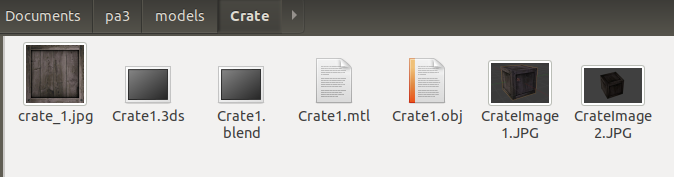
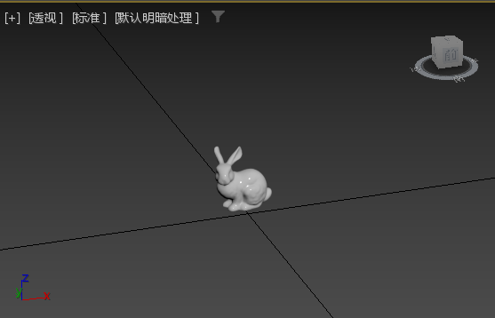
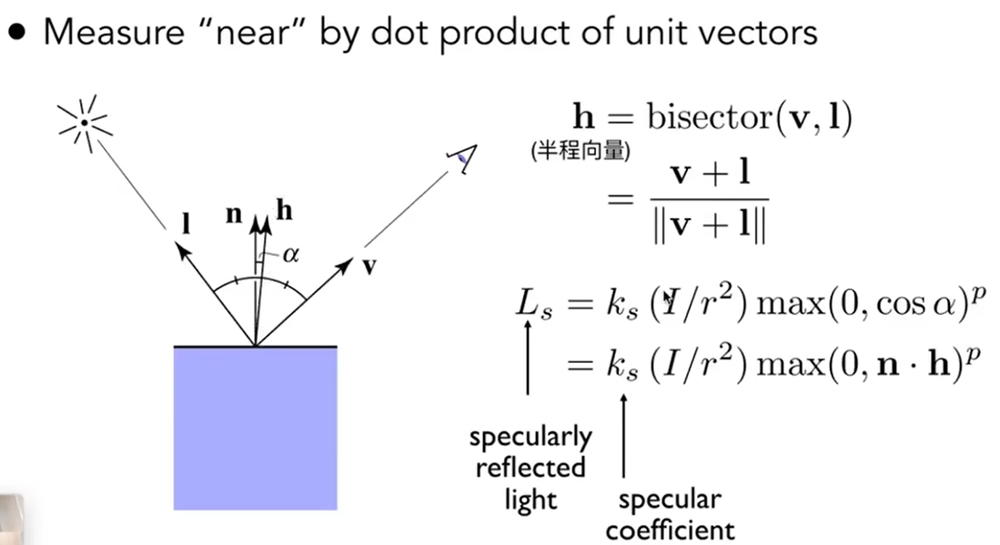
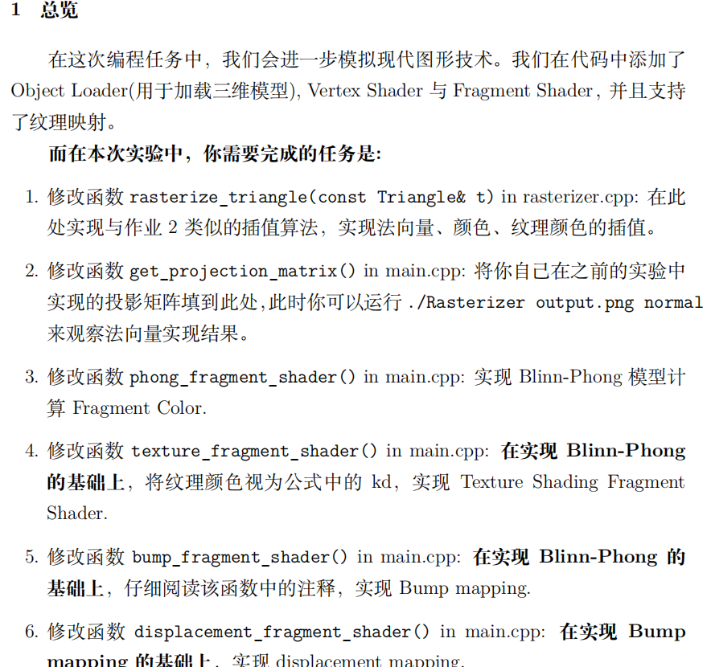

# 前言
在AS2中我添加了一些个人的想法，而在本次作业中我将更加大胆地尝试新的内容。我们知道第三次作业的要求是渲染一直小奶牛。我的额外需求来自于，我在翻阅作业框架文件时发现model当中出现了后缀为3ds和blend的文件：

这应该是用3dsMax和blender做出的模型。import到3ds Max中就可以看到，的确是一些简单的建模。

因此，我设计了一个额外需求：自己使用上述建模软件捏一个模型，并用这段渲染程序来展示。

## 作业3 画奶牛 & 模型应用

### 前置知识回顾
blinn-phong模型中的几个重要知识：

#### specular reflection

镜面反射中的重要概念是半程向量，由于v与l都是单位向量，他们直接相加再除以模就能得到所谓半程向量，这是一个指向两个向量**角平分线方向**的**单位向量**。

### 作业要求

### 基础功能实践

### 提升需求1 颜色插值

### 提升需求2 MSAA
