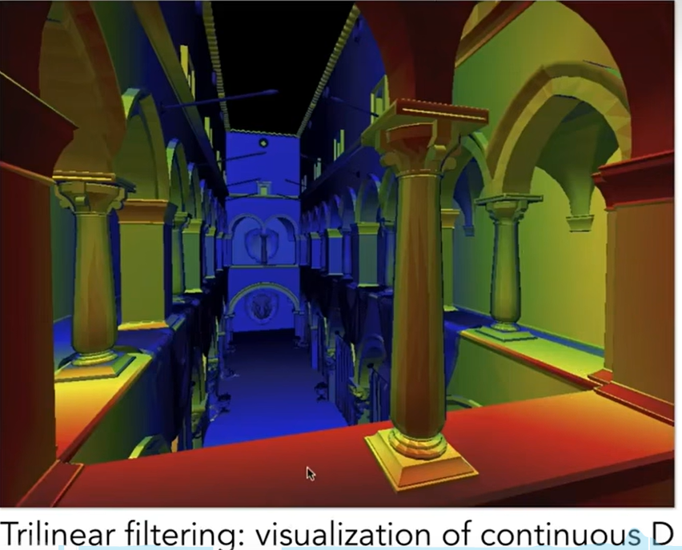

# 前言
在AS2中我添加了一些个人的想法，而在本次作业中我将更加大胆地尝试新的内容。我们知道第三次作业的要求是渲染一直小奶牛。我的额外需求来自于，我在翻阅作业框架文件时发现model当中出现了后缀为3ds和blend的文件：

这应该是用3dsMax和blender做出的模型。import到3ds Max中就可以看到，的确是一些简单的建模。


因此，我设计了一个额外需求：自己使用上述建模软件捏一个模型，并用这段渲染程序来展示。

## 作业3 画奶牛 & 模型应用

### 前置知识回顾:布林冯模型
blinn-phong模型中的几个重要知识：

#### specular reflection

镜面反射中的重要概念是半程向量，由于v与l都是单位向量，他们直接相加再除以模就能得到所谓半程向量，这是一个指向两个向量**角平分线方向**的**单位向量**。
这里的镜面反射公式，采用了一个cos值来反应视线方向对于镜面反射的影响：如果半程向量h与法线几乎重合(夹角小 点积大)，那么显然v也与l的反射方向接近，从而能看到更强的高光反射。

这里的p次方，是为了强化这个余弦对于高光反射的干涉——只有相当靠近的夹角才能让人看到这个高光。一边p取5已经比较足够。
必须强调，布林冯模型是基于直观感受的、有一定科学性的模型，但显然其并不追求物理正确，甚至没有追求基础的能量守恒。

#### diffuse term


#### ambient term

这里的环境光是一个非常大胆的假设：所有点都有一个常数数值的基础光照。这显然是惊人的错误，但它确实很好用。

其中的ka、kd、ks，看起来是一个系数，但其实完全可以直接设计成一个Vector3f的颜色。对于RGB值分别进行同样的运算，得到的值再组合成一个变得比原本更暗(所有三种反射都会得到小于100%的k值)的颜色。
将所有三项加起来，就实现了布林冯光照模型。

### 前置知识回顾:逐顶点法线

为什么需要逐顶点求法线呢？
有时候我们会需要在每个顶点上都进行一次着色运算，而哪怕是布林冯模型，也必须得有着色点的法线n。
工业里的模型顶点会储存法线值。回到AS2当中，看一看Triangle.hpp就会发现，三角形Triangle类维护着一个Vector3f normal[3]。
此图展示了一种朴素的做法：把一个顶点相邻的若干三角形的法线平均。


### 作业要求


我们先把AS2的rasterize_triangle(const Triangle &t)拿过来对比一下：
```cpp
void rst::rasterizer::rasterize_triangle(Triangle &t)
{
    auto v = t.toVector4();
    float l = INT_MAX;
    float r = INT_MIN;
    float top = INT_MIN;
    float b = INT_MAX;
    for (auto k : v)
    {
        l = k.x() < l ? k.x() : l;
        r = k.x() > r ? k.x() : r;
        top = k.y() > top ? k.y() : top;
        b = k.y() < b ? k.y() : b;
    }

    for (int i = (int)l; i <= r; i++)
    {
        for (int j = (int)b; j <= top; j++)
        {
            float a[5]={0.25,0.25,0.75,0.75,0.25};
            float count=0;
            float min_z=INT_MAX;
            for(int k=0;k<=3;k++){
                float x=i+a[k];
                float y=j+a[k+1];
                if(insideTriangle(x,y,t.v)){
                    count+=0.25;
                    float tocul0=t.v[0].z();
                    float tocul1=t.v[1].z();
                    float tocul2=t.v[2].z();
                    float z_interpolation = my_interpolation(x,y,t,tocul0,tocul1,tocul2);
                    if(-z_interpolation<min_z)min_z=-z_interpolation;
                }
            }
            Eigen::Vector3f c0=t.getColor(0);
            Eigen::Vector3f c1=t.getColor(1);
            Eigen::Vector3f c2=t.getColor(2);

            float x=i+0.5;
            float y=j+0.5;
            float my_r=my_interpolation(x,y,t,c0.x(),c1.x(),c2.x());
            float my_g=my_interpolation(x,y,t,c0.y(),c1.y(),c2.y());
            float my_b=my_interpolation(x,y,t,c0.z(),c1.z(),c2.z());
  
            Eigen::Vector3f myColor((int)my_r*count,(int)my_g*count,(int)my_b*count);
                if(min_z<depth_buf[get_index(i,j)]){
                    depth_buf[get_index(i,j)]=min_z;
                    set_pixel(Eigen::Vector3f(i, j, 1), myColor);

                } 
        }
    }
}
```

### 基础功能实践1 法线牛
在开始之前我必须先吐槽一下作业框架，很多东西都一声不吭就改了，以致于花了很长时间找这些细枝末节的改动。比如setpixel一言不发改了参数表。同时，使用std::optional去编写的Texture部分频频报错，为了让程序有一个初步的形态，我一怒之下把所有的optional 纹理定义全删了，写成了普通的Texture.

经过了漫长的调试，我运行了第一版的程序，其中重要的改动是我把setpixel的所有颜色全都设成了白色(255,255,255)，只为先看到一个图形效果稳定军心：
```cpp

void rst::rasterizer::rasterize_triangle(const Triangle& t, const std::array<Eigen::Vector3f, 3>& view_pos) 
{
    auto v = t.toVector4();
    float l = INT_MAX;
    float r = INT_MIN;
    float top = INT_MIN;
    float b = INT_MAX;

    for (auto k : v)
    {
        l = k.x() < l ? k.x() : l;
        r = k.x() > r ? k.x() : r;
        top = k.y() > top ? k.y() : top;
        b = k.y() < b ? k.y() : b;
    }

    for (int i = (int)l; i <= r; i++)
    {
        for (int j = (int)b; j <= top; j++)
        {
                float z_interpolation=my_interpolation(i,j,t.a(),t.b(),t.c(),t.a().z(),t.b().z(),t.c().z());
                
                float color_r=my_interpolation(i,j,t.a(),t.b(),t.c(),t.color[0].x(),t.color[1].x(),t.color[2].x());
                float color_g=my_interpolation(i,j,t.a(),t.b(),t.c(),t.color[0].y(),t.color[1].y(),t.color[2].y());
                float color_b=my_interpolation(i,j,t.a(),t.b(),t.c(),t.color[0].z(),t.color[1].z(),t.color[2].z());
                if(z_interpolation<depth_buf[get_index(i,j)]){

                    depth_buf[get_index(i,j)]=z_interpolation;
                    set_pixel(Eigen::Vector2i(i, j), Eigen::Vector3f(color_r*255, color_g*255, color_b*255));
                }

        }
    }
}


```


一个重要的图形学学习要领：**看到东西是最强大的动力**

不难发现，第一个显著的问题是，我们没办法通过t.getColor()获得颜色了。Tiangle类已经删去了getColor方法。
rasterizer程序作为中流砥柱，要去哪个对象获取颜色数据呢？
答案比getColor更直接，已经存在Tiangle t的color[]成员里了。
而作业框架也提示我们，不要再使用setPixel来逐个像素涂色，使用fragment_shader获取每个像素的颜色。fragment_shader里存放了一系列数据，包括颜色、法线、纹理UV坐标等。

```cpp

void rst::rasterizer::rasterize_triangle(const Triangle &t, const std::array<Eigen::Vector3f, 3> &view_pos)
{
    // TODO: Interpolate the attributes:
    // auto interpolated_color
    // auto interpolated_normal
    // auto interpolated_texcoords
    // auto interpolated_shadingcoords
    // Use: fragment_shader_payload payload( interpolated_color, interpolated_normal.normalized(), interpolated_texcoords, texture ? &*texture : nullptr);
    // Use: payload.view_pos = interpolated_shadingcoords;
    // Use: Instead of passing the triangle's color directly to the frame buffer, pass the color to the shaders first to get the final color;
    // Use: auto pixel_color = fragment_shader(payload);

    auto v = t.toVector4();
    float l = INT_MAX;
    float r = INT_MIN;
    float top = INT_MIN;
    float b = INT_MAX;

    for (auto k : v)
    {
        l = k.x() < l ? k.x() : l;
        r = k.x() > r ? k.x() : r;
        top = k.y() > top ? k.y() : top;
        b = k.y() < b ? k.y() : b;
    }

    for (int i = (int)l; i <= r; i++)
    {
        for (int j = (int)b; j <= top; j++)
        {
            if (insideTriangle(i, j, t.v))
            {
                float z_interpolation = my_interpolation(i, j, t.a(), t.b(), t.c(), t.a().z(), t.b().z(), t.c().z());

                float color_r = my_interpolation(i, j, t.a(), t.b(), t.c(), t.color[0].x(), t.color[1].x(), t.color[2].x());
                float color_g = my_interpolation(i, j, t.a(), t.b(), t.c(), t.color[0].y(), t.color[1].y(), t.color[2].y());
                float color_b = my_interpolation(i, j, t.a(), t.b(), t.c(), t.color[0].z(), t.color[1].z(), t.color[2].z());
                Eigen::Vector3f color_interpolation(color_r, color_g, color_b);

                float nor_x = my_interpolation(i, j, t.a(), t.b(), t.c(), t.normal[0].x(), t.normal[1].x(), t.normal[2].x());
                float nor_y = my_interpolation(i, j, t.a(), t.b(), t.c(), t.normal[0].y(), t.normal[1].y(), t.normal[2].y());
                float nor_z = my_interpolation(i, j, t.a(), t.b(), t.c(), t.normal[0].z(), t.normal[1].z(), t.normal[2].z());
                Eigen::Vector3f nor_interpolation(nor_x, nor_y, nor_z);

                float coord_x = my_interpolation(i, j, t.a(), t.b(), t.c(), t.tex_coords[0].x(), t.tex_coords[1].x(), t.tex_coords[2].x());
                float coord_y = my_interpolation(i, j, t.a(), t.b(), t.c(), t.tex_coords[0].y(), t.tex_coords[1].y(), t.tex_coords[2].y());
                Eigen::Vector2f coords_interpolation(coord_x, coord_y);

                float shading_x = my_interpolation(i, j, t.a(), t.b(), t.c(), view_pos[0].x(), view_pos[1].x(), view_pos[2].x());
                float shading_y = my_interpolation(i, j, t.a(), t.b(), t.c(), view_pos[0].y(), view_pos[1].y(), view_pos[2].y());
                float shading_z = my_interpolation(i, j, t.a(), t.b(), t.c(), view_pos[0].z(), view_pos[1].z(), view_pos[2].z());
                fragment_shader_payload playload(color_interpolation, nor_interpolation, coords_interpolation, nullptr);
                playload.view_pos = Eigen::Vector3f(shading_x, shading_y, shading_z);
                auto pixel_color = fragment_shader(playload);
                if (z_interpolation < depth_buf[get_index(i, j)])
                {
                    depth_buf[get_index(i, j)] = z_interpolation;
                    set_pixel(Eigen::Vector2i(i, j), pixel_color);
                }
            }
        }
    }
}

```
可以看到我固执地还在使用自己依据平面三点式的插值公式，因为觉得直观好理解、懒得去看computeBaryCentric2D那个函数带着alpha beta gamma的代码(还有一个原因是我auto[alpha,beta,gamma]接收返回值一直报错无奈之举)

整个作业3的代码其实是非常贴近实际光栅器的，这里的fragment_shader_playload其实就是传递给**片元着色器**fragment_shader的参数集合，而片元着色器完成全部的着色计算、返回一个像素的最终颜色。我们的第一步就是使用normal 法线数据来显示颜色。这事实上显然是没有问题的，因为归一化的法线数据和颜色数据都是[0,1]上的浮点三维向量，乘以255就能得到颜色。同时，由于实际模型中的顶点法线总是有相当连续的特征，展现出来的颜色也会是一个逐渐变化的、好看的渐变色。

这里先解释一下，注释部分提示我们要求解的`Eigen::Vector2f coords_interpolation`和`playload.view_pos`。
首先coords是纹理的映射坐标,在我们还没有使用纹理的时候,

不出意外的话是要出意外了~

道理我都懂，但为什么是个牛屁股？

其实写到这里的时候已经知道问题所在了，特别把代码改回原版来复现一下这个常见错误。
这一次的作业框架里有一个比较反直觉的改动藏在注释里：

v[i].w里存着顶点在view space上的 depth。我们在插值函数里写的内容是用三角形三个顶点的z值来进行插值，而这个时候三角形里的z值未经归一化。我进行了归一化改动，用z/w替换z值就输出了正确的牛牛。
```cpp
float z_interpolation = my_interpolation(i, j, t.a(), t.b(), t.c(), t.a().z()/t.a().w(), t.b().z()/t.b().w(), t.c().z()/t.c().w());
```


但是反过来想一想，为什么这里用z，会看到一个牛屁股呢？可以看一下这篇文章
[GAMES101作业框架问题](https://zhuanlan.zhihu.com/p/509902950)


### 基础功能实践2 冯氏牛
好在冯渲染的基础部分已经写好，也已经给我们提供了三种光照项的参数ka，kd，ks。

这里在第一次编码就出现了一个问题：如果使用Eigen当中的operator*来处理向量，是没有办法直接计算我们的公式的。
不论是三个项的哪一个，我们最终都会做一个向量的乘法，比如ks是三维向量，I光强也是一个三维向量。三维向量是没有办法和三维向量直接相乘的；纵使进行转置，要么会获得3x3矩阵，要么会获得1x1也就是一个数值。而我们最终希望计算的是一个颜色，也应该是一个三维向量，这是不合理的。所幸我们发现，这里的各种光强度Insidence都是白光(r=g=b)，因此我们当然可以把光强当成一个数值来进行数乘。
```cpp
Eigen::Vector3f phong_fragment_shader(const fragment_shader_payload &payload)
{
    Eigen::Vector3f ka = Eigen::Vector3f(0.005, 0.005, 0.005);
    Eigen::Vector3f kd = payload.color;
    Eigen::Vector3f ks = Eigen::Vector3f(0.7937, 0.7937, 0.7937);

    auto l1 = light{{20, 20, 20}, {500, 500, 500}};
    auto l2 = light{{-20, 20, 0}, {500, 500, 500}};

    std::vector<light> lights = {l1, l2};
    Eigen::Vector3f amb_light_intensity{10, 10, 10};
    Eigen::Vector3f eye_pos{0, 0, 10};

    float p = 150;

    Eigen::Vector3f color = payload.color;
    Eigen::Vector3f point = payload.view_pos;
    Eigen::Vector3f normal = payload.normal;

    Eigen::Vector3f result_color = {0, 0, 0};
    for (auto &light : lights)
    {
        float r = (point - light.position).norm();

        // diffuse term
        float costheta = normal.dot((light.position - point).normalized());
        costheta = costheta > 0 ? costheta : 0;
        Eigen::Vector3f diffuse_color = light.intensity / (r * r);
        diffuse_color = kd * diffuse_color.x();
        diffuse_color *= costheta;

        // ambient term
        Eigen::Vector3f ambient_color = amb_light_intensity.x() * ka;

        // specular term
        Eigen::Vector3f h = (light.position - point).normalized() + (eye_pos - point).normalized();
        h = h.normalized();

        float cosalpha = h.dot(normal);
        cosalpha = cosalpha > 0 ? cosalpha : 0;
        cosalpha = pow(cosalpha, 5);

        Eigen::Vector3f specular_color = ks * light.intensity.x() / (r * r);
        specular_color *= cosalpha;

        // TODO: For each light source in the code, calculate what the *ambient*, *diffuse*, and *specular*
        // components are. Then, accumulate that result on the *result_color* object.
        result_color += diffuse_color;
        result_color += ambient_color;
        result_color += specular_color;
    }

    return result_color * 255.f;
}

```
我的结果似乎比其他作业的输出要暗淡一些；更重要的是，似乎完全不能看到高光反射项。


看一看其他人的结果：


这意味着我们要回来纠错了。最终我发现，根本上的差别在于p值。我们给高光反射项设置了cos的5次方，而这远远不够。其实代码框架中已经定义了一个指数p=150,我没有看见，自以为是地写成了指数p=5.将他改到150，就能看出明显的高光反射效果了，画面也不再灰暗。

### 基础功能实践3 纹理牛
其实原本的代码框架拿过来在我这里是没有办法运行的。当时vscode对于std::optional texture报了错， 我于是一怒之下把所有optional代码全都改成了texture=null，这样能通过编译，但是到了纹理输出模式部分就会产生问题了。

我们直接进行一个texture模式的运行，看看什么结果。


首先，这里警告了没有获得到正确的sRGB profile；输出结果是一张纯黑图片(略)。

我们不得不来过一下纹理被贴到牛牛身上的全过程逻辑了。
纹理Texture类的构造函数是这样的：


看到`main.cpp`下的`texture_fragment_shader(...)`当中，有一段注释要求我们填补内容。这里rasterizer的成员texture在构造时就是一个空对象，我们得在这里获取一个texture并赋值给rasterizer。


从build文件到牛牛纹理的相对路径为../models/spot/hmap.jpg,这个路径已经在main函数中传递给Texture()用来读取纹理。
```cpp
std::string obj_path="../models/spot/";
//...
std::string texture_path="hmap.jpg";
//...
r.set_texture(Texture(obj_path+texture_path));
```

那么之后，我们就可以通过r.texture来访问纹理了(仔细想来这句话说的是不对的，在`texture_fragment_shader(...)`执行当中，尚且没有在main()里构造rasterizer r对象，应该使用payload.texture作为代替)。

我们的目的是获取当前点位置view_pos下对应到纹理中的uv坐标值。uv坐标是一个二维值，他表示对应了纹理当中的哪一个坐标，而整个小程序当中存储二维值的是比较少见的。类Triangle包含了成员Vector2f tex_coords[3]，其存放着三角形的三个顶点对应的uv坐标。那么我们直接修改代码，填入uv值：

```cpp
if(payload.texture){
    return_color=payload.texture->getColor(payload.tex_coords.x(),payload.tex_coords.y());
}
```

说一下结果，不出意外是出意外了。这里编译通过，console会报
```
libpng warnign: iCCP: known incorrect sRGB profile
```
有输出，但是是一头反光的黑牛，等于纹理获取到的颜色是纯黑。

由于之前也出现过纯黑问题，当时是颜色/255造成的，我们首先给获取到的颜色乘以一个255看一下结果。

没用。

查证过程中还发现一个错：环境光不应该算多次，应该在循环外单独加一次。但是这样一改，我的纯黑牛变得更黑了。需要把这个更新同步到texture和phong两部分代码段。

我在刚才提到的获取映射部分加了一句测试：
```cpp
if(payload.texture){
    return_color=payload.texture->getColor(payload.tex_coords.x(),payload.tex_coords.y());

}
else std::cout<<"payload.texture == null"
```

果然发现问题，700*700个像素跑完，每个像素都输出payload.texture == null。


我发现这里playload被我修改了最后一元参数(在debug不过的时候经常乱改代码，最后又忘记rollback)。当初这样改是因为在vscode中无论怎么查，都不理解为什么texture被标红。在我尝试了一切办法后，最终的写法其实只是在texture前面加一个&：


注意，我从一开始就删掉了rasterizer.hpp当中对于texture成员定义成`std::optional<texture>`的写法,而是直接写Texture texture。简单了解了一番，猜测可能是C++17更新了特性，而这里的g++还不能识别。至少改为Texture这里确实可以运行了。

让我们来看一下牛牛的形态：


### 基础功能实践4 bump牛

### 基础功能实践5 displace牛

### 提升需求1 三线性插值牛

我们可以看到课件里的这张图展示了Mipmap三线性插值的渲染效果。这里的图形是这样产生的：首先由于纹理本身的大小，会产生lgN+1个mipmap层。规定，若一个像素在判断为适用D级mipmap后，就把他涂成第D种颜色(比如规定0-7层分别是渐变但离散的其中具体的颜色，最远处如图中的蓝色)。然后应用三线性插值，就能得到一种漂亮的渐变效果(注意这里的颜色其实与纹理本身已经无关)
尝试把牛也这样渲染一下。

#### 可行性分析

我们先来看看，最终如果通过把`Eigen::Vector3f textrue_fragment_shader(fragment_shader_payout &payout)`简单重写成一个`Eigen::Vector3f mipmap_fragment_shader(fragment_shader_payout &payout)`(这样做的好处是显著的，我们可以直接在main里照抄适配代码，来用`./Rasterizer output.png mipmap`来调用新函数)
```
main() -调用 ->  draw(TriangleList &L)   ->调用

调用->rasterize_triangle(Triangle &T,...) {
    ...
    fragment_shader_payload playload(color_interpolated, nor_interpolated,coords_interpolated, &texture)
    playload.view_pos = Eigen::Vector3f(shading_x,shading_y,shading_z);
    auto pixel_color = fragment_shader(playload);
}
```
至此，我们知道了，要编写的`Eigen::Vector3f mipmap_fragment_shader(fragment_shader_payout &payout)`拿到的数据包含片元的Vector3f颜色值，Vector3f法线值，齐次坐标uv插值，以及纹理对象。我们仔细想想就会发现这个框架是有问题的，因为颜色在fragment_shader_payout里已经有一个计算好的值了，这部分计算发生在rasterize_triangle里，即原本的逻辑是根据三个顶点的颜色插值出片元的颜色。

但是这是不是意味着我们就没有办法做到目前的需求了呢？本来比如phong模式下，就需要把拿到的原本颜色加上光照等进一步运算获得最后的颜色，我们显然也可以这样做。只是在这里，fragment_shader_payout里面存放的纹理颜色将被我们完全忽视。我们的颜色应当是产生于基于**像素遮蔽纹素的大小**判断得出的结果。

下一个问题是，如果仅仅有一个`mipmap_fragment_shader()`肯定是不行的。这个函数作为参数传递到rasterizer_riangle()中，会对每一个像素不断调用，而初始化整个mipmap的部分则显然不能每个像素都做一次。因此我们还需要改写初始代码，为获取到的纹理创建一个适配的新Texture，用于保存mipmap。

原始纹理在哪里呢？通过main()函数里的`r.set_texture(Texture(obj_path+texture_path))`这一句，原始纹理被绑定到了rasterizer对象r上。但是我们必须注意到，`rasterizer::texture`是一个private变量，`mipmap_fragment_shader()`无权访问。rasterizer类也没有设计texture的getter，其texture成员唯一被利用的办法就是其成员函数`rasterize_triangle()`(也只用了一处，用于初始化payload)

所以，要想让`mipmap_fragment_shader()`得到纹理数据，仅仅修改`main.cpp`是不可能完成的。

#### Mipmap数据结构

可以看到Texutrue.hpp中的定义，Texture当中有`int width` 和 `int height` 两个成员。