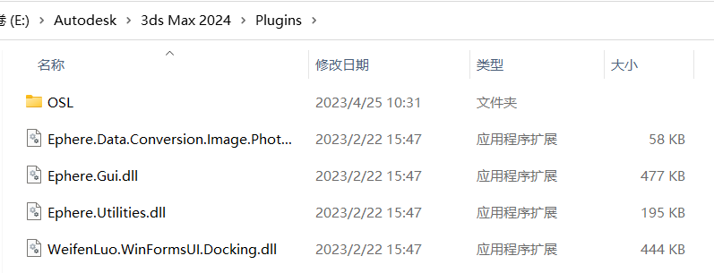
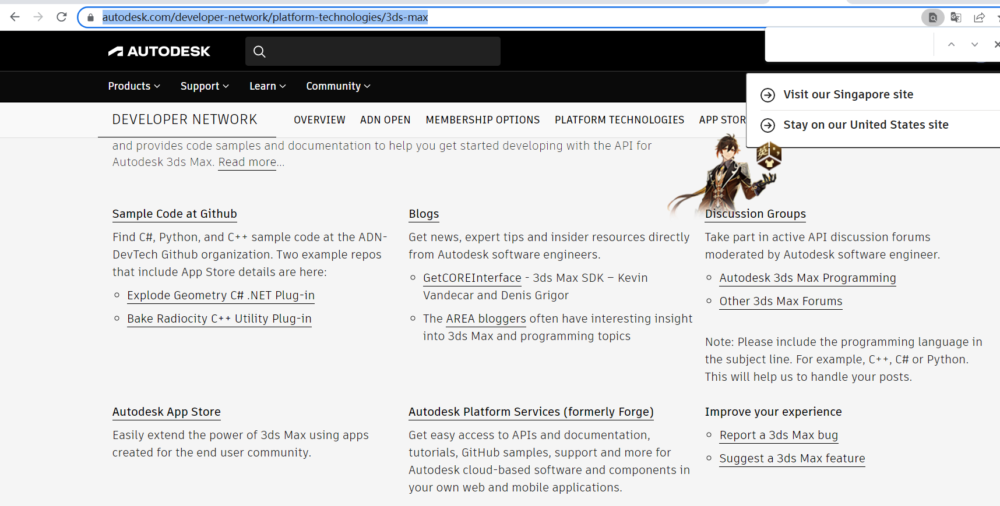
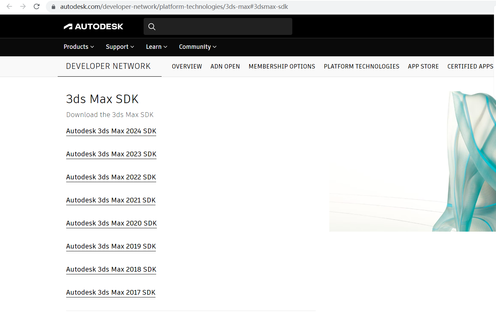
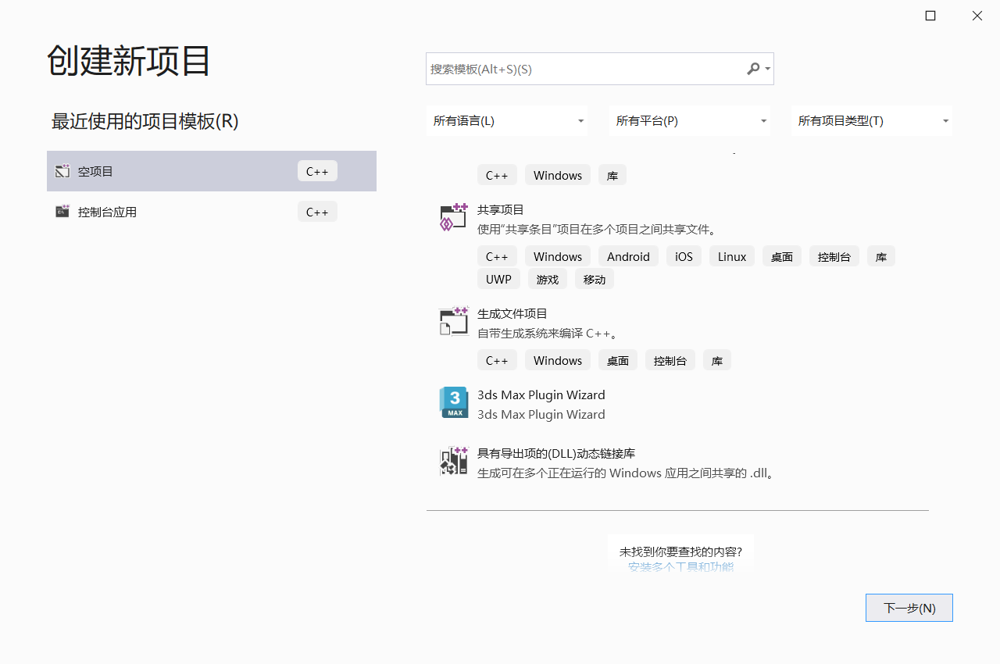
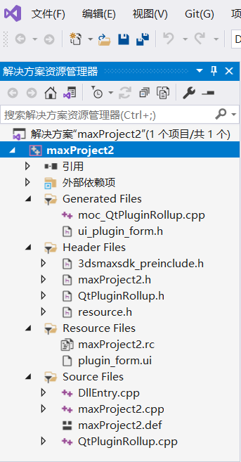

# 前言
为dcc开发插件，形成工具链并维护和迭代之，乃至于培训同事如何使用这样的插件，是技术美术或者工具箱程序员的重要工作之一。一款设计良好易于使用的插件工具，将会是游戏工业转动齿轮组最好的润滑剂。

随着游戏工业对于游戏质量的需求越来越高，早期游戏工业生产关键路径上的高权结点(意味着最拖进度后腿)往往是美术生产，比如生产和迭代人物。而随着游戏工业持续地广纳贤才，海量的优秀艺术家不断加入，主要矛盾已经逐渐从美术生产力不足转变到美术生产与自动化、工具化、管线化生产流不匹配之间的矛盾。这种掣肘需要的正是技术美术和所谓的通才技术员，他们可能出身是程序也可能出身是艺术家，但具备能力在这沟壑两侧搭建起桥梁，建立工具以方便美术的技术生产。

艺术家的工具需求五花八门，且由于dcc的种类、资产的种类以及引擎内数据形态各成一派，开发万金油的插件是困难的。基本上，美术每使用一种新的dcc，就意味着工具程序员至少要掌握一种新的数据格式内涵、一个SDK或者API(有的dcc没有这样的api，那将意味着多倍的成本)

## 1 基础概念
我们使用AutoDesk的`3dsMaxSDK`，一个专为3dsMax开发插件使用的工具集，来进行插件开发。

3dsMax插件必须遵循一些规范来follow 3dsMax的工作流。SDK规定了一些类，程序员需要在动态链接库DLLs中扩展这些类来实现功能。在程序启动时，3ds会把这个位置：`<3dsMaxInstallFolder>\plugins`的所有`DLL文件`全部装入。

只有当一个dll文件实现了`required DLL functions`, 其装入才会进行。这种函数也称`DLL entry point function`

## 2 获取SDK与环境
### 下载SDK
如果你使用Autodesk桌面应用，或者是官网的binary下载，可能导致你的3dsMax项目文件当中缺少maxsdk文件。只有当你下载了3dsMax的msi文件并在本地执行初始化才能避免这个问题(installer没有sdk这个问题2021年四月就有人提出，工程师还道歉了，时至今日也没修，今天看了sdk的官网还在说size太大了所以没做进installer)。
我查了很多Autodesk的资讯，许多信息源都承认了许多情况下不可避免地出现sdk缺失，并且各自都允诺自己给出的办法能够下载sdk。
~~[How to install the Software Development Kit (SDK) for 3ds Max](https://getcoreinterface.typepad.com/)~~
[Autodesk的论坛中关于sdk下载源](https://www.autodesk.com/developer-network/platform-technologies/3ds-max#3dsmax-sdk)
拉到最下面最下面，

再往下（浪费两个多小时去找其他资源，其实就在这一页，下面一堆灰色的东西我以为网页已经到底部了，其实下面还有，典型垃圾前端）

下载好对应的sdk，最终得到的sdk文件夹名称叫`maxsdk`

### 获取Wizard
刚刚下载好的SDK文件夹可以找到`maxsdk/Howto/3dsmaxPluginWizard/readme.txt`。自己跟着一步步做就好了。
其中根据第五步所说，应该能够在vs中创建项目时候看到这个：

好，现在我们已经搞定了AppWizard或者说是3dsmaxPluginWizard。下面我们要做的事情非常酷：我们来用3dsmaxPluginWizard build出一个项目，抄一段代码，并让这个项目能够在3dsMax运行中使用。

使用之前添加的项目模板。最后一步里，要填入三个位置：
第一条填maxsdk根目录(e.g. C:\Program Files\Autodesk\3ds Max 2020 SDK\maxsdk ) 

第二条The output path填入3dsMax的插件根目录(i.e. C:\Program Files\Autodesk\3ds Max 2020\plugins )

第三条填入3dsMax的`.exe`位置目录，比如 C:\Program Files\Autodesk\3ds Max 2020 .

走到这里的时候还会留下一个配置项目文件，要想写入这个项目配置文件必须授予VS管理员权限。

这之后我们的默认项目就build好了。

