# 从零开始的3dsMax骨骼动画
***
## 0 前言
本笔记的实践目标是：
- 从0开始对人物建模(0->1)
- 探索精细化的人物建模可能(1+)
- 对建模好的人物制作骨骼动画(1->2)
- 将3dsMax的动画资产在Unity中导入并使用(2+)；
- 从UAS获取动画资产在3dsMax中再加工(2+)

## 1 运动动画
### 1.1 最简单的运动动画
在右侧Object Type选择对象类型。这里我们选择Geometry下的Cylinder圆柱体，然后在Perspective视图下拉出一个圆柱体来。
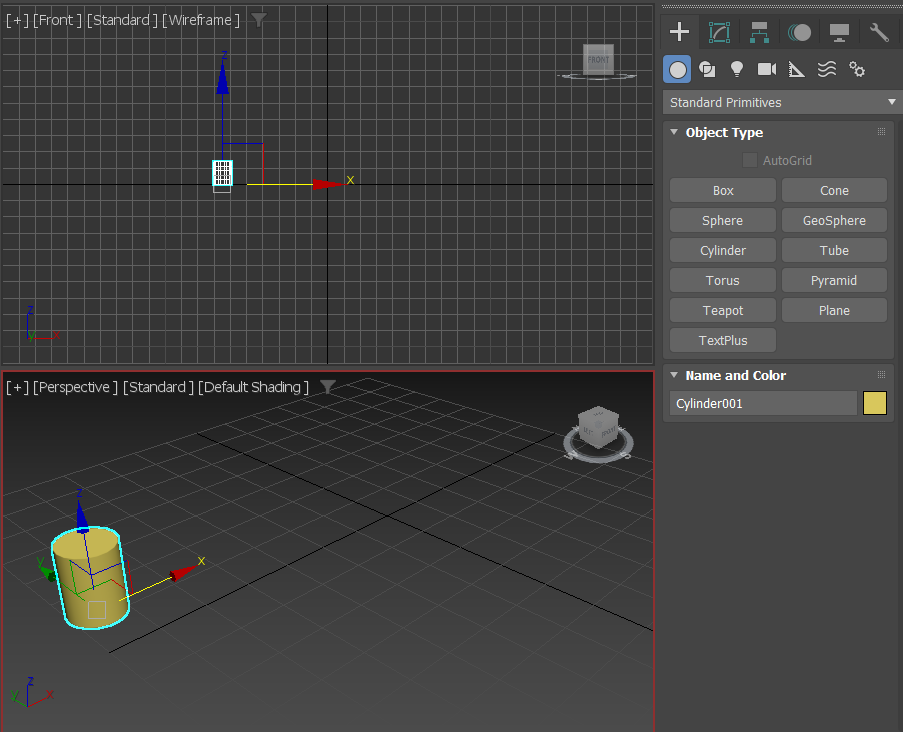
在右下角点选了Auto按键表示自动记录关键帧。然后我们拖动时间轴到末端，把最后一帧的圆柱体拖动到任意一个位置。
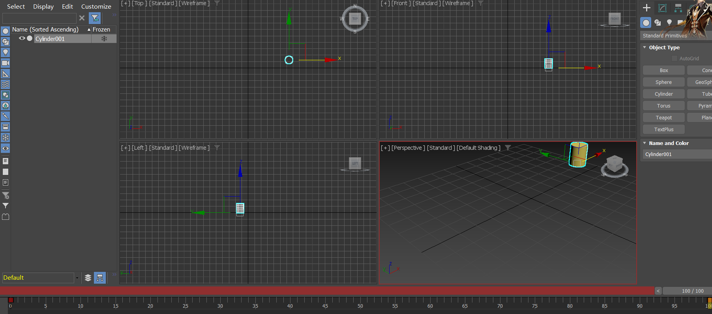
这样就会形成一个新的关键帧，两个关键帧就能形成一个动画。

运行后发现圆柱体在初始位置和拖动到的位置之间做匀速移动。这就是最简单的运动动画。

把鼠标换回选择工具，右键圆柱体并选择Object Properties对象属性，可以看到Motion Path(旧版Trajectory)选项。
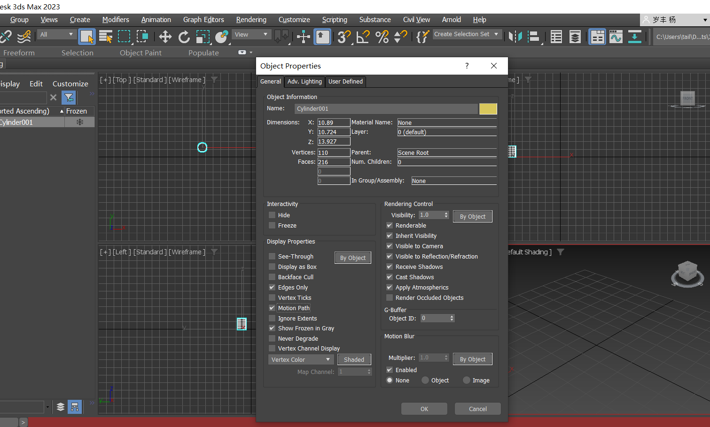
运动路径能够标识出运动中物体的每一个帧。拖动这些帧就能形成新的关键帧，从而改变运动。
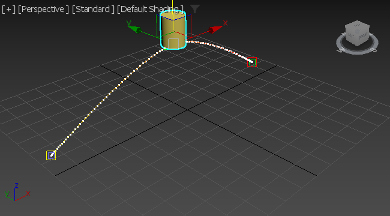

关键帧是一个非常棒的技术，在运动轨迹当中的任何一帧的Transition的任何参数改变，无论是旋转、位移还是缩放，都可以通过Transition的插值自动形成沿途的每一帧，从而形成动画。动画是一个利用视觉暂留的技术，其本质就是连续播放的若干帧。

### 1.2 设置维持帧
仅凭上面的内容，我们无法做到这样的事：让物体0-30帧不运动，而30帧才开始运动。这是因为0帧已经默认被建立成了第一个关键帧。
我们点击20/100的计时条，右键，自动进入一个Create Key的对话框：
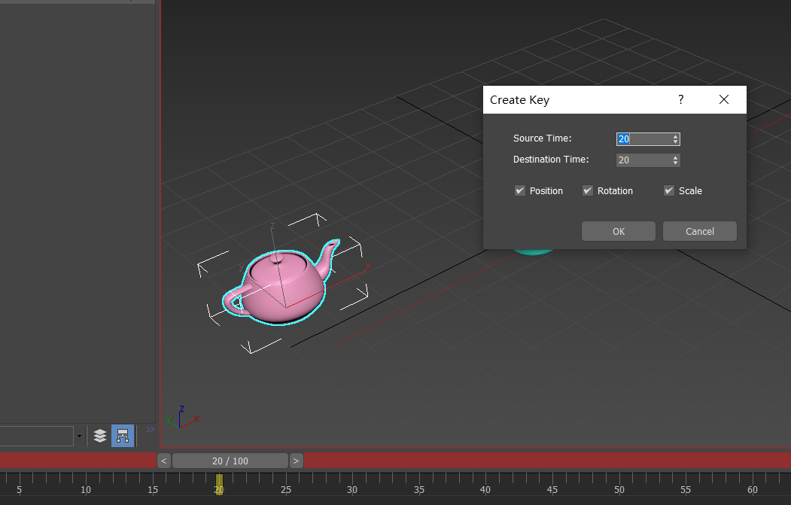

这里我们需要在SourceTime=20处建立一个Position关键帧。
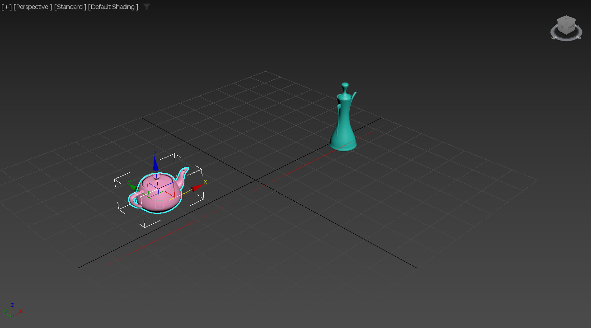

**案例：尝试做出这样的一个动画**
茶壶A和B在赛跑，B0帧出发，15帧时候回头看A有没有出发，20帧看到，25帧扭回头。50帧B到达终点。A20帧出发，70帧到达。
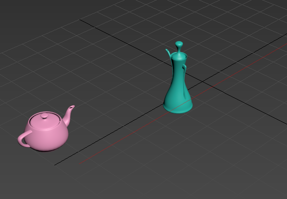

### 1.3 旋转动画和支点分离
**案例：尝试做一个倒茶的动画**

支点分离通过Hierarchy-Pivot-Affect pivot only来实现。

### 1.4 参数动画
以球体sphere为例，在关键帧内编辑参数，包括半径、面片数、半球隐藏、切片角度等，就能实现新的动画效果。红色记录position关键帧，绿色记录rotation关键帧，蓝色记录scale关键帧，而黑色记录参数关键帧。所谓这些关键帧，都是把两个区间帧区间内的逐帧做插值。
**案例：尝试做一个逐帧切苹果的动画**

还可以在Modify 页面里对对象添加各种Modifier。这些Modifier就像Unity当中的脚本，给对象添加了一系列参数来控制其显示效果。我们使用Extrude凸起modifier，就能通过其中的amount参数来控制凸起高度；添加PathDeform modifier就能调整凸起的角度等等。
**案例：尝试做一个广告特效，以"影视飓风"立体字按圆形环绕形成动画**
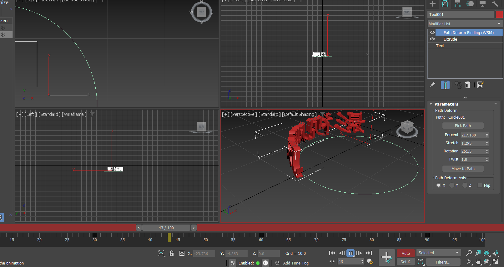

## 2 曲线和相对位置
### 2.1 曲线编辑器 bezier curve
打开Curve Editor(右上角，或者右键object选择)
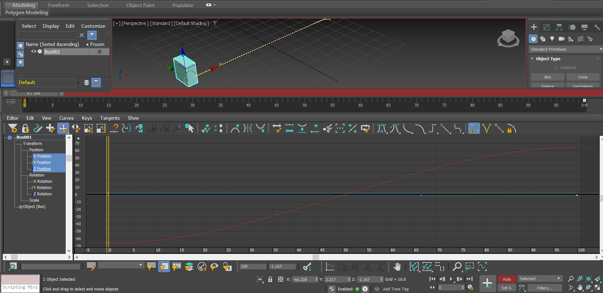
我们可以看到，在Curve Editor中有一条正弦函数的红色线。这是因我们在上面建立的运动Box的位移函数。也就是说，在自动生成中间各帧的插值过程中，也并没有做直接的插值，而是做了平滑处理，盒子运动是两头慢、中间快，符合物体实际运动的先加速后减速的过程。

这里点击红色函数曲线，可以看到出现了两个贝塞尔控制柄。把函数拉得更加陡峭，就能更直观地看出先慢后快最后慢的趋势。
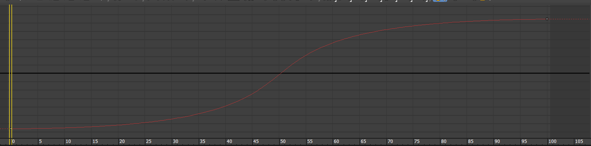
我们可以通过对某一变量对时间函数的贝塞尔曲线进行改动从而影响物体运动。

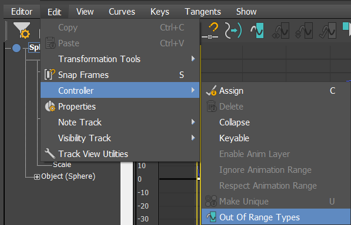
利用Edit-Controller-OutofRangeType 来无限拓展运动曲线。
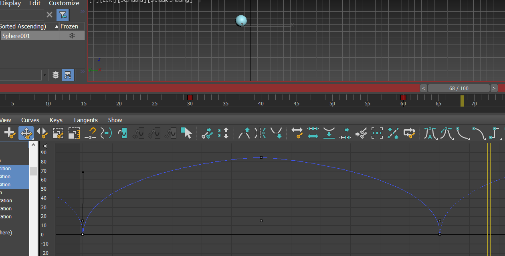
添加Flex Modifier，能够让运动的物体呈现**柔性**特征。
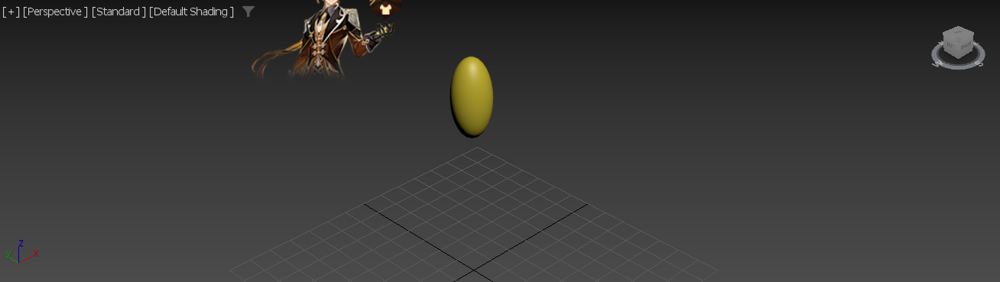
注意，经过前面的学习，我发现实践时常会发生一个错误：在Auto Key模式下，一边播放一边改写Modifier的参数。这样做将会造成在修改当帧生成一个关键帧，从而显著影响到整个运动过程。这是一个严重的错误。要想为整个运动过程添加一个持续生效的Modifier，应该关闭Auto Key，在时轴起始点进行Modifier的配置。

### 2.2 父子关系
首先，我们找到Create-Helpers,其下的一些对象都是一些帮助工具。

Tape工具能够拉直测量长度。
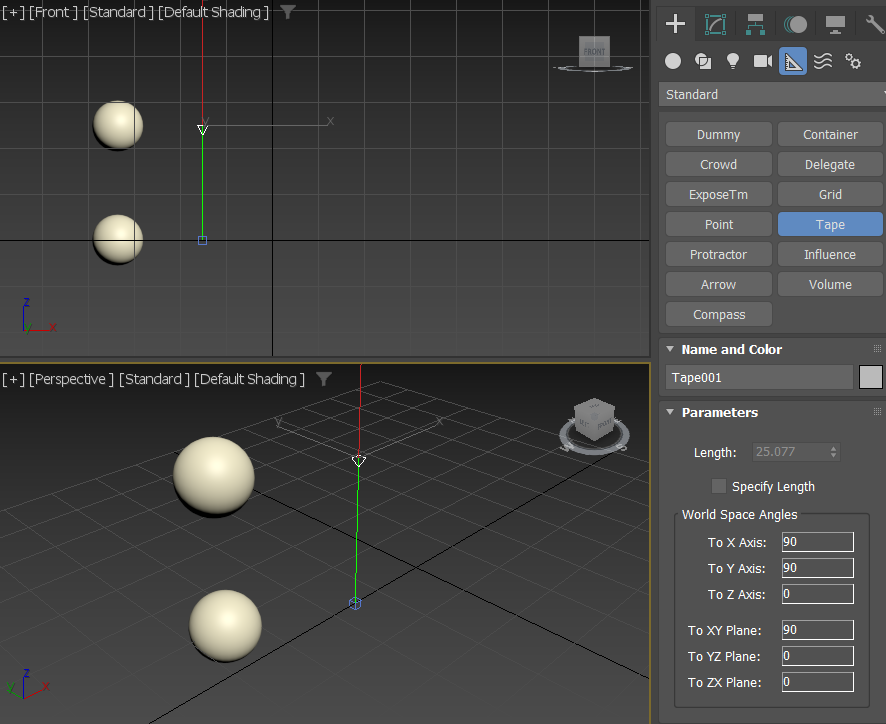

Dummy工具会生成一个虚拟对象，这个对象不会被渲染。 

点选左上角Select and link,从球体拖动到dummy上，就能将球体认定为dummy的子对象。从左侧的层级窗口直接拖动对象也可以达到同样的效果。
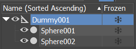

父子关系对于运动的影响在于，子对象可以自由移动；但如果父亲对象运动，会对儿子对象施加因动。

**案例：制作一个螺旋升天动画**

我原本想当然地认为，如果用pathDeformer去影响父对象，就能造成父绕圈、子螺旋，然而我想多了，貌似这样做了父的位移就不会被子继承了。
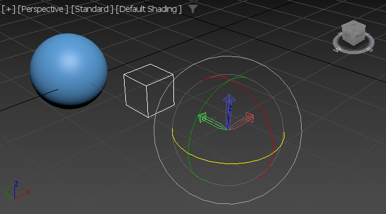
正确的做法是调整pivot位置，从而让父绕pivot旋转。
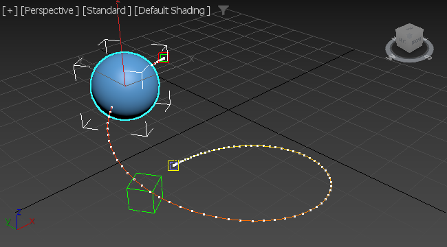

学习了父子关系，天体运动这些也可以做了。

### 2.3 倍乘曲线&松弛曲线
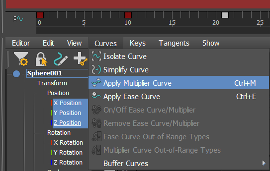
通过选中对象，在Curve Editor当中选择Apply Multiplier Curve即可为一个函数乘上倍乘函数。
倍乘曲线是直接乘在特定函数值上的曲线，没有添加时相当于对所有值都添加恒等于1的倍乘曲线。
**案例：利用倍乘曲线，做一个小球弹跳一边前进一边衰落最终不跳的动画**
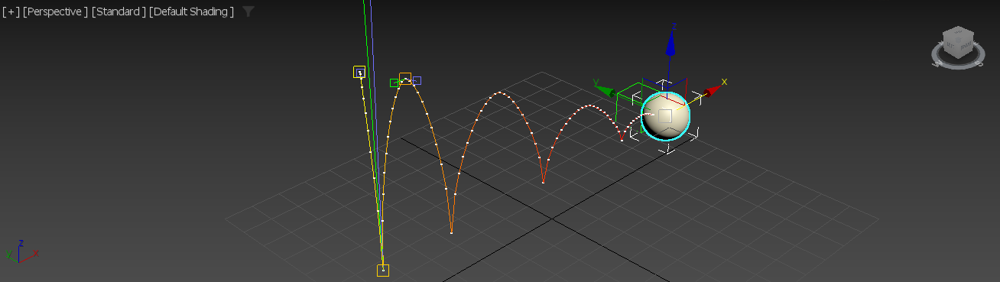

在同一个菜单下，下面的Apply Ease Curve就是添加松弛曲线。
## 3 一些实践