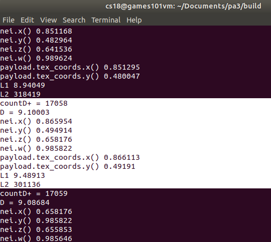

## 前言
在学完了Games101的课程后，发现有些重要的内容并没有出现在101的八个作业里，比如Lecture  8 - 9 所介绍的mipmap。本部分尝试在作业三画出一头小奶牛的基础上加上mipmap技术。

为了实现这一目标，我查阅了mipmap的几篇关键论文，并根据论文中指导的细节进行了对应的尝试。因此姑且也可以认为这部分工作可以算作对经典论文的代码复现。

由于对opencv等环境装配并不了解，所以本项目的代码完全放在101作业本AS3的项目中。可以在[github 101AS3作业本](https://github.com/quaintSenator/Games101AS3)访问，且关于mipmap的更新均以mipmap前缀表示，如`mipmap_begin_commit`

必须说明，mipmap技术的初衷与这个项目中的应用是有背离的。mipmap是用于解决像素采样频率不足造成的走样现象的技术，在这样一些特点的场景应用较为广泛：
- 纹理特别大而像素相对小
- 对远处物体进行贴图

这些与原本的奶牛程序相去甚远，但依然可以在这个过程中感受技术的核心要点。

## 需求1 : 三线性插值牛

我们可以看到课件里的这张图展示了Mipmap三线性插值的渲染效果。这里的图形是这样产生的：首先由于纹理本身的大小，会产生lgN+1个mipmap层。规定，若一个像素在判断为适用D级mipmap后，就把他涂成第D种颜色(比如规定0-7层分别是渐变但离散的其中具体的颜色，最远处如图中的蓝色)。然后应用三线性插值，就能得到一种漂亮的渐变效果(注意这里的颜色其实与纹理本身已经无关)
尝试把牛也这样渲染一下。

### 可行性分析

我们先来看看，最终如果通过把`Eigen::Vector3f textrue_fragment_shader(fragment_shader_payout &payout)`简单重写成一个`Eigen::Vector3f mipmap_fragment_shader(fragment_shader_payout &payout)`(这样做的好处是显著的，我们可以直接在main里照抄适配代码，来用`./Rasterizer output.png mipmap`来调用新函数)是不是一个可行的方案。
```
main() -调用 ->  draw(TriangleList &L)   ->调用

调用->rasterize_triangle(Triangle &T,...) {
    ...
    fragment_shader_payload playload(color_interpolated, nor_interpolated,coords_interpolated, &texture)
    playload.view_pos = Eigen::Vector3f(shading_x,shading_y,shading_z);
    auto pixel_color = fragment_shader(playload);
}
```
至此，我们知道了，要编写的`Eigen::Vector3f mipmap_fragment_shader(fragment_shader_payout &payout)`拿到的数据包含片元的Vector3f颜色值，Vector3f法线值，齐次坐标uv插值，以及纹理对象。我们仔细想想就会发现这个框架是有问题的，因为颜色在fragment_shader_payout里已经有一个计算好的值了，这部分计算发生在rasterize_triangle里，即原本的逻辑是根据三个顶点的颜色插值出片元的颜色。

但是这是不是意味着我们就没有办法做到目前的需求了呢？本来比如phong模式下，就需要把拿到的原本颜色加上光照等进一步运算获得最后的颜色，我们显然也可以这样做。只是在这里，fragment_shader_payout里面存放的纹理颜色将被我们完全忽视。我们的颜色应当是产生于基于**像素遮蔽纹素的大小**判断得出的结果。

下一个问题是，如果仅仅有一个`mipmap_fragment_shader()`肯定是不行的。这个函数作为参数传递到rasterizer_riangle()中，会对每一个像素不断调用，而初始化整个mipmap的部分则显然不能每个像素都做一次。因此我们还需要改写初始代码，为获取到的纹理创建一个适配的新Texture，用于保存mipmap。

原始纹理在哪里呢？通过main()函数里的`r.set_texture(Texture(obj_path+texture_path))`这一句，原始纹理被绑定到了rasterizer对象r上，成为r的成员`r.texture`。但是我们必须注意到，`rasterizer::texture`是一个private变量，`mipmap_fragment_shader()`无权访问。rasterizer类也没有设计texture的getter，其texture成员唯一被利用的办法就是其成员函数`rasterize_triangle()`(也只用了一处，用于初始化payload)

所以，要想让`mipmap_fragment_shader()`得到纹理数据，仅仅修改`main.cpp`是不可能完成的。正确的做法并不是简单给rasterizer类写一个get_texture(),因为`mipmap_fragment_shader()`事实上后续需求一定需要访问生成的mipmap。

### 需求划分
我们将对原程序做如下的更改：
- rasterizer类 新增get_texture()
- rasterizer类 新增成员Texture mipmap
- rasterizer类 新增mipmap的getter&setter
- rasterizer类 修改`rasterizer.cpp`中的`rasterize_triangle`

首先，我想问一个问题。假如mipmap的对象是一个`160*86`的纹理，能不能生成&要如何生成一张mipmap呢？
显然，长方形的图像也能够生成mipmap。`128*128`的纹理会生成不含自身共计7层的mipmap，这是因为lg128=7.


但是纹理的长和宽不应该是非2次幂，也自然不会出现`160*86`的纹理。
```
纹理的形状可以是非正方形的，但是长宽的大小应该是2的幂，
因为非2的幂大小的纹理Non Power of Two(NPOT)会占用更多的内存空间
且GPU读取NPOT纹理的速度也会下降
```
ref：[Shader笔记——4.纹理基础](https://www.cnblogs.com/sylvan/p/10798010.html)

实验1：抓取纹理的宽度
在main.cpp 中 r.set_texture(...)处，加一句打印新texture的height和width。
结果如下：


回过头来想一想，本需求的颜色到底是怎么产生的？其实我们并不必去生成mipmap，而仅仅根据texture的大小、迭代像素位置映射到uv上的大小，就能够知道这个像素应当查询哪一个(三线性插值实际为两个，但我们也没有做双线性插值不知道这里的三线性插值是不是有点挂羊头卖狗肉)层级D的mipmap了。

需求循序渐进，我们先把mipmap各个层的恒定颜色给设计好。顺带一提，QQ的截图工具自带取色功能，可以看到屏幕上每个像素的rgb值。

lg1024=10,因此mipmap将会产生10层。
我们不妨来做一个粗暴的设定：
```cpp
col[d]={20*(d+1),20*(d+1),20*(d+1)};
```
这样设计将会造成一个这样的结果：较大的像素映射到高层(0，1为高层，图案最大)，也就是较近的位置会比较黑,较远的位置反倒稍稍变亮。

按照mipmap的设计，一个像素应当查询哪层mipmap应该参照这张图：

那么问题又来了。我们知道`mipmap_fragment_shader()`每个像素调用一次，如果shader仅仅知道当前的像素的uv，其显然无法进行L和D的求解。
每个顶点的uv存在TriangleList当中的各个Triangle里，而每个像素的uv是通过对顶点插值得到的。如何以一种高效的方式在当前像素访问到此像素的右像素和上像素呢？

当然可以在rasterize_triangle当中维护一个和rasterizer等大小的矩阵，当中存放每个像素在rasterize时产生的uv。之后我们修改`mipmap_fragment_shader()`的参数表，把其周边像素的uv当成参数传过去。需要注意的是，循环从左往右、从上向下进行，因此如果对(i,j)位置像素索取右侧和上侧，右侧像素的uv是还没有初始化好的。因此我们微调一下，把原算法中向上向右的求解改为向左向上。同时，由于整个程序的框架已经定义的很好了，如果真的修改`mipmap_fragment_shader()`的参数表会造成一定的麻烦。最后我决定在`shader.hpp`修改`fragment_shader_payload`结构,~~仅仅添加一个(i,j)的二维向量，让当前像素的shader能够知道自己是第几个shader，从而去查阅rasterizer的uv矩阵。~~ 添加一个四维向量，用于存放当前像素的两个邻居的坐标共计四个数。

这样就可以写出代码进行调试了。

这里把原计划的20改成了50，是因为20真的纯黑了一点都看不出来


为什么牛的大多数部位是黑色呢，我们看到`mipmap_fragment_shader()`中写道，纵使d=0，像素颜色也应该有50，50，50才对。这里是因为没有做好uv的映射。在Triangle中存储的每个uv值，都是已经归一化到(0,1)区间内的值。

进行一下uv的转换：


下面进一步的，我们来尝试一下之前所说的彩色效果。由于1024=2^10，会产生D=0~D=10共计 11层mipmap。我们来添加11种颜色。

应当添加层间按D插值来增加平滑性。
```cpp
Eigen::Vector3f mipmap_fragment_shader(const fragment_shader_payload &payload)
{
    Eigen::Vector3f col_arr[] = {
        {0, 255, 255},   // green-blue
        {72, 61, 139},   // Darkslateblue
        {132, 112, 255}, // slight slate blue
        {65, 105, 255},  // royal blue
        {0, 191, 255},   // deep sky blue
        {178, 238, 238}, // pale turquoise
        {0, 206, 209},   // dark turquoise
        {153, 51, 250},  // foreign purple
        {180, 20, 150},  // interpolation 1
        {230, 10, 50},   // interpolation 2
        {255, 0, 0}      // red
    };
    Eigen::Vector3f return_color = {0, 0, 0};
    float L1, L2, D, xd, yd;
    Eigen::Vector4f nei = payload.neighbour;
    xd = nei.x() - payload.tex_coords.x();
    yd = nei.y() - payload.tex_coords.y();
    xd *= 1024;
    yd *= 1024;
    L1 = xd * xd + yd * yd;

    xd = nei.z() - payload.tex_coords.x();
    yd = nei.w() - payload.tex_coords.y();
    xd *= 1024;
    yd *= 1024;
    L2 = xd * xd + yd * yd;

    D = L1 > L2 ? L1 : L2;
    D = log10(D) / log10(2);
    D /= 2;
    std::cout << "D=" << D << std::endl;
    int d = (int)D;
    Eigen::Vector3f r_color;
    r_color << col_arr[d] * (D - d) + col_arr[d + 1] * (d + 1 - D);
    return r_color;
}

```

得到的效果如下：


这里面有三个值得探究的问题。

一、这个牛整体上看起来像是一个线框的效果，我们可以看到不论三角形内部如何，三角形边缘大多是**红色的分界线**。红色在我的颜色array里是第10层，只有当邻近像素的uv差达到接近1024的水平时，才会获得接近红色的结果。
（小修改：开根号这里是无必要的，完全可以用对数运算结果除以二代替）

这是因为向邻近查询uv坐标时，因边缘上会跨越三角形，临近像素的uv采用完全不同的顶点进行插值，因而会发生uv的突变，从而使L变大，D也变大。

如果原封不动地采用现有的做法，那么在三角形边缘位置的mipmap层数都非常高，可能会形成一条模糊的边线条带。

我们把红色的部分抓出来看一看内容。
首先，共计有17078个像素出现了D>9的情况，其中如果D<10事实上并不会被涂成红色，而是一个稍微淡一些的过渡色。
这当中有的组数据是真的很大了，未开根的L1L2有的达到了300000以上。


二、图中出现了一些黑块或者黑线。我抓取了一些D值，结果大跌眼镜。

D值居然有很多的负值。
关于D的运算一共也就这几句：
```cpp
    Eigen::Vector4f nei = payload.neighbour;
    xd = nei.x() - payload.tex_coords.x();
    yd = nei.y() - payload.tex_coords.y();
    xd *= 1024;
    yd *= 1024;
    L1 = xd * xd + yd * yd;

    xd = nei.z() - payload.tex_coords.x();
    yd = nei.w() - payload.tex_coords.y();
    xd *= 1024;
    yd *= 1024;
    L2 = xd * xd + yd * yd;

    D = L1 > L2 ? L1 : L2;
    D = log10(D) / log10(2);
    D /= 2;
```

进一步把`D<0`的case一个个抓出来看，得知原因是xd和yd过分接近，浮点数减法形成一个特别小的数值,其乘以1024以后也还是小于1，小于1的数取对数自然得到负数。


这其实是一个很好的问题。mipmap是用于解决**纹理大而像素采样频率不足而造成的失真**，但如果像素已经比纹理小，这时候的问题似乎已经不再是如何套用mipmap，而应该是对当前像素进行bilinear或者bicubic插值了。

但这里我们只是单纯地解决问题。添加一个逻辑，让`D<0`时一律输出D=0。同时我们让相机去到更远的位置，在这种情况下，一个像素将会覆盖更多的纹素，从而让`D<0`更难以发生(根据实验，eyepos={0,0,25}，没有像素发生D-；eyepos={0,0,20}，有140个像素发生D-，eyepos={0,0,10}，有11802个像素发生D-)

D-的发生昭示着当前场景并不适合使用mipmap。


三、为什么整个图中，所有的三角形似乎都以完全相同的颜色呈现？
明明程序

## 需求2 : 输出mipmap
### Mipmap数据结构
Mipmap最早提出于1983年(Lance W. 1983. Pyramidal Parametrics. SIGGRAGH '83. 1-11)提出。按照论文当中的做法，把三通道值颜色分别存放在三个纹理大小的空间内，正好可以形成一个的新的总纹理,这个纹理将会是原本纹理的2x2倍。

不论后续有没有进一步的高效优化，我们姑且以这个方式来编写mipmap。

在这样一张`Mipmap[2*m][2*n]`当中，我们来求解一下其映射关系。

可以看到Texutrue.hpp中的定义，Texture当中有`int width` 和 `int height` 两个成员。