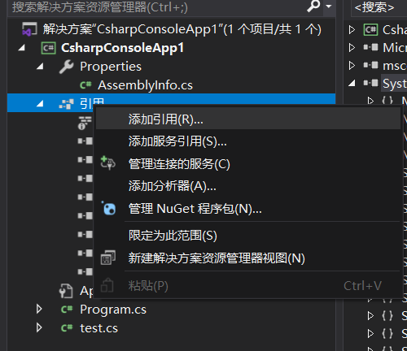
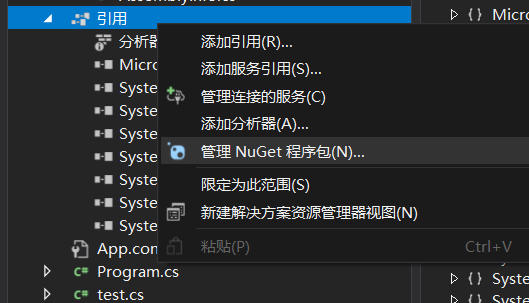
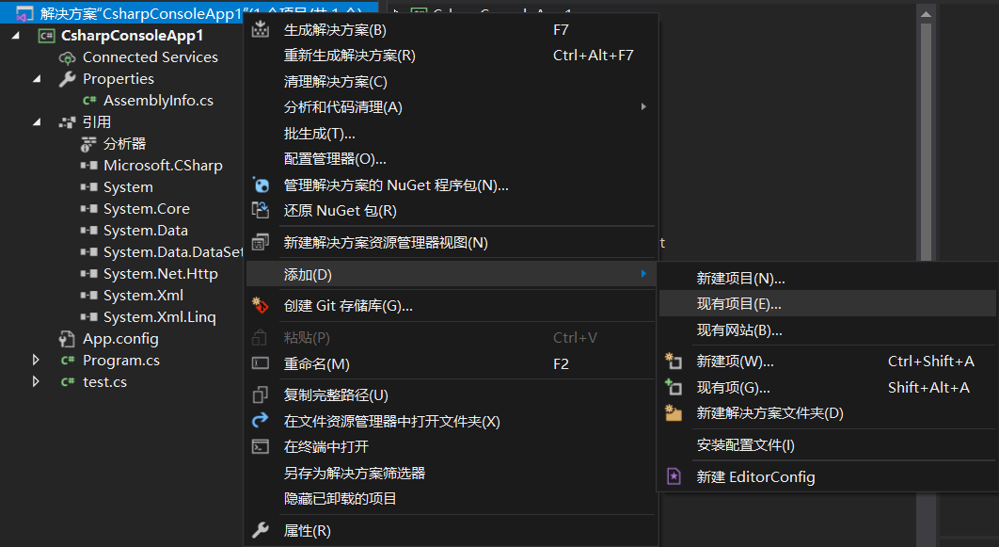
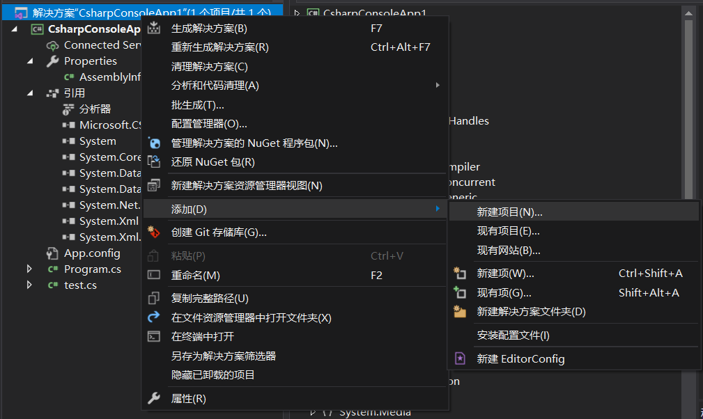
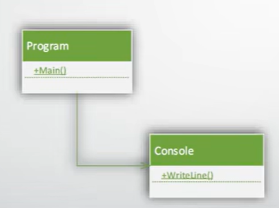
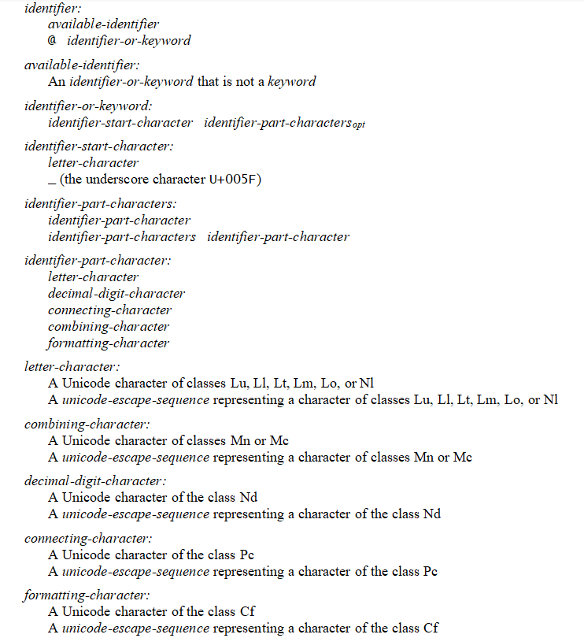
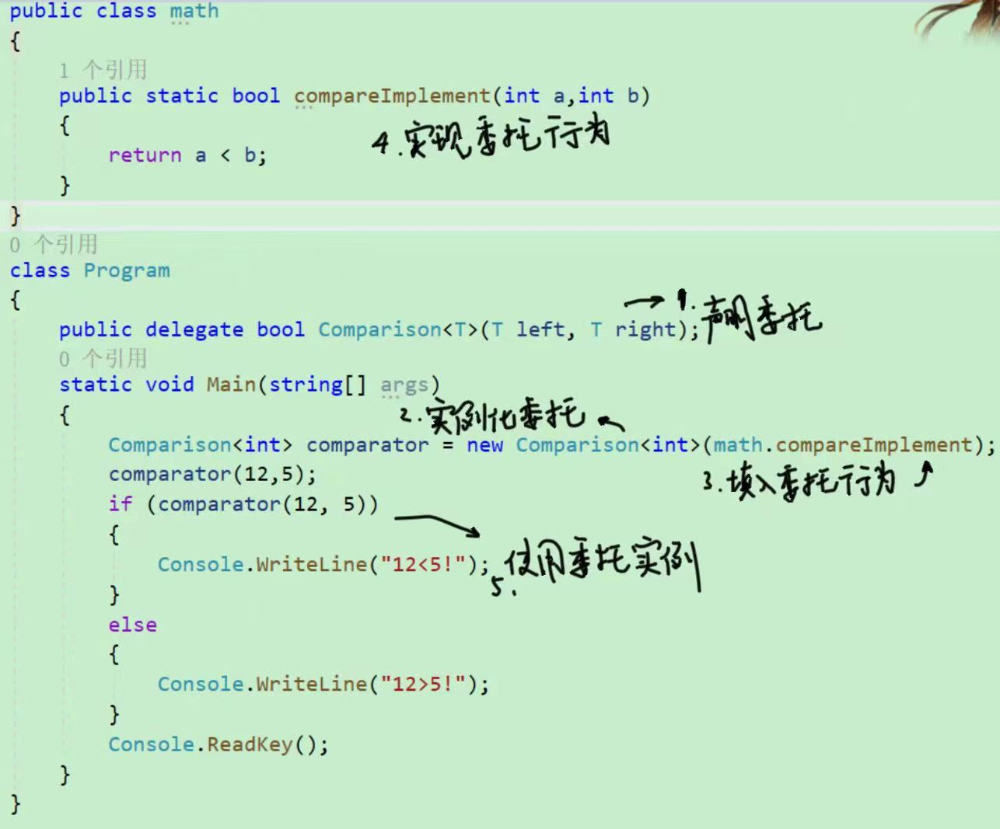
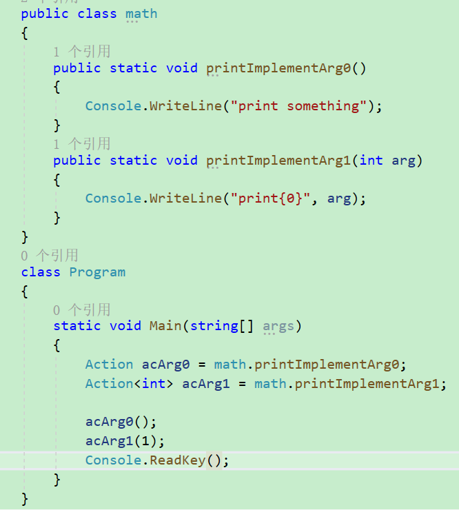
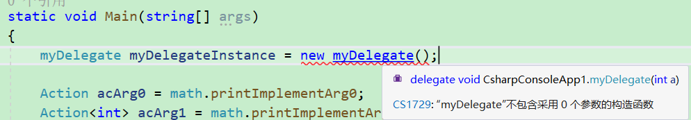
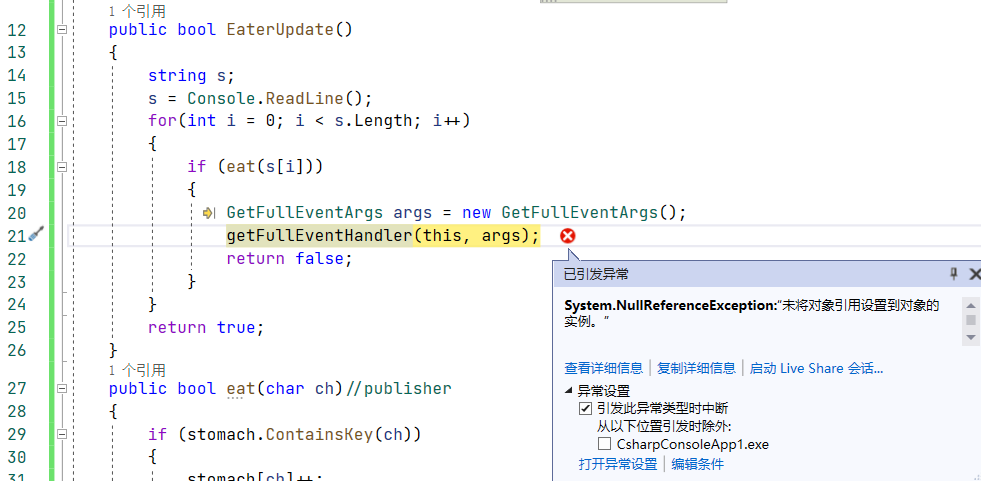

# 总论
C#学习笔记的撰写依据参考信息来源主要包括：
[Microsoft dotnet C# online document](https://learn.microsoft.com/en-us/dotnet/csharp/tutorials)
深入理解C#第三版
C# Specification 5.0
技术训练营课程

# 1.类，类库和命名空间
值得一提的内容，在初次进行C#编程的时候，并不知道一些需要用到的量所在的命名空间是什么，这时候要如何去找寻？
```
class Test
{
	static void Main()
	{
		Console.ReadKey();
	}
}
```
此时Console被标红，而初学者并不知道Console在哪一个命名空间下。作者提到一种办法，使用ctrl+F1 view help查看帮助，这时会跳出一个文档。
最基础的判断是，这里的Console只可能是一个类而不可能是变量名，因为变量名是无法在不定义的情况下使用的。那么我们就去文档中查询Console这个类，键入Console class就可以找到。

## 类库的概念
类库是这些预定义的类的代码的集合。上面的程序即便纠正了，也还是需要告知计算机，System.Console的ReadKey()函数是怎么工作的，这个时候就会引用类库。之所以能够使用命名空间来区分和查找类，也是因为类库引用。

## 类库引用
作者还讲到两种引用类库的办法。若是拿到一个`.dll`文件，实践中很可能就是同事发来的打包后的代码，这种引用方式称之为黑盒引用。
要想进行这样的引用，我们在项目层级下找到Reference，右键Add reference

浏览后选取合适的dll文件，确认添加即可。一旦添加，这个类库下的所有类都将可以在当前项目中无误地使用。
不过要注意，之所以叫黑盒引用，是因为.dll文件实质上已经不再是C#代码，而是编译后的结果。这样做造成了一种所谓的类库依赖：一旦在我的代码中使用了任何一个`ColleagesLibrary.dll`当中的类，我的代码也就依赖于这个类库，如果类库出错，我的代码也会出错；如果类库需要进行修改，我则必须重新选取改动后版本的类库重新引用。

有一种代码技巧，叫弱依赖，即尽可能避免底层类改动造成用户类代码跟着需要改动。低耦合高内聚的代码往往是弱依赖的。

有时候，在引用一个VS提供的类库时，即便做完了上述步骤，依然提示xx is defined in an assembly that is not referenced,也就是更底层的依赖项需要跟着引用，如若不然上层的类库也不能使用。因此，这也引出了一个重要的原则：**使用类库时，必须配套获取其说明文档**，文档将会指示用户，这当中的每个类分别依赖什么底层类库，如果我仅仅用到其中一个类，这个类的实现依赖于另一个类库，我只要补充引用那个类库就足够了，而不是把所有可能需要的依赖类库都全部引用上。

作者还提到了一种解决类库依赖问题的工具，其内置在VS当中，叫做Nuget。

在添加引用时，改为点选管理Nuget程序包即可使用Nuget。在Online当中搜索需要引入的上层类库，Nuget就会为这个类库补充其需要的底层类库。

此外还有一种引用类库的方式，叫做白盒引用/项目引用，这种引用事实上在引用源代码，即把别处的代码抄过来来供我的代码使用。这种时候，我们拿到的是一段尚未编译的源代码。把这些代码包含进自己的项目：

右键自己项目的解决方案条目，添加已有项目，把拿到的源代码项目添加到自己的项目里。添加后，解决方案下出现了两个项目。
此时，在Add reference时候选择solution，就能看到solution/project下有刚刚加入的项目。这样一来，我们就能完全像使用自己的代码那样使用，乃至于debug引入的代码了。

允许一个项目被多个不同的项目分别包含。

## 自己建立类库

在新建项目中选择类库。创建出的class library项目也是一段源代码，但是其不能执行，也不应该拥有进入点。这段代码在编译时只会形成一个.dll。

## UML
UML通用建模语言绘制的类图就是用于描述代码设计下的依赖关系。高内聚低耦合的程序能够让类和类之间非必要不彼此依赖。

由于我们的项目的Main函数直接使用了`Console.WriteLine()`,这是一种紧密依赖。

## 类的成员简介
以属性为主的类被称为模型类，比如Entity Framework；
以方法为主的类被称为工具类，比如Math，Console
以事件为主的类被称为通知类，比如Timer

静态成员static属于类，而实例成员属于对象

# 2. 构成C#的基本元素
C#的基本元素包括关键字、操作符、标识符、标点、文本，这些都属于标识Token

C#标识符合法定义

解释：第一行中identifier有两种选项，一是可用标识符，而是在标识符或关键字前面加上@，这表明在C#中可以通过在关键字第一个字符加@来把一个关键字变成可使用的identifier

合法的标识符起头字符包括所有字母、下划线等，注意C#也允许多种语言作为identifier，可以取中文名字、拉丁字符等等等等。   

# x.Delegate委托
来看一段代码捏。要看懂这段代码中的尖括号，你或者要学习C++ Tamplate（模板），或者要学习C# generic(泛型)，他们是很接近的概念：

这就是委托的使用过程。

声明委托时，底层事实上是替我们创建一个类，这里就是名为`Comparison<T>`的类，未来要给这个类实例化对象时会使用一个静态函数(或者函数对象)作为唯一参数，这个类的构造器会检查那个函数：返回值与参数表必须与委托声明中规定的一致。

目前这个例子几乎是最简单的委托，他显得简单但无必要：我们大可以直接使用具体的函数而非委托来做这样的功能。委托的力量会在后面的例子中进一步地体现。

## Make delegate powerful 1 - Action
Action 是一类预定义的delegate。C#设计者写好delegate底层代码后的第一件事儿，当然是帮C#程序员搓一些好用的delegate了。Action可以接受0-16个泛型类型参数。
Action是这样一批特殊的delegate：他们的构造函数进行对作为参数的函数类型检查时，返回值是void型。




Action几乎把delegate变得更**肤浅**了，他仿佛是一个函数的别名一样。那么我们究竟为什么要舍近求远地去使用Action呢？

## Make delegate powerful 2 - 注册
让我们回到最一开始的例子，关注这样一句话：
```
Comparison<int> comparator = new Comparison<int>(math.compareImplement);
```

这个行为叫做Instantiate a delegate(实例化一个委托)，但事实上它具有两重含义：
1. 构造一个委托的实例，创造出这个委托对象(本是空的)
2. 把函数`math.compareImplement`注册在这个委托上
由于我们不允许空的委托，所以必须像这样写，在构造委托实例之初就得给他第一个挂载的函数



(上图是一个错误的举例)
当delegate只注册了一个函数(或者说委托行为)，整个delegate表现得像一个函数别名；但若更多函数注册到了这个delegate上，其power就体现出来了。若我们调用这个delegate，将会得到**所有注册函数都被调用**的结果，这是一个很棒的功能。
我们可以在已经构造好的委托实例上继续注册新的行为：
```
OrderDelegate orderDelegate = new OrderDelegate(Order.BuyFood);
            //向委托中注册方法
            orderDelegate += Order.BuyCake;
            orderDelegate += Order.BuyFlower;
```
如此一来，一旦`orderDelete()`被调用，所有三个函数都会执行。

## Make delegate powerful 3 - Anonymous delegate
我也称呼这种写法叫 就地委托，也就是不要填写什么函数名作为委托行为了，我们直接在委托注册或者构造实例的时候写具体的代码。这样的话，这个委托行为将会是无名的，因此称为`Anonymous delegate`

```
OrderDelegate orderDelegate = delegate
            {
                Console.WriteLine("generate delegate local");
            };
```
也可以在`+=`运算符前这样做。
```
orderDelegate += delegate {
                Console.WriteLine("generate delegate local");
            };
```

好啦，这就是委托最基本的内容啦。这里面还会遗留一些更深的课题，比如delegate底层是如何实现的，delegate的那些函数的执行顺序是怎么样的，诸如此类的，挖坑择日再填。

# x+1. Event事件
[Doc](https://learn.microsoft.com/en-us/dotnet/csharp/programming-guide/events/)
要想学习Event，先得学习delegate熬。自己先去找delegate的教程吧。
Event 是C#类成员的一种，它设定一个特定的条件，一旦条件满足，类或者对象将会通知别的类或者对象。一个Event从上面这个定义可见具有三个基本的信息：
1. Event主体，这个对象或者类被称为**发布人**`publisher`
2. 这个Event要播报的对象，可能是一些类，他们应当负责接受并处理这个事件，这些类称为**听众**`subscribers`
3. 要如何处理这个事件
4. 这个事件被唤起的条件或者契机

[C# 中的事件event](https://blog.csdn.net/Ivan_47/article/details/120741291)举个栗子：“裁判员开枪，运动员开始跑步。” 在上面这个例子中，事件拥有者是裁判员，事件成员是开枪，事件响应者是运动员，事件处理是开始跑步。

把Event和delegate从信息传递的层面上对比，我们不难发现，delegate是没有`何时触发`这层信息的，delegate的触发是完全被动的，仰仗外部的调用。

Event几乎就是delegate，使用时需要首先声明：
```
public event xxEvent;
```

## 和Event相关的几个类
1. `EventArgs`
这个类事实上没什么内容，更像是一种规定。为了避免让Event里的参数数量不一、类型不一造成混乱，我们总是因该这样做：先定义一个类xxEventArgs继承EventArgs，再用这个xxEventArgs来指定Event的具体参数。这件事是强制的，如果你的类并不继承自EventArgs，他不能作为事件处理器的参数
2. `EventHandler`
`System.EventHandler`为我们做了一些工作，使我们不必再在发布者类中定义一个委托来声明事件将如何使用一些类型的参数。相信我，使用EventHandler会使你的代码中少掉几个晦涩的字符串名字。
如果你还是觉得概念太多已经昏了，不妨跟我这样做：
*记住EventHandler就是Event本身  而不是字面意思的Event处理函数*
尽管这种说法有些问题，但这将帮助你对事件建立一个初步的认知。

## Event的使用流程
1. 声明Event
就像声明一个delegate那样，声明一个Event。Event应该是一个类的成员，并且由这个类(publisher)或者他的对象来规定事件的发生条件。
```
 public class Publisher
    {
        public event EventHandler<XXEventArgs> xxeventhandler;
        public delegate void delegateReplaceEvent<T>();
        //这两句话是等效的，EventHandler正是为代替这个而存在
    }
```

这里的写法中，第一个成员使用event关键字，XXEventArgs是标红的，不可识别。根据命名规范，一般我们把事件参数的名字写成xxEventArgs，且这个类必须继承自EventArgs——我们在第二点里面详细介绍。

第二行的写法是我们在delegate章节学过的经典写法，这种写法事实上创造了一个类，这个类只有一个构造函数，其参数是如此的函数：*返回值为void，参数表为void*。而在EventHandler的平替版本中，参数信息写在泛型里：比如上面就说明我们的Event接受`XXEventArgs`类型的参数；而返回值默认是void。没错，EventHandler的设计者敏锐地发现，在我们为事件定义delegate的时候，大多数情况下我们都在使用void的delegate——一个事件本身是没有执行逻辑的，事件发生了要如何去相应完全仰仗绑定在这个事件上的诸多订阅者(subscriber)函数，而事件本身天然应该是无返回值的。为了简化编程，EventHandler就被设计出来了。EventHandler仅是一个美化编程过程的泛型，本质上还是delegate。

2. **定义事件参数表类型XXEventArgs**
如我在前文所说的，XXEventArgs必须继承EventArgs，用于声明事件处理所用的参数：
```
public class XXEventArgs : EventArgs
    {
        public string xx
        {
            get;set;
        }
    }
```
3. **通过挂载/订阅来把事件和事件发生后的处理措施给关联起来**
我自己发明了挂载这个词，但其实更正确的说法是订阅。一些类(订阅者)告诉事件的管理者（发布者）如果事件发生了要如何做，这个过程就是订阅。订阅需要提供一个函数名，但也可以用匿名函数lambda表达式就地编写一个匿名的函数绑上去(不过这样做解绑/退订就麻烦了)
挂载有这样几种办法：
a) EventHandler构造器
我从下面的例证中截取一段代码，如果看不懂就看下面的用例解释
```
class Eater
{
    public event EventHandler<GetFullEventArgs> getFullEventHandler;
    //...
    public Eater()
    {
        stomach = new Dictionary<char, int>();
        getFullEventHandler = new EventHandler<GetFullEventArgs>(OnGetFull);
    }
}
```

一般地，在构造的时候给各种成员进行初始化。在这个时候给事件成员也初始化时很合情合理的。但是这也牵扯出一个危险的问题：我不想给EventHandler的构造器填写一个订阅函数，这合乎语法吗？答案是不符合，EventHandler没有0个参数的构造器。

你可能会说，这不是强人所难吗。我作为一个发布者，我的事件上没有任何我能知晓的订阅者，不是很正常嘛？的确，这也正是Event机制设计的初衷。如果你确实不想给EventHandler构造器填入任何函数，你可以选择**不进行event的初始化** 。但是我必须警告，一切捷径都可能引来灾祸。

C#允许程序员不对event进行初始化，即便你后来要使用event，你也可以直接拿来一个没有初始化的event直接用。是的。但是，**在C#中缺乏一种在编辑时检查event是否有订阅者的手段**。毕竟，很有可能一个订阅者在程序运行中动态地才决定要绑定到事件上，另一些情况下就算直到程序运行结束始终没有订阅者绑定到事件，但只要事件不触发，这种程序也不能说就是错误的。

为了杜绝这种危险，我们在下面一个part会介绍C#doc中介绍的预防空event执行错误的编程习惯。

还有其他两种值得一提的订阅方式，也是更常见的
b) 重载运算符+=
```
        Eater e = new Eater();
        e.getFullEventHandler += Warrior.onGetFullEventHandler;
```

这种写法太令人喜欢了。等于号右侧写函数名，不要带参数；这里通过类访问是因为我把`onGetFullEventHandler`定义成了静态的（按照编程规范，任何不对类成员进行读写的函数理应声明成static的）。如果没有这样做，使用一个对象来访问其类的成员函数也是没有问题的：
```
        Eater e = new Eater();
        Warrior w = new Warrior();
        e.getFullEventHandler += w.onGetFullEventHandler;
```
这样写甚至又多了一层信息：事件发生，会执行的事儿只关系到w这个Warrior类实例，而不会影响到其他Warrior类实例

c)Lambda表达式
各种语言都充斥着这个代码初学者的死敌。我很不喜欢Lambda表达式，我知道有些情况下我们确实不比为一个临时使用的一句话的函数想一个函数名，但是像js这样写满了`=>（）`的语言真的是让初学者痛不欲生。
我们也可以用Lambda表达式来绑定subscriber：
```
        stomach = new Dictionary<char, int>();
        //getFullEventHandler = new EventHandler<GetFullEventArgs>(OnGetFull);
        getFullEventHandler = (sender, args) =>
        {
                //函数逻辑
        };
        
```

4. Event由publisher触发，subscriber监听并执行事件发生后对应的处理逻辑。
到了这一步，事件就讲完了。一旦事件被触发，这个时点订阅事件的所有函数都得到执行。1次。按绑定顺序执行。因此如果你想让一个订阅者在所有订阅者中最先执行，可能的话应该试着让他成为构造EventHandler的那个subscriber。


我们设计这样一个用例：
贪吃怪Eater不断从Console获取输入，吃下这些字母，直到其凑齐三个同样的字母。一旦吃够，Eater发出一个通知（事实上通过事件来实现），打嗝。勇者Warrior听到Eater的打嗝感到很害怕，在Console打印一个感叹号。
代码如下。我使用了一个Dictionary来实现这个功能，另查。

```
class Eater //publisher
{
    Dictionary<char,int> stomach;
    public event EventHandler<GetFullEventArgs> getFullEventHandler;
    public bool EaterUpdate()
    {
        string s;
        s = Console.ReadLine();
        for(int i = 0; i < s.Length; i++)
        {
            if (eat(s[i]))
            {
                GetFullEventArgs args = new GetFullEventArgs();
                getFullEventHandler(this, args);
                return false;
            }
        }
        return true;
    }
    public bool eat(char ch)
    {
        if (stomach.ContainsKey(ch))
        {
            stomach[ch]++;
            if (stomach[ch] == 3) return true;
        }
        else stomach.Add(ch, 1);

        return false;
    }
    public Eater()
    {
        stomach = new Dictionary<char, int>();
        getFullEventHandler = new EventHandler<GetFullEventArgs>(OnGetFull);
    }
    protected virtual void OnGetFull(Object s, GetFullEventArgs e)
    {
        Console.WriteLine("Gurrrrr.....");
    }

}

public class GetFullEventArgs : EventArgs
{
    //在这个例子中并不需要什么事件参数，但是有的情况下随事件消息传送一些信息时就会用到了
}
public class Warrior //subscriber
{
    public static void onGetFullEventHandler(Object s, GetFullEventArgs e)
    {
        Console.WriteLine("!!!");
    }
}
public class test
{
    static void Main(string[] args)
    {
        Eater e = new Eater();
        e.getFullEventHandler += Warrior.onGetFullEventHandler;
        while (e.EaterUpdate()) ;

        Console.ReadKey();
    }
}
```

在这段程序中，`贪吃怪Eater吃饱了`对应的事件`Eater.getFullEventHandler`上订阅了两个函数，一个是Eater自己的私有函数`OnGetFull`，另一个是Warriors类的静态函数`Warriors.onGetFullEventHandler()`
EventHandler作为一个继承自delegate的类，总是检验挂载于其上的函数们是否和自己定义时的返回值(这个例子中是void)和参数类型(声明EventHandler时候用了参数`GetFullEventArgs`, 而订阅者提供的函数参数表应当是`Object s + GetFullEventArgs e`)

输入和输出如下：
```
a
b
c
a
b
c
a
Gurrrrr.....
!!!
```

这个例子中，发布者是Eater，而订阅者是Eater与Warrior。从编程范例和设计event的初衷来看，event总应该声明为public，因为它的功能是提供一个订阅接口(在其他语言的观察者模式中也认为是`接受通知的接口`)

## 安全使用Event
回到我们之前遗留的安全问题。如果我不给事件绑定任何subscriber，并且执行事件，会发生什么捏？比如，我们把Eater中对于event的初始化语句删掉，再把Main函数里绑定`Warrior.onGetFullEventHandler`的语句也删掉：
```
////getFullEventHandler = new EventHandler<GetFullEventArgs>(OnGetFull);
//...
//e.getFullEventHandler += Warrior.onGetFullEventHandler;
```
这句话不会引发任何编译器报警。然而一旦运行，等贪吃怪吃下三个相同字母，立马发生异常：


致命的运行时错误。所以C#程序员必须努力地避免让一个事件有任何可能在没有任何订阅者的情况下执行。

那么安全的习惯是什么呢？最简单的也是我最喜欢的一种就是在上面引发异常的位置这样改写：
```
getFullEventHandler(this,args);//不要这样写
getFullEventHandler?.Invoke(this, args);//改成这样写
```

Invoke是EventHandler类的内置函数，既然我们的getFullEventHandler定义