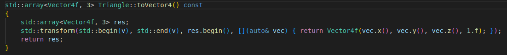
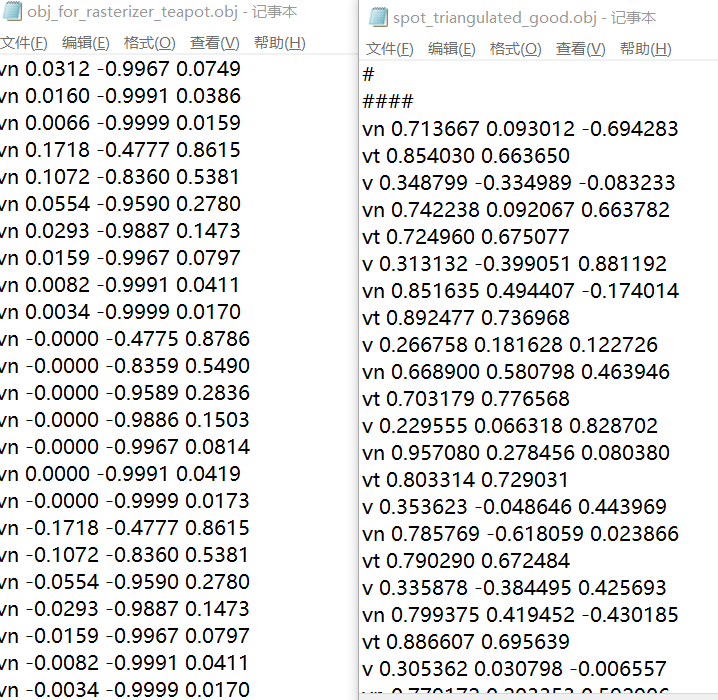
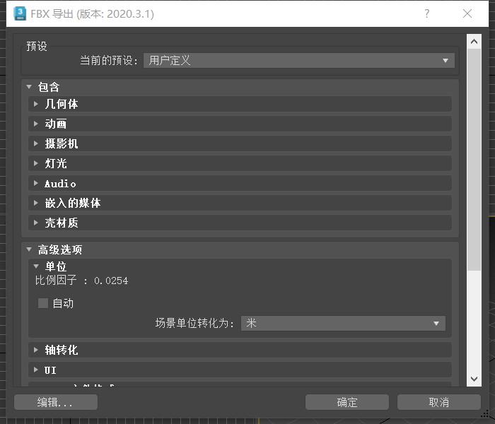
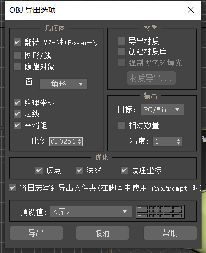
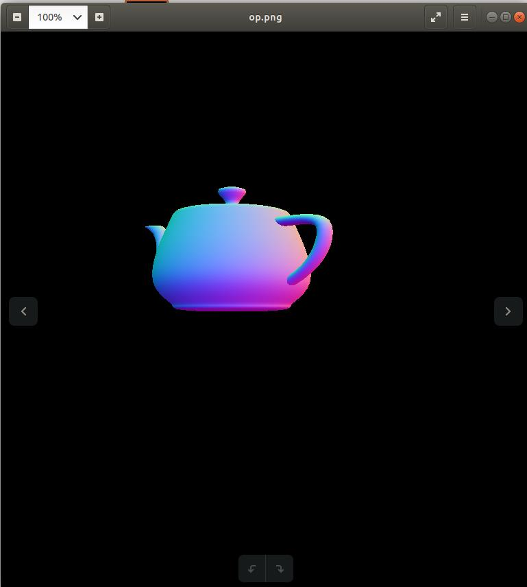
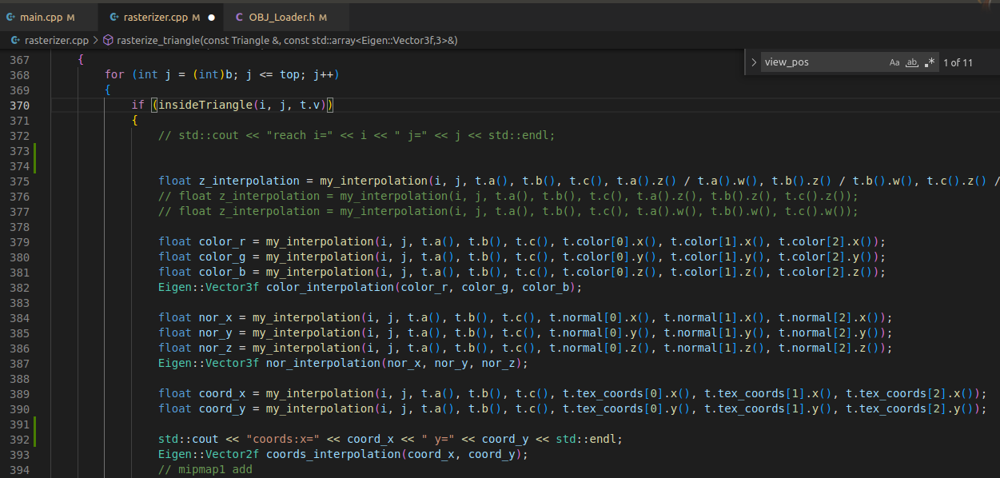
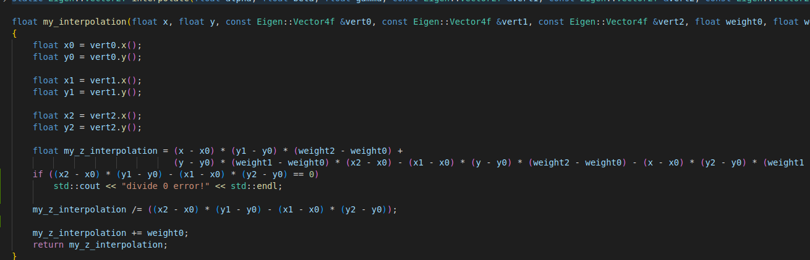
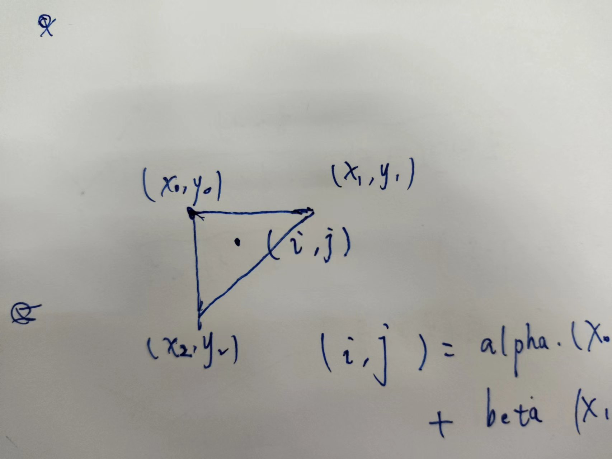
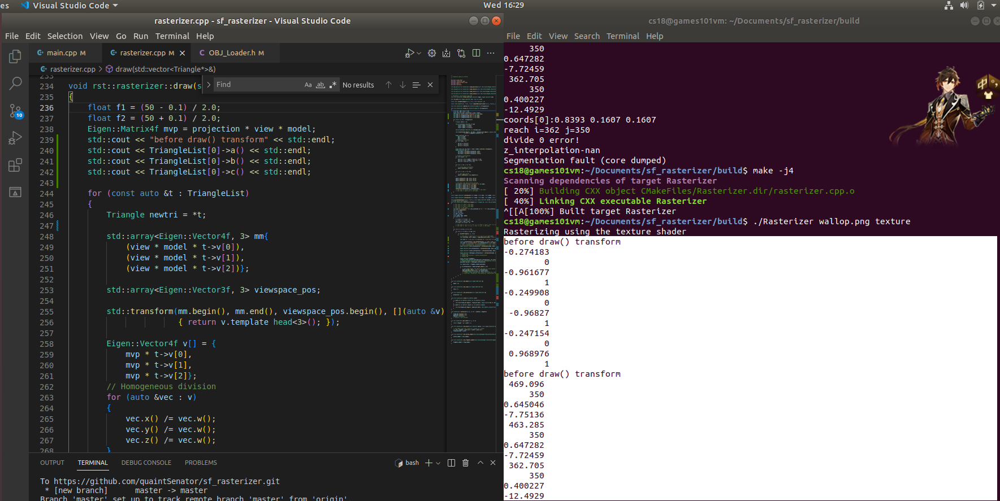

# C++光栅器 debug笔记
## 前言
这个光栅器程序在写下此笔记的时候已经粗具模型，可以输入obj文件

## 上接导入导出交互笔记

真的后悔为什么最一开始不检查一下两个obj文件的数据有什么异同。在之前的奶牛obj中，除了排列成v vt vn三行一组之外，还有一个重要的不同：在奶牛obj，数字都是浮点；而在导出的茶壶当中，大多坐标达到了10数量级。

这是我不太理解的，作为mesh，输入的时候一些点为(10,40,10)不是很正常的事情吗
搜到一些博客，介绍类似的项目，他们的3ds 导出obj似乎就是v为小数。
我们回到3dsMax的导出程序：

我们可以看到这里的高级选项-单位上，如果点选自动，**场景单位**将会转化为英寸，此时的比例因子是1；而如果设定为米，则比例因子降到了0.0254

在obj导出文件里没有这些设定，比较简陋(可能是因为obj导出确实已经不再流行)

我们照样使用这个0.0254作为比例，就能成功统一两个模型的差异。
这样输出之后的所有顶点坐标也都变成了小数，我们就可以放进程序里跑了：

## 正文
首先这里我乘以0.0254的归一化方案似乎并不具有普适性。后来我为了实践mipmap又在3dsMax捏了一个由近及远的墙体模型，那个模型里的数据纵使乘以了0.0254也还是偏大，还是会发生段错误。我通过手动归一化，把顶点数值全都在读取之初就拉一次归一化解决了。但是这样做就会让这段程序能够显示墙体，却不能再回去读取奶牛模型了。要想读奶牛模型就不得不回去删掉这段归一化顶点。

概括：
- 1.无法解释数据变大后为什么发生段错误
- 2.不理解数据从原始坐标系如何变动成最终的数据。

这之后我开始了漫长的、收获甚少的debug。

现在正在解决的问题更加离谱，让我发现了之前一直引以为傲的三点式插值存在的问题：

平面三点式是一个很好的想法，能够比较直观地用高中数学来理解插值过程。但是这段程序当中其实有一个致命的问题。如果有一个横平竖直的三角形：

那么这里的分母`(x2-x0)*(y1-y0)-(x1-x0)*(y2-y0)`就要变成0了。这也直接导致了我的coords坐标变成一堆NaN.

我们先来解决这一问题。

接着我发现，纵使替换了这段代码也还是无法解决这个问题。我现在怀疑三角形的索引出现了问题，导致一个三角形中的三个点被映射到两个或者一个点上。

一个三角形，三个点的y全都相等。好像这样一想，甚至不是代码的问题了。

想象一下，我们的照相机放在原点位置，看向-Z方向，那么三个y值相等的三角形在正交视角里看起来将会是一条横线。与此同时，由于y相等，