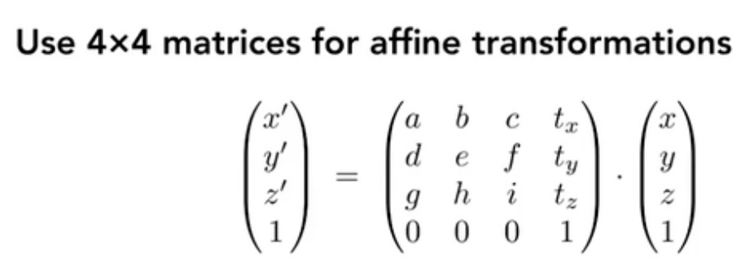
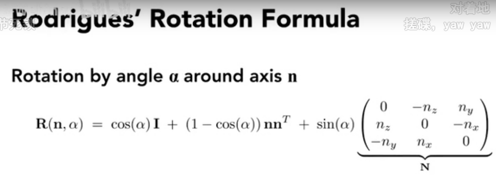

# 变换
## 基础变换
其他几种基础的向量变换都可以手动推导，重点是把向量变换表达成向量左乘矩阵得到变换后向量的形式。这些基础变换包括切变shear、缩放、旋转等
## 正交化
为了解决**平移**变换无法写成向量乘以矩阵的形式的问题。
正交化公式如fig1.

正交化通过给二维的点和向量升维，(x,y,1)表示点，(x,y,0)表示向量，这样变换后的点或者向量就能用矩阵
||||
|--:|--:|--:|
|1|0|tx|
|0|1|ty|
|0|0|1|

与向量相乘得到平移结果。

平移translation属于仿射变换Affine Transforming，所有的仿射变换都需要写成一次线性变换在叠加一次平移translation，也都可以通过正交化改造成矩阵相乘形式。

## 复合变换
 
 

## 三维变换
- 三维仿射
 

- 三维旋转
  
绕任意轴的旋转都可以分解成绕x，y，z三个轴的旋转的叠加，绕三个轴的旋转角分别记为三个欧拉角。
  

这种分解方法叫罗德里德斯旋转公式：
  

## 视图变换Camera/View transformation in MVP transformation

投影特指将三维的物体投射成二维的过程，是计算机图形学中最重要的变换之一。在游戏中，转换视角查看到的游戏场景，拍照时拍下的相片，包括人眼接收到的影像信息，都是投影变换之后的结果。

计算机图形学的三维到二维的变换过程分为：
第一步 Model transformation模型变换

第二步 view transformation视图变换

第三步 projection transformation投影变换

视图变换首先需要描述Camera，通过三个向量：
1.位置向量**e**
2.视角向量**g**  gaze direction
3.上方向**t**（想象手机拍照过程中歪斜手机）

 **规定相机永远在原点、竖直向上t=y、看向Z负方向g=-z**
  

投影变换中有两种不同的投影方式：
orthographic projection正交投影
perspective projection透视投影
正交投影常用于工程制图，是一种对于事物本身形态的的真实描摹，他并没有近大远小效应；而在电影和游戏中，我们往往采用透视投影，这是因为人眼对现实世界的成像也具有透视效果，观察自己的房间，长方体的两个屋檐延伸后会相交。

上面讲到，规定相机永远在在原点、竖直向上t=y、看向Z负方向g=-z的好处在于，这样设定后只要忽略z轴，空间上的(x,y,z)直接就变成了平面上的(x,y)

# raterizing 光栅化
大多数的计算机图像都是光栅化的结果。光栅就是指小三角形。
