# L4 游戏引擎中的渲染
## 渲染outline
**Basic of Game Rendering**
- Hardware architecture
- Render data organization
- Visibility

**Special Rendering**
- Terrian
- Sky & Fog
- postprocess

**Materials, Shaders and Lighting**
- PBR
- Shader permutation
- Lighting
    - Point/Directive lighting
    - IBL/Simple GI
  
**Pipeline**
- Forward, deferred rendering, forward plus
- Real pipeline with mixed effect
- Ring buffer and V-Sync
- Tiled-based rendering  

Texture sampling
step 1: use two nearest mipmap levels 采用最近的两层mipmap
step 2: perform bilinear interpolation in both mipmaps 在两层mipmap都进行双线性插值
step 3: linearly interpolation between results 两次线性插值结果再做线性插值

## 显卡架构
SIMD & SIMT
SIMD，single instruction mutiple data,单指令多数据。
SIMT, single instruction mutiple threads,单指令多线程
（显卡算力现如今能达到25T FLOPs）

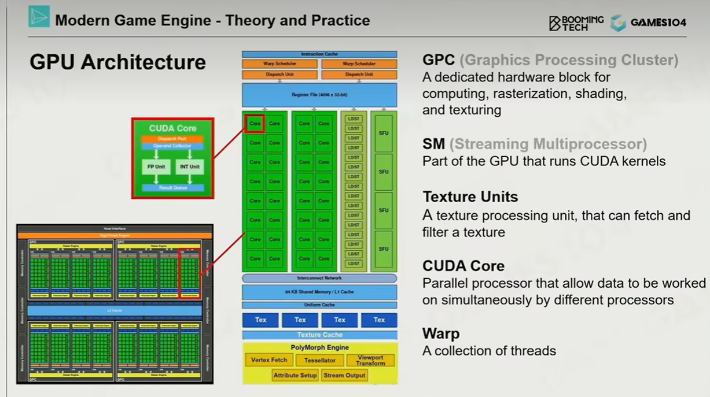
SM,streaming multiprocessor是GPU的运算单元

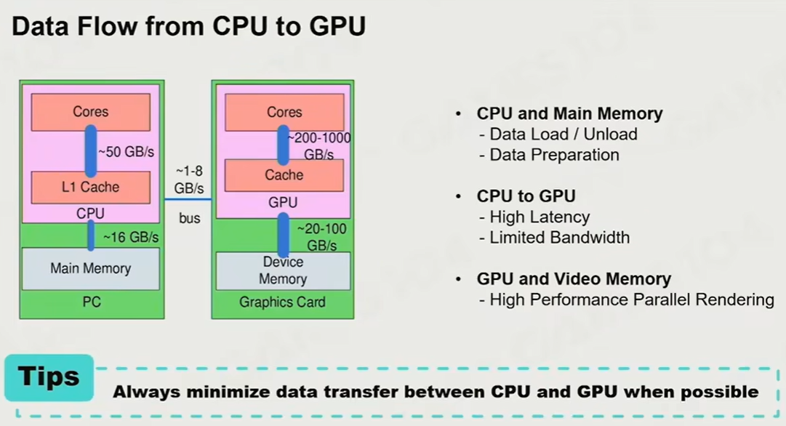
如果采用CPU传递数据给GPU计算、GPU传递数据给CPU判断修正、CPU传递给GPU要求绘制、GPU传递绘制结果，GPU和CPU将数据块来回传递了两次，且绘制必须等待CPU回复才能进行，那么就很有可能造成一帧的画面不同步。原则：**CPU将数据交给显卡后，就应该等待显卡的绘制结果、尽量不要读取GPU数据**

如果GPU需要运算时，发现一些数据并不在GPU cache中，而在内存里，这就需要一次主存访问，而其时间约为直接读cache的一百倍。原则：**数据应尽量集中地放在一起，提高cache命中率**

游戏的实际性能受制于：
ALU bound：数学运算过多，各项工作因等待数学运算而延缓
TMU(Texture Mapping unit)Bound
BW(Bandwidth bound)
Memory bound

## 可渲染物体-Mesh Render Component
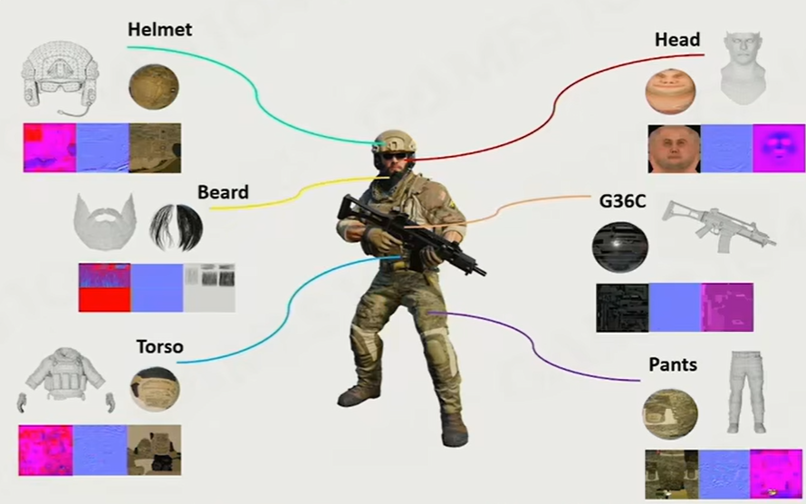
对于游戏中物体的绘制，往往是采用Mesh+Material;

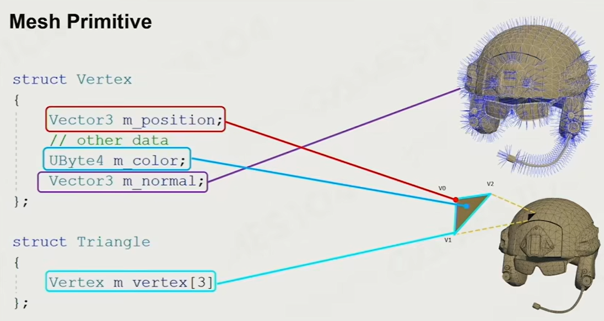
struct Vertex即**顶点**。在最基础的绘制模型中，顶点会携带**顶点颜色UByte4 m_color**，**顶点坐标Vector3 m_position**以及**顶点法线Vector3 m_normal**三个成员
struct Triangle即三角形(事实上这样做很低效，采取索引则更为高效)
**triangle strip三角形条带**，能够进一步优化性能，按照特定的顺序编排顶点，不必规定三角形，123，234，345...就能一一形成所有的三角形。
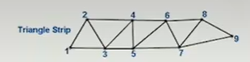

为什么要存储顶点法线、而不能直接为每个三角形存放？
以正方形的棱为例，棱的两侧的同一个顶点，其法线朝向不同

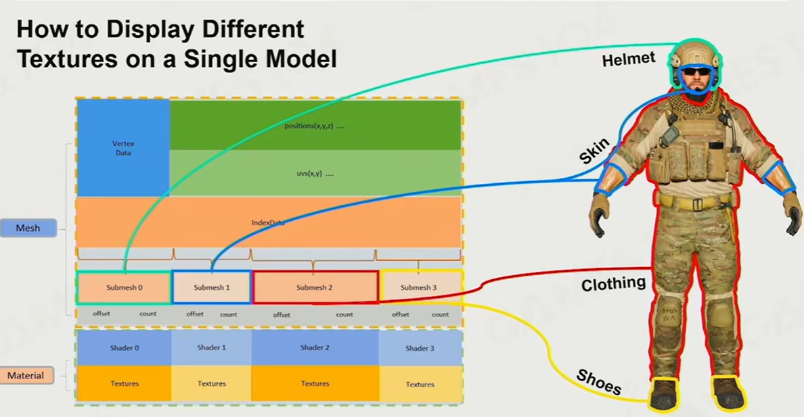
Submesh的出现是根据一个GO可能有若干不同材质的现实需求，倘若全部绘制在同一个Mesh当中则非常麻烦，很多已经做好的material也难以复用。

**Resource pool**
同样的材质很可能被反复地使用。同一个shader、mesh或者texture会在游戏中被各种重复使用，因此将shader集中存储形成shader pool,mesh 集中成mesh pool等 是有利的。
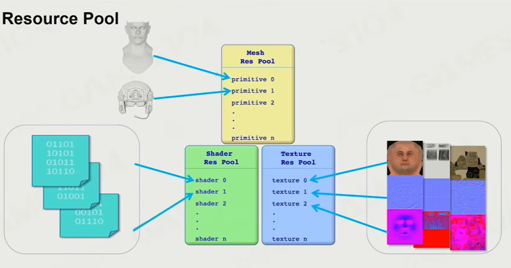

与此同时，引入实例化的概念，实际的GO其实是对于特定mesh、shader、texture资源的一个实例。
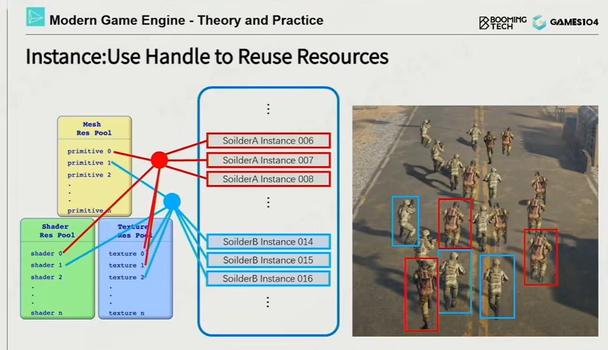

**sort by material**
场景里的GO在内存中应该如何分布？
之前已经讲过，尽量应该将同类数据集中存放、以免一次或一批GPU工作中GPU发生cache miss。因此，场景中的GO应按照material排序

**GPU Batch Rendering**
对于森林、草地等场景，不仅GO之间的mesh、shader或texture一样，有时候两个实例“完全一样”。

## 可见性裁剪visibility culling
由于视椎只是一个四棱锥，并不能看到游戏世界的全部。因此，其实只有被看到的GO才需要被绘制。
对一个GO进行的最简单的裁剪算法，利用bounding box与视椎view frustum相交即可。
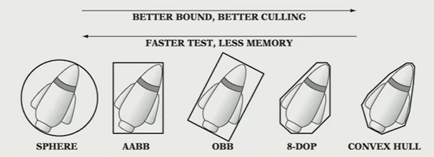
包围盒不仅可以用于culling，还可以用于物理系统等等，越紧密贴合物体的包围盒裁剪效果越好，但占用空间更大、裁剪检测更慢。
**BVH**(**bounding volumn hierachy**)是一个非常有效的算法。每个GO聚落都大致地切分成第一层的若干大包围盒：
在视椎内的包围盒，其中物体全部绘制
在视椎外的包围盒，其中物体全部忽视
与视椎界线相交的包围盒，进一步迭代，对其中的每个GO再次判断是否在视椎内。
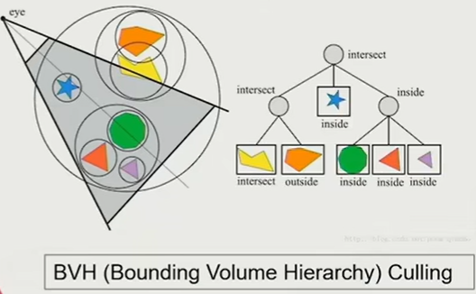

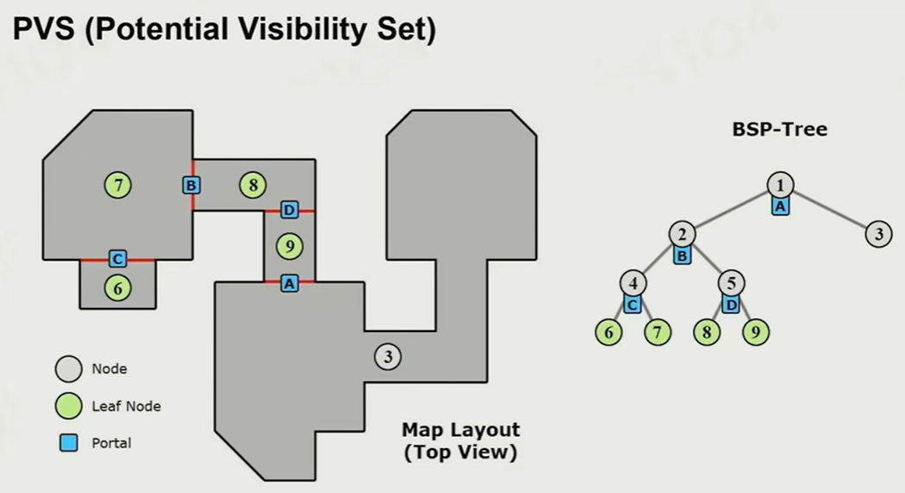
**PVS思想**（可能看到的集合）与枪战游戏、闯关游戏比较搭配。想象玩家在某一个房间，透过窗户能看到4和5房间、透过门能看到3房间，那么其实无论玩家在这个房间里怎么移动，都不必渲染除3、4、5以及当前房间之外的任何房间。把地图的房间按照树状结构整理，就能形成BSP tree(binary space partitioning tree,二分空间树),不断把空间向下划分，就能在任何一个房间里知晓究竟需要绘制哪些房间。
如今很多游戏已经过于复杂、场景宏大，无法使用PVS划分空间，但是如果把一片区域想象成一个房间，比如csgo的inferno中把警家、连街想象成两个区域，那么连接通道就是连接两者的门，依然可以使用PVS思想，在玩家尚且在教堂时，只有等玩家到达了警家才需要开始绘制连街。这种区域被称为zoom，在一个zoom里能够判别有哪些其他zoom可能也需要绘制（有时考虑把场景资源加载也以这种方式进行）

**显卡的early-z功能**
显卡能在绘制任何一个像素的时候，判断出这个像素其实已经被遮挡从而不进行绘制。其实现原理是任何时候的绘制，总是形成一张与实际像素图一一对应的纹理，每个像素位置存放这一像素被绘制时的深度，这个纹理图被称为深度纹理。后续实际绘制时总是先进行深度测试，新物体的任何一个像素倘若深度大于深度纹理上此处深度，并不进行绘制。否则，进行绘制，并覆盖此纹素位置的深度。
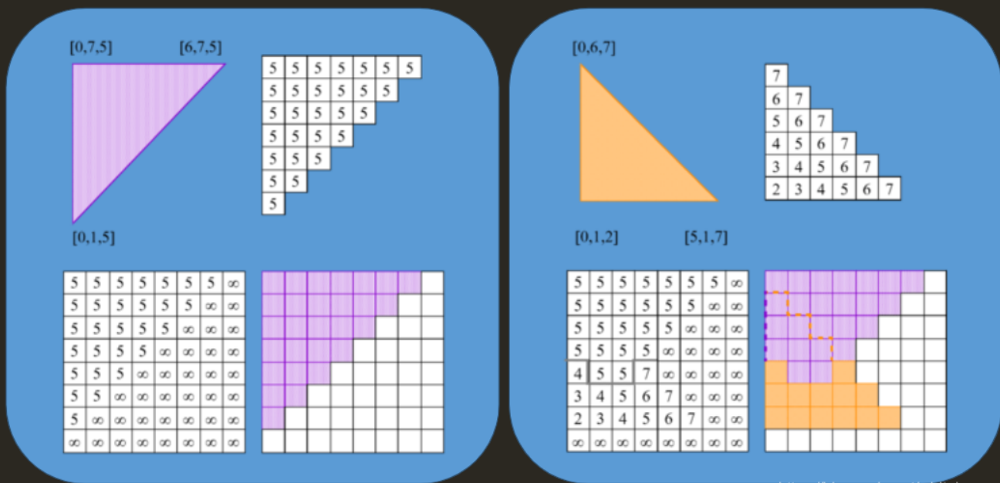

**纹理压缩texture compressing**
我们已经知道，绘制的过程当中会产生大量的纹理。纹理必须采用一种更省空间、随机访问的方式压缩。
block-based compression
把图像切割成若干4x4的色块。在这个16个像素的色块中的每一个1x4的行，取最亮的一个点和最暗的一个点（RGB总和越大，就越亮，反之越暗，0，0，0是纯黑色）把剩余的2个点当成这两个点的插值，这样就可以记录为c0,1/3c0+2/3c1,2/3c0+1/3c1,c0.对于其他行如法炮制，就得到了一个4x4的矩阵，进而可以还原出原图：
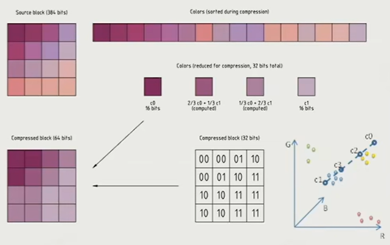
这个算法虽然有小小的失真，但是压缩、解压缩效率极高，可以在CPU上实时完成。

**cluster based mesh pipeline**
如果要对一个物体不断地丰富细节，就会让Mesh变得特别复杂。一种方法是把物体本身也给划分成若干个小的meshlet(cluster),这有非常多的好处，既可以让物体变得更复杂、更逼真，也可以大大提高culling的粒度，一个物体内并不需要的许多cluster也可以被裁剪掉。

Unreal Nanite
是cluster based mesh pipeline的一个实践，达到了像素级的网格密度

# L5 游戏渲染中的光照、材质与shader
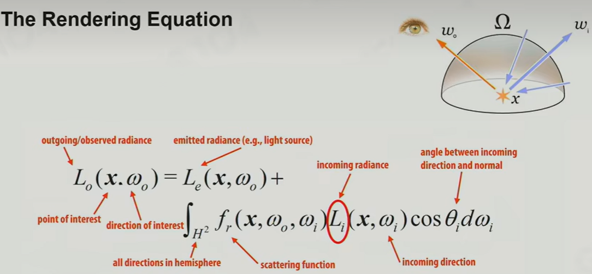
回顾一下渲染方程。

radiance 辐照度，即入射的能量。
Global Illumination GI,全局光照

渲染方程的最大问题：
1.如何得知各个不同方向的入射光radiance
2.计算半球面上的立体角积分非常耗时
3.渲染方程的一次结果，还会成为其他步骤的输入，从而造成递归

## 最简单的光照解决方案-布林冯光照方案

设计一个简单的光源(大多数时候是平行光，有时候也使用点光源和锥形光源)；引入Ambient light来丰富画面效果，用光源直照的平均值来模拟环境光效果。

优化-环境贴图Environment map

第一个实践光照-布林冯模型：
Light= Main light + Ambient light + Environment light

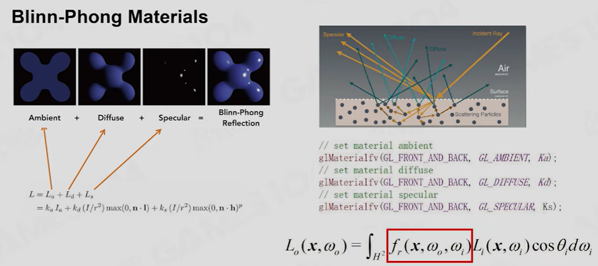
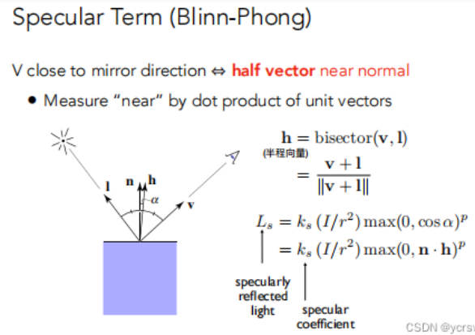
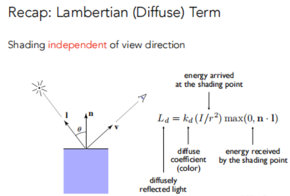
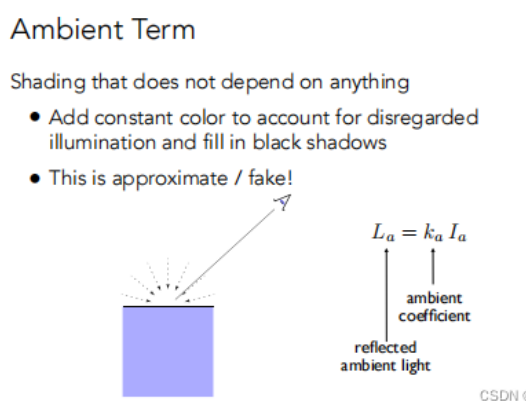

布林冯的问题在于，入射能量与出射能量没有对应(**没有能量守恒**)，因此与光线追踪并不适配，有时布林冯模型远远过曝、出射光大大超过入射光。

## 最重要的阴影解决方案-shadow map
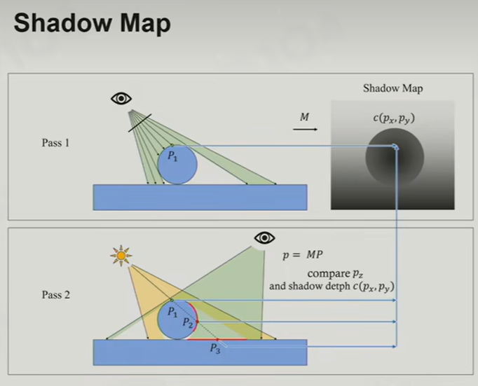
shadow map的基本思路：
1.以光源视角进行一次渲染，不生成像素，只生成深度纹理；
2.以真实视角对场景进行一次投影，计算能看到的每一个点
3...

## 2015时期的光照3A做法 Precomputed GI 预计算全局光照
过去更早时期，在进入暗室的时候，一般给光照施加一个Ambient，使得房间变得相对很亮。这会让场景在室内看起来变得很缺乏空间感，毕竟人对于空间的感知很大程度上来源于真实的光线与阴影效果。
由于场景的光源、场景一般不频繁改变，我们可以在场景加载的同时直接进行全局光照的预计算。这种方式归根到底不是直接的直接全局光照(计算开销过大)
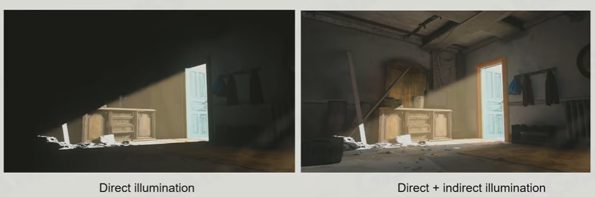
计算出的间接光，可以像材质球一样存储，但是这样一来光照存储量很大，且对于一个具体材质的物体，纵使有了这样的全局光照存储也需要通过立体角积分来获得最终的渲染结果。

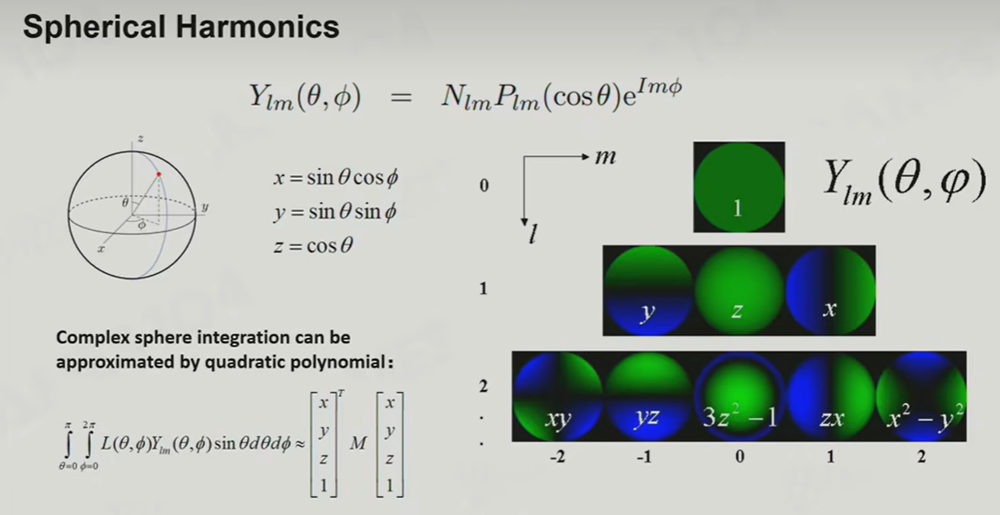
球面调和函数，或称球谐函数，简写乘SH，能够明显地压缩图像内容、并且只要简单运算就可以复原
EA. (2018). Precomputed Global Illumination in Frostbite. Retrived from http://www.ea.com/frostbite/news/precomputed-global-illumination-in-frostbite
球面上两个函数的卷积，等于两个函数投影到SH上的参数彼此的卷积。

SH lightmap 是Precomputed GI的关键。

没有看懂或跳过的部分
- Precomputed GI
- PBR材质
- 基于图像的光照
- 经典阴影方法
- 前沿渲染技术
- shader的管理

# L6 游戏中的地形、大气和云的渲染-上
**What's 地形渲染**
字面意思
**How to 地形渲染**
把地形和正常的物体一样去渲染显然是一种朴素方案。这样则要求准备巨大的底面纹理。

height map高层图 Contour Map 等高线图是两种描绘地形的方式。用heightmap来渲染地形的算法就叫heightfield(也是直到目前地形渲染最主力的渲染算法)。
heightmap是一张2D纹理，每个纹素位置存放一个高度数值。可以通过逐距离采样方法得到一系列顶点，然后自动build出三角形。
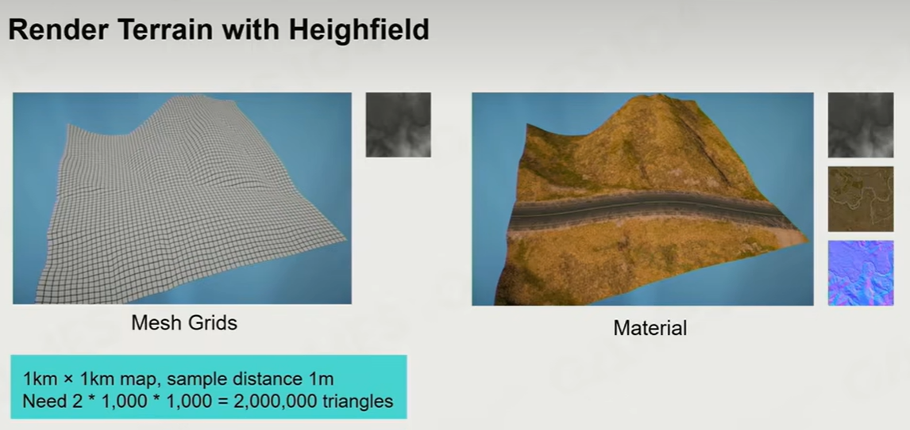

附注：
Maya和Houdini都有heightfield地形控件：
[Maya heightfield 官方DOC](https://knowledge.autodesk.com/zh-hans/support/maya/learn-explore/caas/CloudHelp/cloudhelp/2015/CHS/Maya/files/Shading-Nodes-Height-Field-htm.html)
[Houdini Height Field的基本概念 bilibili 专栏](https://www.bilibili.com/read/cv16586353/)
[Houdini crowds terrain 人群地形功能效果视频 bilibili](https://www.bilibili.com/video/BV1j44y1G7X6/?spm_id_from=333.788.recommend_more_video.-1&vd_source=fcabf2d02580039110de5bfc784d50d5)
**What's difficult**
当世界很大的时候，这样的三角形就会爆炸增多。以上图为例，1km x 1km的height map纵使按照1m距离采样，也会获得1000*1000个顶点，则会形成多于2M个三角形。
**How to solve**
图形学和工程实践中特别常见的一个概念**LOD levelofdetail** 在远处减少细节(反正也看不清)
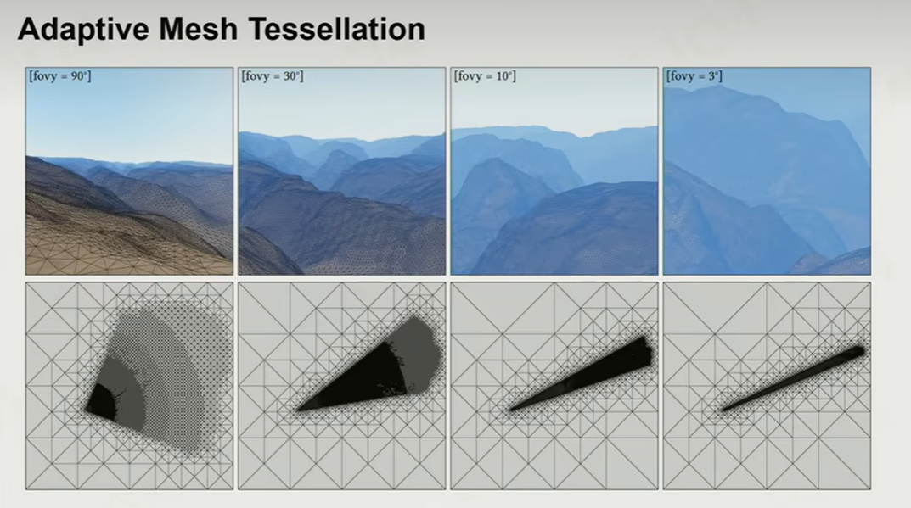
**adaptive mesh tessellation自适应网格细分**，提出依据视椎改变网格细化的策略。
fov指的就是视角，在fov内部将三角形分布的更密集，而在fov之外分布的稀疏。

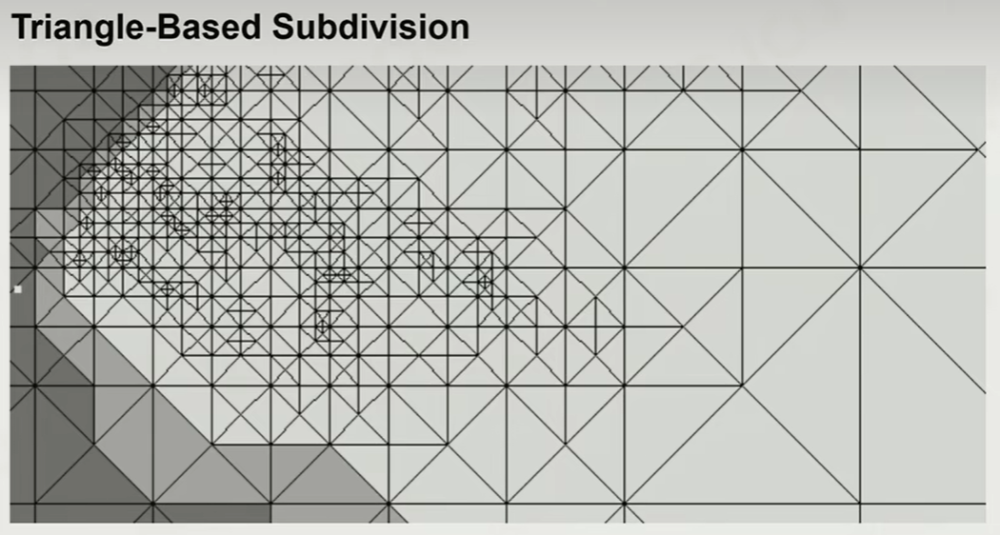
# L7 游戏中的地形、大气和云的渲染-下

