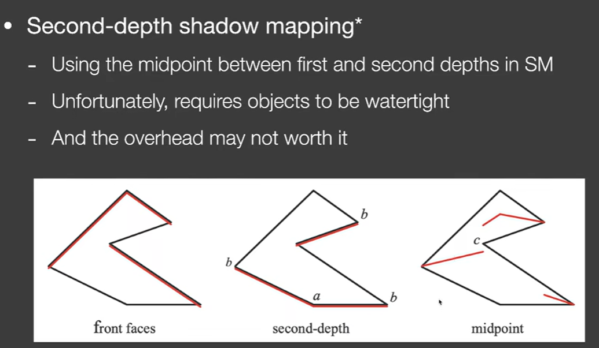

# Part 1 Shadow

Percentage closer soft shadows，PCSS是一种软阴影手段，其历史悠久但极为有效，因此一直被今天的一线广泛使用。

## 经典 2-pass shadowmap 原理
**first pass**:从光源位置出发，生成一张深度纹理

**second pass**：从摄像机位置出发，再次渲染，但每个像素位置，都要检查这个像素**能否被光线照到**


能否被光线照到这个说法是比较模糊的。实际代码中，对于眼睛看到的像素(i,j)，我们需要：
1. 计算出shading point 被着色点的实际三维坐标位置，这一步可以通过Viewing和projection的逆变换矩阵来实现
2. 连接摄像头位置和shading point，得到一条线
3. 用这条线与first pass屏幕空间求交，得到shading point在first pass screen上的坐标(i0,j0)
4. 计算shading point在first pass上的深度，看与first pass得到的深度纹理上的(i0,j0)的值是否相等
5. 如果与深度纹理相等，则是被照亮的区域，运行照亮的着色；如果不等，则处于阴影中，则运行阴影内的着色。

2-pass shadowmap 是有许多问题的。
**self-occlusion 自遮挡问题**，在工业界被描述为**shadow acne阴影失真**。如下图，白色的地面上因为shadowmap出现了许多状似摩尔纹的纹路，

这些纹路出现的原因是，在光源为camera的first pass当中，由于屏幕是有分辨率的离散区域，光源连接像素中心，连线到地面上就形成了一个个的**斜平面**，言下之意是，只要与像素方格内的任何一点连接，形成的光路都会近似成与这个像素像素中心的连线，这个区域对应了下面的**红色**斜线标识的**斜平面**。


此时再看蓝色虚线，一个本应该不被遮蔽的光线，结果由于另一个光路算出了一个斜平面，导致first pass下蓝色虚线的深度被计算成了橙色面的深度，从而导致深度不一致，产生了一个错误的阴影。有时候这种现象也被描述为**z-fighting**

为了解决自遮挡问题，一种直接的做法是：规定second pass的深度比first pass深度小一定的值才判定为阴影，而略微小不算。
但是这样做又会出现新的问题：

这种现象被称为**detached shadow阴影脱离**，工业界称之为**peter-panning**。
为了解决这个问题，又进一步地引入了正面剔除方法和second-depth shadowmap（但工业界往往只是采用一个合适的bias，保证阴影失真和阴影脱离两者都不是特别明显）

所谓second-depth shadowmap，其提出，我们在光源出发绘制深度图的时候，不但记录距离光源最近的第一层，还要记录穿透后的第二层深度，用两者的平均作为最终的深度。


## PCSS，percentage closer soft shadow
生成hard shadow后，人们更希望获得看起来效果更好的软阴影。

PCF Percentage closer filtering, 原先是一种用于抗锯齿的技术。


假设已经完成了first pass获取了深度图(记为F1[ ][ ])以及second pass的深度图(记为F2[ ][ ]);
对于second pass中的纹素(i0)(j0)每次获取任何一个shading point的深度图内容时，
从shading point 引一条直线连接光源，并与深度图求得映射结果纹素(i,j)，不但把F1[i][j]拿来和F2[i0][j0]比较，还要**把F1[i+1][j+1]等F1[i][j]附近的点**也拿出来，都**与shading point深度进行比对**。这些比对将会形成一个结果矩阵，如上图，1表示相等，0表示不等(这里的等号也可以改为bias的近似相等)，那么这个矩阵内的0-1进行一个平均，就能得到一个被称为**可见性visibility**的数值，这将成为我们给这个shading point着色的重要参数.

当filter较大的时候，自然就能形成类似的软阴影——尽管这个阴影的模糊和事实上的物理原理毫无关系，但是看起来也还可以。

直接PCF存在的显著问题在于，其阴影的软与硬是一致的，并没有分别，而事实上根据我们的经验，距离物体较近的，其阴影较为硬；距离物体较远的，其阴影较为软。

应当引入一种方法，让遮挡物到阴影的距离纳入阴影的着色。    

## AS1 阴影
作业1的内容就是做阴影，一个hardshadow，一个softshadow。如果能够自己完成一个阴影demo，在图形学相关岗位的求职简历上是一个不错的记录。

### 项目的要求和webGL必要知识
项目的要求概括为：
1. 求lightMVP
2. 写完useShadowMap(sampler2D shadowMap,vec4 shadowCoord) 函数，至此调试出清晰hard shadow
3. 完善 phongFragment.glsl 中的 PCF(sampler2D shadowMap, vec4 shadowCoord, float filterSize) 函数
4. PCSS findBlocker(sampler2D shadowMap,vec2 uv, float zReceiver) 和PCSS(sampler2D shadowMap, vec4 shadowCoord)函数

在此之前，有一些没有提及的事情需要介绍。
opengl有一套称为GLM的数学库,它用起来像这个样子：
```cpp
glm::mat4 trans;
trans = glm::rotate(trans, glm::radians(90.0f), glm::vec3(0.0, 0.0, 1.0));
trans = glm::scale(trans, glm::vec3(0.5, 0.5, 0.5));
```
遗憾的是opengl的工作环境是生态较差的纯C++，我们无法在一个浏览器上运行的web项目中轻松地使用这个GLM。(调通oepnGL项目也需要下载若干工具，且写出来的代码很难，这也是课题组放弃openGL的原因之一)

webgl工作环境下使用的数学工具主要是gl-matrix-min，这是webGL的api。在index.html中，项目通过这个语句引入了gl-matrix-min.js，就像vue展示程序引入vue那样。
```
<script src="lib/gl-matrix-min.js" defer></script>
```
所以我们需要先简单介绍一下这个API的基本功能，看看如何调用这个API进行线性代数运算。

```
mat4.multiply(lightMVP, lightMVP, modelMatrix);//矩阵乘法，结果由p1返回
mat4.translate(mtx,mtx,translation);
//平移，把mtx平移translation(vec3)，相当于左乘一个translation对应的平移矩阵
//结果由p1返回
mat4.scale(mtx,mtx,scale)
//同上，进行缩放
mat4.lookAt(out,camera_pos,direction,up)
//甚至有lookat功能，定义一台相机，返回相机的viewing矩阵
mat4.ortho(out,l,r,b,t,n,f)
//根据六个面值，定义出正交投影的projection矩阵
```

### lightMVP
填写lightMVP的第一个困难是不认识参数。CalcLightMVP(translate, scale)的两个参数都是vec3，如果要求MVP变换矩阵，对于传统摄像机来说，我们要得到的是摄像机位置向量、摄像机lookat向量、摄像机up向量，这三个量才能够定义摄像机啊，为什么这里只给两个vec3？光靠两个三维向量就能求出MVP了?我101课白学了？

在这个webgl项目中，最终显示的模型右上角有一个控制台，可以改写模型的translate平移量和scale缩放量。这里的translate和scale也对应这个意思。这个项目不允许旋转，因此所有模型的旋转变换都是旋转矩阵=单位矩阵,三个轴向旋转0°的状态。

可是就算有物体的平移缩放旋转数据，没有光源信息怎么求lightMVP啊？

注意，这里CalcLightMVP是直接光类的成员函数，当然可以通过this指针直接访问直接光的一切信息，也就是说这里的两个参数只是补充物体的信息，所有所需的数据自然是完备的。

可以在DirectionalLight类的代码中添加一些调试来看一看一个DirectionalLight对象长什么样子：


那么就可以获取到MVP矩阵：
```
CalcLightMVP(translate, scale) {
        let lightMVP = mat4.create();
        let modelMatrix = mat4.create();
        let viewMatrix = mat4.create();
        let projectionMatrix = mat4.create();

        // Model transform
        mat4.translate(modelMatrix,modelMatrix,translate);
        mat4.scale(modelMatrix,modelMatrix,scale);
        // View transform
        mat4.lookAt(viewMatrix,this.lightPos,this.focalPoint,this.lightUp);
        //lookAt的第三个参数使用了focalPoint，也就是所谓光的焦点。
        // Projection transform
        mat4.ortho(projectionMatrix,-100,100,-100,100,0.01,400);
        
        mat4.multiply(lightMVP, projectionMatrix, viewMatrix);
        mat4.multiply(lightMVP, lightMVP, modelMatrix);

        return lightMVP;
    }
```
### useShadowMap

一开始useShadowMap长这个样子。
```js
float useShadowMap(sampler2D shadowMap, vec4 shadowCoord){
  return 1.0;
}
```
首先，这部分代码属于glsl，因此如果你遭遇问题，具备第一性的文档应该是[learnopengl](https://learnopengl-cn.github.io/)或者[glsl文档](https://registry.khronos.org/OpenGL-Refpages/gl4/).

他有两个参数。sampler2D是2D采样器。我们来看看learnopengl在[纹理](https://learnopengl-cn.github.io/01%20Getting%20started/06%20Textures/#_7)这一章节是如何介绍采样的：
*为了能够把纹理映射(Map)到三角形上，我们需要指定三角形的每个顶点各自对应纹理的哪个部分。这样每个顶点就会关联着一个纹理坐标(Texture Coordinate)，用来标明该从纹理图像的哪个部分采样. 使用纹理坐标获取纹理颜色叫做采样(Sampling)*
*GLSL有一个供纹理对象使用的内建数据类型，叫做采样器(Sampler)，它以纹理类型作为后缀，比如sampler1D、sampler3D，或在我们的例子中的sampler2D。我们可以简单声明一个uniform sampler2D把一个纹理添加到片段着色器中，稍后我们会把纹理赋值给这个uniform。*

这是learnopengl给出的片元着色器示例：
```glsl
#version 330 core
out vec4 FragColor;

in vec3 ourColor;
in vec2 TexCoord;

uniform sampler2D ourTexture;

void main()
{
    FragColor = texture(ourTexture, TexCoord);
}
```
glsl内置了texture函数，用来进行采样。p1是采样器，p2则是纹理坐标，是一个二维向量。这个程序是一目了然的，使用采样器ourTexture去采样TexCoord位置，返回的纹理颜色值就是片元着色器的结果。

如果对于这部分还不够清楚，可以看我[learnopengl的学习笔记](./learn_opengl.md)

回到当前的程序，另一个参数shadowCoord是一个四维向量，那么显然应该是一个三维齐次坐标，对应了shading point的坐标。


```glsl
float useShadowMap(sampler2D shadowMap, vec4 shadowCoord){
  
  vec4 sm_color = texture2D(shadowMap,shadowCoord.xy);
  float sm_depth = unpack(sm_color);

  float current_depth = shadowCoord.z;

  if(current_depth >= sm_depth + EPS)return 0.0;
  else return 1.0;

}
void main(void) {
  vec3 shadowCoord = vPositionFromLight.xyz/vPositionFromLight.w;
  shadowCoord.xyz = (shadowCoord.xyz + 1.0) / 2.0;  
  float visibility;
  visibility = useShadowMap(uShadowMap, vec4(shadowCoord, 1.0));
  //visibility = PCF(uShadowMap, vec4(shadowCoord, 1.0));
  //visibility = PCSS(uShadowMap, vec4(shadowCoord, 1.0));

  vec3 phongColor = blinnPhong();

  gl_FragColor = vec4(phongColor * visibility, 1.0);
  //gl_FragColor = vec4(phongColor, 1.0);
}
```

这当中还有一个问题。unpack函数的功能是
```cpp
float unpack(vec4 rgbaDepth) {
    const vec4 bitShift = vec4(1.0, 1.0/256.0, 1.0/(256.0*256.0), 1.0/(256.0*256.0*256.0));
    return dot(rgbaDepth, bitShift);
}
```

为什么采样深度纹理，采样的结果不是深度值float型，而是一个vec4呢？