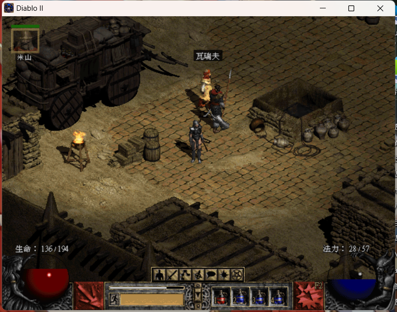

[toc]

# 前言
UI是一个非常大的Topic，本部分整合了原本的游戏UI探讨笔记，UnityUI开发笔记和UnityNGUI开发笔记，形成了一个整合笔记，我希望在这个过程中从一个更高的层面讨论游戏UI和实际的UnityUGUI & UnityNGUI两套流程，形成一套文档。

UI是游戏客户端开发最耗时的任务之一，这部分开发任务不仅枯燥，更不像Gameplay那样令人激动。在游戏开发者之间，经常有“臭拼UI的”这样自嘲的说法。但是UI是承载用户最多注意力和交互时间的游戏部件，用户大多数游戏时间都在查看UI，点击UI，查看新的UI，点击新的UI。如果要说UI是游戏最重要的部件，也是有一定道理的。同时，从现实层面而言，要想在比较艰难的现实环境下作为一个游戏客户端开发程序员生存下去，对UI编程带着这样一种鄙夷的态度，我想是不可取的。

UI开发过程中也有非常多的内容可以体现技术力。UI一般在大型游戏工程中占用的CPU和内存资源并不是非常突出，但优化潜力依然很大。同时由于UI代码和UI资源往往是非常丰富的，因此有这样一些重要的问题：

**UI代码如何取抽象和分层？
UI资源如何分类和管理？
用户在何时、如何取得UI资源？
如何让客户端避免洪泛地取用资源造成卡顿？
如何让客户端包体尽量小？
如何让客户端无需频繁重新下载新版客户端，而是在使用中默默更新？**

这当中可以体现技术力的内容非常之多。

# 必要的语言和概念
在开始之前，我们先来谈一些必要的前置概念，来统一一下我们的语言。

## Unity Resources, Assets and AssetBundles
Unity把磁盘上的文件称为Assets。比如Prefab预制件文件确实在磁盘上有一个对应的文件，这个文件规定了预先设定的预制件应该**被如何创造出来**。其他的比如图集，纹理等都是典型的Asset。另一个概念Object是容易产生误解的，在Unity的代码架构中，一切继承自UnityEngine.Object的占用内存的实体都被称为Object，这个词的语义是指**序列化的、集中地描述一个特定的资源的一个特定实例的类**。在传统UnityC#开发中，几乎所有的游戏对象行为脚本都继承自MonoBehaviour，几乎所有的自己开发的组件都继承自Component，而MonoBehaviour和Component都继承自UnityEngine.Object。

有两个重要的Object派生类`ScriptableObject`和`MonoBehaviour`

Assets是一个或多个Object的总和。比方说，某个Asset是一个Texture，这个Asset包含一个Object，这个Object的具体类是UnityEngine.Texture(在NGUI中是UITexture)，其继承自UnityEngine.Object；这个Texture类对象包含了一些信息，用于管理这张图片。

在Unity中，Objects可以互相引用。一些开发语言中的引用是通过直接拿去内存地址实现的，但在Unity开发中禁止直接对内存进行访问。Asset也可能包含这类对Object的引用。

# 游戏UI
## UI Intro
[ShoKill 哪些游戏有着漂亮的UI](https://www.zhihu.com/question/29538229/answer/117468470)
游戏UI可以分为这四大类。

其中的Diegetic可以被翻译为叙事的、交互的。我们从最简单的、认知中的UI举例，比如我的游戏启蒙之一，DiabloII为例。


生命值、法力值，以及一些菜单项的图标。这种UI是否绘制在游戏世界内?答案是否。他们绘制在游戏世界之外，绘制在玩家的电脑屏幕上。那么这个UI是否出现在游戏故事中，或者是游戏进行的过程中？答案也是否，这是我们认为最原始、事实上也最广泛普遍的UI，也就是Non-Diegetic UI. 这种东西一般也被称为HUD，也是我们即将要尝试做的UI。HUD在游戏运行的99%的时间里都是固定的，就像一个仪表盘一样固定在特定的位置，仅仅通过指针的浮动或者几个小灯来显示必要的变量信息。

BTW, 暗黑2是多么超前、有趣而让人百玩不厌的游戏！这又再一次提醒了我们游戏人：要追求技术，但不要陷入追求技术而忘却了游戏本身乐趣的歧途。

## 从 0 开始实现一个UGUI HUD
[UGUI老文档](https://docs.unity.cn/Packages/com.unity.ugui@1.0/manual/UIBasicLayout.html)

# UnityUI技术要点

## 涉及UI性能的技巧和原则
UGUI方面最大的性能瓶颈就是多次的drawcall，按理说在屏幕上添加一些UI这件事不应当使用超过一次的drawcall，然而实际上许多情况会导致单UI系统就会在一帧内发生多次batch。比如如果

[Unity Manual - Sprite Atlas](https://docs.unity3d.com/Manual/sprite-atlas.html)


可以看到上文中开篇第一句话，在Unity中，通常为一个纹理进行一次drawcall。这里与openGL等原始项目的渲染过程是不一样的，在那些项目中，比如要绘制一个外表面包络纹理的立方体，drawcall的数量与纹理数量是无关的

1. 降batch，比如使用图集。
2. 动静分离，使动态变化导致的UIElementDirty的范围尽量小
3. 降低overdraw，主要是避免不必要的重叠——UI组件如果发生重叠一定会发生blending
4. 关闭UI组件不需要使用的功能，比如rich text，raycast，mask，layout等
5. 不要用SetActive来隐藏组件，而是通过把组件位移到画面可视范围之外（事实上渲染时候会被裁剪）

## UnityUGUI MessageSystem
有一个接口IEentSystemHandler,继承自这个接口的任何借口都表示可以通过消息系统来接收事件。
```cs
public interface ICustomMessageTarget : IEventSystemHandler
{
    // 可通过消息系统调用的函数
    void Message1();
    void Message2();
} 
```

我举一个例子，比如我们希望通过消息系统来实现空格键按下时在屏幕打印特定内容这个案例。在之前，我们让游戏物体在Update当中检验输入，每一帧都不断查询`Input.GetKeyDown`来获取输入。这样的写法可能造成一些性能问题，我们改为对消息系统的查询，当输入发生的时候，输入模块会给我们的游戏对象发消息，游戏对象执行回调函数，就能完成上述的过程。

不用担心，standalone input module独立输入模块是Unity预定义好的，里面有大量的接口函数，分别对应了不同的时机：


比如现在，我希望UI当中有一个可以click的Image。原有的项目结构中，Canvas总画布拥有子对象Image，我们在Image上面添加monobehaviour并进行编程：

```cs
public class MyButtonBehaviour : MonoBehaviour, IPointerClickHandler
{
    void IPointerClickHandler.OnPointerClick(PointerEventData eventData)
    {
        Debug.Log("On_Click");
    }
}
```

上述所有接口一一实现，就能实现出一个行为良好定义、行为丰富的button。

# Unity & NGUI

## UI美术资源应该导入到哪里
对于传统Unity开发流程，一般需要强调，UI美术资源放在Resources/UI文件夹下，这样做主要是考虑到Unity动态资源加载会从Resources文件夹中读取内容(Resources.Load)。Resources文件夹中的所有资源全都会被打包。

近年来，游戏内容普遍地增大，游戏占用的硬盘空间也日渐成为玩家更加关心的重要性能参数。Resources中的全部资源都会打包，这一点要求我们不能无分辨地将UI美术资源全部堆放在Resources当中。我初步考虑到两个情况：
第一，游戏在多语言环境下发布。多语言问题在大多数情况下是由程序考虑的：一段需要输出到View的文字应当通过语言层处理，转移到不同的具体语言版本。但很多UI上的文字具有复杂的美术效果，此时每一种语言的美术资源都需要制作到游戏资源中。如果希望将这些美术资源放在Resources文件夹内，应当考虑将不同语言的版本分别打成不同的包，而不是丢在同一个版本的发布包体中。

第二，在线资源。有时候项目中使用的美术资源实在太多，一种技术方案提出，将部分美术资源放在服务器上，提供特定的协议用以查询。这类资源不必存放在包体中，节省了大小，但服务器必须额外处理这些查询图片资源的负载。这些图片一经使用就可以藏匿在用户的本地文件中，应当提供代码逻辑，在用户再次需要这个图片的时候前往特定本地路径获取，用一次读硬盘代替一次web request。


## UIAtlas
### What's Atlas
统一语言，在Unity中这一概念被称为Sprite Atlas，其被设计出来就是为了解决**one Texture one Drawcall**问题的。在UI这个领域上，大多数UI组件都是被2D地绘制到屏幕上，在这个过程中任何一张纹理资源被绘制到屏幕上的某个位置都需要一次DrawCall，即CPU通知GPU需要绘制-GPU向FrameBuffer中绘制。这个过程比程序执行这样纯CPU的过程更为耗时，因此减Drawcall成为游戏UI开发最重要的任务之一。

在UI系统的某一时刻，用户屏幕上显示的若干东西都应该尽可能来自一批图片资源，这些图片资源被整合成一张大图，CPU用一次Drawcall告诉GPU若干个子图位置，GPU在一次绘制中将大图上的若干个小图分别绘制到FrameBuffer的不同位置，这就是图集的工作原理。

[CSDN-blog 使用和不使用图集在Unity中drawcall对比](https://blog.csdn.net/xhxx_/article/details/133134367)

在NGUI中，图集对应UIAtlas组件；且在更为广义的语境下，图集也应当是一个针对UI提出的概念。后续将把这个概念称为UI图集。

### Build and Edit
NGUI提供了Atlas Maker来制作和修改图集，选择一个已有的图集，在Atlas Maker中打开，
