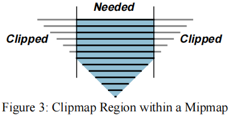
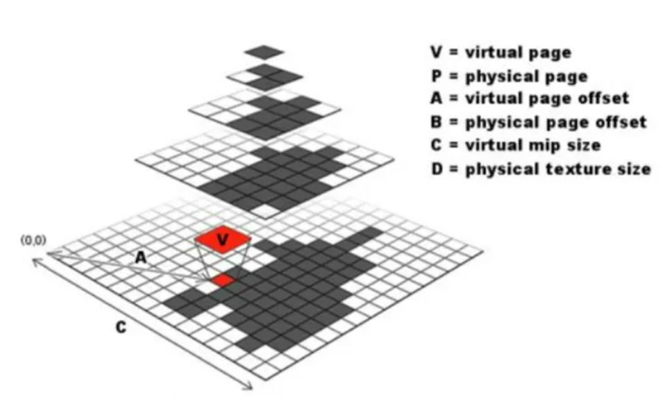

# 前言

在22年9月27号第一次参加大厂游戏开发面试(腾讯远程实习项目)之后，我对于项目实践的计划产生了较大的改变。现在我的目标是设计出2-3个exciting 的demo写进简历。

这个项目必须和“人手一个”的C++软渲染光栅器这样的项目划清界限。不得不说，软渲器在一两个月之前对我而言也是难如登天的项目，而在顺着网课作业框架一步步复现出来之后，网络舆论却早已经变成了，软渲器不值一提，上了Games101&104的网民人手一个软渲器、人手一个小引擎。当然舆论也有其夸张成分，但不得不说，这样的小引擎或者软渲器项目同质化较为严重，面试官难以从三言两语中了解面试者所说的做过软渲器到底是git clone后看了两眼，还是真才实学的从头实践了一遍。而且，这样的项目对于教学固然是很好，复习了很多经典的算法和渲染管线的基本流程，但是与工业和科研脱节，容易故步自封。

面试官提到，最好有GI或者RTRendering的经历，尝试往发丝、布料、水体、大场景这些问题上靠一靠。这点醒了我。

为了能让面试官耳目一新，让简历上的的确确有亮点，我认为必须是以热门topic为主题的，或者涉及热门技术难点的项目。为此，我们必须多看多学，瞄准一些潜在的、待选择的topic和difficulties。

本笔记的组织结构是这样的：每个一级标题将是一个图形或引擎方面的大的问题或研究方向。随后的二级标题将会阐述这个topic的内涵、目前人们做到什么程度，以及最大的难点和当前的技术瓶颈。

这样组织起来的一份文档将会成为一个类似于**文献综述**的笔记，对于科研和实战都会有帮助。再不济也是一种开阔视野了。
## 论文
论文在这项梳理topics and difficulties的工作中极其重要。
### 重要刊物和会议总览
期刊
**ACM Transaction on Graphics**, 简称TOG，被称为**图形学唯一的顶级刊物**
IEEE Transactions on Image Processing, 简称TIP
IEEE Transaction on Visualization and Computer Graphics， 著名的TVCG
会议
ACM MM :ACM International Conference on Multimedia
SIGGRAGH : ACM SIGGRAGH Annual Conference
IEEE VIS : IEEE Visualization Conference
VR: IEEE Virtual Reality

[ACM DL库 - 能够查询SIGGRAGH几乎所有文章](https://dl.acm.org/search/advanced)
[Journal of Computer Graphics Techniques](https://jcgt.org/index.html)

# 1.地形渲染

## 概念简述
**What's 地形渲染**
[地形渲染概览 by 三生万 zhihu](https://zhuanlan.zhihu.com/p/436879101)

**How to 地形渲染**
把地形和正常的物体一样去渲染显然是一种朴素方案。这样则要求准备巨大的底面纹理。

Height map高层图
HeightMap的概念很简单，就是一张贴图，但里面存储的值代表高度也就是y值，uv坐标代表在世界空间中的x、z位置。因此可以认为HeightMap里的每一个纹素，都会对应一个三维空间内的点。
用heightmap来渲染地形的算法就叫heightfield(也是直到目前地形渲染最主力的渲染算法)。

许多开放世界游戏都会设置地图功能，其实大多数地图就是一张Heightmap，加之美术做一层材质，添加某些细节。

但是注意到，一张这样的heightmap的分辨率大概在1024^2,至多也就是2048^2，就算对每个纹素位置都采样一次，地图的精度也是一个大问题。就比如1平方千米的地图，如果真隔着1m才采样一次，那山岂不是变成1m的三角平面了。如何在heightmap基础上提升精度是一个热门difficulties。

附注：
Maya和Houdini都有heightfield地形控件：
[Maya heightfield 官方DOC](https://knowledge.autodesk.com/zh-hans/support/maya/learn-explore/caas/CloudHelp/cloudhelp/2015/CHS/Maya/files/Shading-Nodes-Height-Field-htm.html)
[Houdini Height Field的基本概念 bilibili 专栏](https://www.bilibili.com/read/cv16586353/)
[Houdini crowds terrain 人群地形功能效果视频 bilibili](https://www.bilibili.com/video/BV1j44y1G7X6/?spm_id_from=333.788.recommend_more_video.-1&vd_source=fcabf2d02580039110de5bfc784d50d5)

### 难点1 贴图膨胀
当世界很大的时候，这样的三角形就会爆炸增多。以上图为例，1km x 1km的height map纵使按照1m距离采样，也会获得1000*1000个顶点，则会形成多于2M个三角形。地图大、精度要求高，则贴图的大小也会指数级提升，这是非常糟糕的。无疑，单纯的heightmap根本无法满足工业要求。

### Virtual Texture 虚拟纹理
上述的膨胀的贴图会存放在显存里。所谓的贴图膨胀，无非是显存放不下、或者不适宜真的去放。虚拟纹理技术对症下药，试图想办法把这种大贴图存下。这就用到了操作系统当中内存不够硬盘来凑的虚拟技术。

最朴素的Virtual Texture也称MegaTexture.其最早得益于一篇文章的发表
[Clipmap: A virtual mipmap,SIGGRAGH 1998](https://dl.acm.org/doi/pdf/10.1145/280814.280855)
Clipmap的字面意思是会自我裁剪的mipmap。

[Advanced virtual texture topics,SIGGRAGH 2008](https://dl.acm.org/doi/10.1145/1404435.1404438)

使用一整个巨大的贴图，并把贴图打包进不同的小块，并生成ID，从而让显存按需取小块.

MegaTexture解决了贴图Tiling的问题(关于Tile问题，关键词Wang Tiles)，确实能够放下一些大贴图了。
[【论文复现】Wang Tiles for Image and Texture Generation by Monica的小甜甜 zhihu](https://zhuanlan.zhihu.com/p/357287614)

把原有纹理切割成相同大小的Tile 或称 page，这样的小块纹理就是virtual textual.

从虚拟Texture的ID到实际贴图的ID需要一种映射机制，主要是四叉树映射和多级映射。
#### 四叉树映射

[Virtual texturing in software and hardware ,SIGGRAGH 2012](https://dl.acm.org/doi/10.1145/2343483.2343488) 提出用部分驻留纹理(partially resident textures , PRTs)这一GPU新特性，以硬件方式优化virtual texture.

图形学和工程实践中特别常见的一个概念**LOD levelofdetail** 在远处减少细节(反正也看不清)

**adaptive mesh tessellation自适应网格细分**，提出依据视椎改变网格细化的策略。
fov指的就是视角，在fov内部将三角形分布的更密集，而在fov之外分布的稀疏。

已经在cg前沿&论文研究文件夹中开辟了一个新的篇章，用来研究virtual texture
# 2.阴影
