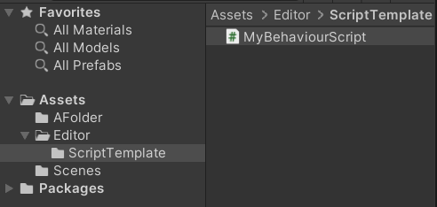

# CH4 游戏脚本

## 4.1 创建脚本

### 4.1.1 脚本模板
首先，我们知道在创建新的C# script时，默认会生成一个模板：
```cpp
using System.Collections;
using System.Collections.Generic;
using UnityEngine;

public class NewBehaviourScript : MonoBehaviour
{
    // Start is called before the first frame update
    void Start()
    {
        
    }

    // Update is called once per frame
    void Update()
    {
        
    }
}
```
这个脚本模板完全是可修改的。书中介绍了一种可以兼容版本管理工具的办法来修正脚本模板。

在Editor/ScriptTemplate目录新建一个C# script,其内容如下(代码详释略)
```cpp
using UnityEngine;
using UnityEditor;
using System;
using System.IO;
using System.Text;
using UnityEditor.ProjectWindowCallback;
using System.Text.RegularExpressions;

public class script_04_01{
    private const string MY_SCRIPT_DEFAULT="Assets/Editor/ScriptTemplates/C# Script-MyNewBehaviourScript.cs.txt";
    [MenuItem("Assets/Create/C# MyScript",false,80)];
    public static void CreateMyScript(){
        string locationPath=GetSelectedPathOrFallback();
        ProjectWindowUtil.StartNameEditingIfProjectWindowExists(0,ScriptableObject.CreateInstance<MyDoCreateScriptAsset>(),locationPath+"/MyNewBehaviourScript.cs",null,MY_SCRIPT_DEFAULT);
    }

    public static string GetSelectedPathOrFallback(){
        string path="Assets";
        foreach(UnityEngine.Object obj in Selection.GetFiltered(typeof(UnityEngine.Object),SelectionMode.Assets)){
            path=AssetDatabase.GetAssetPath(obj);
            if(!string.IsNullOrEmpty(path)&&File.Exists(Path)){
                path=Path.GetDirectoryName(path);
                break;
            }
        }
        return path;
    }
    class MyDoCreateScriptAsset:EndNameEditAction{
        public override void Action(int InstanceID,string pathName,string resourceFile){
            UnityEngine.Object o=CreateScriptAssetFromTemplate(pathName,resourceFile);
            ProjectWindowUtil.ShowCreateAsset(o);
        }
        internal static UnityEngine.Object CreateScriptAssetFromTemplate(string pathName,string resourceFile){
            string fullPath=Path.GetFullPath(pathName);
            StreamReader streamReader=new StreamReader(resourceFile);
            string text=streamReader.ReadToEnd();
            streamReader.Close();
        }
    }
}
```