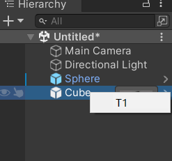

***
# 第三章 拓展编辑器
`提示`
Unity 有两种script backend脚本后端，分别是使用JIT编译的Mono和使用AOT编译的IL2CPP（intermediate language 2 c++）
## 3.1拓展Project view
### 3.1.1拓展菜单

**编辑器使用的代码**应该**仅限于编辑模式**之下。编辑器代码应该放在名为Editor的文件下，运行时执行的代码放在其余文件夹下。Editor可以存在于任何目录下、可以有多个Editor文件夹。


```cpp
//script_03_01.cs
using UnityEngine;
using UnityEditor;
public class script_03_01
{
    [MenuItem("Assets/My Tools/Tools 1",false,2)]
    static void MyTools1(){
        Debug.Log(Selection.activeObject.name);
    }
    [MenuItem("Assets/My Tools/Tools 2",false,1)]
    static void MyTools2(){
        Debug.Log(Selection.activeObject.name);
    }
}

```
这个代码丢在Editor文件夹内，再去Assets选择一个对象（标蓝色框），这时候右键发现菜单里有My Tools选项出现。第三个参数1和2用于排序菜单项。点击Tools 1/2，控制台打印选中的对象名称。
(由于这里的isValidateFunction经过了实验，改成了true,一度造成编译后My tool不出现)
最终的效果概括(由于右键菜单在截图时消失，仅仅进行文字概括)：

- 1.顶部菜单Assets出现My Tools工具栏；
- 2.点选Assets下各种对象，右键均有My Tools工具栏；
- 3.Tool 1工具选择后总是打印选中对象的名字


```cpp
using UnityEngine;
using UnityEditor;

public class script_03_02
{
    [MenuItem("Assets/Create/My Create/Cube",false,2)]
    static void CreateCube(){
        GameObject.CreatePrimitive(PrimitiveType.Cube);
    }
    [MenuItem("Assets/Create/My Create/Sphere",false,1)]
    static void CreateSphere(){
        GameObject.CreatePrimitive(PrimitiveType.Sphere);
    }
}
```
于是出现了Create/My Create/Sphere 等两个按钮。
MenuItem的完整写法是这样的：
```
[MenuItem(itemName:"Assets/Create/My Create/Cube",isValidateFunction:false,priority:2)]
```
**困惑已解决**
***
知乎：https://zhuanlan.zhihu.com/p/353544897

当 isValidateFunction = true时,表明该方法是一个校验方法, 只有在该方法返回true时,我们新增的自定义窗口才可以使用.

解释：这句话应该补上：如果isValidateFunction = false，这个方法就一定会执行。

（我们上面的脚本经过检验，isValidateFunction=false才执行了。而如果把isValidateFunction设置成true, My tool直接消失了。这是因为经过校验，发现isValidateFuntion检验返回了false）
***
### 3.1.2-3 拓展布局-添加按钮
更炫酷的是，可以用类似的方式拓展布局。我们可以在一些位置加上一个按钮，自己编写其按下的效果：
```cpp
using UnityEngine;
using UnityEditor;
public class script_03_03
{
    [InitializeOnLoadMethod]static void InitializeOnLoadMethod(){
        EditorApplication.projectWindowItemOnGUI=delegate(string guid,Rect selectionRect){
            if(Selection.activeObject 
            && guid== AssetDatabase.AssetPathToGUID(AssetDatabase.GetAssetPath(Selection.activeObject))){
                float width=50f;
                selectionRect.x+=(selectionRect.width-width);
                selectionRect.y+=2f;
                selectionRect.width=width;
                GUI.color=Color.red;

                if(GUI.Button(selectionRect,"click")){
                    Debug.LogFormat("click:{0}",Selection.activeObject.name);
                }
                GUI.color=Color.white;
            }
        };
    }
}
```
这段代码有点跳脱，为了理解我做了一系列实验。

**实验一**
***
```cpp
public class script_03_03 //t1
{
    [InitializeOnLoadMethod]static void InitializeOnLoadMethod(){
        Object slt=Selection.activeObject;
        EditorApplication.projectWindowItemOnGUI=delegate(string guid,Rect selectionRect){
            if(slt && guid== AssetDatabase.AssetPathToGUID(AssetDatabase.GetAssetPath(slt))){
                float width=50f;
                selectionRect.x+=(selectionRect.width-width);
                selectionRect.y+=2f;
                selectionRect.width=width;
                GUI.color=Color.red;

                if(GUI.Button(selectionRect,"click")){
                    Debug.LogFormat("click:{0}",slt.name);
                }
                GUI.color=Color.white;
            }
        };
    }
}
```

先说结论：InitializeOnLoadMethod只在编译完成时执行一次；[InitializeOnLoadMethod]前缀则表示这个函数在编译完成后最先执行。

我把几处Selection.activeObject全都换成了函数整体只执行一次的slt。这样一来，我们发现无论怎么切换选中的目标，click永远粘在编译完成一开始的那个选中对象上，打印的也是它的名字。

而在原代码当中，我们**每次**点击新的对象后，delegate会被触发，其中的代码都会被执行，包括计算bottom位置(存放在selectionRect当中)，用GUI.bottom在这个位置创造一个新按钮。
***
**实验二**
```cpp
using UnityEngine;
using UnityEditor;

public class script_03_03//t2
{
    [InitializeOnLoadMethod]static void InitializeOnLoadMethod(){
        EditorApplication.projectWindowItemOnGUI=delegate(string guid,Rect selectionRect){
            if(Selection.activeObject 
            && guid== AssetDatabase.AssetPathToGUID(AssetDatabase.GetAssetPath(Selection.activeObject))){
                float width=50f;
                selectionRect.x+=(selectionRect.width-width);
                selectionRect.y+=2f;
                selectionRect.width=width;
                GUI.color=Color.red;

                if(GUI.Button(selectionRect,"click")){
                    Debug.LogFormat("click:{0}",Selection.activeObject.name;
                    Debug.LogFormat("x={0},y={1}, width={2},height={3} ",
                selectionRect.x,selectionRect.y,selectionRect.width，selectionRect.height);
                }
                GUI.color=Color.white;
            }
        };
    }
}
```
这里我修改了
```
click:SampleScene
x=75.50003,y=262, width=50,height=110 
click:New Prefab
x=75.50003,y=137, width=50,height=110 
```
在我的菜单中，Project视图中New Prefab在SampleScene上一格，于是他们的y值不同，而其余都相同。

随后我又尝试了几次，分别记录了结果：

```
//拖动Project，造成了组件的平移
click:New Prefab
x=84.80002,y=137, width=50,height=110
//ctrl缩小一点
click:New Prefab 
x=70.80002,y=109, width=50,height=82 
//拖动到最小，各个对象成为一个长条
click:New Prefab 
x=123.6,y=18, width=50,height=16 
```

同时我发现，这里的``selectionRect.x+=(selectionRect.width-width);``是右对齐的意思，因为width被设计成固定值（也就是按钮的宽度）
而且，selectionRect的四个成员也是可以认清的：
```
selectionRect.x
selectionRect.y
selectionRect.width
selectionRect.height
```
***

EditorApplication.projectWindowItemOnGUI使用了监听。
EditorApplication.projectWindowItemOnGUI=delegate(...)这里指的是

### 3.1.4监听事件
我们来看书中的这段代码。
```cpp
using UnityEditor;
using UnityEngine;
using System.Collections.Generic;

public class script_03_04 : UnityEditor.AssetModificationProcessor
{
    [InitializeOnLoadMethod]static void InitializeOnLoadMethod(){
        EditorApplication.projectWindowChanged=delegate(){
            Debug.Log("change");
        };
    }
    public static bool isOpenForEdit(string assetPath,out string message){
        message=null;
        Debug.LogFormat("assetPath:{0} ",assetPath);
        //true表示资源可以打开，false表示不允许在Unity打开此资源
        return true;
    }
    public static void OnWillCreateAsset(string path){//监听创建资源
        Debug.LogFormat("path:{0}",path);
    }
    public static string[] OnwillSaveAssets(string[] paths){//监听保存资源
        if(paths!=null){
            Debug.LogFormat("path:{0}",string.Join(",",paths));
        }
        return paths;
    }   
    public static AssetMoveResult OnwillMoveAsset(string oldPath,string newPath){
        Debug.LogFormat("from:{0} to: {1}",oldPath,newPath);
        return AssetMoveResult.DidMove;
    }
    public static AssetDeleteResult OnWillDeleteAsset(string assetPath,RemoveAssetOptions option){
        Debug.LogFormat("delete:{0}",assetPath);
        return AssetDeleteResult.DidDelete;
    }
}


```
注：这段程序会报EditorApplication.projectWindowChanged obsolete(过时)，新的Unity版本已经更新为
EditorApplication.projectChanged，但两者的书写方法不同
**实验一 向文件夹移动**
把场景里的一个Cube拖动到Assets/Scenes里，输出

```
path:Assets/Scenes/Cube.prefab
path:Assets/Scenes/Cube.prefab.meta
change
```
***
**实验二**
把刚刚的Cube拖动到Assets/AFolder里(是我新建的一个文件夹)，输出
```
change
```
预制件和其他对象有没有区别呢？我们再用一个空材质试一试
**实验二plus**
用一个Material来做上述拖动，依然输出
```
change
```
(这里似乎并没有发生MoveAsset，输出from to)
**实验三**
把Assets/Scenes中本来就有的对象Sphere删掉，输出
```
delete:Assets/Scenes/Sphere.prefab
```

## 3.2拓展Hierachy view
### 3.2.1 拓展菜单
```cpp
using UnityEditor;
using UnityEngine;
public class script_03_05
{
    [MenuItem("GameObject/My Create/Cube",false,0)]
    static void CreateCube(){
        GameObject.CreatePrimitive(PrimitiveType.Cube);
    }
}
```
整体上和scriptscript_03_01区别不大，但是这样编辑后不仅在顶部栏的GameObject里出现新菜单项，在Heirarchy栏目下右键下拉菜单也有。


### 3.2.2 拓展布局
我们在project中拓展布局时使用的是EditorApplication.projectWindowItemOnGUI，那么在这里理应想到是不是用一个`EditorApplication.hierarchyWindowItemOnGUI`
```cpp
using UnityEditor;
using UnityEngine;
public class script_03_06
{
    [InitializeOnLoadMethod]static void InitializeOnLoadMethod(){
        EditorApplication.hierarchyWindowItemOnGUI
            =delegate(int instanceID,Rect SelectionRect){
            if(Selection.activeObject 
                && instanceID==Selection.activeObject.GetInstanceID())
            {
                float width=50f;
                float height=20f;
                SelectionRect.x+=SelectionRect.width-width;//右对齐
                SelectionRect.width=width;
                SelectionRect.height=height;
                if(GUI.Button(
                    SelectionRect,AssetDatabase.LoadAssetAtPath<Texture>("Assets/Unity.png"))){
                        Debug.LogFormat("click:{0}",Selection.activeObject.name);
                    }
            }
        };
    }
}
```
(作为图标的Unity.png已经丢到Assets文件夹内)
实践效果如下：

点击按钮就会出发Log，内容为：
```
click:Sphere
```
### 3.2.3 重写菜单
#### Csharp知识-委托delegate
要想读懂语句：
```cpp
 EditorApplication.hierarchyWindowItemOnGUI=delegate(...){}
```
则不得不从delegate关键字开始说起。
假设我们需要写三个函数，一个StrUpper用于将字符串全部大写、一个StrLower用于将字符串全部小写，一个StrRef用于给字符串加上引号。我们写出其中一个函数的内容：
```cpp
public static void StrToLower(string[] name){
    for(int i=0;i<name.Length;i++){
        name[i]=name[i].ToLower();
    }
}
```

我们不难发现这些函数内容高度相似，倘若写成一个函数、并且添加一个参数用于表示这个函数究竟是三者的哪一个，就可以大大简洁代码。

委托，是指**把函数名当做实参传入函数**。这在C语言当中采用函数指针来完成。**委托是一个类型**(这是很反直觉的),其实质是**将函数名作为参数传入函数中。将原函数要实现的功能，委托给一个新函数来实现**。

```cpp
public delegate void DelStrTo(string[] name);
//声明委托，委托类型DelStrTo里将存放函数名

public static void StrTrans(string[] name,DelStrTo d){
    d(name);
}
//声明一个函数StrTrans，这将是被委托的函数：要想调用三个具体的函数，应该委托StrTrans
```
***
**实验一**
注意：`由于没有系统学习CS，这里的C#都采用Unity来编译测试`
```cpp
public class script_03_08
{
    public delegate void DelStrTo(string[] name);
    public static void Test(string[] name, DelStrTo del)
    {
        del(name); //委托需要一个参数，写入name。
    }
    public static void StrToUpper(string[] name)
    {
        for (int i = 0; i < name.Length; i++)
        {
            name[i] = name[i].ToUpper();
        }
    }

    [InitializeOnLoadMethod]static void InitializeOnLoadMethod(){
        string[] names = { "abCDefG", "HIJKlmnOP", "QRsTuvW", "XyZ" };
        //StrToUpper(names);
        
        DelStrTo del = new DelStrTo(StrToUpper);
        del(names);
        for (int i = 0; i < names.Length; i++)
        {
            Debug.LogFormat("output:{0}",names[i]);
        }
    }
}
```
输出如下：


学到这里我比较大的困惑是，这里函数StrToUpper也没简化掉啊，三个函数还是得一一写内容。我认为delegate的重要意义并不是简化代码，而是提供一种**把方法当做对象来看**的可能，复用之前的或者项目中同事交付的代码。这件事也可以通过多态来完成(自行回顾多态的几种实现方法)，但更高效。
(后面解决了这个困惑，是可以简化的)

除了这样的写法还有其他许多重要的提升：
把delegate写在类里，实现**同一个类的不同实例调用同一个函数达到不同效果**(真的很像多态)。
***
**实验二**
还是刚才的情况，我们设计一个类来存放string，同时其有一个delegate成员用来存放实例应当执行哪个函数。
```cpp
public delegate void DelStrTo(string[] name);
public class script_03_08
{
    DelStrTo del; 
    public string[] name;
    public script_03_08(DelStrTo d,string[] n){
        del=d;
        name=n;
    }
    public void Test()
    {
        del(name); 
    }
    public static void StrToUpper(string[] name)
    {
        for (int i = 0; i < name.Length; i++)
        {
            name[i] = name[i].ToUpper();
        }
    }
    public static void StrToLower(string[] name)
    {
        for (int i = 0; i < name.Length; i++)
        {
            name[i] = name[i].ToLower();
        }
    }
    [InitializeOnLoadMethod]static void InitializeOnLoadMethod(){
        string[] names = { "abCDefG", "HIJKlmnOP", "QRsTuvW", "XyZ" };
        //StrToUpper(names);
        script_03_08 s1=new script_03_08(new DelStrTo(StrToUpper),names);
        script_03_08 s2=new script_03_08(new DelStrTo(StrToLower),names);
        s1.Test();
        for (int i = 0; i < s1.name.Length; i++)
        {
            Debug.LogFormat("S1:{0}",s1.name[i]);
        }
        s2.Test();
        for (int i = 0; i < s2.name.Length; i++)
        {
            Debug.LogFormat("S2:{0}",s2.name[i]);
        }  
    }
}
```
输出结果如下：

实际内容相同的实例s1和s2,经历同样的Test()，因为delegate的原因调用了不同的函数，完成了不同的功能。
***
**实验三**
完成最初的目标，简化三个函数的代码。
这种写法里，把要填入script_03_08对象的delegate写成了一个函数体，这相当于直接写了一个新函数，并把这个函数的函数名新建成DelStrTo量，并传给构造函数做第一个参数。
这种写法被称为**匿名函数**。
```cpp
public delegate string DelStrTo(string name);
public class script_03_08
{
    DelStrTo del; 
    public string[] name;
    public script_03_08(DelStrTo d,string[] n){
        del=d;
        name=n;
    }
    public void Test()
    {
        for (int i = 0; i < name.Length; i++)
        {
            name[i] = del(name[i]);
        }
    }
    [InitializeOnLoadMethod]static void InitializeOnLoadMethod(){
        string[] names = { "abCDefG", "HIJKlmnOP", "QRsTuvW", "XyZ" };
        //StrToUpper(names);
        script_03_08 s1=new script_03_08(delegate(string name)
        { return name.ToLower();},names);
        script_03_08 s2=new script_03_08(delegate(string name)
        { return name.ToUpper();},names);
        s1.Test();
        for (int i = 0; i < s1.name.Length; i++)
        {
            Debug.LogFormat("S1:{0}",s1.name[i]);
        }
        s2.Test();
        for (int i = 0; i < s2.name.Length; i++)
        {
            Debug.LogFormat("S2:{0}",s2.name[i]);
        }  
    }
}
```
结果确定正确，图略，与实验三正好相反

***
**实验四**
还有一种称为lambda表达式的写法，与课本上的语境已经大相径庭，但是依然很简洁有用。
```cpp
script_03_08 s2=new script_03_08(delegate(string name)
        { return name.ToUpper();},names);
//可以写成下面
script_03_08 s2=new script_03_08((string name)=>
        { return name.ToUpper();},names);
```
实验过程略

lambda表达式还有一种不写{}的写法，用于表示返回值简单赋值：
```cpp
public delegate 
script_03_08 s2=new script_03_08(delegate(string name)
        { return name.ToUpper();},names);
//可以写成下面
script_03_08 s2=new script_03_08((string name)=>
        { return name.ToUpper();},names);
```

***
**实验五**
public void delegate Del();
这样声明的Del变量里，实际上存放的是什么？
这里引用一段网上的代码，没有经过调试，效果一看便知。
```cpp
delegate int NumberChanger(int n);
namespace DelegateAppl
{
   class TestDelegate
   {
      static int num = 10;
      public static int AddNum(int p)
      {
         num += p;
         return num;
      }

      public static int MultNum(int q)
      {
         num *= q;
         return num;
      }
      public static int getNum()
      {
         return num;
      }

      static void Main(string[] args)
      {
         // 创建委托实例
         NumberChanger nc;
         NumberChanger nc1 = new NumberChanger(AddNum);
         NumberChanger nc2 = new NumberChanger(MultNum);
         nc = nc1;
         nc += nc2;
         // 调用多播
         nc(5);
         Console.WriteLine("Value of Num: {0}", getNum());
         Console.ReadKey();
      }
   }
}
```
输出结果是 先进行10+5，再进行15*5，得到75
也就是说，把不同函数名对应的delegate直接加起来，这个新的delegate相当于按照加法顺序一个个执行每一个对应函数。这称为**delegate多播**

delegate到这里就讲完啦。

#### Csharp知识-事件Event

注:Unity对event，这里是UnityEngine.Event类的介绍网址是(https://docs.unity.cn/cn/current/ScriptReference/Event.html)
事件这个C#概念与delegate是密切相关的。
首先，C#里的event和UnityEngine.Events.UnityEvent是不一样的概念。这里介绍的是C# event

看这段代码：

```cpp
namespace Test  
{  
    class WT  
    {  
        //定义一个委托  
        public delegate void EventHandler(string a);  
        //为委托定义一个事件  
        public static event EventHandler SendMessage;  
        static void Main(string[] args)  
        {  
            //注册（绑定）
            WT.SendMessage+= Send;  
            //触发  
            SendMessage("触发");  
        }  
  
        public static void Send(string s)  
        {  
            Console.WriteLine(s);  
        }  
    }  
} 
```
EventHandler是一个处理string的void delegate,也是编写事件代码必要的一个定义。类里有静态的event EventHandler成员 SendMessage，用于存放委托变量、实现delegate多播。

event EventHandler当中的event是一个关键字，用于修饰delegate，被修饰的delegate不允许外部激发，必须编写一个类内的函数，相当于是invoke函数；直接使用`mb.myEventHandler+=Send`这样的语句会强制报错


#### 回到重写菜单
不是添加新的菜单项，而是直接覆盖掉原本的菜单项。这件事在project部分没有尝试。
如何实现把原来的菜单整个顶替掉呢？这里先说一下思路：
- a 
- b 
- c 把写好的OnHierarchyGUI通过delegate多播绑到EditorApplication上

回到课本代码，
```cpp
public class script_03_07
{
    [MenuItem("Window/Test/T1")]static void T1(){

    }
    [InitializeOnLoadMethod]static void StartInitializeOnLoadMethod(){
        EditorApplication.hierarchyWindowItemOnGUI+=OnHierarchyGUI;
    }
    static void OnHierarchyGUI(int instanceID,Rect SelectionRect){
        if(Event.current!=null && SelectionRect.Contains(Event.current.mousePosition) && Event.current.button==1&&Event.current.type<=EventType.MouseUp)
        {
            GameObject selectedGO=EditorUtility.InstanceIDToObject(instanceID) as GameObject;
            if(selectedGO){
                Vector2 mousePosition=Event.current.mousePosition;
                EditorUtility.DisplayPopupMenu(
                    new Rect(mousePosition.x,mousePosition.y,0,0),"Window/Test",null);
                Event.current.Use();
            }
        }
    }
}
```
Event.current是一个静态成员，能够获取当前发生的事件。OnHierarchyGUI的内容，加上了四重判断：
1.事件不为空
2.事件的鼠标位置在SelectionRect的范围里(我们规定的事件其实是**右键点击选中的对象**)
3.Event.current.button==1，表示是**右键**被按下(见下表)
4.Event.current.type<=EventType.MouseUp

为了搞懂到底这里Event.current.type<=EventType.MouseUp是什么意思，我写了个小代码调试，直接输出Event.current.type,没想到输出出来居然是一些字符串,我还以为这些type应该是一些int枚举
事后纠正，这里的EventType就是一个枚举。

那么这些EventType是怎么进行比较的呢？由于官网给出了一个EventType的表格，我初步猜测这些枚举的数值是按照表格的顺序。

***
**实验一**
```cpp
public class script_03_08
{

    [InitializeOnLoadMethod]static void StartInitializeOnLoadMethod(){
        EditorApplication.hierarchyWindowItemOnGUI+=OnHierarchyGUI;
    }
    static void OnHierarchyGUI(int instanceID,Rect SelectionRect){
        Debug.LogFormat("{0}",EventType.MouseDown-1);
    }
}
```
这个实验立马输出数字，说明这个EventType果然是一个枚举，里面每个值都是int
进一步实验后，我们知道了每个事件的枚举值。我已经修改了后面的EventType表。


所以我们得知，原文当中Event.current.type<=EventType.MouseUp 其实只有两个事件：**MouseUp**和**MouseDown**
最后还需要理解的只剩下这些:
```cpp
Vector2 mousePosition=Event.current.mousePosition;
EditorUtility.DisplayPopupMenu(new Rect(mousePosition.x,mousePosition.y,0,0),"Window/Test",null);
Event.current.Use();
```
首先来看EditorUtility，全称是UnityEditor.EditorUtility，这个类拥有静态成员函数DisplayPopupMenu，定义如下：
```cpp
public static void DisplayPopupMenu (Rect position, string menuItemPath, MenuCommand command);
```
表示在何处弹出菜单(position)、弹出何菜单项(menuItemPath)、MenuCommand目前一般置null

之后是Event.current.Use();官网说明如下：
```
描述
使用该事件。

在您已使用了一个事件时调用此方法。该事件的类型将被设置为 EventType.Used，这会导致其他 GUI 元素忽略此类型。

不应使用类型为 EventType.Repaint 和 EventType.Layout 的事件。 尝试在此类事件上调用此方法将会发出警告。
```
Event.current.Use()能够把当前事件的EventType成Used, Used事件不会继续执行委托，从而屏蔽掉原本的事件委托内容。Used在下面的Event成员表当中能够找到。
***
**实验二**
如果忽略Event.current.mousePosition，直接以SelectionRect作为DisplayPopupMenu参数，会怎么样呢？
```cpp
public class script_03_07
{
    [MenuItem("Window/Test/T1")]static void T1(){

    }
    [InitializeOnLoadMethod]static void StartInitializeOnLoadMethod(){
        EditorApplication.hierarchyWindowItemOnGUI+=OnHierarchyGUI;
    }
    static void OnHierarchyGUI(int instanceID,Rect SelectionRect){
       Event crtev=Event.current;
       if(crtev!=null&&SelectionRect.Contains(crtev.mousePosition)&&crtev.button==1&&crtev.type==EventType.MouseUp){
        GameObject selectedGO=EditorUtility.InstanceIDToObject(instanceID) as GameObject;
        if(selectedGO){
            EditorUtility.DisplayPopupMenu(new Rect(SelectionRect.x,SelectionRect.y,0,0),"Window/Test",null);
            crtev.Use();
        }
       }
    }
}
```

选中的菜单在SelectGO的左上角展开。

除了静态成员Event.current用于表示当前即将处理的事件，还有这些成员：
**Event的成员**
|变量名|效果|
|--|--|
|alt|Alt/Option 键是否被按住？（只读）|
|button|	已按下哪个鼠标键。0 表示鼠标左键，1 表示鼠标右键，2 表示鼠标中键|
|capsLock	|是否打开了 Caps Lock？（只读）|
|character	|键入的字符。|
|clickCount	|已收到了多少次连续鼠标点击。|
|command	|Command/Windows 键是否被按住？（只读）|
|commandName	|ExecuteCommand 或 ValidateCommand 事件的名称。|
|control	|Control 键是否被按住？（只读）|
|delta|	与上次事件相比该鼠标的相对移动。|
|displayIndex|	该事件所属的显示器的索引。|
|functionKey	|当前按键是否是功能键？（只读）|
|isKey	|该事件是否是键盘事件？（只读）|
|isMouse	|该事件是否是鼠标事件？（只读）|
|keyCode	|键盘事件的原始键代码。|
|modifiers	|哪些修改键被按住。|
|mousePosition	|鼠标位置。|
|numeric	|当前按键是否在数字键盘上？（只读）|
|pointerType	|创建事件的指针的类型（例如鼠标、触控屏幕、笔）。|
|pressure	|施加了多大的触笔压力。|
|shift	|Shift 键是否被按住？（只读）|
|type	|事件的类型。|

**EventType**
|枚举名|效果|枚举|
|--|--|--|
|MouseDown|	按下了鼠标键。|0|
|MouseUp	|释放了鼠标键。|1|
|MouseMove|	移动了鼠标（仅限 Editor 视图）。|2|
|MouseDrag	|拖动了鼠标。|3|
|KeyDown	|按下了一个键盘键。|4|
|KeyUp	|释放了一个键盘键。|5|
|ScrollWheel|	移动了滚轮。|6|
|Repaint	|重绘事件。每一帧都发送一个。|7|
|Layout	|布局事件。|8|
|DragUpdated	|仅限 Editor：拖放操作已更新。|9|
|DragPerform	|仅限 Editor：拖放操作已执行。|10|
|DragExited	|仅限 Editor：拖放操作已退出。|?|
|Ignore	|应忽略 Event。|11|
|Used|已经处理了事件。|12|
|ValidateCommand	|验证特殊命令（例如复制和粘贴）。||
|ExecuteCommand	|执行特殊命令（例如复制和粘贴）。||
|ContextClick	|用户已点击了右键（或者在 Mac 上点击了 Control）。||
|MouseEnterWindow	|鼠标进入了某个窗口（仅限 Editor 视图）。||
|MouseLeaveWindow	|鼠标离开了某个窗口（仅限 Editor 视图）。||
|TouchDown	|Direct manipulation device (finger, pen) touched the screen.||
|TouchUp	|Direct manipulation device (finger, pen) left the screen.||
|TouchMove	|Direct manipulation device (finger, pen) moved on the screen (drag).||
|TouchEnter	|Direct manipulation device (finger, pen) moving into the window (drag).||
|TouchLeave	|Direct manipulation device (finger, pen) moved out of the window (drag).||
|TouchStationary	|Direct manipulation device (finger, pen) stationary event (long touch down).||

实践效果如下：

由于我们没有给T1函数写内容，这里点击也不会有效果。
***
**作业一**
尝试在Hierarchy view中进行扩展，右键菜单在点击位置右边10像素下侧5像素位置生成。
```cpp
using UnityEditor;
using UnityEngine;
public class script_03_07
{
    [MenuItem("Window/Test/T1")]static void T1(){

    }
    [InitializeOnLoadMethod]static void StartInitializeOnLoadMethod(){
        EditorApplication.hierarchyWindowItemOnGUI+=OnHierarchyGUI;
    }
    static void OnHierarchyGUI(int instanceID,Rect SelectionRect){
       Event crtev=Event.current;
       if(crtev!=null&&SelectionRect.Contains(crtev.mousePosition)&&crtev.button==1&&crtev.type==EventType.MouseUp){
        GameObject selectedGO=EditorUtility.InstanceIDToObject(instanceID) as GameObject;
        if(selectedGO){
            Rect toDisPos=new Rect(crtev.mousePosition.x+10,crtev.mousePosition.y+5,0,0);
            EditorUtility.DisplayPopupMenu(toDisPos,"Window/Test",null);
            crtev.Use();
        }
       }
    }
}
```


### 3.2.4 覆盖菜单

```cpp
using UnityEditor;
using UnityEngine;
using UnityEngine.UI;

public class script_03_08
{
    [MenuItem("GameObject/UI/Image")]
    static void CreateImage(){
        if(Selection.activeTransform){
            if(Selection.activeTransform.GetComponentInParent<Canvas>()){
                Image image=new GameObject("image").AddComponent<Image>();
                image.raycastTarget=false;
                image.transform.SetParent(Selection.activeTransform,false);
                Selection.activeTransform=image.transform;
            }
        }
    }
}
```
这段程序书中没有什么讲解，这里也略过

## 3.3拓展Inspector view
Inspector视图往往用于体现选中对象的各种属性，也可以通过C#脚本来扩展功能。
### 3.3.1 拓展源生组件
我们来尝试在源生组件Camera的inspector上添加一个按钮。

我们可以看到，没有拓展的Camera在Inspector当中有Transform与Camera两个栏目，这是Camera作为GO的两个组件。我们打算在其中的Camera Inspector部分进行扩展。

```cpp
using UnityEditor;
using UnityEngine;

[CustomEditor(typeof(Camera))] 
public class script_03_09:Editor
{
    public override void OnInspectorGUI(){
        if(GUILayout.Button("拓展按钮")){
            Debug.LogFormat("拓展按钮clicked");
        }
        base.OnInspectorGUI();
    }
}
```


和之前扩展Hierarchy时不同，我们并没有把OnInspectorGUI函数通过delegate绑定到EditorApplication.hierarchyWindowItemOnGUI上。
此时我们可以总结之前使用的几处EditorApplication类的用法，研究一下EditorApplication类。

#### EditorApplication类
***
Unity对于EditorApplication类的统括介绍：(https://docs.unity.cn/cn/current/ScriptReference/EditorApplication.html)
**回顾一**
`EditorApplication.hierarchyWindowItemOnGUI`
[官网描述]Hierarchy窗口中每个可见列表项的 OnGUI事件的委托。
学完了delegate，就更好理解这里的`OnGUI事件的委托`。
回到这句话：
```cpp
//script_03_06 Hierarchy 扩展布局 添加按钮
EditorApplication.hierarchyWindowItemOnGUI
    =delegate(int instanceID,Rect SelectionRect){...}
```
这就是之前所说的匿名函数写法，函数体内的代码就是绑定到此EditorApplication的委托，会在**特定时机**执行。
hierarchyWindowItemOnGUI上绑定的委托会在什么时候执行呢？

### 3.3.2 拓展继承组件

### 3.3.3 组件不可编辑

### 3.3.4 Context菜单

## 3.4 拓展Scene视图

### 3.4.1 辅助元素

### 3.4.2 辅助UI

### 3.4.3 常驻辅助UI

### 3.4.4 禁用选中对象

## 3.5 拓展Game视图

## 3.6 MenuItem菜单

## 3.7 面板拓展

## 3.8 Unity编辑器的源码

