# Animation 动画
## 0.前言
这个笔记用于讨论在Unity中开发游戏时使用动画的相关知识。
这个笔记最终期望能够达到：**在Unity的Demo中展现一个人物，其能够进行类似挥拳、开门的具体动作。**
我将这个任务进一步的划分：
第一阶段，获得动画资产，把现有的动画资产组织起来，能够配合输入编排状态机，从而实现操控游戏人物；
第二阶段，逆转思维，倒过来想办法从3D模型自己生产出动画资产
第三阶段，结合起来，最终实现从模型到自设计动作到状态机控制最后组成一个打拳Demo。


### 0.1 用UAS搜集资产
为了搜集一些资产，我首先尝试了解了Unity Asset Store。
UAS提供了大量的免费素材，能够支持游戏从出生到入土的各个阶段。
在3D/角色 栏目下：

我选择了其中的那个picochan，并且添加至我的资源。在Unity-Window-PackageManager当中能够找到这个资源项，点击Download开始下载。下载完成后import。
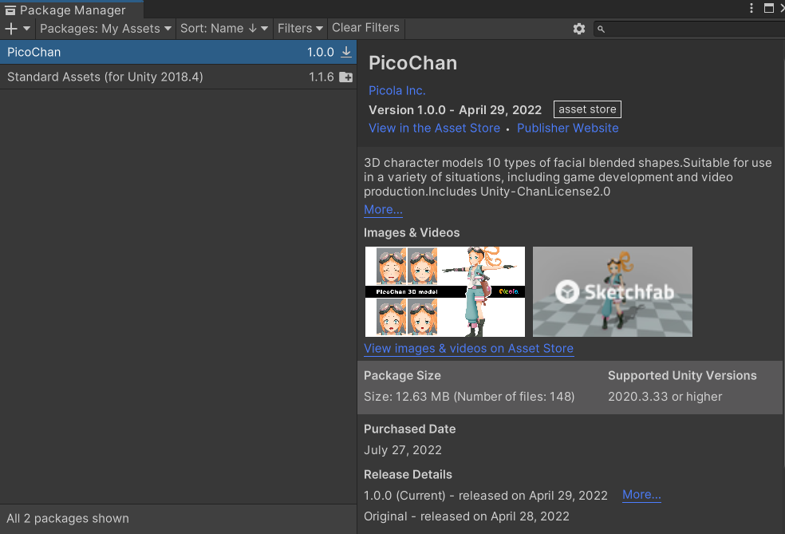
引入后，在Assets/Picola/PicoChan/Prefabs当中可以找到一个当前人物的预制件。拖进场景，就能看到那个Chan小姐姐了。
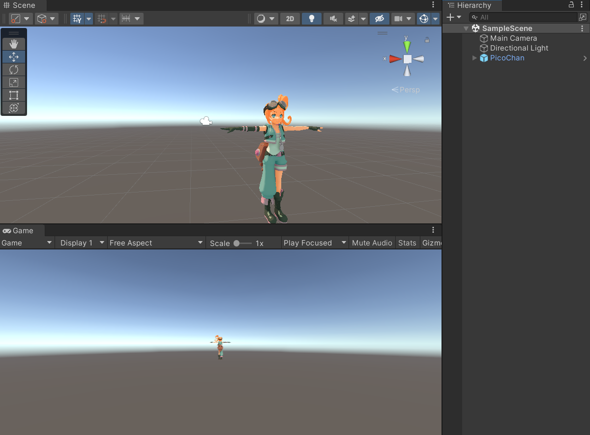

问题：我们获得的这个文件，到底是什么东西？
Picochan文件夹下，有Materials,Models,Prefabs,Samples,Textures几个文件夹。平级的Toon文件夹下还有Editor和Shader两个文件夹。
无疑这是一个3D模型。这距离我们的动画剪辑还是有差别的。

我的理解是，3D模型是一些定义好了上色方法的网格(三角形)。这个模型是静态的，并不是动画。3D模型一般用3DMAX，Maya，Blender等软件生产。

为了理解动画剪辑这一动画中最基础的概念，我们可以跳过**从模型生产出动画剪辑**这个核心步骤，直接来看一看拿到手的动画资产长什么样。
我获取了另一个资产，风格和上面的二次元小姐姐比较接近，但是一个动画资产：
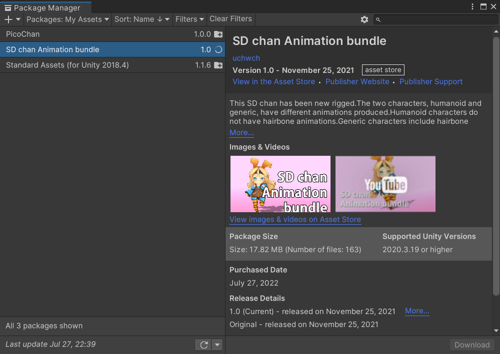
这里可以看到，作为动画资产里面的东西就多得多了，目录结构也会变得复杂。
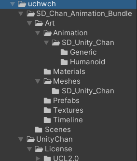
首先，找到Prefabs当中的预制件，是和上面3D模型一样的静态人物。然而在Art/Animation/SD_Unity_Chan/Generic当中，则是一些名字很长的文件，其中一个名为Unity_Chan_G_Idle_01，打开文件管理器才看到带上后缀全名为`Unity_Chan_G_Idle_01.FBX`
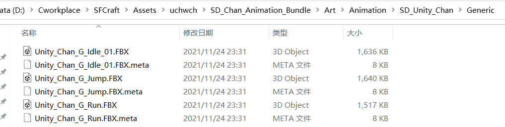
后面我们也会聊究竟FBX存储了怎么样的数据。
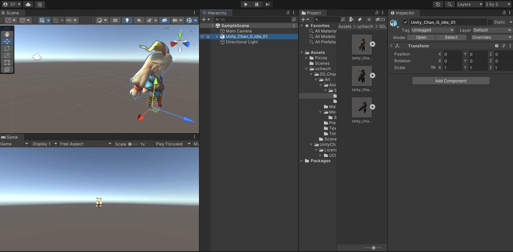
在Inspector-Model-Select 点击Select后选择Animation,表示使用Inspector的动画管理功能。直接单击FBX文件本身，Inspector也会直接变成模型导入设置窗口Model Input Settings Window，四选一即Model Tab模型选项卡，Rig Tab(定义 Unity 如何在导入的模型中将变形器deformers映射到网格Mesh)，Animation Tab动画选项卡以及 Material Tab材质选项卡。我们稍后在1.1详细来谈Animation Tab.

### 0.2 动起来！
这一段是写到中途的时候才到回来写的。我终于把现有的资产运用起来，让模型动起来了。

首先，把Art/Meshes/SD_Unity_Chan/Unity_Chan_humanoid 拖入Hierarchy.其实这个对象在Project里只是一个import设置项，告诉了Unity引入场景后如何配置。这是上面所说的3D模型，并不具有动画属性

然后，随便在Project一个位置创建一个Animator Controller。打开这个Animator，添加一个新状态：IDLE。
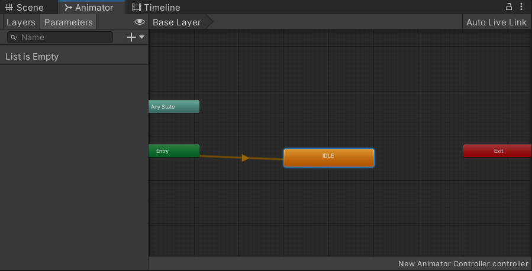
选中IDLE，在Inspector当中的Motion属性选择Clips。由于我们引入了三个动作，他们各自都有一个Clip。选择名为Unity_Chan_G_Idle_01的Clip。
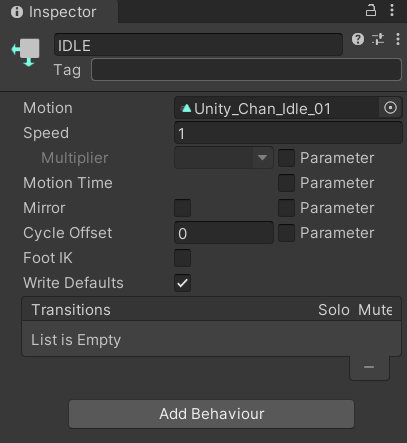

最后，把这个Animator Controller拖动到Hierarchy里的Unity_Chan_G_Idle_01对象上。
下面有点失真的画面里，小女孩就动起来了。
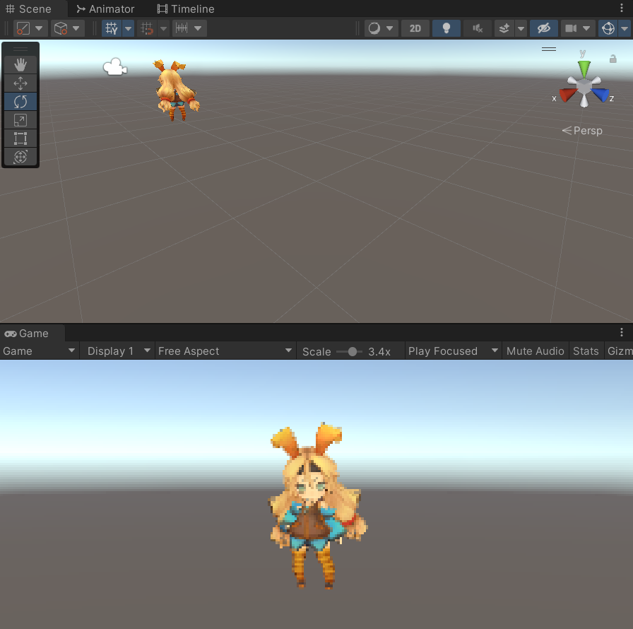

同样的做法，我们可以把这批资产里的三个动画全都在Game Play里展现出来(请想象她们是运动的)：
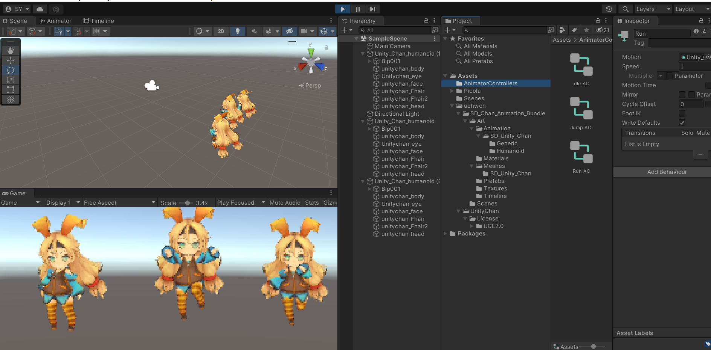

可以归纳import的动画资产的使用方法：

- 对模型绑定AnimatorController
- 在AnimatorController中编排好状态机
- 在状态机中各状态上绑上Animation Clips动画剪辑


## 1.动画剪辑
动画剪辑Animation Clips是动画的核心元素，而Unity当中的大多数动画资产并不是在Unity中直接创建的。他们可能来自于：
- 在动作捕捉工作室中捕捉的人形动画
- 美术师在外部 3D 应用程序（如 Autodesk® 3ds Max® 或 Autodesk® Maya®）中从头开始创建的动画
- 来自第三方库（例如 Unity 的 Asset Store）的动画集
- 从导入的单个时间轴剪切的多个剪辑。

动画剪辑是什么样子的，我们这就来找一些具体的例子来看。

### 1.1 Inspector-Animation Tab
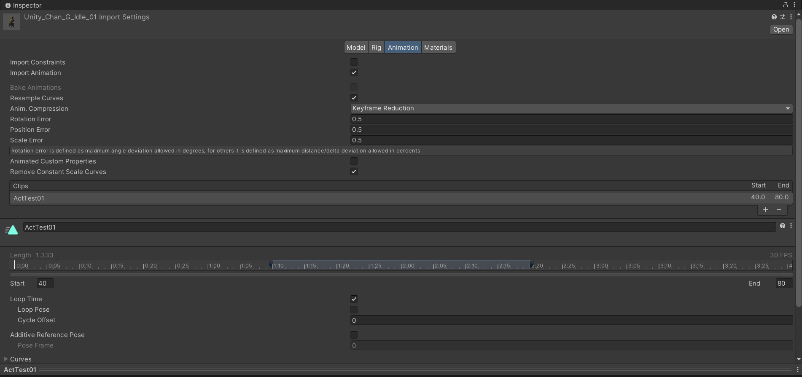
可以看到Animation Tab里有非常多的数据，这对应了[Unity官方文档-Animation Tab](https://docs.unity3d.com/2021.2/Documentation/Manual/class-AnimationClip.html)的对于Animation Tab 动画选项卡的介绍。
Animation Tab有四段部件。
#### A) Asset-specific properties 
Asset-specific properties 资产特有的属性表

#### B) Clip Selection List
Clip Selection List 动画剪辑选单
在这个选单中，列出了所有的**Clips**(**动画剪辑 Animation Clips**)。选中其中一条，C窗口将会详细展示这个Clip的信息。可以添加或删除Clips。
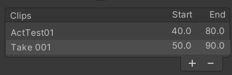
#### C) Clip-specific properties
Clip-specific properties 剪辑特有属性表
注意，点击Generic文件夹中的对象，显示部分如下：
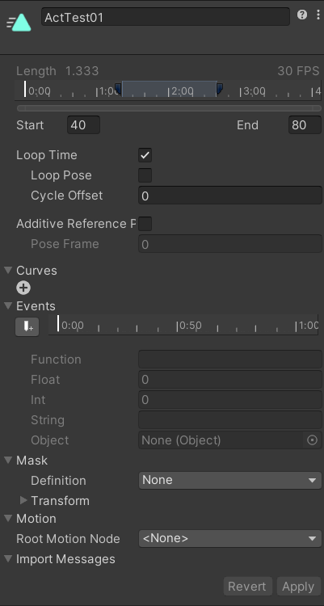
这与文档中的C部分不太一样。我们选择Humanoid当中的同名对象，就会是这样的内容：
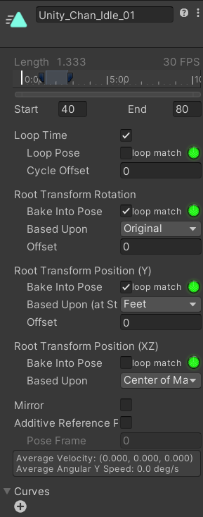
我们最终会介绍这是为什么。

#### D) 动画预览
我们直接点击三角播放键，可以看到这个Clip是一个呼吸微动的动作。

选到Humanoid里的Run对象，播放出来就是跑步的样子。三个对象分别是静息、跑步和跳跃，有了这些数据我们其实能比较轻易地做出一个走路模拟器的Demo。

但是纵使动画是完整的，把这个资产丢到Hierarchy的主场景里运行游戏也并不能看到人物对应的运动。

对于各个属性，详见上面的官方文档网址。

### 1.2 动画剪辑的使用
[Unity Doc Animation Controller](https://docs.unity.cn/cn/current/Manual/Animator.html)

#### 1.2.1 Animator Controller布局
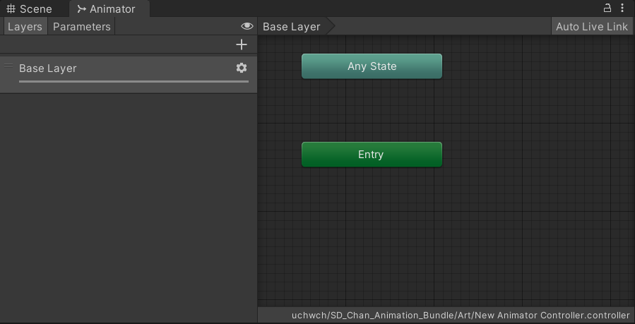
Animator的左侧是Layers布局与Parameters布局，右侧是网格布局。

可以右键单击该网格以创建新的状态节点。使用鼠标中键或按住 Alt/Option 键拖拽可平移视图。通过单击可选择状态节点以进行编辑，而通过单击并拖动状态节点可重新排列状态机的布局。

左侧面板切换到 Layers 视图时，您可以在 Animator Controller 中创建、查看和编辑层。因此，可在单个动画控制器中同时运行多个动画层，每个动画层由一个单独状态机控制。此情况的常见用途是在**控制角色一般运动动画的基础层之上设置一个单独层来播放上身动画**。

中央的BaseLayer其实是一个路径，显示了当前状态机内的“示踪导航”分层位置。状态可包含子状态和树，这些结构可以反复嵌套。当进入子状态时，此处会列出父状态的层级视图以及当前查看的状态。单击父状态可跳回到父状态或直接返回到状态机的基础层。

如下图，通过Create Sub-State Machine创建了New StateMachine,而由于我们在BaseLayer的布局下创建了这个子状态，其被认定为BaseLayer的子状态。
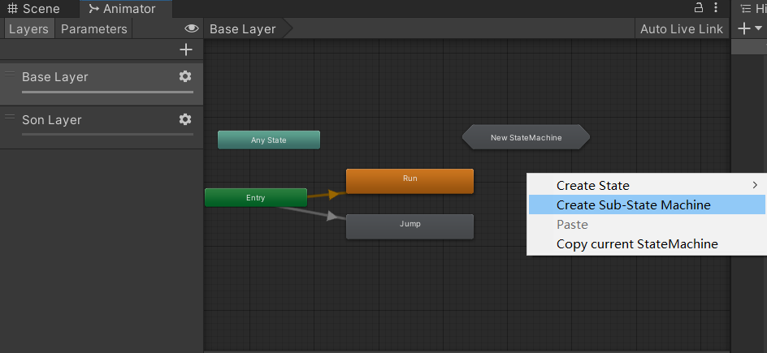
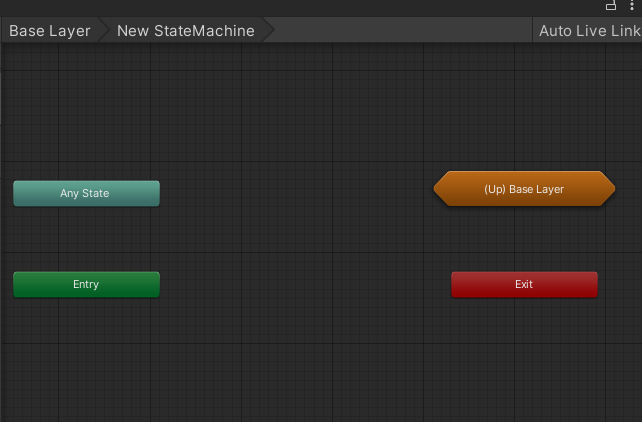

Parameter布局里，可以为Animator Controller添加参数。这些参数被称为**Animation Parameter动画参数**，C#脚本能够访问这些变量，并向它们赋值。这是脚本控制和影响状态机流程的方法。
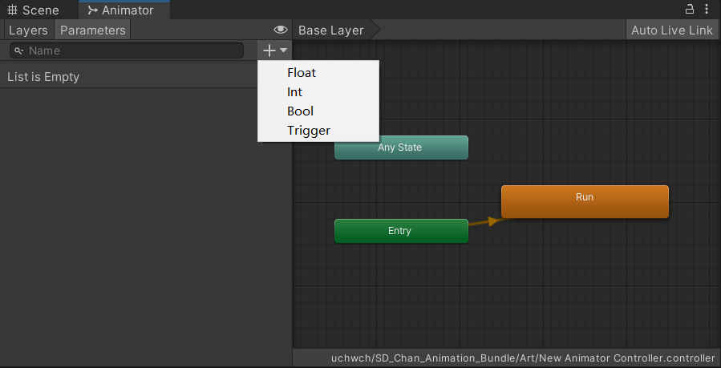

#### 1.2.2 动画参数
动画参数有float，int，bool，trigger四类。它们都与编程语言中相同意义，而trigger表示当被过渡使用时，由控制器重置的布尔值参数。

这些参数是Animator类的私有变量，应该使用Animator的setter和getter函数来读写。
```cpp
using UnityEngine;
using System.Collections;

public class SimplePlayer : MonoBehaviour {
    
    Animator animator;
    // 使用此函数进行初始化
    void Start () {
        animator = GetComponent<Animator>();
    }
    
    // 每帧调用一次 Update
    void Update () {
        float h = Input.GetAxis("Horizontal");
        float v = Input.GetAxis("Vertical");
        bool fire = Input.GetButtonDown("Fire1");

        animator.SetFloat("Forward",v);
        animator.SetFloat("Strafe",h);
        animator.SetBool("Fire", fire);
    }

    void OnCollisionEnter(Collision col) {
        if (col.gameObject.CompareTag("Enemy"))
        {
            animator.SetTrigger("Die");
        }
    }
}
```

#### 1.2.3 动画状态机
本科学到状态机是在《编译原理》这门课。在这里， Animator Controller 的核心思想就是状态机。玩家没有输入，处于静态呼吸状态。输入空格时，进入跳跃状态，而后播放完毕回到静态呼吸状态。跑步也是大同小异。简单的三个态就构成了人物的动作状态机。

一般来说，角色从一个状态立即切换到另一个状态是需要一定的限制条件的。比如角色只能从跑步状态切换到跑跳状态，而不能直接由静止状态切换到跑跳状态。角色从当前状态进入下一个状态的选项被称为状态过渡条件。

在Animator Controller中看到的状态机，能够纵览所有的状态以及它们之间的过渡条件，以及动画事件。

Animator 窗口中的每个视图都有一个进入 (Entry) 和退出 (Exit) 节点。从外部状态机转移到此状态机时候使用Entry。从该状态机退出时使用Exit。也就是说在Unity的动画系统里，可能出现的情况包括：
- 从State到State
- 从State到StateMachine
- 从StateMachine到StateMachine

状态机行为是一类特殊脚本。与将常规 Unity 脚本 (MonoBehaviour) 附加到单个游戏对象类似，您可以将 StateMachineBehaviour 脚本附加到**状态机中的单个状态**。这个C# Script应该继承StateMachineBehaviour 而非Monobehaviour.

StateMachineBehaviour 是一个可添加到状态机状态的组件。它是一个基类，所有状态脚本都派生自该类。默认情况下，Animator 不实例化控制器中定义的每个行为的新实例(可以认为是以类代对象)。类属性 SharedBetweenAnimatorsAttribute 控制实例化行为的方式。

StateMachineBehaviour 具有一些预定义消息： OnStateEnter、OnStateExit、OnStateIK、OnStateMove、OnStateUpdate。

我们先看一段UnityDoc的样例程序：

```cpp
using UnityEngine;

public class AttackBehaviour : StateMachineBehaviour
{
    public GameObject particle;
    public float radius;
    public float power;

    protected GameObject clone;

    override public void OnStateEnter(Animator animator, AnimatorStateInfo stateInfo, int layerIndex)
    {
        clone = Instantiate(particle, animator.rootPosition, Quaternion.identity) as GameObject;
        Rigidbody rb = clone.GetComponent<Rigidbody>();
        rb.AddExplosionForce(power, animator.rootPosition, radius, 3.0f);
    }

    override public void OnStateExit(Animator animator, AnimatorStateInfo stateInfo, int layerIndex)
    {
        Destroy(clone);
    }

    override public void OnStateUpdate(Animator animator, AnimatorStateInfo stateInfo, int layerIndex)
    {
        Debug.Log("On Attack Update ");
    }

    override public void OnStateMove(Animator animator, AnimatorStateInfo stateInfo, int layerIndex)
    {
        Debug.Log("On Attack Move ");
    }

    override public void OnStateIK(Animator animator, AnimatorStateInfo stateInfo, int layerIndex)
    {
        Debug.Log("On Attack IK ");
    }
}
```

本着实用主义思想，我们不详细解释其中具体的代码原理，照猫画虎地尝试写出一段脚本，来让我们的角色在W按下时跑动、松开W时回复Idle。

状态转移的条件，在选中状态后右侧Inspector当中的Condition。Condition中的选项是此状态机中的各个bool或trigger值。当然，也可以直接在Condition当中填写一个逻辑判断从而使用状态机的int或float参数。

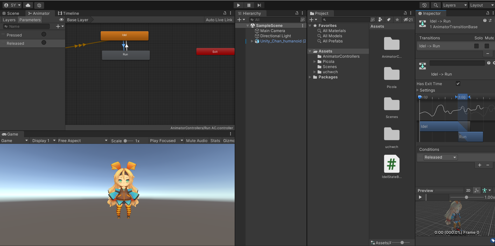

如此一来，就形成了 **脚本规定事件->事件触发改变Animator Controller当中的成员->成员改变满足了状态转移Condition->状态转移** 这样的逻辑链。

我在尝试+调试一段时间后，写了一个比较野蛮的代码。
```cpp
//IdelStateBeh.cs
using System.Collections;
using System.Collections.Generic;
using UnityEngine;

public class IdelStateBeh : StateMachineBehaviour
{
    override public void OnStateUpdate(Animator animator, AnimatorStateInfo stateInfo, int layerIndex)
    {
        if(Input.GetKey(KeyCode.W)){
            animator.SetBool("Wpressed",true);
            animator.SetBool("Wreleased",false);
        }

        
    }
}

```

```cpp
//RunStateBeh.cs
using System.Collections;
using System.Collections.Generic;
using UnityEngine; 

public class RunStateBeh : StateMachineBehaviour
{
    override public void OnStateUpdate(Animator animator, AnimatorStateInfo stateInfo, int layerIndex)
    {
        if(!Input.GetKey(KeyCode.W)){
                //或者没有按键、或者没有按下w
                animator.SetBool("Wpressed",false);
                animator.SetBool("Wreleased",true);
        }
        
    }
}
```

这两个行为是在状态Inspector中直接Add behaviour出来了，因此各自已经绑定好各自的对象。
写好脚本后，把Run->Idle 以及 Idle->Run 都设定condition，分别是release=true 和 pressed=true

运行一下就能看到程序效果了，和游戏中的W控制玩家前进一样。


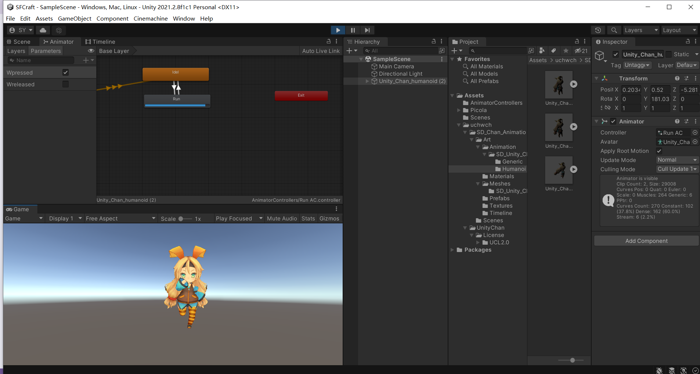

可以感受到按下W有一种迟滞感。我们可以通过改变过渡动画中间上下动作的时间差来调整。点击状态过渡箭头，就能看到这部分。我把前半段的Idle拖得很短，就能让W按下之后更快进入Run动画的播放。

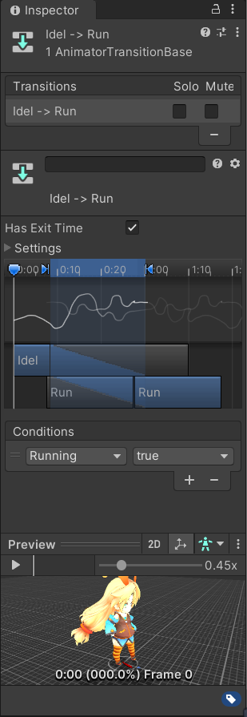

进一步，我们来尝试编写脚本实现三元状态机:Idle-Jump-Run.我们迅速地拉好过渡箭头，组成三元组，并且为每个动画过渡添加Condition。
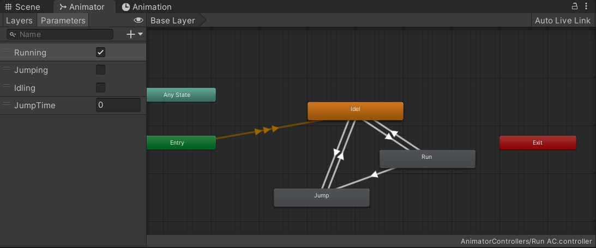

为了实现这个事儿，最突出的困难在于：Jump动画播放完，就应该自动进入Idle state而非用什么Condition。如何让动画告知状态机应该转移呢？

事实上我们这样解决。
Scene当中的Chan被我们挂上了RunAC这个组件(显示为Animator组件)，就可以用Animator的Setter去改变状态转移值。我们只要在Chan对象上再挂一个脚本，在这个脚本的一个函数里面写Setter。

在动作(注意这里要选原动作，不能是引用，引用动作会显示Read only不让编辑)的Inspector中，可以找到一项名为Events(下图右下角)
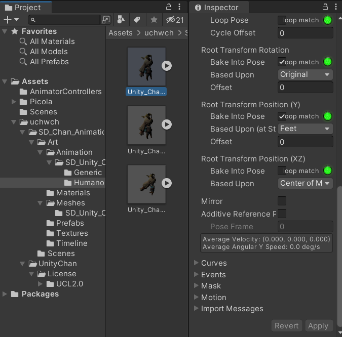

点开Events，在中间合适的位置点击时间条，添加一个如图的事件：
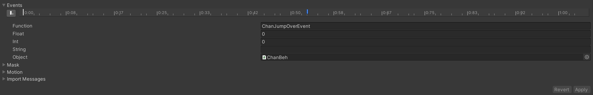

这个事件的名字ChanJumpOverEvent，其实只是一个函数。我们在Chan上挂的脚本称为ChanBeh.cs
```cpp
//ChanBeh.cs
using System.Collections;
using System.Collections.Generic;
using UnityEngine;

public class ChanBeh : MonoBehaviour
{
    // Start is called before the first frame update
    Animator ani;
    void Start()
    {
        ani=GetComponent<Animator>();
    }

    // Update is called once per frame
    public void ChanJumpOverEvent(){
        
        ani.SetBool("Idling",true);
    }
}
```
由于这个脚本本来就挂在拥有Animator的场景中的Chan模型上，其可以通过Animator的setter来改写Condition变量，从而控制状态转移。

至此，我们已经可以通过在控制台点选三个逻辑值来改写动画状态，实现三元组迁移了。但是我们再进一步，编写好三个StateBehaviour。
```cpp
//RunStateBeh.cs
using System.Collections;
using System.Collections.Generic;
using UnityEngine; 

public class RunStateBeh : StateMachineBehaviour
{
    override public void OnStateEnter(Animator animator, AnimatorStateInfo stateInfo, int layerIndex)
    {
        animator.SetBool("Jumping",false);
        animator.SetBool("Idling",false);
    }
    override public void OnStateUpdate(Animator animator, AnimatorStateInfo stateInfo, int layerIndex)
    {
        if(!Input.GetKey(KeyCode.W)){
            //只要松开W，就退出状态
            animator.SetBool("Running",false);
            animator.SetBool("Idling",true);
        }
    }
}
```
```cpp
//IdelStateBeh.cs
using System.Collections;
using System.Collections.Generic;
using UnityEngine;

public class IdelStateBeh : StateMachineBehaviour
{
    override public void OnStateEnter(Animator animator, AnimatorStateInfo stateInfo, int layerIndex)
    {
        animator.SetBool("Running",false);
        animator.SetBool("Jumping",false);
    }
    override public void OnStateUpdate(Animator animator, AnimatorStateInfo stateInfo, int layerIndex)
    {
        if(Input.GetKey(KeyCode.W)){
            animator.SetBool("Idling",false);
            animator.SetBool("Running",true);
        }
        if(Input.GetKey(KeyCode.Space)){
            animator.SetBool("Idling",false);
            animator.SetBool("Jumping",true);
        }
    }
}

```
```cpp
using System.Collections;
using System.Collections.Generic; 
using UnityEngine;

public class JumpStateBeh : StateMachineBehaviour
{
    override public void OnStateEnter(Animator animator, AnimatorStateInfo stateInfo, int layerIndex)
    {
        animator.SetBool("Running",false);
        animator.SetBool("Idling",false);
    }
    override public void OnStateUpdate(Animator animator, AnimatorStateInfo stateInfo, int layerIndex)
    {
       //现在正在跳
       //跳跃会在播放结束后触发事件，调用ChanBeh.cs当中的函数，转入Idle
    }
}
```

这样编好之后，三元组控制的跳停跑小姐姐就做好了。目前这当中还有很多问题，比如：
- 只有Idle播放一次后才会转移，因此从静止状态按下W或空格都会有一段时间的迟滞
- 没有写跑跳逻辑，即按住W再按空格并不能跑跳，实际上没能完成跑-跳转换
  
这两点就暂时不改了~