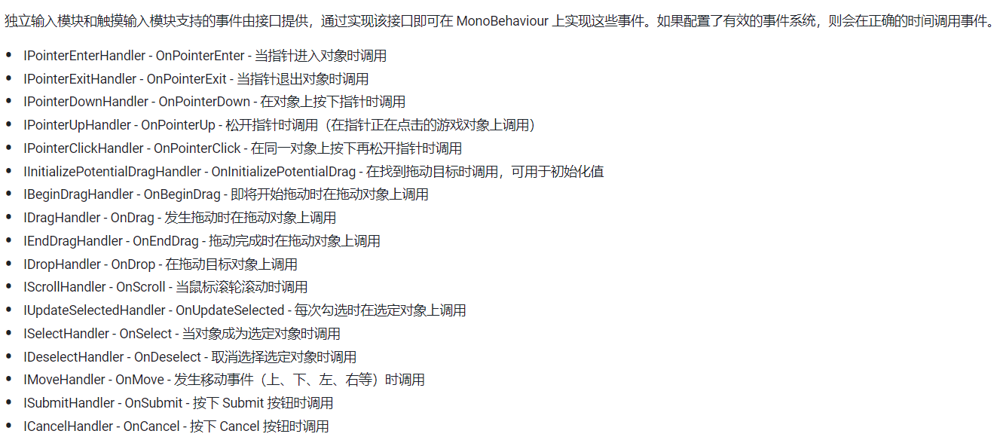

# UnityUI技术要点
- [UnityUI技术要点](#unityui技术要点)
  - [涉及UI性能的技巧和原则](#涉及ui性能的技巧和原则)
  - [UnityUGUI MessageSystem](##UnityUGUIMessageSystem)
---

## 涉及UI性能的技巧和原则
UGUI方面最大的性能瓶颈就是多次的drawcall，按理说在屏幕上添加一些UI这件事不应当使用超过一次的drawcall，然而实际上许多情况会导致单UI系统就会在一帧内发生多次batch。比如如果

[Unity Manual - Sprite Atlas](https://docs.unity3d.com/Manual/sprite-atlas.html)


可以看到上文中开篇第一句话，在Unity中，通常为一个纹理进行一次drawcall。这里与openGL等原始项目的渲染过程是不一样的，在那些项目中，比如要绘制一个外表面包络纹理的立方体，drawcall的数量与纹理数量是无关的

1. 降batch，比如使用图集。
2. 动静分离，使动态变化导致的UIElementDirty的范围尽量小
3. 降低overdraw，主要是避免不必要的重叠——UI组件如果发生重叠一定会发生blending
4. 关闭UI组件不需要使用的功能，比如rich text，raycast，mask，layout等
5. 不要用SetActive来隐藏组件，而是通过把组件位移到画面可视范围之外（事实上渲染时候会被裁剪）

## UnityUGUI MessageSystem
有一个接口IEentSystemHandler,继承自这个接口的任何借口都表示可以通过消息系统来接收事件。
```
public interface ICustomMessageTarget : IEventSystemHandler
{
    // 可通过消息系统调用的函数
    void Message1();
    void Message2();
} 
```
我举一个例子，比如我们希望通过消息系统来实现空格键按下时在屏幕打印特定内容这个案例。在之前，我们让游戏物体在Update当中检验输入，每一帧都不断查询`Input.GetKeyDown`来获取输入。这样的写法可能造成一些性能问题，我们改为对消息系统的查询，当输入发生的时候，输入模块会给我们的游戏对象发消息，游戏对象执行回调函数，就能完成上述的过程。

不用担心，standalone input module独立输入模块是Unity预定义好的，里面有大量的接口函数，分别对应了不同的时机：



比如现在，我希望UI当中有一个可以click的Image。原有的项目结构中，Canvas总画布拥有子对象Image，我们在Image上面添加monobehaviour并进行编程：
```
public class MyButtonBehaviour : MonoBehaviour, IPointerClickHandler
{
    void IPointerClickHandler.OnPointerClick(PointerEventData eventData)
    {
        Debug.Log("On_Click");
    }
}
```

上述所有接口一一实现，就能实现出一个行为良好定义、行为丰富的button。

