# 游戏设计草稿I 短期废案

## 亮点
玩法亮点：
灵感来自于死亡搁浅的送货与骑砍中的经济系统，围绕背包系统和经济系统的经商送货游戏。游戏目的是在有限背包容量、浮动物价和复杂的商人位置分布和不同的地形下更快实现财富积累。

背包负重将影响角色运动；
不同的地形需要不同的装备进行应对，比如沼泽将会严重减慢运动速度，

技术亮点和重要的实践：
1. 模拟了参考魔兽世界与暗黑2的背包系统，实现了物品类和继承关系、物品堆叠，学习使用了UGUI(见作品展示图)
2. 编写了Animator和状态转移脚本，通过键盘输入实现人物的冲刺跑、跳跃
3. 由于公开资产charactor的动作有限，学习了使用3dsMax制作人物动画资产，为人物增加了疲惫行走的动画资产并补充了动画绑定；制作了3dsMax资产导出到Unity的辅助插件
4. 实现了丢弃和拾取
5. 摄像头的跟随，当越过阻拦在摄像头与人物之间障碍物时通过透视避免阻挡
6. 通过实现了角色成长数据、背包数据的持久化(本地Json存档)

# 游戏设计草稿II 正文 Unity的类魂ACTdemo
## 技术要点
1. UGUI实现血量、精力的显示
2. 编写了Animator和状态转移机，实现了带取消、看破和无敌时间的ACT系统
3. 实现了敌人的战斗AI
4. 添加了打击特效
5. 实现了无敌时间的慢动作效果
6. 实现了斩杀的击杀特写

## 动手前的思考
### 1 关于翻滚的细化分析
在很多ACT游戏中，翻滚是一个**优先级非常高**的动作，除了受攻击，没有任何执行中的动作应该阻止人物翻滚，甚至是出手攻击。攻击在A出后立刻翻滚取消后摇应该是一个可以选择的玩家操作点。为了保证这个优先级，之前联的状态机或者必须重构；或者要用脚本控制一个上层逻辑，一旦有space介入，就需要用`Ani.Play("Dodge")`进行状态的打断和转播。

但是在黑魂中，强调玩家谨慎地规划攻击，也严格限制玩家无限翻滚，因此其实魂系游戏更像一个指令队列，如果你按下攻击立刻闪避，最后的结果是先砍一刀，然后匆忙闪避(实战结果往往是被爆杀，这相当于是游戏的一种惩罚)

那我们做哪一种呢？

魂系强调的是和怪物的对峙，使得ACT的节奏慢了下来，玩家得以更细致地观察怪物的动作，特别是**出招之前的微动作**。这是魂系ACT好玩的点。但是，我必须得指出，这一Part似乎不太适合Demo呈现。面试官扫过几眼项目，并不会非常思考玩家如何在揣度怪物出招。他是会觉得这是一个平庸的项目(毕竟你最后动作也不能改，特效也不会做，十有八九最后是平庸的)

所以我们这样设计：传承魂的精力管理，用来限制玩家的翻滚；但是不设计所谓指令队列，当由于脚本实现问题导致玩家不得不特别精准地同时按下两个键，仅仅因为要规避这种潜在的错误时可以考虑引入指令暂存机制。

### 2 Dodge的Transition
首先，除了受击、倒地等状态会阻止翻滚，任何自发的动作都可以被翻滚打断：跑动(6种)，挥砍（许多种），由于这么多状态都要向翻滚转移，因此一一连线会是太过恶心的一种选择。我们应该寻找一种替代。在学习`substatemachine`和`blendtree`之前，我想到的技巧是我自己发明的一个词儿叫`动画机浮岛`（可能是受到这两天就要开放下载的天空之泪的启发），想法是这样的：既然那么多状态都要检测空格，不如我直接写一个全局脚本，一旦按下空格就`Ani.Play()`来打断，从而让动画机跳到一个并不与之前机群相连的浮空岛。以后受击也可以这样做。之后，翻滚或者受击总会结束，一旦结束我们就用事件或者写一个`onStateExit()`来触发`Ani.Play()`，回到主岛屿。

### 3 Unity脚本的执行顺序
1. 一个原则：type作为整体排序
在Unity脚本中，所有typeA的脚本会排在一起，因此如果一个typeA脚本在typeB脚本之前执行，那么无论一系列的typeA或者typeB绑定在如何的一系列物体上，任何一个typeA脚本总是比typeB脚本先执行。
2. 手动设置执行顺序
在左上角的`Edit`下拉菜单找到`Project Settings Inspector`可以找到`Script Excecution Order`

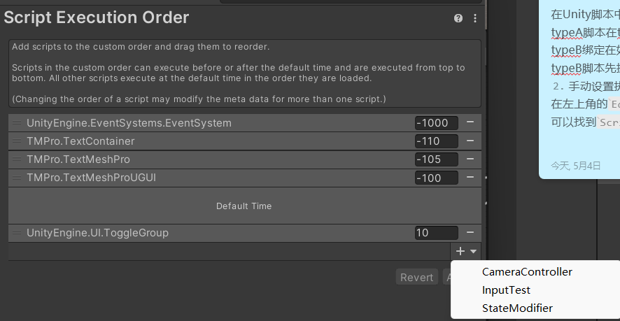
系统的几个内置部分，比如其中的事件系统和UI，都有预设的执行有限度。点击+所有自己编写的类(脚本)都会呈现，我们可以自己给他添加DefaultTime，时间越大越靠后，因为事实上这是一个触发时间的意思，也就是默认情况下Unity拖延这个脚本开始执行的时点。
同时这个界面中间写着一句话：其他没有设置的脚本，按照load顺序执行。

除此以外，每一帧里还有Unity规定的生命周期流程，比如Editor默认是最早启动的，其次依次是Initialization，Physics，Input events，Game Logic, scene rendering, Gizmo rendering, GUI rendering.

### 4 Q锁定摄像头
仔细想一想黑魂和老头环是怎么做的。按下Q键，锁定boss，这个时候玩家面朝方向改变了，也不再自由了。此时如果玩家按下A向左，事实上不再会向左奔走，而是变成面朝Boss横向移动。摄像头不会再随着鼠标晃动而晃动，而是永远锁住：位置相对于人物静止，而LookAt Boss。在黑魂中可以通过再按一次Q，或者相反方向奔逃解锁。我们不设计奔走，但是有一个很badass的点子：如果锁定Boss自动变成静步走，感觉蛮吊的。


# 版本迭代
## V0.1更新日志
头一次从设计层面写逻辑哈。之前写了好几版本3C，比现在的目标简单得多，但是基本写着写着就发现出现狗屎

V0.1的需求是这样的：把6个跑步动作，分别是F,FL,FR,B,BR,BL与输入映射起来，做一个最初版的动画机，并且加入Camera

这次我们把所有的输入w，a，s，d，space，leftmouse以及更多做成一个掩码，把这个掩码传递给其他脚本来完成通讯，这样信息量高度密集，程序也写的更加明白了。
~~Quest1完成：输入向animator状态的传递~~
我发现资产类似的版本非常多，同一个动作有root也有inplace，而且很多动作还有start和end态

~~Quest2 从动作资产做出前进动画机~~
~~Quest3 加上简单的摄像机检测前进~~
~~Quest4 设计：考虑左右偏向跑动情况下的摄像头如何设置~~
~~Quest5 优化掩码的Input逻辑~~
~~Quest6 F,FL,FR的跑动状态机~~
~~Quest7 B,BL,BR的跑动状态机~~

必须声明：*V0.1完成后，如果从任何状态按下A 或者 D，由于还没有做这两部分的状态逻辑，将会卡死在当前状态。*

## V0.2更新日志
主要是优化摄像机视角系统。应当添加：
1. 对V0.1版本的debug
2. Q的锁定敌人视角，这个需求其实不简单，需要细化一下
3. 调整摄像头为position死跟随、随鼠标左右晃动，并可以通过中键回正rotation

### p1 V0.1版本的debug
我锁定了v0.1当中这样一些较为明显的bug：
1. 左后退时按下右键，陷入锁定。同样的，SD时，S时，如果按下右键或者左键都会陷入锁定。也就是说目前按下A或者D只有一种情况下会受理：W同时也在按下。这表面上看也是没什么问题的，我们不打算设计左跑和右跑这两个动作(资产里没有)，仅仅只是调动摄像机而已。但是这当中还是有一个问题，*按下A或者不按下，不应该影响到AS SD S几个动作*。
2. 静态时按下AS，没有发生转移。同样的情况发生在SD。
3. 向前行进状态中途，如果按下D或者A会导致锁死

对于bug1：不加入AD转动摄像机逻辑的现在，S->SD应该受理为S；S->SA应受理为S，如果S在任何时候松开了，就应该转入IDLE。
改动如下：
**V0.2-BUG1-FIX1**：把状态向后跑动到IDLE的状态转移条件改为`SPressed == false`,原为`Code == 0`
**V0.2-BUG1-FIX1-EFFECT**：后退现在不会被突然松开S并按下A或者D所阻塞；但是AS-D还是存在问题
**V0.2-BUG1-FIX2**: 状态向右跑动-IDLE转移条件改为`SPressed == false`，原为 `Code < 2`.同样的改动应用于向左跑动-IDLE转移条件
**V0.2-BUG1-FIX2-EFFECT**：现在排除了bug，暂时没有发现新的问题

对于bug2，静态时按下AS没有发生转移，主要是因为静态向后退系统的转移全都仰仗Code=4触发向后移动，然后才能后左或者后右。我们加上后左和后右和IDLE之间的双向转移即可
**V0.2-BUG2-FIX1**：添加了IDLE向后左、后右的状态转移，转移条件分别是`Code = 12`和`Code = 6`
**V0.2-BUG2-FIX1-EFFECT**：解决了AS没有转移的问题，但是现在的新的问题是在IDLE播放途中，按下S,AS,SD都是没有反应的。
为什么W和前进部分没有这种问题呢？
因为hasExitTime。
**V0.2-BUG2-FIX2**：修改IDEL-向左跑动的`hasExitTime=false`。现在IDLE向左后、右后、后的三个转移都设置了`hasExitTime=false`
**V0.2-BUG2-FIX2-EFFECT**：现在解决了问题，在IDLE中途按下S，AS，SD都可以立刻进入各自的后退状态。

对于BUG3，应该细化说明为：当按下W前进，且向前跑动状态进行中途，立刻松开W并且按下D(或者对称的A)，这个时候转移Code=8（或者2），而向前跑动态的几个转移条件是：
Code = 1时，维持自身
Code = 9时，向右前跑动转移
Code = 0时，向静止转移
Code = 3时，向左前跑动转移
SPressed = true时，向后退转移
这当中并没有设计2或者8的转移条件。事实上，如果玩家立刻松开W并且按下A或者D，我们确实不必做任何特别的逻辑(我是指状态机可以维持不变)，但是应该防止人物锁死在这个状态。我们可以把Code = 0向静止转移的条件改写一下：
**V0.2-BUG3-FIX1**：修改前进状态向静止的转移条件，原本为`Code = 0`,现在为`WPressed = false`。同样WD-A，WD-D，WA-A，WA-D 都会发生这种锁死。但是我已经给
右前跑动、左前跑动都设置了这个向跑步终止状态的转移条件：`WPressed = false`，并且把hasExitTime都设置成false
**V0.2-BUG3-FIX1-EFFECT**：问题解决了，现在行进中突然松开手改按下D或者A也不会锁死。
~~后来又发现了一个BUG4：在不断尝试S D SD 的时候，我意识到一个问题：右后移动有这样一些转移：
SPressed = false，IDLE
Code = 4，后退
Code = 6（AS），左后退
Code = 12,自循环
同样没有解决BUG3在W上造成的问题(好像问题没法复现了，再出现再改吧)~~

至此debug就完成了。

### p2 调整摄像头
调整摄像头为position死跟随、随鼠标左右晃动，并可以通过中键回正rotation。

现在，V0.1已经完成的当下，我已经做了一版摄像头跟随实现，办法是用`MainCamera`上绑定的`CameraController`，`CameraController.Update()`调用`CameraController.setPositionAtBehindMyself()`, 每一帧进行Camera位置的更新

那么现在要添加的就是随鼠标晃动和鼠标中键回正了。
关于鼠标的视角晃动，要往哪里加呢，加在`CameraController`上是比较合理的。Input类有readonly的静态变量`mousePosition`, 最直接的一个实现方案就是：在`CameraController`加上一个量`lastPosition`(初步一想这个量也可以记录为static)，每一帧更新`lastPosition`，并且查证lastPostion来确定当前帧的鼠标横向位移。
mousePosition总是返回一个Vec3，其中z=0
代码如下：
```cpp
using System.Collections;
using System.Collections.Generic;
using UnityEngine;

public class CameraController : MonoBehaviour
{
    Transform cameraTransform;
    Transform targetTransform;//这里指的是人物，因为一般情况下摄像头在看人物
    [SerializeField] public float cameraRotationSpeed;
    static Vector2 lastMousePosition;
    // Start is called before the first frame update
    void Start()
    {
        cameraRotationSpeed = 0.25f;
        targetTransform = GameObject.Find("Myself").GetComponent<Transform>();
        cameraTransform = this.GetComponent<Transform>();
        enemyTransform = GameObject.Find("Enemy_Master").GetComponent<Transform>();
        var v2 = Input.mousePosition;
        lastMousePosition = new Vector2(v2.x, v2.y);
    }

    // Update is called once per frame
    void Update()
    {
        
        //死死跟随
        setPositionAtBehindMyself();
        setRotationMouseNAD();

    }
    private void setPositionAtBehindMyself()
    {
       //...

    }
    private void setRotationMouseNAD()
    {
        var curMousePos = Input.mousePosition;
        var mouseXdelta = curMousePos.x - lastMousePosition.x;
        if (Mathf.Abs(mouseXdelta) > 2.0f){
            cameraTransform.Rotate(new Vector3(0, mouseXdelta * cameraRotationSpeed, 0));
        }
        lastMousePosition = new Vector2(curMousePos.x, curMousePos.y);
        if (Input.GetKey(KeyCode.Z))
        {
            middleResetCamRotation();
        }
    }
    private void middleResetCamRotation()
    {
        var curCamRotEul = this.cameraTransform.rotation.eulerAngles;
        var curCharRotEul = this.targetTransform.rotation.eulerAngles;
        var deltaRotEul = curCharRotEul - curCamRotEul;
        this.cameraTransform.Rotate(deltaRotEul);
    }
}
```

简单调试一下这个需求就做好了熬。做的中途我想到了要让摄像机去缓动，而不是直接转回来。这个稍微有点难做，后面的版本再更吧。
### p3 横向跑动问题
我同时还想到一个问题。目前的所有动作都是根动作的，如果我们希望加上根据鼠标移动或者AD键来转动人物，能做吗？这样做有意义吗？
目前的WD已经变成了向右前方跑动，如果这个时候再加上D转动视角，事实上镜头和人物的转动是不匹配的。试想一下，根据我们的右前跑根运动，此时人物是向右前方45°直线运动，如果摄像头在D按下时候转动是根本不对的。现在我们已经设计了摄像头死死咬住人物后脑勺，以致于任何时候都能继承人物根运动的旋转。
那如果像这样，人物要如何去到自己右边一米的位置呢？难道要通过WD动二分之根号二、SD二分之根号二才能抵达么？目前我们的人物没有旋转的能力，而只是在六个方向上直线运动。
我们来参考一下崩铁是怎么做的。
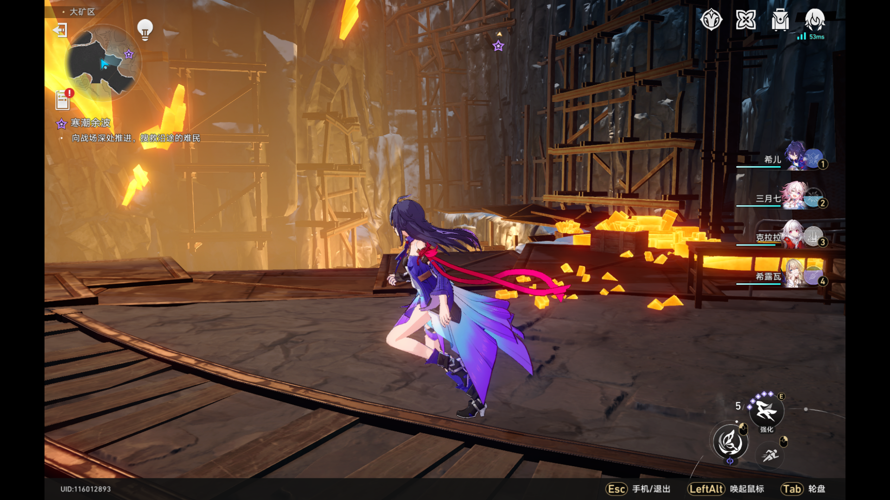
在WA WD下，崩铁的动作是和我们一样的斜前方跑动；但是A D下，角色会横在屏幕里，横向跑动。如果要沿袭这种做法，我们的每帧update摄像机到角色后方的逻辑就要重写了。同时，崩铁在SA SD时也是斜前进，但是崩铁没有后退的动画，因此人物会脸朝摄像机奔跑。（这套跑步动作系统几乎是沿袭自米家的前几作而无变化的）

如果参考这套系统，就会有一个问题：按下A的时候横向向左播放前进动画，而如果此时过渡成AS，人物反而把脸转到正前方、与此同时向左后跳步退后，这是一个很不自然的过渡。

既然我们的资产当中有左右侧跑动和走动的动画，为什么不直接做成横向移动呢。

补充一个小Tips：一般情况下一个状态按照状态转移列表里由上而下检测转移，因此上面的转移优先级比下面的高；但是如果一些状态有hasExitTime而一些没有，优先级就会部分失效。比如一个优先级(1)在上面的转移设置了hasExitTime，而优先级(2)在他的下面的另一个转移没有hasExitTime。这时候假如(1)(2)的转移条件都触发了，事实上会怎么样呢？答案是，动画机刚刚想要执行(1)的退出过渡动画，这个时候(1)的转移已经判断过了，发现(2)也是符合的，就打断了(1)的转移而向(2)开始转移了。最终表现就是(2)越过了(1)成为了事实上发生的转移。

经过一段时间的连线和调试，现在跑步动画已经比较丝滑了，事实上人物能够在八个方向上自由跑动，且状态转移目前没有发现什么bug，即便用户到处乱按键也不怎么出问题。

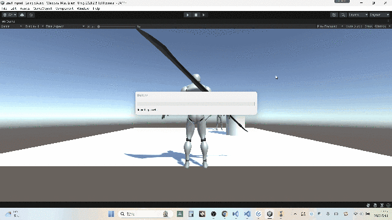

### p4 Q的锁定敌人视角
这个其实也不难，只要用lookAt就好了。不过要尽量多做一些架构上的事情，免得后面回来重构这部分代码。
按下Q会影响哪些系统？
实际上除了影响camera，也会影响动画机。我们说了希望把锁定状态的跑动改成静步，这样感觉很帅。按下Q使得Camera的Update彻底改变了，因此Q是否按下应该是一个Camera能够每帧感知的量。而既然Q也能影响动画机，所以动画机也应该存放一个Q是否按下的量，这两个量应该以某一方为主体每一帧进行同步。

Q按下以后人物变成了静步状态，我认为应该是用一个全新的子状态机来实现(否则现在这套动作机要和与自己一样大的一个群去一一相连 直接变成炼狱)
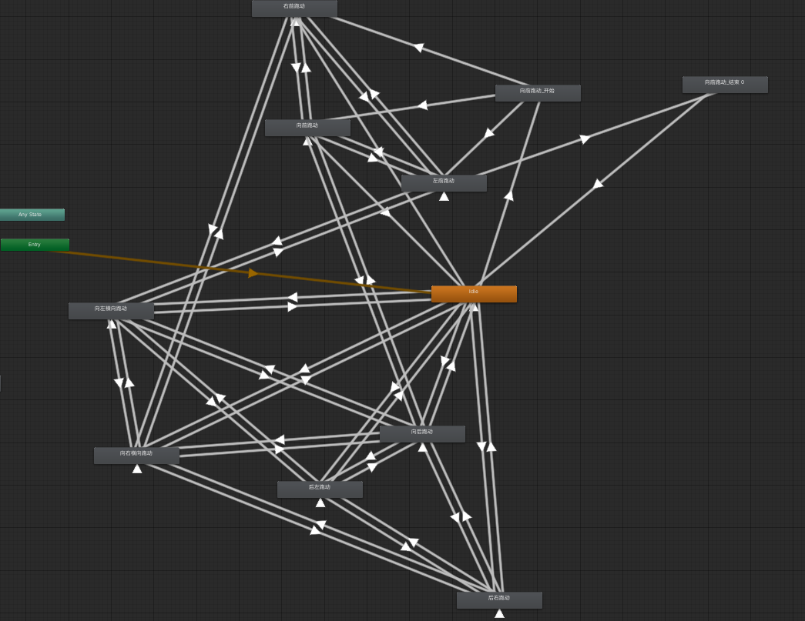

首先我做了一件事情，把当前的机器包装成一个子状态机。这不会引发任何问题，且非常美观。接着我在想，锁定状态下的所有动作事实上都和没有锁定时候一一对应，能不能做这样一件事：
在未锁定状态机上(我们前面所写的状态机，此后称之为NLockSubState)绑定一个脚本，让他来完成这样一件事：任何时候锁定状态一旦切换，立刻打断跑动的状态，切换到锁定状态机(LockSubState)

**V0.2-UPDATE1**:(非编码改动)现在Entry默认进入一个子状态机"NLockSubState",这个子状态机包含了之前的所有状态，默认进入的状态依然是NLockSubState.Idle
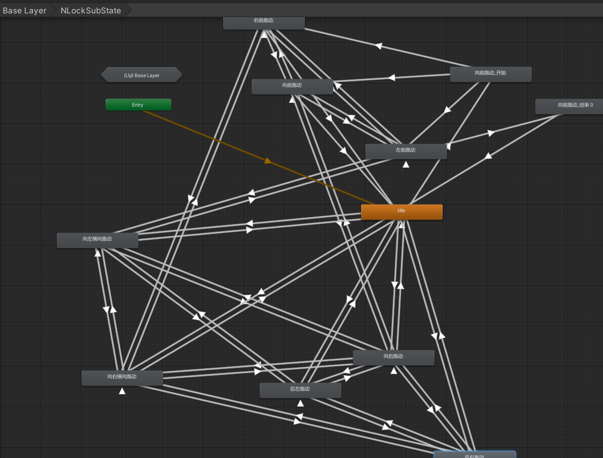

**V0.2-UPDATE2**:现在InputTest也能更新Q状态。Q对应的动画机参数是QHold。加了一行代码在InputTest：
```
    void Update()
    {
        //...
        if (Input.GetKeyDown(KeyCode.Q))
        {
            ani.SetBool("QHold", !ani.GetBool("QHold"));
        }
    }
```
**V0.2-UPDATE3**:在Q按下时用一对事件来告知多个系统。现在，`InputTest.cs` `StateModifier.cs` `CameraController.cs` 用这个事件来通讯。
InputTest.cs: 现在持有`public static event EventHandler<lockEventArgs> lockEventHandler`以及几乎完全一样的`unlockEventHandler`;当Q更新时，事件被激发。
InputTest:
```
    void Update()
    {
        //...
        if (Input.GetKeyDown(KeyCode.Q))
        {
            var beforeChangeQHold = ani.GetBool("QHold");
            ani.SetBool("QHold", !beforeChangeQHold);
            if (beforeChangeQHold)//之前QHold对应解锁
            {
                unlockEventHandler?.Invoke(this, new lockEventArgs());
            }
            else
            {
                lockEventHandler?.Invoke(this, new lockEventArgs());
            }
            
        }
    }
```

锁定后，应该有一个逻辑去在敌人池中搜寻一个合适的对象来锁定。我的确很不想做敌人池，至少不是现在做。毕竟，我们最终的demo可能也只有一个怪物。
这里我们用寻找敌人、直接引用敌人来实现。
**V0.2-UPDATE3**:在CameraController.onLockEvent()中实现这个锁定逻辑。我直接在Start当中写了enemy的找寻(这非常非常不好，不规范丑陋且可能出错，但是先这样吧)
```
    void Start()
    {
        //...
        enemyTransform = GameObject.Find("Enemy_Master").GetComponent<Transform>();
        InputTest.lockEventHandler += onLockEvent;
        InputTest.unlockEventHandler += onUnlockEvent;
    }

```
同时为CameraController添加filed：isLocked。
下面是写核心逻辑。我想了一下，即便是锁定，摄像机在人物后脑勺上这一点似乎也没必要变；需要变得是camera的rotation，需要转到直接对准物体。这个我们有Transform.LookAt 啊。
```
//CameraController.cs
void Update()
    {
        setPositionAtBehindMyself();
        if (!isLocked)//未锁定模式，紧紧跟随，位置设置在主人公后脑勺
        {
            setRotationMouseNAD();
        }
        else//锁定模式，看向敌人
        {
            cameraTransform.LookAt(enemyTransform.position);
        }
    }
```
这个写法我调了一下，感觉勉强能接受但是也有问题，看图：
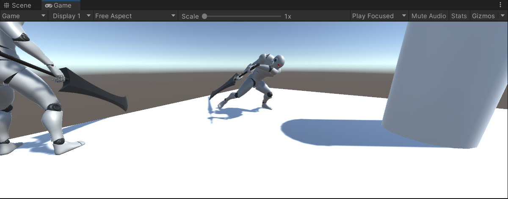
当我走到敌人背后的时候，由于摄像机一直在我的后脑勺上，这个时候敌人也在我的背后，摄像头就往后看了。我在往前一步，我就看不到自己了。蛮糟糕的。
不过我立刻想到，这不应该是一个摄像机写的不好造成的问题。事实上，锁定状态下人物的运动逻辑也深刻改变了，比如在黑魂打boss经典的按住D二人转，这个时候人物其实在绕着怪转，而脸始终面向敌人。**人物的脸面向敌人可不是摄像机脚本控制的**。
Tips：我想到UI也可能需要绑一个消息处理函数在这个加锁解锁上。我们喜欢锁定时候的那个小圆点(魂)，或者是锁定时候的红色方框。之后再做。

下面的工作感觉有点棘手了。我们怎么让人在锁定状态下不是平行移动，而是永远脸朝着怪呢？直到现在，我们都没有给出任何一种让人物的脸朝向改变的控制手段。

StateModifier我设计为绑定在人物Myself上，但用于监控和辅助操作动画机的一个脚本。他没有character的引用。我们其实可以在InputTest当中添加关于调整人物朝向的逻辑。比如，在Lock下， 按下A和D的时候同时也要把人物的Transform通过LookAt修正。
我想到之前反复说的一个问题——如果选择用根运动控制人物，一边运动一边设置人物的Transform可能会出现问题。不过我们姑且试一试。
我想了一下还是没有吧这段逻辑放在InputTest里。学来学去，学那么多设计模式、编程范例，就是为了一部分代码做一个明确的事儿，不要你中有我我中有你。干脆另起一个脚本叫`FaceModifier.cs`:
```
void Start()
    {
        InputTest.lockEventHandler += onLockEvent;
        InputTest.unlockEventHandler += onUnlockEvent;
        enemyTransform = GameObject.Find("Enemy_Master").transform;
    }

    // Update is called once per frame
    void Update()
    {
        if (isLock)
        {
            if (Input.GetKey(KeyCode.A) || Input.GetKey(KeyCode.D))
            {
                this.transform.LookAt(enemyTransform.position);
            }
        }
    }
```
这样一些就暴露出一个新的问题。之前我们把摄像机设置在后脑勺上是直接做的数字加减：
```
//CameraController.cs
private void setPositionAtBehindMyself()
    {
        cameraTransform.position =
            new Vector3(targetTransform.position.x, targetTransform.position.y + 1, targetTransform.position.z - 3);
    }
```
这就造成了现在，如果我跑到敌人的后面，事实上我的脸已经正确地扭过来向着敌人了；但是摄像头还是在我和敌人中间(原本摄像头认为的后面的语义发生了改变)
修正：
```
private void setPositionAtBehindMyself()
    {
        var forward = targetTransform.forward;
        var newPos = targetTransform.position - 3.0f * forward;
        newPos.y += 1.5f;
        cameraTransform.position = newPos;
            //new Vector3(targetTransform.position.x, targetTransform.position.y + 1, targetTransform.position.z - 3);
    }
```
现在又出现了新问题，根据这个算法，敌人-我-摄像机连成一条线，我必然死死挡住敌人。

再加一个小trick：我们让CameraController在看向敌人之前，先绕着敌人转一点点角度：

```
//CameraController
void Update()
    {
        setPositionAtBehindMyself();
        if (!isLocked)//未锁定模式，紧紧跟随，位置设置在主人公后脑勺，鼠标能够晃动画面
        {
            setRotationMouseNAD();
        }
        else//锁定模式，看向敌人
        {
            cameraTransform.RotateAround(enemyTransform.position, new Vector3(0.0f, 1.0f, 0.0f), -10.0f);
            cameraTransform.LookAt(enemyTransform.position);
        }
    }
```
同时我还发现，现在的锁定后第一帧是有问题的，刚锁定的第一帧到之后按下AD的第二针有一个突变。这是因为FaceModifer没有在事件发生的时候就重设一下人物的脸。我加上：
```
//FaceModifier
    void onLockEvent(object sender, lockEventArgs e)
    {
        this.isLock = true;
        this.transform.LookAt(enemyTransform.position);
    }
```

至此，我们V0.2的需求就做好了，按下Q现在能够锁定敌人。
## V0.3更新日志
### V0.3需求 - 核心：翻滚
V0.3需求设计如下：
1. 设计好UI，预定义好event和消息处理函数
2. 增添翻滚动作，要求做完整个翻滚状态机，完成测试

先想清楚再动笔。首先魂的UI到底是怎么样的？
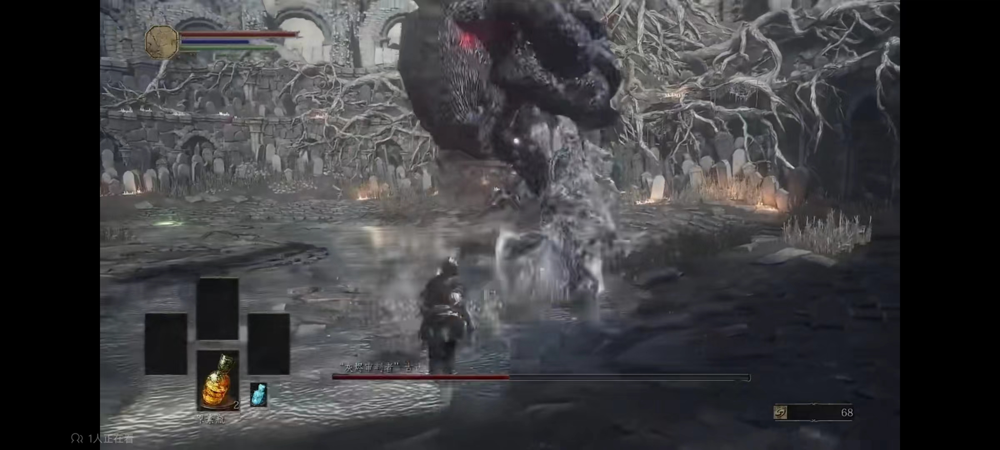
魂里面是左上角三条，血、精、蓝，在我们的例子中似乎蓝不太需要；同样装备栏和法术栏（左下角）我们也并不很需要。右下角的魂量显示，也不需要。在大约平行于人物脚底板的居中位置是boss的血量，这种设计是有内在哲学的。我们的血条较之boss的远更短，这样有一种以弱胜强的暗示；每一刀砍在怪身上，因为血条的总长更长、显示更夸张，扣除的量也显得很大，因此打击有了更大的正反馈。

我们的血条上限受到人物属性的影响(生命力/体力)，受击时应当由动画机控制脚本（等等，由谁？）通过事件来通知我们扣血。
我认识到，我作为一个人物，其实和敌人Enemy是一个比较对称的存在。两个对象身上应该有着非常相似的数据和行为，我们都应该有生命值、精力值以及并不显示在UI中的"韧性"。有同样的状态机非常相似甚至完全一样的状态机。

这里引出了一个问题。我能通过编写script规定了一个类，且这个script会附加在某个gameobject上。我能不能以这种方式**定义一个我自己规定的gameobject**？我要想让敌人和我在对象层面相近，难道必须通过复制脚本(我身上有的脚本，一一复制到敌人身上)这种让我觉得很丑陋的方式才能实现吗？

还是回到UI，这三个条（我的血条，精力条以及boss的血条）还是比较容易实现的。
注意，UI Image只能添加sprite也就是精灵纹理。

**V0.2-UPDATE1**:(非编码更改)现在加上了一个非常涉嫌抄袭的血条、精力条和boss血量显示。
想给BOSS加上一个名称显示："灰烬审判者 古达" 结果发现Unity内置的系统对于显示中文支持是很差的。
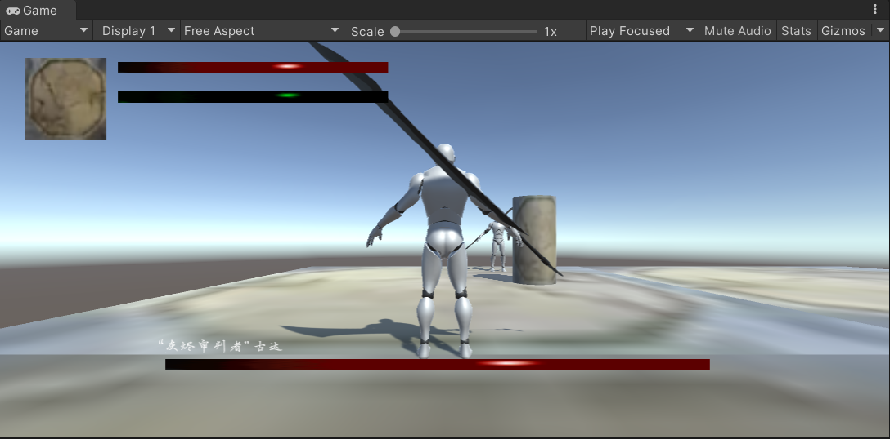
不过最终还是解决了，这样搓出了一个基本的UI。

下面的问题是设计UI的行为。

### 大量的探讨
挨打会掉血；翻滚和斩击都会扣精力，而只要没有进行翻滚和斩击，时刻都会回复精力。挨打会不会阻止精力回复？我特意开了法环检查了一下：
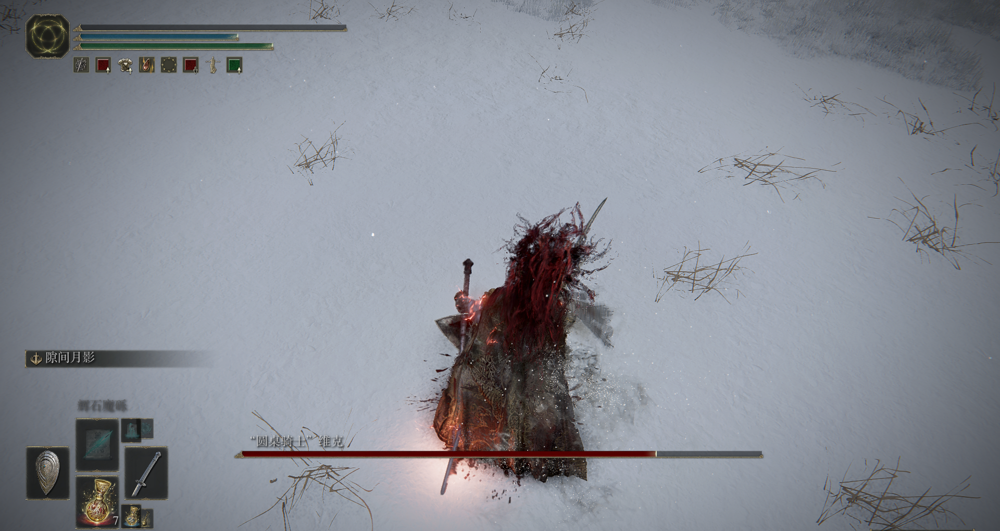
不会阻断。挨打不会阻断精力恢复，在挨打的硬直下耐力依然在迅速恢复(甚至我开始放死亡动画的过程中还在回复精力)
挨打掉血，这个过程到底是怎么样的？原谅我在这样一个编码和设计的早期就不得不引入一些看起来非常硬核和后期的概念来让这份文档的阅读者徒增烦恼。

虽然我们的demo并不是严格意义上的格斗游戏，且魂本身也并不是格斗游戏(没错，魂的格斗依然不是传统格斗，鬼泣才更符合)，但我依然强烈建议看一看这篇文章：
[DetectiveKING 知乎 格斗游戏通用机制与术语详解](https://zhuanlan.zhihu.com/p/503543754?utm_id=0) 以此帮助我们在进一步探讨这个需求建立一些共同话语的基础。当然，不得不说格斗游戏在帧的应用上要比我们的demo深太多了，我们只要了解这篇文章中对于帧、硬直和招式过程的介绍即可。

玩家要打怪了，在我们的游戏里，首先Input收到按键并分析玩家作出的指令，决定要出哪一招。决定好后，玩家要开始攻击了：动画机开始向某个代表攻击招式的状态进行转移，我们看到人物把刀提了起来/拳头挥了起来——这个过程一般称为**发动**。发动并不必然意味着攻击奏效。首先我要问，发动可以被什么样的事件所打断？

我抬起刀，而对面的一刀已经砍到我了，这样一来我的发动就会被受击所打断。另一种情况是我抬起刀，而我发现此时如果继续挥刀，我的这一击比对面来的更慢，最终我会被打到从而失败——这个时候就是一个游戏设计的抉择（黑魂使用指令队列，默认再挥刀的时候人物的硬直不能被翻滚或闪避取消；而英雄联盟虽然不是格斗游戏但由于遵循出招三步走我们也拿来做例子探讨一下，它允许取消玩家通过移动来打断自己的平A的发动，被称为抬手取消，与此同时也有一个名为取消后摇的技巧）。魂——历代魂包括法环——是不允许玩家自己取消自己的发动的。

那么我们究竟是否应该允许通过翻滚取消自己的出招呢？我认为应当允许，这也正如我们在之前的记录中论证的。

发动之后，在格斗概念中的第二阶段叫做维持阶段，而我这里想称之为判定阶段。判定阶段，在人物的刀的附近建立一个判定volume。如果在范围中有敌人的collider与volume碰撞并且这个敌人并不处于无敌状态(后面我们要加入的翻滚无敌帧)，那么发生了受击事件。同时我还认为，应当加入碰撞发生且恰好敌人正处于无敌状态的情况的判定，这种时候我们一般认为是一个“漂亮的闪避”，在一些游戏的战斗系统比如塞尔达中会给予非常针对性的奖励(林克时间)

我们总是在认为战斗中出招完全取决于时间——更快进入判定帧的人就是这次对抗的胜者，他将打断对方、扣除对面的生命值，并以微弱的优势进入接下来的战斗。但是在3D游戏当中又有一个问题：如果我已经进入了判定阶段，我还会被打到吗？

当然会，尤其是在魂当中，大多数的攻击检定其实可能都会空掉——我进入了判定，但没有砍到人。这也就意味着出招的整个三个阶段都可以被受击打断。只有发动和收招阶段允许dodge。除了受击和翻滚，没有别的事情应该阻塞出招的进度了，比如移动指令。我们没道理要求玩家先松开紧紧按着的左摇杆/WASD，然后再去搓一个招式(但用位移来决定最终释放的招，即用WASD辅助搓招，是合理的)

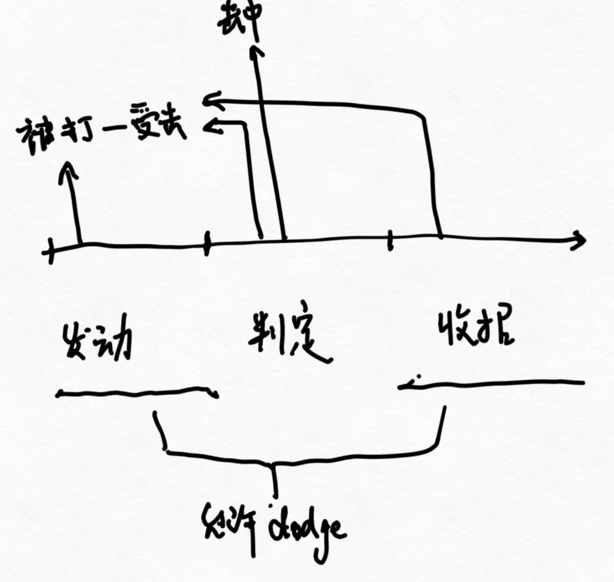

更需要探讨的是一个软件架构的问题。我们用什么样的结构去编写后面的内容呢。

掌管战斗的逻辑类，其脚本应该绑定在人物上，还是动画机上——人物上
其在敌人和我身上有无迁移性——完全一样，但我们可以通过复制制作好的玩家来获得一个enemy——其上运行的脚本会一一重新实例化到新的拷贝人物上。

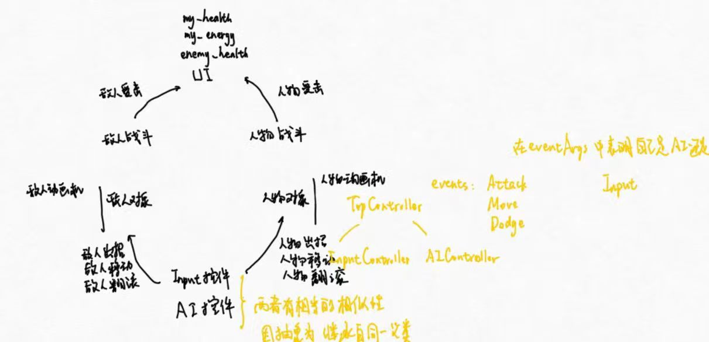
生命值、精力值、韧性值等信息，应该存放在什么位置？
生命值主要关系到UI更新；精力值不仅关系UI更新，还收到行为的影响。
目前，动作事件Attack和Dodge是由InputTest掌管的，也就是说管理精力的类应当监听InputTest.attackEventHandler,InputTest.dodgeEventHandler,
同时精力还要与UI维持同步——每一帧无论事件，都要更新精力
最应当避免的就是每一帧都让管理精力的类与需要精力值的UI组件通讯，这意味着每一帧都多执行一个事件。那么上述这些数据全都保存在UI里，我定义了类CanvasModifier绑定在Canvas上用于完成这件事。

这里讲一下一个非常重要的技巧。我们之前对于UI的尝试止步于用一个Botton改变一个血条的长度，而现在在一个外部脚本中视图用脚本逻辑控制血条的长度，如何获取这个实际为Image的血条的引用就是一个难点了。感谢这篇文章(中文互联网查具体小问题的解决蛮难的) [tx课堂 零基础入门 11： 通过脚本设置UGUI Image 韩东吉](https://cloud.tencent.com/developer/article/1356097)
首先，一般自动generated的脚本是识别不了Image的。Image定义在UnityEngine.UI下，你可以直接用UnityEngine.UI.Image代替Image。
在脚本里面定义好Image，然后在Inspector里看到暴露出的这个Image:

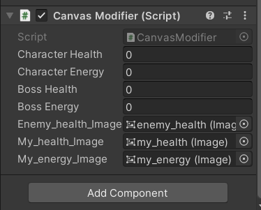
把所使用的血条(实为Image)拖进去。这个过程叫通过Inspector拿引用。

### p1 CanvasModifier初步实现-自动回复的精力条
```
//CanvasModifier
public class CanvasModifier : MonoBehaviour
{
    //这个语境下的gameObject总是指canvas
    public double characterHealth;
    public double characterEnergy;
    public double bossHealth;
    public double bossEnergy;
    public Image enemy_health_Image;
    public Image my_health_Image;
    public Image my_energy_Image;
    public RectTransform enemy_health_Image_rt;
    public RectTransform my_health_Image_rt;
    public RectTransform my_energy_Image_rt;
    readonly double characterEnergyMax = 100.0;
    // Start is called before the first frame update
    void Start()
    {
        characterEnergy = 10.0;
        enemy_health_Image_rt = enemy_health_Image.rectTransform;
        my_health_Image_rt = my_health_Image.rectTransform;
        my_energy_Image_rt = my_energy_Image.rectTransform;

    }
    // Update is called once per frame
    void Update()
    {
        //更新Energy可是有条件的，这部分后面再加
        updateEnergy();
        updateEnergySlot(this.characterEnergy, this.my_energy_Image_rt);
        //每一帧，都必须更新精力条的情况   
    }
    void updateEnergy()
    {
        if (characterEnergy < characterEnergyMax) characterEnergy += 0.2f;
    }
    void updateEnergySlot(double energyVal,RectTransform slotRT)
    {
        var widthPercent = energyVal / this.characterEnergyMax;
        slotRT.localScale = new Vector3((float)widthPercent, 1.0f, 1.0f);
    }
}
```

### p2 翻滚初步
翻滚在Animator当中将会是一个SubStateMachine，且应当用StateModifier从顶层控制，一旦按下空格键打断跑动状态机的任何一个举动，直接转移到Dodge子状态。
同时，Dodge要通过事件通知一系列的伙伴：通知精力条扣除精力并在翻滚进行过程中维持不增长精力；在翻滚进行中的某一段帧时间把自己设置成无敌的。目前Dodge事件是InputTest类持有的，也就是说，至少CanvasModifier要写`InputTest.DodgeEventHandler+=CanvasModifier.onDodge()`，且未来还要有一系列的onDodge订阅在这个事件上。
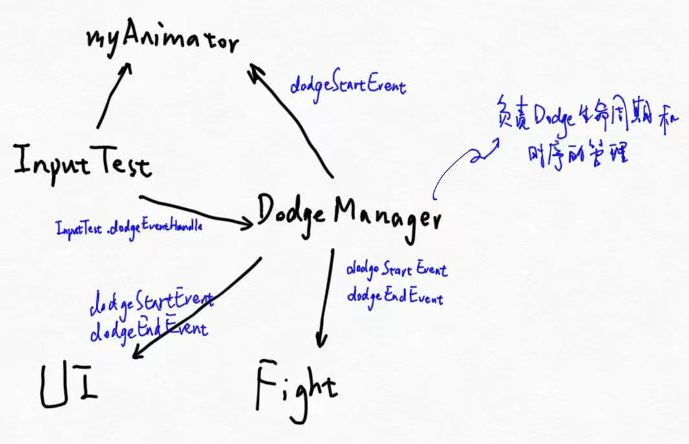
上图这个微架构是和朋友交流后得出的，彼时我刚刚读完《游戏编程模式》第六章关于单例模式的介绍，其中对于一种保姆模式——即兴建各种类的Manager类以管理这个类的所有对象，是为一种变体的单例模式——大加批判，认为违犯了OOP的设计初衷。我深以为然，而朋友却反问我，你为什么觉得OOP是一个不可违逆的第一准则呢？严格遵守OOP能够给你带来怎么样的好处呢？

这种设计几乎没有什么模式可言，但是其把我从一整天大约六七个小时的设计困境中拯救出来——我不断思考是否有一种模式可以指引我、告知我Dodge的逻辑究竟是放在什么地方合适。

InputTest.DodgeEventHandler的触发时机仅仅依据Input按键。也就是说，我迅速连续按两次空格，就会触发两次dodgeevent。但是事实上游戏中在翻滚中不应该允许翻滚。那么，dodgeManager接受到dodgeEvent后，要判断一下究竟能不能dodge。
```
public class DodgeManager : MonoBehaviour
{
    // Start is called before the first frame update
    bool isDodging;
    int dodgeStartFrameCount;
    public static event System.EventHandler dodgeStartEvent;
    public static event System.EventHandler dodgeEndEvent;
    void Start()
    {
        InputTest.dodgeEventHandler += onDetectedDodge;
        dodgeStartEvent += onDodgeStart;
        dodgeEndEvent += onDodgeEnd;
        isDodging = false;
        dodgeStartFrameCount = Time.frameCount;
    }
    void Update()
    {
        var currentFrameCount = Time.frameCount;
        if (isDodging &&  currentFrameCount - dodgeStartFrameCount > 80)
        {
            dodgeEndEvent?.Invoke(this, null);
        }
    }
    void onDetectedDodge(object sender,DodgeEventArgs args) 
    {
        var chaEnergy = CanvasModifier.characterEnergy;
        if (!isDodging && chaEnergy >= 10.0)
        {
            //除了正在翻滚会阻止翻滚，精力不足也会;后面的受击也会
            dodgeStartEvent?.Invoke(this, null);
        }
    }
    void onDodgeStart(object sender,object args = null)
    {
        isDodging = true;
        dodgeStartFrameCount = Time.frameCount;
        Debug.Log("Dodge Start");
    }
    void onDodgeEnd(object sender,object args = null)
    {
        isDodging = false;
        Debug.Log("Dodge End");
    }
}
```

至此，翻滚的触发逻辑做好了，现在按下翻滚键，InputTest触发DodgeEvent，告知dodgeManager来处理这个事件。并不是按下Space就一定会触发翻滚，但如果触发了翻滚，dodgeManager将会告知：
a) UI 更新精力和精力条(根据之前的设计现在人物数据都存在UI模块中)
b) 战斗数据更新，人物很快将会进入无敌
c) 动画机播放翻滚的动画（按之前的说法是通过ani.play跳入翻滚状态的浮岛）

### p3 翻滚的UI事件
不是，我发现一个问题，`CanvasModifier.onDodgeEnter`到底要干嘛啊？现在CanvasModifier.Update()对于精力值和精力条的更新已经通过查询DodgeManager的静态isDodging来完成了。

要扣精力啊笨蛋。

经过对静态量的微调，加上这一个`CanvasModifier.onDodgeEnter`逻辑，现在可以做到正确的翻滚下的精力改变了

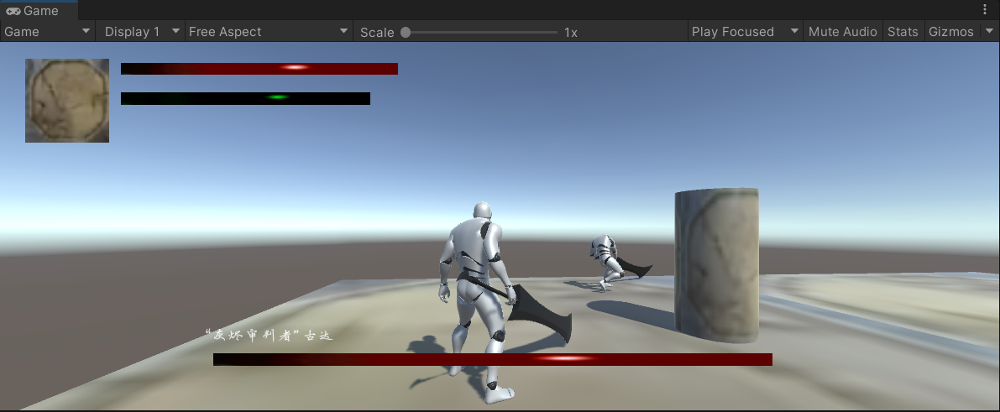

### p4 翻滚的战斗数据更新
现在的翻滚时序是这样的：
一个翻滚的帧数长度是固定的，在边写边调试的当下，我设置的量是80帧，如果DodgeManager发现当前帧数与开始翻滚帧数差值大于80，就会立刻引发DodgeEndEvent。

在我们的游戏demo中，帧数一般在160帧到220帧之间， 80帧大约是400毫秒左右，而我们常说的格斗中的翻滚的无敌帧大概只有2-3个动画帧(24fps),这意味着在我们的帧概念下，无敌帧大约占据20个实际帧。

有两个问题：
1. 如何规范这个30-20-30的数帧过程
2. 定义的20个实际帧随游戏性能波动而忽短忽长，这是不是一个严重的问题

学习了一下一个法环的解包分析视频[bilibili 【艾尔登法环】全无敌帧动作详解](https://www.bilibili.com/video/av767851298/?vd_source=be2d1feef9acea76535db5dd5a391e1a)，环里面有几点值得参考的做法
1. 帧数是锁定的，一般是PS平台30帧、PC平台视情况在30帧和60帧中间调整
2. 无敌帧这个概念是和动画同步的,也就是说无敌的每一个帧都与动画的每一帧一一对应
3. 以法环的轻负重滚为例，翻滚动画有22帧，当中的无敌是头帧-13帧

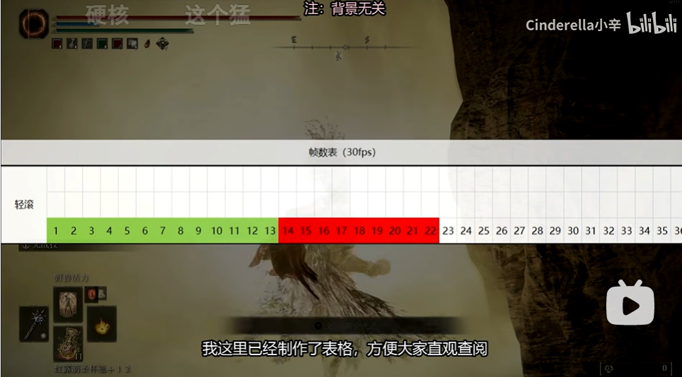

这部分等我们做完动画部分，在后续版本再加吧。

### P5 翻滚下的动画机
我稍微想了一下，感觉没啥必要把四个翻滚动画丢到子状态机里去，因为我们并没有八个翻滚动画——只有四个。我们在确认要发生dodge的时候

发现一个bug。在现在的代码下，如果连着狂按空格，人只翻滚了一次，但是精力扣了好几次。现在的精力是由CanvasModifer.onDodgeEnter负责扣除的。既然会连续扣，说明DodgeManager.dodgeStartEvent这个事件被连续触发。

这是因为，现在的翻滚时序是用`currentFrameCount - dodgeStartFrameCount > 80` 来控制的，也就是一次翻滚的结束使用一个80帧控制而非动画机控制。

那么我们这样改：给每一个翻滚加一个翻滚结束的动画事件。

Unity对于动画事件的支持是比较到位的，并不需要我们自己去写很多代码。选中我们的动画机-点击对应状态.
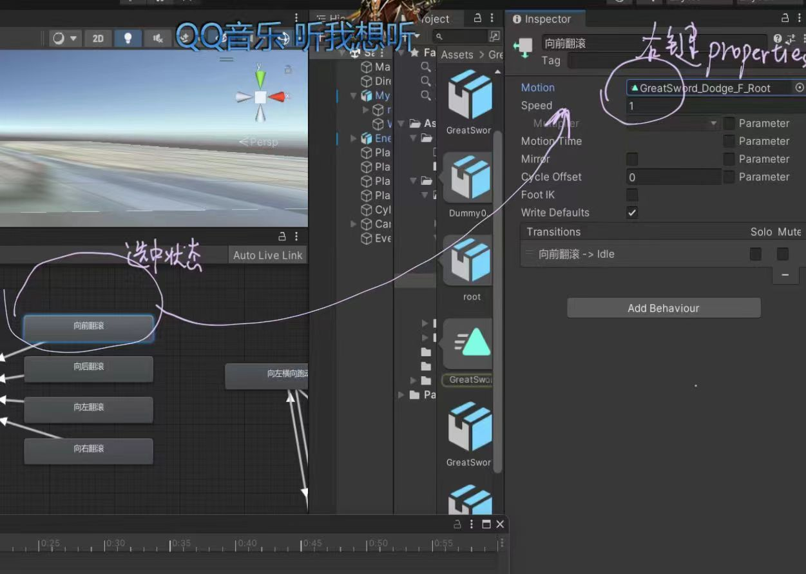
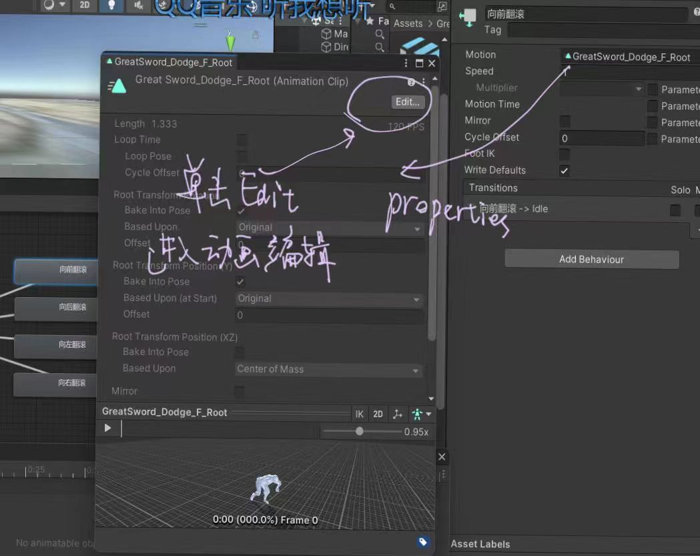
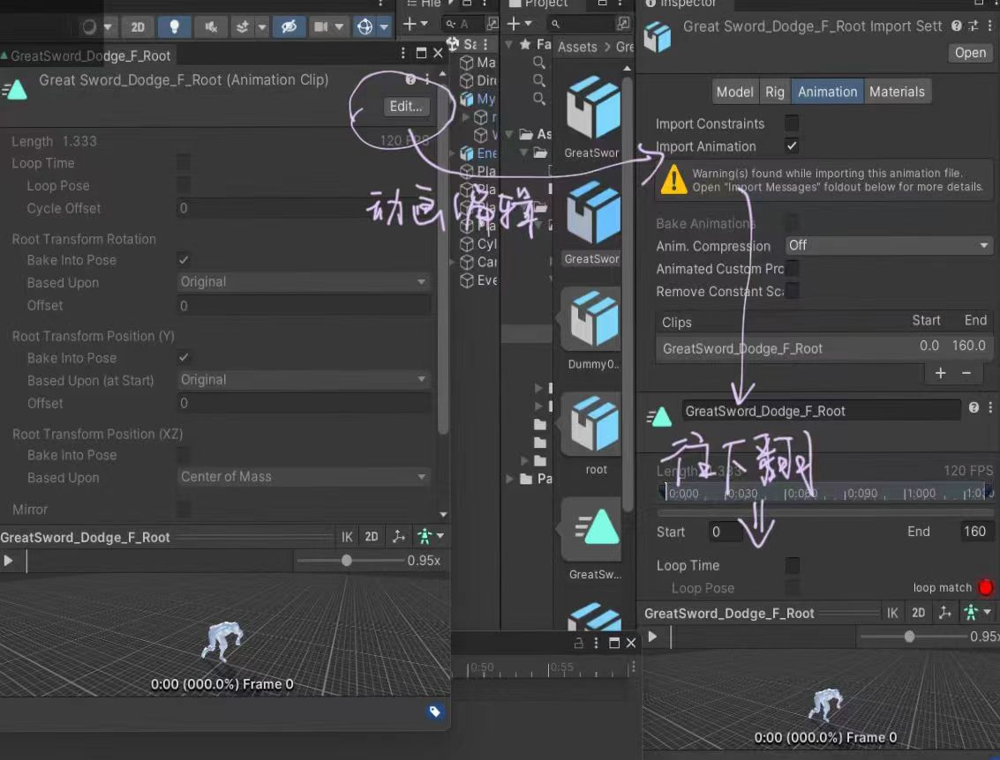
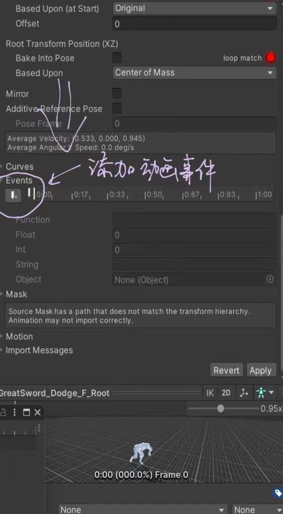

动画事件里面的Function用于填写消息处理函数名；Float,int,string和object都是unity所允许的消息处理函数的参数。可以理解为，在这里填写了几个值，一旦运行到这一帧，unity在animator所绑定的游戏对象上查找所有类是否有Function给出的函数名；一旦查到，以下面的几个值为参数触发那个函数。这里可以看出对于动画事件的限制还是比较严格的。
[使用动画事件（Event）在动画的特定时间执行指定方法](https://www.bilibili.com/video/av642210167/?vd_source=be2d1feef9acea76535db5dd5a391e1a)

注意，我这里还碰到了一个网上没查到有人说过的问题。一般来说，就算我们的脚本名称和脚本中类的名字不同也无所谓；就算一个脚本中有多个public class也无所谓(这是C#宣扬的一个灵活性)，但如果要配合动画事件，若你在Animator同级位置绑定了一个脚本，最好在这个脚本名字的类中写要绑定到动画事件上的消息处理函数。我在脚本中写了第二个类并且把消息处理函数写在那个类当中，就无法识别这个消息处理函数了。我猜测可能是因为UNity实现这部分通过遍历物体上的每个组件，而一个脚本只被当成一个组件。

```
//StateModifier.cs , attached to Myself
    //配合unity动画事件的消息处理函数，
    //和c#事件处理函数不一样，应该是无参数或者是持有四类参数，
    //也不会出现eventArgs类参数
    public void OnUnhurtableStartEvent()
    {
        Debug.Log("无敌开始");
    }
    public void OnUnhurtableEndEvent()
    {
        Debug.Log("无敌结束");
    }
```
我把无敌范围设置在第一帧到中间约50%位置：
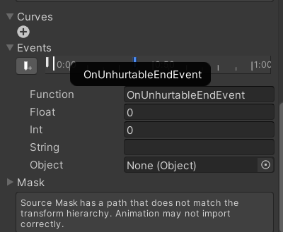
把这样的事件加到全部四种翻滚动画上。现在还没有编写有意义的无敌帧逻辑，不过动画事件已经玩明白了。
同时不要忘记，我们原本打算通过动画事件来debug精力条的异常。本来我们的精力条控制逻辑是：
```
//DodgeManager.cs
void Update()
    {
        var currentFrameCount = Time.frameCount;
        if (isDodging && currentFrameCount - dodgeStartFrameCount > 80)dodgeEndEvent?.Invoke(this, null);
    }
```
现在应该让动画机通过动画事件来告知DodgeManager。幸运的是，DodgeManager也绑定在Myself上，也和动画机平级。我们可以直接在DodgeMananger当中写终止dodge的语句，然后绑定到动画事件上。

```
public class DodgeManager : MonoBehaviour
{
    // Start is called before the first frame update
    public static bool isDodging;
    public static event System.EventHandler dodgeStartEvent;
    public static event System.EventHandler dodgeEndEvent;
    void Start()
    {
        InputTest.dodgeEventHandler += OnDetectedDodge;
        dodgeStartEvent += OnDodgeStart;
        isDodging = false;
    }
    void Update()
    {
    }
    void OnDetectedDodge(object sender,DodgeEventArgs args) 
    {
        var chaEnergy = CanvasModifier.characterEnergy;
        if (!isDodging && chaEnergy >= 10.0)
        {
            //除了正在翻滚会阻止翻滚，精力不足也会;后面的受击也会
            dodgeStartEvent?.Invoke(this, null);
        }
    }
    void OnDodgeStart(object sender,object args = null)
    {
        isDodging = true;
        Debug.Log("Dodge Start");
    }
    void OnAnimatorDodgeOut()//AnimatorEvent handling function
    {
        Debug.Log("OnAnimatorDodgeOut!");
        dodgeEndEvent?.Invoke(this, null);
        isDodging = false;
    }
}
```
至此，翻滚和精力UI更新都完成了。反复调试，目前尚且没有发现明显的问题。
这次更新可以就到这里啦。注意，当初说的战斗数据更新，这部分还没做。我并没有想清楚Fight当中保存一个isUnhurtable，然后许多其它类来查询这个量是不是一种可行的设计方案，所以现在翻滚中的进入无敌和退出无敌虽然都做好了动画事件，但还没有写入有意义的内容。

## V0.4更新日志
### V0.4需求设计
现在我们已经有了翻滚，甚至为无敌帧设计好了动画事件的框架。后面的工作似乎要来到最激动人心的部分了——战斗！斩断，劈开，剁碎！
在设计动作之前，我们先来想一想。拳皇鬼泣街头霸王等更纯种的格斗游戏，里面有一个核心概念叫搓招。这种游戏的招式是非常多的，比如拳皇中光普通攻击就有轻拳重拳、轻脚重脚，一些比较厉害的技能既需要一个复杂的按键组合，又需要当时正处于某个特定招式的收招。
这类游戏的爽点主要来源于对于自己技能前后摇的熟悉把控，在熟练后能够把敌人一套“连”到死，这个连击是非常难达成的，仅仅知晓每个技能的按键序列是远远不够的。

反观魂类，魂三初见古达老师的时候，骑士出身的玩家有什么可以使用的技能吗？几乎只有翻滚、格挡、平砍而已。翻滚之后接平A，平A会变成戳刺，几乎是唯一和上面格斗游戏相近的地方了。
魂的连续平砍不会无限循环，这里有点像原神，一般是计数一段-二段直到五段，五段往往是一个比较帅气的终结(仅仅是看起来终结，伤害和实际上的终结技没有关系)

图中宵宫正在释放平A第四段，在空中后空翻(已经被光污染遮住力)
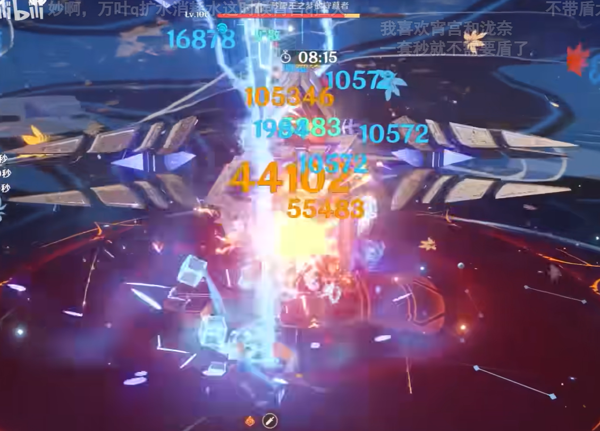

研究是不是要为普攻设计连段的一个重要原因是我们已经拿到了如此优质的一个美术资产。我没有上各种卖课的网站或者视频下面白嫖资源，而是真金白银去UAS上买了个400块的资源。这个资源包里动作做得非常全，也正是我们之前开发中一直在用的这个包。在这个包中有非常非常丰富的攻击动作。

因此我认为V0.4的需求1甚至不是任何编码。我们应该好好看一看我们的资产，把所有的攻击动作梳理一下，然后设计一些简单的招式。

### V0.4需求
1. 浏览资产内容，整理每个动作的具体含义
2. 设计几个招式
3. 把设计的招式做进子状态机，用Input加以控制

### p1 战斗资产的梳理
|Motion名称|描述|截图|
|--|--|--|
|GreatSword_Attack01|正手向左斩击|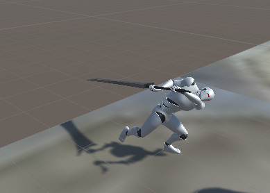|
|GreatSword_Attack02|反手向右斩击|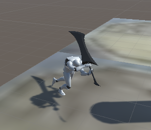|
|GreatSword_Attack03|下劈/纵贯|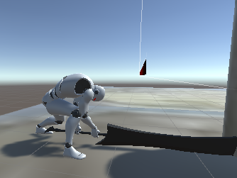|
|GreatSword_Attack10|似乎是下劈纵贯的复制，完全一样||
|GreatSword_Attack05|向左斩击后的向右反挥|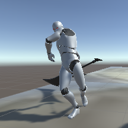|
|GreatSword_Attack08|向右斩击后的向左反挥|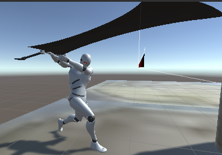|
|GreatSword_Attack03_1|下劈的变招，先回转再下劈|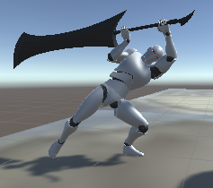|
|GreatSword_Attack04|升龙刀，由右下提刀向上挥，可由静止直接派生|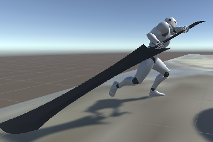|
|GreatSword_Attack11|突刺|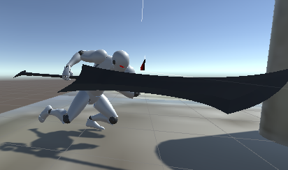|
|GreatSword_Attack12|在持刀状态下稍加蓄力，然后突刺|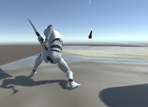|
|GreatSword_SPAttack1|斗气强化下的正手向左斩击，像Attack1|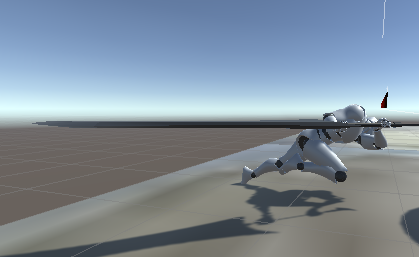|
|GreatSword_SPAttack2|斗气强化下的正手向右斩击，像Attack2|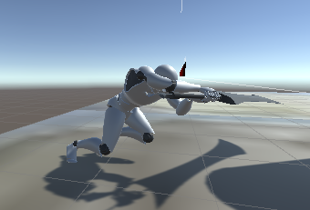|
|GreatSword_SPAttack2_1|斗气强化下的纵贯，先提刀上扬，然后重砸下劈，比较像强化的Attack03|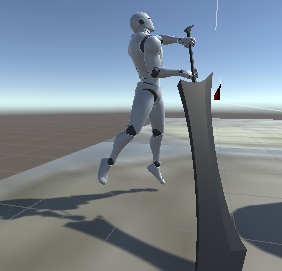|
|GreatSword_Whirlwind_Start|Whirlwind是一整套动作，包括起始、循环、结束，就是经典的大剑大风车||
|GreatSword_FocusEnergy_L_Start|左蓄力起始，蓄力也是start-loop-end结构|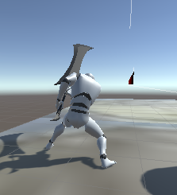|
|GreatSword_FocusEnergy_L_Attack01|左蓄力释放，类似Attack02向右斩击|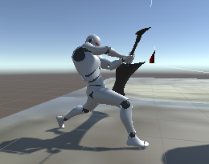|

最重要的攻击体系包括
斩击：GreatSword_Attack01
劈砍：GreatSword_Attack03等，一种常见的连段终结
反挥：GreatSword_Attack05等，一种常见的斩击后的变招
突刺：GreatSword_Attack12等，可以用于翻滚后的变招
SP斩击：GreatSword_SPAttack1，强化状态下的斩击
蓄力：GreatSword_FocusEnergy_L_Attack01，蓄力后释放的攻击

### p2 设计招式
翻滚后派生突刺似乎是一个见过的设计。在草稿动画机里简单连一下，看看翻滚后立刻派生突刺会不会有点不协调：
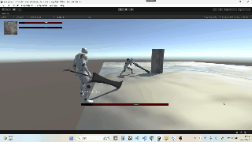
还是蛮好的，hasexitTime能够帮我们在两个动画之间自动平滑。
我们可以把利用无敌时间成功翻滚的奖励设置为，允许翻滚后变招成突刺，而平时想要释放突刺必须进行蓄力（动画GreatSword_Attack12是持刀蓄力突刺）。

```
长按左键->突刺蓄力->释放左键->突刺
左键->普通左斩->左键->普通右斩->左键->
上扬左斩GreatSword_Attack04->左键->上扬右斩GreatSword_Attack04->左键->纵贯
翻滚->躲避成功->左键->突刺
```

甚至可以加上一些令人惊喜的设计：不同的招式破防敌人有不同的效果，如果用突刺来破防，直接释展突刺斩杀：
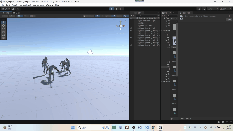
这两个突刺忍杀实在是太帅了！看到这样的美术产出，一个程序员很难按捺住自己想把它实装成游戏的冲动！

上述简单的招式还没有把所有的出招都落实，但是对于我们第一阶段已经非常足够了。

### p3 整合战斗动作进入动画机
攻击行为能中断：移动
攻击行为会被这些行为中断：翻滚或受击
如果正在攻击，反复按下攻击键也不应该响应


目前我们判断能不能翻滚的逻辑在DodgeManager类当中，其运用一个isDodging的量管理是否在翻滚，实现了允许移动向翻滚转移，而翻滚中不会向移动转移(翻滚不向移动转移并不是编码控制造成的，而是由于进入翻滚立刻进入了翻滚的动画状态，在翻滚自动转回到移动状态机之前移动状态机内部的转移自然无法受理)

现在要加入攻击部分，首先要判断的就是移动、翻滚、攻击之间的转移关系。我们自然也可以用攻击子状态集和翻滚子状态机一样的方式防止在攻击/翻滚时向移动转移。需要考虑的是翻滚和攻击之间的问题。翻滚的时候不允许攻击，但是攻击的时候允许翻滚。这是一种不对称的转移关系。

我初步打算这样搞，在InputTest上再加上一个左右键的test，InputTest get到左键按下的攻击指令的时候向攻击控制组件发出RequistingAttackEvent事件，由攻击控制组件(初步打算名字设计成AttackManager)来决定能不能攻击。目前的版本下，能够组织攻击发生的，主要只有两种潜在的理由：已经在攻击了(不能自己打断自己),或者还没有结束翻滚。

但是这样有一个问题，AttackManager并不知道自己是不是isDodging（这个量），目前的办法是AttackManager通过查询静态变量`DodgeManager.isDodging`来感知。这貌似也不构成问题。

我再问一个问题：`DodgeManager.isDodging`和事实上的动画机是否在翻滚是绝对同步的吗？isDodging初始和大部分情况下被设置为false，改写为true始于事件`InputTest.dodgeEventHandler`激发，执行的`DodgeManager.OnDetectedDodge`；终止于Animator执行翻滚动画的最后一帧触发动画事件，动画事件绑定的消息处理函数是`DodgeManager.OnAnimatorDodgeOut`，这当中改写了isDodging = false。在帧数层面，确实isDodging和翻滚是否正在进行是绝对同步的(仅限目前的情况)

```
//InputTest.cs

void Update()
    {

        updateAllKeyState();
        //...
        if (Input.GetKeyDown(KeyCode.Mouse0))
        {
            attackRequestEventHandler?.Invoke(this, new AttackEventArgs(AttackInstruction.LEFT));
        }
        ani.SetInteger("Code", calculatedCode);
    }
```
这里检测到左键按下，发起一个请求攻击的指令给AttackManager

```
//AttackManager.cs
void OnAttackRequiest(object sender, AttackEventArgs args)
    {
        switch (args.attackInstruction)
        {
            case AttackInstruction.SHIFT_LEFT:break;
            case AttackInstruction.RIGHT: break;
            case AttackInstruction.LEFT:
                AttackEnsuredToPlayEvent?.Invoke(this, new AttackEventArgs(args.attackInstruction, "普通左斩"));
                break;
            default:break;
        }
    }
```

AttackManager这里简单地做一个转发，直接通知StateModier进行动画的播放

```
void OnAttackEnsuredToPlay(object sender,AttackEventArgs args)
    {
        ani.Play(args.attackStateToPlay);
    }
```

这样一写，现在我们的人物就可以在场景中攻击啦！

但是显然这造成一堆问题，被我所感知到的就有这样一些：
1. 现在还没有编写检查是否dodging的代码，如果在翻滚中用攻击打断dodge，就会发成灾难：因为没有翻滚结束的动画事件发生，isDodging永远是true，我们也无法再翻滚了
2. 好消息是攻击没有中断攻击。因为Ani.Play如果接受到一个正在播放的动画，是不会自己打断自己的。

先把dodging检测加上吧。
```
void OnAttackRequiest(object sender, AttackEventArgs args)
    {
        if (DodgeManager.isDodging) return;
        switch (args.attackInstruction)
        {
            case AttackInstruction.SHIFT_LEFT:break;
            case AttackInstruction.RIGHT: break;
            case AttackInstruction.LEFT:
                AttackEnsuredToPlayEvent?.Invoke(this, new AttackEventArgs(args.attackInstruction, "普通左斩"));
                Debug.Log("AttackEnsuredToPlayEvent Invoked");
                break;
            default:break;
        }
    }
```

现在，我们可能要碰到一个稍微有些棘手的问题了。我们该如何做连招这个事儿呢。

按我们的感觉，在战斗时候只要我在按下一次左键进行第一式的动作，在整个动作期间的任何时候我按下左键，都可以指令人物在第一刀砍完之后转向第二刀。但是这个事情如果不借助新的结构似乎是很难做的。我们的Mouse0Pressed这个状态非常不讨巧，以帧的时间观看，人的一次按键是非常长的——纵使我们已经刻意轻轻点一下鼠标，可能点出来的效果也是若干帧的Mouse0Pressed。这会造成困难：如果我们设定当第一刀状态(我命名为普通左斩)的转移条件里写道Mouse0Pressed = true,那就变成了我们必须在第一刀结束的那个瞬间按下鼠标，才能打出第二刀。那如果我们改成一旦接受到Mouse0Pressed就向第二刀转移（可以通过外部脚本ani.Play或者设置hasExitTime为false），那么第一刀就会在第一次点击的第二帧就转移，从而视觉上根本没有砍出第一刀。

为了解决这个问题，我们需要学习其他游戏中这个并不冷僻的概念：指令队列。
指令队列的概念很简单，如果我们允许玩家快速按下多个键，并让游戏在之后的时间里逐个依次序执行玩家给出的若干指令，就可以设置一个指令队列。但是有时候我们又不希望指令队列是无限长的：当玩家因为害怕被打中慌忙按了七八下空格，他的意思并不是自己希望连续翻滚八下。

我们这里可以设置一个长度为1的指令队列——也许由于其长度是1，叫他暂存区会更合适一些。当玩家在砍第一刀的途中，如果再按下左键，我们就把这次按键存下来，在第一刀结束的时候执行。

对于AttackManager，其能够感知的第二次按键是通过又一次`attackRequestEventHandler`的激发实现的。

这一版调了将近三个小时，也没有一条一条记录debug的过程。现在基本的功能已经实现了，但是还是发现了问题。先上代码


```
//AttackManager.cs
public class AttackManager : MonoBehaviour
{
    public static event System.EventHandler<AttackEventArgs> AttackEnsuredToPlayEvent;
    bool AttackRequistProcessing = false;
    AttackEventArgs storedRequest;
    void Start()
    {
        storedRequest = null;
        InputTest.attackRequestEventHandler += OnAttackRequest;
    }
    void OnAttackRequest(object sender, AttackEventArgs args)
    {
        Debug.Log("Request caught, attackRequistProcessing = "+(AttackRequistProcessing ? "true" : "false"));
        if (DodgeManager.isDodging) return;
        if (AttackRequistProcessing)
        {
            //如果没有被储存的storeRequest，把当前参数写入；如果有，那就覆盖，概括起来就是直接赋值
            //storedRequest = args; //直接存储args是不行的，因为InputTest发来的请求参数里面是没有attackStateToPlay的
            storedRequest = args;
            //既然存储了就不要继续执行这个指令了
            return;
        }
        doInstruction(args.attackInstruction);
    }
    public void OnAttackStateExit()
    {
        Debug.Log("OnAttackStateExit INVOKED");
        
        if (storedRequest!=null)
        {
            doInstruction(storedRequest.attackInstruction);
            storedRequest = null;
        }
        else
        {
            AttackRequistProcessing = false;
        }
    }
    void doInstruction(AttackInstruction ains)
    {
        AttackRequistProcessing = true;
        Debug.Log("Doing Instruction");
        switch (ains)
        {
            case AttackInstruction.SHIFT_LEFT: break;
            case AttackInstruction.RIGHT: break;
            case AttackInstruction.LEFT:
                AttackEnsuredToPlayEvent?.Invoke(this, new AttackEventArgs(ains));
                break;
            default: break;
        }
    }
}
```
AttackManager负责转发输入。在InputTest激发：`attackRequestEventHandler?.Invoke(...);`的时候，AttackManager截获，用`AttackManager.OnAttackRequest`处理。在这个过程中，如果发觉`AttackRequistProcessing`，即已经有攻击在处理，就把当前的操作存储到`AttackManager.storedRequest`当中。如果没有正在处理的攻击，就通过`AttackManager.doInstruction`唤起`AttackManager.AttackEnsuredToPlayEvent`来要求StateModifier执行动画。

在攻击动作结束时，动画事件触发`AttackManager.OnAttackStateExit`。这个时候，若存储空，设置`AttackRequistProcessing = false`,开放新的动作的监听。
```
//StateModifier.cs
public class StateModifier : MonoBehaviour
{
    public Animator ani;

    //...
    OnAttackEnsuredToPlay(object sender, AttackEventArgs args)
    {
        string toGo = args.attackStateToPlay ?? decideStateToGo(args.attackInstruction);
        Debug.Log("toGo = " + toGo);
        ani.Play(toGo);
    }
    private string decideStateToGo(AttackInstruction ainstruct)
    {
        var aniStateInfo = ani.GetCurrentAnimatorStateInfo(0);
        if (aniStateInfo.IsName("Base.普通左斩"))
        {
            Debug.Log("isName 普通左斩");
            if (ainstruct == AttackInstruction.LEFT)
            {
                Debug.Log("calculated as 普通右斩");
                return "普通右斩";
            }
        }
        //静止态转向普通左斩
        Debug.Log("calculated as 普通左斩");
        return "普通左斩";
    }
}
```

这套程序简直太棒了，一个动作游戏的轮廓已经呼之欲出了——但是刚才的代码里还是有bug。我注意到，如果用翻滚去打断攻击，就会让人物之后再也无法攻击。这是很好理解的，我们的`AttackRequistProcessing`的还原仰仗攻击动画结束的动画事件，但如果没有触发这个时间，`AttackRequistProcessing`一直都是true，从而再也不会受理任何别的指令。

我想到的办法是，可以在dodge的时候加一些判断，如果攻击正在执行，那就帮AttackManager去重置一下
```
//DodgeManager.cs
void OnDodgeStart(object sender,object args = null)
    {
        isDodging = true;
        //翻滚如果打断了攻击，应当替AttackManager矫正是否有Attack正在处理的状态量
        AttackManager.AttackRequistProcessing = false;
        Debug.Log("Dodge Start");
    }
```

现在好了。我们成功把最简单的战斗加入了游戏，并且目前没有发现什么bug。泰裤辣。

## V0.5更新日志
### V0.5需求设计
下面又是一个略有技术攻坚意味的技术点。我们要让攻击这个动作具有意义——能够对对方施加伤害，从而让这场无尽的格斗有终止的一天。

攻击除了播放动画，更重要的就是随之而来的下一个问题：判定。判定打没打到人，如果打到了then对他扣血并施加硬直。

在调研之前，我自己想到有两个模糊的方向可以帮助做这个判定工作：
1. 借助collider。Unity已经设计好碰撞体这个概念来解决碰撞相关的一切问题，那么为什么不用呢。
2. (如果最终调研发现碰撞体并不非常适合这个需求)可以通过代码控制的实例化在程序规定的位置，比如人物面前特定距离 创建一个扇形柱之类的几何体，用数学计算这个几何体和敌人有没有相交

下面还是做一做技术预研——看看“友商”是怎么做的吧。插句话，在看了一些行业大佬的分享后，我发现在工业生产当中特别重要但初学者几乎无法意识到其重要性的一个过程——技术预研——实在是太重要、太重要了。作为一个求职者去准备自己的面试项目时，总是容易趋于两级，要么就是过于依附于某一教程、某一课程的给定项目以致于脱离了独立实践，要么就是执着于原创而不肯借鉴任何网上的实践最后导致项目变成“自己瞎琢磨的”。

ok，首先有一个[反思贴](https://blog.sina.com.cn/s/blog_176f979560102x2lh.html)指出，常规的Unity动作游戏用碰撞事件来处理攻击判定，这和我的想法1是吻合的。但是这样造成一个问题：没办法让一次攻击和多个物体碰撞。我们设计碰撞体，就是为了防止“穿模”的发生，所以我们的需求其实是又当又立——又要求碰撞体阻挡，又要求碰撞体阻挡之后放行。不过还没继续调研，不好说究竟能不能做这件事儿。这篇帖子对于攻击群体的解决方案是遍历怪物对象池，一一计算到人物的连线，看怪物是不是在人物攻击的扇形内。

我们的确只有一个怪物/Boss，为了尝试再现类魂boss战的宏大感我也暂时不打算添加宫崎英高的正义二打一(双狮子猿之类的狗屎)，我觉得主角以一对多很容易让战斗变得像割草，这和战斗体验是轻微矛盾的(想一想无双游戏吧)。但是架构的目的一直就是为了尽可能多考虑未来拓展的可能性，而不是问起：*“你的游戏打算如何处理多个怪物？”* 就摆开手：*“当初没想做，现在做不了，只能全重构”*

这篇关于自己[动作游戏demo的系列 cycler_725 Unity-动作系统-案例学习](https://blog.csdn.net/cycler_725/article/details/119485577?spm=1001.2014.3001.5501)写的也很棒。我看了一下这篇文章，对于攻击判定的实现基本可以概括为：
1. 武器跟随人物运动(这里我们的资产已经做好)
2. 找到武器对象，对武器对象编写一个控制脚本，他这里的命名叫`MeeleWeapon`
3. 在此脚本内定义结构攻击判定体，每个攻击判定体是一个相对剑身固定的球体，他在自己的武器剑身上绑定了三个这样的球体
4. 为攻击动画中的特定区间施加判定开始事件和判定结束事件
5. 在事件对应的消息处理函数中实现碰撞检测，主要依靠Physics中的`SphereCastNotAlloc`

Physics.SphereCaseNotAlloc函数我在api中没有查到，但是查到了`Physics.CapsuleCastNonAlloc` [Unity脚本api——Physics.CapsuleCastNonAlloc](https://docs.unity.cn/cn/current/ScriptReference/Physics.CapsuleCastNonAlloc.html)
Unitydoc中介绍，`Physics.CapsuleCastNonAlloc`是`Physics.CapsuleCastAll`不产生垃圾的升级，`Physics.CapsuleCastAll`又是`Physics.CapsuleCast`返回值的修正。
同时，Capsule以胶囊体进行扫描，但是更原本的扫描是`Physics.SphereCast`.

这一系列的方法都是想做一件事儿：给出一个射线，让球或者胶囊体沿着射线“发射”，判断这个射出的过程中会不会与对象相交。这是一种比碰撞更宽松的检测。如果发生了碰撞，不仅可以通过bool返回值返回“确实发生了”信息，当中的`Physics.CapsuleCastAll`还可以返回`RaycastHit[]`类型，以RaycastHit返回具体的碰撞信息。

在我们的需求中，这个技术似乎是可以应用的。毕竟，横着砍就是横着射出刀的capsule，纵贯也就是从上而下扫描罢了。射线不总是无限的，Physics.CapsuleCastAll就提供了参数maxDistance来让射线在有限范围扫描。

这个过程虽然不错，但是可以看下图：
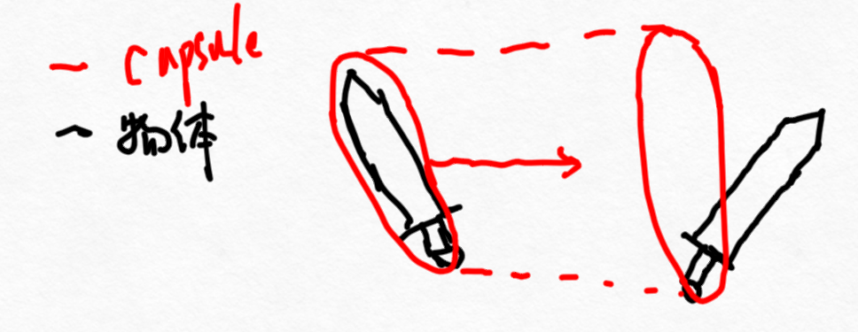
如果直接把胶囊设定在剑身上，由于扫描是一个平移过程，没有办法施加旋转。这样，如果敌人在我们剑身挥动的末端，也许会出现剑已经在视觉上打到敌人、但却没有吃到伤害的情况。

同时，这件事是略微扭曲实际上的时序需求的。一个完美的战斗体验应该是，剑砍到敌人就是砍到了，没砍到，比如我在砍敌人的时候剑碰到敌人之前的那个瞬间我通过翻滚放他一马，那么他就不会受伤。这几乎是一句废话——但是在很多实践中，从个人demo到商业游戏中都不是这样做的。简而言之——如果我们直接像上文这样做，问题就是刀砍到敌人这个过程被简化了，我们未来将没有办法加上弹刀，而且有一些情况下战斗看起来变得很怪。

文章作者给出了一种解决方案。在两个动画事件区间内，即我们认为是攻击检定的帧，每一帧都在Update中做上面的判定。每一帧的判定都让胶囊位于当时剑的位置，让射线仅仅前进一个比较小的距离(类似武侠里的剑风，感觉蛮酷的)
这样一来，计算剑每一次判定应该走的direction就是一个要点了。不过但说技术预研角度，这个技术选型解决了时序问题，也能做到比较好的还原。

PS - 继续看原文，发现作者就连这个direction向量的计算也写了，只要每一帧记录上一帧胶囊体的位置，在这一帧把当帧和上帧的位置剪一下就能得到一个direction。

### V0.5需求
1. 为剑身设计并绑定一个类，用以管理其判定体（我们不使用collider，自己写一个类）
2. 实现攻击判定逻辑
3. 做出一个验证：砍到面前的石柱时，在Debug中打印一些语句。

### p1 为剑身设计并绑定判定管理类
剑在哪里？
我真的不知道剑在哪里。
在此之前一直都在伸手资产，资产里做好的事情我从来没有进一步了解。为什么人物的模型里只有人物本身，骨骼里也没有刀，刀究竟被放置在哪里？

在Scene里选中刀身，能够发现在层级关系中有一个GreatSword：
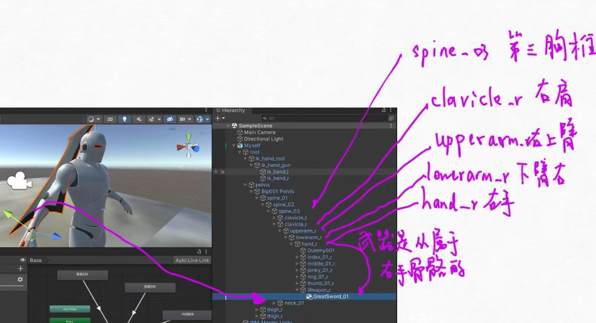

我一开始打算用父位置——手的位置和刀的root位置作差来确定刀上两个中心点的坐标，后来发现这俩坐标是一个坐标。不过好在我发现，刀绑定在手上之后，沿着刀身方向是-x方向，这样给我们带来了很大的方便。

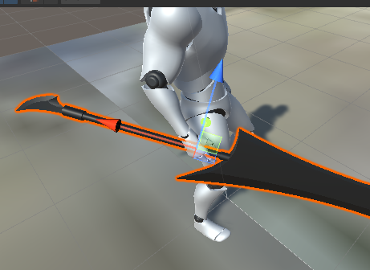
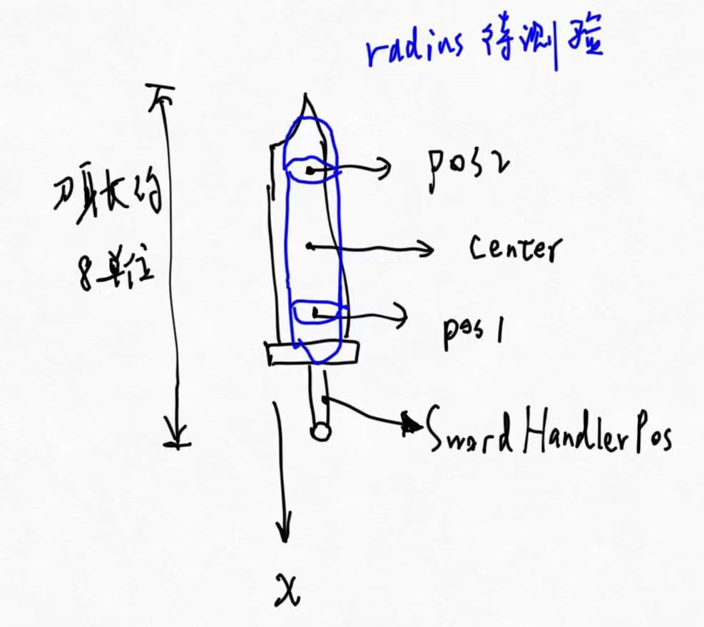

这部分的编码还有一个困难——没有一个非常简单且直观的调试方案。考虑一下，我们其实并不知道在场景中人物的手的世界坐标，也并不知道我们设置的-2 -6偏移量选取的capsule是不是合适。我们只能试着“砍一砍”，看看我们设置的capsule参数能在什么情况下砍中。如果出现特别离谱的情况，比如无论如何都判定失败、或者隔老远还是判定成功，那就要思考我们是不是从原理上就出现了谬误。

写了一版，现在确实可以进行判定，但是后来我发现我对于Capsule的幻想是错误的，这个东西非常奇怪（上面文章作者22年5月写了这个文章，到现在正好一年，也算是比较新了，那为什么他要这样写呢 当然是capsule不能像我这里想当然地使用啊）

先上一下我的问题代码吧
```
public class WeaponController : MonoBehaviour
{
    Vector3 lastFramerootPos;
    public bool weaponActive = false;
    Vector3 capsulePos1;
    Vector3 capsulePos2;


    void Start()
    {
        weaponActive = false;
        lastFramerootPos = new Vector3();

        GameObject.Find("Myself").GetComponent<StateModifier>().AttackCheckActivateEvent += OnWeaponActive;
        GameObject.Find("Myself").GetComponent<StateModifier>().AttackCheckDeactivateEvent += OnWeaponDeactive;
        
    }

    void FixedUpdate()
    {
        if (weaponActive)
        {
            cast();
        }
        //注意改掉，不需要一直检测更新lastFramerootPos
        lastFramerootPos = this.transform.position;
    }
    void OnWeaponActive(object sender,object args = null)
    {
        Debug.Log("OnWeaponActive is called");
        var SwordHandlerPosition = HandTrans.position;//握手位置 = 引用的父位置
        weaponActive = true; 
        
    }
    void OnWeaponDeactive(object sender, object args = null)
    {
        weaponActive = false;
    }
    void cast()
    {
        Debug.Log("casting...");
        //在这个语境下，this.transform表示剑的根位置，也和手位置重合
        var Sword_xaxis = this.transform.right;//红轴，就是x轴
        var curFrame_rootpos = this.transform.position;
        Vector3 direction = curFrame_rootpos - lastFramerootPos;

        capsulePos1 = this.transform.position + Sword_xaxis * (-2);
        capsulePos2 = this.transform.position + Sword_xaxis * (-6);

        var castres = Physics.CapsuleCast(capsulePos1, capsulePos2, 0.5f, direction, 2);
        if (castres)
        {
            Debug.Log("cast collides!");
        }
    }
}
```
现在的情况就是：哪怕人站在地面上，挥刀依然会发生一系列的碰撞。后来我在刀身上添加了一个CapsuleCollider，发现capsule的形状是很膨胀的。我决定还是模仿作者cycler_725的做法，在剑身上添加几个球，使用`Physics.SphereCastNonAlloc`来进行球体碰撞。

### p2 使用SphereCastNonAlloc的代码
经过一些调试，这一版的代码是可以奏效的。现在我在场景里设置了几个圆柱体用于测试，只有当人物确实在木桩面前挥刀的时候才会打印collider的日志信息：

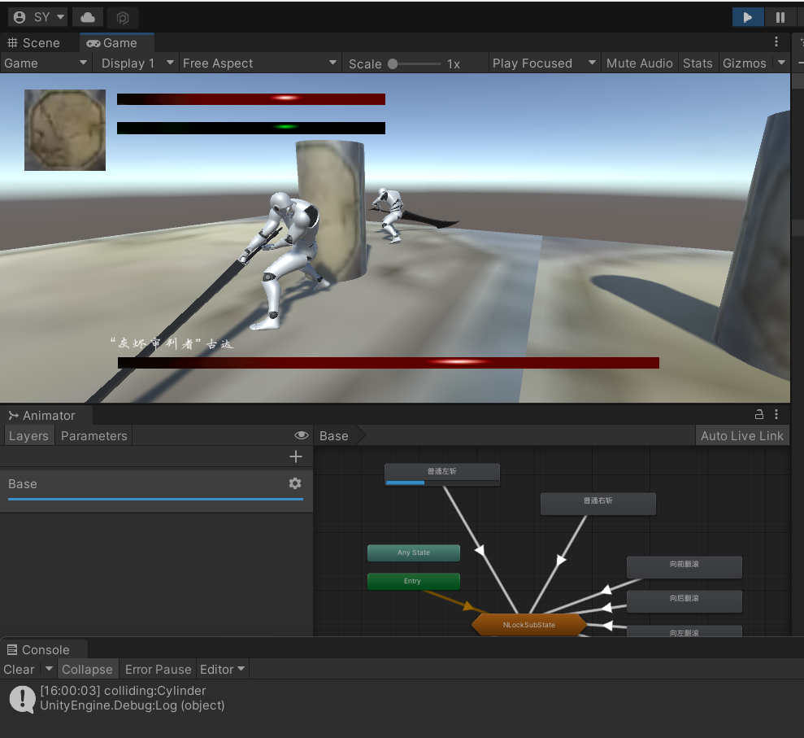
这一版的代码节选如下：
```
public class WeaponController : MonoBehaviour
{
    [Serializable]
    public struct AttackPoint
    {
        public Vector3 attackPointOffset;
        public float radius;
        public Transform Attackroot;
    }
    public bool weaponActive = false;
    [SerializeField]
    public AttackPoint[] attackPoints;
    public Vector3[] previousPos;
    private RaycastHit[] castResult;
    void Start()
    {
        GameObject.Find("Myself").GetComponent<StateModifier>().AttackCheckActivateEvent += OnWeaponActive;
        GameObject.Find("Myself").GetComponent<StateModifier>().AttackCheckDeactivateEvent += OnWeaponDeactive;
        previousPos = new Vector3[attackPoints.Length];
        castResult = new RaycastHit[8];
    }

    void FixedUpdate()
    {
        if (weaponActive)
        {
            cast();
            updatePrevious();
        }
    }
    void OnWeaponActive(object sender,object args = null)
    {
        weaponActive = true; 
        
    }
    void OnWeaponDeactive(object sender, object args = null)
    {
        weaponActive = false;
    }
    void cast()
    {
        for(int i = 0; i < attackPoints.Length; i++)
        {
            var sphereCenterWorldPos = calculateCurPos(attackPoints[i]);
            var attackDirection = sphereCenterWorldPos - previousPos[i];

            Ray myCastRay = new Ray(sphereCenterWorldPos, attackDirection);

            int collideCount = Physics.SphereCastNonAlloc(myCastRay, attackPoints[i].radius, castResult, 0.5f);
            for(int j = 0; j < collideCount; j++)
            {
                if (castResult[i].collider)
                {
                    Debug.Log("colliding:" + castResult[i].collider.name);
                }
            }
        }
        
    }
    void updatePrevious()
    {
        for(int i = 0; i < previousPos.Length; i++)
        {
            previousPos[i] = calculateCurPos(attackPoints[i]);
        }
    }
    Vector3 calculateCurPos(AttackPoint ap)
    {
        return ap.Attackroot.position + ap.Attackroot.TransformVector(ap.attackPointOffset);
        //Attackroot.TransformVector能把本地的偏移向量转化成世界坐标偏移向量
    }
}
```


## 0版本完结前的更改
我注意到一个必须展开说一说的错误。

我们一直宣称未来要加入与AI敌人的战斗，但是程序中有一个架构错误直接和这件事矛盾。我们的许多事件是静态的，这意味着拥有静态事件的类没办法再创建一个实例——如果我们创建另一个人物， 并用新的脚本控制其运行逻辑，那么问题是那个人物和我们控制的人物的许多类使用着同一套事件。我们的翻滚指令也会激发对方人物的OnDodge。

我们在这里集中调整一下，所有静态事件都应该修改。

与此同时，所有全局查找Find都需要考虑其在接下来的正确性。应该考虑用父子查询而非全局Find来引用对象。

经过我的修改，除了UI组件、摄像机控制还有InputTest这些全局唯一的类的静态事件，我把所有其他类使用的静态事件都改成了非静态的，并且对于这些事件订阅的语段也相应改成了先查对象获取实例再进行订阅。
其中一个例子如下：
```
//WeaponController.cs
void Start()
    {
        GameObject.Find("Myself").GetComponent<StateModifier>().AttackCheckActivateEvent += OnWeaponActive;
        GameObject.Find("Myself").GetComponent<StateModifier>().AttackCheckDeactivateEvent += OnWeaponDeactive;
        previousPos = new Vector3[attackPoints.Length];
        castResult = new RaycastHit[8];
    }
```
