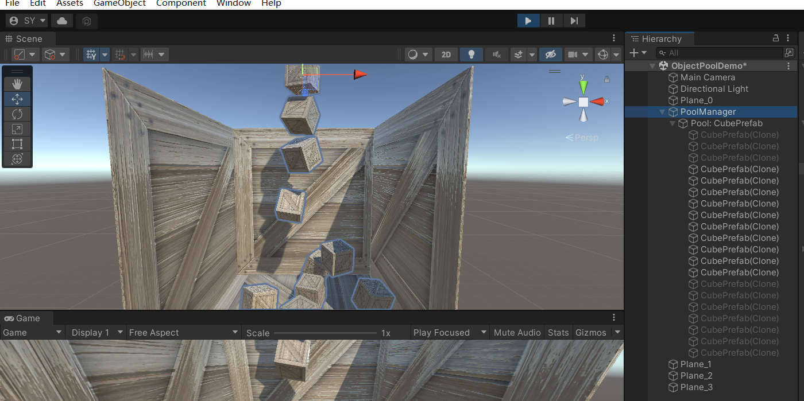
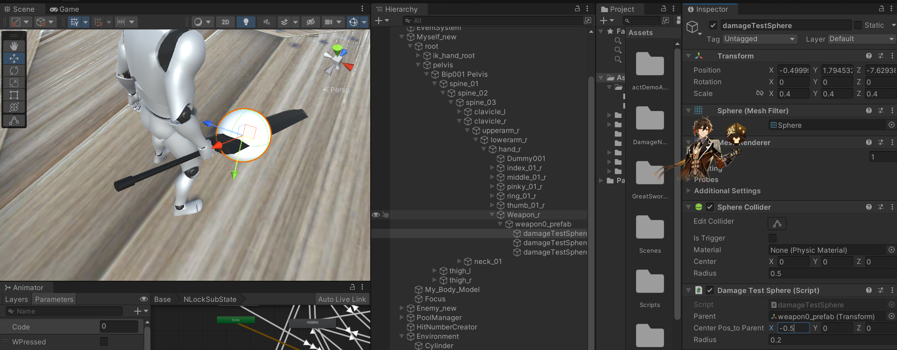
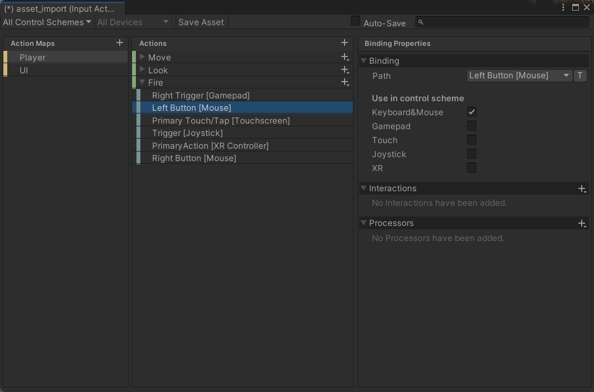

# V1工作日志
## V0版本完结回顾
在之前的版本当中，我们为人物制作了移动和翻滚行为的完整逻辑，以及攻击的部分逻辑。现在人物能够进行左斩、右斩的交替攻击，且已经为左斩附加了动画事件等机制来保证攻击检定能够进行。已经进行了一些调试，攻击检定的时序和范围基本准确。

下面为了让demo逐渐变得更像游戏，我罗列了一些可选的宏大目标：
1. 更完备的动作系统，人物将拥有各种连招、飞天攻击、格挡手段
2. 添加受击、打断的一套逻辑
3. 更完备的UI，UI除了目前的显示血量和精力，可能还需要在伤害产生时在屏幕上显示扣除的生命（Hits）
4. 添加特效。特效可以附加在各种各样的地方，比如进入连击后人物身上冒出热气、翻滚时在原地留下残影等等。
5. 时间特效，比如翻滚成功闪避后施加一个奖励让敌人陷入慢动作
6. 处决和特写。由于资产中天然有处决动画，做这一个部分是非常合理的。
7. 深耕打击感，加入打击震屏、卡肉/关键帧定格来强化表现
8. 敌人的AI，让对战成为可能
9. 可更换的武器
10. 通过动画重定向把机器人模型替换成我们熟悉的模型

## V1.0 打击的生命扣除和伤害字
### V1.0 需求设计
1. 创造敌人——创造一个尚没有输入控制的敌人，其血量绑定到了UI的Boss血量上。
2. 攻击能够伤害敌人，扣除UI上的血量
3. 在UI中实现攻击奏效后的伤害hit提示

魂中没有伤害hit数字，可能是出于风格化的考虑。魂的战斗充满了压迫感，每一刀打在敌人身上会造成什么伤害都不清楚可能更有利于营造这种弱对强的感觉。但是我觉得我们可以做。这既是一个可以一说的技术点，也与我们最后的成品风格并不矛盾（更不如说我们其实没有什么既定的风格）

这一版的需求很大，可能比之前v0.1-0.5都要大。但没关系，我们的学习力、专注力和已有的知识都在增长，我有信心在10h左右作出这一版的实现。

### V1.0 技术预研和思考
如果复制我们现在的Myself作为敌人的问题是什么？首先，这个敌人也会受到InputTest的控制。InputTest现在的通讯包括向AttackManager和DodgeManager发送事件。我们当然可以复制Myself后删除InputTest，但是这样一来将会造成AttackManager和DodgeManager等要向InputTest上挂载订阅者函数的代码出错。

那我们先这样：复制Myself，然后把InputTest当中关键的事件激发语句注释掉，这样就能暂时得到一个永远处在动画Idle状态的不动的敌人。以后就算我们修改动画机为主角添加更多的动作，敌人的动画机也会相应更改——因为两个人物的Animator组件都是引用。

此外，技术需求1似乎是没有什么技术难点的，BOSS血量条也不难做。

技术需求2就有比较深的内容了。如果要完全做好伤害敌人的过程，甚至要为动画机增加受击的动画状态，而受击是一个优先级比较高的动作，且相关逻辑方面较多，比如什么样的状态X受到什么样的攻击=什么样的受击结果，我们暂时不能做受击这一块内容，仅仅是做好扣血并体现在UI上这件事情。同样，技术需求3也是一个头一次做的技术点，如何在屏幕上显示hit的打点数字？


### V1.0 P1-1 抽象出人物
我一开始觉得这是一个小问题。我先创建了绑定在Myself上的新脚本`DecideCharacterControllerScript`,在其中写了很简单的“判断我是谁逻辑”

```
public class DecideCharacterControllerScript : MonoBehaviour
{
    public Component controllerScript;
    void Start()
    {
        switch (gameObject.name)
        {
            case "Myself":
                controllerScript = gameObject.GetComponent<InputTest>();
                break;
            case "Enemy":
                controllerScript = gameObject.GetComponent<AIController>();
                break;
            default: break;
        }
        
    }
}
```
然后意欲透过访问`gameObject.GetComponent<DecideCharacterControllerScript>().controllerScript`来访问这个脚本。后面，如果是Myself，就在controllerScirpt上绑定原本要绑定到InputTest的事件，否则就绑定在AIController上。


由于DodgeManager等几个脚本也要在Start当中获取DecideCharacterControllerScript在Start中更新的成员，因此应该设定DecideCharacterControllerScript在一个比较早的时机执行。


这根本无法奏效——如果你跟得上的话，你会立刻发现这是一个荒谬的想法。作为Component的controllerScript是父类Component的引用。动态绑定决定了这个引用不可以访问子类InputTest或者是AIController的成员。

一切的起因是我希望把现在的代码中的：
```
    InputTest.dodgeEventHandler += OnDetectedDodge;
```
把对InputTest做的事情变成可能改变的某个类做的事情。如果当前类实际上是某种敌人，这里应该就是某种敌人的AI控制类而非InputTest在接受OnDetectedDodge的订阅。

接着我想到，我们可以把决定控制者的逻辑后延到具体用户(指的是InputTest或者AIController的用户，目前写好的就是DodgeManager和AttackManager)

现在的AttackManager和DodgeManager变成了这样：
```
//DodgeManager.cs
void Start()
    {
        if(gameObject.name == "Myself")
        {
            InputTest.dodgeEventHandler += OnDetectedDodge;
        }
        else if(gameObject.name == "Enemy")
        {
            AIController.dodgeEventHandler += OnDetectedDodge;
        }
        
        dodgeStartEvent += OnDodgeStart;
        gameObject.GetComponent<AttackManager>().AttackEnsuredToPlayEvent += OnAttackEnsuredToPlay;
        isDodging = false;

    }
```

```
//AttackManager.cs
void Start()
    {
        storedRequest = null;
        if (gameObject.name == "Myself")
        {
            InputTest.attackRequestEventHandler += OnAttackRequest;
        }
        else if (gameObject.name == "Enemy")
        {
            AIController.attackRequestEventHandler += OnAttackRequest;
        }
    }
```

这样问题就解决了。当然，后面可能还会出许多不同敌人有不同AI逻辑的内容，为此可以在InputTest和AIController等之间进行新的一层抽象，让他们都继承自一个公共父类来进一步约束和规范行为，此为后话。

对了，采用这一版的实现方案之后，我们就可以删掉这个Decidexx类了，没用。

### V1.0 P1-2 cast检定成功后的逻辑
之前我们已经写好了武器透射判定的部分，现在我们希望让Enemy对象成为我们的第一个受害者。我们来试着为其施加伤害。

之前说过，为了减少通讯次数，我们把血量和精力都放在了UI脚本里面。

我们既要考虑Myself攻击敌人，也要考虑敌人攻击Myself。攻击检定发生在WeaponController的FixedUpdate()当中，只有在动画机指示的刀挥动过程(一堆动画事件期间，WeaponController.weaponActive = true)中才会每帧不断进行cast。

问题1 现在只有柱子有collider。我们还没有为人物添加碰撞体。我们之前试过，如果给自己加上碰撞体，又会立刻引发一个新的问题，那就是刀会与自己的身体碰撞(这不可避免，就算不挥刀，刀的模型或者是检测球体本身就和包围人物的圆柱体深度相交)。但是就算这样我想我们也没法把Myself的collider弃绝。 

我发现人物模型（资产原名叫WM_Master_Unity）外围有一个包围盒，如果直接给人物模型加上BoxCollider，直接就能覆盖住人物。首先给敌人和自己都加上盒子碰撞体。

下面就是，我们要在cast的逻辑里打印collider目标的位置改出一个扣血逻辑：碰撞发生-检测受打击对象-通知UI-完成数据改写和血条刷新

为了让检测逻辑通知UI要扣血，我们就需要新的event了，这个事件属于cast所在类也就是StateModifier，其订阅者是UI控制组件CanvasModifier。

StateModifier.HitEvent需要使用一些参数，定义其类型为HitEventArgs:EventArgs
在打击发生的时候，事件需要告知处理者【谁攻击到了谁】。同时如果StateModifier.cast内的碰撞单位是自己应该跳过事件的触发。
攻击者是动画机实例的持有者，可以通过gameObject获取。是的，在StateModifier里调用gameObject返回的依然是人物。因此事件自带的sender就可以存留这个内容；
另一方面，受击者是由raycast带回的结果，我们的cast里现在是这样写的：
```
    int collideCount = Physics.SphereCastNonAlloc(myCastRay, attackPoints[i].radius, castResult, 0.5f);
    for(int j = 0; j < collideCount; j++)
    {
        if (castResult[i].collider)
        {
            Debug.Log("colliding:" + castResult[i].collider.name);
        }
    }
```

PS 我想到一个debug直观看到碰撞准不准确的办法。在collide发生的位置直接阻断当前的动画，就能看到碰撞发生的那一帧人物的动作，从而判断扫描球设置的是否合理了。


### V1.0 P2 让攻击奏效
这一部分我没有写思考过程，直接动手编码了。现在我们成功地让主人公的大剑斩击能够上伤害到敌人：

相关代码如下：
```
//WeaponController.cs
void cast()
    {
        for(int i = 0; i < attackPoints.Length; i++)
        {
            var sphereCenterWorldPos = calculateCurPos(attackPoints[i]);
            var attackDirection = sphereCenterWorldPos - previousPos[i];

            Ray myCastRay = new Ray(sphereCenterWorldPos, attackDirection);

            int collideCount = Physics.SphereCastNonAlloc(myCastRay, attackPoints[i].radius, castResult, 0.5f);
            for(int j = 0; j < collideCount; j++)
            {
                if (castResult[i].collider)
                {
                    if(castResult[i].collider.name != myCharacterModel.name)
                    {
                        Debug.Log("colliding:" + castResult[i].collider.name);
                        HitEvent?.Invoke(this, new HitEventArgs(castResult[i].collider.name));
                        weaponActive = false;
                    }
                }
            }
        }
    }
```

WeaponController.HitEvent是管理受击的事件，其订阅者是CanvasModifier。目前的HitEvent事件参数经由一个字符串，用来告知UI控件是谁打了谁(攻击者的内容在Object sender中，被攻击者的名字用字符串保存在HitEventArgs当中)

注意，我们的碰撞体都不是直接绑定在人物对象（包含一套骨骼和一个模型）上的，其他脚本之前都绑定在人物上。碰撞体绑定在模型上。

```
//CanvasModifier.cs
    void Start(){
        //...
        foreach(var weapon in WeaponController_instance)
        {
            weapon.HitEvent += onHit;
        }
        //WeaponController_instance[]由Inspector拖引用来完成赋值
    }
    void Update()
    {
        if(!DodgeManager.isDodging) addEnergy();
        updateSlot(characterEnergy, this.my_energy_Image_rt, this.characterEnergyMax); 
    }

    void updateSlot(double Val ,RectTransform slotRT,double division)
    {
        var widthPercent = Val / division;
        slotRT.localScale = new Vector3((float)widthPercent, 1.0f, 1.0f);
    }
        void onHit(object sender, HitEventArgs args = null)
    {
        Debug.Log("onhit was called, object hit was:" + args.objectWasHit);
        RectTransform tochange;

        if(args.objectWasHit == "Enemy_Body_Model")
        {
            bossHealth -= 5f;
            tochange = enemy_health_Image_rt;
            updateSlot(bossHealth, enemy_health_Image_rt, this.enemyHealthMax);
        }
        else if(args.objectWasHit == "My_Body_Model")
        {
            characterHealth -= 5f;
            tochange = my_health_Image_rt;
            updateSlot(characterHealth, my_health_Image_rt, characterHealthMax);
        }
        
    }
```

### V1.0 P3 Hit伤害显示
[Unity实现游戏伤害数字显示HUD的方法](http://www.mobange.com/nav/net/100961.html)
[秦无邪OvO 知乎 Unity教程如何实现敌人受伤害值浮动显示](https://www.zhihu.com/zvideo/1275847813499502592?utm_id=0)
文章1采用的方法是在一个特定点（比如怪物的头顶），随着其他逻辑判定到需要弹出显示，在这个特定点创造一个自定义类的实例，这个类在OnGUI周期用`GUI.Label`来绘制一个文字内容。这个办法其实也挺好的，虽然文中所做的是向上飞，我们其实也可以通过按时间修改字符的alpha值让其淡出至透明(你可以看出我对于这种向上飞的伤害数字的鄙夷)。

由于这篇文章管理伤害显示数字的方式用到了`协程Coroutine`，而彼时我Unity尚且没有学习到协程部分。不过本工作日志本来就是为了记录边看边写而存在的，那我们就在这里插播一段对Unity协程的学习笔记。

#### 协程 coroutine
协程是类似线程的概念。由于脚本事实上并不是完整的程序，而只是Unity提供的编程插口——在Unity定义的大框架下挖出几个关键的窟窿供程序员编写脚本填入，而后再返回Unity框架，这就是Unity开发的游戏背后的过程(可以进一步学习[Unity-C# Job](https://docs.unity.cn/cn/current/Manual/JobSystem.html)) 

协程不是线程。所有同步工作的协程都会运行在Unity的主线程上。一个协程编程的重要原则是：尽可能避免阻塞协程中的操作。

和线程一样，协程也往往用于解决同步问题。最常见的同步需求就是一段代码必须等待一个结果，有了这个结果之后才能继续推进执行，而这个等待往往比执行这段代码本身的时间长的多的多(文件I/O，网络通讯等等)

Unity API手册中给出的关于协程的例子正是我们所说的字体淡出：
```
//不使用协程的版本
void Fade()
{
    Color c = renderer.material.color;
    for (float alpha = 1f; alpha >= 0; alpha -= 0.1f)
    {
        c.a = alpha;
        renderer.material.color = c;
    }
}
//使用协程
IEnumerator Fade()
{
    Color c = renderer.material.color;
    for (float alpha = 1f; alpha >= 0; alpha -= 0.1f)
    {
        c.a = alpha;
        renderer.material.color = c;
        yield return null;
    }
}
```
不使用协程的版本中，尝试在for循环中对alpha逐渐递减以实现淡出。但事实上会怎么样呢？事实上调用Fade的函数最终一定是在Update中调用，而Update每一帧调用一次、必须执行完所有语句才会执行下一帧。这样一来，for循环在一帧之内就过完了，而一帧的时间只有不到0.01秒，人眼根本无法看出这个淡出的过程。

协程是这样一种函数，其返回值类型是IEnumerator，且返回语句必须是yield return.

协程是.NET C#设计的，并非Unity原创的。类型IEnumerator定义在System.Collection命名空间下。

#### yield
C#中的yield属于转移指令，和break，continue，goto，throw，retrun一样，都是指示赋值IP(Instruction Pointer)以达到下一句指令不再取指代码区原本的+1位置指令，而是前往一个特定的计算的指令位置。

yield的核心是延迟。一个非常常见的yield程序片段例子如下：
```
    static IEnumerable<int> GenerateFibonacciNumbers(int n)
    {
        for (int i = 0, j = 0, k = 1; i < n; i++)
        {
           yield return j;
            int temp = j + k;
            j = k;
            k = temp;
        }
    }
```
如果我们只是想返回斐波那契数组，在没有引入yield之前也许是这样的代码片段
```
static List<int> GenerateFinonacciNumbers(int n){
    List<int> tempList = new List<int>();
    for(int i = 0, j = 0, k = 1; i < n; i++){
        tempList.Add(j);
        int temp = j + k;
        j = k;
        k = temp;
    }
}
```
这种在任何语言中都如此的写法要求我们为了返回一个List，必须在函数的栈内开辟一个局部的List，并在函数返回时通过拷贝把这个List传递回外部。而引入了yield的方法下，我们却并没有定义这样一个List，仿佛这段代码在返回之后还在持续运行、直至这个for循环最终过完。

没错。如下图所示，yield让函数的返回机制发生了改变，即便执行到了yield return，函数还是没有真正地退出栈内存并且销毁其运行状态和临时变量。


IEnumerable 是协程函数必须使用的返回类型。其也可以向上面的例子一样是一个特定类的泛型。协程函数的返回值会不断存储到IEnumerable里，直到协程逻辑走完。

可以通过让协程返回WaitForSeconds来控制协程函数不必每一帧执行，而是等待特定时间执行。比如下面的例子，我们希望在F按下的场合，每0.3f秒打印一些东西：

```
public class test : MonoBehaviour
{
    void Update()
    {
        if (Input.GetKeyDown(KeyCode.Y))
        {
            //Debug.Log("Y was pressed!");
            StartCoroutine("PrintAndWait");
        }
    }
    System.Collections.IEnumerator PrintAndWait()
    {
        for (int i = 0; i <= 12; i++)
        {
            Debug.Log("F was pressed! Printing, " + i);
            yield return new WaitForSeconds(0.3f);
        }
    }
}
```
有几种方式能够终结协程：
1. 指名道姓，使用StopCoroutine终结指定的协程
2. StopAllCoroutine，终结所有协程
3. 把一个gameobject设定为isActive = false，会立刻导致附加在其上所有协程的终止
4. 使用Destroy()回收实例，将会调用实例类型的OnDisable函数，内部默认会终止所有协程以完成回收

上面这种定时也被用于回收我们原来例子中的临时实例：HitNumber。我们知道HitNumber的生命周期是有穷尽的，其不可能在游戏中永远隐形地存在——否则随着游戏的进行，数以万计的伤害数字就会吃完内存让游戏崩溃。

```
System.Collections.IEnumerator Suicide(float lifeTime)
    {
        yield return new WaitForSeconds(lifeTime);
        Destroy(this.gameObject);
    }
```
尽管采用这种方式确实考虑了一定的性能问题，但是不得不指出，这种方式依然以一个非常高的频率在游戏中创建实例、销毁实例。尽管C#比之C++有gc机制，但是在一段内存被开辟又回收的过程中，gc并不能解决内存碎片问题。我们在上面讲协程的时候，可以看到gameobject的isActive属性能够影响协程的运行。

事实上，isActive正是对象池技术的关键。Unity允许通过把一个游戏对象设置为isActive=false来隐蔽而非销毁。处于未激活状态下的游戏物体，禁用渲染器、碰撞器刚体和一切脚本，也不会再执行其任何脚本的Update，从而失去了一切行为，基本上相当于死亡——但是其所有上述信息都还是存留在内存当中，未来一旦其重新激活，就可以以微小的开销使其重新在游戏中出现。有两个值得一提的关于isActive的特性，一是游戏对象的isActive受制于父对象，倘若父对象被deactivate，对象树内的所有子对象不论自身激活如何，都会失活。二是，在改写对象的isActive时，也会执行OnDisable/OnEnable，就像在创建和销毁对象时那样。

由于对象池是一个热门的技术，热门不仅指的是在游戏开发实践中用的多，也是在面试中喜欢提问的一项技术，因此我们在这里先不急于实现伤害文字的需求p3，转而做一下对象池的实现工作。

### V1.0 P3 PLUS 对象池的实现
对象池的思路很简单，为了防止游戏中无休无止的大量的对象实例创建销毁开销，我们把对象销毁改为设置为未激活状态，并且在对象池这个类中存储起来。

中间学了一段时间自己实现的对象池，原本照着的那片文章质量真的不太好，代码里面有几个错误。之后找到这个质量高得多的对于实现对象池的介绍：
[阿严 Ep.07 对象池模式 bilibili](https://www.bilibili.com/video/BV1oV411J7Sw/)

这一支视频用40分钟左右的时间构建起来一个相当简单的对象池。不得不夸一下这个老师，讲的非常好，没有遗漏细节、每一步都是循序渐进。先上一下我微微改了一点点的几乎就是照抄的他的代码：
```
//ObjectPool.cs

using System.Collections.Generic;
using UnityEngine;

/*
    首先声明：对象池确实要参与管理游戏对象的生命周期，但是如果把这些逻辑运行在ObjectPool当中是不合理的。
    //试想一下，这样做等于对象池要在更新时候遍历自己已经分配出去的所有对象，而我们的m_queue里存着的不是分配出去的对象，而是收回来的对象
    //换言之，事实上的对象池更像一个放贷者，手头拥有的队列内的对象其实已经不在游戏中显现，而他放出去的贷款(游戏中正在激活的对象)才是可见的。

    //因此，对象池管理对象的生命周期，应该通过在分配出去的对象上绑定一些行为，让他们自己管理自己(教孩子们自己回家，哈哈)
    //具体到程序里就是为每个自己放出去的对象添加一段monobehaviour脚本，这个添加也就是AddComponnet
 */
[System.Serializable]
public class ObjectPool
{

    protected Queue<GameObject> queue;
    [SerializeField] GameObject prefab;
    [SerializeField] int size = 5;
    private Transform parent;
    public GameObject Prefab
    {
        get
        {
            return prefab;
        }

    }
    GameObject Copy()
    {
        GameObject copy = GameObject.Instantiate(prefab, parent);
        Debug.Log("copying at " + parent.position);
        copy.SetActive(false);
        return copy;
    }
    public void Initialize(Transform trs)
    {
        queue = new Queue<GameObject>();
        parent = trs;
        for(int i = 0; i < size; i++)
        {
            queue.Enqueue(Copy());

        }
    }
    GameObject availableObject()
    {
        GameObject available = null;
        if(queue.Count > 0 && !queue.Peek().activeSelf)
        {
            // 这里是因为如果只有少数对象而不够用，整个队列都会是使用中的状态
            //如果发现队首都已经激活了，就去else继续copy新的对象
             available = queue.Dequeue();
        }
        else
        {
            available = Copy();
        }

        queue.Enqueue(available);//改良，出队并正在使用的对象直接入队
        return available;
    }
    public GameObject prepairedObject()
    {
        var prepared = availableObject();
        prepared.SetActive(true);
        return prepared;
    }
    public GameObject prepairedObject(Vector3 position)
    {
        var prepared = availableObject();
        prepared.SetActive(true);
        prepared.transform.localPosition = position;
        return prepared;
    }
    public GameObject prepairedObject(Vector3 position, Quaternion rotation)
    {
        //...重载
    }
    public GameObject prepairedObject(Vector3 position, Quaternion rotation,Vector3 localScale)
    {
        //...重载
    }
}
```

注意，这个类当中的，包括接下来几个类的代码当中但凡声明了一个public GameObject prefab, 都意味着需要在Inspector当中拖动某个预制体进这个引用去。

```
//PoolManager.cs
using System.Collections.Generic;
using UnityEngine;

public class PoolManager : MonoBehaviour
{
    [SerializeField]
    public ObjectPool[] pools;
    public static Dictionary<GameObject, ObjectPool> dic;//预制体-池

    private void Start()
    {
        dic = new Dictionary<GameObject, ObjectPool>();
        Init(pools);
    }
    void Init(ObjectPool[] pools)
    {
        foreach(var pool in pools)
        {
#if UNITY_EDITOR
            if (dic.ContainsKey(pool.Prefab))
            {
                Debug.Log("Locating same prefab on different pool, Prefab: " + pool.Prefab);
                continue;
            }
#endif

            dic.Add(pool.Prefab, pool);
            Transform parentTrans = new GameObject("Pool: " + pool.Prefab.name).transform;
            //这个transform是池子的位置
            parentTrans.parent = transform;//池子是池管理器的子对象；池子内的对象都在池子的成员队列当中
            parentTrans.localPosition = new Vector3(0.0f, 0.0f, 0.0f);
            pool.Initialize(parentTrans);
        }
    }

    public static GameObject Release(GameObject prefab)
    {
#if UNITY_EDITOR
        if (!dic.ContainsKey(prefab))
        {
            Debug.LogError("Error: no such prefab:" + prefab + " in dictionary");
            return null;
        }
#endif
        return dic[prefab].prepairedObject();
    }
    public static GameObject Release(GameObject prefab, Vector3 position)
    {
#if UNITY_EDITOR
        if (!dic.ContainsKey(prefab))
        {
            Debug.LogError("Error: no such prefab:" + prefab + " in dictionary");
            return null;
        }
#endif
        return dic[prefab].prepairedObject(position);
    }
    public static GameObject Release(GameObject prefab, Vector3 position, Quaternion rotation)
    {
#if UNITY_EDITOR
        if (!dic.ContainsKey(prefab))
        {
            Debug.LogError("Error: no such prefab:" + prefab + " in dictionary");
            return null;
        }
#endif
        return dic[prefab].prepairedObject(position, rotation);
    }
    public static GameObject Release(GameObject prefab, Vector3 position, Quaternion rotation,Vector3 localScale)
    {
#if UNITY_EDITOR
        if (!dic.ContainsKey(prefab))
        {
            Debug.LogError("Error: no such prefab:" + prefab + " in dictionary");
            return null;
        }
#endif
        return dic[prefab].prepairedObject(position, rotation, localScale);
    }
}
```

最后我写了两个展示对象池的使用的demo，其中第一个主要是渐进地做一些基础工作，第二个才最能够体现出对象池的威力。

第一个例子是这样的，只有一个对象池，预制件为木箱预制体。


在程序开始时会一次性发送10条协程，他们分别以1，2，3...的延时在场景中生成一个盒子。所有盒子都在开始时在对象池中预设好。他们将会被丢在场景里，任由物理引擎操控地翻滚弹跳。


主程序代码如下：
```
//demoMain.cs
using UnityEngine;

public class demoMain : MonoBehaviour
{
    public GameObject prefab;
    void Start()
    {
        for(int i = 0; i < 10; i++)
        {
            StartCoroutine("CreateABoxFromPool",(float)i);
        }
    }
    System.Collections.IEnumerator CreateABoxFromPool(float waitTime)
    {
        yield return new WaitForSeconds(waitTime);
        Debug.Log("Releasing, waitTime = " + waitTime);
        PoolManager.Release(prefab, new Vector3(0.0f, 0.0f, 0.0f));
    }
}
```

这段程序完全没有体现出对象池的威力，其只是把已经在对象池里面的物体从disable状态激活，然后看着他掉下来。

下面我们来做一个体现其威力的事情。我们在主程序中无限地往下丢盒子，盒子在被创建出来后3秒就会被对象池召回（看起来就像突然消失或者自我毁灭了一样）
```
//demoMain.cs
public class demoMain : MonoBehaviour
{
    public GameObject prefab;
    // Start is called before the first frame update
    void Start()
    {
        
        for(int i = 0; i < 1000; i++)
        {
            StartCoroutine("CreateABoxFromPool",(float)i * 0.3);
        }
    }

    // Update is called once per frame
    void Update()
    {

    }

    System.Collections.IEnumerator CreateABoxFromPool(float waitTime)
    {
        yield return new WaitForSeconds(waitTime);
        PoolManager.Release(prefab, new Vector3(0.0f, 0.0f, 0.0f));
    }
}
```
然后我在预制件上绑定了这样一个控制盒子自己生命周期的Monobehaviour
```
//selfLifeTimeController.cs
using UnityEngine;

public class selfLifeTimeController : MonoBehaviour
{
    [SerializeField] public float lifeTime;

    private void OnEnable()
    {
        StartCoroutine("Suicide", lifeTime);
    }
    System.Collections.IEnumerator Suicide(float lifeTime)
    {
        yield return new WaitForSeconds(lifeTime);
        this.gameObject.SetActive(false);
    }
}
```
在Inspector里设置箱子的生命周期为3s.


我们可以看到，进入稳态后，对象池中的10个预制体副本中9个是Active，一个是非激活状态，这个非激活状态在从上而下不断地跑。这是因为一个巧合：在每0.3秒释放一个新的实例的情况下，池中10个实例刚好完成了和3秒生命周期的重叠。说的更简单一点，每次第十个箱子被构造出来，正好第一个箱子的生命周期结束了，其将会退回队列中变为非激活态，等待日后分配，此后每过0.3秒都会有一个箱子生命周期结束，从而首尾循环。

就算把池子扩展成20个箱子，游戏中只有10个激活箱子的情况也还是持续不变。


ok,至此姑且算我们自己实践了一遍对象池吧。

关于对象池另外还有一些事情我想讲下。首先是，对象池一定不是一个银弹解决方案。比如我们制定了子弹对象池，而当游戏人物没有开枪的时候，这个子弹对象池中依然要维护可能20颗子弹拷贝。但是除去这种情况，对象池几乎是只有好处的——UnityDoc说，如无必要，应避免使用Instantiate创建物体/Destroy回收物体——尽管他们是良好定义的，频繁这样做的开销仍然是巨大的。
像我们上面的生成箱子的例子，这个需求如果用非对象池的传统手段来实现，那么随着程序的无线运行，每0.3秒都有一个对象被创建、一个对象被销毁，游戏倘若运行了1分钟，这就是40个创建/销毁。而在我们的对象池模型下，我们是世上只在游戏开始的时候创建了10个箱子、游戏结束时销毁他们。随着游戏开发得越来越复杂，对象池的性能提升只会越来越大。

另外，作者在[阿严 Ep.07 对象池模式 bilibili](https://www.bilibili.com/video/BV1oV411J7Sw/)当中提到一个合理限定对象池大小的办法。在我们现在的代码里，并没有一个这样的量来限制对象池的大小——我们在游戏开始时创建一批池内对象(输入了`pools[Prefab].Size`来规定创建多少)，而后如果用户的需求超越了这个上限，对象池将会创建更多的拷贝来满足这个需求。

### V1.0 P4 重返Hit伤害显示 - 用上对象池
现在我们写好了一个不是泛型的通用对象池(我认为比照抄第一版的 逻辑清晰的多，也更好用的多)，我们试着重新写一下当初的Hit伤害用例。

与之前的例子略有不同的是：投掷木箱的例子中，所有拷贝都是完全一致的；而在伤害显示字用例中，伤害字最重要的属性——伤害的数值——彼此是完全不同的， 需要在创建实例的时候传递。

首先，我们之前写了一个`selfLifeTimeController`的脚本，内容很简单，从enable启动协程开始计时，时间到了就自我销毁，这个完全可以复用给现在的预制体。

现在的预制体绑定了生命周期自控脚本`selfLifeTimeController`和负责在屏幕上绘制GUILabel的`HUDHitNumber`，但是虽然能看到物体在Hierarchy当中被创建出来，却始终看不到绘制的文字。

使用OnGUI在脚本中进行UI绘制属于UnityUI当中的立即模式GUI(IMGUI)，这种GUI采用控件来管理图形用户界面。声明控件时，需要提供控件类型、位置、内容三类信息。
比如doc对于GUILabel的例子：


Unity指出，IMGUI并不是一种适合于在游戏中实时显示内容的办法。

在UnityManual对于几种UI技术的比较当中，UIToolkit一直列于第一位，且大多数的特性其都能够支持。对于uGUI，UnityManual称之为“旧版的”。因此似乎UIToolkit是Unity最推荐的一种UI实现手段。

再退回一步，我想问另一个问题：伤害数字这个东西，究竟是什么，它是UI吗？

我在自学了一段时间之后在UAS上买了一个伤害显示资产。运行之后我发现这个资产的完成度简直惊人。

在资产搭建的demo场景中，通过点击就可以创建伤害数字。作者也同样创建了一套对象池来管理这些伤害数字。
作者还设计了Inspector窗格用来可视化地控制和修改伤害数字的各种信息。


[资产 damage_number_pro 文档](https://ekincantas.com/damage-numbers-pro/)
再深入了解一点就更绷不住了，人家自己做好了池子，只要勾选上pool自己选size，就可以完全用现成的工具帮我们做对象池管理(那我学了一天的对象池岂不是白学了啊啊啊)

我不管。我禁用了pool属性，并且把预制件丢在自己的对象池里加以管理。同时，有一个自毁属性也要设为禁用，否则这些池内元素会不停自毁，很快池子里就没有东西了。


ok,这样一来我们的伤害数字就做好了。考虑到游戏中伤害数字并不会像原神一样到处都是，所以我们完全可以允许拷贝这个比较大的资产作为对象池内的内容(我目前设置为池size = 8，已经远远够用)

看效果：


我真服了，这一版内容如此简单：我们加入了敌人，让敌人掉血的时候影响boss血条，并且在打中的时候在敌人位置生成伤害数字。如此简单的一版需求，初步预研2小时，前后编码和调试需求十个小时、学习协程和yield1.5小时、学习和实践对象池6小时，调试资源库伤害数字一小时，大概花了18个小时，我也确实从上周五一直忙到这周一下午两点，这段时间没看渲染，没继续学C#，也没有看设计模式，全铺在这个需求上。走了弯路+效率下降，需要反思。

贴一下我[选用的美术资产的链接](https://assetstore.unity.com/packages/2d/gui/damage-numbers-pro-186447),用下来感觉还是制作精良+文档良好的，几乎可以让非编码人员也能比较方便地使用。


下一个版本改动的方向知道了吧？一头钻进对手的胸肌。

## V1.1 添加弹刀/修正多次判定/给人物添加碰撞
### V1.1 需求设计
现在有一些可以选择的需求：
可以支撑其一个1.x版本的需求，我称之为大需求，目前可以做的是
1. 添加受击
2. 添加弹刀，并修正目前一刀砍到人好几次的问题

可以作为1.x版本需求的一条、大约三分之一个版本工作量的需求，我称之为小需求，目前可以做的有：
1. 给人物添加碰撞以防止穿模
2. 修正摄像头，目前存在挥刀时摄像头突然移动的问题
3. 当敌人生命值清零时不再继续扣血而是宣布游戏胜利
4. 修正人物移动，目前人物没有办法绕y轴左右转向

我选择的V1.1已经填入标题。上一个版本V1.0中，我们学习了协程和对象池，用对象池来管理伤害数字，花了18个小时，我希望这个版本的三点需求能够在少于18小时的时间内完成。

### v1.1 P1 给人物添加碰撞
现在的我们的人物已经有了模型的Box Collider；但是当人物和人物、人物和场景物体碰撞时却并没有阻止人物的前进。

Unity指出，对于很多对物理并没有特别要求的游戏，人物控制器CharacterController是一个比较好的简化，其能够完成物体之间不会相互穿透的功能，且性能开销不高。然而我之前没有加入人物控制器的原因也很简单：一是当时我不知道plane不能作为碰撞体来阻却物体，加入人物控制器后人物不可控制地往下掉；第二是因为之前的项目中人物在碰撞发生后虽然不会穿透物体，但是会发生另一些更糟的事情：

比如这里，我让人物往前走，结果碰到敌人模型后，他居然开始头朝下了。

为了让人物不试图去翻过一切他碰到的东西、把它们当成“楼梯”，应该尽可能把Step offset设置的小。

1. Step Offset 属性也可能有影响，对于身高 2 米的人，请确保此值在 0.1 到 0.4 间。
2. 可以修改 Height 和 Radius 属性来适应角色的网格。对于人形角色，建议始终使用 2 米左右的值。如果轴心点并非刚好在角色的中心，还可以修改胶囊体的 Center 属性。
3. 两个碰撞体可以穿透彼此且穿透深度最多为皮肤宽度 (Skin Width)。较大的皮肤宽度可减少抖动。较小的皮肤宽度可能导致角色卡住。合理设置是将此值设为半径的 10%。

其中的提示2就能解决加入人物控制器后人物浮在空中的问题了。

现在我的设置如下：


在这样一个设置下，一来人物的脚几乎贴着地面，既不浮空也不半截在土里；二来Skin Width比较合适，人物不会卡在模型里面；三来Stepoffset比较合适，场景里的柱子、敌人都不足以让人物攀爬，所以主人公面对墙体会被阻却，但又不会做出其他丑陋的举动。

### V1.1 P1 善后
但是现在发生了一个随之而来的问题。我们的攻击检定逻辑中还有没有写好的地方，现在的大剑会因为和地面碰撞而引发对对面的扣血。

预制伤害文字被实例化源自
```
//HitNumberCreator.cs
    void onHit(object sender, HitEventArgs args)
    {
        //Debug.Log("HitNumberCreator.OnHit occured, args.position = " + args.objectPosHit);
        PoolManager.Release(hitnumPrefab, new Vector3(0.0f, 0.0f, 0.0f));

    }
```
onHit由事件WeaponController.HitEvent唤起，也就是说，在大剑和地板碰撞的时候我们也认为砍到了敌人。这个问题当然也有不少解决方案，但是至少我们有一个该做的事情没做好：HitEvent应该传递【谁砍了谁】这个信息，但是事实上这个信息没有被正确地利用。
```
//WeaponController.cs
void cast()
    {
        for(int i = 0; i < attackPoints.Length; i++)
        {
           //...
            for(int j = 0; j < collideCount; j++)
            {
                if (castResult[i].collider)
                {
                    if(castResult[i].collider.name != myCharacterModel.name)
                    {
                        Debug.Log("colliding:" + castResult[i].collider.name);
                        HitEvent?.Invoke(this, new HitEventArgs(castResult[i].transform.position, castResult[i].collider.name));
                        weaponActive = false;
                    }
                }
            }
        }
    }
```
HitEvent的激发逻辑仅仅屏蔽了持刀者自己砍到自己。我们并不需要在这里不断加上更多的!=判断逻辑。我们可以在HitEvent的处理函数中做这件事情。

由于传递的参数是collider而非对象本身，我们可以考虑用collider继承的tag来完成这件事情。地板都被我设置成了自定义的Floor tag（后来想了一下还是叫Unhitable比较合理）

我们之前传递的参数HitEventArgs的一个参数是collider.name,一个string。这里我们直接把参数定义改掉：
```
//WeaponController.cs
public class HitEventArgs : EventArgs
{
    public Vector3 objectPosHit;
    public Collider hitObjCollider;
    public HitEventArgs(Vector3 HitObjPos)
    {
        objectPosHit = HitObjPos;
    }
    public HitEventArgs(Vector3 HitObjPos, Collider collider)
    {
        hitObjCollider = collider;
        objectPosHit = HitObjPos;
    }
}
```
然后，这个改动造成的影响可以在VS编译器的引用列表当中查看：


我们一一改正，把传递的collider名称直接改成collider本身。

现在我们加入了charactercontroller，事实上在人物上又加了一个新的胶囊碰撞体。所以我们现在不必再把人物模型施加BoxCollider；而同时，WeaponController在Inspector中存放的自身模型也要改成Myself(根物体)而非自己的模型
核心逻辑在这里做更改：
```
public class HitNumberCreator : MonoBehaviour
{
    public WeaponController[] weaponList;
    public GameObject hitnumPrefab;
    void Start()
    {
        foreach(var weapon in weaponList)
        {
            weapon.HitEvent += onHit;
        }
    }
    void onHit(object sender, HitEventArgs args)
    {
        //后面还要改，应该生成在对应被攻击的敌人的头上而不是池管理器的根位置
        if (args.hitObjCollider.tag != "Unhitable")
        {
            PoolManager.Release(hitnumPrefab, new Vector3(0.0f, 0.0f, 0.0f));
        } 
    }
}
```

至此p1需求完成

### V1.2 P2 修正多次判定
之前的截图或者gif图中应该能看出，攻击时有时出现一次伤害，而有时候出现两次。事实上，激活武器并发射raycast的帧大约是一次攻击有十几帧，而这十几帧事实上都可以发生检定并奏效。据我仔细观察，一刀有时候能砍出多个伤害数字。
这个事情有可能是两方面引起的：一把剑上有多个检测球体，如果多个检测球体都碰撞了就会发生多个HitEvent。为了解决这个问题，在HitEvent激发后就把for循环break掉：
```
//WeaponController.cs
void cast()
    {
        for(int i = 0; i < attackPoints.Length; i++)
        {
            var sphereCenterWorldPos = calculateCurPos(attackPoints[i]);
            var attackDirection = sphereCenterWorldPos - previousPos[i];

            Ray myCastRay = new Ray(sphereCenterWorldPos, attackDirection);
            int collideCount = Physics.SphereCastNonAlloc(myCastRay, attackPoints[i].radius, castResult, 0.5f);
            for(int j = 0; j < collideCount; j++)
            {
                if (castResult[i].collider)
                {
                    if(castResult[i].collider.name != myCharacterModel.name)
                    {
                        Debug.Log("colliding:" + castResult[i].collider.name);
                        HitEvent?.Invoke(this, new HitEventArgs(castResult[i].transform.position, castResult[i].collider));
                        weaponActive = false;
                        break;
                    }
                }
            }
        }
    }
```
但是这样改了之后还是刀还是能砍出多个伤害数字。现在我们能保证：一刀下去只能有一个HitEvent被激发。
mad,我发现问题了。原因在于敌人同时带有了BoxCollider和CharacterController两个组件，相当于是带着两个碰撞器。删掉碰撞器保留控制器。


这时候我砍了一刀柱子，发现柱子也让敌人扣血了。这个也很好改，把两个柱子也设置成Unhitable

### V1.3 添加弹刀
弹刀这个事情还是比较酷的，如果应用的好，弹刀不仅可以用于砍到障碍物上的情况，还可以应用到格挡上，如果进行了完美格挡，就让敌人被弹刀。

首先我们要看有没有适合做成弹刀的动画资产，如果没有可能就只能gg了……
我找到受击的四个动画，它们的命名方式是Greatsword_Hit_F, Greatsword_Hit_L, Greatsword_Hit_B, Greatsword_Hit_R，分别说明受击方向，而普通攻击之后接续Greatsword_Hit_F就是一个非常合适的过渡。

WeaponController.cast引发了一次HitEvent，原本的逻辑是：如果打到的东西是Unhitable就无事发生，否则就会施加伤害、扣血等一系列后续。现在如果希望弹刀，我们就改为：
1. 如果Unhitable 无事发生
2. 如果Hitable 扣血
3. 如果Hard 弹刀

首先，生成伤害数字的逻辑要从不是Unhitable变成是Hurtable
```
public class HitNumberCreator : MonoBehaviour
{
    public WeaponController[] weaponList;
    public GameObject hitnumPrefab;
    void Start()
    {
        foreach(var weapon in weaponList)
        {
            weapon.HitEvent += onHit;
        }
    }
    void onHit(object sender, HitEventArgs args)
    {
        Debug.Log("HitNumberCreator.onHit was called, object hit was: " + args.hitObjCollider);
        //后面还要改，应该生成在对应被攻击的敌人的头上而不是池管理器的根位置
        if (args.hitObjCollider.tag == "Hurtable")
        {
            PoolManager.Release(hitnumPrefab, new Vector3(0.0f, 0.0f, 0.0f));
        } 
    }
}
```
改好咯！现在人物已经拥有了碰撞体积，而且砍到柱子会弹刀。


## V1.2 受击
### v1.2 需求设计
下面就是人物的受击了。经过V1.1, 我们已经初步熟悉了受击的几个动作，现在是时候把他们加到游戏里来让人物的受击出现更多的反馈了

受击有四个和方向有关的具体动画，为了播放对应的受击动画，需要判断角色受击的碰撞方向——如果我从正面砍来，敌人应该出现微微后退的反馈；反之，从背后砍就应该向前微微前倾。

受击将会是一个比较复杂的过程。我们也会受击，受击也会打断我们的正常动作。


受击具有最高的优先级，其能够打断人物的任何其他动画。在没有受击的时候，我们的顶级优先级是翻滚：
```
//DodgeManager.cs
void OnDetectedDodge(object sender,DodgeEventArgs args) 
    {
        var chaEnergy = CanvasModifier.characterEnergy;
        if (!isDodging && chaEnergy >= 10.0)
        {
            //除了正在翻滚会阻止翻滚，精力不足也会;后面的受击也会
            dodgeStartEvent?.Invoke(this, null);
        }
    }
```
这里我们已经预留了判定逻辑的位置，如果人物正在受击状态下不应该准许翻滚事件的发生。我们可以在当中添加一个bool量表明人物是不是isHitting——并且让Attack与Dodge组件各自去查这个量。这意味着三个类要彼此维持这个isHitting量的同步，这不是一件很科学的做法。

AttackManager管理人物的攻击，需要知晓是否isHitting；
DodgeManager管理人物的翻滚，需要知晓是否isHitting
StateModifier直接管理状态机，需要播放受击动画，但是其播放受击的事件是由其他组件传来的，StateModifier似乎不需要知晓isHitting的值。

持有isHitting的组件，需要通知AttackManager和DodgeManager isHitting的同步状态，同时还要通知StateModifier播放受击动画。在受击动画结束后，要通过动画事件告知持有isHitting的组件，去告知AttackManager和DodgeManager 把isHitting设置为否定。后来我意识到可以做一个简化，因为只要是和Animator平级的组件，其中的同名函数都会被动画事件唤起。我们可以这样设计：HitManager管理Hit相关的逻辑，持有两个事件，分别关联AttackManager和DodgeManager。之前写到，Hit的判定是在WeaponController.cast当中做的
```
int collideCount = Physics.SphereCastNonAlloc(myCastRay, attackPoints[i].radius, castResult, 0.5f);
            for(int j = 0; j < collideCount; j++)
            {
                var col = castResult[i].collider;
                if (col)
                {
                    if (col.name != myCharacterModel.name)
                    {
                        if(col.tag == "Hurtable")
                        {
                            HitEvent?.Invoke(this, new HitEventArgs(castResult[i].transform.position, castResult[i].collider));
                            weaponActive = false;
                            break;
                        }
                        else if (col.tag == "Hard")
                        {
                            Debug.Log("Detecting Hard Object");
                            BounceEvent?.Invoke(this, null);
                            weaponActive = false;
                            break;
                        }
                    }
                }
            }
```
在`if(col.tag == "Hurtable")`分支下，其实就是攻击奏效的情况，这个时候激发的HitEvent目前有几个订阅者：
CanvasModifier订阅，因为要在受击时改写血条
HitNumberCreator订阅，因为要在受击时候实例化伤害数字对象

现在又要再添加一个新的订阅者，HitManager,因为需要指导特定人物播放受击动画，并且判定受击方向等。

我又发现一个新的问题。现在的大众依据的事件导火索是WeaponController，但是这里没有isHitting的信息，也就是说如果一个人在isHitting状态再受击也会激发新的HitEvent。但如果要在WeaponController当中添加是否受击的逻辑判定，就必须让WeaponController也知晓isHitting的状态。


这是现在的设计，isHitting这个量在使用者(DodgeManager&AttackManager)和维护者HitManager之间的通讯设计了一个事件EnsureHitEvent，用于告知使用者阻塞翻滚和攻击的许可。而告知使用者isHitting结束，则通过动画事件。这样一来，DodgeManager和AttackManager当中也得存一个isHitting的副本，并且通过上述机制来维护。

感觉这个设计蛮烂的，但是我们不断在上图上加新的箭头(事件)和新的方框（实体/脚本）的过程已经基本到头了。我们应该没有更多的实体要加入了，后面的关键就是假如新的动作、特效等。

动手。

### v1.2 P1 实现HitController类
先不聊HitController的事儿了。在我花了三个多小时条分缕析、把HitController的相关逻辑写好并且运行的时候，我发现了一个问题。

StateModifier是动画机的控件，目前传递信息一直都在Myself的各种组件之间传来传去（事实上大多数都是无效通讯，因为我们本可以把绑定在人物上的所有组件全都合并，这样一来他们之间两两通讯所用到的事件就可以全部删掉）；但却并没有在“我”和“敌人”之间传递过事件，我们也没有设计一个过程去识别敌人，或是在敌人攻击我们的时候识别被攻击者是我们自己。

首先我想到的是，我们可以运用之前建立好的对象池来管理敌人。但是这并没有解决“如何去找到敌人”的问题。

在之前的cast过程当中，返回的参数castResult[i].collider当中就存放着被打者的信息。我们要想获得敌人的StateModifier，可以试着写出这样的代码：
```
Animator hitted_ani = args.hitObjCollider.GetComponentInParent<Animator>();
```
试了一下发现还是错的，一刀下去两人都退。

关键的错误也是显然的：我们的StateModifier究竟在订阅谁？按理来说，我的StateModifier应该订阅所有敌人的HitController或者其他激发受击事件的组件；而敌人的StateModifier则应该订阅我的。

这就来到了一个绕不过去的问题——敌人是一个还是多个，我们究竟如何管理敌人？

### V1.2 P1.1 临时问题：重构 以及敌人的预制件
如果我们能够用池子管理敌人，就可以在池子管理类上新建一个事件，所有的敌人都订阅这个事件以达到多播的效果。

这个问题说小也小说大很大。我们的人物现在是一个非常乱的东西，因为在一些情况下本不适用观察者模式地强行实现了观察者模式，现在的几个组件之间充满了事件和订阅关系、持有引用关系，我大概梳理如下(极有可能图不对，真的太乱了，以及绘制这张图花了我50分钟)：


很多个组件被人为的分开，但他们事实上却需要知晓彼此的状态，比如DodgeManager在维护isDodging，这个量CanvasModifier和AttackManager都需要知晓，他们之间建立了本不需要的事件；isHitting也是一样。事实上，DodgeManager，AttackManager，HitController，包括StateModifier都是高度耦合的，他们不得不频繁地在彼此之间进行通讯，事实上应该设置成一个整体。

此外，WeaponController是一个糟糕至极的设计。有三个类，HitController，HitNumberController,CanvasModifier都【既引用又订阅】这个类，更不要说WeaponController注定是多实例的，我们还没有在这些实例之间彼此分辨。如我们上文所说，WeaponController可以设置成一个池对象(事实上是池还是简单的List是需要斟酌的，需不需要频繁销毁和创建武器？实际上至多是和敌人一样频繁，而敌人是否入池也没有商定)，让池的管理程序来管理所有和WeaponController实例的通讯。

重构后的架构：


下面开始重构这部分代码。
经过两天时间的重构，我依照上面的重构架构写好了BehaviourOnAnim的代码，其主体部分其实就是内部那四个脚本的所有逻辑的堆砌，其中凡是有原本彼此传递的事件，我把这些事件删掉，并把原本Invoke这个事件的语句直接替换为调用那个事件上的订阅者消息处理函数。这样一来程序清晰了很多、性能提升了很多，原本几乎每个类都要引用一堆对象，现在则很少了。

BehaviourOnAnim的代码比较长，我在这里列一下，可以直接跳过看后面的介绍：
```
using UnityEngine;

public class BehaviourOnAnim : MonoBehaviour
{
    public bool isDodging = false;
    public bool isHitting = false;
    public bool AttackRequistProcessing = false;
    AttackEventArgs storedRequest;
    public Animator ani;
    Vector2 x;
    Vector2 z;
    public event System.EventHandler<AttackCheckArgs> AttackCheckActiveEvent;//Subscriber: Weapon Pool
    public event System.EventHandler<AttackCheckArgs> AttackCheckDeactiveEvent; //Subscriber: Weapon Pool
    public event System.EventHandler DodgeStartEvent;//Subscriber: CanvasModifier
    public AllWeaponManager allweaponRef;
    public int myWeaponIndex;
    public GameObject myWeaponInstance;

    void Start()
    {
        ani = gameObject.GetComponent<Animator>();
        allweaponRef = GameObject.Find("Weapons").GetComponent<AllWeaponManager>();
        allweaponRef.HitEvent += OnHit;
        allweaponRef.BounceEvent += OnBounce;
        InputTest.dodgeEventHandler += OnDetectDodge;
        InputTest.attackRequestEventHandler += OnAttackRequest;
        isDodging = false;
        isHitting = false;
        storedRequest = null;
        x = new Vector2(1, 0);
        z = new Vector2(0, 1);
        int i = 0;
        foreach(var weapon in allweaponRef.weaponInstanceList)
        {
            if(myWeaponInstance == weapon)
            {
                myWeaponIndex = i;
                break;
            }
            i++;
        }
    }
    void onDodge()
    {
        decideDodgeDirection();
    }
    private void decideDodgeDirection()
    {
        //一共四个方向 code 只会计算WASD Space五个键
        switch (ani.GetInteger("Code"))
        {
            case 20://4+16
                ani.Play("向后翻滚");
                break;
            case 4:
                ani.Play("向后翻滚");
                break;
            //'S';
            case 17:
                ani.Play("向前翻滚");
                break;
            case 1:
                ani.Play("向前翻滚");
                break;
            case 18:
                ani.Play("向左翻滚");
                break;
            case 2:
                ani.Play("向左翻滚");
                break;
            case 24:
                ani.Play("向右翻滚");
                break;
            case 8:
                ani.Play("向右翻滚");
                break;
            default:
                ani.Play("向前翻滚");
                break;
        }
    }
    void OnDetectDodge(object sender, DodgeEventArgs args)
    {
        var chaEnergy = CanvasModifier.characterEnergy;
        if (!isDodging && !isHitting && chaEnergy >= 10.0)
        {
            //除了正在翻滚会阻止翻滚，精力不足也会;受击也会
            Debug.Log("OnDetectDodge was called");
            OnDodgeStart();
            DodgeStartEvent?.Invoke(this, null);//Notifying CanvasModifier
        }
    }
    void OnDodgeStart()
    {
        isDodging = true;
        //翻滚如果打断了攻击，应当替AttackManager矫正是否有Attack正在处理的状态量
        AttackRequistProcessing = false;
        //gameObject.GetComponentInChildren<WeaponController>().weaponActive = false;
        AttackCheckDeactiveEvent?.Invoke(this, new AttackCheckArgs(myWeaponIndex));
        onDodge();
    }
    public void OnUnhurtableStartEvent()//配合unity动画事件的消息处理函数
    {
        Debug.Log("无敌开始");
    }
    public void OnUnhurtableEndEvent()
    {
        Debug.Log("无敌结束");
    }
    void OnAttackEnsuredToPlay(object sender, AttackEventArgs args)
    {
        string toGo = args.attackStateToPlay ?? decideStateToGo(args.attackInstruction);
        ani.Play(toGo);
    }
    public void OnAttackCheckActivate() //动画事件，发生于动画攻击判定开始时，用于通知WeaponController执行OnWeaponActive
    {
        this.AttackCheckActiveEvent?.Invoke(this, new AttackCheckArgs(myWeaponIndex));
    }
    public void OnAttackCheckDeactivate() //动画事件，发生于动画攻击判定结束时，用于通知WeaponController执行OnWeaponDeactive
    {
        this.AttackCheckDeactiveEvent?.Invoke(this, new AttackCheckArgs(myWeaponIndex));
    }

    private string decideStateToGo(AttackInstruction ainstruct)
    {
        var aniStateInfo = ani.GetCurrentAnimatorStateInfo(0);
        if (aniStateInfo.IsName("Base.普通左斩"))
        {
            if (ainstruct == AttackInstruction.LEFT)
            {
                return "普通右斩";
            }
        }
        //静止态转向普通左斩
        return "普通左斩";
    }
    public void OnBounce(object sender, object args = null)
    {
        Debug.Log("StateModifier.OnBounce was called");
        ani.Play("弹刀");
        OnAttackCheckDeactivate();
        //AttackAbortionEvent?.Invoke(this, null);
        OnAttackAbortion();
    }
    

    void OnAnimatorDodgeOut()//AnimatorEvent handling function
    {
        //dodgeEndEvent?.Invoke(this, null);
        isDodging = false;
    }
    void OnAttackAbortion()
    {
        AttackRequistProcessing = false;
    }
    void doInstruction(AttackInstruction ains)
    {
        AttackRequistProcessing = true;
        switch (ains)
        {
            case AttackInstruction.SHIFT_LEFT: break;
            case AttackInstruction.RIGHT: break;
            case AttackInstruction.LEFT:
                //AttackEnsuredToPlayEvent?.Invoke(this, new AttackEventArgs(ains));
                OnAttackEnsuredToPlay(this, new AttackEventArgs(ains));
                break;
            default: break;
        }
    }
    public void OnAttackStateExit()//动画事件
    {
        if (storedRequest != null)
        {
            doInstruction(storedRequest.attackInstruction);
            storedRequest = null;
        }
        else
        {
            AttackRequistProcessing = false;
        }
    }
    void OnAttackRequest(object sender, AttackEventArgs args)
    {
        if (isDodging || isHitting) return;

        if (AttackRequistProcessing)
        {
            //如果没有被储存的storeRequest，把当前参数写入；如果有，那就覆盖，概括起来就是直接赋值
            //storedRequest = args; //直接存储args是不行的，因为InputTest发来的请求参数里面是没有attackStateToPlay的
            storedRequest = args;
            //既然存储了就不要继续执行这个指令了
            return;
        }
        doInstruction(args.attackInstruction);
    }
    void OnHit(object sender, HitEventArgs args)
    {
        if (!isHitting)
        {
            isHitting = true;
            //计算打击方向 sender是攻击的武器，而args包含武器打到的碰撞器信息，也就是我
            //这样一看，args还得包含点别的信息啊，因为sender是没法当做GameObject用的

            //EnsureHitEvent?
            //.Invoke(this, new EnsureHitEventArgs(CalculateHitDirection(this.transform.position, args.criminalPos)));
            
            OnEnsureHit(this, new EnsureHitEventArgs(CalculateHitDirection(this.transform.position, args.criminalPos)));
        }
    }
    public void OnEnsureHit(object sender, EnsureHitEventArgs args)
    {
        isHitting = true;
        isDodging = false;

        string s = "";
        switch (args.hitDirection)
        {
            case HitDirection.Front: s = "F"; break;
            case HitDirection.Back: s = "B"; break;
            case HitDirection.Left: s = "L"; break;
            case HitDirection.Right: s = "R"; break;
        }
        //Subscribing: HitManager.EnsureHitEvent
        ani.Play("受击" + s);
    }
    HitDirection CalculateHitDirection(Vector3 IwasHit, Vector3 WeaponPos)
    {
        var delta = WeaponPos - IwasHit;
        Vector2 projectToXoZ = new Vector2(delta.x, delta.z);
        projectToXoZ = projectToXoZ.normalized;
        float pdotx = Vector2.Dot(projectToXoZ, x);
        float pdotz = Vector2.Dot(projectToXoZ, z);

        if (pdotx >= 0.70710678118654752440084)
        {
            return HitDirection.Right;
        }
        else if (pdotz >= 0.70710678118654752440084)
        {
            return HitDirection.Front;
        }
        else if (pdotx <= -0.70710678118654752440084)
        {
            return HitDirection.Left;
        }
        else return HitDirection.Back;
    }
}

public class EnsureHitEventArgs : System.EventArgs
{
    public HitDirection hitDirection;
    public EnsureHitEventArgs(HitDirection Hitdir)
    {
        hitDirection = Hitdir;
    }
}
public enum HitDirection
{
    Front = 1,
    Back = 2,
    Left = 3,
    Right = 4
}
```

下面我们回到原来的问题情境——试图解决受击的问题。之前一直没有解决一刀砍下去我和敌人一起倒退的问题。现在我在OnHit的具体执行上增添了这样的逻辑判断：
```
//BehaviourOnAnim.cs
    void OnHit(object sender, HitEventArgs args)
    {
        if (!isHitting && args.hitObjCollider.name == this.gameObject.name)
        {
            isHitting = true;
            Debug.Log("OnHit, args.collider = " + args.hitObjCollider.name);
            OnEnsureHit(this, new EnsureHitEventArgs(CalculateHitDirection(args.hitObjCollider.transform.position, args.criminalPos)));
        }
    }
```
并且加上动画事件OnHitEnd
```
    public void OnHitEnd()//动画事件
    {
        isHitting = false;
    }
```

另一个要做的事情是把InputTest从现在的附加在特定人物上的组件变成一个全局唯一的对象。可以通过把InputTest绑定在一个全局的GameObject上，并且把自己的方法和事件都静态化。

```
//BehaviourOnAnim.cs
void Start()
    {
        //...
        if(ctype == ControllerType.InputControl)
        {
            InputTest.dodgeEventHandler += OnDetectDodge;
            InputTest.attackRequestEventHandler += OnAttackRequest;
        }
        //...
    }
```
现在，boa订阅InputTest的方式变成了先判定受控类型。这里的ctype我们在Inspector当中可以选择，目前是


### V1.2 P1.2 找寻调试受击的打断关系的方式
受击方向也改好了，如图所示：


但是受击部分是不是真的完成了前文所梳理的打断关系还需要调试，毕竟在这里敌人是一个不会动的沙包，不能有效模拟翻滚、受击、攻击等状态的混合：


为了进行调试，我能够想到的备选方案有这样一些：
op1：直接给敌人加一个简单的AI控制逻辑，让敌人不断挥刀攻击，从而进行调试。这样调试还可以发现一些其他的潜在bug
op2：临时在BOA当中加一个输入判断，如果按下某个调试键盘就立刻执行OnHit

我决定采取第二种方式，因为这个版本的进度已经严重滞后了，重构代码花了快六个小时，人麻了，小小受击做了三四天简直可笑

调试了一下，受击确实能够打断攻击、打断记忆攻击，也能打断翻滚。那么这一part就做到这里。

## V1.3 修正三个问题
PS V0.0 - V1.2的编写时间是在2023-05-03起，到2023-05-30期间。其后的接近两周我因为要回家，大概放了两周的假。现在是2023-06-07，事情还没有处理完，但是我逐步开始恢复工作。
目前的版本简单运行了一下，发现了一些明显的问题：
1. 摄像头的异常。首先目前的左右摇晃鼠标真的非常鸡肋，在我们设计的格斗场景下，自由视角的目的是什么？可能是为了找寻其他的锁定目标，毕竟我们有时候会面对多个敌人。但是用鼠标控制这个视角摇晃就有些不合理了——最关键的是，鼠标摇晃仅仅操控了摄像头，却并没有让人物的朝向发生改变。先不展开，另一个明显的问题是，自由视角的晃动是不正确的。按理来说，摄像头应该环绕着我们的人物旋转，而不是像这样：


2. 伤害数字生成方式的异常。目前的伤害数字总是在池对象的层级下生成，因此所有的伤害数字总是在场景中央生成。我们应该在伤害数字被激活时候给予一个位置信息，用于定位这个伤害数字。

3. 我发现大剑的攻击判定范围不是非常准确。目前的攻击判定方式似乎还是有一些问题。

这个版本的需求就是把这几个问题修正。

### V1.3 P1 伤害数字生成位置
我们在之前的版本里面留下了切口，提示我们回来修改：
```
//HitNumberCreator.cs
void OnHit(object sender, HitEventArgs args)
    {
        Debug.Log("HitNumberCreator.onHit was called, object hit was: " + args.hitObjCollider);
        //后面还要改，应该生成在对应被攻击的敌人的头上而不是池管理器的根位置
        if (args.hitObjCollider.tag == "Hurtable")
        {
            PoolManager.Release(hitnumPrefab, new Vector3(0.0f, 0.0f, 0.0f));
        } 
    }
```
Release采集一个向量作为生成的伤害数字的局部坐标，而后的伤害数字将会被生成在那个位置。我们不妨把伤害数字的每一级父位置都设置成全0(毕竟他们都是不可见的)

`HitNumberCreator::OnHit` 也有一个HitEventArgs参数，其内容包括：1. 武器id 2.武器持有者worldpos 3.被打者的碰撞器。我们可以把被打者的碰撞器取一个位移再平移微调一下，作为Release的参数。
```
void OnHit(object sender, HitEventArgs args)
    {
        if (args.hitObjCollider.tag == "Hurtable")
        {
            Vector3 CreatorOffset = args.hitObjCollider.transform.position;
            PoolManager.Release(hitnumPrefab, CreatorOffset);
        } 
    }
```
这样改会把数字生成在人物的脚下：


我们再加一个y = 2的偏移就改好了。

### V1.3 P2 摄像头问题
现在的旋转首先的问题是转的路子不对：
```
private void setRotationMouseNAD()
    {
        var curMousePos = Input.mousePosition;
        var mouseXdelta = curMousePos.x - lastMousePosition.x;
        if (Mathf.Abs(mouseXdelta) > 2.0f){
            cameraTransform.Rotate(new Vector3(0, mouseXdelta * cameraRotationSpeed, 0));
            
        }
        lastMousePosition = new Vector2(curMousePos.x, curMousePos.y);
        //...
    }
```

这种转法等于是直接让摄像头在原地旋转，从而稍微一转就会让人物转出画面。事实上，我们应该让摄像头在鼠标横向偏移时绕着人物转。


在法环里，鼠标晃动可以调整视角，且也可以上下调整，且确实摄像机一直看着主角。


不过锁定时并不能说是“看向敌人”，可以看到我锁定了这个虫子，但是虫子事实上在画面的非常靠上位置。在画面最中央的仍然是人物自己，只不过为了防止人物把敌人挡住，似乎让摄像头来到了一个更高的位置，从而用余光瞥敌人。


崩坏三的视角系统则没有锁定这个机制。摄像头以一个比较高的角度俯视场景，这样一来除非是比较矮的敌人，大多数情况下不会发生遮挡。另外，玩家也可以微微滑动屏幕来调整摄像头。（不过一旦玩家开始攻击某个敌人，似乎就会发生镜头吸附，尤其是后崩坏书中在空中追击的时候，这个还没有考证）

(图中少见地发生了玩家把怪物彻底遮住的情况)

仿照魂是更为合适的一种摄像头设计——现在要制作一个手游战斗demo似乎有些超前了。这种设计里，摄像头几乎永远都看着主角，而把余光留给其他需要玩家看到的物体。

那么依照这个想法，摄像头脚本的update逻辑里，总是要在最后一句矫正摄像头，使其永远看向主角，或者主角的头顶、腰部之类的微调点。不妨把这个点称之为焦点Focus。

可以从上面两张法环、一张崩三的截图中看出来，几乎每一张图的正中心都是主角的肩膀连线中点。

### V1.3 P2.1 捕捉人体上的焦点
我们可以在人物下层创建一个dummy物体，通过拖动它到一个合适的位置来阅读人体所谓“两肩连线中点”大概的高度。由于我们的人物的根transform是绑定在脚底的，所以这个高度也完全是ok的

而后让摄像机找到这个子物体，把他的trans取过来当成FocusTransform

### V1.3 P2.2 重新设计摄像头逻辑
滥用forward是这个摄像头控制实现溃烂的根源。事实上，仿照魂的做法，应该保证两个实时更新或查询更新的forward向量，一是人脸朝向的forward向量，二是摄像机朝向的forward向量。

目前的版本里，一个历史遗留的facemodifer脚本甚至一直在进入锁定模式的G键按下时把人物的Transform转到面向敌人。

之前编写的函数`setPositionAtBehindMyself`是语义不明的。在非锁定状态下，把摄像机退到人物后面的语义中，forward指的是摄像头本身的forward朝向；而在锁定状态下，语义中的forward指的是从character到enemy连线所得向量的反向向量。当然，后者我们并不必计算这个量。我们的facemodifier在进入锁定模式时就把人物的forward扭转到了上述连线方向。

```
    void Update()
    {
        
        if (!isLocked)//未锁定模式
        {
            //setPositionAtBehindMyself(); 
            cameraTransform.LookAt(FocusTransform.position);
            setRotationMouseNQE();
            setPositionAtBehindMyself(cameraTransform.forward);
        }
        else//锁定模式，看向敌人
        {
            setPositionAtBehindMyself(targetTransform.forward);
            //cameraTransform.RotateAround(enemyTransform.position, new Vector3(0.0f, 1.0f, 0.0f), -10.0f);
            cameraTransform.LookAt(enemyTransform.position);
        }
    }
    private void setPositionAtBehindMyself(Vector3 asForward)
    {
        var newPos = targetTransform.position - distanceToCharacter * asForward;
        newPos.y += 1.5f;
        cameraTransform.position = newPos;
    }
    private void setRotationMouseNQE()
    {
        var curMousePos = Input.mousePosition;
        var mouseXdelta = curMousePos.x - lastMousePosition.x;
        if (Mathf.Abs(mouseXdelta) > 2.0f){
            cameraTransform.RotateAround(targetTransform.position, Vector3.up, mouseXdelta * cameraRotationSpeed);
        }
        lastMousePosition = new Vector2(curMousePos.x, curMousePos.y);    
    }
```

### V1.3 P3 伤害判定问题
修改伤判是一个有点棘手的问题。本质上我们缺少一个直接在游戏中显示伤判区域的方法。如果做不到这个，就只能盲目地一遍一遍调参一遍一遍砍，效率很低。

我想到了一个办法，我们可以制作一个可视化伤判体的预制件。这是一个可见的几何体，其上有一个控制脚本。几何体需要抓取一个parent，并存留着相对于parent的几个几何量，包括centerPos_toParent，radius等等。parent必须是几何体事实上的母Transform。我们可以在大剑上创建几个这样的预制件，通过在编辑器内改写大小至视觉上合适的结果，然后把这些结果抄录到原本的判定球设置中。最后把这些伤判体实例删掉。

这个设计很快奏效了。我写了一个这样的prefab，其控制脚本如下：
```
using System.Collections;
using System.Collections.Generic;
using UnityEngine;

public class damageTestSphere : MonoBehaviour
{
    public Transform parent;
    public Vector3 centerPos_toParent;
    public float radius;
    void Update()
    {
        this.transform.position = parent.position + centerPos_toParent;
        float scaleVal = radius / 0.5f;
        this.transform.localScale = new Vector3(scaleVal, scaleVal, scaleVal);
    }
}
```

然后我把预制体拖到武器的下层，就可以实时地调试这个球了。

然而我还是碰到了新的问题。我并不知道我一开始生成出来的这个球的大小。我只能通过一个间接证据来判断：生成球的时候，球总是自带一个sphere collider。这个collider也有球的几何参数，并且这个球包络的原始collider的半径是0.5，这说明原本的球的半径也是0.5，我们上面的编程没有出错。
我微微修改了一些参数，果然这个方案就奏效了，我们原本设计的碰撞球是无效的：


上面的代码还是有一个bug。并不能将parent.position + centerPos_toParent直接相加，而是应该在local坐标系内变换。

```
public class damageTestSphere : MonoBehaviour
{
    public Transform parent;
    public Vector3 centerPos_toParent;
    public float radius;
    void Update()
    {
        this.transform.rotation = parent.transform.rotation;
        this.transform.position = parent.transform.position;
        this.transform.localPosition += centerPos_toParent;
        float scaleVal = radius / 0.5f;
        this.transform.localScale = new Vector3(scaleVal, scaleVal, scaleVal);
    }
}
```

这样就对了。

之后我们稍加修改，就可以改出符合要求的伤判球体：

共计6颗球，x偏移逐次为-1.7 -1.4 -1.1 -0.8 -0.5 -0.2 半径均为0.15
我们把这些设置全部输入Inspector。


这样理论上来说伤判问题就改好了。

## V1.4 阶段收束：改良移动/设计考试
### V1.4 需求设计
如题，首先是改变目前移动的问题。改来改去，目前的移动还是没有办法彻底灵活地移动。

此外，我们对V0.0 - V1.4 两个大版本、共计9个小版本，我们把所有的工作的简要内容罗列在此：
|版本号|内容梗概|
|--|--|
|V0.1|初步的跑动状态机/摄像机跟随|
|V0.2|debug，加入视角锁定<br>**使用C#事件**|
|V0.3|制作UI(血条和精力条)/翻滚<br>**动画事件**|
|V0.4|加入斩击|
|V0.5|攻击检定|
|V1.0|代码架构重构/伤害显示字<br>**对象池**|
|V1.1|加入弹刀/添加人物的碰撞体|
|V1.2|加入受击|
|V1.3|debug伤害数字和摄像头的一些问题|
|V1.4|当前版本|


考卷命题：
Q1：【摄像机需求】以一个圆柱、一个三角锥来代表人物。迅速制作一个人物奔跑移动转向的demo，要求摄像机合理地跟随。（30min）
Q2：【C#事件】在Q1的基础上，为人物整体添加collider;在场景中随意添加一些有碰撞体的几何体,并让碰撞发生时通过C#事件在场景中生成并掷下一个木箱子（30min）
Q3: 【对象池】手写一个对象池，用于管理上述的木箱子。对象池size可以通过inspector修改，且保持在8.应当做到不断碰撞能够不断生成箱子，第九个箱子出现时第一个箱子消失。（30min）

### V1.4 P1 顺畅而正确的步进
现在的步进，主角永远不会扭头——会一直向着游戏开始的前方向一直走。可以在InputTest当中添加上对于非锁定状态下横向滑动鼠标的检测。

与此同时，我接触到一些项目使用了Unity更新也更为推荐的处理输入的包InputSystem

[InputSystem 1.3 文档](https://docs.unity.cn/Packages/com.unity.inputsystem@1.3/manual/index.html)

文章介绍说，InputSystem是一种更具扩展性、更良自定义的输入处理方案。我们之前写的输入确实是比较紊乱，我认为有必要学习一下InputSystem是否可以帮助我们把我们的输入写的更好。

### V1.4 P2 Input System
#### 安装和配置
用package manager引入InputSystem之后，如需要，还应当在Edit/ProjectSettings/Player当中设置新旧输入系统的激活状态。在Other Settings下拉菜单中，找到这一项：Active Input Handling：

如果找不到，可以在右上角搜索框搜索关键字帮助定位。
如图中，选择new来激活新的输入系统。

Input System把获取输入的方式概括为两类：直接从某个特定的输入设备获取输入信息、或者是间接地从输入行为中获取信息。Unity目前规范化的输入设备主要是键鼠Keyboard&Mouse，Gamepad游戏手柄，Touch触摸屏，Joystick操作杆，XR虚拟现实设备。

随着跨平台开发越来越热门，我们使用第二种输入获取的方式更天然地普适。为了采用间接获取，必须在场景中加入一个PlayerInput游戏对象(这种封装和我们自己写的InputTest游戏对象如出一辙)


注意要选用Player Input，而不是Player Input Manager.添加后，Inspector如下：

下一步是为Player Input绑定Actions。选择上图中的Create Actions即可看到弹出一个文件浏览器，这里要选用一个文件夹，供Unity马上建立一个`.inputaction`文件。我们这里直接选择在Assets根目录下建立这个文件，默认这个文件的名字会是项目名同名。

建立好后会出现一个对应`.inputaction`的界面，用于规定Actions。

最后简单概括一下InputSystem：PlayerInput类管理整个项目中的所有InputAction，每个InputAction是一个从输入到行为的映射。具体的行为一般是通过事件等进行规定的，不在PlayerInput当中设定，但PlayerInput确实要设定行为的类型，

#### 如何用InputSystem感知输入
直接使用Keyboard，报错不识别，建议如下：


```
void Update()
    {
        if (Keyboard.current.qKey.wasPressedThisFrame)
        {
            Debug.Log("Q was pressed");
        }
        if (Input.GetKey(KeyCode.W))
        {
            Debug.Log("W was pressed");
        }
    }
```
注意，如果你跟随我上面的步骤，在设置了输入激活为“仅激活InputSystem”，那么第二种写法将会造成错误。而如果选择Both，两种写法都可正确运行。

#### 输入行动Input Action
[Unity package documents/inputsystem/Action的介绍](https://docs.unity.cn/Packages/com.unity.inputsystem@1.3/manual/Actions.html#creating-actions)

顺带一提，packages和Unity源代码不一样，每个包都有自己的文档，且似乎没有找到像Unity核心类那样特别具体的类手册（就是展示所有类成员、事件的详细手册），packages的手册的地址一般都在`https://docs.unity.cn/Packages`之下

在Input System当中，Action是指一种跨设备抽象，一个名叫Look的Action其实对应着不同输入设备上的一系列操作，比如键鼠的Look是指鼠标的横纵位移，gamepad的Look一般是右摇杆的一个移动，诸如此类。这些Look Action都对应同样的响应逻辑，从而这样就能让我们的游戏可以用多种输入设备控制、又不必在自己的代码里写上一个巨大的switch语句来对应使用不同输入设备的分支。
一个没有使用Action的写法：
```
  var look = new Vector2();

    var gamepad = Gamepad.current;
    if (gamepad != null)
        look = gamepad.rightStick.ReadValue();

    var mouse = Mouse.current;
    if (mouse != null)
        look = mouse.delta.ReadValue();
```

更好的写法是这样的：
```
myControls.gameplay.look.performed +=
        context => look = context.ReadValue<Vector2>();
```
第二段代码是更好的原因是，这段代码与输入的来源无关，属于松依赖，且显然更简短。

预定义的Action很少，只有Move，Look，Fire几个。可以通过Add binding来让其他的具体输入对应到这些Action。

可以自己定义InputAction，且自定义的InputAction是可以序列化显示在Inspector当中的。


这里我为我自己定义的InputAction添加了一个binding，其对应键盘下的空格键。
双击这一行，可以看到除了Binding，还有Interactions和Processors两个条目。前者表示如何去按键，包括一些预选值，按下、长按、多次点按等；


Processors如其意，是对于input action的一些加工和操作。比如axis deadzone就是轴向死区，这表示其在轴向超出某一限度时忽视输入。


类InputAction（UnityEngine.InputSystem.InputAction）的描述是，A named Action that triggers callbacks in response to input，一个命名了的行动，这个行动会在输入时触发特定的回调函数(s).
[Doc of Class InputAction](https://docs.unity.cn/Packages/com.unity.inputsystem@1.3/api/UnityEngine.InputSystem.InputAction.html?q=InputAction)

InputAction的成员之一是`public InputActionMap actionMap;`。InputActionMap是一类命名了的集合，其中有大量的bindings和actions。所有这些actions都是InputAction类的，这些actions **are owned by 是属于**此InputActionMap的，反言之InputActionMap**拥有owns**一系列的actions。为了双向查找，每个InputAction都在成员`InputAction::actionMap`当中存放其主人的引用。map本身可以有一个null名字。map的设计本意是把一群相关的动作集中在一起，比如UI Action和Player Action显然有必要区分开；或者在步行模式下Actions遵循一种对应关系，在载具模式下则完全改变了，这两群Actions可以放在两张maps里。

InputAction的另一个重要成员是`public ReadOnlyArray<InputBinding> bindings;`
这正对应了我们在上面添加的bindings，也就是对一种输入的规范化表述。至此一个层级逻辑已经出现了：InputActionMap拥有InputAction(s)，InputAction拥有Bindings。

考虑到，很多时候一个Action未必会带有超过一个Binding，因此更多地我们直接向InputActionMap添加一个以某一字符串描述的特定binding为内容的InputAction。听起来很绕，但其实就是这个方法`AddBinding(InputAction action, InputBinding binding)`,这是一个静态方法，定义在静态工具类`public static class InputActionSetupExtensions`下

进而再讲一下InputBinding类，是对于上述绑定的一种描述。其最重要的成员是InputBinding::path,这是一个string，表达一个具体的输入。
```
new InputBinding { path = "<Mouse>/leftButton" }//鼠标左键
```

至此，我们可以把一个具体的输入绑定到一个InputAction，解决了InputAction的来路，下面就该考虑去路——如果按键触发了应该做些什么。

InputAction类最核心的一个成员事件是`public event Action<InputAction.CallbackContext> performed`，这个事件就对应具体执行的逻辑。那么到此为止我们就可以上代码了。假设我们要写一段程序，规定一个InputAction，把鼠标左键点击绑定上去，这个输入对应的响应是在Debug打印“鼠标点击“。
```
using UnityEngine;
using UnityEngine.InputSystem;
public class PlayerTest : MonoBehaviour
{
    public PlayerInput playerInput;
    void Start()
    {
        playerInput = this.GetComponent<PlayerInput>();
        var targetAction = playerInput.actions.FindAction("Fire");
        targetAction.performed += TargetAction_performed;    
    }

    private void TargetAction_performed(InputAction.CallbackContext obj)
    {
        Debug.Log("鼠标点击！");
    }
}
```
这里的playerInput就是我们一开始在空白GameObject上添加的PlayerInput组件，从PlayerInput的actions成员获得的量playerInput.actions是一个InputActionAssets类对象，严格来说项目拥有一个InputActionAssets，里面有若干个InputActionMaps，每个InputActionMaps又有若干个InputAction，每个InputAction又有一个或多个InputBindings。终于说清楚了。
为啥这里去FindAction呢，这是因为左键点击这个事件本来就默认绑定在Fire这个Action下面，没必要自己再重新建立一个Action了。
我们也可以加一个稍微复杂一丢丢的，我们在程序中绑定，让鼠标右键也对应Fire，从而让右键点下去也在屏幕上打印鼠标点击。
```
using UnityEngine.InputSystem;
public class PlayerTest : MonoBehaviour
{
    // Start is called before the first frame update
    public PlayerInput playerInput;

    void Start()
    {
        //JumpAction.AddBinding("<Mouse>/LeftButton");
        playerInput = this.GetComponent<PlayerInput>();
        var targetAction = playerInput.actions.FindAction("Fire");
        InputActionSetupExtensions.AddBinding(targetAction, "<Mouse>/RightButton");
        targetAction.performed += TargetAction_performed;

        //var pip = this.GetComponent<PlayerInput>();
        //pip.onActionTriggered += Pip_onActionTriggered;      
    }

    private void TargetAction_performed(InputAction.CallbackContext obj)
    {
        Debug.Log("鼠标点击！");
    }
}
```

当然，既然我写在Start当中，这部分配置工作也完全可以在非运行时用Inspector里双击PlayerInput下的Actions来使用图形化界面配置。不过如果要在游戏中加入允许玩家自己定义映射关系，就需要通过代码来修改绑定关系和Action内容了。

#### 通知行为notification behavior
通知行为这个概念是Action概念引入的。通知行为是指目前InputSystem支持四种方式来书写对应输入的行为，包括：
Send Messages，发送信息
Broadcast Messages，广播消息
Invoke Unity Events，激发Unity事件
Invoke Csharp Events，激发C#事件


上图中的Behaviour项就是用于规定这四种通知行为类型的。

我首先以我最常使用的C#事件为例。假设我们把这里的Behaviour设置成Invoke Csharp Event，将会有三个定义好的C#事件供我们使用。其中最常用的是`onActionTriggered`,对应输入事件发生时。定义原文为：`public event Action<InputAction.CallbackContext> onActionTriggered`


之前学习刘铁猛老师C#课程时候学到一个技巧，如果对一个事件的具体情况不太了解，尤其是不知道上述原文对这个事件的定义的时候，可以把这个事件写出来，后面加上+=，然后按下两次Tab，VisialStudio这时候就会为我们补齐一个右值的函数的定义：
```
void Start()
    {
        var pip = this.GetComponent<PlayerInput>();
        pip.onActionTriggered += Pip_onActionTriggered; //在+=后Tab两次
    }

    private void Pip_onActionTriggered(InputAction.CallbackContext obj)
    {
        //content
    }
```
#### 输入的回调参数CallbackContext 
参数InputAction.CallbackContext obj被称为回调上下文。我们首先在上面的程序基础上来胡乱写一写尝试一下：
```
public class PlayerTest : MonoBehaviour
{
    public PlayerInput playerInput;

    void Start()
    {

        playerInput = this.GetComponent<PlayerInput>();
        playerInput.onActionTriggered += PlayerInput_onActionTriggered;
    }

    private void PlayerInput_onActionTriggered(InputAction.CallbackContext obj)
    {
        Debug.Log("PlayerInput_onActionTriggered was called");
    }
}
```
我来口述一下这个程序的运行结果。凡是我输入键盘、滑动鼠标，都会疯狂地在Debug里打印大量的`PlayerInput_onActionTriggered was called`。这也合理，这样写等于说是任何InputAction都会唤起`PlayerInput_onActionTriggered()`,从而打印大量内容。

InputAction.CallbackContext是定义在InputAction内部的一个聚合类，这个类我们也简单介绍一下。成员action就是当前发生的InputAction的引用，我们可以使用action成员来判别事件到底对应了什么InputAction：
```
private void PlayerInput_onActionTriggered(InputAction.CallbackContext obj)
    {
        if(obj.action.name == "Fire")
        {
            Debug.Log("PlayerInput_onActionTriggered was called");
        }
        
    }
```
这样就不会生成海量的打印了，不过一次点击依然不仅仅会产生一条记录。这里我们就要考察Fire的Interaction了，默认的Fire Action的Interaction里是空白的。

注意，Fire Action有Interaction设置，下面的每个绑定也有。这里我们仅仅修改这个绑定对应的Interaction。
我们可以这样修改：


