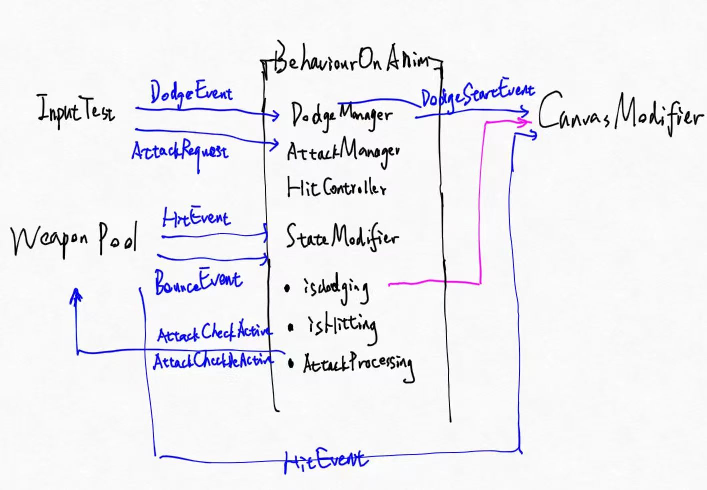

# 情况说明
V1.4 被意外打断了。从六月中旬到7月5日，我一直在学习season技术训练营的技术大纲，Unity ACT demo进度停滞。7.5下午，正在图书馆学习的时候接到了米哈游的提前批通知，心态大受震动。现决定进行一个突击性质的规划，把当前最要紧的几个方向罗列出来，形成需求，然后在7.6-7.14期间尽可能多地实现。

# 要做什么
看一下佑树老师发来的这个demo[一个暑期实习的demo](https://www.bilibili.com/video/BV1mY4y117bT/?spm_id_from=333.337.search-card.all.click&vd_source=04b5865b282b3c8c85d7e5297171363b)，其亮点主要是：异步加载世界、NPC的AI行为树、背包系统、UGUI、存档

我的优点：运动行为更复杂一些；伤判、受击部分做的更好一点；角色资产更屌一些，看起来不会显得非常低级


Part1 UI相关
1.1 实现一个背包系统
1.2 考虑用UGUI知识重做一下UI部分
1.3 考虑仿照tips制作技能

Part2 敌人
2.1 AI行为树
2.2 实现完备的史莱姆敌人

Part3 ShaderLab的效果体现
3.1 探寻其中关于后处理体在攻击时候把画面向中央收缩的具体办法
3.2 打击发生后的震动效果
3.3 裂屏和低生命状态的特效
3.4 剑的激波

至于InputSystem先不改了

tips [Unity简单介绍 如何制作技能系统](https://www.bilibili.com/video/BV1LV411S7d8)


# V2.0 版本2的整体需求设计
从7.6 - 7.14共计9个工作日，这里一共有八项或大或小的工作。最难做的部分是1.2 使用UGUI、1.3 使用UGUI制作技能系统，以及2.1AI行为树。

|版本|时间|内容|
|:--|:--|:--|
|V2.1|7月6日|后处理体把画面向中央收缩以优化翻滚的体验<br> 剑的激波和发射|
|V2.2|||

# V2.1 画面后处理和激波
## 需求定义
翻滚时候应当有画面收缩感、颜色变化以及动态模糊。
研究如何为斩击加上特效激波。

我们原本的翻滚是这样的结构：


DodgeManager类下只有一个事件DodgeStartEvent，这个事件目前只有唯一的听众CanvasModifier。可以把CanvasModifier和我们正要编写的后处理控制脚本合二为一，换言之也就是直接在Canvas对象上添加PostProcessingVolumnController脚本。


HittingPPVolumnController就是我刚才打算编写的后处理体的控制脚本，现在这个脚本就可以通过GetComponent获取兄弟组件Post-ProcessVolumn了。
```
using UnityEngine;
using UnityEngine.Rendering.PostProcessing;
public class HittingPPVolumnController : MonoBehaviour
{
    PostProcessVolume ppv;
    void Start()
    {
        ppv = this.gameObject.GetComponent<PostProcessVolume>();
    }
}
```

这个控制类也应该监听DodgeManager，现在已经整合进了BehaviourOnAnim。
```

```

## P1 post processing package
[包PostProcessing的UnityDoc](https://docs.unity.cn/Packages/com.unity.postprocessing@3.2/manual/index.html)

且package post processing是开源的[后处理包github开源仓库](https://github.com/Unity-Technologies/PostProcessing)

在install之后，向游戏的主摄像机添加组件Post-process Layer。

技能系统的那个Video当中说到的后处理体包括Lens distortion镜头扭曲、Motion blur动态模糊、色像差Chromatic aberration以及Color Adjustments颜色调整。（更困难的效果不是透过后处理体实现的，用菲涅尔效果节点来控制人物的高光光晕效果）所有这些都被称为Effects效果。

主摄像机拥有组件后处理层。一般在另外的游戏对象上添加组件后处理体。后处理体有一项默认为空的属性profile，这里存放一个文件，后缀为.asset，是一个用于记录所有后处理体效果信息的文档。我们所添加的所有effect都是添加在这个文档当中。

## P2 用PPV和PPE进行scripting
[PP包的script API](https://docs.unity.cn/Packages/com.unity.postprocessing@3.2/api/UnityEngine.Rendering.PostProcessing.FloatParameter.html)
ppv的所有effect信息都写在profile当中。我们最终的目的是通过脚本控制ppv视觉效果的强弱。
类PostProcessVolumn有成员profile，这个成员的类型是PostProcessProfile，其通过成员函数AddSettings，GetSettings，RemoveSettings等进行设置的操纵。profile里的一条设置就是我们的一个视觉效果，就比如类`LensDistortion`直接继承自`PostProcessEffectSettings`。

因此我们像这样就可以获取我们想要改变的LensDistortion的Intensity成员：
```
ppv = this.gameObject.GetComponent<PostProcessVolume>();
ppv.profile.GetSetting<LensDistortion>().intensity//...
```
但还有一个困难。instensity并不是一个float量，其类型是`Unity​Engine.​Rendering.​Post​Processing.Float​Parameter`。可以用.value访问其值。

本着实用主义，我们先这样实践一下测测看。现在我们希望一旦翻滚，就进行一个1秒钟的lensdistortion + chromatic Ab。
```
using System.Collections;
using System.Collections.Generic;
using UnityEngine;
using UnityEngine.Rendering.PostProcessing;

public class HittingPPVolumnController : MonoBehaviour
{
    public float secondsEffectToPlay = 1;
    public float lensDisStrengh = 60;
    PostProcessVolume ppv;

    FloatParameter ppv_lensdis_intensity;
    FloatParameter ppv_chromaticAb_intensity;
    void Start()
    {
        GameObject.Find("Myself_new").GetComponent<BehaviourOnAnim>().DodgeStartEvent += HittingPPVolumnController_DodgeStartEvent;
        ppv = this.gameObject.GetComponent<PostProcessVolume>();
        ppv_lensdis_intensity = ppv.profile.GetSetting<LensDistortion>().intensity;
        ppv_chromaticAb_intensity = ppv.profile.GetSetting<ChromaticAberration>().intensity;

    }

    private void HittingPPVolumnController_DodgeStartEvent(object sender, System.EventArgs e)
    {
        Debug.Log("DodgeStarting, volumn effect attaching");
        StartCoroutine(EffectOn());
    }

    IEnumerator EffectOn()
    {
        //ppv_lensdis_intensity.Interp(-100.0f, 0f, 0.3f);
        ppv_lensdis_intensity.value = -lensDisStrengh;
        ppv_chromaticAb_intensity.value = 1;
        yield return new WaitForSeconds(this.secondsEffectToPlay);
        ppv_lensdis_intensity.value = 0.0f;
        ppv_chromaticAb_intensity.value = 0;
    }
}
```

## P3 激波
首先我查到有不少在Unity中使用粒子系统直接开始使用剑气资产的例子，但是这种资产的源头都没有交代。我去UAS上大概搜了一下也没有找到很好的剑气资产拿来主义，而注意到有视频在介绍VEG
tips 最近学的所有包文档位置
[VEG视觉效果图](https://docs.unity.cn/Packages/com.unity.visualeffectgraph@12.1/manual/GettingStarted.html)
[InputSystem输入系统](https://docs.unity3d.com/Packages/com.unity.inputsystem@1.2/index.html)
[PostProcessing后处理](https://docs.unity.cn/Packages/com.unity.postprocessing@3.2/manual/index.html)

VEG和粒子系统是在Unity里面做特效的两种手段。他们之间我认为最主要的差异是能够交互的数据不同。粒子系统的粒子可以交互物理系统；VEG内的粒子是用GPU计算的，其可以广泛调动GPU数据，包括深度数据、颜色buffer等。一般来说VEG做出来的效果会更惊人。当然，粒子系统随后也推出了GPU实例化粒子，也可以自己写着色器来管理这些GPU实例化粒子。 

在制作激波的过程中我碰到的两个坑：一是建模dcc不会用，做出来的mesh比较丑陋；二是渲染模式与纹理导入类型没有选对。

几乎所有的刀光都是带透明效果的，为了体现动感，刀光的一侧是较宽的，另一侧是较薄的，这时候可能小伙伴会有一种直接的想法：我们去建模软件里把刀捏成一侧宽一侧薄的样子就行了。但是我看了大量的刀光制作流程，我发现没有人真的这样做。

事实上在游戏美术制作过程中，大多数的工作都是落在纹理的制作和着色器编写上，直接精确建模难度大且效果差。

我们制作的刀光是这样的，事实上我看到的几款制作流程中，几乎都是这样近似的一个模型：一个扁平的圆环，外侧较锐利内侧稍厚重，整体还是很薄：


用GIMP制作了一个刀身贴图。最一开始我跟了一个制作鬼灭之刃水之呼吸刀型的教程，但是其中没有讲到关于渲染模式等设置的细节，因此一直是错误的效果，不能正确显示透明。后来跟了另一个更简易的教程，这个教程没有用ShaderGragh自己写Shader，而是直接采用了默认着色器：

这当中的这张纹理是使用GIMP制作的，特别需要注意的是：
1. 纹理有内容的部分是一个白色三角形，虽然背景看起来是黑色的，但其实通过GIMP加工，alpha通道与R通道的内容是一样的，也就是说有白色的部分alpha = 1，而没有白色的大部分alpha = 0；
2. 把纹理引入Unity的时候可以在Inspector当中看到引入设置，其中必须选择纹理种类为ShadowMask类型

3. 材质当中有渲染模式选项。能够正常显示透明的默认着色器不止一个，如果选择标准着色器，那么必须在RenderMode里面选择Fade；如果选择Unlit/Transparent，则无需做改动。

最终效果如下。


## P4 应用刀光
刀光事实上可以认为是一个脚本操控的旋转体。由于人物出刀可能会有很多的实际挥砍方向，比如某一招式从左下向右上挥砍，这时候仅仅指定一个particlesystem的根位置是不够的。同时可能不同的挥刀动作

# V2.2 面朝调校以及技能系统设计
## 需求定义
1. 通过修正FaceModifier改正目前的摄像头左右摇动与人物面朝方向不匹配的问题
2. 初步设计、预研和制作技能系统

