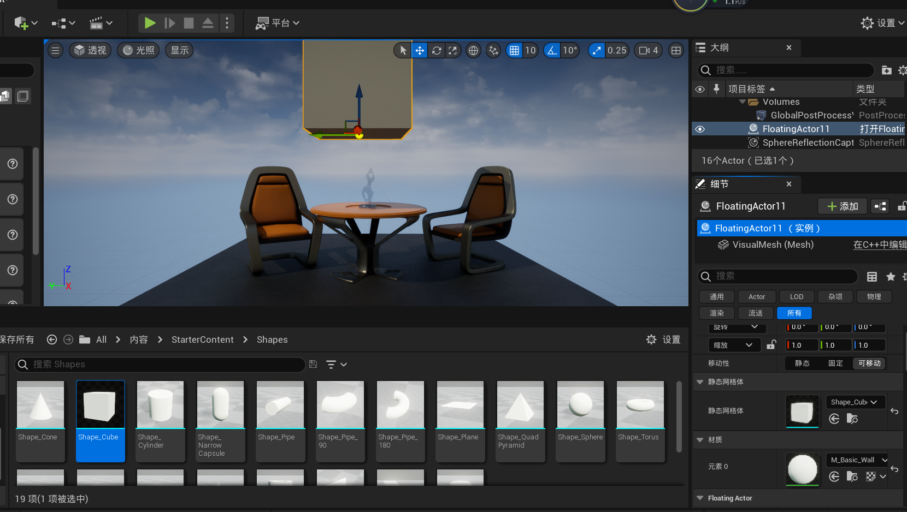

# Unreal Engine 初探

## 前言
UE是一个门槛很高的技术。其前置条件包括：
C语言特别是指针&函数指针
C++面向对象特征，特别是多态(virtual)
C++中的模板函数与模板类
C++中的容器

## 0 环境，工具 & 第一个项目
本文参照这样一些文档资料：
[UE5 DOC 为Unreal引擎设置 VS](https://docs.unrealengine.com/5.0/zh-CN/setting-up-visual-studio-development-environment-for-cplusplus-projects-in-unreal-engine/)
[UE5 DOC UE5 编程快速入门](https://docs.unrealengine.com/5.0/zh-CN/unreal-engine-cpp-quick-start/)

在开始配置之前必须指出，这个初始项目当中包含的内容已经非常非常之多，吃透这个default demo的各个细节将会是非常不错的一件事。

启动 虚幻编辑器。在 项目浏览器 窗口弹出后，点击 游戏 分类并选择 空白 模板。确保已启用了 C++ 和 初学者内容包，选择项目的 保存位置（Save Location） 和 名称，然后点击 创建项目（Create Project）。在本示例中，我们将项目命名为quickstart。


在此时创建后可能会产生一些问题。如果警告GPU驱动版本不足，可以忽视。如果弹出.NET not found，报错页就会提供相应的下载网址，直接下载安装程序并运行安装后会自动配置环境变量等，重试创建即可。


创建好的画面如图所示。与此同时，UE会唤起VS，在VS当中同步打开这个项目。
注意，可以使用~呼出控制台，用指令`culture=en`来切换到英文UI。

下面的内容集中体现了实际UEC++项目开发中，UE和VS两者的合作关系。我们创建一个类。因为版本更新改变了UI，可以这样创建一个C++类：


选择继承Actor类。

给类重新命名。


在内容浏览器中选中新类后，虚幻引擎将会自动编译并重新加载它，VS也将重新加载这个新的类。

此时，VS中的资源视图如下：

我们能够找到`FloatingActor.cpp` & `FloatingActor.h`。

进行如下的修改(官方文档里面一直写添加、改写，有点不明不白。我直接将修改后的代码贴在这里。)
```cpp
//FloatingActor.cpp

#include "FloatingActor1.h"

// Sets default values
AFloatingActor1::AFloatingActor1()
{
 	// Set this actor to call Tick() every frame.  You can turn this off to improve performance if you don't need it.
	PrimaryActorTick.bCanEverTick = true;
	VisualMesh = CreateDefaultSubobject<UStaticMeshComponent>(TEXT("Mesh"));
	VisualMesh->SetupAttachment(RootComponent);

	static ConstructorHelpers::FObjectFinder<UStaticMesh> CubeVisualAsset(TEXT("/Game/StarterContent/Shapes/Shape_Cube.Shape_Cube"));

	if (CubeVisualAsset.Succeeded())
	{
		VisualMesh->SetStaticMesh(CubeVisualAsset.Object);
		VisualMesh->SetRelativeLocation(FVector(0.0f, 0.0f, 0.0f));
	}

}

// Called when the game starts or when spawned
void AFloatingActor1::BeginPlay()
{
	Super::BeginPlay();
	
}

// Called every frame
void AFloatingActor1::Tick(float DeltaTime)
{
	Super::Tick(DeltaTime);
	FVector NewLocation = GetActorLocation();
	FRotator NewRotation = GetActorRotation();
	float RunningTime = GetGameTimeSinceCreation();
	float DeltaHeight = (FMath::Sin(RunningTime + DeltaTime) - FMath::Sin(RunningTime));
	NewLocation.Z += DeltaHeight * 20.0f;       //Scale our height by a factor of 20
	float DeltaRotation = DeltaTime * 20.0f;    //Rotate by 20 degrees per second
	NewRotation.Yaw += DeltaRotation;
	SetActorLocationAndRotation(NewLocation, NewRotation);
}

```
```cpp
//FloatingActor.h

#pragma once

#include "CoreMinimal.h"
#include "GameFramework/Actor.h"
#include "FloatingActor1.generated.h"

UCLASS()
class QUICKSTART_API AFloatingActor1 : public AActor
{
	GENERATED_BODY()
	
public:	
	// Sets default values for this actor's properties
	AFloatingActor1();

protected:
	// Called when the game starts or when spawned
	UPROPERTY(VisibleAnywhere)
	UStaticMeshComponent* VisualMesh;
	virtual void BeginPlay() override;

public:	
	// Called every frame
	virtual void Tick(float DeltaTime) override;

};
```

右键解决方案，生成。

如果出现报错，特别是`Unable to build while Live Coding is active. Exit the editor and game, or press Ctrl+Alt+F11 if iterating on code in the editor or game`报错，应当在UE当中关闭Enable live coding


build完成。


把下方的类对应的物体拖进视口。


下面点击运行即可看到我们的quickstart程序效果。目标cube将会在桌子上方中央缓慢旋转、上下漂浮。可以看到cube在剩余场景上打下的shadow。

和Unity一样，UE也提供把代码中的量引入监视视图(在UE中就是detail视图)中修改的功能。在类的成员前增添前缀：
```cpp
...
public: 
    UPROPERTY(EditAnywhere, BlueprintReadWrite, Category="FloatingActor")
    float FloatSpeed = 20.0f;

    UPROPERTY(EditAnywhere, BlueprintReadWrite, Category="FloatingActor")
    float RotationSpeed = 20.0f;
...
```
就能将成员变量在detail中显示。


### FloatingActor详解
[呵呵老师UE4C++课程 l2](https://www.bilibili.com/video/BV1Y7411s7H8/?spm_id_from=333.999.0.0&vd_source=fcabf2d02580039110de5bfc784d50d5)


`UPROPERTY(VisibleAnywhere) UStaticMeshComponent* VisualMesh;`声明了一个`UStaticMeshComponent`类指针。这被称为静态网格组件。
前缀`UPROPERTY(VisibleAnywhere)`用于公开类的这个成员至编辑器。

这个指针会在构造器中初始化：
```cpp
AFloatingActor1::AFloatingActor1()
{
 	// Set this actor to call Tick() every frame.  You can turn this off to improve performance if you don't need it.
	PrimaryActorTick.bCanEverTick = true;
	VisualMesh = CreateDefaultSubobject<UStaticMeshComponent>(TEXT("Mesh"));
	VisualMesh->SetupAttachment(RootComponent);
	static ConstructorHelpers::FObjectFinder<UStaticMesh> CubeVisualAsset(TEXT("/Game/StarterContent/Shapes/Shape_Cube.Shape_Cube"));
	//...
}
```
RootComponent根组件，在UE中内置了类似于this的定义。如图就是根组件在细节视图中的显示，也就是这个类的一个实例。

SetupAttachment()设定了组件的附加关系，在这里也就是把静态网格体附加到根组件上。

再看下一句：
`static ConstructorHelpers::FObjectFinder<UStaticMesh> CubeVisualAsset(TEXT("/Game/StarterContent/Shapes/Shape_Cube.Shape_Cube"));`
这种写法是UE中**查找资源**的惯用写法。可以看到括号内实际上是一个文件路径，这指引了声明的对象`CubeVisualAsset`去查找对应的资产。我们可以在UE当中直接打开这个路径，发现名为Shape_Cube的这个资产。

需要指出，这种资源引用手段，也就是用C++代码写明一个类对象该引用哪种资产(也就是**硬编码**)，是非常不灵活的。我们给出一种替代方案。
首先，把VisualMesh前缀的`UPROPERTY(VisibleAnywhere)`给他删掉；之后把那段设置VisualMesh的代码也全都删掉：
```cpp
AFloatingActor1::AFloatingActor1()
{
	PrimaryActorTick.bCanEverTick = true;
	VisualMesh = CreateDefaultSubobject<UStaticMeshComponent>(TEXT("Mesh"));
	VisualMesh->SetupAttachment(RootComponent);
}
```
构造器就被删成这个样子。
这样做的话，我们将无法在右侧detail当中看到这个对象的VisualMesh内容：


此时，我们拖动之前找到的位置下的shape，拖动到右侧Mesh的静态网格体内。

编译器提示，只有当这个量设置为FProperty时候才可编译。那我们就重新设置成UProperty，此时就可以通过拖动来把物体还原成之前的CUbe形状了。


最后再看看Tick函数。
```cpp
void AFloatingActor1::Tick(float DeltaTime)
{
	Super::Tick(DeltaTime);
	FVector NewLocation = GetActorLocation();
	FRotator NewRotation = GetActorRotation();
	float RunningTime = GetGameTimeSinceCreation();
	float DeltaHeight = (FMath::Sin(RunningTime + DeltaTime) - FMath::Sin(RunningTime));
	NewLocation.Z += DeltaHeight * FloatSpeed;       //Scale our height by a factor of 20
	float DeltaRotation = DeltaTime * RotationSpeed;    //Rotate by 20 degrees per second
	NewRotation.Yaw += DeltaRotation;
	SetActorLocationAndRotation(NewLocation, NewRotation);
}
```
DeltaHeight = (FMath::Sin(RunningTime + DeltaTime) - FMath::Sin(RunningTime)); 这里要注意，DeltaTime是Tick的参数，也是受帧数影响的一个动态值。但是在程序中我们可以认定DeltaTime是固定值，比如30帧的程序，DeltaTime就是1/30s。如果用和差化积去解，可以发现这其实是关于RunningTime的一个三角函数，其值在[-1，1]之间。
特别要讲一下的就是NewRotation.Yaw，旋转作为一个Vector3，在UE里不用xyz来表示，而是用roll，yaw，pitch三个角(滚转，俯仰，偏航)来表达。


### 玩家控制Camera
早期几个项目可以随用随建，也不用保存。
[UE官方文档 玩家控制Camera示例](https://docs.unrealengine.com/5.0/zh-CN/quick-start-guide-to-player-controlled-cameras-in-unreal-engine-cpp/)

创建一个C++类：
