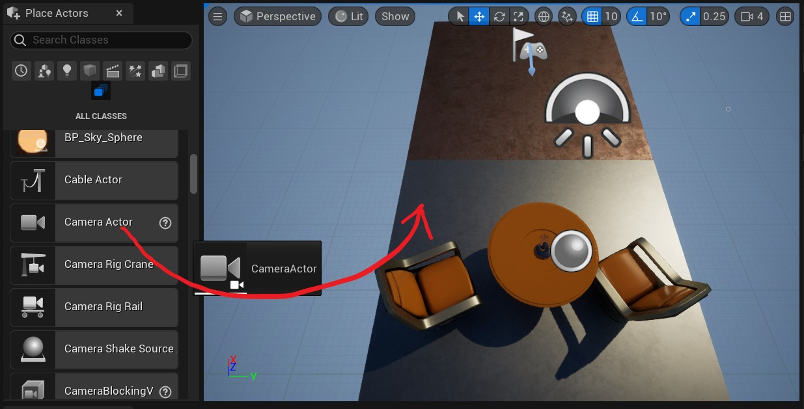

# Unreal Engine 初探

## 前言
UE的学习前置条件包括：
C语言特别是指针&函数指针
C++面向对象特征，特别是多态(virtual)
C++中的模板函数与模板类
C++中的容器

## 0 环境，工具 & 第一个项目
本文参照这样一些文档资料：
[UE5 DOC 为Unreal引擎设置 VS](https://docs.unrealengine.com/5.0/zh-CN/setting-up-visual-studio-development-environment-for-cplusplus-projects-in-unreal-engine/)
[UE5 DOC UE5 编程快速入门](https://docs.unrealengine.com/5.0/zh-CN/unreal-engine-cpp-quick-start/)

在开始配置之前必须指出，这个初始项目当中包含的内容已经非常非常之多，吃透这个default demo的各个细节将会是非常不错的一件事。

启动 虚幻编辑器。在 项目浏览器 窗口弹出后，点击 游戏 分类并选择 空白 模板。确保已启用了 C++ 和 初学者内容包，选择项目的 保存位置（Save Location） 和 名称，然后点击 创建项目（Create Project）。在本示例中，我们将项目命名为quickstart。


在此时创建后可能会产生一些问题。如果警告GPU驱动版本不足，可以忽视。如果弹出.NET not found，报错页就会提供相应的下载网址，直接下载安装程序并运行安装后会自动配置环境变量等，重试创建即可。


创建好的画面如图所示。与此同时，UE会唤起VS，在VS当中同步打开这个项目。
注意，可以使用~呼出控制台，用指令`culture=en`来切换到英文UI。

下面的内容集中体现了实际UEC++项目开发中，UE和VS两者的合作关系。我们创建一个类。因为版本更新改变了UI，可以这样创建一个C++类：


选择继承Actor类。

给类重新命名。


在内容浏览器中选中新类后，虚幻引擎将会自动编译并重新加载它，VS也将重新加载这个新的类。

此时，VS中的资源视图如下：

我们能够找到`FloatingActor.cpp` & `FloatingActor.h`。

进行如下的修改(官方文档里面一直写添加、改写，有点不明不白。我直接将修改后的代码贴在这里。)
```cpp
//FloatingActor.cpp

#include "FloatingActor1.h"

// Sets default values
AFloatingActor1::AFloatingActor1()
{
 	// Set this actor to call Tick() every frame.  You can turn this off to improve performance if you don't need it.
	PrimaryActorTick.bCanEverTick = true;
	VisualMesh = CreateDefaultSubobject<UStaticMeshComponent>(TEXT("Mesh"));
	VisualMesh->SetupAttachment(RootComponent);

	static ConstructorHelpers::FObjectFinder<UStaticMesh> CubeVisualAsset(TEXT("/Game/StarterContent/Shapes/Shape_Cube.Shape_Cube"));

	if (CubeVisualAsset.Succeeded())
	{
		VisualMesh->SetStaticMesh(CubeVisualAsset.Object);
		VisualMesh->SetRelativeLocation(FVector(0.0f, 0.0f, 0.0f));
	}

}

// Called when the game starts or when spawned
void AFloatingActor1::BeginPlay()
{
	Super::BeginPlay();
	
}

// Called every frame
void AFloatingActor1::Tick(float DeltaTime)
{
	Super::Tick(DeltaTime);
	FVector NewLocation = GetActorLocation();
	FRotator NewRotation = GetActorRotation();
	float RunningTime = GetGameTimeSinceCreation();
	float DeltaHeight = (FMath::Sin(RunningTime + DeltaTime) - FMath::Sin(RunningTime));
	NewLocation.Z += DeltaHeight * 20.0f;       //Scale our height by a factor of 20
	float DeltaRotation = DeltaTime * 20.0f;    //Rotate by 20 degrees per second
	NewRotation.Yaw += DeltaRotation;
	SetActorLocationAndRotation(NewLocation, NewRotation);
}

```
```cpp
//FloatingActor.h

#pragma once

#include "CoreMinimal.h"
#include "GameFramework/Actor.h"
#include "FloatingActor1.generated.h"

UCLASS()
class QUICKSTART_API AFloatingActor1 : public AActor
{
	GENERATED_BODY()
	
public:	
	// Sets default values for this actor's properties
	AFloatingActor1();

protected:
	// Called when the game starts or when spawned
	UPROPERTY(VisibleAnywhere)
	UStaticMeshComponent* VisualMesh;
	virtual void BeginPlay() override;

public:	
	// Called every frame
	virtual void Tick(float DeltaTime) override;

};
```

右键解决方案，生成。

如果出现报错，特别是`Unable to build while Live Coding is active. Exit the editor and game, or press Ctrl+Alt+F11 if iterating on code in the editor or game`报错，应当在UE当中关闭Enable live coding


build完成。


把下方的类对应的物体拖进视口。


下面点击运行即可看到我们的quickstart程序效果。目标cube将会在桌子上方中央缓慢旋转、上下漂浮。可以看到cube在剩余场景上打下的shadow。

和Unity一样，UE也提供把代码中的量引入监视视图(在UE中就是detail视图)中修改的功能。在类的成员前增添前缀：
```cpp
...
public: 
    UPROPERTY(EditAnywhere, BlueprintReadWrite, Category="FloatingActor")
    float FloatSpeed = 20.0f;

    UPROPERTY(EditAnywhere, BlueprintReadWrite, Category="FloatingActor")
    float RotationSpeed = 20.0f;
...
```
就能将成员变量在detail中显示。


### 0.1 FloatingActor详解
[呵呵老师UE4C++课程 l2](https://www.bilibili.com/video/BV1Y7411s7H8/?spm_id_from=333.999.0.0&vd_source=fcabf2d02580039110de5bfc784d50d5)


`UPROPERTY(VisibleAnywhere) UStaticMeshComponent* VisualMesh;`声明了一个`UStaticMeshComponent`类指针。这被称为静态网格组件。
前缀`UPROPERTY(VisibleAnywhere)`用于公开类的这个成员至编辑器。

这个指针会在构造器中初始化：
```cpp
AFloatingActor1::AFloatingActor1()
{
 	// Set this actor to call Tick() every frame.  You can turn this off to improve performance if you don't need it.
	PrimaryActorTick.bCanEverTick = true;
	VisualMesh = CreateDefaultSubobject<UStaticMeshComponent>(TEXT("Mesh"));
	VisualMesh->SetupAttachment(RootComponent);
	static ConstructorHelpers::FObjectFinder<UStaticMesh> CubeVisualAsset(TEXT("/Game/StarterContent/Shapes/Shape_Cube.Shape_Cube"));
	//...
}
```
RootComponent根组件，在UE中内置了类似于this的定义。如图就是根组件在细节视图中的显示，也就是这个类的一个实例。

SetupAttachment()设定了组件的附加关系，在这里也就是把静态网格体附加到根组件上。

再看下一句：
`static ConstructorHelpers::FObjectFinder<UStaticMesh> CubeVisualAsset(TEXT("/Game/StarterContent/Shapes/Shape_Cube.Shape_Cube"));`
这种写法是UE中**查找资源**的惯用写法。可以看到括号内实际上是一个文件路径，这指引了声明的对象`CubeVisualAsset`去查找对应的资产。我们可以在UE当中直接打开这个路径，发现名为Shape_Cube的这个资产。

需要指出，这种资源引用手段，也就是用C++代码写明一个类对象该引用哪种资产(也就是**硬编码**)，是非常不灵活的。我们给出一种替代方案。
首先，把VisualMesh前缀的`UPROPERTY(VisibleAnywhere)`给他删掉；之后把那段设置VisualMesh的代码也全都删掉：
```cpp
AFloatingActor1::AFloatingActor1()
{
	PrimaryActorTick.bCanEverTick = true;
	VisualMesh = CreateDefaultSubobject<UStaticMeshComponent>(TEXT("Mesh"));
	VisualMesh->SetupAttachment(RootComponent);
}
```
构造器就被删成这个样子。
这样做的话，我们将无法在右侧detail当中看到这个对象的VisualMesh内容：


此时，我们拖动之前找到的位置下的shape，拖动到右侧Mesh的静态网格体内。

编译器提示，只有当这个量设置为FProperty时候才可编译。那我们就重新设置成UProperty，此时就可以通过拖动来把物体还原成之前的CUbe形状了。


最后再看看Tick函数。
```cpp
void AFloatingActor1::Tick(float DeltaTime)
{
	Super::Tick(DeltaTime);
	FVector NewLocation = GetActorLocation();
	FRotator NewRotation = GetActorRotation();
	float RunningTime = GetGameTimeSinceCreation();
	float DeltaHeight = (FMath::Sin(RunningTime + DeltaTime) - FMath::Sin(RunningTime));
	NewLocation.Z += DeltaHeight * FloatSpeed;       //Scale our height by a factor of 20
	float DeltaRotation = DeltaTime * RotationSpeed;    //Rotate by 20 degrees per second
	NewRotation.Yaw += DeltaRotation;
	SetActorLocationAndRotation(NewLocation, NewRotation);
}
```
DeltaHeight = (FMath::Sin(RunningTime + DeltaTime) - FMath::Sin(RunningTime)); 这里要注意，DeltaTime是Tick的参数，也是受帧数影响的一个动态值。但是在程序中我们可以认定DeltaTime是固定值，比如30帧的程序，DeltaTime就是1/30s。如果用和差化积去解，可以发现这其实是关于RunningTime的一个三角函数，其值在[-1，1]之间。
特别要讲一下的就是NewRotation.Yaw，旋转作为一个Vector3，在UE里不用xyz来表示，而是用roll，yaw，pitch三个角(滚转，俯仰，偏航)来表达。


### 0.2 脚本控制的Camera
早期几个项目可以随用随建，也不用保存。
[UE官方文档 玩家控制Camera示例](https://docs.unrealengine.com/5.0/zh-CN/quick-start-guide-to-player-controlled-cameras-in-unreal-engine-cpp/)
[UE官方文档 游戏摄像机](https://docs.unrealengine.com/5.0/zh-CN/quick-start-guide-to-implementing-automatic-camera-control-in-unreal-engine-cpp/)

camera是游戏程序的眼睛，是不可或缺的组件。在程序中引入camera组件有几种常用办法。
一，便捷-低扩展性
如果你几乎不需要这个摄像机有任何行为，只需要其固定在一个位置输出画面就可以，最好选择这种方法。

选择Place Actors下的All Classes。

选择Camera Actor，并把这个组件拖到场景内。



由于Camera Actor本身就内置了摄像机的功能，随之我们就能看到Camera看到的实际图像内容。


二、另一种方法
拖一个cube到场景内。


在Outliner当中点选我们刚才创建的Cube，在Details页面点选Add，就可以为Cube增添新的组件。

选择Camera组件。


这样做和做法1几乎没有功能区别，只是我们的camera在别的camera看来会是一个立方体的样子。


官方文档中设计了一个镜头切换程序。用一个名为CameraDirector的类来控制两个摄像机的行为。
创建C++类：


编写代码如下：
```cpp
//CameraDirector.cpp
#include "CameraDirector.h"
#include "Kismet/GameplayStatics.h"

// Sets default values
ACameraDirector::ACameraDirector()
{
 	// Set this actor to call Tick() every frame.  You can turn this off to improve performance if you don't need it.
	PrimaryActorTick.bCanEverTick = true;
}

// Called when the game starts or when spawned
void ACameraDirector::BeginPlay()
{
	Super::BeginPlay();
}
// Called every frame
void ACameraDirector::Tick(float DeltaTime)
{
	Super::Tick(DeltaTime);
	TimeToNextCameraChange -= DeltaTime;
	if (TimeToNextCameraChange <= 0.0f) {
		//change时间间隔已到，是时候切换摄像头
		TimeToNextCameraChange += TimeBetweenCameraChanges;

		APlayerController* ourPlayerController = UGameplayStatics::GetPlayerController(this, 0);
		if (ourPlayerController) {
			if (CameraTwo && (ourPlayerController->GetViewTarget() == CameraOne)) {
				ourPlayerController->SetViewTargetWithBlend(CameraTwo, SmoothBlendTime);
				//平滑地混合过渡到camera2
			}
			else if (CameraOne) {
				ourPlayerController->SetViewTargetWithBlend(CameraOne);
			}
		}	
	}
}

```

```cpp
//CameraDirector.h
#pragma once

#include "CoreMinimal.h"
#include "GameFramework/Actor.h"
#include "CameraDirector.generated.h"

UCLASS()
class QUICKSTART2_API ACameraDirector : public AActor
{
	GENERATED_BODY()
	
public:	
	// Sets default values for this actor's properties
	ACameraDirector();

protected:
	// Called when the game starts or when spawned
	virtual void BeginPlay() override;
	UPROPERTY(EditAnywhere) AActor* CameraOne;
	UPROPERTY(EditAnywhere) AActor* CameraTwo;
	float TimeToNextCameraChange;
	float TimeBetweenCameraChanges = 2.0f;
	float SmoothBlendTime = 0.75f;

public:	
	// Called every frame
	virtual void Tick(float DeltaTime) override;
};
```

把CameraDirector拖入场景，再用上面提过的方法新增两个Camera。在CameraDirector对象的Details页中，能够找到我们用UPROPERTY(EditAnywhere)标记的CameraOne和CameraTwo成员：在这两个成员的下拉菜单中选定为刚才创建的两个camera。


然后运行就可以看到效果。

我在阅读tick逻辑的时候产生了一个困惑。
判断了(TimeToNextCameraChange <= 0.0f)的情况下，(CameraTwo && (ourPlayerController->GetViewTarget() == CameraOne))也为true，这时候运行`ourPlayerController->SetViewTargetWithBlend(CameraTwo, SmoothBlendTime);`表示要把当前view平滑转换到CameraTwo上；那下一帧的时候，判断``ourPlayerController->GetViewTarget()``得到的值是什么？如果还是CameraOne，岂不是又要重新调用一次SetViewTargetWithBlend(CameraTwo, SmoothBlendTime)；如果会变成CameraTwo，那其实就达不到SmoothBlend的目标了，会立刻执行``ourPlayerController->SetViewTargetWithBlend(CameraOne)``,视角又转回了SmoothBlend。

由于SetViewTargetWithBlend()的实现逻辑是不可见的，我做出了两个对于如何实现这个SetViewTargetWithBlend()函数合理猜测：
1.对于ViewTarget管理添加规则，如果某时刻对某对象调用了SetViewTargetWithBlend，那么在SmoothBlendTime时间内，也就是这次ViewTarget改写还没有结束之前，都不受理新的SetViewTargetWithBlend。如果是这样，那么下一帧的GetViewTarget()结果应该保持不变，仍然是CameraOne。
2.对于SmoothBlendTime做引用传参(当然查阅一下PlayerController.h发现似乎没有这样做)，每一帧都对SmoothBlendTime扣掉DeltaTime。

作业：
1. 将摄像机附加到移动Actor上来创建摇臂或移动车镜头。

2. 使用一个数组变量来存储摄像机，而不是摄像机1（CameraOne）和摄像机2（CameraTwo），这样你就可以遍历任意数量摄像机的序列，而不是仅仅两个。

3. 不要使用Actor指针来存储摄像机，而是创建一个结构来保持指针以及在更改视图之前的时间，并将时间混合到新视图中。

作业1，我们先来写一个摄影车类，其逻辑就是一个绕场运动，写好后我们把Camera组件附加到车上。

```cpp
//CarWithCamera.cpp
void ACarWithCamera::Tick(float DeltaTime)
{
	Super::Tick(DeltaTime);
	FVector curLocation = GetActorLocation();

	EverSinceBeginLength += DeltaTime * CarMoveSpeed;
	EverSinceBeginLength = EverSinceBeginLength > 1960.0f ? EverSinceBeginLength - 1960.0f : EverSinceBeginLength;
	if (EverSinceBeginLength <= 340.0f) {
		curLocation.X = 200.0f;
		curLocation.Y = EverSinceBeginLength - 200.0f;
	}
	else {
		if (EverSinceBeginLength <= 980.0f) {
			curLocation.Y = 140.0f;
			curLocation.X = 200.0f - (EverSinceBeginLength - 340.0f);
		}
		else {
			if (EverSinceBeginLength <= (980.0f + 340.0f)) {
				curLocation.X = -440.0f;
				curLocation.Y = 140.0f - (EverSinceBeginLength - 980.0f);
			}
			else {
				curLocation.X = -440.0f + (EverSinceBeginLength - 980.0f - 340.0f);
				curLocation.Y = -200.0f;
			}
		} 
	}
	SetActorLocation(curLocation);
}
```
只要车会跑，在车上Add Component加上一个Camera Actor，就完成了这个任务。
这个项目期间发现有一些事情会导致build失败：所有量都要用.0f后缀标注成浮点数。让浮点变量等于int、比较int似乎都会不报错地导致build失败。
同时，把两个类都放在同一个项目下去build也通过不了。

作业2，要做一个摄像机阵列。我尝试了一下，发现常规C++语法写起来怎么改也无法通过。原本的CameraOne 和 CameraTwo 都是AActor* ，即可AActor指针，如果要直接扩展，就会形成一个AActor*指针的数组，形如AActor **。

我在场景里一口气建了6个相机，并把他们绑定到CameraDirector的CameraList上：

```cpp
//CameraDirector.cpp

#include "CameraDirector.h"
#include "quickstart2.h"
#include "Kismet/GameplayStatics.h"

// Sets default values
ACameraDirector::ACameraDirector()
{
 	// Set this actor to call Tick() every frame.  You can turn this off to improve performance if you don't need it.
	PrimaryActorTick.bCanEverTick = true;
	CameraList.Init(nullptr, 6);
	
}

// Called when the game starts or when spawned
void ACameraDirector::BeginPlay()
{
	Super::BeginPlay();
	APlayerController* ourPlayerController = UGameplayStatics::GetPlayerController(this, 0);
	if (ourPlayerController && CameraList.Num() > 0 && CameraList[0] != nullptr) {
		ourPlayerController->SetViewTarget(CameraList[0]);
	}
}

// Called every frame
void ACameraDirector::Tick(float DeltaTime)
{
	Super::Tick(DeltaTime);

	TimeToNextCameraChange -= DeltaTime;
	if (TimeToNextCameraChange <= 0.0f) {
		//change时间间隔已到，是时候切换摄像头
		TimeToNextCameraChange += TimeBetweenCameraChanges;
		

		APlayerController* ourPlayerController = UGameplayStatics::GetPlayerController(this, 0);
		if (ourPlayerController) {
			GEngine->AddOnScreenDebugMessage(-1, 10.0f, FColor::Red, FString::Printf(TEXT("curCameraIndex=%d"),(int)curCameraIndex));
			if (curCameraIndex == 5) {
				curCameraIndex = 0;
				if (CameraList[curCameraIndex]!=nullptr && ourPlayerController->GetViewTarget() == CameraList[5]) {
					ourPlayerController->SetViewTarget(CameraList[curCameraIndex]);
				}
			}
			else {
				if (CameraList[curCameraIndex+1]!=nullptr && ourPlayerController->GetViewTarget() == CameraList[curCameraIndex]) {
					ourPlayerController->SetViewTargetWithBlend(CameraList[curCameraIndex+1], SmoothBlendTime);
				}
				curCameraIndex++;
			}
		}	
	}
}
```

```cpp
//CameraDirector.h
#pragma once

#include "CoreMinimal.h"
#include "GameFramework/Actor.h"
#include "CameraDirector.generated.h"

UCLASS()
class QUICKSTART2_API ACameraDirector : public AActor
{
	GENERATED_BODY()
	
public:	
	// Sets default values for this actor's properties
	ACameraDirector();

protected:
	// Called when the game starts or when spawned
	virtual void BeginPlay() override;
	//UPROPERTY(EditAnywhere) AActor* CameraOne;
	//UPROPERTY(EditAnywhere) AActor* CameraTwo;
	UPROPERTY(EditAnywhere) TArray<AActor*> CameraList; 

	UPROPERTY(VisibleAnywhere) int32 curCameraIndex = 0;
	float TimeToNextCameraChange = 0.0f;
	UPROPERTY(EditAnywhere) float TimeBetweenCameraChanges = 2.0f;
	UPROPERTY(EditAnywhere) float SmoothBlendTime = 0.75f;

public:	
	// Called every frame
	virtual void Tick(float DeltaTime) override;
};
```
看一下效果：


## 1 UE动画系统
### fbx文件格式
FBX是一种灵活的文件格式，归Autodesk所有，可以提供数字内容创建（DCC）应用程序之间的互操作性。某些应用程序（例如Autodesk Motionbuilder）本身支持该格式。而Autodesk Maya、Autodesk 3ds Max和Blender等其他软件使用FBX插件支持该格式。

在学习开发技术的这段时间里，几乎用过的每一个软件都支持FBX文件。FBX文件以一体的格式囊括了四个重要部分：
静态网格体
骨骼网格体
动画
变形目标

且FBX几乎是完全服务于动画的——尽管你也可以使用FBX的格式而只使用一个静态网格体。
### 从3dsMax到UE的FBX动画导出

我在3dsMax里做了一个这样的小动画，并将其导出。

在UE中选择Add to project-import content，选择我们导出的fbx文件。

导出完得到了这样一批资产：
|资产名|资产类型|对应颜色|
|--|--|--|
|robot_arm_总臂|Skeleton Mesh|粉色|
|robot_arm_总臂_Anim|Animation Sequence|绿色|
|robot_arm_总臂_PhysicsAsset|Physic Assets|橙色|
|robot_arm_总臂_Skeleton|skeleton|天蓝色|
|robot_arm_被抓物体_Anim|Animation Sequence|绿色|
|robot_arm_被抓物体_PhysicsAsset|Physic Assets|橙色|
|robot_arm_被抓物体_Skeleton|skeleton|天蓝色|

由于我在3dsMax当中设计动画的时候就牵扯到两个物体：

可以看到，对于这两个物体，共计生成出了7个资产，只有总臂这个物体生成了Skeleton Mesh。

只要把绿色的animation sequence拖动到场景里，运行gameplay就可以看到动画了。整个过程的确比Unity当中要顺利一些。


调试一番后发现，如果把这两个物体彻底分开，那么就没法在动画层面体现它们两者的关系了。应该在3dsMax中设定一个父物体，包含被抓物体和总臂两个物体，这样导出的时候就不会导成两个物体了。


## 2 UE反射系统 & UE中的对象
### 闲话
我们在学习过程中追求平衡。Par0比较实践，那么par1就要介绍一些必要的抽象的概念了。
### UObject & UCLASS宏
UE包含一个用于处理游戏对象的强大系统。虚幻引擎中所有对象都继承自`UObject`。而 UCLASS 宏的作用是标记 UObject 的子类， 以便 UObject 处理系统可以识别它们。

[UE官方文档 UE中的对象](https://docs.unrealengine.com/5.0/zh-CN/objects-in-unreal-engine/)
[《InsideUE4》UObject（一）开篇 by 大钊 zhihu](https://zhuanlan.zhihu.com/p/24319968)
[《InsideUE4》UObject（二）类型系统概述  by大钊 zhihu ](https://zhuanlan.zhihu.com/p/24445322)

这一点在我们上面的项目中均有所体现，在我们编写的类的头文件当中，总可以看到：
```cpp
UCLASS()
class QUICKSTART2_API ACameraDirector : public AActor
{
	//...
};
```

UCLASS 宏为 UObject 提供了一个 UCLASS 引用，用于描述它在虚幻引擎中的类型。

### 反射
反射本身的意思是，计算机程序执行中途可以访问、检测、修改自身的属性或者状态的一种能力。

一个事实：sizeof(UObject)==56.既然任何游戏对象都会继承UObject，那么这56字节数据会在任何一个对象里存留一个副本，100万个对象就需要53MB来存这些数据。

现如今，UE正不断提倡将游戏逻辑放在blueprint可视化编程当中完成，而C++只充当蓝图的虚拟机。


## 2 UE架构
[UE官方文档：UPROPERTY](https://docs.unrealengine.com/5.0/zh-CN/unreal-engine-uproperties/)

```cpp
UPROPERTY([specifier, specifier, ...], [meta(key=value, key=value, ...)])
Type VariableName;
```
UPROPERTY是一个宏，其内容包含核心数据类型 & 属性说明符 两个重要组成部分。我们所写的`UPROPERTY(EditAnywhere)`当中的EditAnywhere就是一个属性说明符。


`Category="TopCategory|SubCategory|..."`在Detail当中声明栏目，当前property会被放置在字符串描述名称的栏目下。用|表示嵌套栏目。

UPROPERTY的底层机制就是UE反射。

**A开头的，代码上都继承与Actor，从而可以放在场景中；而U开头的均继承于UComponent，其属于组件。组件不可以直接丢进场景，而必须附加在Actor上。**