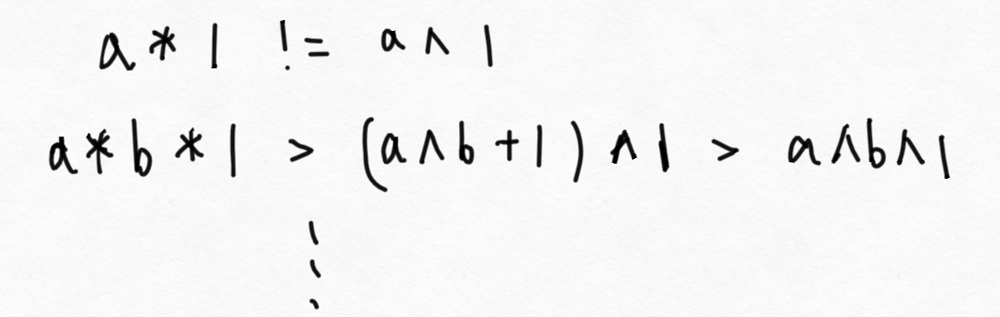
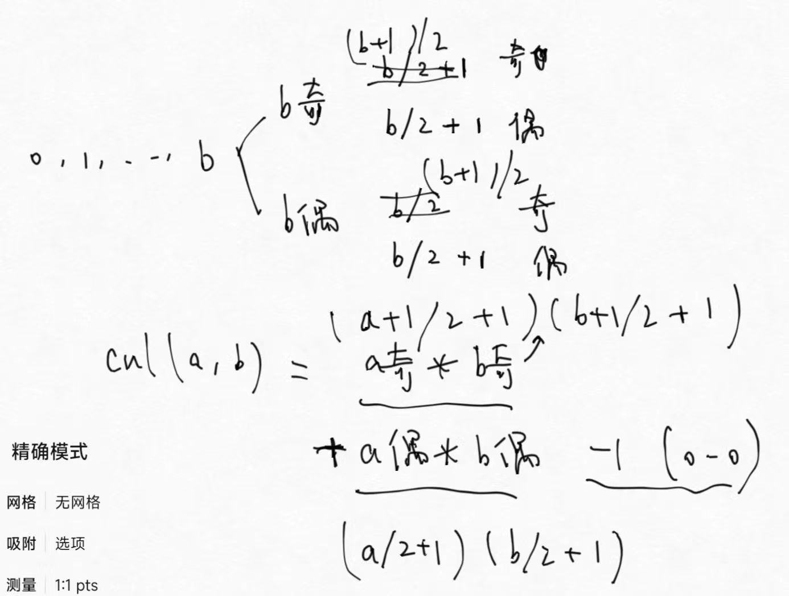
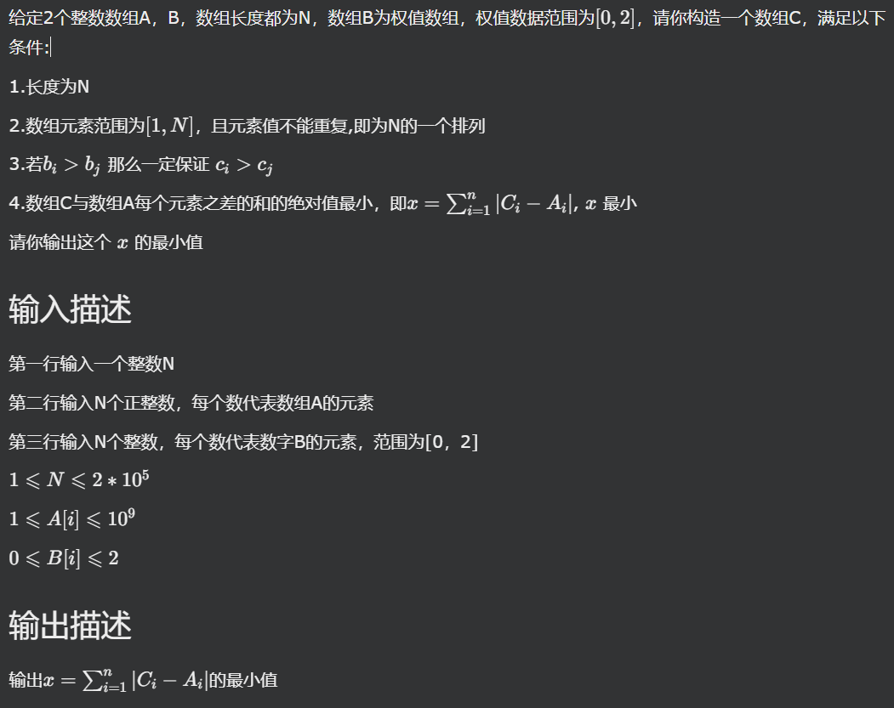
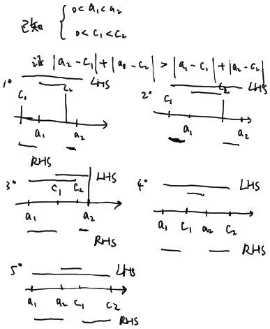
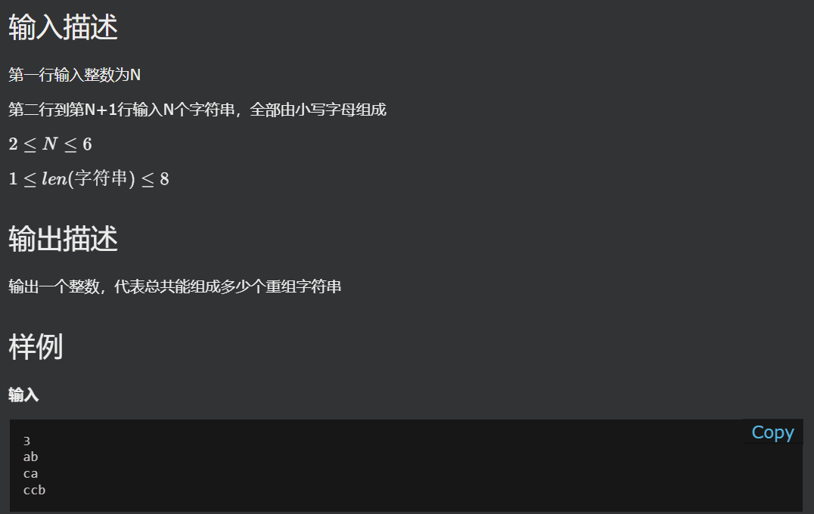

# 前言
推荐公众号塔子哥讲算法，很多这里的题目塔子哥都有题解，并且有oj供大家练习，纯纯的活菩萨，希望后面也保持初心捏

# 基本功和一些思考
做了一段时间笔试，经常发现在vector特定位置删除很憋shi，标准库提供的几个办法都有点麻烦;
`erase()`要求使用迭代器，但是很多时候我们不喜欢迭代器遍历，而是喜欢下标遍历，比如我如果要求在倒数第二项停下来，迭代器就比较难写了。我们用erase来实现一个删除i下标
```cpp
    std::vector<int> vec = {1, 2, 3, 4, 5, 6};
    // 想删3下标位置，也就是4
    using namespace std;
    int i = 3;
    vec.erase(vec.begin() + i);
    for (auto it : vec)
    {
        std::cout << it << std::endl;
    }
```
如果是特定查找条件，迭代器直接作为参数进行删操作即可：
```cpp
    std::vector<int> vec = {1, 2, 3, 4, 5, 6};
    // 想删值=4的所有项
    int target = 4;
    for (int i = 0; i < vec.size(); i++)
    {
        if (vec[i] == target)
        {
            vec.erase(vec.begin() + i);
        }
    }
```
这个做法是不会出错的，哪怕最后一项=4，因为随着vec删减，vec.size动态更新了，而使用纯迭代器遍历就会有问题了，不论

## Q1（3.26腾讯Q3）
给你一个正整数组，输出这个数组有多少个这样的连续子数组：子数组内的所有数，他们的乘积=他们的异或 [塔子哥oj](http://101.43.147.120/p/P1125)
### 心得简评
笔试的当时连异或都不会求了 因此没有找到事实上的规律；异或属于位运算部分，是很多题库都会单列出来讨论的知识，属实不应该，其实用手推一推很快就能发现规律
### 理解
一个重要的经验是，对于正整数，`a * b` 是比 `a ^ b`大得多的。两数的异或最大的上限是二进制更长的那个数的全部置1，比如1011^0100 = 1111，异或的结果不会比更大那个数 的两倍大——而两者乘积大多数时候都比大数的两倍大(只要小数>2)。
这提示我们思考，如何能让两数的成绩增长的慢一些，从而让异或和成绩相等。
我们注意到，`a * 1 = a` 而 `a ^ 1 = a + 1 or a - 1`,其中奇数异或1减少，偶数异或1增加。哪怕仅仅是把1 换成 2，异或与成绩的差距也会变得太大。
那么我们至少注意到：
**1. 把任何1个数和两个1配对，乘积会等于异或**
**2. 单一的数总是解**

那么近一步地，除了上述两种方法还能产出解吗？
假设一个组中没有1，那么显然乘积将会远远超越异或；
再假设一个组中有奇数个1，根据上面的推理也就等效于有1个1。


结论是没有其他的办法产生解了。

那么问题也就变成，如何降低复杂度。如果用冒泡序遍历所有连续子数组，对每个子数组数1，复杂度将来到`O(n^3)`, 能过就有鬼了

我设计了这样一套办法：首先所有单一数都是要算上的，此外我们对于数组中所有不等于0的位置计数其左右连续的1的总和，比如x的左侧有a个1，右侧有b个1，做这件事儿需要`O(n^2)`，且事实上比较接近O(n);根据左a右b计算解的数量也是个简单但绕人的地方，也就是左侧取出奇数右侧取出奇数+左侧取出偶数右侧取出偶数 - 1，最后的1代表被重复计算的左0右0

（a奇b奇里面都多写了一个+1）
此外，再写一个连续的1的处理函数。因为我们之前统计了所有非1的数和左右1组合作为解；但是实际上1也可以和偶数个1联合成为解。这在下面代码中的calN中体现。
而且这个过程也是可以被加速的，因为事实上比如cal(3,5)可能就会被多次计算。不过我们可以先写一版代码试一试超不超时
```cpp
#include <iostream>
#include <vector>

long long calAB(int a, int b)
{
    long long result = 0;
    result += ((a + 1) / 2) * ((b + 1) / 2);
    result += (a / 2 + 1) * (b / 2 + 1) - 1;
    return result;
}
long long calN(int n)
{
    long long result = 0;
    long long k = n / 2;
    if (n % 2 == 0)
    {
        result = k * (k - 1);
    }
    else
    {
        result = k * k;
    }
    return result;
}
int main()
{
    using namespace std;
    long long res = 0;
    int N = 0;
    cin >> N;
    vector<long long> num(N, 0);
    for (int i = 0; i < N; i++)
        cin >> num[i];

    for (int i = 0; i < N; i++)
    {
        if (num[i] == 1)
            continue; // 连续1后面统一处理
        int k = i - 1;
        int a = 0;
        int b = 0;
        while (k >= 0 && num[k] == 1)
        {
            a++;
            k--;
        }
        k = i + 1;
        while (k < N && num[k] == 1)
        {
            b++;
            k++;
        }
        res += calAB(a, b);
    }
    int i = 0;
    while (i < N)
    {
        if (num[i] != 1)
        {
            i++;
            continue;
        }
        int count = 1;
        i++;
        while (i < N && num[i] == 1)
        {
            count++;
            i++;
        }
        res += calN(count);
    }

    res += N;
    cout << res;
    return 0;
}
```
tip:先试试超不超时的意义在于，如果出来WA，说明现有框架是可以走的，就不用再想办法优化过程了

## Q2（3.26腾讯Q4）
### 描述
给你一个整数数组A，再给你一个数组B，B的任何值都是[0, 1, 2],构造一个整数数组C，让sum|A-C|最小，必须满足任何的i< j如果B[i] > B[j]，那么C[i] > C[j],C中的n个数是1-n的排列，n=A.size


（图中条件3差一个对于任意i < j的前置）

### 心得简评
这道题乍一看非常绕，考试的时候我也觉得构造这个事儿挺难的，就放弃了，其实是读题有一点点误解，没看到C = 1-n这个条件；然后看完了解答一思考，感觉还是很简单的。
退一步越想越气。读题真的很重要，而且在笔试中，敏锐判断一个题的真实等级是很重要的，这道题对于打笔试打的很少的我来说一眼就非常唬人，但是实际上是当时笔试的我没写出来的题里最简单的一条，考试的时候被唬住了，就草草试了试skip了

### 理解
首先我来问一个问题：假如**B全都是常数**，我们应该如何构造C来让差最小？
这样一来条件2相当于废除了，那么我们可以考虑：**更大的A应该匹配更大的C**。也就是说，我们把C=1分配给第一小的A，C=2分配给第二小的A，这就是一种直观的贪心思考。进一步想一想，这种贪心正确吗？

0 < a1 < a2 , 0 < c1 < c2. 
按我们的贪心抉择， x0 = |a1 - c1| + |a2 - c2|
反我们的逻辑，得到的 xq = |a2 - c1| + |a1 - c2|
xq - x0 = |a2 - c1| + |a1 - c2| - |a1 - c1| - |a2 - c2|
证明如下：

可以看到，左边我都用线段花在上侧，下面是右边，其实不等号两边中间有一个缩放桥梁是`[min(a1,c1), max(a2,c2)]`
那么我们知道xq > x0是正确的。也就是说，任何两对AC的四个数之间，AC顺序的求x总是比AC逆序的x更小，也随即能够推广证得在全域上：**反证法**，假设有一对i < j，满足a[i] < a[j] 而 c[i] > c[j]， 那么这两个值的和x = |a[i] - c[i]| + |a[j] - c[j]|一定能够通过把c[i]c[j]互换，来优化成:xp = |a[i] - c[j]| + |a[j] - c[i]|, 仿照我们之前的证明，能够这里的xp一定是更小的。从而得证，在最优解内，任何i < j，必定有a[i] < a[j]   < = >  c[i] < c[j]

于是，只要把A跟着C排列，执行**更大的A应该匹配更大的C**这个贪心策略，就是正确最优解。

那么现在加上B的条件，其实也了然了：如果把A按照B的值分成三组，条件3强制我们把B=2的C们设置的相对大，以致于比B = 1 的C 们的任何一个都大，后面B = 0 也是如此。那么贪心策略已经明了了：
第一，我们把所有A按照B的值分类，分别形成三个子组
第二，我们在B=0 的位置内依次填写C = 1，2，..., m1
然后在B = 1位置依次填写：C = m1+1 , m1+2, ... , m2
最后在B = 2 位置填写：C = m2+1, m2+2 ,... , N 


## Q3（3.26腾讯Q5）
给你一个数字K，再给你一个整数数组numS
要求删去numS中的一些数，使剩下的部分的最大公约数恰好是K, 
求删去方法的数量（腾讯Q5）


## Q4（3.28剑心Q1）
给你一个偶数长度的数组， 其中每两个数都是一个pair。再给你一个任意长度的数组，使用前面的pair把相邻的元素两两消除，可以级联消除(就像祖玛)，注意暴力会超时

## Q5（3.28剑心Q2）
给你一个N，求这个数的2,3，。。。N进制下数码的和。比如5在二进制是101，三进制是12，四进制是11，五进制是1，那么总和是2+3+2+1=8，注意O（NlogN）还是太大

## Q6 (3.28剑心Q3)
给你一个整数N，N是1-9的数；再给你一个字符串，这个字符串中有不超过18位的数字，任何数字都在[1,N]范围。现在要重新排列这个字符串，从最高位开始逐位累加，倘若累加和正好为N的倍数，则称这一位是特殊位。要求重排列这个字符串使得在特殊位数量最多的前提下，代表的数字最大，比如N=9，S=45361，最佳结果就是63541，此时特殊位=2

## Q7 (3.28剑心Q4)
甲有A个，乙有B个队员，每个队员都有攻击防御吸血生命值四项属性，计算让甲乙的队员相互轮流攻击而无人死亡的顺序序列数量

## Q8（3.26腾讯Q2）
给定N个字符串，每个字符串全部由小写字母组成，且每个字符串的长度最多为8，请你判断有多少重组字符串，重组字符串有以下规则:
1. 从每个字符串里面都抽取1个字母组成
2. 新字符串不能有2个相同的字母
   
请问总共能组成多少个重组字符串


这道题当时用回溯法A了，看到塔子哥和群友都是用dfs做的，来聊一下
定睛一看其实是一模一样的算法，递归树都长得一样，层间递归深入，横向for循环生长，那就不聊了
参见[塔子哥答案](http://101.43.147.120/p/P1123/solution)
