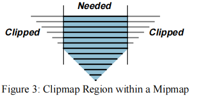
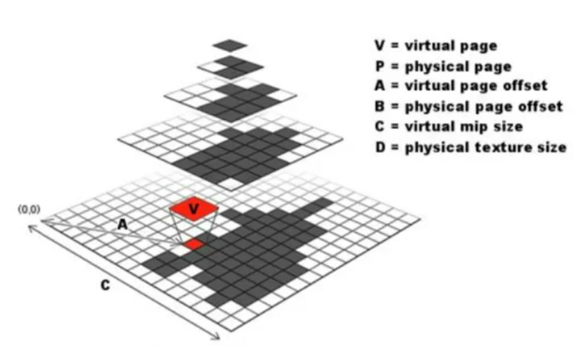
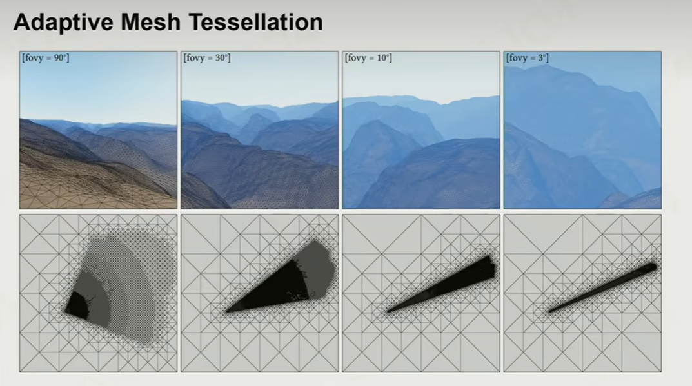
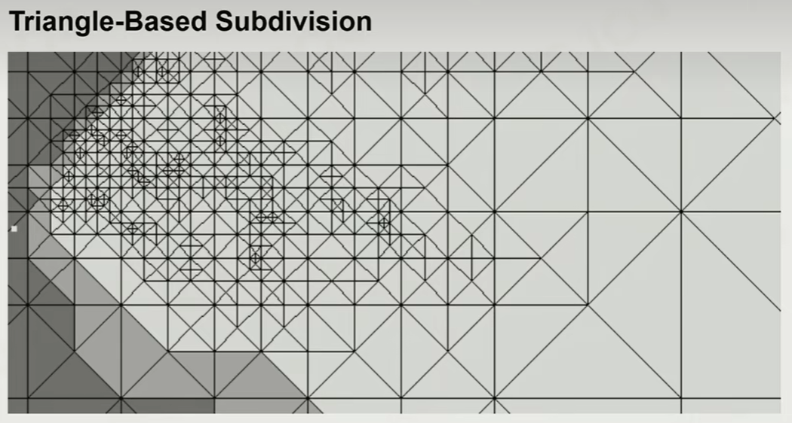

# Virtual Texture 虚拟纹理
上述的膨胀的贴图会存放在显存里。所谓的贴图膨胀，无非是显存放不下、或者不适宜真的去放。虚拟纹理技术对症下药，试图想办法把这种大贴图存下。这就用到了操作系统当中内存不够硬盘来凑的虚拟技术。

最朴素的Virtual Texture也称MegaTexture.其最早得益于一篇文章的发表
[Clipmap: A virtual mipmap,SIGGRAGH 1998](https://dl.acm.org/doi/pdf/10.1145/280814.280855)
Clipmap的字面意思是会自我裁剪的mipmap。

## 精读论文2 Advanced virtual texture topics
[Advanced virtual texture topics,SIGGRAGH 2008](https://dl.acm.org/doi/10.1145/1404435.1404438)
### Abstract
讨论virtual texture的实际应用以及其如何造福引擎、内容生产、性能和图像质量。也讨论了目前的难点，如texture filting， block compression, float precision, disk streaming, uv borders, mipmap generation, LOG selection等等。

### Motivation
现如今，实时渲染引擎面临的突出需求是：
high resolution textures高分辨的纹理
high draw call efficiency 绘制调用的高效率
shared texture 一张纹理，多物共享

现在已经很难把大世界内所有的纹理存在显存里(一个代表性的显存限制是512MB)，甚至有时候连主存都存不下。32位OS的代表主存大小是2GB，有时64位OS的硬件仍然是32位的(注意这篇文章发表于2008年，所以这里的担忧现在已经不成问题了，但是探寻显存应用新方案依然是迫在眉睫的)
**实时渲染不能直接使用虚拟存储技术来解决纹理问题，这是因为传统虚拟存储直到任务完成前都会停顿**(实时渲染需要使用一个纹理，查虚表后发现其位于外存，换入换出，这个过程实时渲染程序将会被操作系统阻塞)

文章提出一个朴素想法，在查询一个纹理的时候，先拿底层mipmap搪塞一下，直到load出来呈现精细的纹理。然而文章随后指出，我们几乎不可能动态修改增删mipmap的其中一层：大多数的硬件都把所有的mipmap放在一整块连续内存里，更新一个mip层就会引发整个mip链条的全部变动。文章希望在运行时释放和创建纹理，并调整mip层。

使用一整个巨大的贴图，并把贴图打包进不同的小块，并生成ID，从而让显存按需取小块.

MegaTexture解决了贴图Tiling的问题(关于Tile问题，关键词Wang Tiles)，确实能够放下一些大贴图了。
[【论文复现】Wang Tiles for Image and Texture Generation by Monica的小甜甜 zhihu](https://zhuanlan.zhihu.com/p/357287614)

把原有纹理切割成相同大小的Tile 或称 page，这样的小块纹理就是virtual textual.

从虚拟Texture的ID到实际贴图的ID需要一种映射机制，主要是四叉树映射和多级映射。

## 四叉树映射

[Virtual texturing in software and hardware ,SIGGRAGH 2012](https://dl.acm.org/doi/10.1145/2343483.2343488) 提出用部分驻留纹理(partially resident textures , PRTs)这一GPU新特性，以硬件方式优化virtual texture.

图形学和工程实践中特别常见的一个概念**LOD levelofdetail** 在远处减少细节(反正也看不清)

**adaptive mesh tessellation自适应网格细分**，提出依据视椎改变网格细化的策略。
fov指的就是视角，在fov内部将三角形分布的更密集，而在fov之外分布的稀疏。

