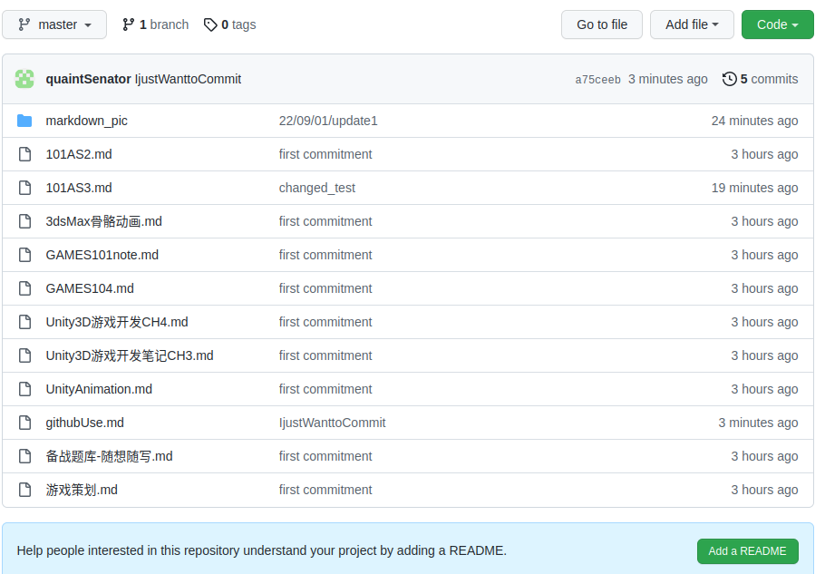

当我在一个已经配置了git的文件夹内创建一个新的文件，比如此文件githubUse.md，其立刻被Vscode标记为一个绿色的U，即Untracked未追踪。我打开终端，输入：
```
git add githubUse.md
```
其从绿色U 变成了橙色的M，即Modified已修改。

现在如果直接进行git push想把已经新建并修改的项目发到github是不行的。这是因为我们的git记忆的commit仍然是上一次的commit，commit中并没有任何的更改。此时如果直接git push,会：

```
PS C:\Users\tail\Desktop\游戏开发笔记本> git push -u origin master
Everything up-to-date
Branch 'master' set up to track remote branch 'master' from 'origin'.
```
而前往github发现内容没有任何更改。

我们要将修改更新成一个新的提交：
```
PS C:\Users\tail\Desktop\游戏开发笔记本> git commit -m "IwanttoCommit"
[master 4cba0c7] IwanttoCommit
 1 file changed, 2 insertions(+)
 create mode 100644 githubUse.md
```
同时，githubUse.md在vscode上的M标记就消失了，表示其已经与commit状态同步。
那么我们这时再进行push。如果此时报错，很有可能是因为远端的仓库已经被其他人更新过，而本地尚未同步。如果不存在这种情况(我不知道我这样的哪来的fork)
```
git push -u origin master
Enumerating objects: 5, done.
Counting objects: 100% (5/5), done.
Delta compression using up to 12 threads
Compressing objects: 100% (3/3), done.
Writing objects: 100% (3/3), 1.02 KiB | 1.02 MiB/s, done.
Total 3 (delta 1), reused 0 (delta 0), pack-reused 0
remote: Resolving deltas: 100% (1/1), completed with 1 local object.
To https://github.com/quaintSenator/All_note
   4cba0c7..a75ceeb  master -> master
Branch 'master' set up to track remote branch 'master' from 'origin'.
```

可以看到，这里的githubUse.md被更新，而其他内容都没有更新。这就是git管理项目的优越之处了。

同时提醒，不要像我这样一边写一个项目、一边去push。比如在我改写commit之后，M刚刚消失，我为了记录这件事，立刻写了几行。这几行显然不会被同步到github远端。在一天结束后，可以将一个调试完成的项目版本push出去，这样一天结束时，左侧项目的条目上不会有任何乱七八糟的字母，第二天也会开开心心地开始写代码。
