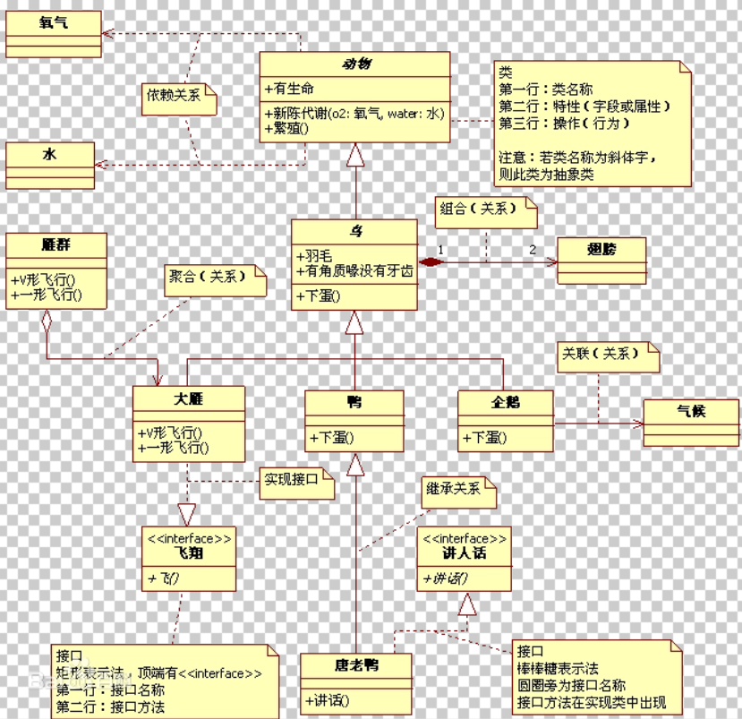
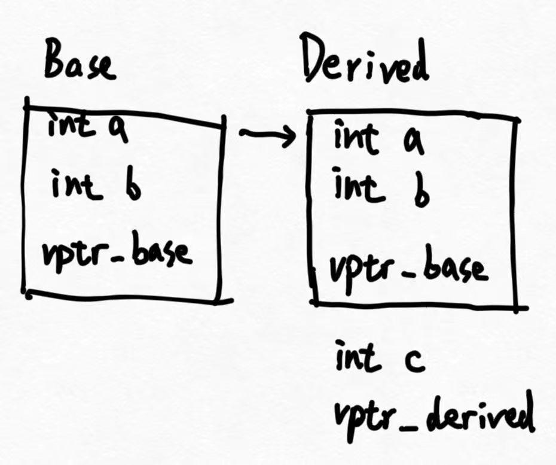

# 前言
有一个说法：C++是一个融合了5种编程泛型programming paradigm的语言——面向过程，面向对象，基于对象，泛型编程和函数式编程。这是一个非常高度的总结，C++对应这五种编程泛型的设计就构成了整个C++的现代语言体系。

在背诵了大量八股、零零碎碎读了C++ Primer和Inside the C++ Object Model之后，我不得不说：我对于C++的很多问题依然是困惑的。

(5th)Primer全书有152万字，逐字逐句的阅读是一个过于困难的事情，因此常常错失或者遗忘一些细节；相比之下，Inside C++ Object Model的阅读体验是更好的，更多的内容是以问题导向的方式组织的，为什么要引入一个机制、设计一个写法？当你这样写的时候，C++编译器如何理解，计算机底层发生了什么？什么样的代码是更好的？这些问题充分调动了我的积极性。因此我也希望以这种方式来组织我的笔记，从而形成了这个文档。

# C++面向对象
## 关于继承 - 到底为了什么
关于继承也许每一本介绍面向对象编程的书籍都有自己的一个例子，我也碰到了自己编程中属于自己的例子。如果你从事过图形或游戏开发，这个例子也许适合你。

我有一个类叫做Shader，其中保存了一个ID和一些方法。在OpenGL编程中，C++代码通过调用`glCreateProgram()`来创建一个着色器程序，这个着色器程序在GPU中是实际的代码，在CPU中则保留一个ID用来映射那个GPU实例。不仅着色器，几乎所有的GPU资源在OpenGL中都是这样管理的。

Shader的那些方法主要是用来向GPU通讯的，比如：
```cpp
void setFloat(const std::string& name, float value) const
{
    glUniform1f(glGetUniformLocation(ID, name.c_str()), value);
}
```
这个函数意在向GPU通告ID对应的Shader有一个名为name的浮点型Uniform量，请把它的值设置成value。

现在随着开发，我发现Shader类是不能够完全满足我的需求的。我碰到了一种情况，Shader a需要一大堆的uniform量：
```cpp
Shader* defer_lighting_pass_shader = new Shader(...);
defer_lighting_pass_shader->use();
defer_lighting_pass_shader->setTexture("G_FragPos", gPositionTexture, 0);
defer_lighting_pass_shader->setTexture("G_Normal", gNormalTexture, 1);
defer_lighting_pass_shader->setTexture("G_Albedo", gDiffuseTexture, 2);
defer_lighting_pass_shader->setTexture("G_AO", ssaoColorTexture, 3);
defer_lighting_pass_shader->setCubeTexture("irradianceMap", convolutionIrradianceCubeMapID, 4);
defer_lighting_pass_shader->setCubeTexture("prefilterMap", prefilteredMapID, 5);
defer_lighting_pass_shader->setTexture("brdfLUT", brdfLookUpTextureID, 6);
defer_lighting_pass_shader->setVec3("cameraPos", Tool::camera.Position);
defer_lighting_pass_shader->setMat4("view", Tool::camera.GetViewMatrix());
defer_lighting_pass_shader->setMat4("projection", Tool::camera.GetCameraPerspective());
```

你可以看到，这些代码不是类编写者书写的，是类的用户书写的。这当然涉及了封装和其他topic，但即便不谈封装，作为一个面向对象编程者，让自己的代码易于使用一定是一个重要的目标。在一些开发过程中，交付一个类的代码的时候，总是要求类代码的开发者随代码一并交付一份手册：说明这份代码要如何使用。如果向上面这样编写Shader类代码，那么我们的说明手册也一定会又臭又长。

当然我们可以改成：让用户提供gPositionTexture等7个参数，这样用户将如此使用我们的类：
```cpp
defer_lighting_pass_shader->setUniforms(gPositionTexture, gNormalTexture, gDiffuseTexture, ssaoColorTexture, convolutionIrradianceCubeMapID, prefilteredMapID, brdfLookUpTextureID);
```
这个`setUniforms`将会把上面十几条set语句的任务完成掉。

那么这个时候我要问了。有另一个shader，它的着色器任务不那么复杂，使用了五个uniforms。我们编写的`Shader::setUniforms`岂不是完全失效了？

如果你了解多态，ok，我们当然可以立刻利用编译时多态，overload另一个`Shader::setUniforms`，只不过参数类型不同了。

那么问题又来了。假设两个shader都使用三个int两个float的uniform，但是两者的第一个int的意义是不同的，一个我们会使用setTexture当作TextureID使用，另一个则是使用setInt当作int使用。多态在这里也会失效。

这就是我们使用继承的第一个动机。继承在一定程度上提供了一种类似多态的效果：基类和派生类的同名函数之间有一层`多态`，继承赋予了一个代码中的名字再多一种可能的含义。

换言之，在我们的例子里，我们大可以直接进行一个`Shader::setUniforms`与`DerivedShader::setUniforms`的区分。以后若有任何不同的Shader，直接让它继承Shader，并就地书写自己的setUniforms。

```cpp
class Shader{
public:
    int ID;
    void setUniforms();
}

class SomeShader : public Shader{
public:
    void setUniforms(int, int, float);
}

class SomeOtherShader : public Shader{
public:
    void setUniforms(int, int, float);
}
```
至此，硬性的问题解决了。我们不必逼迫用户在使用Shader之前手动set一大堆量，同时我们的程序是可拓展的——我们需要为每一个新增加的Shader类overload函数`setUniforms`。

但是这种继承体系是非常愚笨的，几乎没有体现出继承原本的优势。我常说的一个编程的思想在于：减少信息复制，在代码层面就是减少重复的代码，增加复用。继承是非常直接的一种复用。

我们再来假设：很多着色器事实上都使用所谓MVP矩阵，只要你有图形学的入门基础就会知道这三个矩阵是做什么的。那么如果按我们之前的写法，所有的`SomeOtherShader::setUniforms`都必须有这部分代码：
```cpp
class SomeOtherShader1 : public Shader{
public:
    void setUniforms(glm::mat4 model, glm::mat4 view, glm::mat4 projection, ...){
        setMat4("model", model);
        setMat4("view", view);
        setMat4("projection", projection);
        //...
    }
}
class SomeOtherShader2 : public Shader{
public:
    void setUniforms(glm::mat4 model, glm::mat4 view, glm::mat4 projection, ...){
        setMat4("model", model);
        setMat4("view", view);
        setMat4("projection", projection);
        //...
    }
}
```

我们要想避免这部分代码拷贝，就应当使用一个继承体系：
```cpp
class MVPShader : public Shader{
public:
    void setMVP(glm::mat4 model, glm::mat4 view, glm::mat4 projection){
        setMat4("model", model);
        setMat4("view", view);
        setMat4("projection", projection);
    }
}
class SomeOtherShader1 : MVPShader{
    void setUniforms(glm::mat4 model, glm::mat4 view, glm::mat4 projection, ...){
        setMVP(model, view, projection);
        //...
    }
}
class SomeOtherShader2 : MVPShader{
    void setUniforms(glm::mat4 model, glm::mat4 view, glm::mat4 projection, ...){
        setMVP(model, view, projection);
        //...
    }
}
```
经常听到的debate，抱怨继承所写的新类代码比之省下的代码量更大。这一点我真的说不清。按照我们的思维，梳理出一个继承体系，究竟是不是一个最好的选择呢。至少我可以说，按照这套方式，确确实实让软件团队的沟通成本有所下降。面向对象的设计模式早已经成为软件工程专业的必修课，手撸类图对于计算机毕业生也不会是很困难的事情。


## 关于多态 - 到底为了什么
多态归根到底是一种灵活性，也是一种抽象代码的方式。灵活性使得我们的代码变得可拓展。高度抽象的代码可以写了一次就在很多地方复用，仅仅进行一些必要的微调。
比如Inside the C++ Object Model的经典例子，让Point3d继承Point2d，从而写出了一个这样的代码：
```cpp
    class Point2d{
        //...
        void z(){
            return 0;
        }
        virtual void operator+=(const Point2d& rhs){
            _x += rhs.x();
            _y += rhs.y();
        }
    }
    class Point3d : public Point2d{
        //...
        
        virtual void operator+=(const Point2d& rhs){//参数就是一次动态绑定
            Point2d::operator+=(rhs);
            _z += rhs.z();
        }
    }
    void foo(Point2d &p1, Point2d &p2)
    {
        p1 += p2;
    }
```
引入了一大堆概念、在内存中开辟了额外的空间，就是为了:
```
    Point3d a = Point3d(1, 1, 1);
    Point2d b = Point2d(2, 3);
    foo(a, b);
```
这一个foo函数就可以处理2d += 3d , 3d += 2d等多种不同的情况。你不得不承认，这很可能会使我们的代码减少复制。不仅如此，如果不使用虚拟，那么就必须把foo扩展成四个不同类型的组合才能把每种情况都写清楚。

在更多情况下，人们似乎并不是为了精简代码才使用多态，而是出于一种软件工程考虑。
在游戏编程模式《Game Programming Patterns》当中介绍了一种广为使用的编程模式叫命令模式，由于这本书使用了C++, 很好地展现了virtual在工程中的用法

简单描述一下command类：
```cpp
class Command{
public:
    virtual ~Command(){}
    virtual void execute(GameActor& actor) = 0;
}
```
进而处理输入、拿取指令、处理指令：
```cpp
Command* currentCmd = inputHandler.handleInput();
if(currentCmd){
    currentCmd->execute(actor);
}
```
这是一个很妙的写法，游戏的代码会从一大片`if(jump){}elseif(move)`的判断逻辑中解放出来，且如果你需要新增一个新的指令类型来拓展玩法，原本的代码不需要做任何的删改，只需要加入一个新的继承Command类并实现execute函数的新指令类就行了。
这正是我们反复讨论的一些我们在编码时候所追求的东西：可拓展性、可复用性。

## 关于多态 - 当我们调用一个动态绑定指针的虚拟函数，发生了什么？
```cpp
//代码范例1-1
    Derived dobj = Derived();
    Base* bptr = &dobj;
    bptr->print();
```
当这里的第三句话执行时，到底发生了什么？

我们已经知道虚拟类的内存布局。虚拟类以原样性保持着父类部分和子类部分（因此，父类既然有virtual函数，也会有虚表指针，从而父类部分也会抄写一个父类的虚表指针）：


### 什么情况下盒子里才会出现两个虚表指针
一个类的对象模型中出现生成的虚指针的条件：这个类拥有virtual function, 那么它需要虚表指针，否则不需要。

我们即将讨论一个不太有意义的话题：*如果一个类继承自虚基类自身却没有virtual函数，他还需要自己的虚表吗？* 说这个问题意义不大，是因为被override正是C++赋予虚函数的昭昭天命，如果基类的虚函数没有被覆盖，那我不禁要问，把基类的这个函数设计为virtual又是何用意？

一个类没有virtual函数，但是继承自虚类，这种时候它的盒子里装着虚基类的盒子，那个盒子中有虚基类的虚指针。关于这个类自己有没有一张虚表，我在书本之外的网络来源看到了不止一个肯定的说法。不止一个优质经验贴指出，一般认为需要给一个类构建虚表的条件是两者的并集(满足一个即可)：
1. 类有虚函数，纯虚函数也是虚函数；
2. 继承自拥有虚表的类

毕竟下面代码示例这样的写法也是允许的：
```cpp
//代码范例1-2
class Base{
public:
    virtual void print() const{
        std::cout << "Base::print" << std::endl;
    }
};
class Derived : public Base{
    int b;
    int c;
};
int main(){
    Derived obj;
    Derived* dptr = &obj;
    dptr->print();
}
```
等你读完下面几个小节，你就会理解在这个代码范例中，倘若Derived类没有自己的虚表，在这种情况下，很难按虚表体系寻找dptr->print的执行地址。


### 思考：resolve bptr->print()的代码区地址需要什么信息？
首先我们需要知道`bptr所指出的对象的真实类型`，在这个例子中恐怕就是Base对象或者是Derived对象；
其次我们需要知道对应类的print()的执行地址，比如如果已经resolve出bptr指向base对象，那么这里我们就要获取Base::print()的执行地址

### 思考：从bptr指针能拿到什么？
回顾code1-1:
bptr虽然有可能指向Base或Derived对象，但是从Base盒子到`Base::vptr_base`的offset是编译器所掌握的，从而不论是指向Base对象还是指向Derived对象(那就转而使用`Derived::vptr_derived`替代)

我们于是能从bptr指针，找到虚表指针，从而拿到`实指对象的虚表`(尽管我们不知道bptr的实指类型)。想一想我这个表达是不是正确。

进而有一个*比较天才的想法*(当然这个想法也就是C++的设计方法)，能不能做这样一个设计：

倘若Base虚表的`[i]槽位`是`Base::z()`, 那么继承自Base的所有类的虚表中，`[i]槽位`要么是这个派生类override的`Derived::z()`, 要么派生类没有override，其中也保存`Base::z()`

这样做的好处是，我们真正不必在编译时搞清楚bptr到底指向什么类型的对象，从而真的实现了所谓动态绑定和C++运行时多态。

这样做就会带来这样一些显然的结果：
1. 基类的虚表在其子孙的虚表中反复抄写，每个子孙的虚表必定比其虚祖先更长——因为根据我们的分析，要做到能够凭子类的内存布局*原封不动*地找到正确的成员函数版本，这意味着基类虚表的所有表项要么保留，要么override，不能移位或者删除。
2. 1进一步意味着，如果我们的虚拟继承树很庞大，末端子孙类的虚表也会变得很大，而且一旦要再在子孙的基础上继承，新增的虚表也会变得更大，整体呈现一个`1 + 2 + 3 + ...`的加速递增

那么我们自然地认为：只要构建好虚表，编译器其实能摆脱[上一节](#思考resolve-bptr-print的代码区地址需要什么信息)当中提到的bptr所指对象真实类型的信息完成所谓动态绑定。

### 虚表构建守则
Part 1: 构建一个始祖虚类的方法(有虚函数，是虚类但并不派生自虚祖先)
- 虚表的第一项`v_table[0]`是type_info，是typeinfo (RTTI) pointers，用于支持RTTI
- 大多数编程规范要求把虚类的析构函数声明为虚的(为什么这样做是一个热门八股问题)，因此`v_table[1]`一般就是析构函数
- 按照声明顺序逐个向虚表填入虚函数，其中：
  - 纯虚函数，则填入pure_virtual_called()的地址，这个函数的执行内容是抛出异常，因为纯虚函数没有逻辑，不允许调用
  - 常规虚函数，写入成员函数地址(见primer19-4-2成员函数指针)

Part 2：构建一个继承自虚类的类的虚表(已经在前面讨论，纵使自己没有任何虚函数此时也需要虚表)
在构建开始之前，先完全复制一张基类的虚表；
- 虚表第一项和第二项同Part1
- 遍历此类的所有虚函数，倘若：
  - 倘若当前虚函数覆盖了一个虚表中的纯虚函数，抹去纯虚函数对应位置的pure_virtual_called()的地址改为当前函数的成员函数地址
  - 倘若当前虚函数覆盖了一个虚表中的虚函数，抹去其地址改为当前函数的成员函数地址，这是经典的override覆盖
  - 倘若当前虚函数不与任何虚表中已有的函数同名，这是一个新的虚函数，在表尾开新项，写入成员函数地址

### 回答最初的问题：运行时bptr->print()背后的行为
1. bptr是Base*类型，这是一个虚类。首先，如果存在`Base::print()`是非虚拟函数，不必继续查询；
2. ?尚未写完


### 另一个脑洞：编译时多态又是怎样的
```cpp
class Base{
public:
    void print() const{
        std::cout << "Base::print" << std::endl;
    }
};
class Derived : public Base{
    void print() const{
        std::cout << "Derived::print" << std::endl;
    }
};
int main(){
    Derived dobj = Derived();
    Base* bptr = &dobj;
    bptr->print();
}
```
这种情况下，动态绑定没有发生。bptr是Base*，那并不是一个虚类，因此程序会直接转而查询Base的成员表找到`Base::print()`，直接执行。
