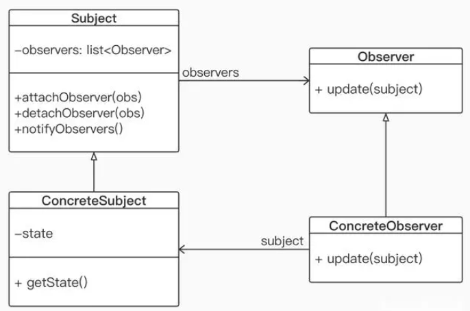

# 前言
本部分意在跟着GPP - Game Programming Parttern探讨一些编程上设计模式的问题。
我在编程实践中结合过一些设计模式，时常会产生的疑惑是：这样编程带来了什么？有的时候又会倒过来觉得，这样编程挺好的，It just works；似乎不必总是思考为什么这样编程是否是好的。很多时候一些疑惑是没有答案的，没有人能以一个绝对的标准回答你，这样的代码是糟糕的，或者说是良好的。这把我们带入了一个矛盾的处境。

## 观察者模式

传统语言使用如上图的继承体系来完成观察者模式。具体的观察者类ConcreteObserver实现一个重要的方法`update(Subject subject)`
### 为什么要用观察者模式

### 何时使用观察者模式/典型的C# Event应用场景

### 观察者模式的误用
我在一个早期自己的游戏demo中使用了观察者模式。这个demo使用Unity，因此很自然地使用C#开发。C#是一个拥有event机制的语言，因此使用观察者模式简直是太方便了。很快地，随着工程不断的扩大，我开始意识到在这个demo中出现了过多的事件。

(下面这段都是UnityC#脚本实现的) 灯光能够杀死鬼，在灯光打开时等的子物体PointOfView会激发，这个物体携带一个collider，在碰撞发生时调用OnTriggerEnter, 判断碰撞的另一个物体的tag是否是Ghost。如果是，那么激发事件`LightBehaviour.lightSpotGhostEvent`。这个事件的监听者是GhostManager，一个所有鬼魂的全局管理类。

这个设计显然需要让GhostManager来识别被照射到的鬼魂是哪一个鬼魂。因此OnTriggerEnter还要负责把碰撞到的鬼魂的id采集下来作为激发事件的参数：
```cs
//LightBehaviour : Monobehaviour
//附着在PointOfView上
public class LightBehaviour : MonoBehaviour
{
    public event System.EventHandler<ObEventArgs> lightSpotEvent;

    void OnTriggerEnter(Collider other)
    {
        if (other.CompareTag("Ghost"))
        {
            GhostBehaviour collidedGhost = other.GetComponent<GhostBehaviour>();
            int id = collidedGhost.GhostID;
            lightSpotGhostEvent.Invoke(null, new LightSpotGhostEventArgs(id));//根据规范，静态事件的激发者参数应该填写null
        }
    }
}
public class LightSpotGhostEventArgs : EventArgs
{
    public int id;
    public ObEventArgs(int i)
    {
        id = i;
    }
}
```

这个设计是不妙的。如果你从事过UnityC#开发，也许立刻会注意到一个问题：既然OnTriggerEnter已经拥有了other，也就是被碰撞的鬼的Collider，为什么不顺藤摸瓜地直接通知鬼？这个写法代码量更少，执行起来也更快，无疑是一个更好的写法。

```cs
public class LightBehaviour : MonoBehaviour
{
    void OnTriggerEnter(Collider other)
    {
        if (other.CompareTag("Ghost"))
        {
            GhostBehaviour collidedGhost = other.GetComponent<GhostBehaviour>();
            collidedGhost.OnGhostSpotted();//直接通知
        }
    }
}
```

这就是观察者模式最常见的一种误用：忽视更直接的通讯方式。

当然，就像我之前强调的，对于这个设计究竟是好还是坏，也会引发许多争论。在碰撞时激发一个事件，这种写法能够支持更好的拓展性。现在的逻辑的确可以用直接通知的写法，但如果日后游戏更新到某个版本，策划突然发来这样一条消息：

```
这个版本我们打算加个功能：
在游戏中灯累计杀死了50个，100个，200个鬼，分别弹出成就。
成就部分是小张在负责，你们两个对一下
```

这个时候，我们的直接通知代码就变得不太妙了。而事件写法则可以比较轻松地拓展——我，也就是灯光逻辑的编写者，不需要改一行代码。真正需要做工作的变成了小张，因为灯光逻辑的任务是在灯光确实杀死了鬼之后，告诉所有需要知晓灯光是否杀死鬼的信息的其他组件(订阅者)，他们分别要做自己的工作了。事件完美地做到了这一点。

于是我这样向小张发出消息：
```
关于策划给的灯光累计杀死鬼的成就，我做了一个事件，请你订阅这个事件：
LightBehaviour.lightSpotEvent
每次灯光杀死鬼，这个事件都会激发。
具体的50 100 200次杀鬼，拜托你写一下处理逻辑。
```

小张立刻会意识到一个问题。他该如何拿到我所说的LightBehaviour.lightSpotEvent事件呢？

#### 发布订阅模式的不充分解耦
C#事件设计之时，并没有预设或者期待C#事件在架构中处于什么位置。一个事件可以属于是某一个类的成员，也可以是静态成员。*从语言角度，C#事件一定是属于某个类的，event和构造方法，成员方法等等都是类的组成部分，而不允许在一个成员函数内定义事件，也不能在名字空间下直接定义事件。* 

使用静态的事件是合理的，因为许多时候对于发布者类的每一个实例，并不需要一一分开。就像上面的例子，任何一盏灯激发了照到鬼的事件所做的处理都是一样的——我们并不需要区分每一个灯(除非策划突然某一天真的提出要新加为每一盏灯记录杀鬼数量，并把杀鬼最多的灯显示成不同的颜色这种离谱的需求，到那个时候要改的可就不是我和小张两片代码了)，因此把事件`LightBehaviour.lightSpotGhostEvent`定义为静态也是相当合理的。一旦我把这个事件定义为静态的，小张那边就可以写出这样的代码并且交工下班了：

```cs
public class AchievementSystem : Monobehaviour
{
    public int ghostKilledByLightCount;
    void Start()
    {
        ghostKilledByLightCount = 0;
        //...
        LightBehaviour.lightSpotGhostEvent += OnLightSpotGhost;
    }
    void OnLightSpotGhost(Object sender, LightSpotGhostEventArgs args)
    {
        ghostKilledByLightCount++;
        if(ghostKilledByLightCount == 50)
        {
            //...
        }
        else if(ghostKilledByLightCount == 100)
        {
            //...
        }
        else if(ghostKilledByLightCount == 200)
        {
            //...
        }
    }
}
```

这种写法已经比较美观、工程化了。但是我们依然看到，`LightBehaviour.lightSpotGhostEvent`这个名字不得不暴露给成就系统。这无疑也是一种耦合。在更糟糕的情况下，如果策划真的要求我们为每一盏灯统计杀死的鬼的数量，或者其他需求使得lightSpotGhostEvent不再适宜作为一个静态事件，那就真的可能变成一种高耦合状态，因为AchievementSystem将不得不持有LightBehaviour的引用。

我总结了一些规律，用来判断一个事件E究竟是否应该被定义在类A当中。
1. 事件E一定是描述一个逻辑上的事件的发生(或者即将发生)
2. 事件E的发生应该有至少一个人(或者说类)关心
3. 关心这件事的人(或者说类)还没有持有A的引用

关于第一点，可以援引一下[MSDN对于C#事件的介绍](https://learn.microsoft.com/zh-cn/dotnet/csharp/events-overview)，这当中这样说：
```
当事件报告已发生的事情时，请使用过去时。 
使用现在时谓词（例如Closing）报告将要发生的事情
```
就像我们定义的lightSpotGhostEvent,更好的命名方式其实是：
```cs
public event System.EventHandler<ObEventArgs> lightSpotted;
```
因为明显光照到鬼在先，进一步的处理在后，应当采用过去式描述光照到鬼。

讨论事件的发生时点是有意义的，一类事件被称为前期事件，采用进行时；一类被称为后期事件，采用过去时。

对于一些程序上的过程，比如定时器已到时触发TimerInvoked, 子弹对象已销毁BulletObjectDestroyed，我个人认为也可以当作逻辑事件，只要事件的变量名足以说清楚到底发生了什么就可以。btw我并不排斥特别长的变量名，因为我看不出变量名过长可能会造成什么特别严重的问题，只要程序员不要忘记试着缩略一些就行。

除了这里提到的时态命名规范，还有一些规范，在[MSDN.NET事件模式](https://learn.microsoft.com/zh-cn/dotnet/csharp/event-pattern)当中介绍。


### C#事件规范
1. 当且仅当引发静态事件时，应当把发送方参数填写为null。如果事件处理方法不需要任何参数，那么可以传递EventArgs.Empty
   ```cs
   public class Publisher
    {
        public static void RaiseSomeEvent()
        {
            someEvent?.Invoke(null, EventArgs.Empty);
        }
        public static event EventHandler<EventArgs> someEvent;
    }
    public class Subscriber
    {
        public static void OnSomeEvent(object sender, EventArgs args)
        {
            Console.WriteLine("SomeEvent was Raised");
        }
    }
    public class Program
    {
        static void Main(string[] args)
        {
            Publisher.someEvent += Subscriber.OnSomeEvent;
            //...
            Publisher.RaiseSomeEvent();
        }
    }
   ```
   只有当事件的设计者确信这个事件不需要传入参数，才可以使用`EventHandler<EventArgs>`来定义事件。事件的激发者将会通过`EventArgs.Empty`来填补这个参数。把事件定义成`EventHandler<EventArgs>`并让事件处理方法就地进行类型变换也是可以奏效的，不过这是规范所打击的：
   ```cs
   public class Publisher
    {
        public class SomeEventArgs : EventArgs
        {
            public int Content { get; }
            public SomeEventArgs(int i)
            {
                Content = i;
            }
        }
        public static void RaiseSomeEventBad()
        {
            someEvent?.Invoke(null, new SomeEventArgs(1));
        }
        public static event EventHandler<EventArgs> someEvent;
    }

    public class Subscriber
    {
        public static void OnSomeEventBad(object sender, EventArgs args)
        {
            Publisher.SomeEventArgs seArgs = (Publisher.SomeEventArgs)(args);
            Console.WriteLine($"SomeEvent was Raised, args = {seArgs.Content}");
        }
    }
    public class Program
    {
        static void Main(string[] args)
        {
            Publisher.someEvent += Subscriber.OnSomeEventBad;
            //...
            Publisher.RaiseSomeEventBad();
        }
    }
   ```