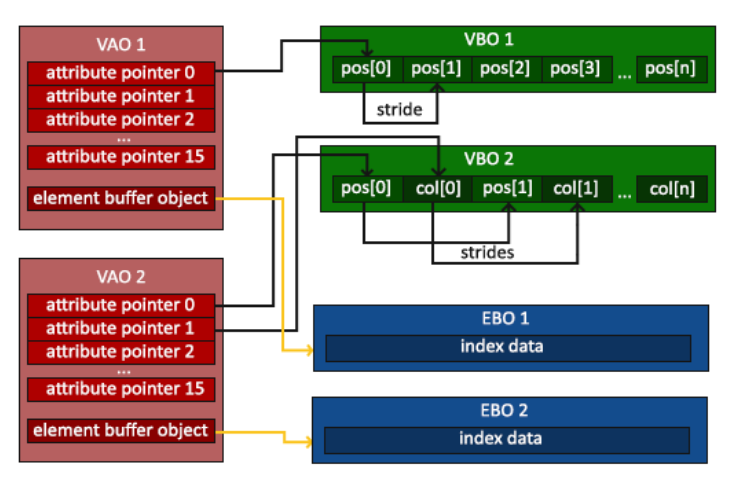
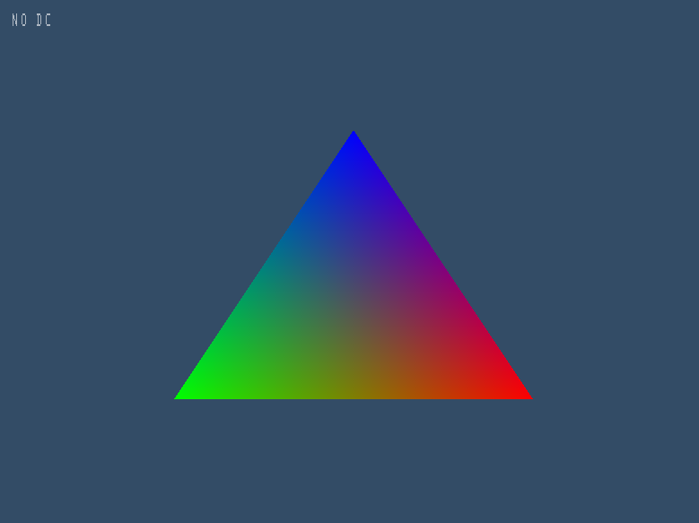
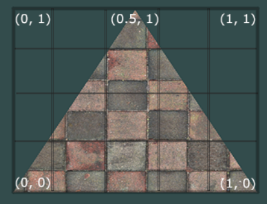
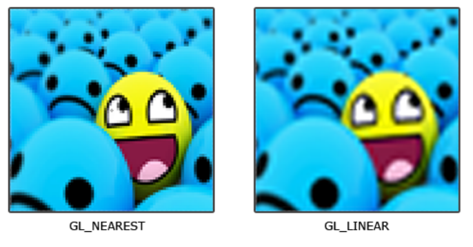
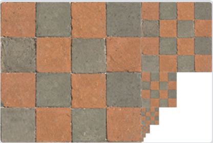

## learnOpenGL学习笔记
如果仅仅看第一节的内容，learn opengl几乎是我跟过所有计算机相关内容里面最棒的教程。大多数的教程不会细致到这种地步，只要跟着learnopengl的[创建窗口](https://learnopengl-cn.github.io/01%20Getting%20started/02%20Creating%20a%20window/)和[hello 窗口](https://learnopengl-cn.github.io/01%20Getting%20started/03%20Hello%20Window/)两节的内容，一个没有接触过任何图形相关内容的小白也几乎不会碰到任何教程中没有涵盖的问题。

如果确实还是发生问题了，仔细检查有没有紧跟上述两个链接对应教程的每一个步骤。有些地方并不会为一个步骤附加一个图片，因此可能你略过了一两行，因此少配置了两个配置项。

注意VS当中的一个常见问题：进入配置页大展宏图之前，先检查你配置的项目是debug还是release，是x64还是win32：


**一个最简单的openGL窗口程序的结构**


## CH1 入门：图形学基础在openGL中的对应
### 前言
openGL图形渲染管线：

### 绘制三角形
#### 概念杂谈
三个重要概念：
顶点数组对象：Vertex Array Object，VAO
顶点缓冲对象：Vertex Buffer Object，VBO
元素缓冲对象：Element Buffer Object，EBO 或 索引缓冲对象 Index Buffer Object，IBO

不同的图形API，不同的显卡，在图形渲染管线的一些细节上有所不同，但是最重要的两个阶段：顶点着色阶段vertex shading stage和片元着色阶段fragment shading stage都是包含其中的。

在[learnopenGL,你好三角形](https://learnopengl-cn.github.io/01%20Getting%20started/04%20Hello%20Triangle/#_3)这部分中，顶点着色器接收的输入就已经是**标准化设备坐标(Normalized Device Coordinates)**，我们必须知道很多时候标准化的坐标并不是程序的开始。往往我们会在顶点着色器内进行外部顶点的标准化步骤——这也是在光栅化程序中反复出现的MVP变换的内容。

#### VBO，vertex buffer object，顶点缓冲对象
VBO设计的初衷是这样的：

图形程序中，CPU和GPU本身基本上不会成为性能瓶颈——他们总是能在足够短的时间完成运算。从主存到CPU，从显存到GPU也不会成为性能瓶颈——性能瓶颈往往在于从CPU往GPU传递数据的情况，这时候总会有一方为了等待数据停滞，极大地降低效率。

考虑到顶点数据是一大段处理方式相同的、即将频繁被使用的数据，它们统一处理、一起传送进入显存是合理的。所谓顶点缓冲对象VBO，就是在显存中连续的一大段数据，对应着顶点输入阶段的每一个顶点。

VBO的缓冲类型是`GL_ARRAY_BUFFER`，也就是VAO。所谓缓冲类型，是指在显存中有多种多样的缓冲——深度缓冲，帧缓冲，等等。

openGL当中使用各种对象，都**不是通过类和对象**使用的(其实openGL编程中也从未使用class这个概念)，而是通过ID。我们用C++声明任何对象，都仅仅是声明一个unsigned int，用于存放其ID。`glGenBuffer()`这样的函数称为generator/生成器，它们为我们在显存中创建出我们想要的对象(何种对象取决于我们使用了何种generator)，并且用第二个参数来返回构建好的对象对应的ID。至此，我们一直会使用这个ID来代指那个对象，从而完成工作。

```cpp
unsigned int VBO;
glGenBuffers(1, &VBO);
glBindBuffer(GL_ARRAY_BUFFER, VBO);  
```

如果我们希望连续generate多个VBO，那么只要改成：
```cpp
unsigned int VBO[5];
glGenBuffers(5,&VBO);
```

`glBindBuffer()`也是一个重要函数，用于**把具体的buffer对象绑定到渲染管线上**。图形渲染管线当中，任何**同种缓冲类型的buffer只能绑定一个**。你可以理解为有几个全局静态变量，其中之一就是`GL_ARRAY_BUFFER`,你可以将一些buffer绑定在`GL_ARRAY_BUFFER`上，但不可以同时绑定两个不同的对象。这里的语句把刚刚新建的VBO对象绑定到图形渲染管线的GL_ARRAY_BUFFER上。

如果把0绑定到一个buffer上，表示解绑。

必须反复强调，`VAO vertex array object`和`GL_ARRAY_BUFFER`是两码事。VAO是一个存放顶点属性配置和应使用哪一个VBO的顶点数组对象，而ARRAY_BUFFER指的是VBO在渲染管线上的绑定位置。

VAO&VBO的关系详见链接顶点属性部分。


`glBufferData()`是一个专门用来把用户定义的数据复制到当前绑定缓冲的函数。

```cpp
float vertices[] = {
        -0.5f, -0.5f, 0.0f, // left  
         0.5f, -0.5f, 0.0f, // right 
         0.0f,  0.5f, 0.0f  // top   
    }; 
glBufferData(GL_ARRAY_BUFFER,sizeof(vertices),vertices,GL_STATIC_DRAW);
```
1. 针对GL_ARRAY_BUFFER所绑定的对象
2. 顶点数据的整体大小
3. 实际数据
4. 显卡如何管理给定数据

para4有这几个选定值：
`GL_STATIC_DRAW` ：数据不会或几乎不会改变。
`GL_DYNAMIC_DRAW`：数据会被改变很多。
`GL_STREAM_DRAW` ：数据每次绘制时都会改变。

para4指导显存使用高速显存还是普通显存。

至此，vertices内的数据已经全部拷贝到一个渲染管线能够使用的显存空间。

#### 顶点着色器
我们的项目是一个C++项目，着色器代码将以嵌入字符串的形式保留在C++程序当中，并等待编译和进一步使用。
```c
#version 330 core
layout (location = 0) in vec3 aPos;

void main()
{
    gl_Position = vec4(aPos.x, aPos.y, aPos.z, 1.0);
}
```

in关键字在GLSL当中用于声明**输入顶点属性Input Vertex Attribute**。我们知道，不同数据类型的输入，可以允许在顶点上存很多东西，比如顶点位置、顶点颜色、顶点法线等等。

我们知道每一次调用顶点着色器，其输入都是一个顶点的数据(反复强调，一个顶点的数据可能很长很复杂)。这里的`layout (location = 0) in vec3 aPos`用location=0表示从每一个顶点数据的第0位就开始使用；使用这些数据来创建一个vec3变量 aPos。

`gl_Position`是顶点着色器的默认输出，意思是我们只要把运算结果或者说返回值填到`gl_Position`中就好了。事实上除了这个量还会有其他的默认输出，但在此程序中我们尚且不必使用他们。

#### 片元着色器
```c
#version 330 core
out vec4 FragColor;

void main()
{
    FragColor = vec4(1.0f, 0.5f, 0.2f, 1.0f);
} 
```

openGL中的RGB值是0 ~ 1的浮点值，而不是0 ~ 255的int值。第四位是alpha透明度，因此应该记为RGBA。

在这次的程序当中，片段着色器尚没有使用其他阶段的任何数据，其只是给所有应当调用片元着色器的像素涂上一个固定的颜色。这里的FragColor是我们自己声明的输出变量。
#### 编译着色器
```cpp
const char *vertexShaderSource = "#version 330 core\n"
    "layout (location = 0) in vec3 aPos;\n"
    "void main()\n"
    "{\n"
    "   gl_Position = vec4(aPos.x, aPos.y, aPos.z, 1.0);\n"
    "}\0";

unsigned int vertexShader;
vertexShader = glCreateShader(GL_VERTEX_SHADER);

glShaderSource(vertexShader, 1, &vertexShaderSource, NULL);
glCompileShader(vertexShader);

const char *fragmentShaderSource = "#version 330 core\n"
    "out vec4 FragColor;\n"
    "void main()\n"
    "{\n"
    "   FragColor = vec4(1.0f, 0.5f, 0.2f, 1.0f);\n"
    "}\n\0";
unsigned int fragmentShader;
fragmentShader = glCreateShader(GL_FRAGMENT_SHADER);
glShaderSource(fragmentShader, 1, &fragmentShaderSource, NULL);
glCompileShader(fragmentShader);
```
`GL_VERTEX_SHADER`和`GL_FRAGMENT_SHADER`都已编译好，之后还需要链接这两段编译好的着色器。

```cpp
unsigned int shaderProgram;
shaderProgram=glCreateProgram();

glAttachShader(shaderProgram,vertexShader);
glAttachShader(shaderProgram,fragmentShader);
glLinkProgram(shaderProgram);
```
链接着色器的过程中，会把上一个主色器的输出当成下一个着色器的输入。

绑定后用glGetProgramiv检查绑定结果，
```cpp
glGetProgramiv(shaderProgram, GL_LINK_STATUS, &success);
if(!success) {
    glGetProgramInfoLog(shaderProgram, 512, NULL, infoLog);
    //...
}

glUseProgram(shaderProgram);
```
#### 链接顶点属性 & VAO, Vertex Array Object
```cpp
unsigned int VAO;
glGenVertexArrays(1,&VAO);
glBindVertexArray(VAO);
```
VAO绑定为VertexArray(并不是Buffer)，这是因为我们需要VAO来指定openGL如何解释顶点数据。

openGL允许使用任何形式排列的顶点数据，比如你的顶点数据的每一行可以是三位颜色+三位法线+三位位置，而仅仅完成了上面所有工作openGL只能认为VBO当中是一个很长的数组，而不知道如何去阅读。我们必须在渲染前指定OpenGL该如何解释顶点数据。


要想识别这些数据，需要知道这些信息：
1. 位置数据属于浮点值，每个数值有4Bytes
2. 每个位置有三个数值
3. 位置和位置之间没有空隙，也就是他们在数组中**紧密排列Tightly Packed**
4. 数据没有**偏移量offset**，也就是从第一个字节开始读取数据

这些信息是通过顶点数组指针vertex array pointer告知openGL的。这并不是一个真正的指针，仅仅是需要我们提供一些必要的信息：
```cpp
glVertexAttribPointer(0, 3, GL_FLOAT, GL_FALSE, 3 * sizeof(float), (void*)0);
glEnableVertexAttribArray(0);
```

`glVertexAttribPointer()`有六个参数。
|参数名|介绍|
|--|--|
|GLuint index|指定我们要配置的顶点属性。还记得我们在顶点着色器中使用layout(location = 0)定义了position顶点属性的位置值(Location)吗？它可以把顶点属性的位置值设置为0。因为我们希望把数据传递到这一个顶点属性中，所以这里我们传入0。|
|GLint size|第二个参数指定顶点属性的大小(这里用**值的个数或者维数**作为单位描述size，不要传入有多少个Bytes)。顶点属性是一个vec3，它由3个值组成，所以大小是3|
|GLenum type|第三个参数指定数据的类型，这里是GL_FLOAT(GLSL中vec*都是由浮点数值组成的)|
|GLboolean normalized|定义我们是否希望数据被标准化(Normalize)。如果我们设置为GL_TRUE，所有数据都会被映射到0（对于有符号型signed数据是-1）到1之间。我们把它设置为GL_FALSE，因为我们输入的数据本就完成了标准化|
|GLsizei stride|**步长(Stride)**，它告诉我们在连续的顶点属性组之间的间隔。由于下个组位置数据在3个float之后，我们把步长设置为3 * sizeof(float)。要注意的是由于我们知道这个数组是紧密排列的（在两个顶点属性之间没有空隙）我们也可以设置为0来让OpenGL决定具体步长是多少（只有当数值是紧密排列时才可用）。更好的办法是，**Stride总是等于一个顶点的特定属性这次和下次出现之间相差多少个字节**|
|const void * pointer|它表示位置数据在缓冲中起始位置的偏移量(Offset)。由于位置数据在数组的开头，所以这里是0。如果使用多属性，第二个第三个指针将会不得不从一个非零的位置开始查找。由于内存都按字节编地址，这里的pointer其实就是第一个指针从多少个字节位置开始数，同时类型转换成void*即可|
 	
特别提一下index，如果我们在各个着色器中分别定义了许多属性，他们都需要分别用location指定不同的index。这时就可以用这个参数里找寻我们要使用的是哪一个属性。
```
//vertex shader
layout(location=0) in vec3 aPos;

void main(){
	gl_Position = vec4(aPos.x, aPos.y, aPos.z, 1.0);
}
```

既然告知渲染管线如何使用顶点数据的全部信息已经通过`glVertexAttribPointer()`给出，那么为什么openGL还要强制我们使用VAO呢？

事实上，每次使用顶点属性，渲染管线并不是去已经绑定在GL_ARRAY_BUFFER上的VBO当中取，而是前往VAO。VAO中会存放：
1. glEnableVertexAttribArray的状态
2. 顶点属性配置
3. 与顶点属性关联的VBO
4. EBO

你可能发现代码中并没有任何让VAO与VBO或者其他内容绑定起来的内容，仅仅有一句：
```cpp
glBindVertexArray(VAO);
glBindBuffer(GL_ARRAY_BUFFER,VBO);
```
这是因为第0个VAO天然对应着第0个VBO和EBO。
`glVertexAttribPointer()`的第一个参数index也在使用这样的对应关系，我们的调用：
```cpp
glVertexAttribPointer(0, 3, GL_FLOAT, GL_FALSE, 3 * sizeof(GL_FLOAT), (void*)0);
```
实际上在要求为VAO[0]填写pointer内容，即如何使用VBO[0]的数据。


如果我们把VBO结构变得更复杂，相应的VAO的结构也会改变。假设我们打算设计一个结构，一个顶点存放两个数据：位置和颜色。我们在下面的章节**多属性**会看到具体的代码，以及对于其VAO结构的分析。

**有一个重要的、常见的错误。不要在绑定VAO之前绑定VBO或者EBO。**

#### 元素缓冲对象EBO
这也是一个我从学习开发以来一直关注的问题，最早是在Unity shader当中发现，也就是我们没必要为每个三角形每个顶点都存一份，而是改为所有顶点只存放一次，每个三角形只是存放其三个顶点的索引。

EBO的操作流程和VBO如出一辙：
```cpp
unsigned int EBO;
EBO=glCreateBuffer()
```
VAO绑定后，向渲染管线绑定：
```cpp
unsigned int VAO, VBO, EBO;
glGenBuffers(1, &EBO);
glGenBuffers(1, &VBO);
glGenVertexArrays(1, &VAO);

glBindVertexArray(VAO);
glBindBuffer(GL_ARRAY_BUFFER, VBO);
glBufferData(GL_ARRAY_BUFFER, sizeof(vertices), vertices, GL_STATIC_DRAW);

glBindBuffer(GL_ELEMENT_ARRAY_BUFFER, EBO);
glBufferData(GL_ELEMENT_ARRAY_BUFFER, sizeof(incides), incides, GL_STATIC_DRAW);

glVertexAttribPointer(0, 3, GL_FLOAT, GL_FALSE,3*sizeof(float),0);
glEnableVertexAttribArray(0);
glBindBuffer(GL_ARRAY_BUFFER, 0);
```
就能把元素缓冲对象供VAO识别，从而在使用VAO绘制的时候了解索引信息。

若要绘制，使用`glDrawElements()`,其有四个参数：
|param|def|
|--|--|
|mode|图元说明，可选值有GL_POINTS, GL_LINE_STRIP, GL_LINE_LOOP, GL_LINES, GL_LINE_STRIP_ADJACENCY, GL_LINES_ADJACENCY, GL_TRIANGLE_STRIP, GL_TRIANGLE_FAN, GL_TRIANGLES, GL_TRIANGLE_STRIP_ADJACENCY, GL_TRIANGLES_ADJACENCY and GL_PATCHES|
|count|说明渲染的元素数量|
|type|说明索引的类型.可选值为 GL_UNSIGNED_BYTE, GL_UNSIGNED_SHORT, or GL_UNSIGNED_INT.|
|indices|提供一个指针，用于定位indices的存放位置。可以写0。|

### 着色器
#### HLSL程序顶点属性的上限
我们之前所写的着色器代码中，使用了**顶点属性(Vertex Attribute)**:
```cpp
#version 330 core
layout (location = 0) in vec3 aPos;
void main()
{
   gl_Position = vec4(aPos.x, aPos.y, aPos.z, 1.0);
}
```
这里的vec3 aPos是这样成为我们可以拿来使用的顶点数据的：
通过上面的in vec3 aPos语句，我们制定了一个**输入顶点属性(Input Vertex Attribute)**,GLSL的vec3就是3位浮点、每个浮点4Bytes的大小。

在调用编译好的着色程序的时候，我们一定已经完成了VAO到GL_VERTEX_ARRAY的绑定，且已经用函数`glVertexAttribPointer()`指定了VA的指针，用于标识如何阅读VA对应的VB数据。

在VS当中新建代码，可以看到Visual C++当中有HLSL文件选项。HLSL是DirectX使用的图形开发语言(openGL一如既往没排面)


我们能声明的顶点属性是有上限的，它一般由硬件来决定。OpenGL确保至少有16个包含4分量的顶点属性可用。我们可以这样来查询：
```cpp
#include <glad/glad.h>
#include <GLFW/glfw3.h>
#include <iostream>
const unsigned int WIDTH = 800;
const unsigned int HEIGHT = 600;

void fbsizecallback(GLFWwindow* window, int width, int height) {
	glViewport(0, 0, width, height);
}
int main() {
	glfwInit();
	glfwWindowHint(GLFW_CONTEXT_VERSION_MAJOR, 3);
	glfwWindowHint(GLFW_CONTEXT_VERSION_MINOR, 3);
	glfwWindowHint(GLFW_OPENGL_PROFILE, GLFW_OPENGL_CORE_PROFILE);

	GLFWwindow* window = glfwCreateWindow(WIDTH, HEIGHT, "test", NULL, NULL);

	if (window==NULL) {
		std::cout << "Failed to create window" << std::endl;
		glfwTerminate();
		return -1;
	}
	glfwMakeContextCurrent(window);
	glfwSetFramebufferSizeCallback(window, fbsizecallback);
	if (!gladLoadGLLoader((GLADloadproc)glfwGetProcAddress))
	{
		std::cout << "Failed to initialize GLAD" << std::endl;
		return -1;
	}


	int nrAttributes;
	glGetIntegerv(GL_MAX_VERTEX_ATTRIBS, &nrAttributes);
	std::cout << "Maximum nr of vertex attributes supported: " << nrAttributes << std::endl;
}
```
纵使任何shader都不想使用，也必须走完上述的glfw和glad配置流程才能写正式的测试代码。


#### 着色器的数据类型

一个最一般的着色器程序格式如下：
```cpp
#version version_number
in type in_variable_name;
in type in_variable_name;

out type out_variable_name;

uniform type uniform_name;

int main()
{
  // 处理输入并进行一些图形操作
  ...
  // 输出处理过的结果到输出变量
  out_variable_name = weird_stuff_we_processed;
}
```
我们把之前hello triangle程序当中的两个着色器再拿出来看。
```cpp
#version 330 core
#vertex shader
layout (location = 0) in vec3 aPos;
void main()
{
    gl_Position = vec4(aPos.x, aPos.y, aPos.z, 1.0);
}
```

```cpp
#version 330 core
#fragment shader
out vec4 FragColor;
void main()
{
   FragColor = vec4(1.0f, 0.5f, 0.2f, 1.0f);
}
```

GLSL中包含C等其它语言大部分的默认基础数据类型：`int`、`float`、`double`、`uint`和`bool`.他们对应的向量分别这样写(这里以四维为例)
|向量名|对应数据类型|
|--|--|
|vec4|float|
|bvec4|bool|
|ivec4|int|
|uvec4|unsigned int|
|dvec4|double|

一个向量的分量可以通过vec.x这种方式获取，这里x是指这个向量的第一个分量。你可以分别使用.x、.y、.z和.w来获取它们的第1、2、3、4个分量;

向量重组：
```cpp
vec2 someVec;
vec4 differentVec = someVec.xyxx;
vec3 anotherVec = differentVec.zyw;
vec4 otherVec = someVec.xxxx + anotherVec.yxzy;
```

#### 着色器的输入和输出
可不可以要求顶点着色器不仅是输出一个顶点坐标呢？可不可以让顶点着色器输出坐标和颜色，并让片元着色器在输入中接收这个颜色从而进行进一步操作呢(每个技术学习的时候我都会被插值渐变颜色迷住，D3D当中的立方体，以及使用opencv的Games101作业里都有尝试)

像C++那样的拷贝传递参数，在GPU程序中就显得很慢了。这里的做法就是把顶点属性当做一个管道，所谓out就是把数据丢进顶点属性里，所谓in就是去顶点属性查询。
location在GLSL中就是负责这个问题的关键字：让不同的in 和 out值能够识别自己应该读写的位置。

看两个更为标准的顶点-片元着色器：
```cpp
#version 330 core
layout (location = 0) in vec3 aPos; // 位置变量的属性位置值为0

out vec4 vertexColor; // 为片段着色器指定一个颜色输出

void main()
{
    gl_Position = vec4(aPos, 1.0); // 注意我们如何把一个vec3作为vec4的构造器的参数
    vertexColor = vec4(0.5, 0.0, 0.0, 1.0); // 把输出变量设置为暗红色
}
```
我们知道其实并不必要在顶点着色器中这样传递参数，gl_Position是一个幕后的量，在简易程序中只要填写了gl_Position就不必再管理位置的输出。
```cpp
#version 330 core
out vec4 FragColor;

in vec4 vertexColor; // 从顶点着色器传来的输入变量（名称相同、类型相同）

void main()
{
    FragColor = vertexColor;
}
```
#### uniform
为了完成我的渐变色三角形程序，我立马开始思考，仅凭现有的语法知识能不能写出来。答案是不能。在渐变色三角形中，片元着色器每次调用都需要三个顶点的信息，而我们无法通过in out来让一个顶点着色器去写好我们需要的所有顶点。我们显然还缺少着关键的工具。

当然，我是可以在openGL当中直接写好插值逻辑的，但是这样很呆。毕竟我们的预期是通过GLHL书写各种漂亮的图形效果，而不是通过书写配套GLHL使用的openGL代码（可以参照Games101作业的做法，其实就是通过写了一套纯C++代码模拟实现了整个openGL其实帮我们做好了80%的工作）

Uniform是一种从CPU中的应用向GPU中的着色器发送数据的方式。其类似于gloabal：全局变量，他的全局生命周期对应的是一个shader program。

LOG(LearnOpenGL，后面也这样简称)写了一个不错的程序，根据系统时间变化三角形的颜色。我觉得逻辑很清晰，主要就是一个用glUniform4f函数从openGL程序干预shader当中的uniform量的做法。

在这个例子中，我们的片段着色器是这样写的：
```
//fragment shader
out vec4 FragColor;

uniform vec4 ourColor; // 在OpenGL程序代码中设定这个变量

void main()
{
    FragColor = ourColor;
}
```
顶点着色器并不涉及ourColor这个量。
glUniform是一个有很多版本的函数，后面的4f表示这一版本需要4个float参数。常用的版本还有:
|后缀|def|
|--|--|
|f|1 float|
|i|1 int|
|ui|1 unsigned int|
|3f|3 float|
|fv|float vector|

openGL项目是一类C++代码和着色器代码相互配合完成工作的代码，在这个例子中，ourColor由C++程序在内存中计算得出。
在C++程序中，通过`glGetUniformLocation`函数来定位显存中的变量。
```cpp
float timeValue = glfwGetTime();
float greenValue = sin(timeValue) / 2.0f + 0.5f;
int vertexColorLocation = glGetUniformLocation(shaderProgram, "ourColor");
glUniform4f(vertexColorLocation, 0.0f, greenValue, 0.0f, 1.0f);
```
vertexColorLocation存放了着色器程序中名为ourColor的uniform变量的**索引**，利用这个索引，就可以用`glUniform4f`改写具体的uniform变量，从而达到主存和显存沟通的目的。

这段代码每一帧都在执行，因此每一帧内ourColor都会变化，从而让整个三角形每一个片元的FragColor都变化，形成按时间变色的效果。

#### 从文件读取
这部分也比较无趣主要是C++文件处理的，出于各种工作要求我多次重新复习C++的文件流部分，反复写一些文件处理代码。不出所料的纵使这样，看到这一篇的时候还是一点都记不得了(:

我强烈建议把这段代码给抄了直接用，直接在一个phong_fragment_shader.glsl文件当中写着色实在是舒服多了。

不过引用了着色器类和从文件读取后，修改uniform的过程也改了，现在要想修改uniform变量采取这种方式：
```
Shader ourShader("path/to/shaders/shader.vs", "path/to/shaders/shader.fs");
...
while(...)
{
    ourShader.use();
    ourShader.setFloat("someUniform", 1.0f);
    DrawStuff();
}
```
setFloat已经帮我们完成了查询uniform location，并且改写变量的工作。不过像上面的uniform向量，还是需要按照老方法，用`glGetUniformLocation(ID, name)`来查询位置，用`glUniform4f(location,value)`来填写uniform变量

#### 多属性
VAO那一段还是没扯明白，我们再解释一下。
如果我们确实在VBO里堆了好多数据，也是完全没问题的（同一个程序，似乎应该寻求把数据都丢在一个EBO当中而非搞出很多EBO，因为运行时一个Draw没法同时使用两个EBO的数据，毕竟渲染管线上只能绑着一个GL_ARRAY_BUFFER）

再来好好看看这张图：


当中的VBO2就是面对的多属性的情况。面对这种情况，我们是在一个VAO中进行两次指针的指定：请重新参看前面关于glVertexAttribPointer函数的参数表。
```cpp
// 位置属性
glVertexAttribPointer(0, 3, GL_FLOAT, GL_FALSE, 6 * sizeof(float), (void*)0);
glEnableVertexAttribArray(0);
// 颜色属性
glVertexAttribPointer(1, 3, GL_FLOAT, GL_FALSE, 6 * sizeof(float), (void*)(3* sizeof(float)));
glEnableVertexAttribArray(1);
```
这样一来，VAO中有两个属性指针，一个指向位置，一个指向颜色。顶点着色器如下：
```
layout(location=0) in vec3 aPos;
layout(location=1) in vec3 aColor;
out vec4 ourColor;

void main(){
	gl_Position = vec4(aPos, 1.0);
	ourColor = vec4(aColor, 1.0);
}
```
顶点着色器将会在每个顶点位置给片段着色器交付一个顶点颜色。片段着色器这样工作：
```
out vec4 FragColor;
in vec4 ourColor;

void main()
{
	FragColor = ourColor;
}
```
这是一个细细思考让人觉得不对的过程。片段着色器在每个像素都调用，而顶点着色器只是交付了三个顶点的颜色。如何让每个像素的FragColor都等同于一个ourColor？

片段着色器会为顶点属性插值，来得到当前片段自己的顶点属性。比如说位于一个三角形中心的点，其颜色就是三分之一顶点1颜色，三分之一顶点2颜色和三分之一顶点3颜色的加和。事实上，这个按三角形内位置插值顶点属性的过程被openGL隐藏了。插值顶点属性是一个几乎不会有错的做法，它被应用于法线、光照、纹理等各种各样的过程，只要一个三角形内的像素按照其距离三个顶点的位置插值这三个顶点属性得到自己的属性，那么它**看起来总是对的**——在图形学上，看起来对就是对。


### 纹理
#### 纹理的基本原理
简单来说就是提供一张图片，设法把这张图片贴到物体表面。为了做到这件事，我们在顶点上还需要再提供一个新的顶点属性，被称为UV坐标或者texCoords纹理坐标，即该顶点在纹理(这张图片)上对应什么位置。
```cpp
float texCoords[] = {
    0.0f, 0.0f, // 左下角
    1.0f, 0.0f, // 右下角
    0.5f, 1.0f // 上中
};
```
uv坐标都是0-1的浮点数。


图形渲染管线会在片段着色时插值每个像素位置的特定uv，用那个特定uv去获取纹理的颜色，并输出这个颜色作为FragColor，这个过程就叫**采样**。

#### 纹理环绕方式
指处理采样点超出纹理范围的情况的办法。
|环绕方式|描述|
|--|--|
|GL_REPEAT|对纹理的默认行为。重复纹理图像。|
|GL_MIRRORED_REPEAT|和GL_REPEAT一样，但每次重复图片是镜像放置的。|
|GL_CLAMP_TO_EDGE|纹理坐标会被约束在0到1之间，超出的部分会重复纹理坐标的边缘，产生一种边缘被拉伸的效果。|
|GL_CLAMP_TO_BORDER|超出的坐标为用户指定的边缘颜色。|

可以通过`glTexParameteri`来设定纹理的环绕方式。
```cpp
glTexParameteri(GL_TEXTURE_2D, GL_TEXTURE_WRAP_S, GL_MIRRORED_REPEAT);
glTexParameteri(GL_TEXTURE_2D, GL_TEXTURE_WRAP_T, GL_MIRRORED_REPEAT);
```

glTexParameter由若干个同名版本，其中void glTexParameteri(GLenum target,GLenum pname, GLint param);
|参数|含义|
|--|--|
|target|声明所选的纹理类型,可选值包括GL_TEXTURE_1D, GL_TEXTURE_1D_ARRAY, GL_TEXTURE_2D,GL_TEXTURE_2D_ARRAY, GL_TEXTURE_2D_MULTISAMPLE, GL_TEXTURE_2D_MULTISAMPLE_ARRAY等|
|pname|对于纹理有很多设置项，其中 GL_TEXTURE_WRAP_S, GL_TEXTURE_WRAP_T, or GL_TEXTURE_WRAP_R表示其中WRAP表示环绕方式，S/T/R表示对应哪个轴。R用于3D纹理。GL_TEXTURE_WRAP_T就表示T轴方向上的环绕方式。|
|param|实际值|

glTexParameter的几个同名版本，比如glTexParameterIiv/glTexParameterIuiv，glTexParameteriv，glTexParameterfv等，他们的区别主要在于填写`GL_TEXTURE_BORDER_COLOR`时填入的param数据类型不同。
比如上面设置环绕方式时，我们知道填入的值`GL_MIRRORED_REPEAT`是一个Int，因此使用glTexParameteri；而如果要填写`GL_TEXTURE_BORDER_COLOR`，

```cpp
float borderColor[] = { 1.0f, 1.0f, 0.0f, 1.0f };
glTexParameterfv(GL_TEXTURE_2D, GL_TEXTURE_BORDER_COLOR, borderColor);
```

#### 纹理过滤
纹理过滤是指纹理分辨率不足的情况，这种情况下，像素相对小而纹素相对大（纹素少），像素映射到纹理上会落在纹素中一小部分。这种时候，可以理解为我们需要对纹理进行**放大**。

最简单的纹理过滤就是**邻近过滤**`GL_NEAREST`，如上图，我们直接采取像素uv取整的结果。

之后我们可以采用**双线性过滤Bilinear Filtering**, `GL_LINEAR`,其将会依据当前像素的uv，对最近的四个纹素进行插值来获得一个结果。


这种过滤本质上是一种模糊Blurring，其能够降低失真，使得看起来效果更好。


同样用glTexParameter家族来设定纹理过滤，由于纹理过滤的值是Int枚举，采用glTexParameteri,设置的配置项叫`GL_TEXTURE_MIN_FILTER`&`GL_TEXTURE_MAG_FILTER`,分别表示纹理被缩小时和放大时分别采用什么过滤方式：
```cpp
glTexParameteri(GL_TEXTURE_2D, GL_TEXTURE_MIN_FILTER, GL_NEAREST);
glTexParameteri(GL_TEXTURE_2D, GL_TEXTURE_MAG_FILTER, GL_LINEAR);
```
但是注意：下面即将介绍，如果要缩小纹理，`GL_TEXTURE_MIN_FILTER`采取`GL_NEAREST`或者`GL_LINEAR`都是相当不合适的。

#### 多级渐远纹理/Mipmap/图像金字塔Image Pyramid
标题的三个名词其实完全是同一个概念。

想象一下，当一个物体离我们很远，其在屏幕上看起来几乎是几个像素点；而这个物体表面的纹理依然有成百上千个纹素，这种时候我们如何显示这个物体？

如果按照双线性插值的做法，我们会发现物体被显示地相当失真，我们其实是在上千个纹素中取出了相隔很远的几个、粗暴地用其代替像素。

Mipmap早已成为图形学中的经典算法，其提出最早可以追溯到1983年。简单地概括其思想：把纹理按这样的方式冗余地储存：
存放其1x1版本；
存放其0.5x0.5版本；
存放其0.25x0.25版本；
...
直至存放其最小版本，若纹理本身为2的幂的正方形图像，最小版本将会是1个像素。


大致计算一个像素的边长在映射后在纹理中有多长。如果物体较远，像素将会是纹素的若干倍大。假如像素边长是纹素边长的26倍，那么就找到最接近26的2的幂16和32，像素最终的颜色将会是：
在16x16中根据像素中心位置双线性插值出颜色1；
在32x32中根据像素中心位置双线性插值出颜色2；
用16-26-32插值颜色1和颜色2得出最终颜色

这个过程因为又进行了一次插值，也被称为**三线性插值**。

当然，使用openGL不要求我们知晓这里的图形学原理。我们直接通过调用`glGenerateMipmaps`，openGL自动会给我们生成好mipmap；
|过滤方式|描述|
|--|--|
|GL_NEAREST_MIPMAP_NEAREST|	使用最邻近的多级渐远纹理来匹配像素大小，并使用邻近插值进行纹理采样|
|GL_LINEAR_MIPMAP_NEAREST|	使用最邻近的多级渐远纹理级别，并使用线性插值进行采样|
|GL_NEAREST_MIPMAP_LINEAR|	在两个最匹配像素大小的多级渐远纹理之间进行线性插值，使用邻近插值进行采样|
|GL_LINEAR_MIPMAP_LINEAR	|在两个邻近的多级渐远纹理之间使用线性插值，并使用线性插值进行采样|

使用`GL_LINEAR_MIPMAP_LINEAR`，也就是我们所说的三线性插值了。
```cpp
glTexParameteri(GL_TEXTURE_2D, GL_TEXTURE_MIN_FILTER, GL_LINEAR_MIPMAP_LINEAR);
glTexParameteri(GL_TEXTURE_2D, GL_TEXTURE_MAG_FILTER, GL_LINEAR);
```

注意：对放大纹理采用mipmap将不会产生任何效果而徒增开销，这是因为所有像素计算大小后比1纹素更小，因此对纹理的查询只会查询原图，而不会查询任何一级mipmap。

#### stb_image.h
为了使用纹理，我们需要把png等图片格式文件的内容规格化读入内存，形成一个vec4数组。
参考[log官网的介绍](https://learnopengl-cn.github.io/01%20Getting%20started/06%20Textures/#stb_imageh)学习获取stb_image.h

## SSAO
SSAO这个章节，我要探讨的最主要问题是：如何把SSAO与更先进的光照模型结合起来？除此以外，还会探讨SSAO算法的原理和SSAO纹理的验证。

在LOG课程中，SSAO被应用于简单的布林冯光照模型：
```
    vec3 FragPos = texture(gPositionDepth, TexCoords).rgb;
    vec3 Normal = texture(gNormal, TexCoords).rgb;
    vec3 Diffuse = texture(gAlbedo, TexCoords).rgb;
    float AmbientOcclusion = texture(ssao, TexCoords).r;
    
    // Then calculate lighting as usual
    vec3 ambient = vec3(0.3 * AmbientOcclusion);
    vec3 lighting  = ambient; 
    vec3 viewDir  = normalize(-FragPos); // Viewpos is (0.0.0)
    // Diffuse
    vec3 lightDir = normalize(light.Position - FragPos);
    vec3 diffuse = max(dot(Normal, lightDir), 0.0) * Diffuse * light.Color;
    // Specular
    vec3 halfwayDir = normalize(lightDir + viewDir);  
    float spec = pow(max(dot(Normal, halfwayDir), 0.0), 8.0);
    vec3 specular = light.Color * spec;
    // Attenuation
    float distance = length(light.Position - FragPos);
    float attenuation = 1.0 / (1.0 + light.Linear * distance + light.Quadratic * distance * distance);
    diffuse *= attenuation;
    specular *= attenuation;
    lighting += diffuse + specular;
```
在布林冯模型中，AO仅仅被乘在ambient项，而对于漫反射和镜面反射项都没有影响。

而在IBL模型中，AO虽然也被乘在ambient项上，但是`IBLcolor = ambient + L0;`, 对ambient项乘上AO事实上影响了镜面反射和漫反射。
PBR模型会提供一个AO贴图，我们此前的PBR模型也是采样这个AO贴图来获取AO。

那么这个时候，textureAO和SSAO应该如何应用进我们的光照模型呢？

AO归根到底就是一种凹陷的几何状态，凹陷的位置会变得更暗，其他位置则显得不那么暗。PBR材质提供了一种精密的AO，这种AO在DCC中制作，利用光追离线预计算形成，所以如果能够使用textureAO，那自然是最好的；

但是由于美术生产的粒度一般就是一个单一模型，因此AO贴图也是针对单一物体的。场景中的物体堆叠摆放也会形成凹陷区域，比如一堵墙立在地面上，墙角就是一条凹陷的几何区域，那个位置往往我们期待看到一个更暗的线条。这种凹陷是textureAO没有办法在DCC生产中得出的，因为无法预料资产会如何被摆放在场景中，场景中又有哪些其他的物体。

因此我们需要SSAO。

所以我立刻想到一个办法(我并不知道此前有没有人这样做)，能不能对于我们的模型绘制应用textureAO，但是在没有模型的位置应用SSAO？

目前我们的场景像这个样子：有一群石狮子，还有一个木制花纹的平台：

如果要执行上述想法，那么只能对平台在画面上展示的那一部分进行ssao的绘制。可是平台目前没有采用延迟渲染，而是采用一个单独的pass绘制用简单布林冯绘制的。

有一个比较勇敢的做法，我们不如把平板plane也彻底改造成PBR，从而让场景能够用一套流程去绘制，不必再为狮子使用一套流程、为平板单独再使用一套流程。
