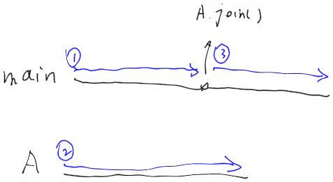

# multithread
## intro
本文简要学习了用C++进行多线程编程的可能，主要跟随[geeksforgeeks对于C++thread的介绍](https://www.geeksforgeeks.org/multithreading-in-cpp/?ref=lbp#)

从C++11开始多线程编程开始使用新引入的thread库。通过：
`#import <thread>`来使用这个库。

C++的multithread，不止thread库一个库，还有atomic，condition_variable,future,mutex，共计5个库。我们在下面一一介绍。

## 构建线程
线程类`std::thread`使用的构造函数要求一个函数，可以通过函数指针、函数对象或者lambda表达式来提供这个函数。这个函数将会是线程的工作逻辑，一般情况下，线程的生命周期从该函数运行开始，到该函数return时终止。
其中函数对象是指一个重载了括号运算符的类，见下文：

```cpp
//case1 construct in 3 ways
class functionobjt2 {
	void operator()(int n) {
		for (int i = 0; i < n; i++) {
			std::cout << "t2 " << std::endl;
		}
	}
};
void t1Launching(int n) {
	for (int i = 0; i < n; i++) {
		std::cout << "t1 " << std::endl;
	}
}
int main() {

	std::thread thr1(t1Launching, 4);
	std::thread thr2(functionobjt2(),4);
	std::thread thr3([](int n) -> void
		{
			for (int i = 0; i < n; i++) {
				std::cout << "t3 " << std::endl;
			}
		}, 4);
	return 0;
}
```
这样一个程序非常简单地展示了三种构造线程的办法。然而如果要运行这个程序，却会发生运行时错误，且输出的结果一次和一次不一样。有时候输出里，t1和t2在同一行；有时候则会输出一个回车行。这是为什么呢？

事实上，main作为主函数体，自身在运行时也是一个线程。如果我们只是在main中构造线程，而不规定线程的同步关系，那么极有可能发生：main线程已经结束了(分别构造了三个thread，并且return)而thr1-thr3却还没有执行完成。这样的话，main完成后执行归还全部进程资源手续，thr1-3就失去了执行所需的资源，从而被打断。

## 线程同步-线程等待
### std::thread::join()
`std::thread::join()` 对线程A调用join，约束了此语境下`*this`标识的线程，必须立刻停滞，等待A线程结束才继续执行。


在大多数的编程中，线程同步问题应该是程序员自己来解决的。C++没有设计一种机制来检查是否出现了同步问题，因为在编译时发现这些问题是非常困难的。比如回到刚才的代码，我们没有对thr1-3进行任何的同步控制，这立刻会造成至少两个问题：
1. main可能在thr执行完成前return并结束进程
2. thr1-3之间正争抢同一个资源：标准输出流cout。这也是导致输出内容混乱的原因。

```cpp
class functionobjt2 {
//注意：函数对象的括号运算符必须声明为public，否则默认为private，thread类无法访问这个函数从而造成编译错误
public:
	void operator()(int n) {
		for (int i = 0; i < n; i++) {
			std::cout << "t2 " << std::endl;
		}
	}
};
void t1Launching(int n) {
	for (int i = 0; i < n; i++) {
		std::cout << "t1 " << std::endl;
	}
}
int main() {

	std::thread thr1(t1Launching, 4);
	thr1.join();
	std::thread thr2(functionobjt2(),4);
	thr2.join();
	std::thread thr3([](int n) -> void
		{
			for (int i = 0; i < n; i++) {
				std::cout << "t3 " << std::endl;
			}
		}, 4);
	thr3.join();
	return 0;
}
```
输出结果如下：
```
t1
t1
t1
t1
t2
t2
t2
t2
t3
t3
t3
t3
```

有了join函数，就可以在线程之间设置一个简单的排队，完成最简单的线程同步。

### join的条件
thread有一个方法叫做`joinable()`。事实上有一些进程不允许被另一个线程join，这样的线程需要满足一下任何一条：
1. 默认构造的线程，一般被认为是空线程，这样的线程没有执行逻辑，不可以被其他线程join
2. 执行了move的move源线程，比如下面的a：
	```cpp
	thread a(somefunction)
	auto b = std::move(a);
	```
	被move的对象一般认为是**应当销毁的**，会在任何时候被gc，所以不能被另一个线程join
3. 如果线程已经被调用过join或者detach

在之前的例子我们可以看到：
main调用了thr1.join()，main等待thr1结束才会继续执行
main调用了thr2.join()，main等待thr2结束才会继续执行
main调用了thr3.join()，main等待thr3结束才会继续执行

那么如果thr1已经被join，后面的不论是任何线程，都不可以再join thr1。joinable与调用的母线程无关，而只与线程本身有关。

### std::thread::detach()
detach类似于为join解绑，让调用线程的母线程和被调用的子线程彼此独立开来。可以认为，detach是为线程进行类似于delete的操作，事实上是执行销毁前准备，即断联。

detach的条件和join的条件比较类似。一个线程调用detach抛出错误当且仅当：
1. 这个线程是non-joinable的
2. 空线程或被move的线程

### std::this_thread
`this_thread`是一个namespace，其中写了四个关于`当前线程`的非成员函数。
#### std::this_thread::get_id() noexcept
```cpp
std::thread::id main_thread_id = std::this_thread::get_id();

void is_main_thread() {
  if ( main_thread_id == std::this_thread::get_id() )
    std::cout << "This is the main thread.\n";
  else
    std::cout << "This is not the main thread.\n";
}
int main() 
{
  is_main_thread();
  std::thread th (is_main_thread);
  th.join();
}
```

#### std::this_thread::yield()
这个函数最常用的语境是一个线程判断自己能否继续执行，不能则进行自我阻塞以等待。
```cpp
#include <iostream>       // std::cout
#include <thread>         // std::thread, std::this_thread::yield
#include <atomic>         // std::atomic

std::atomic<bool> ready (false);

void count1m(int id) {
  while (!ready) {             // wait until main() sets ready...
    std::this_thread::yield();
  }
  for (volatile int i=0; i<1000000; ++i) {}
  std::cout << id;
}

int main ()
{
  std::thread threads[10];
  std::cout << "race of 10 threads that count to 1 million:\n";
  for (int i=0; i<10; ++i) threads[i]=std::thread(count1m,i);
  ready = true;               // go!
  for (auto& th : threads) th.join();
  std::cout << '\n';

  return 0;
}
```

可以参看下面的atomic部分来理解这段程序。

## 线程同步-原子量
即使能够使用join，也还是没法书写操作系统课程中介绍的全部同步问题，比如读者写者问题等。

C++用头文件`<atomic>`编写了原子量的内容，其中最重要的内容是atomic类。
atomic是一个模板，必须在使用时给出T：
```cpp
std::atomic<bool> atom;
```
atomic的本质是一个T类型的量，但这个量附加了这样的机制：如果访问atomic量的若干线程没有排好队有序地访问，

### 构造atomic

|constructor|define|
|--|--|
|default (1)|atomic() noexcept = default;|
|initialization (2)|constexpr atomic (T val) noexcept;|
|copy [deleted] (3)|atomic (const atomic&) = delete;|

atomic的拷贝构造函数是删除的，同样拷贝赋值运算符也是禁止的。	

### std::atomic::load(), std::atomic::store()
顾名思义，用于读和写原子量的两个函数。
