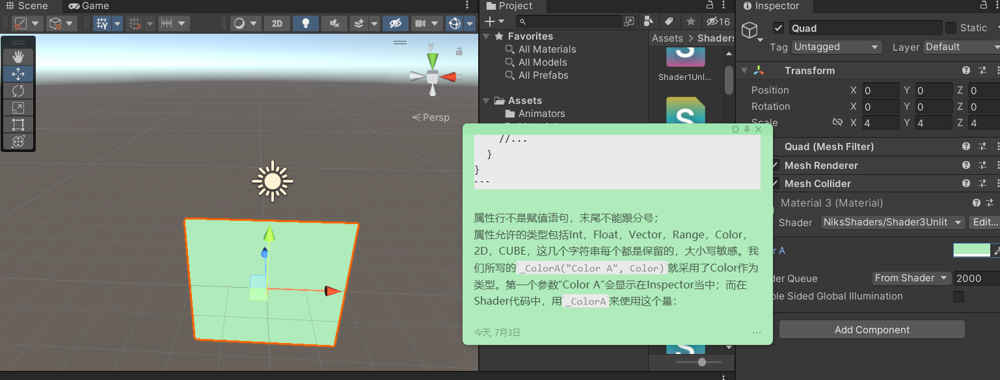
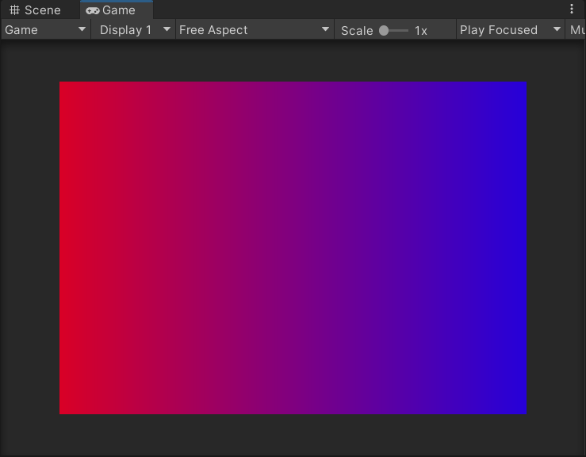

## 1 Vectors
`_Time.y`这个写法值得一说，这里的_Time是一个Unity定义好的Uniform量。回顾openGL当中，我们在顶点着色器里写一个uniform量，这个量就可以在渲染程序的全程（一般就是顶点着色器+像素着色器）当中任意使用，uniform的值是来自C++程序的，换言之也是主存传给显存的。
_Time是一个这样定义的四维浮点向量：
```
_Time.x = time/20
_Time.y = time
_Time.z = time * 2
_Time.w = time * 4
```

如此就可以在着色器中使用时间了。time总是等于游戏开始后直至当前的秒数。

像之前一样apply给Material，就能看到一个渐变迪斯科风格的变色矩形。

## 2 Properties
Properties列表中的每一项都会出现在Inspector中，用于调试交互。
```
Shader "NiksShaders/Shader3Unlit"
{
    Properties
    {
        _ColorA("Color A", Color) = (1,0,0,1)
    }
    SubShader
    {
        //...
    }
}
```

属性行不是赋值语句，末尾不能跟分号；
属性允许的类型包括Int，Float，Vector，Range，Color，2D，CUBE，这几个字符串每个都是保留的，大小写敏感。我们所写的`_ColorA("Color A", Color)`就采用了Color作为类型。第一个参数“Color A”会显示在Inspector当中；而在Shader代码中，用`_ColorA`来使用这个量：

我用取色滴管取了便签条的颜色，立刻看到quad变成了相同的颜色。很妙吧。相关代码如下：
```
Shader "NiksShaders/Shader3Unlit"
{
    Properties
    {
        _ColorA("Color A", Color) = (1,0,0,1)
    }
        SubShader
    {
        Tags { "RenderType" = "Opaque" }
        LOD 100

        Pass
        {
            //...
            fixed4 _ColorA;
            fixed4 frag (v2f_img i) : SV_Target
            {
                fixed3 color = 1;
                return _ColorA;
            }
            //...
        }
    }
}
```

这一节的视频还讲了个lerp，没什么说法
注意，在Properties部分定义属性时不要写分号，但是在Pass内、和着色器函数并列的位置声明要使用属性的时候，使用语句是必须加入分号的，形如`fixed4 _ColorA;`

## 3 Blending
我们回看一下前两节所指示的像素着色器的函数头：
`fixed4 frag (v2f_img i) : SV_Target`
这里的`v2f_img`输入是一个预定义在"UnityCG.cginc"下的结构体。
回顾openGL，顶点着色器的输出一般是一个a_Pos和一些自己规定的Uniform量(同时还有隐含的z值)

视频作者：Setting uv in the vertex shader ensures the fragment shader receives an interpolated uv version. 如此我们就可以在像素着色器当中使用顶点着色器输出的uv了。

Tips: 在Unity规范下，一个图像的左下角是uv(0,0)。

我们之前使用的像素着色器参数`v2f_img i`当中隐含了我们通常要在openGL中手动定义的uv。由于v2f_img是专门为image图像设计的类型，所以这里的uv就是在正方形中的像素对应位置，比如左下角的像素就会拿到(0,0)。
```
fixed4 _ColorA;
            fixed4 _ColorB;

            fixed4 frag(v2f_img i) : SV_Target
            {
                float delta = i.uv.x;
                return lerp(_ColorA, _ColorB, delta);
            }
```

这样就能得到一个从左向右渐变的图像：


为了深入理解这个过程，也可以不使用`v2f_img`

## 着色器语义

`Semantics语义`是cg语言中的一个概念。cg中的语义都是大写的，其意味着把一个shader使用的输入输出量和渲染硬件中的量对应起来的绑定关系。我们自定义的代替`v2f_img`的结构体将会使用到几个语义，包括：`SV_POSITION`和`TEXCOORDn`
**着色器语义**是一种在C，C++ & C#等高级程序语言中没有的写法或者说特性。在高级语言中，只要声明了变量，变量名就能维持内存的一贯性，一个变量名指代一个内存空间；而在GPU编程中，数据不再放在连续的内存里，而是在一个个GPU单元的寄存器中。像素着色器要去哪里寻找顶点着色器输出的一个量，这种时候变量语法就不再非常适用了。

在编写顶点着色器的时候，我们会给一个输入或者输出定义类型，这些类型中的每一个成员都拥有一个着色器语义。比如看下面的例子：

一个顶点着色器：
```
v2f vert(appdata_base v){
    v2f o;
    o.vertex = UnityObjectToClipPos(v.vertex);
    o.position = v.vertex;
    o.uv = v.texcoord;
    return o;
}
```

`appdata_base`是预定义的：
```
struct appdata_base{
    float4 vertex:POSITION;
    float3 normal:NORMAL;
    float4 texcoord:TEXCOORD0;
    UNITY_VERTEX_INPUT_INSTANCE_ID
}
```

一个简单的过程，顶点着色器输出了一个POSITION，而像素着色器索取一个输入POSITION，这就形成了一个输出和输入的对应。

在openGL cg profiles当中也有语义的概念，其中说凡是使用了一个语义，比如vertex被绑定了POSITION语义，其隐含的意思就是这个量必须存储在POSITION对应的寄存器当中，每个语义都隐含对应了一个寄存器。而DirectX(Unity也使用DX)则没有这样隐含的对应关系，不同的运行情况下，POSITION语义的量将可能存入不同的寄存器。不过，尽管随便写语义也不会必定造成错误，依然推荐程序员为保证良好的程序可读性按实际语义来绑定semantics。

用鼠标指着这些标成蓝色的semantics，可以链接到HLSL文档的介绍。当中罗列了 顶点着色器输入语义、顶点着色器输出语义、像素着色器输入语义和像素着色器输出语义，数量很少。可以看到，很多语义在上述四处出现了不止一次，比如如果COLORn出现在顶点着色器输出里，其表示漫反射或镜面反射颜色；而如果出现在像素着色器输出，其表示最终的颜色；出现在像素着色器输入表示漫反射或镜面反射颜色，与顶点着色器输出同义。同义也就意味着，顶点着色器输出的那个颜色量正应该被像素着色器拿来使用。

此外，倘若同一个语义所使用的类型定义维数不符也是允许的。比如，顶点着色器使用一个float4输入，语义声明为TEXCOORD0，其实际寄存器内容只会是float2(x,y)，那么输入接受的结果将会是(x,y,0,1)，**原则是缺少分量补0，w分量补1**

### 系统值着色器语义/SV语义
D3D9开始就已经支持了semantics，而只有D3D10和之后的版本支持系统值semantics【System-Value Semantics】，而我们使用的SV_POSITION & SV_Target 都属于系统值semantics。
### 顶点着色器输入
`UnityCG.cginc`定义了三个常用的顶点结构，他们的源代码定义如下：
```
struct appdata_base {
    float4 vertex : POSITION;
    float3 normal : NORMAL;
    float4 texcoord : TEXCOORD0;
    UNITY_VERTEX_INPUT_INSTANCE_ID
};//位置、法线和一个纹理坐标。

struct appdata_tan {
    float4 vertex : POSITION;
    float4 tangent : TANGENT;
    float3 normal : NORMAL;
    float4 texcoord : TEXCOORD0;
    UNITY_VERTEX_INPUT_INSTANCE_ID
};//位置、切线、法线和一个纹理坐标。

struct appdata_full {
    float4 vertex : POSITION;
    float4 tangent : TANGENT;
    float3 normal : NORMAL;
    float4 texcoord : TEXCOORD0;
    float4 texcoord1 : TEXCOORD1;
    float4 texcoord2 : TEXCOORD2;
    float4 texcoord3 : TEXCOORD3;
    fixed4 color : COLOR;
    UNITY_VERTEX_INPUT_INSTANCE_ID
};//位置、切线、法线、四个纹理坐标和颜色。
```

在目力所及的范围内，顶点着色器只应该使用这三种结构之一。每个结构的定义都使用了一些语义，他们各自的意义也是不辩自明的。
### 顶点着色器输出和片元着色器输入
顶点着色器需要输出的顶点是NDC空间坐标，注意在Unity中一般不叫NDC normal divice coordinates标准设备坐标，而是叫做FCSC final clipped space coordinate最终裁剪空间。顶点着色器的输出必须有SV_POSITION语义，且为float4类型。

技巧：saturate(x) 就是openGL的clamp，把x截断进[0,1]范围。
TIPS 这里记录一下，本机的`UnityCG.cginc`的位置：`D:\Unity\Unity 2021.2.8f1c1\Editor\Data\CGIncludes`
[UnityDoc关于着色器语义的介绍](https://docs.unity.cn/cn/current/Manual/SL-ShaderSemantics.html)

对于blending章节的这个样例着色器，我们可以做一个简单的分析。
```
Shader "NiksShaders/Shader5Unlit"
{
    SubShader
    {
        Tags { "RenderType"="Opaque" }
        LOD 100
        Pass
        {
            CGPROGRAM

            #pragma vertex vert
            #pragma fragment frag

            #include "UnityCG.cginc"

            struct v2f {
                float4 vertex:SV_POSITION;
                float4 position:TEXCOORD1;
                float2 uv:TEXCOORD0;
            };
            v2f vert(appdata_base v){
                v2f output;
                output.vertex = UnityObjectToClipPos(v.vertex);
                output.position = v.vertex;
                output.uv = v.texcoord;
                return output;
            }
            fixed4 frag (v2f i) : SV_Target
            {
                fixed3 color = saturate(i.position * 2);
                return fixed4(color, 1.0);
            }
            ENDCG
        }
    }
}
```

原来的正方形位置在原点，scale = 4，边长来到了4，在世界坐标中左下角的坐标就是(-2,-2, 0), 这个点被appdata_base v作为输入送给顶点着色器，执行了`UnityObjectToClipPos(v.vertex)`，这样相当于左乘MVP，结果是(-0.5,-0.5,0)
这个顶点对应的片元着色器又把i.position拿出来使用，i是插值之后的顶点着色器输出, 直接看左下角这个顶点位置的片元，其不会进行插值，那么i.position = (-0.5, -0.5 , 0)，x2 = (-1,-1,0)
最终整个左下四分之一个正方形都会被clamp成0，从而显示纯黑色。

## 绘制正方形
值得一提的就是，在shader当中应当比CPU编程更加注重去分支，也就是极力避免bool量和if判断。这是因为if分支将会导致同一个shader片段被分入两个或多个wrap从而伤害性能。所以我们看到当中写了个不非常直观的step减法，想办法用数学来绕过if判断

## 鼠标拖动正方形
这一节视频非常值得一说，很有代表性地在shader中获取一些运行时信息。概括起来，update逐帧更新一个脚本的成员`Vector4 TrackMouse::mouse`,并同样在update内把更新后的mouse向量通过setVector赋值给material。材质组件为我们封装了这个过程的底层细节，事实上逐帧更新的setVector就是在修改一个uniform量。在游戏循环中，update所有monobehaviour的时序下也一定会update渲染管线，一次新的draw会发生，从而实现动态的着色效果。


```
void Update()
    {
        RaycastHit hit;
        Ray ray = camera.ScreenPointToRay(Input.mousePosition);

        if (Physics.Raycast(ray, out hit))
        {
            mouse.x = hit.textureCoord.x;
            mouse.y = hit.textureCoord.y;
        }
        material.SetVector("_Mouse", mouse);
    }
```