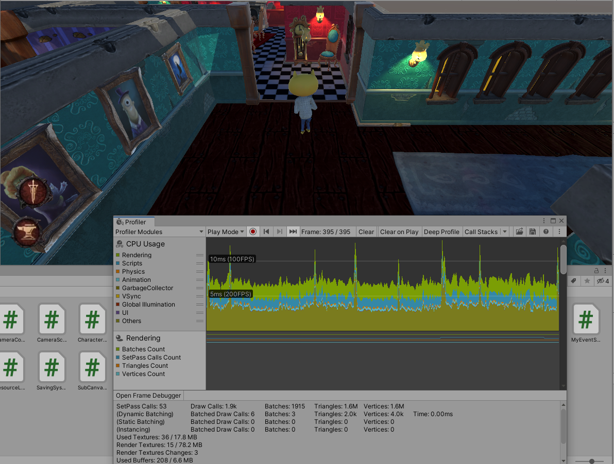
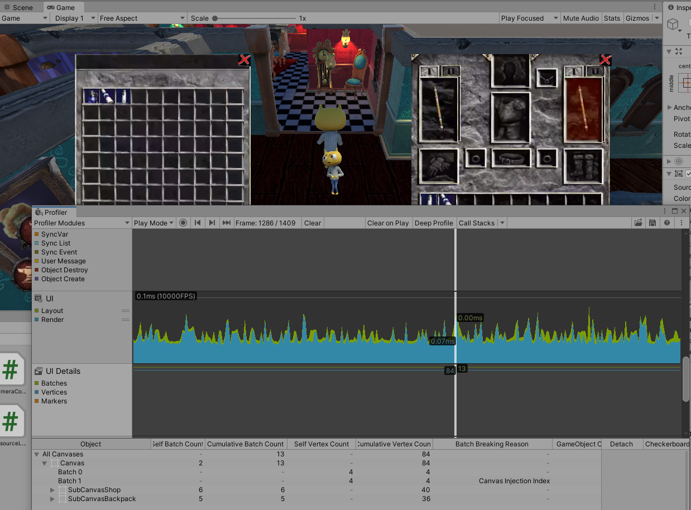
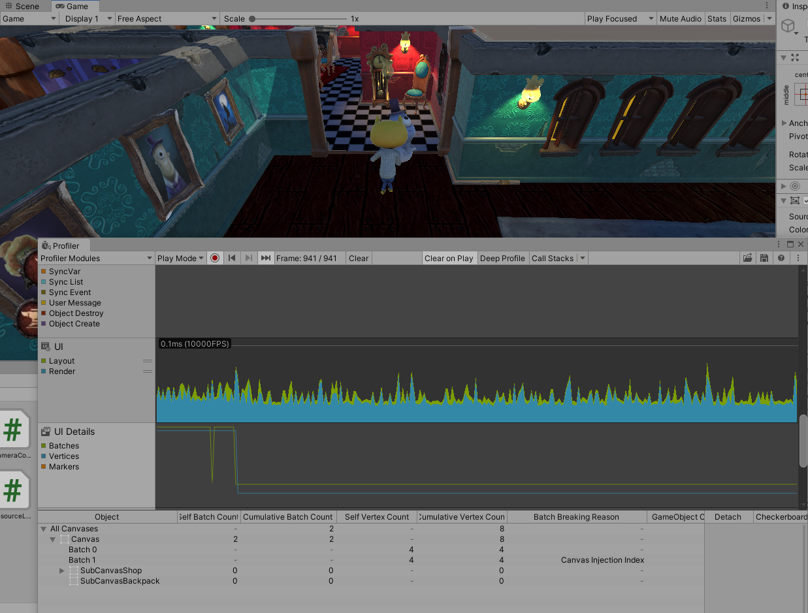
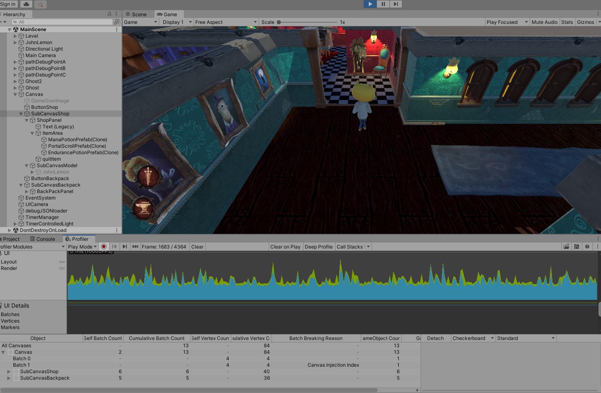
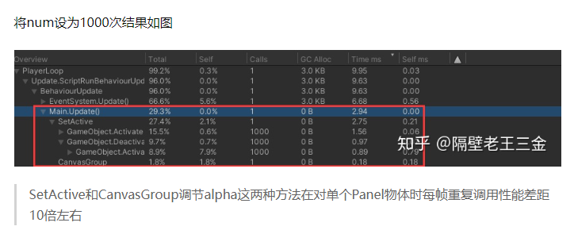

- [1. 一周工作的简单总结](#1-一周工作的简单总结)
- [2. 关于隐藏UI控件高效的办法](#2-关于隐藏ui控件高效的办法)
  - [2.1 用Profile探索各种UI隐藏手段的性能开销](#21-用profile探索各种ui隐藏手段的性能开销)
    - [写法canvas group](#写法canvas-group)
    - [写法Transform Translate](#写法transform-translate)
    - [写法SetActive](#写法setactive)
    - [后续思考](#后续思考)
  - [2.2 关于在canvas上绘制带动画人物模型的探讨](#22-关于在canvas上绘制带动画人物模型的探讨)
- [3. 从本地文件获取背包内容/游戏运行时信息持久化](#3-从本地文件获取背包内容游戏运行时信息持久化)
- [4. 对于自己实现的事件系统的思考](#4-对于自己实现的事件系统的思考)
- [5 解耦反思 \& 事件系统重构](#5-解耦反思--事件系统重构)
  - [游戏编程模式对观察者模式的实现](#游戏编程模式对观察者模式的实现)
---
# 1. 一周工作的简单总结

**已完成工作总结如下：**
1. 搭建游戏场景，并实现角色在场景中漫游
2. 实现相机的跟随移动
3. 背景音乐和脚步声(脚步声使用动画事件触发)
4. 幽灵行为逻辑和幽灵预制体
5. 地图NavMesh的烘焙 + 幽灵NavAgent配置 + 幽灵正确的寻路AI逻辑
6. 用射线检测方法实现了扇形视野(值得探讨)
7. 使用GIMP抠图改图
8. 实现Input事件接口的MyButton(值得探讨)
9. 正确配置layout的背包UI和商城UI
10. 背包内容/商城内容持久化的写入和读出
11. 自己实现的事件系统和基于事件系统的定时器
12. 使用Profile去分析不同UI实现方案的性能差异

**偷懒/能力不足而没有做好的需求总结如下：**
1. Resource动态加载制作了一个加载指令，而没有实现地图分块、按区加载的逻辑
2. AssetBundle没有深入研究
3. 移动做的很烂但是没有去学习周三作业答案来优化
4. UI位移罗盘没有做
5. 老师指出按键按下应当使用Animation作为动画效果，偷懒采用color/scale做了简单的效果
6. 事件系统应该设置宏观的事件管理器统一管理所有事件，没写
7. 老师建议尝试自己实现Collider/Trigger，没有自己实现

**没有解决的问题：**
1. 发现了一个Unity Transform的疑似bug
2. 更好的UI组件隐藏办法是什么，canvas group alpha/Transform/SetActive
3. **Timer不应该写成Component**，但是直接写成Timer类的写法TimerManager和Timer互相引用，没有找到好的解决方式
4. 自己实现的事件的安全删除问题，详见后面第三部分的探讨
5. 扇形的向量计算真的算实现了扇形碰撞体积吗
6. 相机一直被场景遮挡，能不能做出一个摄像机逻辑，既要距离人物很近从而看清细节，又要剔除到人物之间的障碍物以免被遮挡


# 2. 关于隐藏UI控件高效的办法
## 2.1 用Profile探索各种UI隐藏手段的性能开销
在CSDN直接搜索UI隐藏手段会看到一个在很多篇文章中都出现的不谋而合的说法：
`隐藏UI的最佳策略是通过canvas group组件设置alpha = 0`，这种写法比之SetActive，节省了调用Awake()的开销

[Unity隐藏UI界面最优方案 CSDN博客](https://blog.csdn.net/Test_Two/article/details/121491695)
[UnityUGUI 显隐效率对比 知乎](https://zhuanlan.zhihu.com/p/264833204)
我打算自己来实现以下几种不同的方案，看一看Batch量的profile分析结果
Profile是Unity提供的一款性能分析工具, 与Editor一同发布, 我们可以在Window菜单下找到(Window->Analysis->Profile).

### 写法canvas group


锁定到UI这边，可以看到另一个问题，使用了几个不同的物品贴图，由于每个物品都是一个不同的纹理，这里两个面板一个用了6batches，一个用了5batches，如果能够把x贴图、物品贴图整合到一个图集当中，这里的batches都会退化到3 batches.

当我们quit两个plane，就能看到确实**整个UI batches骤降**：


这时候的UI batches确实骤降了，两个UI组件都不再绘制，Canvas的剩余batches来自于左侧两个红色的按钮的texture

### 写法Transform Translate
可以看到在Translate出屏幕的时候，这边的参数和刚刚的参数有**很大的差别**（高能）：

在画面不可见的case下，self batch count = 13，且cumulative batch count和画面显示状态的数量是一样的，依然保持着13 batches，且cumulative vertex count也是比较大的。那么到底cumulative batches的性能开销怎么样呢？

[UnityMANUAL - ProfileWindow](https://docs.unity3d.com/cn/current/Manual/ProfilerWindow.html)
Cumulative Batches 表示`Unity 为画布及其所有嵌套画布生成的批次数量`，而Cumulative Vertex Count表示`此画布和嵌套的画布渲染的顶点数量`.

这两个数值不为0，**意味着即便一张画布移出了屏幕范围，Unity依然为这些画布生成了数量不少的Batches**。我不知道我的理解是否准确，但是我认为这里的意思是即便这些顶点会在裁剪阶段剔除。裁剪发生在装入和顶点着色之后，所以事实上这些Batches有着不可忽视的性能开销。

大家觉得是不是这样呢？

补刀，这里的Translate量 x y z我都试过了，无论怎么移动batches都消不掉。

此外，Translate要进行一步矩阵运算，移出一个canvas意味着把对应的顶点位移到屏幕外，这也意味着一笔开销。

### 写法SetActive

大家都知道SetActive的效率比较差。
上面引用的这篇知乎文章测了SetActive与Alpha方法的性能对比，Alpha方法是CPU优化更佳的。此外，SetActive如果附带了对Text子组件的激发，就会导致非常大的性能消耗。


### 后续思考
我这边的项目设置把RenderMode设置为ScreenSpace模式Camera，指定了UI Camera作为主Canvas的RenderCamera，并且把UICamera入栈到MainCamera的Stack里。

在这种模式下，最好的UI隐藏方法似乎就是CanvasGroupAlpha这种写法。也许其他的模式下可能会有差别，留待有时间再继续测试

## 2.2 关于在canvas上绘制带动画人物模型的探讨
我的做法目前是：直接把人物作为Canvas的子物体，在商店页面call的时候把人物模型SetActive，在商店页面Quit的时候把人物模型SetActive(false).这样的写法的好处是在商店页面没有调出来的时候，人物模型和动画不会引起任何drawcall，而且这种方法比直接构造一个人物模型预制件开销小。

canvas group alpha这种方法好虽好，但是只能影响UI组件，并不能影响人物模型。目前并没有想到更好的办法。

# 3. 从本地文件获取背包内容/游戏运行时信息持久化
在写背包的时候我意识到，可以考虑写一个背包物体到JSON的转储模块，本身可以用来作为存档功能，未来如果服务端数据也是用JSON说不定也能用得上。

JSONUtility提供了把类对象转化为json字符串的方法，比较讨巧的一个做法是使用PlayerPref的注册表写入功能，PlayerPref写入的格式只能是键值对：
```cs
PlayerPrefs.SetString(key, jsonToGenerate);
```
所谓取巧办法，就是让一个key作为一个注册表项，一个json字符串作为这个key的值，这样就可以实现背包物体的保存了

详见展示

# 4. 对于自己实现的事件系统的思考
C#本身就有事件机制，事件的本质是以观察者模式(或者说发布订阅模式)这样一种被动而节省性能的方式进行类间通讯。现在我们要利用C#语言在项目中定义出一个类，并让他来实现C#事件已经完成了的功能。

在C#中，一个事件的工作范例如下：
```cs
public class A : Monobehaviour
{
    public System.EventHandler<AEventArgs> aEvent;
    //...
}
public class B : Monobehaviour
{
    public A aref = gameObject.GetComponent<A>();
    void Start()
    {
        aref.aEvent += OnAEvent;
    }
    private void OnAEvent(object sender, AEventArgs args)
    {
        //...
    }
}

```

在这个过程当中，作为发布者的A拥有一个事件成员；作为订阅者的B通过+=运算符把一个回调函数`绑定`在这个事件上，表示事件一旦被激发，B就被告知应当立即执行OnAEvent作为响应。

首先我们应当定义事件。事件要负责订阅者和发布者之间的通讯，发布者和订阅者互相不必感知。发布者只要知晓事件变量，就可以对事件变量调用`Invoke()`,从而让另一方的所有订阅者知晓。发布者可以拥有事件，也可以通过引用事件来激发事件。如果希望**让发布者不持有事件的引用**，也可以再设计一个上层的事件管理器，让发布者按事件的类型或名称去查找事件以进行发布。

为此，一个事件需要管理一张订阅者表，更具体的说是订阅者的回调函数的表。
```cs
public delegate void voidelegate();
public class MyEvent
    {
        private List<voidelegate> _mySubscribersList;
        //...
    }
```
这张表当中存放的是特定类型的委托。在C++中我们一般用函数指针来完成这件事，C#中最接近函数指针的机制就委托。

事件类MyEvent应该包含最基本的几个功能，Subscribe订阅和UnSubscribe接触订阅，Invoke激发。除此之外还有两个点，1是C# event提供一个`event?.Invoke()`的写法，主要是用于防止事件没有订阅者造成错误，我们可以用private函数isEventEmpty完成类似的功能；2是这样的事件可能会造成潜在的**安全删除问题**

详见代码演示

# 5 解耦反思 & 事件系统重构
之前和同学争执一件事情，时候我不禁疑惑，事件的典型应用场景究竟是什么样的呢。我习惯于让发布者去持有一个事件成员，这样写是不是造成耦合呢？

好的代码可能有很多种形态，但是其中非常重要的两个性质一定是低耦合以及高性能，尽管有时候这两者可能会有矛盾。

我们来探讨一下，我们之前写出来的这一版本的事件系统究竟有什么问题，他是不是耦合，他是不是好用，以及**究竟应该怎么改动**、或者好的事件系统是什么样的。

## 游戏编程模式对观察者模式的实现
Games Programming Partern当中介绍了观察者模式，本质上和发布订阅模式是一样的
发布者=被观察者=监听对象
订阅者=观察者=监听者

订阅者规定自己在接受讯息时候怎么相应，这个函数在GPP中被实现为`OnNotify()`.
GPP的一段C++代码如下：
```cpp
class Achievement : public Observer
{
    public:
    virtual void OnNotify(const Entity &entity, Event event){
        switch(event){
            case EVENT_ENTITY_FELL://处理实体跌落事件的处理函数
            break;
            //...
        }
    }
}
```
