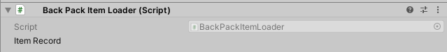

## 如何让self-made struct在Inspector显示/序列化与反序列化
一个较为常见的实践问题是：Unity的Inspector是优秀的工具；然而其具有不可绕过的一个残缺，即UnityInspector中无法显示Struct以及Dictionary.
尽管默认情况下这两种信息是不可显示在Inspector的，但我们可以这样做：
让任何需要序列化的内容包裹在struct当中，并且用struct实现接口`ISerializationCallbackReceiver`.这个接口只有两个方法：`public void OnBeforeSerialize()`以及`public void OnAfterDeserialize()`。

这里就要讲到两个函数的调用时机以及他们的意义，分别对应序列化前执行和序列化后执行。

序列化是一个很广泛的概念，一般来说面向对象编程的各种类和实例都以一种相对松散的方式组织内存，如果要进行存储或者传输，这样的对象信息密度很低，也就是说传输的效率低、存储的占用大。因此，凡左要进行网络通讯或是存储一些信息时候往往都要用到序列化。在Unity开发中，更多的序列化的语义是C#管理的序列化。

须知，即便出于Inspector优化工作流目的的序列化和反序列化过程造成了很多开销，也并不会影响到游戏性能，这是因为序列化与反序列化的代码都只会在Editor阶段执行，打包后的项目中不应该出现这些代码，因为不会调用。然而如果在网络传输代码中写到较为复杂的序列化流程，确实会影响性能。

我们分别举两个例子。
第一个例子中，我们希望在Inspector当中呈现一个结构体，其有这样的内容：
```cs
public struct ItemRecord
{
    string itemName;
    Vector2Int ItemPos;
}
```

Vector2Int和string本身都是可以序列化的，而组合成的ItemRecord却不行。这个时候可以采用C#的特性`[Serializable]`
```
public class BackPackItemLoader : MonoBehaviour
{
    public ItemRecord itemRecord;
    [System.Serializable]
    public struct ItemRecord
    {
        string itemName;
        Vector2Int ItemPos;
    }
}
```
这个时候看一下效果：

序列化并不奏效，没有出现我们所想象的两个供我们填写的框。这是由于Unity的序列化流程中，struct不会进行序列化。应当把ItemRecord从struct改成类class。

另一方面，我们可以通过实现`ISerializationCallbackReceiver`接口来让Dictionary可以序列化在UnityInspector当中。

```cs
public class BackPackItemLoader : MonoBehaviour, ISerializationCallbackReceiver
{
    public Dictionary<Sprite, string> sourceImageByNameDict = new Dictionary<Sprite, string>();
    public List<Sprite> _sourceImageList = new List<Sprite>();
    public List<string> _itemNameList = new List<string>();
    public void loadItemListFromApi()
    {
        throw new System.NotImplementedException();
    }
    public void OnBeforeSerialize()
    {
        _sourceImageList.Clear();
        _itemNameList.Clear();
        foreach(var pair in sourceImageByNameDict)
        {
            _sourceImageList.Add(pair.Key);
            _itemNameList.Add(pair.Value);
        }
    }
    public void OnAfterDeserialize()
    {
        sourceImageByNameDict.Clear();
        for(int i = 0; i < Mathf.Min(_sourceImageList.Count,_itemNameList.Count); i++)
        {
            sourceImageByNameDict.Add(_sourceImageList[i], _itemNameList[i]);
        }
    }
    [System.Serializable]
    public class ItemRecord
    {
        public string itemName = "";
        public Vector2Int ItemPos = Vector2Int.one;

    }
}
```