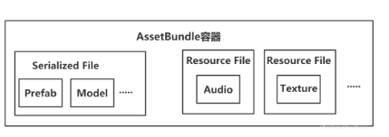
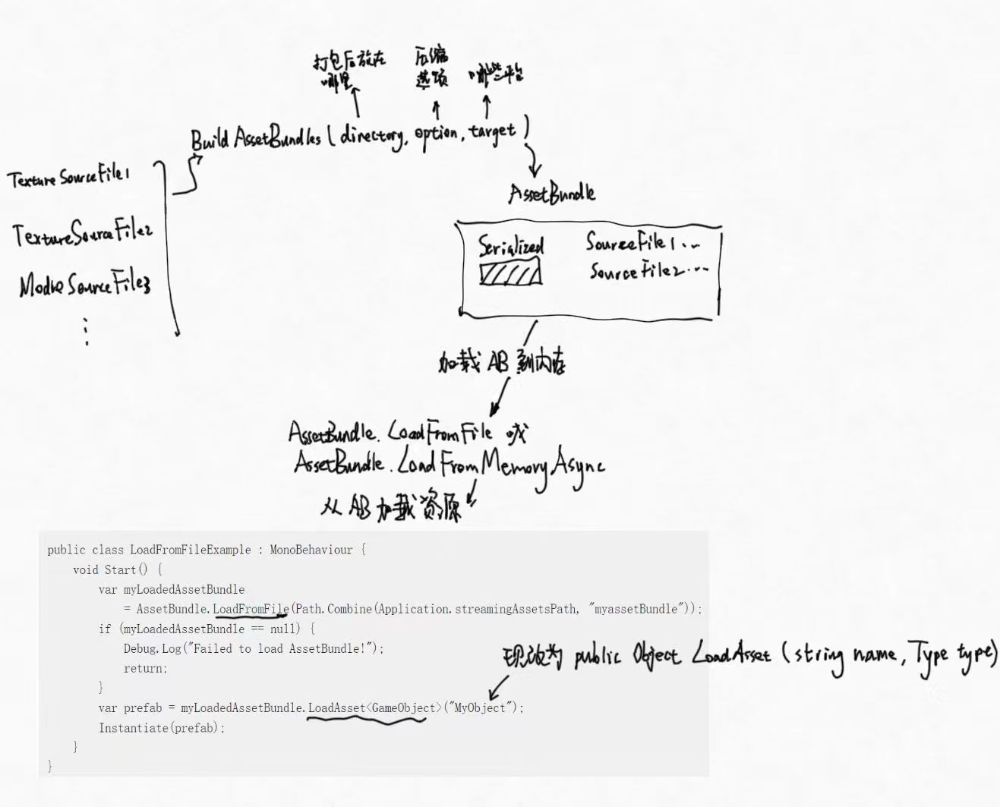
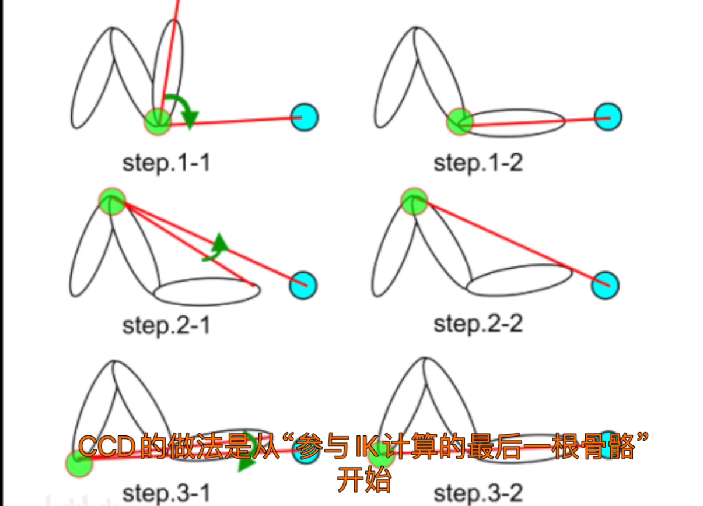

# P1 Unity渲染管线
## Q1 URP和Builtin管线有什么差别
## Q2 介绍下基础的UnityShader用法
## Q3 介绍小URP UnityShader的编程过程
# P2 UGUI
## Q1 纹理九宫格
纹理切割九宫格问题是在游戏开发中常遇到的一个问题，主要涉及将一个纹理（texture）分割成九个部分，以适应不同大小的UI元素或精灵对象。这样可以确保在缩放时，边框和角落部分不会失真，而只有中间部分进行拉伸。

然而，纹理切割九宫格也可能会带来一些潜在的性能问题，包括：

内存消耗：为了支持九宫格切割，需要将原始纹理分割成多个小纹理片段，并将它们分别保存。这可能会导致额外的内存消耗，尤其是当使用大量纹理和频繁进行切割时。

drawcall次数：每个切割后的纹理片段都需要单独进行绘制调用。如果在界面上同时存在许多使用了九宫格切割的元素，会导致绘制调用次数增加，从而影响渲染性能。

纹理切换：在运行时动态改变UI元素或精灵对象的大小时，可能需要根据具体大小选择不同的切割纹理片段。这涉及到纹理的切换，而纹理切换可能会带来一定的开销。

动态生成：如果使用动态生成的方式进行纹理切割，即在运行时根据需要动态切割纹理，这可能会消耗较多的CPU资源和时间，并且在频繁切换时可能会影响性能。

## Q2 UI的三种渲染模式

## Q3 什么是Canvas Rebuild

## Q4 图集SpriteAtlas，为什么、如何使用图集？
- Why 
在Profile当中测试，会发现，如果背包中有五个物品，他们分别有自己的图标，那么这五个物品将会引发五次batch。UI编程的一个重要优化任务就是减drawcall，图集也就应运而生。图集把一大批往往会同时出现的图片组装成一张图，在绘制时去大图中取出一部分来绘制。这样就能把刚刚的五个drawcall合并为一个。

- How
```cs
public class SpriteAtlasExample : MonoBehaviour
{
    public SpriteRenderer spriteRenderer; // Reference to the SpriteRenderer component

    [SerializeField]
    private SpriteAtlas spriteAtlas; // Reference to the SpriteAtlas asset

    private void Start()
    {
        if (spriteAtlas != null && spriteRenderer != null)
        {
            // Get a sprite from the SpriteAtlas using its name
            Sprite sprite = spriteAtlas.GetSprite("SpriteName");

            // Assign the sprite to the SpriteRenderer
            spriteRenderer.sprite = sprite;
        }
    }
}
```

## Q5 Unity UGUI mask

## Q6 如何控制UI的渲染顺序

## Q7 如何在UI上显示模型

## 

# P3 Unity workFlow
## Q2 AssetBundle的原理是什么？
AssetBundle针对的Asset主要是模型、纹理、prefab、音频和场景，AssetBundle对于Unity资产生成一个存档文件/或称捆绑包，其最重要的功能：
1. 将可下载内容DLC放进AB里，运行时才从AB加载，大大减小安装包的大小
2. 减小运行时内存压力，将资源加载的粒度变小

Unity中，资产Assets是存储在磁盘上的，纹理材质模型音频等内容；而对象Object则是一组序列化的数据，任何资产都不能直接应用，而应该转化成Object才能在Unity程序中使用。最重要的区别就是资产是**未序列化**的，而对象是**序列化**的。资产和对象具有一对多关系，比如Scene场景资产对应了很多个对象，场景中的每个GameObject都是一个对象。


从图中可见，AssetBundle的组织形式是一份全部整合在一起的序列化文件，和若干分散的ResourceFile。
使用AssetBundle的时候，我们先把磁盘中的AssetBundle通过LoadFromFile加载成一个内存中的对象，这个对象包含了所有这个AB中的资源的文件路径映射。然后我们对这个对象调用LoadAsset，就能根据资产的名字和类型去查找到实际数据，并把它们也直接加载成内存中的对象。


## Q3 Unity UGUI适配

## Q4 GUID, LocalID, InstanceID/ Unity 资源生命周期
Unity对象之间可以互相引用，比如常见的，Material会引用Shader和Textures。序列化的对象通过两个数据来完成引用：GUID和LocalID。**GUID指示目标资源所存储的资产文件**。本地ID是在资产文件内唯一标识每个对象的本地唯一ID，因为一个资产文件可能包含多个对象。

GUID存储在资产的.meta文件里。所有导入的资产都会在导入时立刻由Unity分配一个GUID并写到meta文件里。Unity编辑器有一个特定文件路径到已知的所有文件的GUID的映射表，每当加载或者导入资产，分配新的GUID的同时，这个映射也会更新进映射表。

比较GUID是一个缓慢的过程，如果仅仅采用GUID + LocalID，确实robust，但是如果发现了尚未加载的对象，总是需要立刻根据GUID + LocalID计算文件还原源数据位置并进行加载，这是缓慢的。因此采用了缓存系统PersistentManager加速这个过程，缓存系统管理所有InstanceID - GUID - LocalID的映射

## Q4 Unity脚本生命周期
# P4 Unity动画
## Q5 Animator mask,layer,base machine

## Q6 IK的Unity用法和原理
UnityIK最简单的一个应用场景就是，把人物的手脚绑定到某个特定位置上，比如射击时候人手应该在枪托上，人物攀爬时手脚应该在岩壁表面等等。

如果人物模型本身就带有Avatar，那么可以这样做
1. 在人物上绑定Animator动画机
2. 在Animator平级位置添加一个Monobehaviour，IDE这个时候会提示，在这个Monobehaviour中可以重载OnAnimatorIK函数，这个函数接受一个layerIndex，会在Update的Animator阶段执行，一般用于调校IK goal
3. 在这里用Animator.SetIKPositionWeight设置IK权重，用Animator.SetIKPosition设置IKgoal位置。人的Avatar自带了骨骼上推断的IK goal位置，这个写法会把这个推断的IK goal也就是人的手、脚对应的那一段骨骼位移到传入的position上，并根据weight进行权重计算。然后，IK解算算法会根据手的位置倒退前面的每一节骨骼的位置

IK，反向动力学，其技术背景是CCD算法，Cyclic Coordinate Descent,可以翻译成迭代最近点算法。算法思想如下：

1. 把末端设置到一个位置
2. 从末端关节开始，逐层遍历每个关节，直到人物根骨骼：
   2.1 计算当前关节到IK Goal的方向向量
   2.2 计算当前关节到IK Goal的旋转向量
   2.3 把当前关节进行旋转，目标是让这节骨骼的末端尽可能靠近IK Goal，实际做法是从当前关节到整个骨骼的末端做一个连线，让这个连线和当前关节到IK Goal连线重合
   2.4 回到2.1，直到遍历了所有骨骼

# P5 开发难题和热门topic
## Q6 应对大世界的技术
大世界的困难点在于，顶点数量大；运行时占用内存大；纹理大，等等
关于顶点数量大，可以应用LOD技术；
运行时占用内存大，要求我们更明智地管理内存，可以使用地形分割技术和流式加载技术
超大地形会使用非常大的纹理，为了减小显存压力可以使用虚拟纹理技术

## Qx 用过哪些unity插件
## Qx 用过哪些Unity组件
## Qx 用何种数据结构管理场景中的对象
## Qx 
