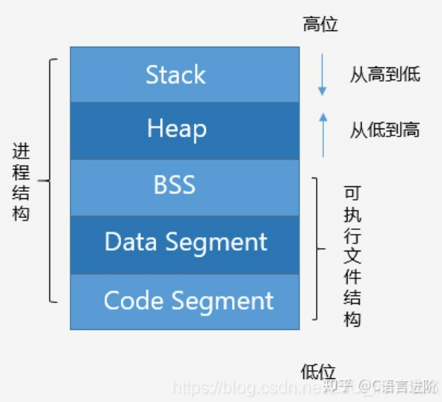

# 1.构造器，析构器，初始化
## 关键词
默认构造函数
隐藏构造函数
拷贝构造函数

## 默认构造函数
如果不定义构造函数，会默认合成一个默认构造函数(synthesized default constructor).他的工作包括：
1.如果在类内就赋值了一些成员，用这些初始赋值来初始化成员
2.如果没有，则执行默认初始化。

比如：
```cpp
class myclass{
public:
       int a=0;
       string name="y";
}
```
这些赋值都会在默认构造函数调用时初始化给成员。

**默认初始化**针对外部变量和类的成员。凡是没有定义的对象，都会被默认初始化。string类对象被默认初始化为""，而也有一些类没有指定默认初始化内容，比如int。

访问没有定义的int a 是不违法的，因为其被**值初始化**为0.


只有当一个类没有任何显式构造器时，才会生成默认构造器。但是如果就是希望C++帮助再生成一个默认构造器，可以这样写：
```cpp
MyClass()=default;
```
这样就会按照默认构造器规则生成一个默认构造函数。如此生成的默认构造函数是**内联函数**。

**拥有指针成员的类**不可以**依赖默认构造器**，因为默认构造器可能会给指针赋一个脏数据，导致访问非法地址。同样的，**拥有内置类成员的对象**也要**避免**使用**默认构造器**。

### 值和引用
如果要返回/传递 一个引用，在参数表或返回类型上加上引用符&即可：
```cpp
int addfunction(int &a,int b){
       a=a+b;
       return a;
}
```
引用作为参数，表示函数运行过程中使用的是一个对象本身。instead,如果使用值则只会使用这个对象的一个副本。所有对参数的更改只有在参数是引用型时才会在函数return后保留给实参。

大多数情况下，返回值都不会设定为引用。如果设定返回值为值，那么计算出的值将会被**拷贝**回调用点。设定返回值为引用只有一个目的：**返回引用时返回值是左值；否则返回值是右值**。**一个表达式不是左值就是右值**。**左值可以写在等号左边接受赋值，而右值不可以**。
```cpp
int& someFunction(int &a){
       //...
       return a;
}
//...
someFunction(a)=b;
```

**在列表初始化的构造函数中，成员初始化的顺序与在类内定义顺序一致，而不与构造函数参数表一致。**

当把一个类对象赋值给另一个变量，其所有的成员都被拷贝进左值变量的内存。在这个过程中，C++也帮我们自动合成了一个拷贝构造函数，相当于：
```cpp
myclass::myclass(myclass b){
       member1=b.member1;
       member2=b.member2;
       member3=b.member3;
}
```
### 构造器初始化列表
```cpp
myclass(string s,int t,double price):bookNo(s),units_sold(t),revenue(price*t){}
```
这样的写法就是构造器的初始化列表。可以在函数体花括号之前写上这些初始化，这并不妨碍花括号内其他内容的执行。初始化列表的构造器**先执行初始化列表**的初始化，**再执行花括号内容**。

### 默认实参
```cpp
public:myclass(string s="",int a=0，int b=0);
```
在声明构造函数时这样写表示默认实参。如果有定义了默认实参的构造函数，纵使没有这些默认参数，也可以调用构造函数。比如上面的例子，我们可以要用这样的方法去调用：
```cpp
myclass a();//a("",0,0)
myclass a("hello");//a("hello",0,0)
myclass a("hello",3)//a("hello",3,0)
```
总之，如果声明了默认实参的构造函数，必须从头到尾地填写参数、但可以填写到任意位置开始忽略参数。编译器从已有的实参一个一个地解析，与构造器第1，2,3个参数逐步匹配，直到发现参数数量不够，后面的所有**尾部参数**全都用默认实参填补。

不允许跳过左侧的参数直接填写右边的参数，哪怕这些参数类型在参数表中是唯一的、一眼就能看出意图。

这于是也要求我们在设计构造器的时候注意参数的编排顺序，应该将更需要用户填写、更不希望缺失的参数写在前面，而更不重要的参数写在右侧。

允许给两个参数类型依次全部匹配的构造器分别声明,前提是他们的默认实参不同：
```cpp
myclass(int,int,char);
myclass(int,int,char='*')
```
但不能就一个已存在的默认值做修改：
```cpp
myclass(int,int,char='*');
myclass(int,int,char='#');//报错
```
## 委托构造函数
委托构造函数delegate constructor是C++11新特性。允许类的一个构造函数委托同类的另一个构造函数构造自身。

```cpp
public:
myclass(string s,int t,double price):bookNo(s),units_sold(t),revenue(price*t){}
myclass():myclass("",0,0);
myclass(string s):myclass(s,0,0);
myclass(istream &is):myclass(){
       read(is,*this);
}

```
委托构造函数的参数表后写一个冒号，冒号后再写要委托的构造函数、以及花括号的代码内容。**会首先执行初始化列表，然后执行委托构造函数的花括号，最后执行当前构造函数的花括号。**

## 默认初始化和值初始化
对于对象，默认初始化和值初始化的区别不大，他们都执行**默认构造函数**；对于内置类型的变量而言，进行值初始化是更安全的，比如int被初始化为0，string被初始化为空串；而默认初始化则会使用无意义的数据。

在C++里，数据只有两种出现的形式：C++内置类型和类。内置类型和类好比模具，其对应的实例好比模具生产出的物品，内置类型的实例就是值，类的实例就是对象。
有这样一些表述涉及到了默认初始化：
1. 默认构造函数遵循：如果类内存在初始值，以初始值初始化成员；否则**默认初始化**成员。
2. 定义变量时没有指定初始值，则会对变量**默认初始化**，但在函数体内定义局部变量而不指定初始值**不会进行初始化**，从而造成undefined风险

**当对象被默认初始化或者值初始化时，自动执行默认构造函数**

这样一些情况下会发生**默认初始化**：
1. 在块作用域内不使用任何初始值定义一个非静态量或者数组时：
```cpp
#include <iostream>
using namespace std;
int main()
{
    for (int i = 0; i < 5; i++)
    {
        int a;
        cout << a << endl;
    }
}
```
2. 当一个类本身含有类类型成员，并且使用了合成的默认构造函数;
3. 当一个类本身含有类类型成员, 却没有在构造函数初始值列表中显式地初始化

```cpp
class holder{
       sub s;
       int a;
       int b;
public:
       holder():a(3),b(5){

       }

       
};

class sub{
       //...
}
```

特别注意，上面的情况1中，因为处于块作用域内，**a被默认初始化为脏数据**；但如果去掉for循环，a就会因为处于函数体内而不进行初始化

这样一些情况会触发值初始化：
1. 数组初始化时，给出的初始值不足长
```cpp
int a[5]={1,2,3};
```
2. 不使用初始值，定义一个局部静态变量
3. 为容器显式请求值初始化
```cpp
vector<int> vc(5);
```

# 2.C++对象内存布局
## static
由于static关键字与内存布局深度关联，首先介绍一下static。

static能够修饰很多东西：
**1.类static成员**
类的static成员是此类下的所有对象共用的成员。比如可以设计`static int booknum`用于记录一共创建了多少个Book类对象，每次构造都为booknum++而析构时为booknum--。
对于单例模式而言，似乎static类成员就失去了意义——所有类都只会有一个实例，从而所有的成员变量都"只存储与类唯一关联的一份"。但是static成员存储在不同的位置。

**2.static局部变量/对象**
局部变量会在其作用域末尾被自动回收，比如在函数内部定义的一个变量，随着函数return就会被销毁。可以通过static局部变量来防止这件事，并使其一贯有效，直到整个程序终止才销毁：
```cpp
size_t count_calls(){
       static size_t ctr=0;
       return ++ctr;
}
```
编译器会在编译阶段把这样的local static object 储存到**特定内存位置**(后面详述)，且整个程序中只存一份。随着函数调用返回，局部静态变量却不销毁、不更改，再次调用函数也不会重新新建。上述函数`count_calls()`就利用这个特性，完成了统计自己被调用了多少次的功能。

**3.静态非成员函数**
在此情景下，static就与内存控制关系不大了。static函数主要是保证可见性，可以说是一个封装工具。不允许一个文件的代码访问并使用另一个文件内的static函数。

**4.静态成员函数**
从底层上来讲，**静态成员函数与普通成员函数的核心差别是是屏蔽了this指针**。静态成员函数失去了this指针，从而无法访问此类对象的任何数据——而static成员除外，因为static成员位于不同的内存分区。
静态成员函数也只能调用静态成员函数，不可以调用非静态成员函数。

**5.全局静态变量**
使得全局变量在文件外不可见

## 概念统一的C++内存
C++ primer中的一些说法与常规说法不太一样，我们在这里统一一下概念。


内存是一段连续的、以字或字节为单位(视编址方式)的储存单元。C++程序经过编译链接形成的程序，一旦进入运行进入主存，就会在主存中占据如上图的一段连续空间。

(primer说法)在使用动态内存之前，程序中的所有数据都存在**静态内存区**和**栈内存区**。
所谓的栈内存区就是我们这里写的stack，它位于最高位，存储着定义在函数内的非static对象。所谓的静态内存区就是这里的Data Segment数据段。全局和静态变量在初始化之前存放在BSS，而初始化的全局和静态变量就位于Data Segment。

**Stack：堆栈区，存放所有函数体内的非静态对象，也包括函数的参数和返回值
Heap：堆，动态内存区
BSS：Block Started by Symbol  存放所有未经初始化的全局和静态变量
Data Segment:数据段，存储local static变量、类static成员、以及所有外部变量，也包括上面所说的静态或非静态的全局变量。也可以简记为静态内存区
Code Segment：代码段,存储整个程序的机器码，无论是类内的函数，还是外部的函数，都只存储一份。可以通过存放机器码的地址来实现程序跳转，函数调用就是这样做的（类似于汇编语言当中通过IP指令寄存器来调整下一句即将执行的语句从而影响程序执行顺序）**

为什么要设计一个和静态内存区分开的BSS呢？其实也很简单，BSS中都是一些未经初始化的静态量，这些量按照规范会全部初始化为0，既然如此，就把他们全部集中起来，且不用写一大段0，而是直接记录0有多长，也就是占用多少个字节，以节省内存。

一旦程序进入执行，也就是上述的可执行部分被装入内存，准备运行这段程序，BSS的数据段记录的那么多个字节的0就会变成对应长度的0，占据在Data Segment当中。

可以简单记成内存四区，忽略BSS，即代码区、静态数据区、堆区、栈区
## 调用函数的原理
（这一part可以参考汇编语言当中对于函数调用的介绍）
当调用一个C++函数，把一个名为**堆栈帧stack frame**的数据块push入栈。stack frame的构成是：
1.局部变量
2.函数返回地址，即函数运行完毕后回到调用函数位置的下一句代码对应的地址
3.CPU寄存器备份
4.参数表

保护寄存器自不必说，这是汇编语言当中着重介绍的要点，我们转投调用的函数，要保证调用过程中能够自由使用CPU寄存器、函数返回后又不伤害寄存器内容，从而保证函数返回后程序还能继续从断点接力下去。

函数内部的局部变量也会存放在堆栈帧当中。这是合理的：一次调用，就需要一份函数局部变量的副本空间。

函数返回时，其堆栈帧就随即销毁。静态局部变量虽然在函数体内声明和使用，却不会在此时销毁，因为其保存在Data segment而不是Stack.

## 补：继承机制与对象内存布局的交互

## 补：内存对齐


# 3.动态内存和智能指针
## 引入动态内存的动机
必须承认，使用动态内存技术是困难且危险的。如果不引入，仅仅使用传统的内存控制方式，并不会引发所谓内存泄漏问题。所有的对象，无论是static还是非static，在其作用域结束后都会统一销毁，而引入动态内存则造成了问题。

这里有几个重要的意义：
1 首先回顾在C语言中，初学阶段常常会想要写出这样的语句：
```cpp
int length=5;
int A[length];
```
有的时候需要通过运算逻辑在**运行时**得到length值，结果发现根据变量声明数组大小是非法的。当时就很困惑，为什么要禁止这种行为呢。

按照传统数组规定，不能扩大或缩小其长度(也没有vector所具备的双倍扩容性质)，且必须一次性预测好可能用到多大的空间，并在使用内存前声明。

有了动态内存，我们就完全可以让程序根据其运行时的情况来索取内存，多需多取，少需少取，不需不取。

2.如果一个函数本身就很长，且声明了大量的变量，可以想见其中的很多变量其实可能是即取即用、即定义即用，之后这个量就没有什么用处了，但按照静态内存的规则，这部分声明出来的变量必须长久地存留在内存中，没有用处，发烂发臭。这当然不利于程序的资源效率。

使用动态内存的三个目的：
程序不知道自己需要使用多少对象
程序不知道自己使用的对象的准确类型
程序需要在多个对象之间共享数据

## 动态内存三大灾难
1.忘记回收——内存泄漏
2.使用已经释放的内存
3.同一块内存delete两次

## shared_ptr
shared_ptr, unique_ptr & weak_ptr这三个类都定义在memory 头文件下。这就是C++定义的三种智能指针类，他们在大多数的行为上都是相同的，前缀的shared表示可以有多个shared_ptr指向同一个对象，而unique_ptr只能独占指向的对象；weak_ptr指向shared_ptr所管理的对象，是shared_ptr的伴随类。

shared_ptr也是一个模板类，应当声明其指向的类型。
```cpp
shared_ptr<string> p1;
shared_ptr<vector<int>> p2;
```

智能指针默认初始化为nullptr。
大多数情境下，智能指针和普通指针的用法都是完全一致的.

安全的使用智能指针的方法是用make_shared。
```cpp
shared_ptr<int> p3=make_shared<int>(42);
```
其类似于一个构造函数，只是名字不与类名相同。
如果没有参数，则会值初始化这个指针所值的位置，比如int会初始化为0.
shared_ptr的关键特性在于其名字中的shared，即共享。作为最广泛使用的智能指针，shared_ptr采用一个成为引用计数reference count的量来维护内存。shared_ptr允许多个智能指针指向同一个对象：
```cpp
auto p=make_shared<int>(42);
auto q(p);
```
可以用拷贝构造器让q指向p所指向的对象。如此操作后，reference count=2.
由于把智能指针当成参数传递给函数使用事实上也是一次拷贝，因此函数执行时refcount也会增加，而函数运行返回后由于堆栈帧被销毁，shared_ptr也被销毁，refcount将会减少1.返回shared_ptr，表明一定会在调用处继续使用这个shared_ptr，因此返回也会让refcount++;

一旦一个shared_ptr的refcount=0，将会自动释放其指向的对象。使refcount减少的手段包括：
1.手动销毁
2.作用域结束时参数随堆栈帧销毁
3.作用域结束时局部变量销毁
4.让智能指针指向另一个对象，则新对象的所有shared_ptr增加，而旧对象的减少。


析构shared_ptr未必意味着销毁shared_ptr所指向的对象。

## 直接管理内存
new 和 delete是C++定义的直接内存管理工具。
C++设计者与Primer作者都认为，智能指针比直接管理内存是更为安全、方便的做法。但是总会有我们无法通过智能指针完成的实际需求。

### new
new关键字最简单的用法就是后接一个类型，表示一段内存。一段内存没有名字，显然不可以直接把一段内存赋值给一个变量——但可以赋值给指针。
```cpp
int *a=new int;
```
也可以在new后直接填写一个构造器，允许使用列表初始化，也允许使用各种构造器重载。

new引入了一个不同。在直接使用构造器的时候，许多写法是不会出错的，而在new下可能会出错。
```cpp
int *p1=new int;
string *p2=new string;
```
像这样的写法就会出现不同。类类型总是通过调用默认构造函数来进行默认初始化，而内置类型只有值初始化而没有默认初始化。int作为一个内置类型，如果直接定义int变量会对变量进行默认初始化：
```cpp
int a;
//a=0;
```
而这里的new int写法则不会进行值初始化，从而导致访问p1为undefined错误。
```cpp
using namespace std;
int main()
{
    int *p1 = new int;
    int a = *p1;
    cout << a;
}

//输出644505
```
(尽管这个例子中编译器没有报错，但是从结果来看，访问a值确实属于未定义错误)

### delete
delete后面必须接一个指针；且这个指针所指向的空间必须是堆。堆内的内存只能由智能指针、new、容器等几种手段开辟。
```cpp
int i;
int *p1=&i;
double *p2=new double(33);
double *p3=p2;
int *p4=nullptr;
delete i;//error,必须delete一个指针
delete p1;//error，p1位于栈
delete p2;//ok
delete p3;//error,p3现属于未定义量
delete p4;//ok,允许delete一个空指针
```

若一个指针已经被delete，它会成为**空悬指针dangling pointer**。也就是说，这个指针里面存放着无效的地址，没有用，但依然存着。空悬指针对系统造成的伤害是，我们很难用一种手段统一地去回收所有指向这段无效地址的指针。纵使将空悬指针p=nullptr，那么采用了p的地址的q指针也是空悬指针。

### 用new初始化智能指针
```cpp
shared_ptr<double> p1=new int(42);//错误 
shared_ptr<int> p2(new int(42));
```
使用new来初始化智能指针时，必须使用直接初始化形式，而**不能将一个内置指针类型转换成智能指针。**
还有同样的错误：
```cpp
shared_ptr<int> clone(int p){
       return new int(p);
}//错误，试图将内置指针类型转换成shared_ptr类
```
### 为shared_ptr指定删除器
```cpp
class myclass
{
public:
    int content = 4;
    string contentStr = "hello";
    void setZero()
    {
        content = 0;
        contentStr = "";
    }
};
void mydelete(myclass *p)
{
    p->setZero();
    p = nullptr;
    std::cout << "mydelete was called!" << std::endl;
}
int main()
{
    myclass q;
    shared_ptr<myclass> realp(&q, mydelete);
    // use shared_ptr
    realp.reset();//realp will get gc
}
```
这段程序输出是：`mydelete was called!`
在Primer中介绍的shared_ptr操作并没有包含带删除器的构造，而只是在“不得不管理C/C++混杂风格的项目”这种情况下可以考虑使用shared_ptr的指定删除器。

正常情况下不应该给shared_ptr指定删除器。上述情况显然试图用shared_ptr去管理一个本不是shared_ptr管理的内存。自己或其他人已经编写好的类myclass显然没有打算去写一个析构函数，那么只要我们用shared_ptr来管理myclass对象，并且指定删除器，在删除器函数内写上希望补充在myclass构造器中的操作，那么在shared_ptr释放空间时，就会调用删除器函数。

## unique_ptr
unique_ptr不支持赋值和拷贝，有点类似于const对象——必须在初始化时采取直接初始化。

```cpp
unique_ptr<string> p1(new string("Very Courageous"));
unique_ptr<string> p2(p1);//不允许拷贝
unique_ptr<string> p3=p2;//不允许赋值
```

释放unique_ptr:
```cpp
unique_ptr<string> p1(new string("helloworld"));
p1.reset();
p1=nullptr;
p1.release();
p1.release(nullptr); 
```

转移unique_ptr(不允许赋值和拷贝，但是可以用release来转移)：
```cpp
unique_ptr<string> p1(new string("helloworld"));
unique_ptr<string> p2(p1.release()); 
//或者这样写
unique_ptr<string> p2.reset(p1.release());
```

必须谈一下unique_ptr的`release()`函数。虽然不允许unique_ptr赋值或者拷贝，但是release函数让unique_ptr主动让出自己占有的空间，并把这个空间出让给另一个智能指针。release的返回值是一个指针，可以用来reset、初始化一个新的智能指针。也可以用一个内置指针接收release返回值，但这意味着这是一个动态内存指针，必须自行进行delete。

即将销毁的unique_ptr,特别是函数的返回值和局部变量unique_ptr，允许例外地进行赋值或拷贝。
```cpp
unique_ptr<int> clone(int p){
       return unique_ptr<int>(new int(p));
}

//或者
unique_ptr<int> clone(int p){
       unique_ptr<int> temp(new int(p));
       return temp;
}
```


### 为unique_ptr指定删除器
与shared_ptr的指定删除器方式有重大不同。shared_ptr指定删除器，只要在构造shared_ptr时添加一个参数，一个函数名即可。

如果要为unique_ptr添加删除器，必须在模板中声称第二个参数的类型。仿照shared_ptr，我们知道这应该是一个函数名，也就是函数指针类型。
```cpp
class myclass
{
public:
    int content = 4;
    string contentStr = "hello";
    void setZero()
    {
        content = 0;
        contentStr = "";
    }
};
void mydelete(myclass *p)
{
    p->setZero();
    p = nullptr;
    std::cout << "mydelete was called!" << std::endl;
}
int main()
{
    myclass q;
    unique_ptr<myclass,decltype(mydelete)*> realp(&q, mydelete);
    // use shared_ptr
    realp.reset();//realp will get gc
}
```
效果是一样的。

为什么会产生这样的 不同呢？这是因为重载unique_ptr的删除器将会影响到unique_ptr类型以及如何构造该类型的对象。
可以参考如何重载关联容器的比较算符，也需要提供一个指定类型的可调用对象。


## weak_ptr
是一种不控制对象生存周期的智能指针。
| 用法                | 说明                                                                                              |
| ------------------- | ------------------------------------------------------------------------------------------------- |
| `weak_ptr<T> w`     | 声明，可以暂不指定所指对象                                                                        |
| `weak_ptr<T> w(sp)` | 与shared_ptr sp指向相同对象的weak_ptr. 允许sp的指向类型与w不同，但T类型必须能够向sp指向类型转换。 |
| `w=p`               | 将w和p共享绑定，p可以是weak_ptr或shared_ptr                                                       |
| `w.reset()`         | 置空                                                                                              |
| `w.use_count()`     | 返回w所绑对象上shared_ptr的数量                                                                   |
| `w.expired()`       | 如果w.use_count()为0，返回true，否则返回true。expired是销毁的含义                                 |
| `w.lock()`          | 若w还未expire，返回w所指向对象的shared_ptr；否则返回一个空的shared_ptr                            |

常用：
```cpp
if(shared_ptr<int>np=w.lock()){
       //use np
}
```
这样的if语句段里，w一定不会遭遇expire。

**why weak_ptr?**
补刀。primer甚至没有讲到，weak_ptr连解引用算符都没有重载：
```cpp
int main()
{
    shared_ptr<string> sp = make_shared<string>("helloworld");
    weak_ptr<string> wk(sp);
    std::cout << *wk;
    //报错 - 没有与这些操作数匹配的 "*" 运算符C/C++(349)
}
```
这可能也暴露了这个类的设计意图，其重点在于对于shared_ptr的一种验证、查询、只读地共享。


## 动态数组
C++提供了两种一次分配一批对象，成为一个对象数组的方法，分别是new 和 allocator.

```cpp
int *pia=new int[vec.size()];
int *pib=new int[42];
//或者
typedef int arrT[42];
int *pia=new arrT;
```
使用这种语法，我们只能得到一个返回的指针，而不能真的得到一个数组。不能使用begin，end或者[]来访问任何内存。

可以理解为：C++在遇到这样的写法时，仅仅在堆中开辟这么大的空间预留。

这种写法后可以接花括号初始化列表或者空括号以进行值初始化：
```cpp
int *pia=new int[10];//未初始化
int *pib=new int[10]();//以0值初始化
int *pic=new int[10]{0,1,2,3,4,5,6};//剩下三个会值初始化
```

允许声明长度为0的动态数组：
```cpp
int i=0;
int *ip=new int[i];//但是对ip进行解引用将会造成运行时错误
```

释放：
```cpp
delete p;//销毁p对应对象
delete[] pa;//销毁pa对应动态数组
```
如果p实际是一个动态数组，将会报错。


## 另一种动态数组 allocator类
动态数组的重要需求是将**分配内存与对象构造分离**，在用new开辟动态内存时却不得不同时进行构造。
allocator类能真正地实现分配与构造分离，其分配的一段连续内存属于未构造状态，不会进行值初始化或者默认初始化。

```cpp
allocator<string> alloc;
auto const p=alloc.allocate(n);
```
在调用allocate()时，会根据模板类型解析空间，比如这里的string，即刻开辟n个string空间。

| 操作                  | 说明                                                                                                                                                                                  |
| --------------------- | ------------------------------------------------------------------------------------------------------------------------------------------------------------------------------------- |
| `allocator<T> a`      | 定义一个名为a的allocator对象，其可以为T类型对象分配内存                                                                                                                               |
| `a.allocate(n)`       | 开辟一段原始未构造的内存，保存n个类型为T的对象                                                                                                                                        |
| `a.deallocate(p,n)`   | 释放从T*指针p中地址开始的内存，这块内存保存了n个类型为T类型的对象。p必须是一个allocate返回的指针，且n必须是p创建时候的大小。调用deallocate之前，必须首先对这块内存中的对象进行destroy |
| `a.construct(p,args)` | p必须是allocate返回的指针，指向一块原始内存；arg被传递给类型为T的构造函数，用来在p指向的内存构造一个对象                                                                              |
| `a.destroy(p)`        | 对p指向的对象进行析构                                                                                                                                                                 |

整个过程可以概括为：allocate->construct->use->destroy->deallocate

这些操作没有体现出allocator在管理动态数组的特点。我们使用这样的写法来管理动态数组：

```cpp
int main()
{
    allocator<string> alloc;
    string *p = alloc.allocate(10);
    for (int i = 0; i < 10; i++)
    {
        alloc.construct(p, 10, 'c');
        std::cout << *(p++) << std::endl;
    }
    //使用完毕，开始destroy&deallocate
    for (int i = 0; i < 10; i++)
    {
        alloc.destroy(--p);
    }

    alloc.deallocate(p, 10);
}
```

还有一种办法，采用拷贝来填充原始内存。
| 操作                             | 说明                                                                                                               |
| -------------------------------- | ------------------------------------------------------------------------------------------------------------------ |
| uninitialized_copy(begin,end,b2) | 从迭代器begin到end拷贝元素到迭代器b2指定的未构造的原始内存中；b2所指示的内存必须足够大，能容纳输入序列中元素的拷贝 |
| uninitialized_copy_n(begin,n,b2) | 从迭代器begin指向的元素开始，拷贝n个元素到b2开始的内存中                                                           |
| uninitialized_fill(begin,end,t)  | 从begin到end之间的原始内存创建对象，对象的值均为t的拷贝                                                            |
| uninitialized_fill(begin,n,t)    | 从迭代器begin开始的位置创建n个对象，对象的值都是t的拷贝                                                            |

要想使用迭代器，就一定是从顺序容器获取，也就是从顺序容器到allocator管理的动态数组。

## 控制内存分配（来自19.1
## 动态内存和智能指针的重要实践
很多提升型的面试，会要求做一些小的功能实践，其中手写shared_ptr底层实现就是一个热门题。

# 4.拷贝控制
拷贝控制copy control特指五类针对类对象的操作：
**拷贝构造函数
拷贝赋值运算符
移动构造函数
移动赋值运算符
析构函数**
## 拷贝构造函数
拷贝构造函数是这样的一个构造函数：其第一个参数是自身类的引用(最好是const引用)，且任何额外参数都具有默认值。

```cpp
class myClass{
public:
       myClass();
       myClass(const myClass&);//拷贝构造函数
}
//...
```
C++**总是**会**自动生成**一个**拷贝构造函数**，**不论我们是否自己声明**了一个。这被称为**合成拷贝构造函数**。
```cpp
myClass a();
myClass b(a);//调用了合成拷贝构造函数
```
拷贝初始化与直接初始化相对应。拷贝初始化发生在这几种情况下：
1. 使用=进行初始化
2. 将一个对象作为实参传递给非引用的形参
3. 从返回类型为非引用型的函数返回一个对象
4. 用花括号列表初始化数组中的元素或者聚合类成员
5. 初始化容器，push/insert容器时

关于为什么拷贝构造函数的形参必须是自身类型的引用：如果其参数是非引用，我们知道这个函数执行时会首先进行拷贝初始化，拷贝出一个实参。而为了拷贝实参又要调用这个函数，从而永远不能返回。

## 拷贝赋值运算符
拷贝赋值是一个重载的=。
```cpp
class Foo{
private:
       int member;
       someClass s;
public:
       Foo& operator=(const Foo&);

       //...
       Foo& operator=(const Foo &copyRef){
              this.s=copyRef.s;//调用someClass::operator=(const someClass&)
              this.member=copyRef.member;//调用内置的int赋值
              return *this;
       }
}
```
拷贝赋值运算符的参数和拷贝构造函数一样，是自身类的const引用；返回值是自身类的引用，以保证赋值结果是左值，可以继续赋值。
拷贝赋值运算符也会默认合成。

## 析构函数
析构函数也属于拷贝控制的操作之一。析构函数不接受参数，不可被重载，且唯一。如果不定义析构函数，也会生成合成析构函数，但C++许可编程者自己设计析构函数。

析构函数的工作目标是销毁所有的成员。构造函数的执行顺序是：初始化列表->函数体，析构函数完全反过来，先执行函数体、再执行初始化列表的销毁，且销毁顺序是定义成员的反序，先定义的成员最后销毁。

对于类成员，销毁时执行类的析构函数；对于内置成员，不作任何事。普通指针是内置类，其没有析构函数，析构函数销毁指针时不做任何事；而智能指针是一个类， 其有自己的析构函数。

在涉及继承的析构当中，也完全遵循析构顺序是构造顺序的完全反序：构造函数会先构造父类部分、再构造子类部分，析构函数则先析构子类部分，后析构父类部分。

**析构的时机**：
1. 变量离开了作用域
2. 对象析构，引发对成员的析构风暴
3. 容器销毁时，其元素全部被析构
4. 堆对象delete其指针时
5. 临时变量生命周期结束时（所在表达式结束时）

析构函数函数体内并不直接销毁成员，而是待析构函数函数体执行完毕后在析构阶段对成员逐一析构的。

## 三/五法则
五个拷贝控制操作有这样的特点：我们很多时候并不需要全部的拷贝操作；然而几乎所有情况下，我们需要其中的三个操作作为一个整体——如果需要其中一个，就理应需要另外的两个。
三个操作：{析构函数，拷贝构造函数，拷贝赋值运算符}
**如果类需要析构函数，那么他一定需要拷贝构造函数和拷贝赋值运算符。**
举一个例子，如果有一个类有成员为使用new的动态内存指针，显然我们希望在析构函数内写明delete(因为内置的指针在析构时不做任何事，会造成内存泄漏)，因此我们需要析构函数。

```cpp
class classWithPtr{
private:
       string *p;
       int content;
       classWithPtr(const std::string &s=std::string()):
       p(new std::string(s)),content(0)
       {}
       ~classWithPtr(){
              delete p;
       }
}
```
这段理所当然的代码却会报错：`classWithPtr需要一个拷贝构造函数和拷贝赋值运算符`.这是因为这样的代码使用合成的拷贝构造函数和合成的拷贝赋值运算符。一旦有任何函数通过任何方式拷贝了classWithPtr作为值传参，就会在函数结束时触发析构，从而delete p;而对于拷贝进行的delete p也会影响引用本身，这是由delete的性质决定的。
```cpp
void someFunction(classWithPtr c){
       //...
}

//...
classWithPtr ac;
someFunction(ac);
//此时ac.p已经被delete了
ac->p="hello";//试图访问被释放的内存
```
如果把函数换成拷贝赋值也是一样的危险：
```cpp
classWithPtr ac;
{//新的作用域
classWithPtr bc=ac;
}
//bc被销毁，此时ac.p也被delete
ac->p="hello";//试图访问被释放的内存
;
```

就算不访问p，ac在析构的时候又会再次delete p，这将进一步导致两次delete严重错误，从而破坏自由内存。

为了防止这种情况，C++编译器会在析构器试图delete一个指针成员时，要求用户不得使用合成的拷贝构造函数和拷贝赋值运算符。

## 阻止拷贝
很多类从现实意义和安全角度来看，拷贝构造函数和拷贝赋值运算符没有实际意义。比如，iostream类就阻止了拷贝，避免多个对象写入或读取相同的IO缓冲。
为了阻止拷贝，必须定义拷贝构造函数和拷贝赋值运算符并声称其为删除的：

```cpp
struct NoCopy{
       NoCopy()=default;
       NoCopy(const NoCopy&)=delete;
       NoCopy& operator=(const NoCopy&)=delete;
       ~NoCopy()=default;
};
```
并不禁绝声明析构函数为删除的，但是这样做是非常不建议的。删除了析构函数的类不能构造、甚至不能直接声明——编译器会在构造时检查析构器是否删除；可以用动态内存分配这种类型的对象，但是也无法回收new返回的指针。

虽然编译器会合成拷贝控制操作，但也有一些情况编译器会合成这些操作、然后定义其为删除的。这些情况包括：
1. 如果类的析构函数是删除的，或者不可访问的，定义合成析构函数为删除的
2. 如果类的某个成员的**拷贝构造函数**是**删除**的或者不可访问的，则类的合成拷贝构造函数定义为删除的；若某个成员的**析构函数是删除的**，也会让类的**合成拷贝构造函数定义为删除**的
3. 类的某个成员的拷贝赋值运算符是删除的或者不可访问的，或者类有一个**const或引用成员**，则类的**合成拷贝赋值运算符是删除**的
4. 如果类的某个成员的析构函数是删除的或者不可访问的，或者类有一个引用成员，其没有类内初始化器；或者类有一个const成员，其没有类内初始化器且其类型未显式定义默认构造函数，该类的**默认构造函数**被认为是**删除**的

const成员让事情变得特殊的原因是，拷贝赋值运算符会将参数对象的所有成员赋值给this对象，而const成员不能接受赋值。
引用成员也有类似的问题。如果通过拷贝赋值运算符把参数对象的引用参数赋值给this指向的引用成员，实际结果不是让引用指向右侧的对象，而是让左侧引用的对象的值改变了。
```cpp
int a = 1;
int &refa = a;
int b = 4;
int &refb = b;
refa = refb;//相当于a=4
refa = 3;//不会修改b
```
而我们拷贝的动机肯定是想让左侧的引用指向右侧的引用。

## 拷贝语义

拷贝语义描述我们希望拷贝控制的类如何表现。一种方案是这个类的拷贝**与原对象没有关联**——这也是我们概念中更常见的情况。这种拷贝语义叫做行为像值的类。另一种情况下，我们希望一个对象的拷贝和他的拷贝共享状态，修改拷贝也会修改原对象。这种类的行为像指针。

string是一个行为像值的类（修改拷贝之一，拷贝之二不受影响）。shared_ptr是一个行为像指针的类（修改拷贝之一，拷贝之二）。

更特殊的就是我们提到的classWithPtr，如果一个类有一个成员是指针且指向动态内存，这个时候我们根据我们的需求决定拷贝构造函数和拷贝赋值运算符的内容，从而决定这个类的行为像值还是像指针。

### 行为像值的classWithPtr
由于classWithPtr之前提到的问题，直接使用合成拷贝构造器和合成拷贝赋值会造成严重的 问题。那么我们必须为其编写这两个函数。

```cpp
class classWithPtr{
private:
       string *p;
       int content;
       classWithPtr(const std::string &s=std::string()):
       p(new std::string(s)),content(0)
       {}
       classWithPtr(const classWithPtr& c):
       p(new std::string(*c.p)),content(c.content)
       {}//重新编写了拷贝构造器
       classWithPtr& operator=(const classWithPtr&);
       ~classWithPtr(){delete p;}
}
```
**拷贝赋值运算符**的工作需要涵盖**构造和析构**两部分。构造部分是好理解的，为什么拷贝赋值运算符还要进行析构呢？

我们之前提到的问题，如果用合成拷贝赋值运算符直接在两个`classWithPtr`之间进行赋值，指向动态内存的p就会被赋值到左侧对象的p中，从而要么两次delete同一个动态内存，要么就是试图访问已经delete的内存。

像合成拷贝赋值运算符那样，直接将右侧指针赋值给左边的第一个问题是：这样左侧指针所指向的动态内存就失去了访问途径，后续也无从回收。**必须对被赋值的左侧对象的p成员首先进行动态内存回收**，然后再把右侧的指针值交给左侧。

这里重新编写拷贝赋值函数是非常考验C++基本功和理解的问题。

**trial 1**
```cpp
classWithPtr& operator=(const classWithPtr& c){
       delete this.p;//p一经构造就是指向动态内存的动态指针
       p=c.p;
       content=c.content;
       return *this;
}
```
这种写法属于我们在动态内存章节提到的严重错误——不要将指向动态内存的指针随意赋值，这很可能会造成空悬指针、或者双delete问题。事实上这也正中了上面所说的危险，这样一来两份拷贝各自析构的时候都会销毁同一个动态内存地址。

**trial 2**
```cpp
classWithPtr& operator=(const classWithPtr& c){
       delete this.p;//p一经构造就是指向动态内存的动态指针
       p=new string(*c.p);//用同样的string数据重建一个新的动态内存
       content=c.content;
       return *this;
}
```
这样做好像没有问题了，但其实还是不行。试想一下如果要进行自赋值(虽然似乎没有意义但是作为赋值运算符必须考虑自赋值问题)，就会发生这样的情况：第一句delete p直接把p给销毁了，下面一句p=new string(*c.p)就访问不到字符串内容了。

必须先拷贝、再delete旧内存，然后再进行拷贝的赋予。

**trial 3**
```cpp
classWithPtr& operator=(const classWithPtr& c){
       auto temp=new string(*c.p);
       delete this.p;//p一经构造就是指向动态内存的动态指针
       p=temp;//用同样的string数据重建一个新的动态内存
       content=c.content;
       return *this;
}
```
### 行为像指针的classWithPtr
在行为像值的部分，核心问题就是先考虑拷贝那个指针所指向的对象，再通过各种手段修正可能造成的错误。然而作为行为更像指针的类，拷贝针对的应该是指针本身。
如果是智能指针自然是随便拷贝，但是如果一定要绕开智能指针直接管理资源，就要通过学习shared_ptr,编写**引用计数**的代码。
引用计数reference count 要在构造函数上补充创建一个计数，用来记录有多少个对象正在与创建对象共享资源。

拷贝控制的操作，以及构造函数共同管理这个refcount：
1. 构造函数将refcount设置为1
2. 拷贝构造函数不会赋值被拷贝者的refcount，而是在已有refcount基础上扩增，然后再拷贝扩增后的refcount。
3. 析构函数递减refcount，且只有在refcount减少到0的时候才会真的销毁成员。
4. 比较复杂的是拷贝赋值运算符。拷贝赋值运算符把右侧对象拷贝给左侧，那么右侧的对象计数加一；但是与此同时左侧的对象**被覆盖**了，这又会造成左侧refcount递减。如果造成了左侧refcount=0，还要进一步销毁左侧对象。

(第四点再次证明，拷贝赋值运算符有时候兼有构造器和析构器的工作)

引用计数不能直接保存在每个对象里——如果已经有许多个对象，在新建一个对象最多只能更新到拷贝和被拷贝对象内部的refcount，如何修改剩下的所有refcount的值呢？
也不能想当然地设置refcount为classWithPtr的static成员——这把拷贝针对实际数据(关键是string)计数暗改成了针对整个类计数，也是明显不符合需求的。

一种办法是把refcount放到动态内存去管理，让每个要访问refcount的函数都持有一个指针。

```cpp
class classWithPtr
{
private:
    string *p;
    int content;
    std::size_t *refcount;

public:
    classWithPtr(const string &s) : p(new string(s)), content(0), refcount(new size_t(1))
    {
    }

    classWithPtr(const classWithPtr &c) : p(c.p), content(c.content), refcount(c.refcount)
    {
        //这里对p的赋值实质是拷贝指针，现在两个指针都指向同一个string，而不应该开辟string的一个副本，那将会构成行为像值的classWithPtr
        (*refcount)++;
    }
    classWithPtr &operator=(const classWithPtr &c)
    {

        //扩增右值，递减左值
        (*c.refcount)++;
        --*refcount;
        //有可能因为覆盖左侧导致左侧指针所指空间无人使用，从而触发销毁
        if (*refcount == 0)
        {
            delete p;
            delete refcount;
        }
        //拷贝成员
        p = c.p;
        content = c.content;
        refcount = c.refcount;
    }
    ~classWithPtr()
    {
        *refcount--;
        if (refcount == 0)
        {
            delete p;
            delete refcount;
        }
    }
};
```
检查一下自赋值的逻辑：首先右扩左减，效果相互抵消；检查销毁；然后一一拷贝，没有问题。由于这里写在前面的delete p并不会在自赋值时触发，就避免了之前情况中先进行delete造成拷贝无从拷的情形。

## 关键字explicit

## 交换操作
之前提到的五种拷贝控制还剩下与移动相关的两个没有介绍：**移动构造函数**和**移动赋值运算符**。

说移动之前首先来谈一谈swap。这是一个标准库中非常常用的函数，不必对任何类成员使用即可直接调用：
```cpp
int a=1;
int b=2;
swap(a,b);
```
我们知道要想交换两个对象的内容，一定需要开辟第三元空间作为交换的辅助。swap在底层就是解析交换双方的类型-开辟一个此类空间存放b-用a覆盖b-用空间temp覆盖a。

当类对象体量较大的时候，这样交换开销就会比较大。更好的做法是用指针进行swap，仅仅替换指针值，让两个指针指向对方从而实现互换。

对于自己的类，编写类的swap是比较有效的做法。

swap和拷贝控制相关，是因为他一定涉及一次拷贝和

### copy-and-exchange 拷贝并交换

## 动态内存管理类（来自13.5
常规的类根据其成员类型一一分配内存，因此一个类所占据的空间是特定的。但有时候我们也希望类能够动态地分配内存，我们可以通过在类内定义vector成员来实现。

如果进一步地，我们希望能更灵活地让类进行内存分配，就必须自己为类定义拷贝控制成员来分配内存。

## 对象移动