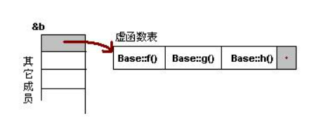

# 1.封装
## 访问控制字
private成员只能被该类成员函数访问
protected成员除了本类，子类也可以访问
public任何代码都可以访问
## class&struct
在java中可能class和struct大相径庭，但是在C++当中事实上他们已经别无二致了。我们完全可以在struct里面定义成员函数。完全可以用struct关键字代替class来定义类。但是他们的区别在于，其默认访问权限不同。

在不写访问控制字的部分声明的成员，在class内被当做private，而在struct内被当做public。
## 友元
以前觉得很绕现在看来就很简单了，无关的两个类，我偏想要让本类可以访问另一个类的成员函数;或者是有一些外部函数，希望访问本类的private成员，就可以在本类内声明几个friend：
```cpp
friend void otherclass::somefunction(const clsdata&);//其他类的友元函数
friend void read(const clsdata&);//外部函数
```

也可以直接在A类的声明当中写明B类为自己的friend类：
```cpp
class A{
       friend class B;
};
```
A指定了友元类B，那么B的成员函数可以访问A类的所有成员。
# 2.C++继承
基类=父类 派生类=子类
## 动态绑定
动态绑定是一个常用但其实并无深文奥义的术语。我们可以在函数中声明一个父类参数(但需要使用引用或指针形式)，那么在函数执行时，父类或是子类都可以作为这个参数参与运行。**动态绑定发生于我们使用基类引用或者基类指针调用一个虚函数时。**

## 继承中的成员函数和访问控制
显然，基类中有些内容是希望派生类原封不动继承的；然而也有一部分，基类可能希望派生类各自实现自己的版本。这类需要派生类自己实现的函数就是**虚函数**。**虚函数不能是静态的**。如果一个基类成员函数是virtual的，其派生类版本纵使不声明，也会隐式地virtual。

非虚的函数，从函数名解析到代码段中具体指令的过程发生于编译阶段，而虚函数则发生与运行时。

访问控制符包括public,protected,private，从学习C++的一开始我们就在使用这些访问控制符。在最初，这些访问控制符都用于修饰成员，而引入继承后，这三个词还可以修饰派生访问，即控制派生类对于基类成员的访问权限。
修饰派生访问时，这些访问控制还会遗传给派生类的后代们，如果设为private派生，那么这些子孙将失去任何父类成员的访问权限。

|访问控制符|修饰成员效果|修饰派生访问|
|--|--|--|
|public|公有成员，任何类可以访问|派生类保留原本访问权限，即访问权限只看基类成员的访问控制等级|
|protected|保护成员，禁止派生类和友元以外的访问；对基类对象具有**禁止越权访问特性**|派生类获得修正的访问权限：所有public基类对象的访问控制变为protected|
|private|私有成员，任何类均禁止访问|派生类失去原本访问权限，所有基类成员均视为private|

**说明**
1. 所谓**保护成员禁止越权访问**，是这样的：派生类访问基类保护成员，必须是透过派生类对象而非基类对象来访问。如果像下面这样使用基类对象，访问将遭禁止：
```cpp
class Base{
       protected:
       int prot_mem;
};
class Deprive:public Base{
       friend void clobber(Deprive& d){
              d.prot_mem=1;
       }
       //允许，派生类有权访问派生对象的基类部分中的protected成员
       friend void clobber(Base& b){
              b.prot_mem=1;
       }
       //错误，禁止访问基类对象的protected成员
}
```
这样设计的初衷是防止用如上手段新增一个临时的派生类，就能绕开protected效力以派生类函数随意改写基类对象的protected成员

2. 如果一个基类成员，在所有派生类中的用法都一样，那么应该给使用这个成员的函数定义一个setter，getter，并作为public的基类成员函数，设置这个成员为private；而如果各个派生类使用方式不同，则应该定义为protected，各个派生类自行定义自己版本的成员函数
3. 如果把一个派生类设置为private继承，那么这个继承的唯一目的就成了覆盖实现虚函数；派生类对象在内存中将不会有**基类部分**的数据
4. 注意修饰派生方式**并不阻止继承**：只是修改继承后派生类内成员的访问控制符；也可以认为最终继承到的控制符=基类控制符%派生控制符，%表示max(a,b)，private > private > public
## 派生类的静态成员
在没有派生类的时候，静态成员一个类只会存在一份实例；
引入派生类后，依然如此：整个继承体系不论有多少派生类、每个类有多少对象，都只存在一份唯一的静态成员实例。

静态成员遵循一切访问控制规则。

## 终止继承
final 关键字用于组织一个类作为基类。
```cpp
class Nodeprive final{

};
class Base{

};
class Last final : Base{
       //虽然Last是final，但可以继承其他类，只是自己不再能作为基类
};
```
## 派生类与基类的类型转换
派生类对象有着比基类对象更多的信息，因此可以在一些情况下可以作为基类对象来使用，本质是使用派生类对象的基类部分。
1. 基类指针可以指向派生类对象，使用其基类部分
```cpp
Deprive dobj;
Base *p = & dobj;
```
2. 基类引用可以引用派生类对象
```cpp
Deprive dobj;
Base &r = dobj;
```
但是**不存在从基类向派生类的隐式类型转换**。我们能够这样进行绑定并不是因为有隐式类型转换。转换的仅仅是引用和指针的类型，而不是基类和派生类对象的类型。

虽然可以：
1. 将派生类对象赋值给基类变量
2. 可以用派生类对象作为参数构造基类对象

但是这都是因为**拷贝构造函数**、**拷贝构造赋值运算符**本身都是使用引用的函数，而派生类的引用是可以向基类引用转换的。这个过程反而很常见，被称为sliced down(切掉)，即（看起来似乎）派生类对象丢掉独属于自己的那部分，就成为一个基类对象。

派生类与基类的类型转换还受到**访问控制影响**。
1. 只有当Deprive公有继承Base，Deprive的用户代码才可进行Deprive向Base的类型转换
2. 不论Deprive的继承方式，其成员函数和友元都可以使用派生类向基类的类型转换
3. 只要Deprive不是私有地继承Base，Deprive的派生类，即孙子辈类的成员和友元函数就可以使用Deprive向Base的类型转换。

规律的概括是：当且仅当基类的公有成员是可访问的，派生类向基类的类型转换才是可访问的。

## 友元和其他杂谈

一句话，父亲的友元不是我的友元，每个类自行管理自己的友元
可以不写派生方式，class默认private继承，struct默认public继承

可以用using来改变某个派生类对某个基类成员的访问级别：
```cpp
class Base{
       public:
       int size() const {return n;}
       protected:
       int n;
};
class Deprive:private Base{
       public:
       using Base::size;
       protected:
       using Base::n;
};
```

## 补：容器与继承


# 3.virtual和C++多态
## 为什么使用virtual关键字
最重要的目的是实现多态。
多态粗浅的理解就是同名的函数不同的动作，这使得程序究竟调用哪个函数变成运行时的事情，而非编译时候决定。
在C++中，多态有两种时态体现:
**编译中多态即重载**
**运行中多态即虚函数**

`culculate(int a)`和`culculate(double a)`本来就没有必要区分函数名，因为他们的内在逻辑极有可能是完全一致的。这种就是编译时多态。

一旦一个基类函数被声明为虚函数，则在所有派生类中它都是虚函数。

## 虚函数工作原理
注 以下部分并不来自C++Primer 而是来自互联网
若编译器发现一个类里声明了一些虚函数:
```cpp
class Base{
public:
       Base(){}
       virtual void f(){}
       virtual void g(){}
       virtual void h(){}
       virtual ~Base()
}
```
并不会立刻为此类分配虚表等实际内存。但是如果Base被**构造**，就会开辟空间存放各个成员，同时分配虚函数表。

注意到，析构函数也被声明为virtual。这非常重要，后面会详述。

虚函数表内装的是函数指针。

虚函数是用于继承类间的多态问题的，那么我们再引入一个子类，继承自基类Base.
```cpp
class Deprive:public Base{
public:
       Deprive(){}
       virtual void f1(){}
       virtual void g1(){}
       virtual void h1(){}
       virtual ~Deprive()
}
```

可以看到，此函数中的任何函数都不与父类函数同名。这样一来，子类的虚函数表会像这样维护：

可以看出规律：**先父后子，按声明顺序排列**
当然，这个例子很违背虚函数设计精神。使用虚函数的目的就是要让子类去覆盖父类的virtual函数，像这样写的话f1 g1 h1没有任何必要写成虚函数。

下面讲**虚函数覆盖**。上面的例子没有体现任何的多态性。那么如果我们希望子类的一个函数与父类同名从而实现多态会怎么样呢？
```cpp
class Derive:public Base{
public:
       Derive(){}
       virtual void f(){}//与父类f()同名
       virtual void g1(){}
       virtual void h1(){}
       virtual ~Son()
}
```

覆盖的f()函数被放到了虚表中原来父类虚函数的位置.

补充：就算这里子类的覆盖函数f不声明为virtual，也会自动设为virtual并存入虚表的

多继承下的虚函数：
```cpp
class Derive:public Base1,public Base2,public Base3{
       //...
}
```


当子类继承了多个父类，子类对象会为每个父类分别维护一张虚函数表。其自身的函数会跟在第一张虚函数表父类虚函数的后面。

若这个时候再加上覆盖：


## 虚指针和虚内存布局
所谓虚指针，是指上述从子对象内存指向虚函数表第一项的其实是一个指针，这个指针称vptr，也就是虚指针。
为了证明这个，我们可以看一个编程实例。
```cpp
class D
{
       void func_a();
       void func_b();
       int var;
}
class VD
{
       void func_a();
       virtul void func_b();
       int var;
}
//...
std::cout<<sizeof(VD)-sizeof(D);
```
因为VD使用了虚函数，C++会为C++对象预留好一个vptr的内存大小。
还是以上面两个类D和VD为例，他们的内存布局是这样的：
***
D的情况：

类的成员放在堆里，而成员函数放在代码区，为该类的所有对象公有。即不管新建多少个该类的对象，所对应的都是同一个函数存储区的函数，代码区内存消耗是固定的。
***
VD的情况则是这样的：

全局数据区的这个方格就是虚函数表。会有多个虚函数表，它们都存放在全局数据区。由于声明了`virtual void func_b()`，那么虚函数表中的第一个位置存放的函数指针就指回代码区的`fun_b()`,且这个函数不会像普通函数一样存放在fun_a()的下一位置，而是在代码区的别处。
## final & override，覆盖的协查工具
引入override的理由是这样的：有时候程序员会在派生类中覆盖基类的虚函数并且犯错：搞丢一些参数，从而造成派生类中函数与虚拟函数参数表不匹配。

这将造成一个难以调试的问题：编译器会认为这里为派生类定义了一个与基类同名但无关的函数。这个函数将以编译时多态的形式存在，而没能进行动态绑定。

为了防止这种情况，override应运而生。可以在派生类的函数声明后标记override，请求编译器协助检查是否能够与基类的虚函数匹配：

```cpp
struct B{
       virtual void f1(int) const;
       virtual void f2();
       void f3();
};
struct D1:public B{
       void f1(int) const override;
       void f2(int) override;
       void f3() override;//引发报错，没能找到override的对象函数
}
```

还可以把方法设定为final，final写在override相同的位置。一旦一个成员函数被定义为final，后续的类无论是否继承了这个成员函数并将其定义为virtual，也不可以对其进行覆盖(运行时的virtual覆盖不行，编译时的简单同名也不行)

## 越过动态绑定
假设我们已经有基类的指针，其动态绑定了派生类的对象，如果直接对这个指针调用一父子都有的成员，则会执行动态类型版本——派生类版本。但我们也可以要求其反而执行基类版本：
```cpp
class Base{
public:
       virtual double price(int n) const{
              return n*price;
       }
protected: double price = 5.0;
};
class Deprive:public Base{
public:
       double price(int n)const override{
              if(n>=min_discount_num)return discount*n*price;
              else return n*price;
       }
private:
       int min_discount_num = 3;
       double discount = 0.7;
}

int main(){
       Base* basep=new Deprive();//基类指针动态绑定派生类对象
       std::cout<<basep->price(4)<<std::endl;  //输出14
       std::cout<<basep->Base::price(4)<<std::endl; //输出20
}
```

这种做法有时候会导致一个严重的错误：如果在覆盖基类虚函数的派生类函数中调用其基类版本(这当然是允许的)但是却忘记了加上作用域算符，那么将会自己调用自己导致死循环。

## 构造器和析构函数的虚化
**构造函数不能是虚函数，析构函数可以是虚函数且推荐最好设置为虚函数。**
假设把构造函数虚化，那么其作为虚函数需要入虚表。然而构造函数调用的开始，vptr尚是空值，找不到虚表，更找不到虚表中构造函数的位置。这是非常矛盾的一件事，虚机制的维护全都仰仗**构造**这一个重要过程。因此不能将构造器声明为虚函数。

而析构函数**最好是virtual**的,为了证明这件事必须讨论**父指针指向子对象**的情况。

### 另行讨论：父指针指向对象

为什么要让父指针指向子对象呢？这主要是出于设计目的，在一些情境下确实让父指针指向子对象更方便、更符合实际情况。必须指出，父类指针指向子对象，并不等同于一个子对象指针。

《C++ Primer》在`15.2.3章 类型转换与继承`对于**父指针指向子对象**的意义是这样阐述的：
*当使用基类的指针或引用的时候，实际上我们并不清楚该引用或者指针所绑定对象的真实类型。该对象可能是基类对象，也可能是派生类的对象。*
在程序员编写基类Factory的时候，可能刚刚规划了其有两个派生类CheeseFactory和SugarFactory，但是我们无法预料是不是后续还会编写其他的派生类，比如一年后又新增了SaltFactory。而如果不允许父类指针指向子对象，就必须在加入新的子类之后修改父类，比如加上新的子类指针到父类指针的类型转换，或者使用其他的伎俩。**应当允许父类指针指向并访问子对象**

这里又要引出静态类型和动态类型的概念：

### 另行讨论：静态类型与动态类型
定义：在编译时就确定的类型就是静态类型。必须在运行时才能确定的类型是动态类型。
**对于对象，没有两种类型的分别，静态类型=动态类型，在编译时候就唯一确定** （比如 int a, Myclass obj）
只有对于引用和指针，才需要讨论静态类型和动态类型。

在刚刚提到的父指针指向子对象的例子中，必须指出：
1.我们允许指针(或引用)的静态类型是父类指针(或引用)，而动态类型为子类指针（或引用）。
$\color{FF0000}{2.并非因为存在父类指针向子类指针的隐式类型转换}$
3.而是因为父类指针允许动态绑定到子类的父类部分上

给一个更极端的例子，其结论是很简短的：只能把父指针绑定到子对象上，而不能赋值子对象指针给父指针
```cpp
deprive d;
deprive* pp=&d;
base *bp=&d;//允许，把父指针绑定到子对象上
base *bp2=pp//不允许，不存在子类指针向父类指针的隐式转换
```

***
回到正题。

以class deprive单继承class base为例。
正常的析构函数遵循**先析子再析父**（因为构造先构父后构子，且如果先析父倒过来析子的时候还可能要使用父的成员）
```cpp
class Base{
       Base(){}
       ~Base(){
              std::cout<<"destruct Base"<<std::endl;
       };
}
class Deprive:public Base{
       Deprive(){}
       ~Deprive(){
              std::cout<<"destruct Deprive"<<std::endl;
       }
}
int main(){
       Base *a=new Deprive();
       delete a;
}
```

当我们调用`delete a`，我们会发现，正由于a是一个基类指针，delete a实际上只是调用基类的析构器。
```
destruct Base
```
delete a并不能回收所有空间，其只能够销毁子对象的父继承部件：
```cpp
int main()
{
    Base *a = new Deprive();
    Deprive *s = (Deprive *)a;

    delete a;
    s->depval = 5;
    std::cout << s->depval;
}
```
(非虚情况)如果使用父指针指向子对象，$\color{#FF0000}{析构指针无法析构子类成员，从而造成内存泄漏}$

如果我们把基类的析构函数改成virtual的，再次实验：
```cpp
class Base{
       Base(){}
       virtual ~Base(){
              std::cout<<"destruct Base"<<std::endl;
       };
}
class Deprive:public Base{
       Deprive(){}
       ~Deprive(){
              std::cout<<"destruct Deprive"<<std::endl;
       }
}
int main(){
       Base *a=new Deprive();
       delete a;
}
```
```
destruct Deprive
destruct Base
```
如果基类的析构函数是virtual的，派生类的析构函数将会由于继承获得virtual。这样一来，delete a背后发生的将会是解析虚函数，从而调用正确的版本——`~Deprive()`，而这又会进一步调用`~Base()`

### 父指针指向子类对象下的成员匹配问题
```cpp
#include <iostream>

class Base
{
public:
    int content;
    void print()
    {
        std::cout << "Base print was called" << std::endl;
    }
};
struct Deprive:public Base{
public:
    void print(){
        std::cout<<"Deprive print was called"<<std::endl;
    }
};

int main(){
    Base ob;
    Deprive od;

    Base *fatherP = &ob;
    Base *fatherPtoSon = &od;
    Deprive *sonP = &od;

    fatherP->print();
    fatherPtoSon->print();
    sonP->print();
}
```
输出：
```
Base print was called
Base print was called
Deprive print was called
```

显然，我们允许父类指针指向子类对象的最初动机，就是我们希望像使用父类那样使用子类(的父类部分)，因此使用父类指针来访问成员时，当然是优先访问父类的同名成员和成员函数。

## 纯虚函数和抽象基类
Java设计了abstract关键字来满足抽象类的开发。所谓抽象类，也是继承的一大重要概念，因为我们可能希望规定一些类都有一些公有的行为，比如CheeseFactory和SugarFactory都需要函数produce()，这件事需要规定出来，但是两个不同的子类又各自编写了不同的produce()内容。于是Java用abstract Factory，抽象的工厂类和公有的produce()行为来实现。

C++的抽象功能也是依赖virtual关键字做到的。

纯虚函数可以直接告知程序，这个函数毫无意义：
```cpp
class deprive:public base{
public:
       double produce(std::size_t) const=0;
}
```
纯虚函数不是通过virtual声明的，而是直接用=0来表示其为纯虚函数。**纯虚函数只接受声明，不接受定义**
一旦类内出现纯虚函数，这个类将被归为抽象基类。**不可直接使用抽象基类来构建对象**，但是抽象基类有构造函数，抽象基类的派生类也会自动使用抽象基类的构造器来构造基类部分。抽象基类所定义的纯虚函数是纯粹的接口：提出对于派生类覆盖这些接口的要求。

尽管抽象基类不能用于构造成抽象基类对象，但其构造函数是有意义的。可以通过之前的委托构造函数的写法让派生类调用抽象基类的构造方法来构造其基类部分。

# 4.多重继承与虚继承
## 4.1 如何多继承
通过在类的派生列表中写明所有基类来使用多重继承：
```cpp
class panda : public Bear, public Endangered {
       //...
}
```
多重继承的情况下，不论是默认的派生类构造函数还是自己编写的派生类构造函数，构造顺序依从派生列表中各个基类的声明顺序，比如上面的例子，将会先构造Bear，然后构造Endangered。

关于构造顺序，总是会按照下面的顺序(不要忘记构造时先构父再构子)：
ZooAnimal
|
Bear     Endangered
|     .....↙
Panda

Panda构造顺序：
ZooAnimal->Bear->Endangered->Panda
其中Bear先于Endangered是因为派生列表声明顺序。

### 继承构造函数 - 11
C++11新特性。允许从基类继承基类的构造函数作为派生类的构造函数。
```cpp
class Base
{
public:
    Base(int i) : BaseContent(i) {}
    int BaseContent;
};
class Deprive : public Base
{
    using Base::Base;
};

int main()
{
    Deprive d(1);
    std::cout << d.BaseContent;
}

```
`using Base::Base`这样的声明将会使Deprive继承基类的**所有**构造函数，这意味着基类的每一个构造函数都会有一个除了构造函数名以外完全一致（包括返回值类型、参数表和内部逻辑等一切细节）

但是多继承的引入可能让这个特性出现一个问题，即**构造函数继承冲突**：如果同时从两个基类继承构造函数，而继承构造函数的两个基类之间恰巧有形参列表相同的（但是没有参数的合成构造函数不算在其内）：


为了解决这个问题，想要多继承相同参数表的派生类，必须自己为冲突的


### 成员的继承冲突
如果多继承的两个基类、或者是更复杂的祖宗关系的两个类之间出现了同名的成员，就会发生继承冲突。要想在子类中使用这两个不同来源的同名成员，必须添加命名空间用来区分。

```cpp
struct Base1{
    int content = 1;
    Base1() = default;
    Base1(const std::string &);
};
struct Base2{
    int content = 2;
    Base2() = default;
    Base2(const std::string &);
};
struct Deprive:public Base1,public Base2{
    using Base1::Base1;
    using Base2::Base2;
    Deprive(const std::string &){}
};
int main(){
    Deprive d("hello");
    std::cout << d.Base1::content << " ";
    std::cout << d.Base2::content;
}
```
输出：
1 2

### 基类指针指向子类对象(多继承下)
我们已经反复讨论了这样的情况：
```cpp
Base *p = new Deprive();
```
这种写法是允许的，而在多继承下也是一样。以前文的Panda类为例，