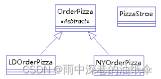
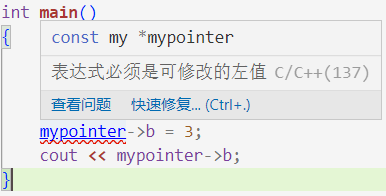

# 1.设计模式
## 前言
因大量参考Java设计模式，本节的大量代码为java
本笔记重点参考：
[23 种设计模式详解全23种by 雨中深巷的油纸伞 CSDN](https://blog.csdn.net/qq_25086397/article/details/125103647)

设计模式这一概念很可能来自于java23种程序设计模式，即Building Pattern。由于面向对象语言在设计上的共性，这些设计模式理所当然地适合各种面向对象语言，在提升开发和程序运行效率上各有千秋。

总体来说设计模式分为三大类：

创建型模式，共五种：`工厂方法模式`、`抽象工厂模式`、`单例模式`、`建造者模式`、`原型模式`。

结构型模式，共七种：`适配器模式`、`装饰器模式`、`代理模式`、`外观模式`、`桥接模式`、`组合模式`、`享元模式`。

行为型模式，共十一种：`策略模式`、`模板方法模式`、`观察者模式`、`迭代子模式`、`责任链模式`、`命令模式`、`备忘录模式`、`状态模式`、`访问者模式`、`中介者模式`、`解释器模式`。

## 创建型模式
[Java设计模式——创建型模式 by 知乎用户0I3Pz0 zhihu](https://zhuanlan.zhihu.com/p/470781323)

创建型模式考虑通过**优化对象创建过程**来优化程序。

### 单例模式
所谓单例(Singleton)，字面意思就是单个实例。**任何一个类都只会创建一次对象**，使这个对象成为**单一的实例**。

**Why？**
反复地创建和回收对象在各种Object语言中都是非常主要的开销。单例模式可以让程序仅在内存中创建一个对象，让所有需要调用的地方都共享这一单例对象。

**How？**
```java
public class Singleton {
    
    private static Singleton singleton;
    
    private Singleton(){}
    
    public static Singleton getInstance() {
        if (singleton == null) {
            singleton = new Singleton();
        }
        return singleton;
    }
}
```

单例模式是著名的、应用广泛的一种设计模式，从这个getInstance()的无处不在就能感受到。

单例模式要求只使用一个实例，关于这个实例何时加载进内存就产生了两种做法，预加载(饿汉法)和懒加载(懒汉法)
```java
public class PreloadSingleton {
       public static PreloadSingleton instance = new PreloadSingleton();
       private PreloadSingleton() {
       }; 
       public static PreloadSingleton getInstance() {
              return instance;
       }
}
```
```java
public class Singleton {
    //懒汉法
       private static Singleton instance=null;     
       private Singleton(){
       };
       public static Singleton getInstance()
       {
              if(instance==null)
              {
                     instance=new Singleton();
              }
              return instance;  
       }
}
```
**Why 预加载?**
一句话，预加载是**线程安全**的。无疑预加载的效率是较低的，由于其采用一个static成员instance，这个instance将会在程序运行之前就被加载，构造函数PreloadSingleton()也会被调用。也就是说，**纵使不被使用，预加载类实例也会被构造出来**。

首先，预加载是线程安全的。不可能有一个语句来打断预加载的getInstance()，这是因为其中只有一句话return instance，无从打断。
同时，**懒加载是非线程安全**的。如果有两个线程同时执行getInstance():
```
A:if(instance==null)//true
A:break
B:if(instance==null)//true
B:instance=new Singleton();
B:return instance()
B:other work... instance was updated
A:instance=new Singleton();
A:return instance;
//A返回了错误的新实例，而丢失了B修改后的实例
```

#### conclusion
规定单例效率高，不必反复创建和销毁对象
单例的预加载和懒加载，在单线程编程中使用懒加载因为开销低，用时才加载；在多线程编程中使用预加载，因为保证线程安全

### 工厂方法模式
先说说`原始工厂模式`，这是一种不被列在创建型设计模式当中的模式，是比较简单、`存在问题`的设计模式。

假设PizzaFactory可以生产芝士披萨CheesePizza，辣味披萨PepperPizza和希腊披萨GreekPizza.
PizzaFactory和三种pizza都是类，那么我们可以这样做：规定让工厂类拥有三个成员函数，分别创建三个披萨的实例，比如CreateCheesePizza()。

用户通过OrderPizza()来定披萨，只要传递一个枚举，选择Cheese,Pepper,Greek三者之一。

### Why not?
这样做的问题在于，现代设计模式的一个重要期望就是：**增加需求时永远争取新建类，而非修改原有类**

而目前这种设计方法则逼迫我们去修改工厂类，从而造成潜在的问题。
比如，现在要新盖两家新工厂，每个工厂都沿用上述流程，但是用户在点单时候要选择在哪家工厂下单。这时候我们就要去修改PizzaFactory类的内容。

与其把“哪家工厂”当成参数，不如直接变成方法。因为新增参数要求我们修改PizzaFactory类的旧代码，而将其作为方法则只需要新增一个新的方法。

### What's 工厂方法？
工厂方法模式指出，我们可以通过把几个不同地区的工厂全都改成对应的PizzaFactory类:
NewYorkPizzaFactory, PekingPizzaFactory
OrderPizza变为抽象接口。



### 原型模式
[设计模式学习笔记（原型模式） by 麻子来了 CSDN](https://blog.csdn.net/sinat_22991367/article/details/76595721)
原型模式的想法是，用clone()解决设计模式需要解决的问题。复制数据总是比新建新数据更快，在C++中体现为拷贝构造函数执行比常规赋值的构造函数更快。

当创建一个指定的对象时，
关于拷贝，有深拷贝和浅拷贝之分。浅拷贝就是引用，深拷贝则是数据副本。原型模式使用的拷贝属于深拷贝。
$\color{#FF7D00}{蓝}$ 

### 建造者模式
[java_friend 建造者模式文章](https://mp.weixin.qq.com/s?__biz=MzI4Njc5NjM1NQ==&mid=2247487258&idx=2&sn=cee8a48b247ec1fb2fb1a45396c0a04e&chksm=ebd63036dca1b920246061b0287c6f29040a338c46094c8b8eeff03ea068de03180fa48aa2b2&scene=21#wechat_redirect)

我认为建造者模式的核心思想就是流程化。使用一个名为director的类来管控过程，director拥有Builder类成员abuilder.

以建房子为例，房屋施工方housebuilder，公寓施工方apartmentbuilder和装潢施工方decorationbuilder可能都需要遵循这样的过程：
buildFloor();
buildRoof();
buildWall();

那么我们定义接口Builder，让三个具体的类都实现Builder。Builder有上述三个成员函数。之后，让director按顺序把自己的builder依次替换，从而达到轮流施工的作用。
## 图形项目所应用的设计模式
### MVC模式
Model-View-Controller模式，认为应该把项目切分成三个模块：
1. Model
   model主要负责数据的存储。在图形项目中，这部分就是模型的顶点数据、纹理，摄像机的位置、朝向，等等。model集中地管理数据，因此要想修改项目中的数据，应该通过向model发送信息来实现
2. View
   主要负责依据Model的数据，进行视图的渲染，以及用户交互的采集。用户在屏幕什么位置点击、输入了什么键盘序列，这些信息由View采集后发送给Controller。
3. Controller
   采集View发来的用户输入，并按照逻辑向Model发送改写信息。

以往的openGL项目当中，我们可以看到一个输入处理函数获取input，逻辑加工，并改写数据，横跨了MVC三个模块；

## 总结
单例模式：保证一个类仅有一个实例
工厂方法模式：**定义一个用于创建对象的接口，让子类决定实例化哪一个类。Factory Method 使一个类的实例化延迟到其子类。**


# 2.const 
## 引入const的动机
const是大型软件设计中非常重要的一个工具，他能规定一部分程序员对于精细到一个变量的数据具有的读写权限。很多场景下需要杜绝程序员有意或无意的修改行为，这就是引入const的动机。const已经跳出了原本的constant的本意，产生了许多其他用法。
## 非面向对象的const
首先，const原本是一个针对任何变量，无论是成员变量还是非成员变量，意在让其不可修改。
### const和指针
稍稍复杂的情况是用**const修饰指针和引用**，以int型为例，可以写出这样几种指针：
1. `int * const a`;常指针，const修饰a,不允许改写a的指向
2. `const int * a`;**指常指针(pointer to const)**，不允许通过指常指针修改访问对象，但可以改写a指向其他const int。
3. `const int *const a`;指常常指针，a不仅不能修改访问对象，还不允许修改a的指向

之前我对指常指针pointer to const有一个误解：其字面意思似乎是~~只能指向常量的指针~~，但事实上，让指常指针指向非const变量也是合法的(如下)。**指常指针的意义是禁止透过这个指针修改访问对象**，而非限定指针可以指向哪些对象。
```cpp
int main()
{
    int num = 7;
    const int *a = &num;
    cout << *a << endl;//合法
}
```

### const和引用

const也可以修饰引用，类比上面，似乎也会有三类引用，但是其实不是这样的。引用只存在对常量的引用const int&，而不存在常引用int const& (这样写是非法的)，这是因为引用不是对象，我们没法让引用本身恒定不变，而只能规定引用对象本身是常量。

同指针，对常量的引用 可以引用非常量。对常量的引用只是限制不得透过这个引用去修改所引对象。

拷贝双方必须具有相同的底层const，即要么底层都是const，要么底层都不是const。一般会有非const量到const的默认转换，所以**拷贝非const量到const量**也是合法的。
所谓顶层和底层const，就是上面的指常和常指针之论：**指向常量的指针**`const int* a`修饰被指对象，这属于**底层const**,而**常指针**`int* const a`修饰指针本身，属于**顶层const**.

对于指针之外的变量，如引用和常规变量，他们的顶层和底层const意义相同。

举几个底层const不符的例子：
```cpp
int i=0;
const int ci=0;
int* const cp=&i;
int *p=cp;//错误，cp底层const，p底层非const
int &r=ci;//错误，ci底层const，r底层非const
const int &r2=i;//允许赋值非常量给常量引用
```

总结：
无论是指针还是引用，**底层const**都具有迷惑性，看似是指指向/引用常量，**实际为只读**——禁止透过这个指针/引用来访问该对象；

引用没有顶层const；常规变量没有顶层/底层const之分(尽管书写时const在前，好像是指针的底层const一样)

赋值上，允许常量=非常量  不允许非常量=常量

## 面向对象的const
### const形参
把实参传递给形参的时候，会自动忽略顶层const，

const形参只是增加一个限制——想象如果把实参传递给这个形参只是一个赋值而已，就能判断出不同的参数是否能够传递。


const形参能够形成新的重载。两个函数纵使参数表一样，倘若其中一个带有const参数而另一个没有，就会被编译器视为合法的重载：
```cpp
Record lookup(Account*);
Record lookup(const Account*);
```

const_cast 和 static_cast一样，属于显式类型转换。允许通过const_cast将一个const量强制转换成非const，从而获得改写权限。
```cpp
const char *cp;
char *p=const_cast<char*>(cp);
```

### const成员函数
const修饰成员函数，唯一的意义是修改this指针的属性。
首先，介绍一下this的功能：
```cpp
std::string getbookNo()
{
       return bookNo;
}
abook.getbookNo();
```
这样的函数，调用过程中其实是这样的：
```cpp
*this=abook;
return this->bookNo;
```

this是一个隐式的常量指针，它指向调用函数的对象。所有成员函数要想使用此实例对象的成员，相当于都使用了this。

然而，如果希望规定一个成员函数的this也是const（已经是常指针，希望增设指常指针），就需要使用这样的声明：
```cpp
std::string getbookNo()const
{
       return bookNo;
}
```
这个const只修饰this,相当于：`const Book* const this`；这样就导致了另一个现象：如果一个对象是const的(this本身已经是Book* const this)，其this指针事实上指向了一个const对象，那么此时如果想要调用一个普通成员函数：
```cpp
const Book mycstbook;
mycstbook.getbookNo();//getbookNo() is not constant
//*this=mycstbook;试图让非指常指针指向一个非常量对象，底层const矛盾
```
这里的`*this=mycstbook`就相当于：
```cpp
const int ci=1;
int *a=&ci;//错误
```
可以看到编译器的报错信息：


所以，**普通对象可以调用const成员函数，但const对象不能调用普通成员函数。**

## 一些细节
mutable关键字能够让一个变量永远不为const。可以让一个类的个别成员为mutable，这样就算这个类定义了一个const实例，这个实例内的mutable成员也是可以改变的。
然而指常指针不允许透过指针修改数据，我们来看看能不能修改mutable成员：

```cpp
class my
{
public:
    string name = "";
    mutable int a = 5;
    int b = 10;
};
using namespace std;
int main()
{
    const my amy;
    const my *mypointer = &amy;
    mypointer->a = 3;
    cout << mypointer->a;
}
```
上面的程序完全合法。我们注意到`const my* mypointer`是一个指常指针.

C++不允许透过指常指针访问被指对象；然而，这里对a成员的改写还是允许了。
**C++不允许透过指常指针访问对象，除非访问修改mutable成员**

# 3.函数指针
我理解的函数指针引入动机是因为越来越复杂的需求使得C++中一些写法开始把函数本身拿来当做一个参数，因此C++（以及很多其他更年轻的语言）都设计了把函数名当成一个变量来处理的机制，于是我把函数指针放在大型软件项目这一部分里。需要指出的是，由于函数编译后就成了**程序内存中代码区里存放的一些指令**， 因此函数指针里实际**存放着指向代码区的地址**。

有以下三种方式声明函数指针：
1. 用*ptr代替函数声明里的函数名
   ```cpp
    bool lengthCompare(const string &s1, const string &s2);
    bool (*pf)(const string &, const string &); 
   ```
   这种写法也需要忽略参数列表中的形参名; 这样写必须补充函数定义，且pf和lengthCompare毫无逻辑关联


2. 用定义好的函数名作为值
   ```cpp
   bool lengthCompare(const string &s1, const string &s2);
   pf = lengthCompare;
   pf = &lengthCompare;//这两种写法完全同义
   ```
   这样写后pf将会完全平替lengthCompare，且使用pf不需要解引用：
   ```cpp
   if(pf("hello","world!"))std::cout<<"shorter!"<<std::endl;
   //等效于：
   if((*pf)("hello","world!"))...
   if(lengthCompare("hello","world!"))...
   ```

严格来说，函数指针像寻常指针一样，具有类似类型的特性。若要对一个已经指向函数的函数指针重新赋值，对于赋值的函数亦有要求：其必须与原函数返回类型一致、参数表一致。永远可以把函数指针赋值成nullptr或者0，但这不会改变函数指针实指的函数类型和参数表。

# 4.模板
## 如何在不同的头文件中书写模板的定义和实现？
```cpp
//compare.h
#include "cstring"
template <typename T>
class ClassWithTemp
{
public:
    T content;
    T getContent();
};
```
```cpp
//compare_implement.h
#include "iostream"
#include "compare.h"
template <typename T>
auto ClassWithTemp<T>::getContent() -> T
{
    std::cout << "ClassWithTemp<T>::getContent() was called" << std::endl;
    return this->content;
}
```

```cpp
//main.h
#include "./compare.h"
#include "./compare_implement.h"

int main() {
    using namespace std;
    ClassWithTemp<int> obj;
    obj.content = 3;
    int a = obj.getContent();
    std::cout << "a = " << a << std::endl;
}
```

概括：
模板的定义和实现都应该写在头文件里(原因见下一P)；
只要注意在实现处，应该加上`template <typename T>`的前缀，帮助编译器把ClassWithTemp识别为模板

## 为什么必须把模板的定义和实现写在头文件里，而不是把实现写在源文件里？
这是编译器在处理模板时的工作方式决定的。编译器遇到一段模板声明时，并不会链接这段代码，直到发现模板实例化代码时，才根据模板声明和实现把实例化函数或实例化类的代码补充出来。在这个时候，不论是函数模板还是实例化模板，因为要现场补出实际的函数代码(把所有的T替换成实际类型)，必须依赖模板的实现。

## 编译链接时，源文件和头文件处理有什么不同？
预处理阶段：在编译过程开始之前，预处理器会对源文件和其包含的头文件进行处理。预处理器会根据#include指令将头文件的内容插入到源文件中，并执行其他预处理指令（如宏替换、条件编译等）。预处理后的源文件中将包含头文件的内容。

单独编译：源文件和头文件的编译是分开进行的。每个源文件都被编译成一个独立的目标文件(.obj)，而头文件并不单独生成目标文件。

## 引用折叠
引用折叠是一个开后门的语法，在C++当中原本右值引用只能绑定右值，左值引用只能绑定左值，但引用折叠打破了这个铁律，在编译器推断模板实参类型的时候，允许定义模板类型参数为T&&右值引用，这时候如果传入一个左值引用比如int&进行模板实例化，编译器会推断这里的实参类型为int&。

引用折叠的规则是：
左值引用的左值引用T& &；
右值引用的左值引用T&& &；
左值引用的右值引用T& &&；
->都会被折叠为左值引用T&
而
右值引用的右值引用 T&& && -> 会折叠成右值引用T&&

## 定义了接收右值引用模板参数T&&的模板，在模板中写到T t = val，这里的t是拷贝还是引用？
```cpp
int fcn(int &a){
    return ++a;
}//随便写的，其实好像不能写成int，不太重要，仅仅表示改写a
template <typename T> void f3(T&& val)
{
    T t = val;
    t = fcn(t);
    if(val == t){
        //...
    }
}
```
第一种情况，如果用右值传给T进行模板实例化：
```cpp
f3(42);
```
这时候，右值引用的模板参数T&&接收到右值int，模板实例化成：
```cpp
void f3(int val)
{
    int t = val;
    t = fcn(t);
    if(val == t){
        //...
    }
}
```
注意，右值引用接收右值，不会触发我们所谓的`两条例外`, 右值引用本来就该接受右值，T解析为int
那么我们的fcn改变了t，而t是val的拷贝，自然if会得到false

第二种情况，如果我们传递一个左值给T进行模板实例化：
```cpp

```

## 转发

转发是在软件工程当中经常会碰到的一个现象：A函数接收到参数后，把全部的参数交给B去调用B。
                                                
当调用接受引用参数的函数，转发是会出问题的:
```cpp
//flip1函数接收三个参数，把参数t1和t2翻转，然后转发给f
template <typename F, typename T1, typename T2>
void flip1(F f, T1 t1, T2& t2)
{
    f(t2, t1);
}

int main(){
    int b = 0;
    f(42, i);
    flip1(f, b, 42);
}
```
这里隐含了一个认知：f是不可以接收引用参数的，而只能做一些接收值形式参数、打印之类的工作，不能修改参数内容。
比如这样一个f就会造成转发问题：
```cpp
void f(int v1, int &v2){
    v2++;
    std::cout << v1 << " " << v2 << std::endl;
}
```

这个例子中，模板实例化发生在`flip1(f, b, 42);`，在模板解析模板类型参数时:
|模板类型参数|解析结果|
|--|--|
|F|void(*) (int, int&)|
|T1|int|
|T2|int|
然后尝试调用f时，f的第二个参数是一个int&，但是模板只能生成：
```cpp
    void flip1(void(*fcn) (int, int&), int t1, int t2)
    {
        fcn(t2, t1);
    }
```
我们知道这样的写法，传递进去的t1已经不是我们传递给flip1时候的那个变量本身，而是一个拷贝了。

要想实现保留左右值的转发，一般就会采用引用折叠，所有可能是左值也可能是右值的参数都应该在模板定义时写成右值引用形式：
```cpp
template <typename F, typename T1, typename T2>
void flip2(F f, T1&& t1, T2&& t2)
{
    f(t2, t1);
}
```

之所以要引入引用折叠机制，就是为了让模板参数类型T的推定不仅仅能够推定出基础的类型，还能够推定出引用和右值引用，从而保证所谓完美转发perfect forwarding(也就是参数类型不变、参数引用状态不变、参数的const和volatile状态不变的转发)