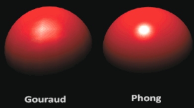

# 图形学

## 渲染管线和光栅化
### Q1 渲染管线的具体过程
一个最经典也最简单的渲染管线流程：


### Q2 一个被前方物体遮挡住的Fragment会不会被着色？

一般情况下会的，所谓的片元Fragment是从几何着色阶段结束后，把所有三角形都给光栅化形成的，这个阶段尚未考虑到丢弃被遮住的片元，所以所有光栅化生成的，不论在前还是在后的片元都会运行片段着色器；只不过这些片段在后续的深度测试阶段将会被丢弃，从而不会真的绘制到屏幕的FrontBuffer里面。

然而，现代GPU引入了一种新的特性叫做提前深度测试，这种特性提出，只要着色过程没有写入和修改任何深度值，就可以在光栅化后片段着色之前丢弃被遮住的片元、少运行一些FragmentShader，从而提升性能。
### Q3 什么是深度冲突，如何解决
深度冲突发生于这种情况：一对三角形过于接近，而深度精度不足以分辨两者谁在前谁在后，从而不断争夺谁显示在前面，看起来就像角色移动时两者迅速往复切换地显示在上层。
有几种思路来解决：
一是避免把三角形放的过于接近，比如在紧紧贴合的两个面中间设置一个空气夹缝；
二是提升深度精度，在openGL里默认是24位深度精度，但是在现代GPU中也支持32位，
三是通过把near平面调的远一些来提升精度，因为深度-z函数约近的位置变化越快，精度越大。

### Q4 什么是前向渲染，什么又是延迟渲染？
[WMming知乎 前向渲染与延迟渲染](https://zhuanlan.zhihu.com/p/485444989)
[浅墨老师知乎《Real-Time Rendering 3rd》 提炼总结(七) 第七章续 · 延迟渲染(Deferred Rendering)的前生今世](https://zhuanlan.zhihu.com/p/28489928)
[learnOpenGL延迟着色法](https://learnopengl-cn.github.io/05%20Advanced%20Lighting/08%20Deferred%20Shading/)
我们在Q1中介绍的openGL管线就属于前向渲染Forward Rendering。所谓前向渲染，即对象的所有图元都要渲染，有多少图元渲染多少图元，渲染后再进行剔除。


前向渲染有这样一些问题：
在前向渲染中，FS阶段，管线从光栅化阶段的输出拿到所有光栅的信息，包括每个光栅的位置、顶点阶段输出属性等，根据在光栅阶段插值得到的这些值逐一进行片段着色。在这个过程中，有些光栅事实上被遮挡了，但是依然会执行片段着色，从而浪费了很多性能。已经讲过，Early-Z(提前深度测试)等技术可以用于改善这个问题。
此外，如果场景中出现复数M个光源，那么前向渲染的复杂度将是MN，N=物体数量。这是因为，在每个物体的着色过程中，无疑都需要遍历所有光源来计算某一个光栅的着色。

延迟渲染技术直接扭转了图形渲染管线的流程：片段着色被延迟到了深度测试之后，因此称延迟渲染技术。

延迟渲染引入了一个屏幕空间的缓冲G-Buffer，或称几何缓冲区。在延迟渲染中，
1. 对于屏幕空间的场景进行一次无光源的绘制，这次绘制对每个片元会写入position，normal，diffuse，specular等lightmap项；这个步骤称为几何处理阶段(Geometry Pass)
2. 对于场景中的复数光源，用G-Buffer中的缓冲信息，逐屏幕像素地绘制结果到屏幕，对每个像素，逐光源地计算并累加着色结果。这个过程称光照处理阶段(Lighting Pass)

为什么说延迟渲染几乎彻底解决了多光源问题呢？在延迟渲染的过程中，第一个Pass的开销是无光照的，非常可以接受的；在G-buffer被写入后的第二个Pass，即便在最不乐观的情况下，也能消除单个模型实际在屏幕空间下被遮挡住的像素进行光照计算的开销——如果使用前向渲染，在绘制某一个模型的时候是没有办法知道自己未来会不会被挡住一部分的。

为什么说延迟渲染没有办法应用MSAA？

## 图形学数学
### Q1 什么是**法线矩阵**，为什么要应用法线矩阵？

法线矩阵是为了解决法向量在scale缩放操作中改变这个问题的。在平移和旋转，包括等比缩放当中，顶点法线都不会出错：平移对于顶点法线没有意义；对法向量旋转和旋转点一样只需要左乘旋转矩阵；等比缩放也一样。而**非等比缩放**将会导致前后**法向量出错**。
   
比如我们对一批顶点引用一个模型变换矩阵model，我们很自然地想要为position和normal这两个量都左乘model。一般情况下，这样做都能奏效，得到正确的法线传递给fragment shader；但事实上model当中被一步非等比缩放**污染**了。
   
倘若直接传递，法线将会被扭曲，从而让最终的显示结果出问题。
我们可以用一个简单的数学手段纠正之。

法线矩阵可以很容易地从原本的模型矩阵model得到，即对其求逆-转置，再抹去第四维：
   ```
   mat3 normalMatrix = mat3(transpose(inverse(model)));
   ```
这意味着对model先取反、再转置。
我们知道，model可能是从三个矩阵得来的：平移矩阵transport, 旋转矩阵，缩放矩阵scale，model = transport * rotation * scale;

另外需要注意，**求逆**是一个**高开销**运算，应当避免在着色器里使用。


### Q2 判断**点在三角形内**的方法 简单略
### Q3 给定入射方向和平面法线，**求反射**方向
这个也还挺简单的，在glm里直接运用reflect函数，输入入射向量和法线即可得到出射向量；如果要手动求，如下图
   
   参加了完美的渲染引擎岗笔试，这题也出现了，还是比较热门的简单题
### Q4 什么是**四元数**,什么又是**欧拉角**，两者如何转化

### Q5 什么是视差贴图？为什么要应用这个概念？

### Q8 不透明物体是怎么渲染的/AlphaBlend的过程是怎么样的？

## 光照

### Q1 什么是**Gouraud shading**
   是一种光照模型。我们常说的冯模型最初运行于顶点着色器上，也就是说光照结果将会直接存在顶点里、最后通过插值来反映在像素上。这让高光的范围扩大了许多、增强了许多，直观效果就是让图片变得很像塑料。当时这样做是为了降低开销，因为fragmentShader的运算次数要比VertexShader高的太多了。这种模型就是所谓的Gouraud模型。
   Phong shading并不比原先高档多少，仅仅是将光照运算放在片元着色器上。这让结果真实多了。
   

### Q2 shadow map当中，从光源出发位置得到的深度纹素，如何知晓它与摄像机位置渲染得到实际像素的对应关系？
   2-pass shadowmap当中，有一个概念叫光源坐标空间。我们把光源作为摄像机，输入lightpos，lightdir，lightup，即可用glm::LookAt()求出view矩阵；projection矩阵也是简单设置即可。这样一来，对所有三角形执行VP变换，被变换的点就成了光源坐标空间的点。
   
   如图，在渲染点P的片段着色时，我们想决定其是不是在阴影中。首先，我们用VP变换把P变换到光源坐标空间去，这时候P的z值就是其到光源的距离；

   *然后我们根据P的x,y来查询深度纹理，要知道此时P的x，y就是这条射线对应深度纹素的uv值。我们用xy采样深度纹理，就得到了一个新的深度，对应图中的C。*
   ```hlsl
   float closestDepth = texture(shadowMap, projCoords.xy).r;
   float currentDepth = projCoords.z;
   float shadow = currentDepth > closestDepth  ? 1.0 : 0.0;
   ```
   如果C的depth和P的相等，那么说明这个物体被照亮；如果C的depth显著小于P的depth，那么我们知道P处在阴影当中。

### Q3 什么是环境光遮罩SSAO？
概括一下，必须拿到整个屏幕的像素的世界坐标，类似于后处理。

### Q4 帧缓冲是用来解决什么问题的？
   有时候我们希望绘制一些东西，但不希望这些东西显示到屏幕上，而是先存留在某处，为之后在屏幕上绘制提供帮助。两个典型的帧缓冲案例是**阴影算法** 和 **后处理**。
   在这两个例子中，我们都是先不向最终画面(也就是默认帧缓冲的颜色纹理附件)绘制，而是定义一个新的帧缓冲，规定其附件，先绘制到这个帧缓冲的对应附件上(阴影算法shadowmap是绘制到深度附件，而后处理是绘制到颜色附件)

   同时，在帧缓冲技术之外我们还提出了交换链技术，也就是当前显示的frame称为frontbuffer，而我们总是计算另一个称为backbuffer的帧来供下一帧展示

### Q5 模板缓冲/模板测试是用来解决什么问题？
   模板缓冲就是用来做模板测试的， 我们知道一般绘制时，为了绘制一个fragment，总是先执行深度测试以判断当前fragment究竟是否要绘制，毕竟被遮挡的fragment本不该绘制。而模板测试发生在深度测试之前，用于完成一些更精细的操作。
   模板测试的逻辑是需要自己修改以配合的，如果我们不干预模板测试，默认的模板测试函数是GL_ALWAYS，表示任何fragment都能通过模板测试，而不会被蒙蔽(masked)。需要指出，模板测试和深度测试是相互辅助的，又由于可以自己编写逻辑，灵活性很强
   运用模板测试的两个简单例子：

   1. 管中窥豹 我们可以假设我们的游戏人物正通过一个望远镜观察世界，他能看到的只是屏幕中心一个圆形的区域。这里我们就可以先在屏幕上绘制一个圆形，被绘制的片元在绘制时候把模板置为1：
   ```cpp
   //glStencilOp(GLenum sfail, GLenum dpfail, GLenum dppass)
   //sfail: stencil失败执行的行动
   //dpfail: stencil成功，但depth失败执行的行动
   //dppass: 均成功时候执行的行动
   //这样设计参数是为了两个模板一旦有一个失败就不必继续测下一项了，直接剔除frag即可
   glStencilOp(GL_KEEP, GL_KEEP, GL_REPLACE);

   //通过这样的设计，我们要求在模板和深度都通过的时候，
   //将模板值设置为glStencilFunc函数设置的ref值，见下面的glStencilFunc
   ```
   而后我们draw第二次，这里的draw这样设定：
   ```cpp
   //glStencilFunc(GLenum func, GLint ref, GLuint mask)
   glStencilFunc(GL_EQUAL, 1, 0xFF)//只有=1的模板能够通过测试
   ```
   这样我们的模板测试总是把当前位于0xFF（全1）做and运算，只有等于(GL_EQUAL)1才能通过测试。

   2. 物体轮廓 同上，第一遍渲染的模板测试策略是：
   ```cpp
   glStencilFunc(GL_ALWAYS, 1, 0xFF);
   glStencilOp(GL_KEEP, GL_KEEP, GL_REPLACE);
   //凡是fragment均通过，但通过后必须把模板置为1
   ```
   渲染采用真实shader；
   
   二次渲染之前将物体scale 1.05，放大一些；
   禁用深度测试(这会造成绘制采用画家算法，后来居上，总是覆盖之前的内容)
   第二次渲染将采用纯色shader，也就是绘制外框的shader
   第二遍渲染的策略是：
   ```cpp
   glStencilFunc(GL_NOTEQUAL, 1, 0xFF);
   glStencilOp(GL_KEEP, GL_KEEP, GL_KEEP);
   //注意，屏幕上有三类frag
   //没有frag的位置，本来就不会进行两种test，也不会有绘制；
   //有frag，且mask=1的位置，就是我们之前绘制了物体的位置，此时那里已经变成了真实物体的颜色，我们不会进行覆写
   //有frag，且mask！=1的位置，这说明是我们的放大使其出现在屏幕中，也就是我们要找的轮廓了，进行渲染，输出纯色
   ```
### Q3 HDR是什么，解决什么问题？
   HDR，High Dynamic Range, 高动态范围，相对于HDR还有 LDR，低动态范围。这两个名词都是用来指代色域的，也就是屏幕上的颜色能够允许的范围。
   我们知道，显示器对于一个像素的显示，亮度上限是255,255,255,也可以用三个[0, 1]的浮点数来记录。那么如果局部点的亮度超过了1，我们的显示器却不能显示超过1的值，最后就导致画面中呈现出一大片白色，这片白色本身可能是一扇窗户、一个被照亮的物体，但结果是一大片白色让大家看不出任何东西，也就是"loss of detail"
   
   我们可以通过**色域映射**来解决这个问题。色域映射的核心思想就是允许某一个点的颜色通道值超过1，也即把[0, x]的颜色通道值映射到[0, 1], 但这种映射显然不是一个简单的映射算式就可以完成的。比如我们想一想，在一个昏暗的场景，也许大多数颜色都不大于0.3，而突然游戏人物从室内走到室外，现在这些颜色一下到达了20多，如果采用同一套算法进行色域映射，前者将暗得无法接受。
   同时，色域映射一定是需要把整个屏幕的信息纳入计算的，而非在一个fragmentshader就可以完成。

### Q4

### Q6 如何实现泛光效果？
OpenGL的做法是：提取HDR高亮区域 + 对高亮纹理高斯模糊 + 新纹理与原图叠加

### Q7 Culling是如何识别正面和反面的？
Culling一般译为剔除，Clipping译为裁剪。Culling发生在图元装配成三角形之后、像素着色之前。
OpenGL通过环绕顺序来判别一个面是朝向摄像机还是背向摄像机。我们规定所有的模型，顶点的排布必须遵循逆时针排布规则：

从外侧来看，其环绕顺序必须是逆时针顺序。其实要做到这件事，我们只需要按一定的条例去规定顶点索引就可以了；

这样一来，如果要从图中方向看对侧的三角形，就会看到不符合逆时针的排布，1-2-3满足顺时针。那么那个三角形就是所谓的背面三角形。

OpenGL用glEnable(GL_CULL_FACE)来开启面剔除，默认是不进行剔除的。如果开启了面剔除，默认是背面剔除。在解决阴影的问题时，我们也使用过开启正面剔除，使用glCullFace(GL_FRONT);
glCullFace有三个可选值：
GL_BACK 默认值，剔除背面
GL_FRONT 剔除正面
GL_FRONT_AND_BACK 都剔除

## 光线追踪
### 射线如何与AABB求交？
包围盒其实就是六个数字，x1, x2, y1, y2, z1, z2
把x = x1带入P = O + tD，可以得到一个时间t，同样的就能得到
[t1, t2]：光线在x轴上进入盒子的时间
[t3, t4]：光线在y轴上进入盒子的时间
[t5, t6]：光线在z轴上进入盒子的时间
如果发现t1-6当中有负值，把负值clamp成0；那个负值意味着在射线原点出射方向的对侧。
让三个区间求交, 最终如果能得到一个区间，
### 射线如何与三角形面片求交？
先让射线与三角形所在的平面求交，然后让交点计算是否在三角形之内。

### Spatial Partition空间划分
Spatial Partition空间划分，主要是应用于光线追踪和物理计算。
为了进行光线追踪，我们需要进行大量的物体三角形面片与光线求交的运算，但是如果逐面片与单一光线求交，这就造成了一个天文数字的复杂度，光线数量 = 屏幕像素数量N，面片数量=M，一个帧要计算MN，是不可能的
进而就有一种做法，考虑把空间划分成大量的小方格，每一个都是包围盒，先让光线与包围盒求交点，只有光线交于盒子才进而对这个盒子里的面片求交

这也可以被认为是一种空间划分，但是这种划分方案非常糟糕，没有物体的稀疏空间里设置很多盒子是没有必要的，同时物体密集的地方用相同的盒子密度也不合理

因此几个基础的Spatial Partition方案是：
1. 八叉树OctTree

八叉树的问题，八叉还是显得有些太大了，树的结点膨胀的有些太快了。在一个较为均匀分布着物体的世界中，第一次剖分形成八个子节点，第二次就形成了8x8个节点。

八叉树的问题就是强行要求每个节点在其分管的空间内均匀地八等分

2. KD-Tree

KD树总是不均匀地切割坐标轴；按照x - y - z顺序，切割坐标轴从而得到划分好的节点。每个节点如果需要进一步剖分，就形成两个子节点；否则就没有子节点。

KDtree的问题就是，一个物体可能和多个盒子有交点，那么当光线交了一个盒子，这些物体岂不是要在多个重复进行计算？

3. 从物体出发的划分 - Object Partition/Bounding Volume Hierachy
BVH划分的对象是物体。场景中有海量的三角形片元，BVH致力于把三角形分成两批，每一批都装在一个子包围盒里。

这样的划分不断持续，形成一颗BV树，这是一颗二叉树。可以定义一个终止条件，当盒子里的三角形足够少就停止剖分。
BVH的创建，可以学习KDTree，对任何一个节点，总是对这个节点对应的空间区域三个轴内最长的一个轴进行剖分；另一个技巧是，如果三角形在轴上分布，可以简单进行一个计算，对轴上左值排序的中位三角形进行剖分，从而让二叉树更平衡

### 光线追踪的BVH遍历代码？
```cpp
void Intersect(Ray ray, BVH node){
   if(ray.hit(node.bbox)){
      if(node->left){
         Intersect(ray, node->left);
      }
      else if(node->right){
         Intersect(ray, node->right);
      }
      else{//leaf node
         for(auto obj : node.objs)
         {
            auto result = IntersectObj(ray, obj);
            if(result.size() > 0)return result[0];
            //如果有许多交点，返回第一个交点
            else return NULL;
         }
      }
   }
   else{
      return NULL;
   }
}
```

## AA和后处理
你所知道的AA算法？

## 纹理，采样，走样
各向异性过滤？
mipmap？
线性插值，双线性插值，三线性插值？
## 其他
## URP渲染的基本流程

Unity Shader里面顶点着色器和像素着色器的输入输出分别是？


