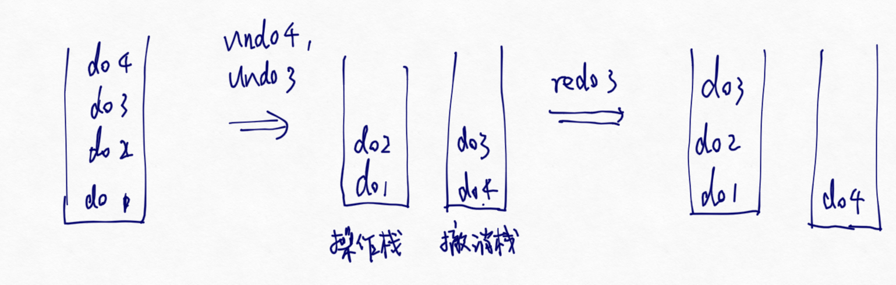
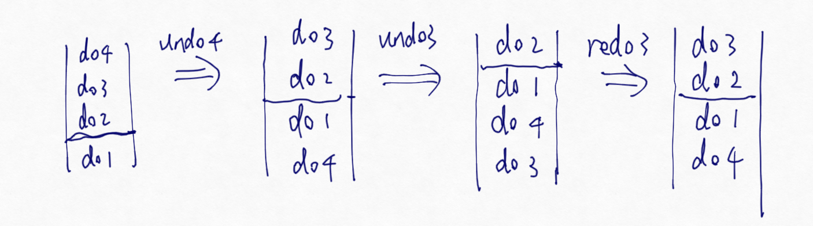
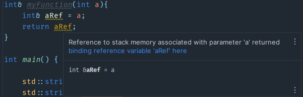

# 备战题库
## C++
### 1.类详解与内存管理
#### 1.1 内存布局
1. 调用栈？调用一个函数的过程？
2. 内存结构，为什么要分区
3. 堆栈 text/bss/data段 堆和栈的区别 堆和栈是用什么数据结构存储的

4 静态变量和局部变量的不同，储存在哪

#### 1.2 类
构造函数有哪几类

#### 1.3 动态内存和智能指针
Q1.3.1 placement new？
Q1.3.2 shared_ptr?
Q1.3.3 shared_ptr是线程安全的吗？
Q1.3.4 C++ new delete malloc free的区别? / new和malloc有什么区别?
Q1.3.5 weak_ptr？
Q1.3.6 shared_ptr的计数器为0将指向的变量释放后，指向这个变量的weak_ptr怎么删除

#### 1.4 拷贝控制

### 2.STL
1 细说unordered_map

1. map & unordered_map的底层
   map的底层是红黑树，而unordered_map的底层是哈希表。
2. stl 的容器线程安全吗
3. push_back、emplace_back区别；
   都是顺序容器共有的两个成员函数。在MSCV10编译体系下，push_back和emplace_back几乎没有差别；但是标准中的的push_back和emplace_back的区别在于，emplace_back在特定位置执行构造而非拷贝；
   以vector为例，push_back接收的参数是vector value_type的一个对象，调用后对其进行拷贝构造，拷贝到vector.end()位置；而emplace_back接受的参数是参数表，编译器拿到这些参数后会为他们匹配一个容器value_type的构造器，在容器vector.end()位置直接进行构造，而不必执行拷贝构造函数

C++ vector resize & reverse;

### 3.面向对象特性
面向对象特性有哪些
多态、虚函数、虚函数表、虚指针
覆盖和重载的区别
### 4.大型项目
Q4.1 指针和引用的区别？
Q4.2 static关键字的作用；
Q4.3 const关键字的作用；


### 5.C++类型
Qx 四种类型转换？

### 6.还未整理
Cpp的三大特性
c++11 新特性
c++ 四种cast
explicit关键字的作用是什么
左值和右值的区别是什么
空类的实例大小
虚函数机制
如何在C里面调用C++代码，反过来呢？
C和C++区别
vector和list的区别
reinterpret_cast的应用场景
dynamic_cast的实现机制
不用第三者交换两个数
内存泄漏
内存溢出


## 算法与数据结构
堆排序的原理
哈希冲突是什么，有哪些解决方法
判断两个树的对称
红黑树；和普通二叉搜索树以及AVL树对比
有效括号字符串
快排的最坏情况，最坏复杂度
哈希在插入元素的时候时间复杂度
哈希函数满足哪些特性？
有哪些常见的哈希函数？
图的遍历算法有哪几种？
dfs和bfs分别应用于哪种场景？
图的最短路径算法有哪些？
A*算法了解？
Top-k 最大堆
LIS，Longest Increasing Sequence,最长上升子序列问题

## 计算机网络
帧同步和状态同步的原理
TCP和UDP的区别
游戏开发中基于UDP实现了KCP，如果是你来设计，如何保证其稳定？
三次握手和四次握手
time_wait状态为什么要等待2msl
在2msl之后一定会结束吗？
如果服务器断开连接会怎么样
三次握手如果第一次握手没有收到怎么办
UDP的传输内容限制多大
ping指令是应用在哪个协议下的
说说快速重传算法
TCP接收方收到的序号混乱或者有延迟会不会影响发送方
怎么实现可靠的UDP
套接字了解嘛，有用过这个编写程序吗
http和https的区别 https的加密方法、证书
DNS协议
select和epoll的区别
什么是网络流？
握手挥手过程中信号传输失败应该怎么处理


## 计算机组成原理&操作系统
### 1 进程和线程
同一个进程的线程之间共享哪些，不共享哪些
线程同步有哪些方法
进程调度有哪些算法
给你个指向共享内存的指针，多个线程共享这个队列，如何做
进程和线程的区别？
进程通信的方法？
命名管道和匿名管道的区别
CPU调度算法
物理地址到逻辑地址之间是怎么转换的
多线程一致性如何保持

### 2 内存管理
内存分页了解吗，置换有哪些算法
分页和分段的区别
虚拟内存和物理内存
虚拟内存？

### 3 编译
编译过程，链接是干什么的，动态链接和静态链接
什么函数可以在main之前运行
如何保证一个头文件不会被两次include从而造成多重定义冲突
`#ifdef` 这是什么作用

### 4 尚未整理
1.讲一讲虚拟内存
2.内存虚拟内存之间是怎么调度的
3.页地址是怎么查询到物理地址的
4.页表到实际物理地址的实现设计什么数据结构（我答了个map的映射关系，不知道对不对）

## 实践题

有一个生成[0,1]随机数的函数，把A块钱分给B个人。尽量少调用方法


五层内的树的任何结点都可以用一个三位数表示，比如321，表示第三层第二个节点，其value是1。任务就给个数组包含很多这样的三位数，然后你去求得从树根到树叶的最小路径

1. 一个圆形区域随机空投等概率
这个蛮简单的，极坐标，分别随机生成半径和角度

1. 1 * 2的地砖，铺满2 * n的空间，几种不同的方法
N个方块，组成一个金字塔（下一层的方块数要多于上一层），几种不同的方案

leetcode249 移位字符串分组

给定数组输出第k小子序列和

1代表陆地，0代表海洋，查找陆地形状不同的数量，（通过旋转等变换能相同的视为不同形状）
输入：
11000
10000
00001
00011
输出：2

给定一个 长度为 n 的整型数组 nums 和一个数值 k ，返回第 k 小的子序列和。


AB抛硬币，先抛到正面的人赢，问A赢的概率
链表倒数第K个节点

赛马，25匹马，5个一组赛跑。最少比几次找到前三快的。。（最后我提出的方案是模仿某一种排序，忘了名字了，5x5的格子，找中位数然后缩小范围。。先比5次，再中位数比1次

那些排序是稳定的？

数组全排列
动态规划实现原理
treemap原理
并查集
洗牌算法 时间复杂度
分治法的实现原理
arraylist的长度扩展
求二叉树的宽度
upper_bound
最小生成树
链表和数组的优劣
寻路算法
递归的底层是怎么实现的？使用栈的过程？
链式结构顺序结构的差异


static_cast dynamic_cast
extern关键字，extern C
手写代码strncpy
malloc和new的区别
C++的static_cast和dynamic_cast的区别
a++为什么不是线程安全？ a++翻译成汇编是什么能写出来吗？
**static数据和基本数据区别**
**把vector a赋值给b，修改a是否会影响b的内容？这种赋值是传递引用吗？**
vector中能传引用吗，底层实现原理（两倍扩容）
STL vector底层，push_back()会发生什么
什么情况会导致栈溢出
一个函数编译的时候是怎么转化为汇编语言的 比如 int add(int a,int b)
多继承的两个子类都实现了一同名函数，具体会调用那个
参数传递的底层过程
重载和重写
重载运算符，代码示例

- 经典八股
C++和C#的区别？
C#没有指针，如何管理内存？
讲讲看List容器和Vector容器的差别？
new 的用法，一个new的对象内存如果不回收会怎样？
智能指针了解如何？
public，private，protected各自的权限范围，有没有例外(友元）
map的底层？
~~红黑树？~~
~~虚函数、虚表？~~
32位浮点数的结构？
struct 和 class的区别？
用过哪些设计模式？

## 答案
### Q1.3.1 placement new？

为了介绍placement new，首先不得不介绍operator new & operator delete

当我们使用最初级的new时候，实际上会发生这样的事情：
```
myClass* obj = new myClass(42);
1. void* memory = ::operator new(sizeof(int));
这一步，解析new后结构，调用operator new获取一段足够大的内存空间，并把首地址保存下来
2. 调用myClass(42)进行对象的构造
3. 返回memory
```
当调用delete的时候，转而发生这件事情：
```
delete obj;
1. obj -> ~myClass();
2. ::operator delete obj;
```
::operator new是系统生成的全局operator new
关键在于，上述的写法都仅仅使用了operator new的默认版本，而实际上operator new和operator delete都是可以重载的，每个类都可以重载自己的operator new

```cpp
    class A {
public:
    void* operator new(size_t size) {
        std::cout << "Custom operator new called. Size: " << size << std::endl;
        return ::operator new(size);
    }

    void operator delete(void* ptr) noexcept {
        std::cout << "Custom operator delete called." << std::endl;
        ::operator delete(ptr);
    }

    int getValue() const {
        return value;
    }

private:
    int value = 42;
};

int main() {
    //A* obj = new A();  
    A* obj = A::operator new(sizeof(A));
    // 改为使用自定义的 operator new 运算符来分配内存
    std::cout << "Value: " << obj->getValue() << std::endl;

    //delete obj;  
    A::operator delete obj;
    // 改为使用自定义的 operator delete 运算符释放内存
    return 0;
}
```
下面我们再来看placement new。
如果聪明的你运行了上面这段程序，你会发现输出的value是脏的。这是因为，operator new和new的行为是割裂的：一般来说operator new 无论是全局版本还是重载的版本，都是不负责对象的构造的。可惜，聪明的CLion这次没能拦截问题，把这个undefine错误放到了运行时。

operator new是隐式静态的，手动静态也无所谓。但是不可以把operator new定义在全局和类作用域之外的地方。这是很合理的，operator new时，类还没有构造；operator delete时，类已经销毁了，一次你operator new/delete 必须 keep hands off class members.

所以除了operator new，我们还需要一个配套的工具，在operator new请求到内存后在那个内存里填充数据，构造对象。这个工具就是placement new，或称定位new。
   placement new的一段应用示例如下：
```cpp
   class myClass{
   public:
    int classContent;
    myClass(int i) : classContent(i){}
};
   int main() 
   {
    void* memory = operator new(sizeof(myClass));
    myClass *obj = new (memory) myClass(43);
    std::cout<< obj -> classContent << std::endl;
    obj -> ~myClass();
    return 0;
}
```
其中，
```cpp
myClass *obj = new (memory) myClass(43);
```
就是定位new语句，对new提供一个指针memory指示要在哪里进行定位new, 后面的部分就像调用构造函数一样。当然也可以写作：
```cpp
int main() {
    void* memory = ::operator new(3 * sizeof(A));
    A* myObj = new (memory)A[3];

    std::cout << myObj->getValue() << std::endl;
    std::cout << (myObj + 1)->getValue() << std::endl;
    std::cout << (myObj + 2)->getValue() << std::endl;
}
```
tips: 析构函数只清空内存，不会释放空间。
比起allocator，定位new有一个更棒的地方。你事实上并不一定需要传入一个operator new出来的memory，你可以用malloc，可以用new，也可以用栈内存。都是允许的。

### Qx C++类型转换?
在C++中，以下类型可以彼此进行类型转换：

隐式类型转换（Implicit Type Conversions）：这是由编译器自动执行的类型转换，无需显式指定。隐式类型转换通常涉及以下情况：

1 将一种算术类型转换为另一种算术类型（例如，将整数类型转换为浮点类型）。
2 标准的数字提升和宽化转换。
3 派生类向基类的指针或引用的隐式转换。

显式类型转换（Explicit Type Conversions）：这是通过特定的语法形式显式指定的类型转换。在C++中，有四种显式类型转换方式：

静态转型（static_cast）：用于进行基本类型的转换、非多态类之间的转换以及具有继承关系的指针或引用之间的转换。
常量转型（const_cast）：用于去除变量的const属性或volatile属性。
重新解释转型（reinterpret_cast）：用于指针或引用之间的强制类型转换，通常用于底层操作，潜在风险较高。
动态转型（dynamic_cast）：用于在继承体系中进行安全的向上转型和向下转型，用于检查和转换多态类的指针或引用。
### Qx.x 细说static_cast
要确定是否可以使用 static_cast 将A类型转换为B类型，需要考虑以下因素：

1. A类型和B类型之间是否存在直接的转换规则，即AB互为公有父子。
2. 是否存在用户定义的类型转换操作符函数或转换构造函数来支持A到B的转换。
3. 是否满足隐式转换的规则。

关于第二点，类型转换操作符和转换构造函数是这样写的：
```cpp
class A{
   operator B() const;//类型转换操作符
}
class B{
   B(const A&);//转换构造函数
}
```
只要A有B的类型转换操作符 或者 A有以B为参数的转换构造函数，就可以使用隐式类型转换或者static_cast进行B转换成A的操作了。


### Qx.x 细说const_cast
const_cast是用来移除或增加指针/引用的常属性的。const_cast不能用于修改一个变量或对象的常属性。

我们在const部分介绍过，

### Qx.x 细说reinterpret_cast
抛弃一切检查的转换，只能用于把一种类型的指针/引用转换成另一种哦给你类型的指针/引用。

### Qx.x 细说dynamic_cast
首先回顾一下，父类指针天然可以接受子类指针的赋值，即天然父指子；但是子类指针 = 父类指针 是危险的，直接使用隐式转换是会被编译器报错禁止的。

当使用 dynamic_cast 进行继承体系中的安全向上转型和向下转型时，需要满足以下条件：

1 类之间必须存在继承关系。
2 基类必须具有虚函数，也就是必须是一个多态基类

在第一个例子中，我们使用dynamic_cast进行安全的转型
```cpp
//dynamic_cast用于继承安全转移
int main() {
    Derived derivedObj;
    Base* basePtr = &derivedObj;
    //不安全的向上转型
    Derived* derivedPtr1 = basePtr;//报错
    // 安全的向上转型
    Derived* derivedPtr = dynamic_cast<Derived*>(basePtr);
    return 0;
}
```
注意 代码和图片中的向上转型说法是不对的，或许改为向下类转更合适，请忽略

直接把父类指针丢给子类指针是禁止的

必须是多态类Base才能进行dynamic_cast：


一言以蔽之，只有当传递给子类指针的父类指针实际也指向一个子类对象的时候，这种子指父的行为才是有意义的或者是被允许的，dynamic_cast正是为了这种检查而诞生的。这就引出了我们下面的第二个例子：用dynamic_cast进行父指针向子指针转换的合法性

```cpp
Derived derivedObj;
    Base baseObj;
    Base* basePtr = &derivedObj; //1
    //basePtr = nullptr; //2
    //basePtr = &baseObj; //3
    if(Derived* derivedPtr = dynamic_cast<Derived*>(basePtr)){
        std::cout << "casting success" << std::endl;
    }
    else{
        std::cout << "casting fail" << std::endl;
    }
    return 0;
```
这里的1 2 3三个不同的basePtr值，只有第一个能够返回类转成功。dynamic_cast若发现没有运行时没有合法地进行匹配的动态绑定，通过返回nullptr来表达错误已经发生。

此外还有第三种情况，dynamic_cast也可以用于对引用进行动态绑定检查：

```cpp
int main() {
    Base baseObj;
    Derived derivedObj;

    try {
        //Base& baseRef = derivedObj;
        Base& baseRef = baseObj;
        // 使用 dynamic_cast 检查引用的动态绑定
        Derived& derivedRef = dynamic_cast<Derived&>(baseRef);

        std::cout << "Dynamic cast to Derived& successful." << std::endl;
        derivedRef.print();
    } catch (const std::bad_cast& e) {
        std::cout << "Dynamic cast to Derived& failed: " << e.what() << std::endl;
    }
    return 0;
}
```
简言之，dynamic_cast在检查动态绑定的引用时，通过抛出bad_cast异常来反映错误。

### Qx.x 细说unordered_map
unordered_map底层是哈希表。任何类型都可以作为unordered_map的key，但是自定义的类作为key时必须满足以下条件：
1. 重载了相等比较运算符==
2. 给出一个函数对象，用于定义哈希函数

下面给出一个代码示例
```cpp
class MyClass {
public:
    int value;

    MyClass(int val) : value(val) {}

    bool operator==(const MyClass& other) const {
        return value == other.value;
    }
};

struct MyHash {
    std::size_t operator()(const MyClass& obj) const {
        return std::hash<int>()(obj.value);
    }
};

int main() {
    std::unordered_map<MyClass, std::string, MyHash> myMap;
    MyClass key1(42);
    myMap[key1] = "Value 1";

    MyClass key2(55);
    myMap[key2] = "Value 2";

    std::cout << myMap[key1] << std::endl;  // Output: Value 1
    std::cout << myMap[key2] << std::endl;  // Output: Value 2

    return 0;
}
```
下图的提示指出了使用三个模板参数的unordered_map的用法：


 (§23.2.5/9)标准描述的unordered_map指出：若有些元素的键，哈希值是相等的，它们会放在同一个桶内，据此可以推断出std::unordered_map若按照标准描述，应该使用拉链法而非开放寻址法解决哈希碰撞。

 unordered_map 通过用户自定义的hash函数来计算桶号；碰撞的对象插入后会被丢在同一个桶里，形成拉链。因此，如果不断插入hashcode相同的对，结构的复杂度将会退化成链表O(n2);
 此外还有文章说到，unordered_map对于int等类型进行的默认哈希函数是取一个合适的素数，对key取这个素数的模来作为哈希值。因此，如果我们找一个大素数，比如107897，然后不断生成这样一些量作为key ： 107897 * 1， 107897 * 2, ... , 就会导致碰撞频繁发生，非常耗时

### Qx.x map的底层
std::map 是 C++ 标准库中的有序关联容器，其底层实现通常基于红黑树（Red-Black Tree）。

红黑树是一种自平衡的二叉搜索树，它具有以下特性：

每个节点都有一个颜色属性，可以是红色或黑色。
根节点和叶子节点（NIL 节点）都是黑色的。
如果一个节点是红色的，则其两个子节点都是黑色的。
从根节点到任意叶子节点的路径上，黑色节点的数量相同。
这些特性确保了红黑树的平衡性，并且使得插入、删除和查找操作的时间复杂度保持在对数级别 (O(log n))。

在 std::map 中，每个键值对被存储为红黑树中的一个节点。键被用来进行按序存储，并且根据键的比较结果构建一棵有序的红黑树。这样，当需要进行查找、插入或删除操作时，可以利用红黑树的特性来高效地执行这些操作。

通过使用红黑树作为底层数据结构，std::map 提供了一组有序键值对，并支持各种常见操作，例如插入、删除、查找、范围查询等。它适用于需要有序存储和查询的场景，并提供了较好的性能和复杂度保证。
### Qx.x std::deque
:| deque支持RA，而且在两端插入和删除都是O(1)
deque可以一边做队列、一边做栈，因为我们任何时候都能立刻拿到双端队列里最早抵达的元素，也总是能拿到最迟抵达的元素。队列只给我们访问最早抵达的，而栈只给我们访问最迟抵达的。
deque的形状天然像一个管道。两端都可以进，两端都可以出，但是所有元素都保持着顺序。
deque还可以用来实现编辑器的撤销功能，因为我们不仅需要像栈那样不停堆放新的编辑指令，还要支持重做redo，这样就需要两个栈：

但是如果改成双端队列就好了。

撤销就把撤销的指令塞回屁股里 :) 重做就从屁股拿一个指令放回头部。可以看出双端队列就是两个开口相反的栈，不过像这样使用要注意我图中画的线，需要维护一个当前操作栈的深度，免得连续撤回或者连续重做把栈搞穿了

双端队列还有一个容易忽视但其实很重要的优点。双端队列在任何插入时，不会发生任何元素移动。

下面来讲一下std::deque的实现。

### Qx.x std::priority_queue
:( 

### Q4.1 指针和引用的区别
1 指针可以拥有空值，而引用不可以
2 引用在声明时必须进行初始化
4 可以通过让指针指向指针或者数组从而做到让指针指向二位乃至多维的指针，引用则不行；
5 指针可以通过加减一个偏移来访问指针所指内存邻近的内存，引用不可以
6 指针作为一个量，生命周期是超越实际变量的，指针一生中可以指向多个对象，任何对象纵使销毁也不意味着指针的消亡；引用的生命周期和对象一样


把一个临时量的引用返回，聪明的clion会报警 :)
此外，引用在拷贝控制、模板编程等都有很丰富的应用，尤其是右值引用、引用折叠等特性大大扩展了引用的用途

### Q4.2 static关键字的作用

### Q4.3 const关键字的作用