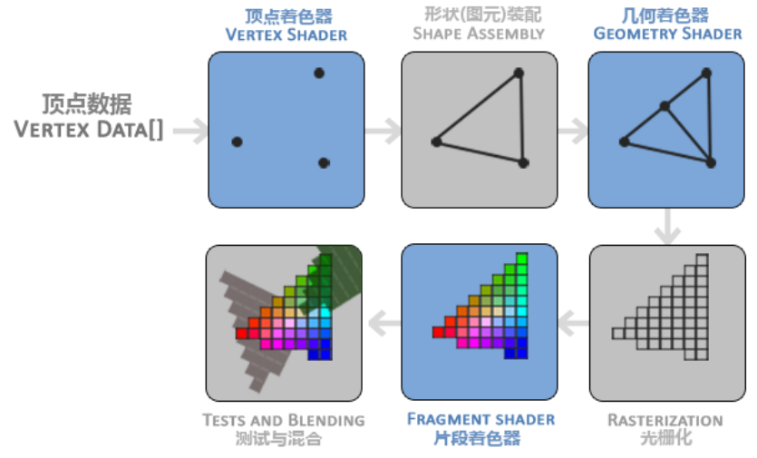
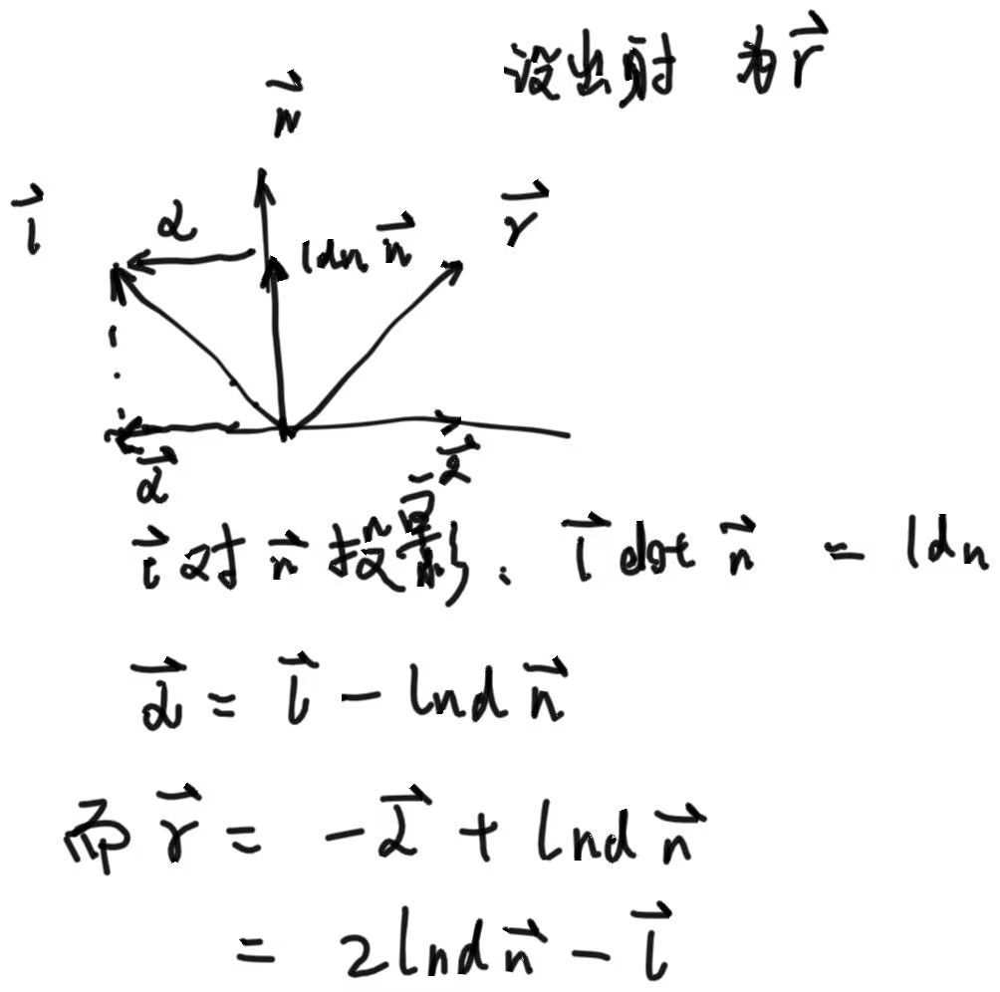

# 备战题库
## C++
### 1.类详解与内存管理
#### 1.1 内存布局
1. 调用栈？调用一个函数的过程？
2. 内存结构，为什么要分区
3. 堆栈 text/bss/data段 堆和栈的区别 堆和栈是用什么数据结构存储的

静态变量和局部变量的不同，储存在哪


#### 1.2 类
构造函数有哪几类


#### 1.3 动态内存和智能指针
shared_ptr?
shared_ptr的实现机制
shared_ptr是线程安全的吗？
C++ new delete malloc free的区别? / new和malloc有什么区别?
shared_ptr的计数器为0将指向的变量释放后，指向这个变量的weak_ptr怎么删除
   
#### 1.4 拷贝控制
拷贝构造函数为什么输入参数一般是常量

### 2.STL
你对STL的理解？
C++ vector resize & reverse ;
1. map & unordered_map的底层
   map的底层是红黑树，而unordered_map的底层是哈希表。实现vector的拷贝构造函数
stl 的容器线程安全吗
1. push_back、emplace_back区别；
都是顺序容器共有的两个成员函数。以vector为例，push_back接收的参数是vector value_type的一个对象，调用后对其进行拷贝构造，拷贝到vector.end()位置；而emplace_back接受的参数是


如果Array已经到达其长度上限，继续push_back会发生什么？
   这是一道错题


### 3.面向对象特性
面向对象特性有哪些
多态、虚函数、虚函数表、虚指针
覆盖和重载的区别
### 4.大型项目
讲一讲static关键字的作用；
讲一讲const关键字的作用；

### 5.还未整理
Cpp的三大特性
c++11 新特性
c++ 四种cast
explicit关键字的作用是什么
左值和右值的区别是什么
空类的实例大小
虚函数机制
如何在C里面调用C++代码，反过来呢？
C和C++区别
vector和list的区别
reinterpret_cast的应用场景
dynamic_cast的实现机制
内存泄漏
内存溢出


## 算法与数据结构
堆排序的原理
哈希冲突是什么，有哪些解决方法
判断两个树的对称
红黑树；和普通二叉搜索树以及AVL树对比
有效括号字符串
快排的最坏情况，最坏复杂度
哈希在插入元素的时候时间复杂度
哈希函数满足哪些特性？
有哪些常见的哈希函数？
图的遍历算法有哪几种？
dfs和bfs分别应用于哪种场景？
图的最短路径算法有哪些？
A*算法了解？


## 计算机网络
TCP和UDP的区别
游戏开发中基于UDP实现了KCP，如果是你来设计，如何保证其稳定？
三次握手和四次握手
time_wait状态为什么要等待2msl
在2msl之后一定会结束吗？
如果服务器断开连接会怎么样
三次握手如果第一次握手没有收到怎么办
UDP的传输内容限制多大
ping指令是应用在哪个协议下的
说说快速重传算法
TCP接收方收到的序号混乱或者有延迟会不会影响发送方
怎么实现可靠的UDP
套接字了解嘛，有用过这个编写程序吗
http和https的区别 https的加密方法、证书
DNS协议
select和epoll的区别
什么是网络流？
握手挥手过程中信号传输失败应该怎么处理


## 图形学

### 渲染管线和光栅化
4. 渲染管线的具体过程


5. 一个**被前方物体遮挡住**的Fragment会不会被**着色**？
   一般情况下会的，所谓的片元Fragment是从几何着色阶段结束后，把所有三角形都给光栅化形成的，这个阶段尚未考虑到丢弃被遮住的片元，所以所有光栅化生成的，不论在前还是在后的片元都会运行片段着色器；只不过这些片段在后续的深度测试阶段将会被丢弃，从而不会真的绘制到屏幕的FrontBuffer里面。

   然而，现代GPU引入了一种新的特性叫做提前深度测试，这种特性提出，只要着色过程没有写入和修改任何深度值，就可以在光栅化后片段着色之前丢弃被遮住的片元、少运行一些FragmentShader，从而提升性能。
7. 什么是**深度冲突**，如何解决
   深度冲突发生于这种情况：一对三角形过于接近，而深度精度不足以分辨两者谁在前谁在后，从而不断争夺谁显示在前面。
   有几种思路来解决：
   一是避免把三角形放的过于接近，比如在紧紧贴合的两个面中间设置一个空气夹缝；
   二是提升深度精度，在openGL里默认是24位深度精度，但是在现代GPU中也支持32位，
   三是通过把near平面调的远一些来提升精度，因为深度-z函数约近的位置变化越快，精度越大。
### 图形学数学
1. 什么是**法线矩阵**，为什么要应用法线矩阵？
   法线矩阵是为了解决法向量在scale缩放操作中改变这个问题的。在平移和旋转，包括等比缩放当中，顶点法线都不会出错：平移对于顶点法线没有意义；对法向量旋转和旋转点一样只需要左乘旋转矩阵；等比缩放也一样。而**非等比缩放**将会导致前后**法向量出错**。
   法线矩阵可以很容易地从原本的模型矩阵model得到，即对其求逆-转置，再抹去第四维：
   ```
   mat3 normalMatrix = mat3(transpose(inverse(model)));
   ```
   另外需要注意，**求逆**是一个**高开销**运算，应当避免在着色器里使用。
   

3. 判断**点在三角形内**的方法 简单略
4. 给定入射方向和平面法线，求反射方向
   这个也还挺简单的，在glm里直接运用reflect函数，输入入射向量和法线即可得到出射向量；如果要手动求，如下图
   

### 光照

1. 什么是**Gouraud shading**
   是一种光照模型。我们常说的冯模型最初运行于顶点着色器上，也就是说光照结果将会直接存在顶点里、最后通过插值来反映在像素上。这让高光的范围扩大了许多、增强了许多，直观效果就是让图片变得很像塑料。当时这样做是为了降低开销，因为fragmentShader的运算次数要比VertexShader高的太多了。这种模型就是所谓的Gouraud模型。
   Phong shading并不比原先高档多少，仅仅是将光照运算放在片元着色器上。这让结果真实多了。
   
2. shadow map当中，从光源出发位置得到的深度纹素，如何知晓它与摄像机触发位置得到实际像素的对应关系？
   2-pass shadowmap当中，有一个概念叫光源坐标空间。我们把光源作为摄像机，输入lightpos，lightdir，lightup，即可用glm::LookAt()求出view矩阵；projection矩阵也是简单设置即可。这样一来，对所有三角形执行VP变换，被变换的点就成了光源坐标空间的点。
   
   如图，在渲染点P的片段着色时，我们想决定其是不是在阴影中。首先，我们用VP变换把P变换到光源坐标空间去，这时候P的z值就是其到光源的距离；然后我们根据P的x,y来查询深度纹理，要知道此时P的x，y就是这条射线对应深度纹素的uv值。我们用xy采样深度纹理，就得到了一个新的深度，对应图中的C。
   如果C的depth和P的相等，那么说明这个物体被照亮；如果C的depth显著大于P的depth，那么我们知道P处在阴影当中。


3. 什么是环境光遮罩？什么是SSAO？

   
### 采样
10. 你所知道的AA算法？

### 其他
1. D3D 和 ogl的区别？
比如D3D有swap chain，ogl没有
D3D似乎不开源
6. 什么是交换链，为什么要引入交换链？

明日方舟狮蝎的技能会高出地表怎么从渲染层面解决
璃月看到龙脊雪山怎么渲染
NPC太多怎么办


## 计算机组成原理&操作系统
### 1 进程和线程
同一个进程的线程之间共享哪些，不共享哪些
线程同步有哪些方法
进程调度有哪些算法
给你个指向共享内存的指针，多个线程共享这个队列，如何做
进程和线程的区别？
进程通信的方法？
命名管道和匿名管道的区别
CPU调度算法
物理地址到逻辑地址之间是怎么转换的
多线程一致性如何保持

### 2 内存管理
内存分页了解吗，置换有哪些算法
分页和分段的区别
虚拟内存和物理内存
虚拟内存？

### 3 编译
编译过程，链接是干什么的，动态链接和静态链接

1.讲一讲虚拟内存
2.内存虚拟内存之间是怎么调度的
3.页地址是怎么查询到物理地址的
4.页表到实际物理地址的实现设计什么数据结构（我答了个map的映射关系，不知道对不对）

## 实践题
五层内的树的任何结点都可以用一个三位数表示，比如321，表示第三层第二个节点，其value是1。任务就给个数组包含很多这样的三位数，然后你去求得从树根到树叶的最小路径

2. 一个圆形区域随机空投等概率
这个蛮简单的，极坐标，分别随机生成半径和角度


1* 2的地砖，铺满2 *n的空间，几种不同的方法
N个方块，组成一个金字塔（下一层的方块数要多于上一层），几种不同的方案

leetcode249 移位字符串分组

给定数组输出第k小子序列和

1代表陆地，0代表海洋，查找陆地形状不同的数量，（通过旋转等变换能相同的视为不同形状）
输入：
11000
10000
00001
00011
输出：2

给定一个 长度为 n 的整型数组 nums 和一个数值 k ，返回第 k 小的子序列和。