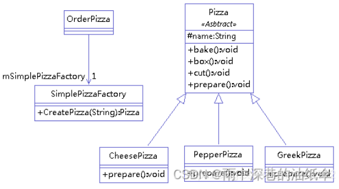
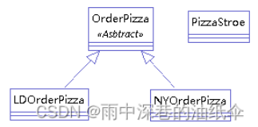
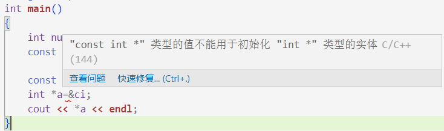
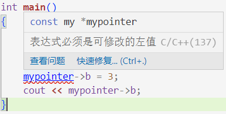

# 1.设计模式
## 前言
因大量参考Java设计模式，本节的大量代码为java
本笔记重点参考：
[23 种设计模式详解全23种by 雨中深巷的油纸伞 CSDN](https://blog.csdn.net/qq_25086397/article/details/125103647)

设计模式这一概念很可能来自于java23种程序设计模式，即Building Pattern。由于面向对象语言在设计上的共性，这些设计模式理所当然地适合各种面向对象语言，在提升开发和程序运行效率上各有千秋。

总体来说设计模式分为三大类：

创建型模式，共五种：`工厂方法模式`、`抽象工厂模式`、`单例模式`、`建造者模式`、`原型模式`。

结构型模式，共七种：`适配器模式`、`装饰器模式`、`代理模式`、`外观模式`、`桥接模式`、`组合模式`、`享元模式`。

行为型模式，共十一种：`策略模式`、`模板方法模式`、`观察者模式`、`迭代子模式`、`责任链模式`、`命令模式`、`备忘录模式`、`状态模式`、`访问者模式`、`中介者模式`、`解释器模式`。

## 创建型模式
[Java设计模式——创建型模式 by 知乎用户0I3Pz0 zhihu](https://zhuanlan.zhihu.com/p/470781323)

创建型模式考虑通过**优化对象创建过程**来优化程序。

### 单例模式
所谓单例(Singleton)，字面意思就是单个实例。**任何一个类都只会创建一次对象**，使这个对象成为**单一的实例**。

**Why？**
反复地创建和回收对象在各种Object语言中都是非常主要的开销。单例模式可以让程序仅在内存中创建一个对象，让所有需要调用的地方都共享这一单例对象。

**How？**
```java
public class Singleton {
    
    private static Singleton singleton;
    
    private Singleton(){}
    
    public static Singleton getInstance() {
        if (singleton == null) {
            singleton = new Singleton();
        }
        return singleton;
    }
}
```

单例模式是著名的、应用广泛的一种设计模式，从这个getInstance()的无处不在就能感受到。

单例模式要求只使用一个实例，关于这个实例何时加载进内存就产生了两种做法，预加载(饿汉法)和懒加载(懒汉法)
```java
public class PreloadSingleton {
       public static PreloadSingleton instance = new PreloadSingleton();
       private PreloadSingleton() {
       }; 
       public static PreloadSingleton getInstance() {
              return instance;
       }
}
```
```java
public class Singleton {
    //懒汉法
       private static Singleton instance=null;     
       private Singleton(){
       };
       public static Singleton getInstance()
       {
              if(instance==null)
              {
                     instance=new Singleton();
              }
              return instance;  
       }
}
```
**Why 预加载?**
一句话，预加载是**线程安全**的。无疑预加载的效率是较低的，由于其采用一个static成员instance，这个instance将会在程序运行之前就被加载，构造函数PreloadSingleton()也会被调用。也就是说，**纵使不被使用，预加载类实例也会被构造出来**。

首先，预加载是线程安全的。不可能有一个语句来打断预加载的getInstance()，这是因为其中只有一句话return instance，无从打断。
同时，**懒加载是非线程安全**的。如果有两个线程同时执行getInstance():
```
A:if(instance==null)//true
A:break
B:if(instance==null)//true
B:instance=new Singleton();
B:return instance()
B:other work... instance was updated
A:instance=new Singleton();
A:return instance;
//A返回了错误的新实例，而丢失了B修改后的实例
```

#### **背诵行**
规定单例效率高，不必反复创建和销毁对象
单例的预加载和懒加载，在单线程编程中使用懒加载因为开销低，用时才加载；在多线程编程中使用预加载，因为保证线程安全

### 工厂方法模式
先说说`原始工厂模式`，这是一种不被列在创建型设计模式当中的模式，是比较简单、`存在问题`的设计模式。

假设PizzaFactory可以生产芝士披萨CheesePizza，辣味披萨PepperPizza和希腊披萨GreekPizza.
PizzaFactory和三种pizza都是类，那么我们可以这样做：规定让工厂类拥有三个成员函数，分别创建三个披萨的实例，比如CreateCheesePizza()。

用户通过OrderPizza()来定披萨，只要传递一个枚举，选择Cheese,Pepper,Greek三者之一。

### Why not?
这样做的问题在于，现代设计模式的一个重要期望就是：**增加需求时永远争取新建类，而非修改原有类**

而目前这种设计方法则逼迫我们去修改工厂类，从而造成潜在的问题。
比如，现在要新盖两家新工厂，每个工厂都沿用上述流程，但是用户在点单时候要选择在哪家工厂下单。这时候我们就要去修改PizzaFactory类的内容。

与其把“哪家工厂”当成参数，不如直接变成方法。因为新增参数要求我们修改PizzaFactory类的旧代码，而将其作为方法则只需要新增一个新的方法。

### What's 工厂方法？
工厂方法模式指出，我们可以通过把几个不同地区的工厂全都改成对应的PizzaFactory类:
NewYorkPizzaFactory, PekingPizzaFactory
OrderPizza变为抽象接口。



### 原型模式
[设计模式学习笔记（原型模式） by 麻子来了 CSDN](https://blog.csdn.net/sinat_22991367/article/details/76595721)
原型模式的想法是，用clone()解决设计模式需要解决的问题。复制数据总是比新建新数据更快，在C++中体现为拷贝构造函数执行比常规赋值的构造函数更快。

当创建一个指定的对象时，
关于拷贝，有深拷贝和浅拷贝之分。浅拷贝就是引用，深拷贝则是数据副本。原型模式使用的拷贝属于深拷贝。
$\color{#FF7D00}{蓝}$ 

### 建造者模式
[java_friend 建造者模式文章](https://mp.weixin.qq.com/s?__biz=MzI4Njc5NjM1NQ==&mid=2247487258&idx=2&sn=cee8a48b247ec1fb2fb1a45396c0a04e&chksm=ebd63036dca1b920246061b0287c6f29040a338c46094c8b8eeff03ea068de03180fa48aa2b2&scene=21#wechat_redirect)

我认为建造者模式的核心思想就是流程化。使用一个名为director的类来管控过程，director拥有Builder类成员abuilder.

以建房子为例，房屋施工方housebuilder，公寓施工方apartmentbuilder和装潢施工方decorationbuilder可能都需要遵循这样的过程：
buildFloor();
buildRoof();
buildWall();

那么我们定义接口Builder，让三个具体的类都实现Builder。Builder有上述三个成员函数。之后，让director按顺序把自己的builder依次替换，从而达到轮流施工的作用。

## 总体背诵
单例模式：保证一个类仅有一个实例
工厂方法模式：**定义一个用于创建对象的接口，让子类决定实例化哪一个类。Factory Method 使一个类的实例化延迟到其子类。**

抽象工厂模式：提供一个创建一系列相关或相互依赖对象的接口，而无需指定它们具体的类。

建造者模式：有点类似流水线的

原型模式

# 2.const 
## 引入const的动机
const是大型软件设计中非常重要的一个工具，他能规定一部分程序员对于精细到一个变量的数据具有的读写权限。很多场景下需要杜绝程序员有意或无意的修改行为，这就是引入const的动机。const已经跳出了原本的constant的本意，产生了许多其他用法。
## 非面向对象的const
首先，const原本是一个针对任何变量，无论是成员变量还是非成员变量，意在让其不可修改。
### const和指针
稍稍复杂的情况是用**const修饰指针和引用**，以int型为例，可以写出这样几种指针：
1. `int * const a`;常指针，const修饰a,不允许改写a的指向
2. `const int * a`;**指常指针(pointer to const)**，不允许通过指常指针修改访问对象，但可以改写a指向其他const int。
3. `const int *const a`;指常常指针，a不仅不能修改访问对象，还不允许修改a的指向

之前我对指常指针pointer to const有一个误解：其字面意思似乎是~~只能指向常量的指针~~，但事实上，让指常指针指向非const变量也是合法的(如下)。**指常指针的意义是禁止透过这个指针修改访问对象**，而非限定指针可以指向哪些对象。
```cpp
int main()
{
    int num = 7;
    const int *a = &num;
    cout << *a << endl;//合法
}
```

### const和引用

const也可以修饰引用，类比上面，似乎也会有三类引用，但是其实不是这样的。引用只存在对常量的引用const int&，而不存在常引用int const& (这样写是非法的)，这是因为引用不是对象，我们没法让引用本身恒定不变，而只能规定引用对象本身是常量。

同指针，对常量的引用 可以引用非常量。对常量的引用只是限制不得透过这个引用去修改所引对象。

拷贝双方必须具有相同的底层const，即要么底层都是const，要么底层都不是const。一般会有非const量到const的默认转换，所以**拷贝非const量到const量**也是合法的。
所谓顶层和底层const，就是上面的指常和常指针之论：**指向常量的指针**`const int* a`修饰被指对象，这属于**底层const**,而**常指针**`int* const a`修饰指针本身，属于**顶层const**.

对于指针之外的变量，如引用和常规变量，他们的顶层和底层const意义相同。

举几个底层const不符的例子：
```cpp
int i=0;
const int ci=0;
int* const cp=&i;
int *p=cp;//错误，cp底层const，p底层非const
int &r=ci;//错误，ci底层const，r底层非const
const int &r2=i;//允许赋值非常量给常量引用
```

总结：
无论是指针还是引用，**底层const**都具有迷惑性，看似是指指向/引用常量，**实际为只读**——禁止透过这个指针/引用来访问该对象；

引用没有顶层const；常规变量没有顶层/底层const之分(尽管书写时const在前，好像是指针的底层const一样)

赋值上，允许常量=非常量  不允许非常量=常量

## 面向对象的const
### const形参
把实参传递给形参的时候，会自动忽略顶层const，

const形参只是增加一个限制——想象如果把实参传递给这个形参只是一个赋值而已，就能判断出不同的参数是否能够传递。


const形参能够形成新的重载。两个函数纵使参数表一样，倘若其中一个带有const参数而另一个没有，就会被编译器视为合法的重载：
```cpp
Record lookup(Account*);
Record lookup(const Account*);
```

const_cast 和 static_cast一样，属于显式类型转换。允许通过const_cast将一个const量强制转换成非const，从而获得改写权限。
```cpp
const char *cp;
char *p=const_cast<char*>(cp);
```

### const成员函数
const修饰成员函数，唯一的意义是修改this指针的属性。
首先，介绍一下this的功能：
```cpp
std::string getbookNo()
{
       return bookNo;
}
abook.getbookNo();
```
这样的函数，调用过程中其实是这样的：
```cpp
*this=abook;
return this->bookNo;
```

this是一个隐式的常量指针，它指向调用函数的对象。所有成员函数要想使用此实例对象的成员，相当于都使用了this。

然而，如果希望规定一个成员函数的this也是const（已经是常指针，希望增设指常指针），就需要使用这样的声明：
```cpp
std::string getbookNo()const
{
       return bookNo;
}
```
这个const只修饰this,相当于：`const Book* const this`；这样就导致了另一个现象：如果一个对象是const的(this本身已经是Book* const this)，其this指针事实上指向了一个const对象，那么此时如果想要调用一个普通成员函数：
```cpp
const Book mycstbook;
mycstbook.getbookNo();//getbookNo() is not constant
//*this=mycstbook;试图让非指常指针指向一个非常量对象，底层const矛盾
```
这里的`*this=mycstbook`就相当于：
```cpp
const int ci=1;
int *a=&ci;//错误
```
可以看到编译器的报错信息：


所以，**普通对象可以调用const成员函数，但const对象不能调用普通成员函数。**

## 一些细节
mutable关键字能够让一个变量永远不为const。可以让一个类的个别成员为mutable，这样就算这个类定义了一个const实例，这个实例内的mutable成员也是可以改变的。
然而指常指针不允许透过指针修改数据，我们来看看能不能修改mutable成员：

```cpp
class my
{
public:
    string name = "";
    mutable int a = 5;
    int b = 10;
};
using namespace std;
int main()
{
    const my amy;
    const my *mypointer = &amy;
    mypointer->a = 3;
    cout << mypointer->a;
}
```
上面的程序完全合法。我们注意到`const my* mypointer`是一个指常指针.

C++不允许透过指常指针访问被指对象；然而，这里对a成员的改写还是允许了。
**C++不允许透过指常指针访问对象，除非访问修改mutable成员**