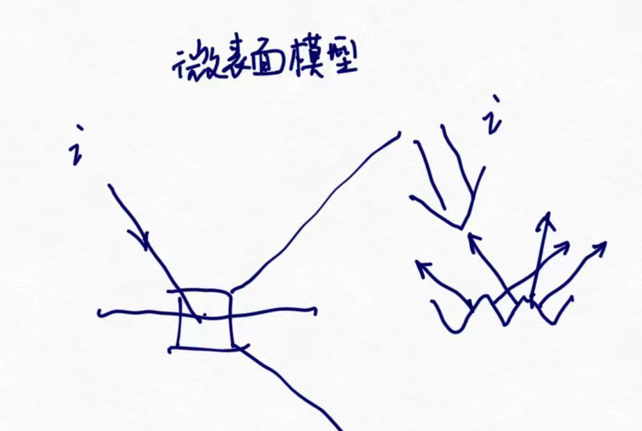

# 内容简介
本文主要基于以下资料:
[learn openGL对PBR的介绍](https://learnopengl-cn.github.io/07%20PBR/01%20Theory/)
[闫令琪老师Games202网课对于PBR的介绍](https://www.bilibili.com/video/BV1YK4y1T7yY?p=5&vd_source=be2d1feef9acea76535db5dd5a391e1a)

资料上讲的更清楚、更好，因此强烈建议看资料

# 辐射度量学知识
辐射通量：辐射通量Φ的单位是瓦特，即单位时间内光源射出的能量。
凡是光，均是不同波长的单色光的加总。对于每种单色光的能量函数进行积分，就能得到辐射通量。如图，这张图的x是单色光波长，y是单色光能量，积分得到的面积就是单位时间光的能量，也就是光源的辐射通量


波长介于390nm到700nm（纳米）的光被认为是处于可见光光谱中，也就是说它们是人眼可见的波长，因此我们只计算这部分单色光。

辐射强度：辐射强度(Radiant Intensity)表示的是在单位球面上，一个光源向每单位立体角所投送的辐射通量。举例来说，假设一个全向光源向所有方向均匀的辐射能量，辐射强度就能帮我们计算出它在一个单位面积（立体角）内的能量大小：

辐射率 Radience，用L表示：


# PBR基础理论


最终的渲染方程算式：


# PBR 直接光照实践
直接光照作为切入点是因为，直接光对于渲染方程做了一个超越维度的简化：我们可以直接把关于wi的积分脱去。
试想一下，假设在一个直接点光源场景下，实际上我们并不用对所有立体角求渲染方程各项并叠加——因为只有一个方向的wi是有光的，那就是lightDir方向。这样一来渲染方程直接退化成：

可谓恐怖如斯。
我们可以有效地将其辐射强度建模为其辐射通量: 一个常量向量`(23.47,21.31,20.79)`

# IBL 基于图像的光照实践
注：预计算在IBL当中的语义是非单一的。202中介绍的roughness-costheta纹理是一种预计算(事实上是对于镜面反射积分项进行的预计算)，而对于image的输入进行一个卷积处理也是预计算，乃至于漫反射项用黎曼求和

LOG的IBL的工作流可以切分成这样几个步骤：
step1 获取.hdr的辐照度的球面贴图，一般**等距柱状投影图Equirectangular Map**
step2 从等距柱状投影生成cubemap
step3 环境立方体贴图的卷积，生成辐照度cubemap

.hdr的辐照度球面贴图是这样的：

这种Equirectangular Map,其形态是矩形的，而信息却是球状的，且内容组织与常规的纹理有差异。在使用`stb_image.h`后，我们可以直接把这种贴图读取成我们习惯上的2D纹理。

辐照度贴图的意义在于，


# Split Sum的原理


# Prefilter
预滤波prefilter是要从原始的HDR环境贴图的输入(在我们的实际代码中，还是把HDR环境贴图从单纹理先抓成了cubemap)

于是我们引入一套预滤波HDR办法。

# 为什么预滤波用hammersley生成H而不是L
一个不看代码根本不会注意到的细节。在使用Hammersley生成了低差异序列{[xi,yi]}之后，这个序列被线性变换，x成为了航向角，y成为了天顶角，进而取出了一个球坐标，再把球坐标从切线空间转换到世界坐标，就是函数`vec3 ImportanceSampleGGX(vec2 Xi, vec3 N, float roughness)`的返回值。

问：你觉得这个重要性采样相关的方向向量，是什么向量？
直观感觉应该是采样方向，我们接下来应该用这个采样向量直接取environmentMap的值，然后采样累加再平均。
照这样说，我就应该这样写预滤波的main函数：
```
vec3 N = normalize(localPos);
const uint SAMPLE_COUNT = 1024u;
float totalWeight = 0.0;   
vec3 prefilteredColor = vec3(0.0);     
for(uint i = 0u; i < SAMPLE_COUNT; ++i)
{
    vec2 Xi = Hammersley(i, SAMPLE_COUNT);
    vec3 L  = ImportanceSampleGGX(Xi, N, roughness);
    float NdotL = max(dot(N, L), 0.0);
    prefilteredColor += texture(environmentMap, L).rgb * NdotL;
    totalWeight += NdotL;
}
prefilteredColor /= totalWeight; //对于cos做加权平均，毕竟夹角小的光路贡献大
FragColor = vec4(prefilteredColor, 1.0);
```
简直完美！打开代码查看一下是不是和我的代码不谋而合。

答：错的离谱
根据重要性采样生成的向量，并不是随后直接去采样environmentMap的光照方向L，而是**半程向量H**。于是LearnOpenGL接下来就根据N方向和H方向反推L方向，再做采样。

不过，错不在我。这部分Learn OpenGL也没有讲清楚 :)

巧的是，我在后文研究为什么LUT计算时NDF被扔掉了，那个问题没有解决，却找到一篇文章很精准地探讨了[为什么根据重要性采样生成的是半程向量H而不是采样方向L](https://bruop.github.io/ibl/)

H是什么？

H，是半程向量没错，但是在微表面模型里，H实际上是微表面的微法线，也就是LearnOpenGL一直语焉不详的`半向量`。
*在上一节教程中，我们使用球面坐标生成均匀分布在半球Ω上的采样向量，以对环境贴图进行卷积。虽然这个方法非常适用于辐照度，但对于镜面反射效果较差。镜面反射依赖于表面的粗糙度，反射光线可能比较松散，也可能比较紧密，但是一定会围绕着反射向量r，除非表面极度粗糙.*

*所有可能出射的反射光构成的形状称为镜面波瓣。随着粗糙度的增加，镜面波瓣的大小增加；随着入射光方向不同，形状会发生变化。因此，镜面波瓣的形状高度依赖于材质。 在微表面模型里给定入射光方向，则镜面波瓣指向微平面的半向量的反射方向。考虑到大多数光线最终会反射到一个基于半向量的镜面波瓣内，采样时以类似的方式选取采样向量是有意义的，因为大部分其余的向量都被浪费掉了，这个过程称为重要性采样。*
在bruop这个博客里也提到，所谓半向量，或者说`importanceSampleGGX`返回的向量，其实就是微表面法线。

在一个fragment的微表面模型里，并不是只有一个fragment normal，而是有一大批更微小的平面，他们各自都有法线H。

NDF实际上描述的是微表面法线取各个值的概率密度，实质上是一个pdf。

这也就是为什么，我们可以看到在计算重要性采样的函数中使用了roughness，并进行了一套比较奇怪的计算：
```
vec3 importanceSampleGGX(vec2 Xi, float roughness, vec3 N)
{
    float a = roughness * roughness;
    // Sample in spherical coordinates
    float phi = 2.0 * PI * Xi.x;
    float cosTheta = sqrt((1.0 - Xi.y) / (1.0 + (a * a - 1.0) * Xi.y));
    float sinTheta = sqrt(1.0 - cosTheta * cosTheta);
    // Construct tangent space vector
    vec3 H;
    H.x = sinTheta * cos(phi);
    H.y = sinTheta * sin(phi);
    H.z = cosTheta;
    //...
}
```
这个过程其实就是把法线分布函数NDF纳入考量的过程。这个点同时也能回答[下一个问题](#为什么lut计算中没有d后续使用lut也没有乘d)
Xi是简易Hammsley序列，根据bruop的说法：
*(笔者译)需要注意的是，我们不会直接对L进行采样，我们会采样微表面法线H，并用H来找到对应的L采样方向。为了做到这个，我们需要映射两个标准量e1,e2, 他们都在[0,1) 范围，映射到球坐标的天顶角和航向角。*

这其实和openGL这侧的做法是完全一致的。

# 为什么LUT计算中没有D，后续使用LUT也没有乘D？
我发现在Learn OpenGL的介绍中，整个IBL镜面反射章节的文字部分没有提到法线分布函数NDF(除了重要性采样生成采样方向的时候，提到了*我们使用 Cook-Torrance BRDF 的法线分布函数(NDF)生成采样向量及其散射强度，该函数将法线和视角方向作为输入*)
然后，在计算LUT部分，我发现我的认知和实际的代码出现了很大的冲突。
```
vec2 IntegrateBRDF(float NdotV, float roughness)
{
    vec3 V;
    V.x = sqrt(1.0 - NdotV*NdotV);
    V.y = 0.0;
    V.z = NdotV;

    float A = 0.0;
    float B = 0.0; 

    vec3 N = vec3(0.0, 0.0, 1.0);
    
    const uint SAMPLE_COUNT = 1024u;
    for(uint i = 0u; i < SAMPLE_COUNT; ++i)
    {
        // generates a sample vector that's biased towards the
        // preferred alignment direction (importance sampling).
        vec2 Xi = Hammersley(i, SAMPLE_COUNT);
        vec3 H = ImportanceSampleGGX(Xi, N, roughness);
        vec3 L = normalize(2.0 * dot(V, H) * H - V);

        float NdotL = max(L.z, 0.0);
        float NdotH = max(H.z, 0.0);
        float VdotH = max(dot(V, H), 0.0);

        if(NdotL > 0.0)
        {
            float G = GeometrySmith(N, V, L, roughness);
            float G_Vis = (G * VdotH) / (NdotH * NdotV);
            float Fc = pow(1.0 - VdotH, 5.0);

            A += (1.0 - Fc) * G_Vis;
            B += Fc * G_Vis;
        }
    }
    A /= float(SAMPLE_COUNT);
    B /= float(SAMPLE_COUNT);
    return vec2(A, B);
}
```
这个时候，根据我一步一步跟着文字介绍部分推算的结果，此时应该有：

而从代码中看，实际上是：


首先不论关于几个costheta的问题，D呢？:( D怎么没了呢？


蒙特卡洛积分的基本概念就是用重要性采样累加平均：

D，NDF，也就是法线分布函数，本身就是一个pdf函数：

关于theta和phi是如何计算出来的数学过程，[Franke-blog](https://www.tobias-franke.eu/log/2014/03/30/notes_on_importance_sampling.html)的`TROWBRIDGE-REITZ AKA GGX`部分进行了逐步推导。我们概括一下，这个theta和phi的结论是把NDF带入计算，对概率密度函数积分得出的


因此，我们重要性采样生成的H，本身就已经包含了法线分布函数项——一个采样对于整个BRDF的贡献是平衡好的。如果此时我们再往BRDF中乘一个NDF，那么出现概率更大的表面法线的贡献将被大大高估、重复计算。

再进一步的，我们可以直接从蒙特卡洛积分的IBL镜面反射项进行重新推导。

NDF去哪的问题就解决了，但是我又发现了新的问题 :(

# 为什么是F不是F0
关于这个F0问题，[这篇知乎](https://zhuanlan.zhihu.com/p/66518450)和我的计算是不谋而合的：
```
vec3 F0 = mix(vec3(0.04), albedo, metalness);
vec3 F = F_roughness(wo, normal, F0, roughness);
vec3 kS = F;
vec3 kD = (1 - metalness) * (vec3(1) - kS);

vec3 irradiance = texture(irradianceMap, norm).rgb;

vec3 diffuse = irradiance * albedo;

vec3 R = reflect(-wo, norm);
const float MAX_REFLECTION_LOD = 4.0;
// 用 R 来采样
vec3 prefilteredColor = textureLod(prefilterMap, R, roughness * MAX_REFLECTION_LOD).rgb;
vec2 scale_bias = texture(brdfLUT, vec2(max(dot(norm, wo), 0.0), roughness)).rg;
vec3 specular = prefilteredColor * (F0 * scale_bias.x + scale_bias.y);

vec3 ambient = kD * diffuse + specular;
```

# 为什么