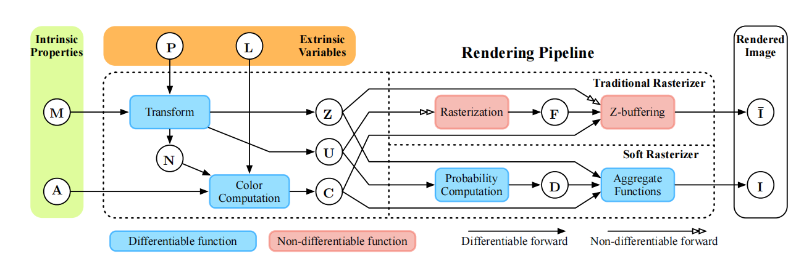
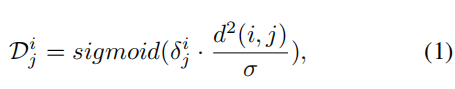
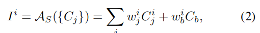
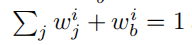
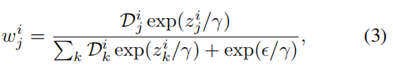

## what is differentiable rendering?
是一种逆渲染技术。渲染从三维物体（Mesh）输出二维图像，而逆渲染追求通过二维图像倒过来输出三维物体。

可微渲染是基于机器学习的、构建3D几何的一种工具。现在的可微渲染已经相当发达，能够重建反射率、几何形、照明、相机参数等等。可微渲染的两个重要技术路线(和渲染一样)是光栅化 & ray tracing, 而光栅化路线当中最重要的模型就是**SoftRas** & **nvdiffrast**.

## Why differentiable rendering?
如果有了优良的逆渲染技术，我们就可以通过一张现实中物体的照片，迅速得到物体的建模，从而大大缩短艺术家建模的机械劳动时间。应当探寻更高效、更准确的逆渲染手段。

## How to do differentiable rendering? 

## What's difficult/unsatisfied in differentiable rendering?
机器学习依赖梯度，而求梯度的对象f(x,y,z)必须具有可微性质。光栅化中有一个重要的任务就是采样，而离散的采样造成了不可微分。
论文[2]指出前人的尝试大多没有彻底解决采样造成的不可微分问题。

## SoftRas
In particular, standard mesh renderer involves a discrete sampling operation, called rasterization, which prevents the gradient to be
flowed into the mesh vertices.**特别的，标准的Mesh renderer涉及到离散的采样操作(或称为光栅化)，这使得梯度无法流入每一个Mesh顶点。**

精讲此图：

**Input**
M：Mesh
A：Colors
P：Camera
L：Lights
**Intermediate**
N：Mesh normal
Z：Depth
U：image-space coordinate(UV)
C: Color
F: Rasterization result

We take a different perspective that the rasterization can be viewed as **binary masking** that is determined by the relative positions between the pixels and triangles, while z-buffering merges the rasterization results F in a pixel-wise one-hot manner based on the relative depths of triangles. 我们选择了一种不同的角度，把光栅化过程视为二进制遮罩，这种遮罩由像素和三角形的相对位置决定，而z-buffer将光栅化结果F基于三角形的相对深度以一种像素级的单点方式合并。

引入两个terms。
### probability map D
`Map D={Dj}`表示每个像素处在三角形fj内部的可能性。
函数`A()`或者`Aggregate()`基于{Dj}和三角形之间的相对深度，融合每个三角形的颜色。
这样做之后，camera，texture，material，lighting，geometry统统都可以从图像中求梯度了。

对于一个像素，要知晓其在一个三角形当中的可能性，设计了如下算式：
Dj：可能性map，用于映射三角形fj对于图像的影响
σ：标量参，用于控制可能性变化的sharpness，这里默认设置10^-4
δ：δij是一个逻辑符号，如果i像素在j三角形内，取+1，否则取-1
dij:点i到三角形fj的欧氏距离，点到直线距离。

### Aggregate Function A()
对于每个三角形fj，在每个像素pi位置通过顶点颜色插值定义其颜色矩阵Cj(就像我们C++rasterizer程序中一样的做法)。把重心坐标裁剪到[0,1]区间，归一化。
下面的式子中：
Ii：像素pi的聚合结果，也就是renderer output
Cji：对fj，插值得到的pi的颜色
Cb：背景颜色

wji：权值，满足：

zji：在三角形fj中

### 关键词解释
forward rendering:指的是从Mesh到2d image的渲染过程
backward rendering:指的是根据2d image重构Mesh乃至Texture的渲染过程

## 文献
[Differentiable Monte Carlo Ray Tracing through Edge Sampling](https://click.endnote.com/viewer?doi=10.1145%2F3272127.3275109&token=WzM2ODQ2MjYsIjEwLjExNDUvMzI3MjEyNy4zMjc1MTA5Il0.JrrTvvCwxgqGQRo2ozlaTdnCrD8)是使用光追做的逆渲染的大成之作。我们研究光栅化方案，故不作讨论。

[Soft Rasterizer: A Differentiable Renderer for Image-Based 3D Reasoning](https://ieeexplore.ieee.org/document/9008817)是提出`SoftRas`的原文。

## What's 

## 梳理现有工作

1.在做C++ 的软渲染光栅器。能够完成MVP乃至视口变换，实现了几个简单的shader(normal，texture，phong，mipmap)
bilinear发生在纹素大像素小的时候， 此时像素中心落在纹素里，可以用附近的四个纹素去横纵插值得出当前像素的feature
bicubic指的是运用了mipmap之后的情况。

2.学习Unity&3dsMax制作模型，尝试学习动画
Unity 通过AnimatorController控制动画，AC是一个对象的组件，能够控制这一组件的运动。AC中有许多的状态State，每个状态又有绑定的MotionClip，这个Clip动画剪辑就是Unity控制动画的基本单元。
在AC的状态机中编写状态转移条件，并且在每个状态之上绑定脚本，就能用脚本编写逻辑控制人物的运动了。

3.