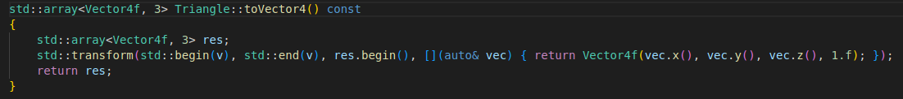
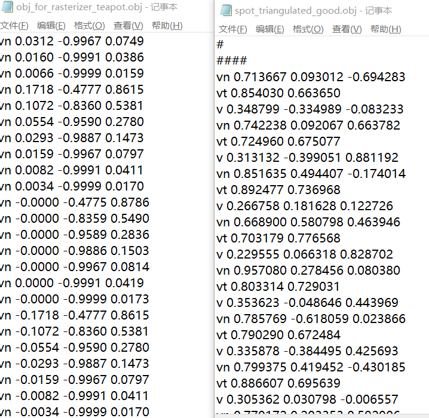
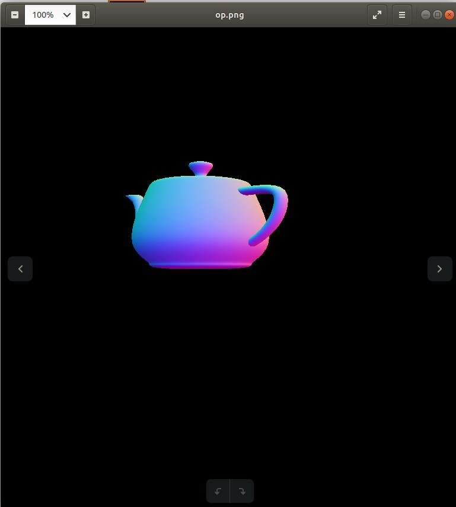

# 建模软件 & 引擎 &  光栅器导入导出交互和一些问题
## 前言
本笔记记录了我对如题三类软件中如何**交换资产**的探索。我们知道在游戏开发实际过程当中，艺术家呈递游戏物体的模型、纹理、动画等内容，这些内容将被导入到引擎里供进一步使用。

上述的三类软件，我使用的是：
建模软件(动画制作)：3dsMax
引擎： Unity
光栅器：opencv支持的渲染程序

其中提及光栅器是因为同时也在调试Games101网课的光栅器程序，其能够从一个相对底层的角度进行各种技术的底层尝试，因此如果能打通这个资产传递的三角，将会是一件非常有意义的事情。

## 3dsMax->Unity
我在3dsMax中做了一个小球下落的动画。

动画是游戏中最常用的一类资产之一。在企业工作流中，动画**从3dsMax等动画制作软件流向引擎**。
可以看到下图中各种导出格式。


回顾我们在Unity学习过程中使用的资产。这部分对应的工作在写作UnityAnimation.md当中。
[github - 我的UnityAnimation笔记](https://github.com/quaintSenator/All_note/UnityAnimation.md)


这里的人物静止、跳跃、跑步都是在UAS上获取的动画资源，这里以`.FBX`为后缀。

注意到，3dsMax的第一个导出选项就是`*.fbx`，然而两者的显著差距在于大小写。
我们直接按照一切默认配置export这个对象。


在Unity中`Assets`里选择`Import New Asset...`，选择之前生成的fbx文件后，在Assets文件夹中出现了如下资产：


参照我们在`UnityAnimation.md`当中记录的操作，把资产中的小球拖到场景里、将AnimationContoller绑定到小球上，而AC中的Clips是默认绑定好的，之后就可以运行看到效果了。

但是在运行时，这个动画的效果是不正确的。我们在3dsMax中设计的是按轨迹跳动直到不动的一个过程，而在Unity里小球仅弹跳一次，而后在直线上匀速移动。而且直接双击import设置以3d查看器查看的动画，这个动画几乎很难看出小球的高度衰减。

我重新export了一个3dsMax默认的茶壶，首先对于简单几何体fbx是完全可以一键import不出错的。之后我重新用自动生成关键帧生成了一个拖动茶壶并倒茶的动画。这次这个动画可以在3d查看器里正常播放。

这次Unity的动画显示也正常了。总结一下之前的问题：
获取import资产后，点击右侧小箭头展开其内容。一般的资产都至少会有一个Mesh和一个Clip。把Mesh拖到场景中，新建一个AC，那个Clip拖动到状态机页面，这会形成一个新的state。把这个state 连线到自身。而后，再把AC拖动到场景里的Mesh物体上，完成了全部的绑定。
**必须注意：**
*不要拖动import setting进入场景*

再重新制作一个之前的小球受阻力弹起运动的动画。这一次，可能是由于用到了父物体虚拟物体dummy，资产列表内是四个对象：

- import setting
- teapot001 
- teapot001(mesh)
- take001(clip)

其实下面的clip预览也可以看到，其实引入的动画是完全正确的。

这里的做法是这样的：
不要拖动Mesh，而是拖动Teapot001对象进入场景。这样做会在场景内形成一个父子对象：

之后将clip直接拖动到**父对象**上。（这会自动地生成一个AC，作为连接对象到动作的中介，相当于创建一个AC，设定一个clip对应状态，并将AC绑定到对象上）至此就可以在gameplay中看到正确的动画效果了。

概括：
1. **把资产中的对象/Mesh拖进场景。有对象时选择对象，否则选择Mesh。不要选择import setting。**
2. **直接把clip拖到scene当中的对象上。**

## 3dsMax->光栅器程序
首先我们来调研一下读取到的模型数据是什么样的。

从提取代码来看，`loader.LoadFile()`的参数是一个`*.obj`文件,有构成成员Loader.LoadedMeshes，这是一个顺序容器/数组，其中每个成员都被迭代器Mesh对应，而Mesh又有成员Vertices。

```
Vertices[0].Position.X
Vertices[0].Position.Y
Vertices[0].Position.Z
Vertices[0].Normal.X
Vertices[0].Normal.Y
Vertices[0].Normal.Z
Vertices[0].TextureCoordinate.X
Vertices[0].TextureCoordinate.Y
Vertices[0].TextureCoordinate.Z

Vertices[1]...
```
这个结构与我们在程序里设计的Triangle结构很像，而Triangle里还多一个`Vector3f color`

这段程序把Mesh当中的Vertices全部串联成三角形了。可以研究一下这段代码的逻辑：
```cpp
for(auto mesh : Loader.LoaderMeshes){
    for(int i=0;i<mesh.Vertices.size();i+=3){
        Triangle *t=new Triangle();
        for(int j=0;j<3;j++){
            t->setVertex(j,Vector4f(mesh.Vertices[i+j].Position.X,mesh.Vertices[i+j].Position.Y,mesh.Vertices[i+j].Position.Z,1.0));
            t->setNormal(j,Vector3f(Mesh.Vertices[i+j].Normal.X,Mesh.Vertices[i+j].Normal.Y,Mesh.Vertices[i+j].Normal.Z));
            t->setTexCoord(j,Vector2f(Mesh.Vertices[i+j].TexCoordinate.X,Mesh.Vertices[i+j].TexCoordinate.Y))
        }
        TriangleList.push_back(t);
    }
}
```
可以看出，Mesh.Vertices是一个充满了重复顶点的顶点数据集。
三角形和三角形之间是会有大量重复出现的顶点的，而在这个遍历过程中，我们可以看到i+j是只增不减的。进而言之，Mesh.Vertices的内容可能是：
```
V[0],V[1],V[2],
V[1],V[2],V[3],
V[4],V[5],V[6],
V[6],V[7],V[8],
...
```
需要注意，在Load完成之后，TriangleList当中的各个三角形顶点里的颜色数据都没有进行初始化。这里扯几句题外话。我们回顾一下几个shader，可以发现，texture_shader当中没有用到顶点颜色（这里也提示了一个问题，我编写的`rasterizer.cpp`在`rasterize_triangle()`中会无差别插值顶点各数值，包括顶点颜色，基本可以预料在texture模式下是0插0了）；phong_shader中，使用了payload当中的payload.color：
```cpp
Eigen::Vector3f kd=payload.color;//漫反射系数
```
这个数值是对像素所在三角形重心插值得来，但是我们知道三角形顶点的颜色其实是脏数据。

除了保存Mesh数据的`*.obj`文件，肯定还要以一种形式保存物体的颜色，无论是通过顶点颜色的模式还是纹理。我们看到后面几行：

```cpp
//...
std::string obj_path="../models/spots/"
auto texture_path="hmap.jpg"
r.set_texture(Texture(obj_path+texture_path));
```

也就是说，在这段光栅化程序里，我们读取的是`*.obj`格式的网格与 `*.jpg`格式的纹理数据。

首先我们来到3dsMax当中，看看export选项中有没有`*.obj`格式。

gw:OBJ-Exporter(*.obj)

那么这次我们做一个模型，在导出时把动画数据放弃掉，看看能得到什么。

我在3dsMax里拉了个茶壶，然后直接导出，选择obj导出项。


可以看到，这个输出当中是有一些四边形的。我立刻思考这样会不会造成什么后果。
我修改了loader文件名字符串，然后直接用phong模型运行。

报错。

我打开了3dsMax导出的`*.obj`文件。
```
#
# object Teapot001
#
...
v  12.7088 23.6493 -14.6701
v  12.4329 23.6493 -11.8593
v  -1.0867 24.5587 -0.9959
v  -1.0867 24.6193 -0.8439
v  -1.0867 24.5587 -0.6341
v  -1.0867 24.3768 -0.3897
v  -1.0867 24.0737 -0.1337
v  -1.0867 23.6493 0.1107
v  -4.1521 23.6493 -1.1506
v  -4.0355 24.0737 -1.3071
v  -3.9657 24.3768 -1.3392
...
vn -0.8494 0.4075 -0.3354
vn -0.7375 0.5589 -0.3791
vn -0.5768 0.7127 -0.3993
vn -0.4578 0.8196 0.3446
vn -0.5118 0.8591 0.0000
vn -0.3598 0.8896 0.2814
vn -0.4040 0.9148 0.0000
vn -0.2313 0.9554 0.1833
vn -0.2619 0.9651 0.0000
...
vt 0.8750 0.5500 0.0000
vt 0.8750 0.4750 0.0000
vt 0.8750 0.4000 0.0000
vt 0.7500 0.9250 0.0000
vt 0.7500 0.8500 0.0000
vt 0.7500 0.7750 0.0000
vt 0.7500 0.7000 0.0000
vt 0.7500 0.6250 0.0000
...
# 1034 texture coords

o Teapot001
g Teapot001
usemtl wire_198225087
s 2
f 1/1/1 2/2/2 3/3/3 4/4/4 
f 4/4/4 3/3/3 5/5/5 6/6/6 
f 6/6/6 5/5/5 7/7/7 8/8/8 
f 8/8/8 7/7/7 9/9/9 10/10/10 
f 10/10/10 9/9/9 11/11/11 12/12/12 
f 12/12/12 11/11/11 13/13/13 14/14/14 
f 14/14/14 13/13/13 15/15/15 16/16/16 
f 16/16/16 15/15/15 17/17/17 18/18/18 
f 2/2/2 19/19/19 20/20/20 3/3/3 
f 3/3/3 20/20/20 21/21/21 5/5/5 
f 5/5/5 21/21/21 22/22/22 7/7/7 
...
# 1984 polygons - 64 triangles
```

然后我又打开了我们原有的奶牛obj文件：

```
####
#
# OBJ File Generated by Meshlab
#
####
# Object spot_triangulated_good.obj
#
# Vertices: 3225
# Faces: 5856
#
####
vn 0.713667 0.093012 -0.694283
vt 0.854030 0.663650
v 0.348799 -0.334989 -0.083233
vn 0.742238 0.092067 0.663782
vt 0.724960 0.675077
v 0.313132 -0.399051 0.881192
vn 0.851635 0.494407 -0.174014
vt 0.892477 0.736968
...
vn 0.000000 0.299985 0.953944
vt 0.440532 0.261649
v 0.000000 -0.068825 1.048070
vn 0.000000 -0.945497 -0.325630
vt 0.476605 0.325877
v 0.000000 -0.095219 1.026420
# 3225 vertices, 0 vertices normals


f 739/739/739 735/735/735 736/736/736
f 189/189/189 736/736/736 735/735/735
f 192/192/192 738/738/738 737/737/737
f 739/739/739 737/737/737 738/738/738
f 190/190/190 741/741/741 740/740/740
f 743/743/743 740/740/740 741/741/741
f 736/736/736 189/189/189 743/743/743
f 742/742/742 743/743/743 189/189/189
f 745/745/745 747/747/747 191/191/191
f 744/744/744 191/191/191 747/747/747
f 746/746/746 747/747/747 190/190/190
f 741/741/741 190/190/190 747/747/747
...
# 5856 faces, 0 coords texture

# End of File
```

不可否认的是，这两侧的数据格式其实几乎是一样的，只不过在奶牛模型中，vn，vt和v三个数据被整合成一个组，一组一组地呈现，而新模型中则是分开罗列所有的vn，vt和v。

在我溯源LoadFile函数后，我发现事情变得复杂了起来。原作者实在是在OBJ_Loader.h当中写了太多的东西，整个文件来到了1000多行。我随即想到，与其去卒读这个令人头疼的代码，不如自己复习一下C++文件的知识，自己重写一个更短的Loader——毕竟这边obj的内容都已经一清二楚了。

### C++文件读取函数

简单写了一个C++文件读取程序。在整个过程中我们并不需要去修改提供的任何数据————光栅器程序是一个完全的读取-输出者，而不是改写者。

将中间的流处理语句改成一段字符串处理代码，即可完成对Mesh中vn，vt，v的抓取，他们的现实意义分别是法线normal，uv值和顶点坐标。


```cpp
//loader0.0

#include <fstream>
#include <iostream>
#include <sstream>
#include <vector>
using namespace std;

struct Vector3
{
    float x;
    float y;
    float z;
};
struct Vector2
{
    float x;
    float y;
};

template <class Type>
Type stringToNum(const string &str)
{
    istringstream iss(str);
    Type num;
    iss >> num;
    return num;
}
int main()
{

    ifstream input;
    input.open("./obj_for_rasterizer_teapot.obj", ios::in);
    string sentence, word;
    string title;
    vector<Vector3> allV;
    vector<Vector3> allVN;
    vector<Vector3> allVT;
    int i = 0;
    if (input.is_open())
    {
        while (getline(input, sentence))
        {
            // In a line
            istringstream is(sentence);
            Vector3 v3;
            is >> title;
            if (title == "#")
                continue;

            if (title == "v" || title == "vn" || title == "vt")
            {
                is >> word;
                v3.x = stringToNum<float>(word);
                is >> word;
                v3.y = stringToNum<float>(word);
                is >> word;
                v3.z = stringToNum<float>(word);
            }
            else
                break;

            if (title == "v")
            {
                allV.push_back(v3);
            }
            if (title == "vn")
            {
                allVN.push_back(v3);
            }
            if (title == "vt")
            {
                allVT.push_back(v3);
            }
        }
    }
    input.close();
    for (auto i : allV)
    {
        cout << "v:" << endl;
        cout << i.x << endl;
        cout << i.y << endl;
        cout << i.z << endl;
    }

    for (auto i : allVN)
    {
        cout << "vn:" << endl;
        cout << i.x << endl;
        cout << i.y << endl;
        cout << i.z << endl;
    }
    for (auto i : allVT)
    {
        cout << "vt:" << endl;
        cout << i.x << endl;
        cout << i.y << endl;
        cout << i.z << endl;
    }
}
```

这个程序比较笨，但是已经能满足初步的读取要求了。

在这个时候，我们回来关注一下这个茶壶obj的数据内容。
其共有2081行顶点， 2082行normal，1035行uv，4096行face。我这才反应过来，无怪源程序他这个loader这么大。这个loader很重要的一个任务是根据face中的索引对应出三角形。我立刻开始担心，如果像我这样暴力地用一个Mesh存放了整个文档，是否在后续会造成性能问题。

f一行为一个face，而其中有三个三元组，共计9个索引值。这些索引没有超过2081的值，显然是2081个顶点的索引。然而三个顶点的索引就可以确定一个三角形了，为什么face要以三个三角形为一行呢？而且其中还常出现1/1/1 2/2/2 这样的内容。这无疑有些令人费解。
```
f：表示一个面，由三个v/vt/vn的索引形式组成。
比如obj文件中f 5/15/7 4/14/6 6/16/8 ，
表示由第5、第4、第6这三个顶点组成了一个三角平面,
平面的纹理由第15、第14、第16这三个纹理坐标形成，
这个平面的朝向是第7、第6、第8这三个顶点的法向量求平均值。
```
ref : [CSDN博主「xiongzai2016」obj文件中v、vt、vn、f这四个参数的含义](https://blog.csdn.net/xiongzai2016/article/details/108052800)

这下明朗了，我立刻开始动手修改代码。
#### 问题程序1.1
`main.cpp`

`OBJ_Loader.h`
```cpp
#include <fstream>
#include <iostream>
#include <sstream>
#include <vector>
using namespace std;
struct MVector3
{
    float x;
    float y;
    float z;
};
struct MVector2
{
    float x;
    float y;
};
struct MMesh
{
    std::vector<MVector3> allV;
    std::vector<MVector3> allVN;
    std::vector<MVector3> allVT;
};
typedef vector<vector<MVector3>> ref;
float stringToNum(const string &str)
{
    istringstream iss(str);
    float num;
    iss >> num;
    return num;
}
int stringToNumI(const string &str)
{
    istringstream iss(str);
    int num;
    iss >> num;
    return num;
}
void cutFaceArr(string word, int &id1, int &id2, int &id3)
{
    int firstcut = 0, secondcut = 0;
    int cuttime = 0;
    for (int i = 0; i < word.size(); i++)
    {
        if (word[i] == '/')
        {
            if (cuttime == 0)
            {
                firstcut = i;
                cuttime++;
            }
            else
            {
                secondcut = i;
                break;
            }
        }
    }
    id1 = stringToNumI(word.substr(0, firstcut - 1));
    id2 = stringToNumI(word.substr(firstcut + 1, secondcut - 1));
    id3 = stringToNumI(word.substr(secondcut + 1, word.size() - 1));
}
bool Myloader(string filename, MMesh &mesh, vector<vector<MVector3>> &refer)
{
    ifstream input;
    string sentence, word;
    string title;
    input.open(filename.c_str(), ios::in);
    if (input.is_open())
    {
        while (getline(input, sentence))
        {
            // In a line
            istringstream is(sentence);
            MVector3 v3;
            is >> title;
            if (title == "#")
                continue;
            if (title == "v" || title == "vn" || title == "vt")
            {
                is >> word;
                v3.x = stringToNum(word);
                is >> word;
                v3.y = stringToNum(word);
                is >> word;
                v3.z = stringToNum(word);
            }
            else
            {
                if (title == "f")
                {
                    vector<MVector3> curRefLine;
                    for (int i = 0; i < 3; i++)
                    {

                        is >> word;
                        int id1, id2, id3;
                        cutFaceArr(word, id1, id2, id3);
                        v3.x = id1;
                        v3.y = id2;
                        v3.z = id3;
                        curRefLine.push_back(v3);
                    }
                    refer.push_back(curRefLine);
                }
                else
                    continue;
            }

            if (title == "v")
            {
                mesh.allV.push_back(v3);
            }
            if (title == "vn")
            {
                mesh.allVN.push_back(v3);
            }
            if (title == "vt")
            {
                mesh.allVT.push_back(v3);
            }
        }
        return true;
    }
    else
    {
        cout << "Error!Cannot open file:" << filename << endl;
        return false;
    }
    input.close();
}
```

运行后程序进入长停顿。本来调通了文件open无法打开bug就已经花了很长时间，到这里工作有再次陷入僵局。

从外向内进行抓取。我首先在``MyLoader()``执行完成后print一下，看一看卡死发生在哪个区域。
MyLoader能够正常运行跳出，且花的时间短的几乎无法感知。这说明我们的读取器性能并不是一个糟糕到无法忍受的状态。那么我的猜测是，这个问题很有可能是那段过于长的数组寻址计算造成的。

我发现了一个问题。f的索引是从1~2082的，虽然顶点V确实有2082个，但是这里在容器中显然对应了0~2081。不加修改，则一定会发生数组越界，造成无法预料的后果。
我修改了索引值为全部-1依然出不来，我随后抓取了ref当中数据做了实验，又发现奇怪的现象：


这一看就是cut的时候字符串没处理好，把一位数字给掐掉了。气死了，居然还犯这种低级错误。

这个问题改好了之后，程序read之前的奶牛模型都已经能正常输出了，可是对于茶壶模型一而再地报错segment fault。
我分别查证了TriangleList当中的各项数据，他们都是完好的。哪怕数据出现一定的问题，我想着无非是显示结果比较抽象，但不至于段报错啊。
我在程序中按照调用顺序一处一处地插入print，可以确定段错误发生于`rasterize_triangle`当中，而且第一次调用`rasterize_triangle()`就会段错误，因为在`rasterize_triangle`紧邻后print一下，不会有一次输出。

（我愿称这种一句一句插print的debug方法为**电笔法**，其宛若电工用电笔找断路位置）

这说明，在第一个三角形绘制的途中发生了段错误，但是有很多像素已经成功绘制没有出错，问题发生在某一个像素上。


这已经把问题标注地比较清楚了。i，j的边界似乎是出现问题了，因为我们原计划的ij对应了每一个屏幕像素，不应该出现-17041这样的数值。

auto k:v 下的k的x和y值就是-17041，21811等大数字，这是问题的根源。



真的后悔为什么最一开始不检查一下两个obj文件的数据有什么异同。在之前的奶牛obj中，除了排列成v vt vn三行一组之外，还有一个重要的不同：在奶牛obj，数字都是浮点；而在导出的茶壶当中，大多坐标达到了10数量级。



这是我不太理解的，作为mesh，输入的时候一些点为(10,40,10)不是很正常的事情吗
搜到一些博客，介绍类似的项目，他们的3ds 导出obj似乎就是v为小数。
我们回到3dsMax的导出程序：


我们可以看到这里的高级选项-单位上，如果点选自动，**场景单位**将会转化为英寸，此时的比例因子是1；而如果设定为米，则比例因子降到了0.0254

在obj导出文件里没有这些设定，比较简陋(可能是因为obj导出确实已经不再流行)

我们照样使用这个0.0254作为比例，就能成功统一两个模型的差异。
这样输出之后的所有顶点坐标也都变成了小数，我们就可以放进程序里跑了：



### 代码总结

至此，这部分工作已经从 探究如何**输入任意model给rasterizer程序并输出渲染结果**变成了**自编 C++ obj 阅读器**，最后又研究和复习了obj文件读取到loader，进而查找f索引，一一读取到TriangleList的全过程。


## 排坑总结
### 场景单位
**场景单位**是一个重要的导出设置。Unity和3dsMax彼此能够完成匹配，而使用古早时期obj的光栅器程序需要使用一个数值较小的，也就是以米为单位的场景。为导出设置乘上0.0254，可以将英寸单位场景换算进米单位场景。

### Unity拖入Scene的正确对象
不要拖动Mesh，而是拖动整个对象进入场景。但更不要将import setting拖入，尽管这样做被允许了。