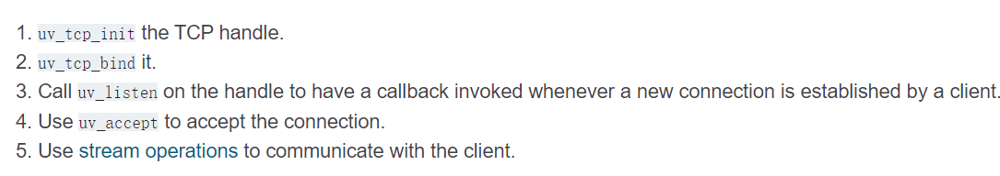

libuv中最重要的几个概念：
Handle，句柄，是对长生命周期的物体的一种抽象。游戏客户端上的网络模块不断地读写，这种句柄是最典型的。句柄之上的异步操作被抽象成Requests，请求。与句柄相反，请求是短生命周期的。

五步走的libuv

```cpp
void try_connect_server() {
    sockaddr_in addr;
    uv_connect_t *connect = nullptr;
    uv_tcp_t* client = nullptr;

    if (g_connect_state == CONNECT_STATE_NONE) {
        client = (uv_tcp_t*)malloc(sizeof(uv_tcp_t));
        uv_tcp_init(g_loop, client);

        uv_ip4_addr("127.0.0.1", 8086, &addr);
        //uv_tcp_bind(client, (const struct sockaddr*)&addr, 0);

        connect = (uv_connect_t*)malloc(sizeof(uv_connect_t));
        if (0 != uv_tcp_connect(connect, client, (sockaddr*)&addr, on_connected)) {
            uv_close((uv_handle_t*)client, NULL);
            goto Exit0;
        }
        else {
            g_client = client;
            connect = nullptr;
            client = nullptr;
            g_connect_state = CONNECT_STATE_CONNECTING;
        }
    }
Exit0:
    if (client) {
        free(client);
        client = nullptr;
    }
    if (connect) {
        free(connect);
        connect = nullptr;
    }
}
```