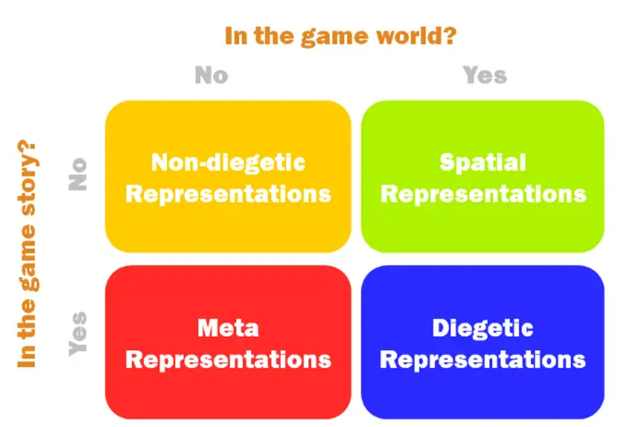
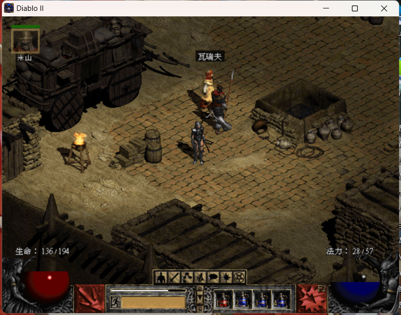

# 游戏UI 和 Unity UI
## UI Intro
[ShoKill 哪些游戏有着漂亮的UI](https://www.zhihu.com/question/29538229/answer/117468470)
游戏UI可以分为这四大类。

其中的Diegetic可以被翻译为叙事的、交互的。我们从最简单的、认知中的UI举例，比如我的游戏启蒙之一，DiabloII为例。

生命值、法力值，以及一些菜单项的图标。这种UI是否绘制在游戏世界内?答案是否。他们绘制在游戏世界之外，绘制在玩家的电脑屏幕上。那么这个UI是否出现在游戏故事中，或者是游戏进行的过程中？答案也是否，这是我们认为最原始、事实上也最广泛普遍的UI，也就是Non-Diegetic UI. 这种东西一般也被称为HUD，也是我们即将要尝试做的UI。

BTW, 暗黑2是多么超前、有趣而让人百玩不厌的游戏！这又再一次提醒了我们游戏人：不要陷入追求技术而忘却了游戏本身乐趣的歧途。

## 从 0 开始实现一个UGUI HUD
[UGUI老文档](https://docs.unity.cn/Packages/com.unity.ugui@1.0/manual/UIBasicLayout.html)
