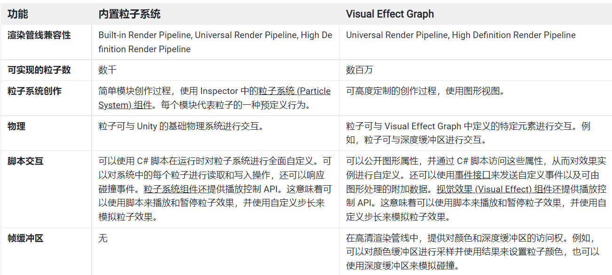
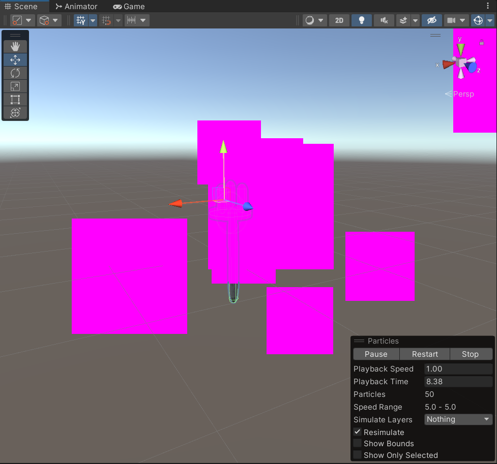

# 粒子系统
## 前言
在22年2月，我最开始准备游戏开发技术岗位面试的时候，有一些令人觉得很害怕的词汇就给我留下了深刻印象。粒子系统无疑是其中之一。简单了解之后，我发觉要想在程序控制下用若干个微小粒子模拟火、烟、雾等各种现象，简直是难以想象的事情。加之工期很赶，我对于粒子系统的观感一直是恐惧为主。

而后来，放弃了22年暑期实习后，我开始有时间琢磨这些尚未学清楚的技术。我才发现这些技术点从令人恐惧变成了令人向往和激动。

在刷面试题的时候，似乎是西山居出过一道题，如何绘制樱花散落的场景。现在想起来觉得樱花散落似乎并不是特别难的粒子系统案例。

本文跟随我学习粒子系统实现方案的过程，探讨在Unity项目中使用粒子系统的可能。以模拟出火、烟、雾等效果为追求对象。

## Unity粒子系统的两个方案

包括内置粒子系统 & VEG(Visual Effect Graph)

## 内置粒子系统
Unity的内置粒子系统被整合到组件Particle System(后称PTS)当中。
我拉了一个组件给之前捏的灯柱预制件。default的PTS向外抛洒大量的粉色方块，有点`MineCraft`的感觉

以下是pts在inspector中的各种属性，取自[UnityDoc](https://docs.unity.cn/cn/current/Manual/PartSysMainModule.html)

|属性|	功能|
|--|--|
|Duration|	系统运行的时间长度|
|Looping|	如果启用此属性，系统将在其持续时间结束时再次启动并继续重复该循环。|
|Prewarm|	如果启用此属性，系统将初始化，就像已经完成一个完整周期一样（仅当 Looping 也启用时才有效）。|
Start Delay|	启用此属性后，系统开始发射前将延迟一段时间（以秒为单位）。|
Start Lifetime|	粒子的初始生命周期。|
Start Speed|	每个粒子在适当方向的初始速度。|
3D Start Size|	如果要分别控制每个轴的大小，请启用此属性。|
Start Size|	每个粒子的初始大小。|
3D Start Rotation|	如果要分别控制每个轴的旋转，请启用此属性。|
Start Rotation|	每个粒子的初始旋转角度。|
Flip Rotation	|使一些粒子以相反的方向旋转。|
Start Color	|每个粒子的初始颜色。|
Gravity Modifier|	缩放 Physics 窗口中设置的重力值。值为零会关闭重力。|
Simulation Space|	控制粒子的运动位置是在父对象的局部空间中（因此与父对象一起|移动）、在世界空间中还是相对于自定义对象（与您选择的自定义对象一起移动）。|
Simulation Speed|	调整整个系统更新的速度。|
Delta Time|	在 Scaled 和 Unscaled 之间进行选择，其中的 Scaled 使用 Time 窗口中的 Time Scale 值，而 Unscaled 将忽略该值。此属性对于出现在暂停菜单 (Pause Menu) 上的粒子系统非常有用。|
Scaling Mode|	选择如何使用变换中的缩放。设置为 Hierarchy、Local 或 Shape。Local 仅应用粒子系统变换缩放，忽略任何父级。Shape 模式将缩放应用于粒子起始位置，但不影响粒子大小。|
Play on Awake	|如果启用此属性，则粒子系统会在创建对象时自动启动。|
|从此向下开始为布尔选项|--|
Emitter Velocity|	Choose how the Particle System calculates the velocity used by the Inherit Velocity and Emission modules. The system can calculate the velocity using a Rigidbody component, if one exists, or by tracking the movement of the Transform component. If no Rigidbody component exists, the system uses its Transform component by default.|
Max Particles|	系统中同时允许的最多粒子数。如果达到限制，则移除一些粒子。|
Auto Random Seed|	如果启用此属性，则每次播放时粒子系统看起来都会不同。设置为 false 时，每次播放时系统都完全相同。|
Random Seed|	禁用自动随机种子时，此值用于创建唯一的可重复效果。|
Stop Action|	当属于系统的所有粒子都已完成时，可使系统执行某种操作。当一个系统的所有粒子都已死亡，并且系统存活时间已超过 Duration 设定的值时，判定该系统已停止。对于循环系统，只有在通过脚本停止系统时才会发生这种情况。|
Disable|	禁用游戏对象。|
Destroy|	销毁游戏对象。|
Callback|	将 OnParticleSystemStopped 回调发送给附加到游戏对象的任何脚本。|
Culling Mode|	选择粒子在屏幕外时是否暂停粒子系统模拟。在屏幕外时进行剔除具有最高效率，但您可能希望继续进行非一次性 (off-one) 效果的模拟。|
Automatic|	循环系统使用 Pause__，而所有其他系统使用 Always Simulate。 |
 |    Pause And Catch-up | 系统在屏幕外时停止模拟。当重新进入视图时，模拟会执行一大步以到达在不暂停的情况下可实现的程度。在复杂系统中，此选项可能会导致性能尖峰。 |
  |    Pause | 系统在屏幕外时停止模拟。 | 
  |    Always Simulate | 无论是否在屏幕上，系统始终处理每个帧的模拟。这对于烟花等一次性效果（在模拟过程中这些效果很明显）非常有用。 |
   | Ring Buffer Mode__|	保持粒子存活直到它们达到 Max Particles 计数，此时新粒子会取代最早的粒子，而不是在它们的寿命终结时才删除粒子。
Disabled|	禁用 Ring Buffer Mode__，以便系统在粒子生命周期终结时删除粒子。 | 
|    Pause Until Replaced | 在粒子生命周期结束时暂停旧粒子，直至达到 Max Particle__ 限制，此时系统会进行粒子再循环，因此旧粒子会重新显示为新粒子。|
|Loop Until Replaced|	在粒子生命周期结束时，粒子将倒回到其生命周期的指定比例，直至达到 Max Particle 限制，此时系统会进行粒子再循环，因此旧粒子会重新显示为新粒子。|

### 不满
看到这样的效果显然是让人觉得很糟糕的。直接去呈现这样的视觉效果在今天无疑是一种不负责任的行为。

- 1.有没有可能把单色的粒子转化成本身具有光效的火光光球？
- 2.有没有可能把方块改成边缘模糊的粒子？