# CH3 Raster Images
## gamma值

屏幕上每一个像素都由绿、红、蓝三色的微小灯管组成。这三个灯管的亮度不可能是线性的，而应当是离散的——比如我们很难要求灯管亮度正好是0.3754,很有可能其只能显示到0.25或者0.5，其最精确也只能显示0.5的亮度。伽马值就用于描述这种亮度的精密性或者自由性(事实上gamma值的产生源于与人眼对于光强的感知和灯管功率之间存在的函数关系)。

**`灯管光强=最大光强Xα^γ`**

其中α就是通道值，也就是灯管的输入——灯管将会根据这个输入决定自己有多亮，主要是通过调整功率来做到。
比如我们希望展露一个R=0.5的颜色，而我们的灯管伽马值是2，那么展示出的光强将会是0.25倍的最大光强。

伽马值是一种近似计算，对于屏幕显示设备的伽马值估算并不需要一个特别高的精准度。一般我们通过上述公式，只要先调试屏幕让他输出一个正灰色(此时的`灯管光强/最大光强=0.5`)，且记录下此时的α值，那么去一个对数并运用高中的对数换底公式即可获得：
**`γ=ln(0.5)/lna`**

调制正灰色的方法是使用黑白棋盘图：
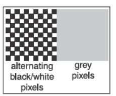
只要调制出的灰色与左侧的棋盘图亮度一致，就达到了亮度=0.5的正灰色。比较亮度可以通过肉眼观测，在两个图离得很远的时候，人眼将会认为棋盘图也只是一个灰色色块。

## 伽马值的意义
如上面所说，直接给γ=2的设备输入一个α=0.5,其显示效果将会是0.25,这比灰色更白。这很不好。所以人们发明了一种办法，称为**伽马校正gamma correct**：屏幕在得到alpha=0.5的时候，不是输出直接0.5，而是输出：
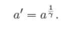
这样稍加计算，就会发现我们只要输入aprime，就能正好得到我们想要的颜色。

## 另一种办法
也可以规定α只能在下面这个集合里面取值：
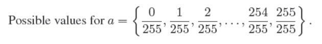
这样的话亮度将会是 **`灯管光强=最大光强Xα^γ`** 得到的256个值。这样一来观测到的亮度也能达到近似的线性。

## 伽马合成
有时候我们需要将两个颜色混合起来，比如以下两种情况：
1.一个红色的边缘遮住了黄色的背景物体，但只是遮住了四分之一左右个像素；
2.红色透光玻璃遮住了黄色的背景物体

这种情况，我们称之为**半透明像素partially transparent pixels**。为了解决这种问题，必须要使用一个称为**像素覆盖率pixel coverage**。我们需要知道前面的像素遮住了后面像素的百分之多少，这个数值也被称为**α分数 fraction a**。合成公式是很简单的：
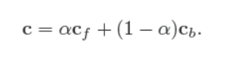
其中c是最终的混合颜色，cf是前像素颜色，cb是后像素颜色。
这个公式既可以用于解释像素部分遮挡，又可以解释透明物体。在后者情况下，α指的是前部玻璃的透光度——alpha=1表示完全不透光，而alpha=0则表示完全透明，但当然完全透明也就不必绘制，从而没有意义。

所有像素的alpha值都应该存放进一张灰度图里，这张图就是**alpha遮罩图alpha mask**或称为**透明度图transparency mask**。有时候也把这部分信息和每个像素的颜色合并，成为RGBA。

## 几种图片格式对应的压缩情况
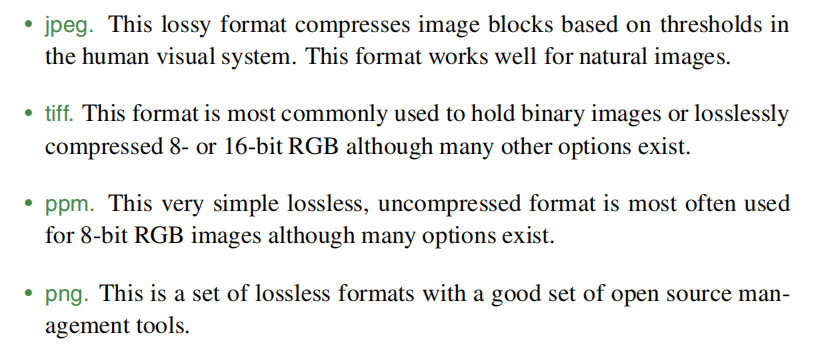

# CH4 Ray Tracing 光线追踪
## 引言
有两种渲染顺序：逐像素地渲染和逐物体地渲染。两种渲染顺序可能绘制出完全一样的画面，但是他们的性能在不同情况下各自不同。总体而言，逐个像素去计算在大多数情况下会更耗时。

光线追踪是一种逐像素的渲染算法。

## 光追算法简述
简单地说，光线追踪的过程就是：对于每一个像素，找出从该像素方向可以**看到**的物体。每个像素都看向一个不同的方向；且每个像素**看到**的物体，必须与一条**视线光线viewing ray**——从光源向各个方向射出的射线——相交，否则无法连成光路，也就不算**看到**。

我们要寻找的物体，就是：
1. 能够被像素**看见**、
2. 能够与一条视线光线相交、
3. 且距离摄像机最近的物体。

找到这个物体后，光追算法就使用**光路与像素视线交点**、表面法线和其他信息来决定这个像素的色彩。

光追有三个步骤：
1. 生成像素视线：计算每个像素**看向**方向的射线的原点与方向向量；
2. 光线求交：让像素视线与场景里的所有物体求交，并得出距离射线原点（也就是像素点与摄像机）最近的一个物体
3. 着色，计算像素颜色

## 透视 Prospective
**线性透视linear prospective**：是指三维世界里的直线，投影成2D后也还是直线的投影方法。

最简单的投影叫做**平行投影parallel projection**，这种投影把物体的每一个三维点沿着一个*投影方向projection direction* 移动直至碰到图像平面/平面/画布。

如果观察方向和画布垂直,这种投影就是正交图orthographics，反之则称为斜交图oblique。

但人眼和摄像机都遵循**透视投影prospective projection**，也就是光线将会在人眼处汇聚一点。在透视投影中，画布选择和**视点view point**位置决定了投影结果。与线性透视一样，观察方向与画布是否垂直可以区分正交和斜交图。

## 计算视线光线viewing ray
3D下的射线可以这样表示，设原点为e，t时间射线上的点位于s，那么：

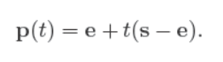
其实就是射线的参数方程;也可以把s-e改为d，即方向向量。
书中定义了一套摄像机为原点的坐标系，以摄像机位置e为原点，摄像机视线方向的反方向为w，摄像机的up方向为v，叉乘得到u。这是一个右手系uvw。

如下图，不论是正交投影还是透视投影，都可以规定image plane，也就是最终呈现的画布。正交投影的画布位于原点位置。
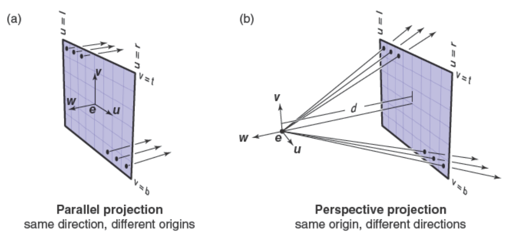

此后进行一个调整，我们可以很轻易地建立起像素(i,j)与画布坐标系位置(u,v)的关系：
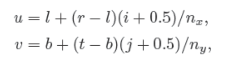
其中像素(0,0)对应图中最左上角的像素，可以发现其uv坐标含有一个半边长(r-l)/2nx

对于正交情况，射线的原点就是每一个像素中心，设**u**为u轴单位向量，**v**为v轴单位向量，那么像素中心用向量表示为**o**=**e**+u**u**+v**v**,其中标量uv是像素中心的uv坐标，可以通过上面的公式转换成ij。

那么可以如下计算出射线的o和d(正交情况)。
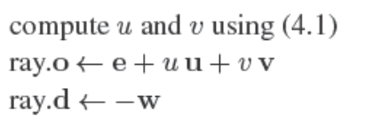

在透视情况下，视线应当从原点e出发，而射线方向我们需要一些参数，可见上面的b图透视投影，d是视点到image plane的距离，u轴方向为u、v轴方向为v，w轴方向为-d(画布上的任何点都是-d)，那么可以得到uv对应像素的像素中心点的坐标(u,v,-d)，那么用此点减去原点(0,0,0)就是方向向量。
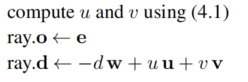

## 射线和对象求交
当我们有了射线e+td，我们要找寻第一次其在t>0下的第一次相交。

如果要与一个隐式表示的表面求交，只要联立射线和表面方程即可。
1. 和球面相交如下：
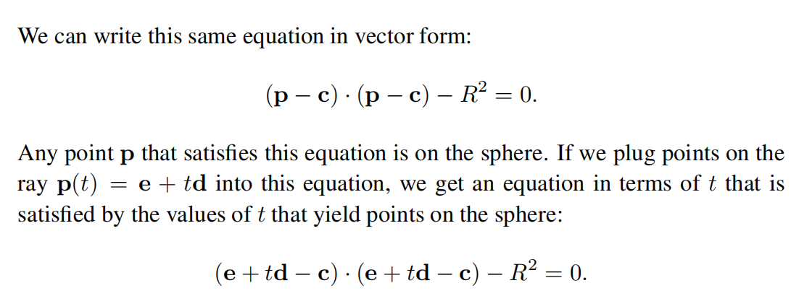

2. 和三角形相交

这也是应用更多的情况，因为大多数时候我们都是要用光追来绘制三角形构成的场景内的大量的模型。书中给出的办法是**重心坐标barycentric coordinates**方法。

三角形有三个顶点**a**，**b**，**c**,那么可以用这样的一个点p参数方程表示p在三角形内(即位于三角形所在平面内、同时在三角形内部)：`p=a+β(b-a)+γ(c-a)`, 其中β和γ必须是两个正数且相加不超过1.
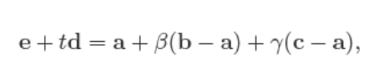
那么这样一来，t和β，γ将会得到三行算式，形成一个齐次方程组：
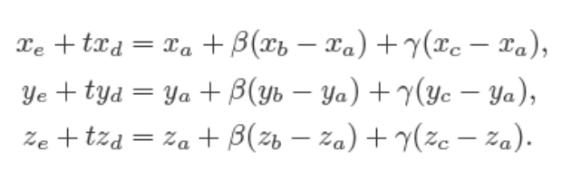
整理成向量形式就可以应用克拉默法则：
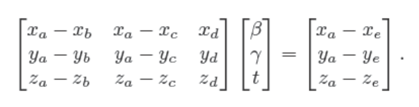
进而得到：
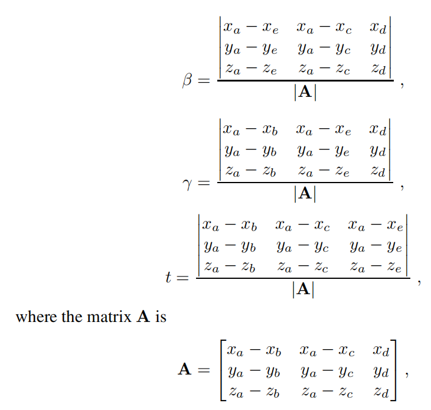
那么我们就可以判断，如果满足t>0,β>0,γ>0且β+γ<1,就能得知intersection发生了。
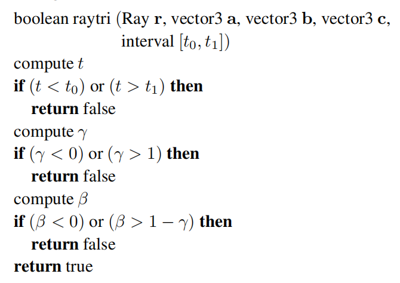

好在大多数时候我们并不需要自己书写上面的克拉默法则部分，所有的图形学API都会提供hit函数：
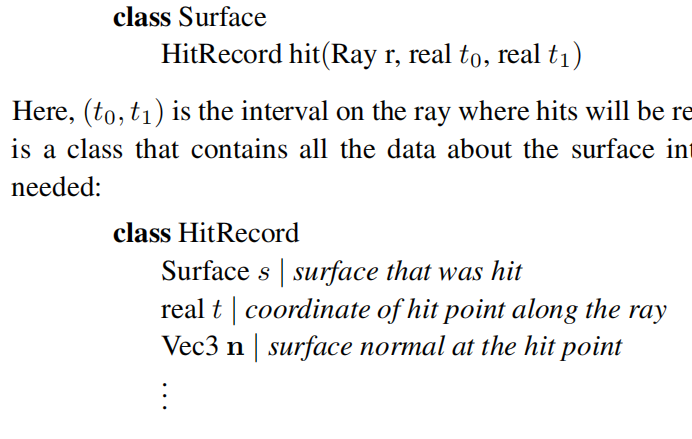