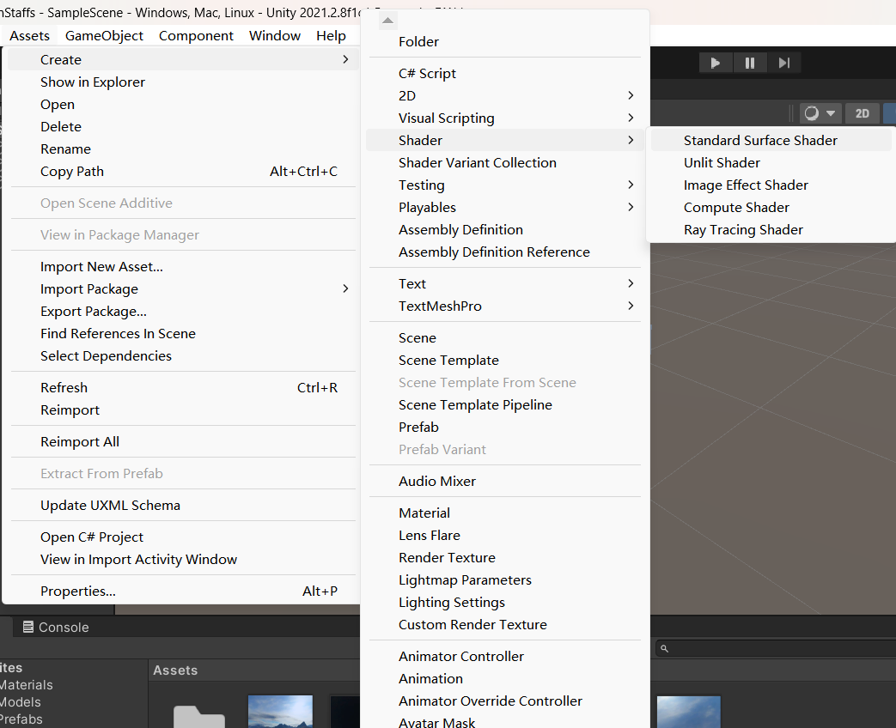
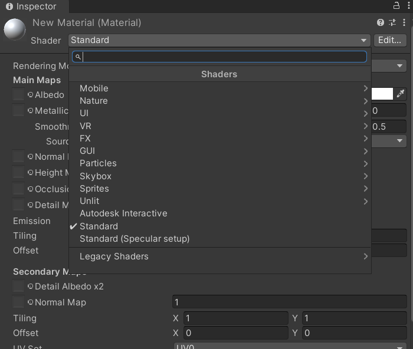
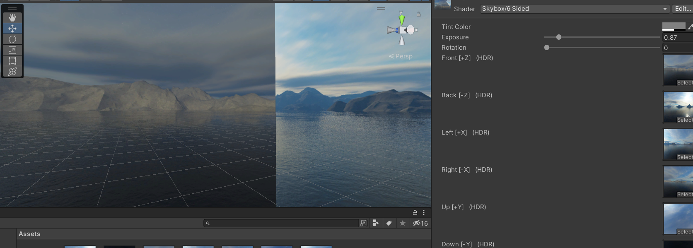
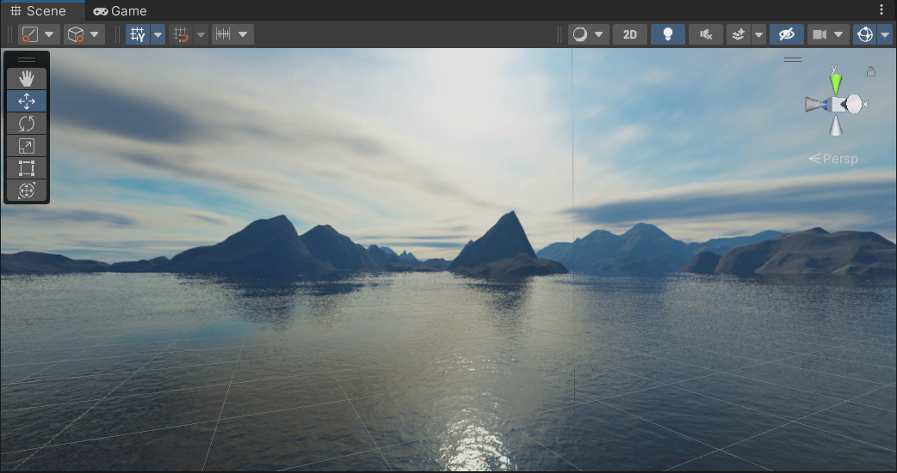

# 前言
写这个笔记的时候我已经在一年前初步接触了Unity，并且已经基本学完了Games101 + learnOpenGL, 这个时候倒过来回头看引擎。

为什么会这样学呢？我现在彻彻底底地颠倒过来了。曾经我把引擎岗和图形岗分的很开，认为学了一边就应该避开另一边，找好自己的精准定位；然而一段时间后我发现，如果像我这种规划学下去，其实是**把图形编程从实践当中剥离出来**了——这对于我的求职没有任何好处。

在学图形的过程中我不断尝试用图形API实现各种效果，比如shadowmap、全局光照等。但是这一切是为了什么呢？事实上，在引擎中这些效果都已经有了**轮子**，用API的过程可以美其名曰了解底层，但是一旦我把图形API实现一些简单效果当成工作重心，我发现能做的事情变得很少。面试时面试官提出我的实践内容太少，不太能问的出问题。一语点醒梦中人，我开始调研游戏行业中各个真实的岗位分别在实践中承担着怎样具体的工作。为什么不用前人造好的轮子做出更宏大的工程、站在引擎的较高起点去做一些实践呢？

下面的这些笔记将以这样的形式组织：我会列出一个个我产生的疑问，每个问题都附加着一个我幻想的需求。最幸运的情况下，我们得以用我猜测的手段实现这个需求；稍差一点的情况下，我可以寻找另一个手段解决这个需求。最坏的情况下，我得出这个需求无法实现的结论。

我并不会按照常规引擎学习的顺序去机械阅读Unity手册，相反地，带着问题去学习引擎更符合软件开发学习的思维模式。

# Q1 如何直接通过shader来影响Unity屏幕输出比如后处理？（这是否被允许）
Q1需求：仿照learnOpenGL关于后处理-模糊的介绍，用模糊核后处理写一个shader来实现影响屏幕输出的功能。
## SubQ1.1 Unity对于Shader的定义是如何的？Ushader和传统Shader有什么重要差异？
回顾一下learnopengl(我常常将他简写为log)当中对于Shader类的介绍: [log着色器类章节](https://learnopengl-cn.github.io/01%20Getting%20started/05%20Shaders/)

在learnOpenGL当中，C++的log程序定义了一个Shader类，其中封装了一些细节。事实上，一个Shader对象是一个vertexShader与一个FragmentShader(他们都是所谓着色器程序类的对象)链接后形成的，我们可以使用Shader类的许多函数来达到两个重要的功能：
1. 设置当前工作的shader，主要用`void Shader::use()`，也通过工作中的shader区分出每个shader对象自己管理自己的uniform量
2. 从内存/C++程序向GPU/Shader程序 通讯uniform量

UnityShader的定义的重要的不同在于(我们这里讨论的是用着色器语言写的那个东西，不是C++或者Unity定义的Shader类哈)：
1. UShader有多层封装的概念。一个Shader里有若干个SubShader，一个子shader里又有若干个Pass，pass当中还有一些信息，也包括了Shader的主体文本。
2. UShader中的主体文本也不是GLSL，而是DX所用的HLSL

## SubQ1.2 能不能创建一个最简单的Shader以显示UShader的工作方式？


# Q2 如何把我的6张图cubemap做成天空盒，进一步地另外两种环境贴图又是什么情况
Unity设计了天空盒着色器，并且把天空盒作为该着色器使用的一种材质。

选择Skybox作为shader类型，而后Skybox shader中又有四种子类型，包括6side，cubemap，panoramic和procedure(并没有看到球谐的skybox选项)

## SubQ2.1 API的环境贴图如何实现
简要概括一下log中环境贴图的做法。
其实环境贴图就可以想象成一个包络摄像机的小盒子，他的六个面构成一个立方体，但是事实上他并没有移动，也没有被设置成无穷大，一切只是一个向量采样的把戏：环境贴图最先绘制、且深度被设置为最大，这样任何东西都可以遮住环境贴图，从而形成一个无穷远处的感觉；环境贴图的绘制和顶点绘制不同，而是
## SubQ2.2 为什么我在log中的天空盒，在Unity中不连贯了？
很简单，在Unity当中，+Z被定义为Front方向，这构成一个左手系；而openGL的-Z方向被定义为Front方向，这构成一个右手系。只要把log等右手系的Front和Back互换，就能得到正确的天空盒效果。

互换Front和Back后得到正确的效果：


同样的问题，还会让top和bottom的顺向出问题，应当让顶面和底面旋转180°。

## SubQ2.3 这种方式生成的天空盒中间有一条线，这要怎么解决？

## SubQ2.4 其他几种天空盒格式如何使用？

# Q3 如何用最快的方式让我的摄像机像log项目中那样移动起来？
可以解决问题的一个办法是写一个C#脚本绑定到摄像机上，但我并不确定这是不是最快的方法。

```cs
using System.Collections;
using System.Collections.Generic;
using UnityEngine;
public class cameraMove : MonoBehaviour
{
    public float rotateSpeed = 100.0f;
    public float moveSpeed = 10.0f;
    Transform trs;

    // Start is called before the first frame update
    void Start()
    {
        trs = GetComponent<Transform>();
    }
    // Update is called once per frame
    void Update()
    {
        float rotateAm = Input.GetAxis("Horizontal") * rotateSpeed;
        float translation = Input.GetAxis("Vertical") * moveSpeed;
        rotateAm *= Time.deltaTime;
        translation *= Time.deltaTime;
        trs.Rotate(0, rotateAm, 0);
        trs.Translate(0, 0, translation);
    }
}

```
# Q4 Unity 的四元数？能用于什么应用场景，如何应用？
